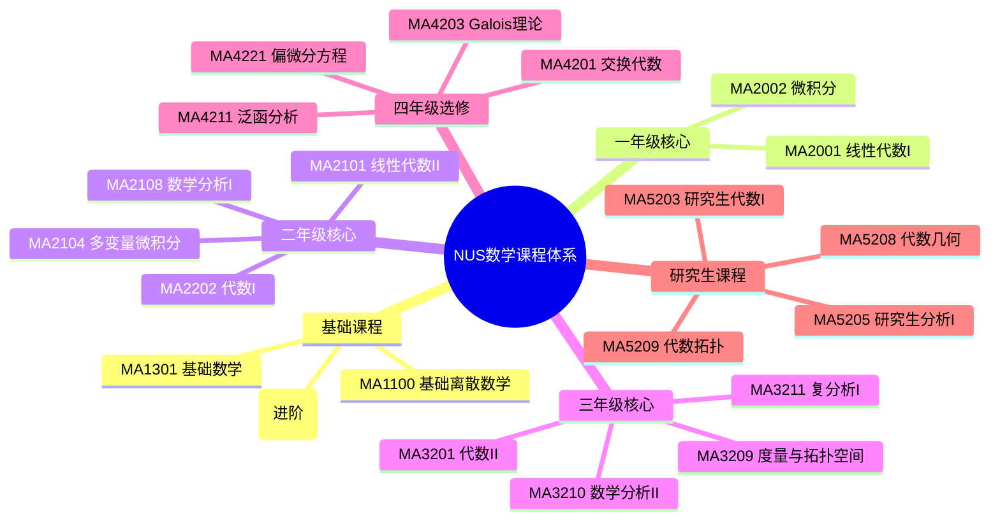
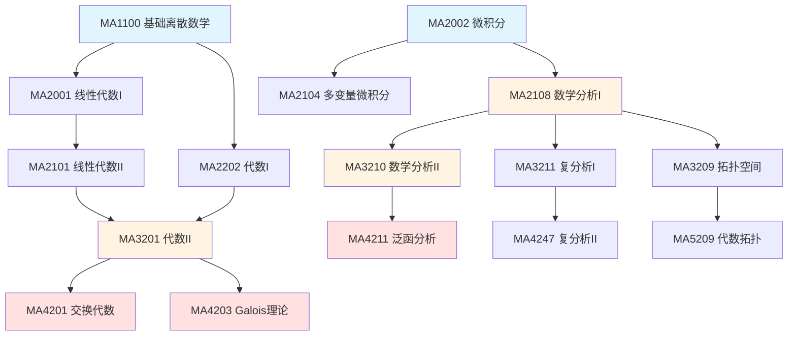

# NUS数学课程对齐报告

**文档类型**：权威对齐 · 国际课程映射  
**创建日期**：2026年4月4日  
**最后复核**：2026年4月4日  
**维护**：建议每学期审阅更新  
**关联**：[project/00-国际课程与机构对齐对照表-2026年4月.md](./project/00-国际课程与机构对齐对照表-2026年4月.md)

---

## 一、概述

### 1.1 对齐目标

本文档旨在将FormalMath项目与**新加坡国立大学(National University of Singapore, NUS)**数学系课程体系进行系统性对齐。NUS数学系在亚洲乃至全球享有盛誉，其课程设置具有以下特点：

- **严谨性**：强调数学证明与概念理解
- **CPA教学法延续**：从具体到抽象的渐进式学习
- **应用导向**：注重数学在实际问题中的应用
- **分层教学**：提供标准版(S)和荣誉版课程

### 1.2 对齐范围

| 课程层级 | 课程代码 | 覆盖领域 |
|---------|---------|---------|
| 基础级 | MA1100/1100T, MA1301 | 离散数学、基础数学 |
| 入门级 | MA2001, MA2002 | 线性代数、微积分 |
| 中级 | MA2101/2101S, MA2104, MA2108/2108S | 线性代数II、多变量微积分、数学分析I |
| 高级 | MA2202, MA3201, MA3209, MA3210, MA3211 | 代数、拓扑、分析、复分析 |
| 研究生 | MA5203-MA5218 | 研究生代数、分析、几何等 |

---

## 二、NUS课程体系概览

### 2.1 课程结构



### 2.2 与新加坡数学教育体系的衔接

NUS数学课程体系与新加坡中小学数学教育（CPA方法）形成良好衔接：

| 教育阶段 | 核心方法 | 关键过渡 |
|---------|---------|---------|
| 小学/中学 | CPA方法（具体→图像→抽象） | 建立直观理解 |
| A-Level | 问题解决方法、数学建模 | 发展抽象思维 |
| NUS本科 | 严格证明、形式化方法 | 掌握现代数学 |
| NUS研究生 | 研究前沿、原始论文 | 独立研究能力 |

---

## 三、课程详细对齐

### 3.1 基础课程 (Level 1000)

#### MA1100 / MA1100T 基础离散数学

| 属性 | 内容 |
|------|------|
| **课程名称** | Basic Discrete Mathematics / Basic Discrete Mathematics (T) |
| **学分** | 4 MCs |
| **先修** | 无 |
| **开设学期** | 第1、2学期 (MA1100)；仅第1学期 (MA1100T) |
| **特点** | MA1100T包含额外公理化集合论内容，难度更高 |

**课程内容**：
- 逻辑与证明方法
- 集合论基础
- 关系与函数
- 数学归纳法
- 计数原理
- 图论基础

**FormalMath对应**：

| NUS主题 | FormalMath篇目 | 覆盖度 |
|---------|---------------|--------|
| 逻辑与证明 | docs/01-基础数学/数理逻辑-深度扩展版.md | 🟢 90% |
| 集合论基础 | docs/01-基础数学/集合论/01-集合论基础-国际标准版.md | 🟢 92% |
| 关系与函数 | docs/01-基础数学/关系与函数-深度扩展版.md | 🟢 88% |
| 数学归纳法 | docs/01-基础数学/数系与运算-深度扩展版.md | 🟢 85% |
| 计数原理 | docs/16-组合数学与图论/组合数学基础.md | 🟢 80% |
| 图论基础 | docs/16-组合数学与图论/图论基础.md | 🟢 82% |

**差异分析**：
- NUS强调**构造性证明**和**算法思维**
- MA1100T包含**ZFC公理化集合论**入门
- FormalMath在形式化定义和严格证明方面更为深入

---

### 3.2 一年级核心课程 (Level 2000)

#### MA2001 线性代数I

| 属性 | 内容 |
|------|------|
| **课程名称** | Linear Algebra I |
| **学分** | 4 MCs |
| **先修** | 无 |
| **对应旧课程** | MA1101R |

**课程内容**：
- 线性方程组与矩阵
- 向量空间基础
- 线性变换
- 行列式
- 特征值与特征向量
- 内积空间

**FormalMath对应**：

| NUS主题 | FormalMath篇目 | 覆盖度 |
|---------|---------------|--------|
| 线性方程组 | docs/02-代数结构/线性代数/线性代数-深度扩展版.md | 🟢 92% |
| 向量空间 | docs/02-代数结构/线性代数/向量空间-深度扩展版.md | 🟢 90% |
| 线性变换 | docs/02-代数结构/线性代数/线性映射-深度扩展版.md | 🟢 88% |
| 行列式 | docs/02-代数结构/线性代数/行列式-深度扩展版.md | 🟢 90% |
| 特征值 | docs/02-代数结构/线性代数/特征值理论-深度扩展版.md | 🟢 85% |
| 内积空间 | docs/02-代数结构/线性代数/内积空间-深度扩展版.md | 🟢 85% |

---

#### MA2002 微积分

| 属性 | 内容 |
|------|------|
| **课程名称** | Calculus |
| **学分** | 4 MCs |
| **先修** | 无 |
| **对应旧课程** | MA1102R |

**课程内容**：
- 极限与连续性
- 一元函数微分
- 一元函数积分
- 微分方程初步
- 级数

**FormalMath对应**：

| NUS主题 | FormalMath篇目 | 覆盖度 |
|---------|---------------|--------|
| 极限与连续 | docs/03-分析学/01-实分析/实分析-深度扩展版.md | 🟢 90% |
| 微分学 | docs/03-分析学/01-实分析/微分学-深度扩展版.md | 🟢 88% |
| 积分学 | docs/03-分析学/01-实分析/积分学-深度扩展版.md | 🟢 88% |
| 级数 | docs/03-分析学/01-实分析/级数理论-深度扩展版.md | 🟢 85% |

---

### 3.3 二年级核心课程 (Level 2000)

#### MA2101 / MA2101S 线性代数II

| 属性 | 内容 |
|------|------|
| **课程名称** | Linear Algebra II / Linear Algebra II (S) |
| **学分** | 4 MCs |
| **先修** | MA2001 |
| **特点** | S版本为荣誉课程，强调证明 |

**课程内容**：
- 抽象向量空间
- 线性变换与矩阵表示
- 特征值与特征向量（深入）
- Jordan标准形
- 双线性形式
- 二次型

**FormalMath对应**：

| NUS主题 | FormalMath篇目 | 覆盖度 |
|---------|---------------|--------|
| 抽象向量空间 | docs/02-代数结构/线性代数/向量空间-深度扩展版.md | 🟢 90% |
| Jordan标准形 | docs/02-代数结构/线性代数/Jordan标准形-深度扩展版.md | 🟢 88% |
| 双线性形式 | docs/02-代数结构/线性代数/双线性形式.md | 🟢 85% |
| 二次型 | docs/02-代数结构/线性代数/二次型.md | 🟢 85% |

---

#### MA2104 多变量微积分

| 属性 | 内容 |
|------|------|
| **课程名称** | Multivariable Calculus |
| **学分** | 4 MCs |
| **先修** | MA2002 |

**课程内容**：
- R^n空间与向量函数
- 多元函数极限与连续
- 偏导数与梯度
- 多元泰勒展开
- 多重积分
- 曲线积分与曲面积分
- Green定理、Stokes定理、Gauss定理

**FormalMath对应**：

| NUS主题 | FormalMath篇目 | 覆盖度 |
|---------|---------------|--------|
| R^n空间 | docs/03-分析学/01-实分析/多元分析-深度扩展版.md | 🟢 90% |
| 偏导数 | docs/03-分析学/01-实分析/偏微分-深度扩展版.md | 🟢 88% |
| 多重积分 | docs/03-分析学/01-实分析/多重积分-深度扩展版.md | 🟢 88% |
| 曲线积分 | docs/03-分析学/01-实分析/曲线积分-深度扩展版.md | 🟢 85% |
| 向量分析 | docs/03-分析学/01-实分析/向量分析-深度扩展版.md | 🟢 85% |

**教材参考**：
- Wong Yan Loi, *MA2104 Multivariable Calculus Lecture Notes*, NUS

---

#### MA2108 / MA2108S 数学分析I

| 属性 | 内容 |
|------|------|
| **课程名称** | Mathematical Analysis I / Mathematical Analysis I (S) |
| **学分** | 4 MCs |
| **先修** | MA2002 |
| **特点** | S版本为荣誉课程，强调严格证明 |

**课程内容**：
- 实数系统与完备性
- 序列与级数（严格理论）
- 连续性（ε-δ定义）
- 微分学（严格理论）
- Riemann积分
- 一致收敛

**FormalMath对应**：

| NUS主题 | FormalMath篇目 | 覆盖度 |
|---------|---------------|--------|
| 实数系统 | docs/03-分析学/01-实分析/实数构造-深度扩展版.md | 🟢 92% |
| 序列与级数 | docs/03-分析学/01-实分析/序列与级数-深度扩展版.md | 🟢 90% |
| 连续性 | docs/03-分析学/01-实分析/连续性-深度扩展版.md | 🟢 90% |
| 微分学 | docs/03-分析学/01-实分析/微分学-深度扩展版.md | 🟢 88% |
| Riemann积分 | docs/03-分析学/01-实分析/Riemann积分-深度扩展版.md | 🟢 88% |
| 一致收敛 | docs/03-分析学/01-实分析/一致收敛-深度扩展版.md | 🟢 85% |

---

#### MA2202 / MA2202S 代数I

| 属性 | 内容 |
|------|------|
| **课程名称** | Algebra I / Algebra I (S) |
| **学分** | 4 MCs |
| **先修** | MA1100 |

**课程内容**：
- 群论基础
- 子群与商群
- 群同态与同构
- 循环群
- 置换群
- 群作用
- Sylow定理

**FormalMath对应**：

| NUS主题 | FormalMath篇目 | 覆盖度 |
|---------|---------------|--------|
| 群论基础 | docs/02-代数结构/群论/群论-深度扩展版.md | 🟢 90% |
| 子群与商群 | docs/02-代数结构/群论/子群与商群-深度扩展版.md | 🟢 88% |
| 群同态 | docs/02-代数结构/群论/群同态-深度扩展版.md | 🟢 88% |
| 循环群 | docs/02-代数结构/群论/循环群-深度扩展版.md | 🟢 85% |
| 置换群 | docs/02-代数结构/群论/置换群-深度扩展版.md | 🟢 85% |
| 群作用 | docs/02-代数结构/群论/群作用-深度扩展版.md | 🟢 82% |
| Sylow定理 | docs/02-代数结构/群论/Sylow定理-深度扩展版.md | 🟢 85% |

---

### 3.4 三年级核心课程 (Level 3000)

#### MA3210 数学分析II

| 属性 | 内容 |
|------|------|
| **课程名称** | Mathematical Analysis II |
| **学分** | 4 MCs |
| **先修** | MA2108 |
| **对应旧课程** | MA3110 |

**课程内容**：
- 多元函数分析
- 隐函数定理
- 反函数定理
- 积分理论（深入）
- Fourier级数

**FormalMath对应**：

| NUS主题 | FormalMath篇目 | 覆盖度 |
|---------|---------------|--------|
| 多元分析 | docs/03-分析学/01-实分析/多元分析-深度扩展版.md | 🟢 88% |
| 隐函数定理 | docs/03-分析学/01-实分析/隐函数定理-深度扩展版.md | 🟢 85% |
| Fourier级数 | docs/03-分析学/01-实分析/Fourier分析-深度扩展版.md | 🟢 82% |

---

#### MA3211 / MA3211S 复分析I

| 属性 | 内容 |
|------|------|
| **课程名称** | Complex Analysis I / Complex Analysis I (S) |
| **学分** | 4 MCs |
| **先修** | MA2108 |
| **对应旧课程** | MA3111 |

**课程内容**：
- 复数与复平面
- 解析函数
- Cauchy-Riemann方程
- 复积分
- Cauchy积分定理
- Cauchy积分公式
- 留数定理
- 共形映射

**FormalMath对应**：

| NUS主题 | FormalMath篇目 | 覆盖度 |
|---------|---------------|--------|
| 解析函数 | docs/03-分析学/复分析/复分析-深度扩展版.md | 🟢 90% |
| Cauchy理论 | docs/03-分析学/复分析/Cauchy定理-深度扩展版.md | 🟢 88% |
| 留数定理 | docs/03-分析学/复分析/留数定理-深度扩展版.md | 🟢 85% |
| 共形映射 | docs/03-分析学/复分析/共形映射-深度扩展版.md | 🟢 82% |

---

#### MA3201 代数II

| 属性 | 内容 |
|------|------|
| **课程名称** | Algebra II |
| **学分** | 4 MCs |
| **先修** | MA2202 |

**课程内容**：
- 环论基础
- 整环与域
- 多项式环
- 理想理论
- 唯一分解整环
- 域扩张
- Galois理论初步

**FormalMath对应**：

| NUS主题 | FormalMath篇目 | 覆盖度 |
|---------|---------------|--------|
| 环论基础 | docs/02-代数结构/环论/环论-深度扩展版.md | 🟢 88% |
| 域论 | docs/02-代数结构/域论/域论-深度扩展版.md | 🟢 85% |
| 多项式环 | docs/02-代数结构/环论/多项式环-深度扩展版.md | 🟢 85% |
| Galois理论 | docs/02-代数结构/域论/Galois理论-深度扩展版.md | 🟢 82% |

---

#### MA3209 度量与拓扑空间

| 属性 | 内容 |
|------|------|
| **课程名称** | Metric and Topological Spaces |
| **学分** | 4 MCs |
| **先修** | MA2108 |

**课程内容**：
- 度量空间
- 开集与闭集
- 连续性（拓扑视角）
- 连通性
- 紧致性
- 拓扑空间基础
- 乘积拓扑
- 商拓扑

**FormalMath对应**：

| NUS主题 | FormalMath篇目 | 覆盖度 |
|---------|---------------|--------|
| 度量空间 | docs/05-拓扑学/度量空间-深度扩展版.md | 🟢 90% |
| 拓扑空间 | docs/05-拓扑学/点集拓扑-深度扩展版.md | 🟢 88% |
| 连续性 | docs/05-拓扑学/连续映射-深度扩展版.md | 🟢 85% |
| 连通性 | docs/05-拓扑学/连通性-深度扩展版.md | 🟢 85% |
| 紧致性 | docs/05-拓扑学/紧致性-深度扩展版.md | 🟢 85% |

---

### 3.5 四年级荣誉课程 (Level 4000)

#### MA4201 交换代数

| 属性 | 内容 |
|------|------|
| **课程名称** | Commutative Algebra |
| **学分** | 4 MCs |
| **先修** | MA3201 |

**FormalMath对应**：
- docs/02-代数结构/交换代数/交换代数-深度扩展版.md
- 数学家理念体系/格洛腾迪克数学理念/02-数学内容深度分析/02-概形理论/

---

#### MA4203 Galois理论

| 属性 | 内容 |
|------|------|
| **课程名称** | Galois Theory |
| **学分** | 4 MCs |
| **先修** | MA3201 |

**FormalMath对应**：
- docs/02-代数结构/域论/Galois理论-深度扩展版.md
- 数学家理念体系/伽罗瓦数学理念/02-数学内容深度分析/

---

#### MA4211 泛函分析

| 属性 | 内容 |
|------|------|
| **课程名称** | Functional Analysis |
| **学分** | 4 MCs |
| **先修** | MA3210 |

**FormalMath对应**：
- docs/12-泛函分析/泛函分析-深度扩展版.md

---

### 3.6 研究生课程 (Level 5000)

#### MA5203 研究生代数I

| 属性 | 内容 |
|------|------|
| **课程名称** | Graduate Algebra I |
| **学分** | 研究生课程 |

**课程内容**：
- 模论
- 表示论基础
- 同调代数初步
- 张量积

**FormalMath对应**：
- docs/02-代数结构/模论/模论-深度扩展版.md
- docs/15-同调代数/同调代数-深度扩展版.md

---

#### MA5205 / MA5206 研究生分析I/II

| 属性 | 内容 |
|------|------|
| **课程名称** | Graduate Analysis I / Graduate Analysis II |
| **学分** | 研究生课程 |

**课程内容**：
- 测度论
- Lebesgue积分
- 泛函分析（深入）
- Fourier分析
- 分布理论

**FormalMath对应**：
- docs/03-分析学/实分析/测度论-深度扩展版.md
- docs/03-分析学/实分析/Lebesgue积分-深度扩展版.md
- docs/03-分析学/实分析/Fourier分析-深度扩展版.md

---

#### MA5208 代数几何

| 属性 | 内容 |
|------|------|
| **课程名称** | Algebraic Geometry |
| **学分** | 研究生课程 |

**FormalMath对应**：
- 数学家理念体系/格洛腾迪克数学理念/02-数学内容深度分析/02-概形理论/
- docs/13-代数几何/概形理论-深度扩展版.md

---

#### MA5209 代数拓扑

| 属性 | 内容 |
|------|------|
| **课程名称** | Algebraic Topology |
| **学分** | 研究生课程 |

**FormalMath对应**：
- docs/05-拓扑学/代数拓扑-深度扩展版.md

---

#### MA5216 微分几何

| 属性 | 内容 |
|------|------|
| **课程名称** | Differential Geometry |
| **学分** | 研究生课程 |

**FormalMath对应**：
- docs/14-微分几何/微分几何-深度扩展版.md

---

## 四、新加坡数学教育特色与FormalMath整合

### 4.1 CPA方法的延续

NUS数学教育延续了新加坡中小学CPA（Concrete-Pictorial-Abstract）方法的精神：

| 教育阶段 | CPA阶段 | NUS课程体现 | FormalMath对应 |
|---------|--------|------------|---------------|
| 小学 | 具体(Concrete) | 无直接对应 | 概念/直观理解部分 |
| 中学 | 图像(Pictorial) | 直观解释、图示 | 思维表征、矩阵对比 |
| NUS本科 | 抽象(Abstract) | 严格证明、形式化 | 形式化定义、数学论证 |

**整合建议**：
- 在FormalMath文档中保持从具体到抽象的渐进结构
- 为NUS学生提供从直观理解到严格证明的过渡路径

### 4.2 问题解决能力培养

新加坡数学教育强调Polya四步法：

| Polya步骤 | NUS课程应用 | FormalMath对应 |
|----------|------------|---------------|
| 理解问题 | 问题分析、概念识别 | 数学解释/直观理解 |
| 制定计划 | 选择证明策略 | 数学论证/猜想 |
| 执行计划 | 严格证明 | 数学论证/证明 |
| 检查答案 | 验证、反思 | 数学论证/反思 |

### 4.3 建模与应用

NUS应用数学专业强调数学建模：

| 课程 | 建模应用 | FormalMath对应 |
|------|---------|---------------|
| MA3264 数学建模 | 实际问题建模 | docs/实战问题解决/ |
| MA3269 数学金融I | 金融建模 | docs/25-金融数学/ |
| MA3270 人工智能数学 | AI应用 | docs/29-数据科学/ |

---

## 五、与其他国际课程对比

### 5.1 分析学序列对比

| 学校 | 课程序列 | 特点 |
|------|---------|------|
| **NUS** | MA2002 → MA2108 → MA3210 | 标准分析序列，强调严格证明 |
| **MIT** | 18.01 → 18.02 → 18.100 | 18.100为分析学导论 |
| **Harvard** | Math 1a/b → Math 112 | Math 112为 honors 分析 |
| **Toronto** | MAT137 → MAT237 → MAT337 | 证明导向 |
| **Oxford** | A2 Analysis → Part A Analysis | 三年连续分析课程 |

### 5.2 代数学序列对比

| 学校 | 课程序列 | 特点 |
|------|---------|------|
| **NUS** | MA2202 → MA3201 → MA4201/4203 | 群→环→Galois/交换代数 |
| **MIT** | 18.701 → 18.702 → 18.705 | 标准抽象代数序列 |
| **Harvard** | Math 122 → Math 123 | 两年抽象代数 |
| **Oxford** | A3 Groups → A6 Rings → B1 Algebra | 螺旋式深入 |

---

## 六、课程依赖关系图



---

## 七、概念映射表

### 7.1 基础概念映射

| NUS课程 | 核心概念 | FormalMath文档 | MSC编码 |
|---------|---------|---------------|---------|
| MA1100 | 集合论 | docs/01-基础数学/集合论/ | 03Exx |
| MA1100 | 逻辑 | docs/01-基础数学/数理逻辑/ | 03Bxx |
| MA2001 | 向量空间 | docs/02-代数结构/线性代数/ | 15Axx |
| MA2002 | 实数系统 | docs/03-分析学/01-实分析/ | 26Axx |
| MA2108 | 极限理论 | docs/03-分析学/01-实分析/ | 26A03 |
| MA2202 | 群 | docs/02-代数结构/群论/ | 20Axx |

### 7.2 高级概念映射

| NUS课程 | 核心概念 | FormalMath文档 | MSC编码 |
|---------|---------|---------------|---------|
| MA3201 | 环与模 | docs/02-代数结构/环论/ | 16Dxx |
| MA3201 | 域扩张 | docs/02-代数结构/域论/ | 12Fxx |
| MA3209 | 拓扑空间 | docs/05-拓扑学/ | 54Axx |
| MA3211 | 复分析 | docs/03-分析学/复分析/ | 30Axx |
| MA4203 | Galois理论 | docs/02-代数结构/域论/ | 12F10 |
| MA4211 | 泛函分析 | docs/12-泛函分析/ | 46Axx |

---

## 八、实施建议

### 8.1 学习路径推荐

**标准路径（面向一般学生）**：
```
MA1100 → MA2001 → MA2002 → MA2101 → MA2104 → MA2108 
→ MA2202 → MA3210/MA3211/MA3201/MA3209 → 4000级选修
```

**荣誉路径（面向优秀学生）**：
```
MA1100T → MA2001 → MA2002 → MA2101S → MA2108S → MA2202S
→ MA3210/MA3211S/MA3201/MA3209 → MA4201/MA4203/MA4211 → 研究生课程
```

### 8.2 FormalMath使用指南

| 学习阶段 | 推荐文档类型 | 使用方式 |
|---------|-------------|---------|
| 预习阶段 | -基础版.md | 建立概念框架 |
| 学习阶段 | -增强版.md | 理解定理与例子 |
| 复习阶段 | -深度扩展版.md | 深入理解证明 |
| 考试准备 | -国际标准版.md | 对齐国际课程 |

### 8.3 补充资源

| NUS课程 | 推荐补充资源 |
|---------|-------------|
| MA2108 | 数学家理念体系/柯西数学理念/ |
| MA3210 | 数学家理念体系/黎曼数学理念/ |
| MA3201 | 数学家理念体系/伽罗瓦数学理念/ |
| MA4201 | 数学家理念体系/格洛腾迪克数学理念/ |
| MA4211 | 数学家理念体系/巴拿赫数学理念/ |

---

## 九、版本更新记录

| 日期 | 版本 | 更新内容 |
|------|------|----------|
| 2026-04-04 | v1.0 | 初始创建，完成NUS核心课程对齐 |

---

## 十、维护说明

### 10.1 更新频率
- **建议**：每学期审阅一次
- **下次复核**：2026年8月（2026-27学年课程表发布后）

### 10.2 复核清单
- [ ] NUS课程表更新
- [ ] 课程内容变更
- [ ] FormalMath文档更新
- [ ] MSC编码验证

### 10.3 相关文档
- [project/00-国际课程与机构对齐对照表-2026年4月.md](./project/00-国际课程与机构对齐对照表-2026年4月.md)
- [concept/00-新加坡数学教育方法深入研究-2025年11月28日.md](./concept/00-新加坡数学教育方法深入研究-2025年11月28日.md)
- [concept/00-新加坡数学教育知识归纳-2025年11月28日.md](./concept/00-新加坡数学教育知识归纳-2025年11月28日.md)

---

**文档状态**：v1.0（2026年4月创建）  
**最后更新**：2026年4月4日  
**复核人**：系统自动生成
