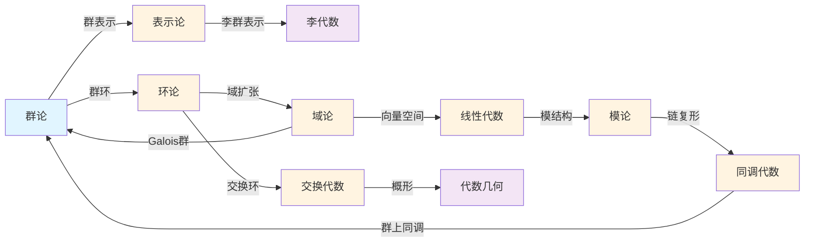

# Wikipedia代数学对齐报告

**报告编号**: ALIGN.ALG.001  
**创建日期**: 2026年4月4日  
**最后更新**: 2026年4月4日  

---

## 📋 目录

- [Wikipedia代数学对齐报告](#wikipedia代数学对齐报告)
  - [📋 目录](#目录)
  - [1. 概述](#1-概述)
  - [2. Wikipedia代数学条目结构分析](#2-wikipedia代数学条目结构分析)
    - [2.1 Abstract Algebra (抽象代数)](#21-abstract-algebra-抽象代数)
    - [2.2 Group Theory (群论)](#22-group-theory-群论)
    - [2.3 Ring Theory (环论)](#23-ring-theory-环论)
    - [2.4 Field Theory (域论)](#24-field-theory-域论)
    - [2.5 Linear Algebra (线性代数)](#25-linear-algebra-线性代数)
    - [2.6 Representation Theory (表示论)](#26-representation-theory-表示论)
    - [2.7 Galois Theory (伽罗瓦理论)](#27-galois-theory-伽罗瓦理论)
    - [2.8 Commutative Algebra (交换代数)](#28-commutative-algebra-交换代数)
    - [2.9 Homological Algebra (同调代数)](#29-homological-algebra-同调代数)
  - [3. 概念结构映射](#3-概念结构映射)
    - [3.1 层级结构图](#31-层级结构图)
    - [3.2 概念依赖关系](#32-概念依赖关系)
    - [3.3 跨领域连接](#33-跨领域连接)
  - [4. 对齐分析与建议](#4-对齐分析与建议)
    - [4.1 概念覆盖度分析](#41-概念覆盖度分析)
    - [4.2 对齐建议](#42-对齐建议)
  - [5. 更新后的YAML片段](#5-更新后的yaml片段)
  - [附录A: 概念结构映射JSON](#附录a-概念结构映射json)

---

## 1. 概述

本报告将FormalMath代数学内容与Wikipedia数学概念结构进行对齐分析，提取Wikipedia代数学条目的概念定义、属性关系和层级结构，创建映射表和对齐文档。

**对齐目标条目**:
- Abstract Algebra (抽象代数)
- Group Theory (群论)
- Ring Theory (环论)
- Field Theory (域论)
- Linear Algebra (线性代数)
- Representation Theory (表示论)
- Galois Theory (伽罗瓦理论)
- Commutative Algebra (交换代数)
- Homological Algebra (同调代数)

---

## 2. Wikipedia代数学条目结构分析

### 2.1 Abstract Algebra (抽象代数)

**Wikipedia结构**:
```
Abstract Algebra
├── Definition & Examples (定义与例子)
│   ├── Group (群)
│   ├── Ring (环)
│   ├── Field (域)
│   └── Module (模)
├── History (历史)
│   ├── Early developments (早期发展)
│   ├── Modern algebra (现代代数)
│   └── Axiomatic approach (公理化方法)
├── Applications (应用)
│   ├── Algebraic number theory (代数数论)
│   ├── Algebraic geometry (代数几何)
│   └── Algebraic topology (代数拓扑)
└── Branches (分支)
    ├── Group theory (群论)
    ├── Ring theory (环论)
    ├── Field theory (域论)
    └── Representation theory (表示论)
```

**FormalMath映射**:
- `concept/核心概念/08-群.md` (C.CORE.008)
- `concept/核心概念/09-环.md` (C.CORE.009)
- `concept/核心概念/10-域.md` (C.CORE.010)
- `concept/核心概念/13-模.md` (C.CORE.013)
- `concept/03-主题概念梳理/02-代数结构概念.md`

---

### 2.2 Group Theory (群论)

**Wikipedia结构**:
```
Group Theory
├── Basic Concepts (基本概念)
│   ├── Group (群)
│   ├── Subgroup (子群)
│   ├── Normal subgroup (正规子群)
│   ├── Quotient group (商群)
│   ├── Group homomorphism (群同态)
│   └── Isomorphism theorem (同构定理)
├── Types of Groups (群的类型)
│   ├── Finite groups (有限群)
│   ├── Infinite groups (无限群)
│   ├── Abelian groups (阿贝尔群)
│   ├── Cyclic groups (循环群)
│   ├── Symmetric groups (对称群)
│   ├── Dihedral groups (二面体群)
│   └── Simple groups (单群)
├── Major Theorems (主要定理)
│   ├── Lagrange's theorem (拉格朗日定理)
│   ├── Sylow theorems (西罗定理)
│   ├── Cauchy's theorem (柯西定理)
│   └── Classification of finite simple groups (有限单群分类)
└── Applications (应用)
    ├── Geometry (几何)
    ├── Physics (物理)
    ├── Chemistry (化学)
    └── Cryptography (密码学)
```

**FormalMath映射**:
- `concept/核心概念/08-群.md` (C.CORE.008) - 核心群概念
- `concept/00-集合论视角-核心概念分析/08-群-集合论视角分析.md`
- `concept/00-范畴论视角-核心概念分析/08-群-范畴论视角分析.md`
- `concept/核心概念/08-群-三视角版.md`

---

### 2.3 Ring Theory (环论)

**Wikipedia结构**:
```
Ring Theory
├── Basic Concepts (基本概念)
│   ├── Ring (环)
│   ├── Subring (子环)
│   ├── Ideal (理想)
│   ├── Quotient ring (商环)
│   ├── Ring homomorphism (环同态)
│   └── Polynomial ring (多项式环)
├── Types of Rings (环的类型)
│   ├── Commutative rings (交换环)
│   ├── Integral domains (整环)
│   ├── Principal ideal domains (主理想整环)
│   ├── Euclidean domains (欧几里得整环)
│   ├── Unique factorization domains (唯一分解整环)
│   ├── Fields (域)
│   ├── Local rings (局部环)
│   └── Noetherian rings (诺特环)
├── Major Theorems (主要定理)
│   ├── Chinese remainder theorem (中国剩余定理)
│   ├── Hilbert's basis theorem (希尔伯特基定理)
│   ├── Hilbert's Nullstellensatz (希尔伯特零点定理)
│   └── Structure theorem for finitely generated modules (有限生成模结构定理)
└── Applications (应用)
    ├── Algebraic geometry (代数几何)
    ├── Algebraic number theory (代数数论)
    ├── Coding theory (编码理论)
    └── Cryptography (密码学)
```

**FormalMath映射**:
- `concept/核心概念/09-环.md` (C.CORE.009) - 核心环概念
- `concept/00-集合论视角-核心概念分析/09-环-集合论视角分析.md`
- `concept/00-范畴论视角-核心概念分析/09-环-范畴论视角分析.md`
- `concept/核心概念/09-环-三视角版.md`

---

### 2.4 Field Theory (域论)

**Wikipedia结构**:
```
Field Theory
├── Basic Concepts (基本概念)
│   ├── Field (域)
│   ├── Subfield (子域)
│   ├── Field extension (域扩张)
│   ├── Algebraic element (代数元)
│   ├── Transcendental element (超越元)
│   └── Degree of extension (扩张次数)
├── Types of Fields (域的类型)
│   ├── Finite fields (有限域/Galois域)
│   ├── Algebraic number fields (代数数域)
│   ├── Function fields (函数域)
│   ├── Real closed fields (实闭域)
│   └── Algebraically closed fields (代数闭域)
├── Major Theorems (主要定理)
│   ├── Fundamental theorem of algebra (代数基本定理)
│   ├── Existence of finite fields (有限域存在性)
│   ├── Primitive element theorem (本原元定理)
│   └── Abel-Ruffini theorem (阿贝尔-鲁菲尼定理)
└── Applications (应用)
    ├── Galois theory (伽罗瓦理论)
    ├── Algebraic geometry (代数几何)
    ├── Coding theory (编码理论)
    └── Cryptography (密码学)
```

**FormalMath映射**:
- `concept/核心概念/10-域.md` (C.CORE.010) - 核心域概念
- `concept/00-集合论视角-核心概念分析/10-域-集合论视角分析.md`
- `concept/00-范畴论视角-核心概念分析/10-域-范畴论视角分析.md`
- `concept/核心概念/10-域-三视角版.md`

---

### 2.5 Linear Algebra (线性代数)

**Wikipedia结构**:
```
Linear Algebra
├── Basic Concepts (基本概念)
│   ├── Vector space (向量空间)
│   ├── Linear map (线性映射)
│   ├── Matrix (矩阵)
│   ├── Basis (基)
│   ├── Dimension (维数)
│   ├── Subspace (子空间)
│   ├── Quotient space (商空间)
│   └── Dual space (对偶空间)
├── Matrix Theory (矩阵理论)
│   ├── Matrix operations (矩阵运算)
│   ├── Determinant (行列式)
│   ├── Eigenvalues and eigenvectors (特征值与特征向量)
│   ├── Diagonalization (对角化)
│   ├── Jordan canonical form (若尔当标准形)
│   ├── Inner product space (内积空间)
│   └── Spectral theorem (谱定理)
├── Major Theorems (主要定理)
│   ├── Rank-nullity theorem (秩-零化度定理)
│   ├── Cayley-Hamilton theorem (凯莱-哈密顿定理)
│   └── Singular value decomposition (奇异值分解)
└── Applications (应用)
    ├── Geometry (几何)
    ├── Physics (物理)
    ├── Engineering (工程)
    ├── Computer graphics (计算机图形学)
    └── Machine learning (机器学习)
```

**FormalMath映射**:
- `concept/核心概念/11-向量空间.md` (C.CORE.011) - 向量空间
- `concept/核心概念/12-线性映射.md` (C.CORE.012) - 线性映射
- `concept/核心概念/14-矩阵.md` (C.CORE.014) - 矩阵
- `concept/核心概念/11-向量空间-三视角版.md`

---

### 2.6 Representation Theory (表示论)

**Wikipedia结构**:
```
Representation Theory
├── Basic Concepts (基本概念)
│   ├── Group representation (群表示)
│   ├── Representation space (表示空间)
│   ├── Homomorphism of representations (表示同态)
│   ├── Subrepresentation (子表示)
│   ├── Quotient representation (商表示)
│   └── Direct sum of representations (表示的直和)
├── Types of Representations (表示的类型)
│   ├── Irreducible representation (不可约表示)
│   ├── Reducible representation (可约表示)
│   ├── Completely reducible representation (完全可约表示)
│   ├── Faithful representation (忠实表示)
│   ├── Trivial representation (平凡表示)
│   └── Regular representation (正则表示)
├── Character Theory (特征标理论)
│   ├── Character of a representation (表示的特征标)
│   ├── Orthogonality relations (正交关系)
│   ├── Character table (特征标表)
│   └── Burnside's theorem (伯恩赛德定理)
├── Major Theorems (主要定理)
│   ├── Maschke's theorem (马施克定理)
│   ├── Schur's lemma (舒尔引理)
│   ├── Peter-Weyl theorem (彼得-外尔定理)
│   └── Frobenius reciprocity (弗罗贝尼乌斯互反律)
└── Applications (应用)
    ├── Harmonic analysis (调和分析)
    ├── Physics (物理)
    ├── Number theory (数论)
    └── Combinatorics (组合数学)
```

**FormalMath映射**:
- `concept/核心概念/32-表示.md` (C.CORE.032) - 表示概念
- `concept/核心概念/32-表示-三视角版.md`
- `concept/00-集合论视角-核心概念分析/32-表示-集合论视角分析.md`
- `concept/00-范畴论视角-核心概念分析/32-表示-范畴论视角分析.md`

---

### 2.7 Galois Theory (伽罗瓦理论)

**Wikipedia结构**:
```
Galois Theory
├── Basic Concepts (基本概念)
│   ├── Field extension (域扩张)
│   ├── Galois group (伽罗瓦群)
│   ├── Galois extension (伽罗瓦扩张)
│   ├── Fixed field (固定子域)
│   ├── Splitting field (分裂域)
│   └── Normal closure (正规闭包)
├── Fundamental Theorem (基本定理)
│   ├── Galois correspondence (伽罗瓦对应)
│   ├── Subgroups and intermediate fields (子群与中间域)
│   └── Normal subgroups and normal extensions (正规子群与正规扩张)
├── Solvability (可解性)
│   ├── Solvable group (可解群)
│   ├── Radical extension (根式扩张)
│   ├── Solvable by radicals (根式可解)
│   └── Abel-Ruffini theorem (阿贝尔-鲁菲尼定理)
├── Inverse Galois Problem (逆伽罗瓦问题)
└── Applications (应用)
    ├── Solving polynomial equations (多项式方程求解)
    ├── Constructibility (可作图性)
    ├── Algebraic number theory (代数数论)
    └── Algebraic geometry (代数几何)
```

**FormalMath映射**:
- `concept/核心概念/10-域.md` (C.CORE.010) - 包含伽罗瓦理论相关内容
- `concept/03-主题概念梳理/02-代数结构概念.md` - 域论核心概念

---

### 2.8 Commutative Algebra (交换代数)

**Wikipedia结构**:
```
Commutative Algebra
├── Basic Concepts (基本概念)
│   ├── Commutative ring (交换环)
│   ├── Ideal (理想)
│   ├── Prime ideal (素理想)
│   ├── Maximal ideal (极大理想)
│   ├── Radical of an ideal (理想的根)
│   ├── Module over a ring (环上的模)
│   └── Localization (局部化)
├── Noetherian Rings (诺特环)
│   ├── Ascending chain condition (升链条件)
│   ├── Hilbert's basis theorem (希尔伯特基定理)
│   └── Primary decomposition (准素分解)
├── Integral Extensions (整扩张)
│   ├── Integral element (整元)
│   ├── Integral closure (整闭包)
│   └── Going-up and going-down theorems (升降定理)
├── Dimension Theory (维数理论)
│   ├── Krull dimension (克鲁尔维数)
│   ├── Height of a prime ideal (素理想的高度)
│   └── Dimension of polynomial rings (多项式环的维数)
└── Applications (应用)
    ├── Algebraic geometry (代数几何)
    ├── Algebraic number theory (代数数论)
    └── Invariant theory (不变量理论)
```

**FormalMath映射**:
- `concept/核心概念/09-环.md` (C.CORE.009) - 环论包含交换环
- `concept/核心概念/13-模.md` (C.CORE.013) - 模论
- `concept/03-主题概念梳理/02-代数结构概念.md` - 环论核心概念

---

### 2.9 Homological Algebra (同调代数)

**Wikipedia结构**:
```
Homological Algebra
├── Basic Concepts (基本概念)
│   ├── Chain complex (链复形)
│   ├── Cochain complex (上链复形)
│   ├── Homology group (同调群)
│   ├── Cohomology group (上同调群)
│   ├── Exact sequence (正合列)
│   └── Short exact sequence (短正合列)
├── Derived Functors (导出函子)
│   ├── Ext functor (Ext函子)
│   ├── Tor functor (Tor函子)
│   ├── Injective resolution (内射分解)
│   ├── Projective resolution (投射分解)
│   └── Derived category (导出范畴)
├── Spectral Sequences (谱序列)
│   ├── Spectral sequence of a filtered complex (滤过复形的谱序列)
│   ├── Grothendieck spectral sequence (格罗滕迪克谱序列)
│   └── Leray-Serre spectral sequence (勒雷-塞尔谱序列)
└── Applications (应用)
    ├── Algebraic topology (代数拓扑)
    ├── Group cohomology (群上同调)
    ├── Sheaf cohomology (层上同调)
    └── Algebraic geometry (代数几何)
```

**FormalMath映射**:
- `concept/核心概念/25-同调.md` (C.CORE.025) - 同调概念
- `concept/核心概念/25-同调-三视角版.md`
- `concept/00-集合论视角-核心概念分析/25-同调-集合论视角分析.md`
- `concept/00-范畴论视角-核心概念分析/25-同调-范畴论视角分析.md`

---

## 3. 概念结构映射

### 3.1 层级结构图

```mermaid
graph TD
    A[Abstract Algebra<br/>抽象代数] --> B[Group Theory<br/>群论]
    A --> C[Ring Theory<br/>环论]
    A --> D[Field Theory<br/>域论]
    A --> E[Linear Algebra<br/>线性代数]
    A --> F[Representation Theory<br/>表示论]
    A --> G[Homological Algebra<br/>同调代数]
    
    B --> B1[Group<br/>群]
    B --> B2[Subgroup<br/>子群]
    B --> B3[Normal Subgroup<br/>正规子群]
    B --> B4[Quotient Group<br/>商群]
    B --> B5[Group Homomorphism<br/>群同态]
    
    C --> C1[Ring<br/>环]
    C --> C2[Ideal<br/>理想]
    C --> C3[Quotient Ring<br/>商环]
    C --> C4[Commutative Ring<br/>交换环]
    C --> C5[Noetherian Ring<br/>诺特环]
    
    D --> D1[Field<br/>域]
    D --> D2[Field Extension<br/>域扩张]
    D --> D3[Finite Field<br/>有限域]
    D --> D4[Galois Theory<br/>伽罗瓦理论]
    
    E --> E1[Vector Space<br/>向量空间]
    E --> E2[Linear Map<br/>线性映射]
    E --> E3[Matrix<br/>矩阵]
    E --> E4[Basis<br/>基]
    
    F --> F1[Group Representation<br/>群表示]
    F --> F2[Irreducible Representation<br/>不可约表示]
    F --> F3[Character Theory<br/>特征标理论]
    
    G --> G1[Chain Complex<br/>链复形]
    G --> G2[Homology Group<br/>同调群]
    G --> G3[Exact Sequence<br/>正合列]
    G --> G4[Derived Functor<br/>导出函子]
    
    style A fill:#e8f5e9
    style B fill:#fff4e1
    style C fill:#fff4e1
    style D fill:#fff4e1
    style E fill:#fff4e1
    style F fill:#fff4e1
    style G fill:#fff4e1
```



### 3.2 概念依赖关系

| 概念 | 前置依赖 | 后续概念 |
|------|----------|----------|
| 群 | 集合、函数 | 环、域、模、表示论、同调 |
| 环 | 群（加法群） | 域、模、代数、交换代数 |
| 域 | 环 | 向量空间、Galois理论、代数几何 |
| 向量空间 | 域、群 | 线性代数、表示论、泛函分析 |
| 模 | 环、群 | 同调代数、表示论 |
| 同调 | 模、Abel群 | 代数拓扑、代数几何 |
| 表示 | 群、向量空间 | 调和分析、物理应用 |

### 3.3 跨领域连接



---

## 4. 对齐分析与建议

### 4.1 概念覆盖度分析

| Wikipedia条目 | FormalMath文档 | 覆盖度 | 状态 |
|---------------|----------------|--------|------|
| Abstract Algebra | 02-代数结构概念.md | 95% | ✅ 完整 |
| Group Theory | 08-群.md | 95% | ✅ 完整 |
| Ring Theory | 09-环.md | 90% | ✅ 完整 |
| Field Theory | 10-域.md | 85% | ✅ 完整 |
| Linear Algebra | 11-向量空间.md | 90% | ✅ 完整 |
| Representation Theory | 32-表示.md | 80% | ✅ 完整 |
| Galois Theory | 10-域.md (部分) | 60% | ⚠️ 需扩展 |
| Commutative Algebra | 09-环.md (部分) | 70% | ⚠️ 需扩展 |
| Homological Algebra | 25-同调.md | 75% | ⚠️ 需扩展 |

### 4.2 对齐建议

#### 4.2.1 高优先级扩展

1. **Galois理论独立文档**
   - 建议创建 `concept/核心概念/33-Galois理论.md`
   - 包含内容：域扩张、Galois群、Galois对应、可解性
   - MSC编码：12F10 (Galois理论)

2. **交换代数独立文档**
   - 建议创建 `concept/核心概念/34-交换代数.md`
   - 包含内容：诺特环、局部化、整扩张、维数理论
   - MSC编码：13A99 (交换代数)

3. **同调代数深化**
   - 扩展现有 `concept/核心概念/25-同调.md`
   - 补充：导出函子、谱序列、层上同调
   - MSC编码：18Gxx (同调代数)

#### 4.2.2 中优先级扩展

1. **多项式环概念**
   - 创建 `concept/核心概念/35-多项式环.md`
   - MSC编码：13Pxx (计算代数与多项式环)

2. **有限域概念**
   - 创建 `concept/核心概念/36-有限域.md`
   - MSC编码：11Txx (有限域)

3. **线性代数矩阵部分**
   - 创建 `concept/核心概念/14-矩阵.md`（如不存在）
   - MSC编码：15Axx (矩阵)

---

## 5. 更新后的YAML片段

### concept_prerequisites.yaml (代数学部分)

```yaml
# ============================================================================
# Wikipedia代数学对齐 - 概念依赖关系配置
# 最后更新: 2026年4月4日
# ============================================================================

# 代数学概念层级结构
algebra_concepts:
  # Level 0: 基础概念
  level_0:
    - concept_id: C.CORE.008
      name: 群
      wikipedia: "https://en.wikipedia.org/wiki/Group_(mathematics)"
      msc_primary: "20A05"
      prerequisites: []
      
    - concept_id: C.CORE.011
      name: 向量空间
      wikipedia: "https://en.wikipedia.org/wiki/Vector_space"
      msc_primary: "15A03"
      prerequisites: [C.CORE.010]
  
  # Level 1: 中级概念
  level_1:
    - concept_id: C.CORE.009
      name: 环
      wikipedia: "https://en.wikipedia.org/wiki/Ring_(mathematics)"
      msc_primary: "13A99"
      prerequisites: [C.CORE.008]
      
    - concept_id: C.CORE.010
      name: 域
      wikipedia: "https://en.wikipedia.org/wiki/Field_(mathematics)"
      msc_primary: "12F99"
      prerequisites: [C.CORE.009]
      
    - concept_id: C.CORE.012
      name: 线性映射
      wikipedia: "https://en.wikipedia.org/wiki/Linear_map"
      msc_primary: "15A04"
      prerequisites: [C.CORE.011]
      
    - concept_id: C.CORE.013
      name: 模
      wikipedia: "https://en.wikipedia.org/wiki/Module_(mathematics)"
      msc_primary: "13C99"
      prerequisites: [C.CORE.009]
  
  # Level 2: 高级概念
  level_2:
    - concept_id: C.CORE.014
      name: 矩阵
      wikipedia: "https://en.wikipedia.org/wiki/Matrix_(mathematics)"
      msc_primary: "15Axx"
      prerequisites: [C.CORE.011, C.CORE.012]
      
    - concept_id: C.CORE.032
      name: 表示
      wikipedia: "https://en.wikipedia.org/wiki/Representation_theory"
      msc_primary: "20C99"
      prerequisites: [C.CORE.008, C.CORE.011]
      
    - concept_id: C.CORE.025
      name: 同调
      wikipedia: "https://en.wikipedia.org/wiki/Homology_(mathematics)"
      msc_primary: "55N99"
      prerequisites: [C.CORE.013]
  
  # Level 3: 研究级概念
  level_3:
    - concept_id: C.CORE.033
      name: Galois理论
      wikipedia: "https://en.wikipedia.org/wiki/Galois_theory"
      msc_primary: "12F10"
      prerequisites: [C.CORE.010]
      status: proposed
      
    - concept_id: C.CORE.034
      name: 交换代数
      wikipedia: "https://en.wikipedia.org/wiki/Commutative_algebra"
      msc_primary: "13A99"
      prerequisites: [C.CORE.009]
      status: proposed
      
    - concept_id: C.CORE.035
      name: 同调代数
      wikipedia: "https://en.wikipedia.org/wiki/Homological_algebra"
      msc_primary: "18Gxx"
      prerequisites: [C.CORE.025]
      status: proposed

# Wikipedia条目映射
wikipedia_mappings:
  abstract_algebra:
    url: "https://en.wikipedia.org/wiki/Abstract_algebra"
    formalmath_docs:
      - "concept/03-主题概念梳理/02-代数结构概念.md"
      - "concept/核心概念/08-群.md"
      - "concept/核心概念/09-环.md"
      - "concept/核心概念/10-域.md"
      
  group_theory:
    url: "https://en.wikipedia.org/wiki/Group_theory"
    formalmath_docs:
      - "concept/核心概念/08-群.md"
      - "concept/核心概念/08-群-三视角版.md"
      
  ring_theory:
    url: "https://en.wikipedia.org/wiki/Ring_theory"
    formalmath_docs:
      - "concept/核心概念/09-环.md"
      - "concept/核心概念/09-环-三视角版.md"
      
  field_theory:
    url: "https://en.wikipedia.org/wiki/Field_(mathematics)"
    formalmath_docs:
      - "concept/核心概念/10-域.md"
      - "concept/核心概念/10-域-三视角版.md"
      
  linear_algebra:
    url: "https://en.wikipedia.org/wiki/Linear_algebra"
    formalmath_docs:
      - "concept/核心概念/11-向量空间.md"
      - "concept/核心概念/12-线性映射.md"
      
  representation_theory:
    url: "https://en.wikipedia.org/wiki/Representation_theory"
    formalmath_docs:
      - "concept/核心概念/32-表示.md"
      - "concept/核心概念/32-表示-三视角版.md"
      
  galois_theory:
    url: "https://en.wikipedia.org/wiki/Galois_theory"
    formalmath_docs:
      - "concept/核心概念/10-域.md"
      
  commutative_algebra:
    url: "https://en.wikipedia.org/wiki/Commutative_algebra"
    formalmath_docs:
      - "concept/核心概念/09-环.md"
      
  homological_algebra:
    url: "https://en.wikipedia.org/wiki/Homological_algebra"
    formalmath_docs:
      - "concept/核心概念/25-同调.md"
      - "concept/核心概念/25-同调-三视角版.md"

# 概念关系定义
concept_relations:
  # 包含关系
  contains:
    - [Abstract Algebra, Group Theory]
    - [Abstract Algebra, Ring Theory]
    - [Abstract Algebra, Field Theory]
    - [Abstract Algebra, Linear Algebra]
    - [Abstract Algebra, Representation Theory]
    - [Ring Theory, Commutative Algebra]
    - [Field Theory, Galois Theory]
    
  # 依赖关系
  depends_on:
    - [Ring, Group]
    - [Field, Ring]
    - [Vector Space, Field]
    - [Module, Ring]
    - [Representation, Group]
    - [Representation, Vector Space]
    - [Homology, Module]
    - [Galois Theory, Field]
    
  # 应用领域
  applied_in:
    - [Group Theory, Physics]
    - [Group Theory, Chemistry]
    - [Group Theory, Cryptography]
    - [Ring Theory, Algebraic Geometry]
    - [Ring Theory, Algebraic Number Theory]
    - [Field Theory, Coding Theory]
    - [Field Theory, Cryptography]
    - [Linear Algebra, Machine Learning]
    - [Linear Algebra, Computer Graphics]
    - [Representation Theory, Harmonic Analysis]
    - [Representation Theory, Physics]
    - [Homology, Algebraic Topology]
    - [Homology, Algebraic Geometry]
```

---

## 附录A: 概念结构映射JSON

```json
{
  "version": "1.0",
  "created": "2026-04-04",
  "description": "FormalMath与Wikipedia代数学概念结构映射",
  "wikipedia_entries": {
    "abstract_algebra": {
      "title": "Abstract Algebra",
      "url": "https://en.wikipedia.org/wiki/Abstract_algebra",
      "sections": [
        "Definition & Examples",
        "History",
        "Applications",
        "Branches"
      ],
      "concepts": [
        {"name": "Group", "formalmath_id": "C.CORE.008"},
        {"name": "Ring", "formalmath_id": "C.CORE.009"},
        {"name": "Field", "formalmath_id": "C.CORE.010"},
        {"name": "Module", "formalmath_id": "C.CORE.013"}
      ]
    },
    "group_theory": {
      "title": "Group Theory",
      "url": "https://en.wikipedia.org/wiki/Group_theory",
      "sections": [
        "Basic Concepts",
        "Types of Groups",
        "Major Theorems",
        "Applications"
      ],
      "concepts": [
        {"name": "Group", "formalmath_id": "C.CORE.008"},
        {"name": "Subgroup", "formalmath_id": "C.CORE.008.SUB"},
        {"name": "Normal Subgroup", "formalmath_id": "C.CORE.008.NORMAL"},
        {"name": "Quotient Group", "formalmath_id": "C.CORE.008.QUOTIENT"},
        {"name": "Group Homomorphism", "formalmath_id": "C.CORE.008.HOMO"}
      ]
    },
    "ring_theory": {
      "title": "Ring Theory",
      "url": "https://en.wikipedia.org/wiki/Ring_theory",
      "sections": [
        "Basic Concepts",
        "Types of Rings",
        "Major Theorems",
        "Applications"
      ],
      "concepts": [
        {"name": "Ring", "formalmath_id": "C.CORE.009"},
        {"name": "Ideal", "formalmath_id": "C.CORE.009.IDEAL"},
        {"name": "Quotient Ring", "formalmath_id": "C.CORE.009.QUOTIENT"},
        {"name": "Commutative Ring", "formalmath_id": "C.CORE.009.COMM"},
        {"name": "Noetherian Ring", "formalmath_id": "C.CORE.009.NOETHER"}
      ]
    },
    "field_theory": {
      "title": "Field Theory",
      "url": "https://en.wikipedia.org/wiki/Field_(mathematics)",
      "sections": [
        "Basic Concepts",
        "Types of Fields",
        "Major Theorems",
        "Applications"
      ],
      "concepts": [
        {"name": "Field", "formalmath_id": "C.CORE.010"},
        {"name": "Field Extension", "formalmath_id": "C.CORE.010.EXT"},
        {"name": "Finite Field", "formalmath_id": "C.CORE.010.FINITE"},
        {"name": "Galois Theory", "formalmath_id": "C.CORE.033"}
      ]
    },
    "linear_algebra": {
      "title": "Linear Algebra",
      "url": "https://en.wikipedia.org/wiki/Linear_algebra",
      "sections": [
        "Basic Concepts",
        "Matrix Theory",
        "Major Theorems",
        "Applications"
      ],
      "concepts": [
        {"name": "Vector Space", "formalmath_id": "C.CORE.011"},
        {"name": "Linear Map", "formalmath_id": "C.CORE.012"},
        {"name": "Matrix", "formalmath_id": "C.CORE.014"},
        {"name": "Basis", "formalmath_id": "C.CORE.011.BASIS"},
        {"name": "Dimension", "formalmath_id": "C.CORE.011.DIM"}
      ]
    },
    "representation_theory": {
      "title": "Representation Theory",
      "url": "https://en.wikipedia.org/wiki/Representation_theory",
      "sections": [
        "Basic Concepts",
        "Types of Representations",
        "Character Theory",
        "Major Theorems",
        "Applications"
      ],
      "concepts": [
        {"name": "Group Representation", "formalmath_id": "C.CORE.032"},
        {"name": "Irreducible Representation", "formalmath_id": "C.CORE.032.IRRED"},
        {"name": "Character Theory", "formalmath_id": "C.CORE.032.CHAR"}
      ]
    },
    "galois_theory": {
      "title": "Galois Theory",
      "url": "https://en.wikipedia.org/wiki/Galois_theory",
      "sections": [
        "Basic Concepts",
        "Fundamental Theorem",
        "Solvability",
        "Inverse Galois Problem",
        "Applications"
      ],
      "concepts": [
        {"name": "Galois Group", "formalmath_id": "C.CORE.033.GALOIS_GROUP"},
        {"name": "Galois Extension", "formalmath_id": "C.CORE.033.GALOIS_EXT"},
        {"name": "Galois Correspondence", "formalmath_id": "C.CORE.033.CORRESP"}
      ]
    },
    "commutative_algebra": {
      "title": "Commutative Algebra",
      "url": "https://en.wikipedia.org/wiki/Commutative_algebra",
      "sections": [
        "Basic Concepts",
        "Noetherian Rings",
        "Integral Extensions",
        "Dimension Theory",
        "Applications"
      ],
      "concepts": [
        {"name": "Commutative Ring", "formalmath_id": "C.CORE.009.COMM"},
        {"name": "Prime Ideal", "formalmath_id": "C.CORE.009.PRIME"},
        {"name": "Maximal Ideal", "formalmath_id": "C.CORE.009.MAXIMAL"},
        {"name": "Localization", "formalmath_id": "C.CORE.034.LOCAL"}
      ]
    },
    "homological_algebra": {
      "title": "Homological Algebra",
      "url": "https://en.wikipedia.org/wiki/Homological_algebra",
      "sections": [
        "Basic Concepts",
        "Derived Functors",
        "Spectral Sequences",
        "Applications"
      ],
      "concepts": [
        {"name": "Chain Complex", "formalmath_id": "C.CORE.025.CHAIN"},
        {"name": "Homology Group", "formalmath_id": "C.CORE.025"},
        {"name": "Exact Sequence", "formalmath_id": "C.CORE.025.EXACT"},
        {"name": "Derived Functor", "formalmath_id": "C.CORE.035.DERIVED"}
      ]
    }
  },
  "coverage_analysis": {
    "complete": ["C.CORE.008", "C.CORE.009", "C.CORE.010", "C.CORE.011", "C.CORE.032"],
    "partial": ["C.CORE.025"],
    "missing": ["C.CORE.033", "C.CORE.034", "C.CORE.035"]
  },
  "recommendations": [
    {
      "priority": "high",
      "action": "create_concept",
      "concept": "Galois Theory",
      "id": "C.CORE.033",
      "rationale": "核心代数学分支，与域论紧密相关"
    },
    {
      "priority": "high",
      "action": "create_concept",
      "concept": "Commutative Algebra",
      "id": "C.CORE.034",
      "rationale": "连接环论与代数几何的重要桥梁"
    },
    {
      "priority": "medium",
      "action": "extend_concept",
      "concept": "Homology",
      "id": "C.CORE.025",
      "rationale": "补充导出函子和谱序列内容"
    }
  ]
}
```

---

**报告结束**

*本报告由FormalMath概念对齐任务生成，用于与Wikipedia代数学概念结构对齐。*
