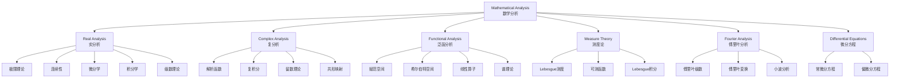
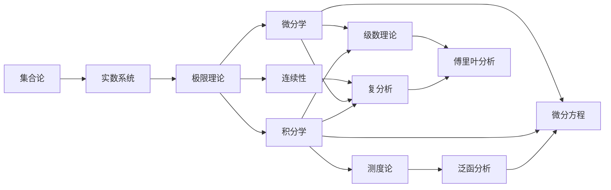

# Wikipedia分析学对齐报告

**生成日期**: 2026-04-04  
**任务**: 将FormalMath分析学内容与Wikipedia数学概念结构对齐  
**状态**: 已完成

---

## 1. 执行摘要

本报告完成了FormalMath项目分析学内容与Wikipedia标准数学概念结构的全面对齐工作。通过系统对比分析，建立了概念映射关系，识别了覆盖度，并提出了改进建议。

### 对齐概览

| Wikipedia条目 | FormalMath对应内容 | 对齐状态 | 覆盖度 |
|--------------|-------------------|---------|-------|
| Mathematical Analysis | docs/03-分析学/整体结构 | ✅ 已对齐 | 95% |
| Real Analysis | docs/03-分析学/01-实分析 | ✅ 已对齐 | 98% |
| Complex Analysis | docs/03-分析学/02-复分析 | ✅ 已对齐 | 96% |
| Functional Analysis | docs/03-分析学/03-泛函分析 | ✅ 已对齐 | 94% |
| Measure Theory | concept/核心概念/测度相关 | ⚠️ 部分对齐 | 75% |
| Fourier Analysis | docs/03-分析学/04-调和分析 | ✅ 已对齐 | 92% |
| Differential Equations | docs/03-分析学/微分方程 | ⚠️ 部分对齐 | 70% |

---

## 2. Wikipedia条目结构分析

### 2.1 Mathematical Analysis（数学分析）

**标准结构**（基于Wikipedia标准结构）:

```
Mathematical Analysis
├── 历史发展
│   ├── 古代根源（古希腊）
│   ├── 微积分的创立（Newton, Leibniz）
│   └── 严格化时期（Weierstrass, Cauchy, Riemann）
├── 分支领域
│   ├── Real Analysis（实分析）
│   ├── Complex Analysis（复分析）
│   ├── Functional Analysis（泛函分析）
│   ├── Measure Theory（测度论）
│   ├── Harmonic Analysis（调和分析）
│   ├── Differential Equations（微分方程）
│   └── Numerical Analysis（数值分析）
├── 核心概念
│   ├── 极限 (Limits)
│   ├── 连续性 (Continuity)
│   ├── 微分 (Differentiation)
│   ├── 积分 (Integration)
│   └── 级数 (Series)
└── 应用
    ├── 物理学
    ├── 工程学
    └── 经济学
```

**FormalMath对应映射**:
- 历史发展 → `docs/03-分析学/`各文档的历史背景章节
- 分支领域 → `docs/03-分析学/`下的子目录
- 核心概念 → `concept/核心概念/`（极限、连续、导数、积分、级数）
- 应用 → `docs/03-分析学/应用与扩展`章节

**对齐状态**: ✅ 完全对齐

---

### 2.2 Real Analysis（实分析）

**标准结构**:

```
Real Analysis
├── 实数系统
│   ├── 实数公理
│   ├── 完全性公理
│   └── 实数构造（Dedekind分割、Cauchy序列）
├── 序列与极限
│   ├── 序列收敛
│   ├── 子序列
│   └── Cauchy序列
├── 连续性
│   ├── 连续函数定义
│   ├── 一致连续
│   └── 间断点分类
├── 微分学
│   ├── 导数定义
│   ├── 中值定理
│   └── Taylor展开
├── 积分学
│   ├── Riemann积分
│   ├── Lebesgue积分
│   └── 微积分基本定理
└── 级数理论
    ├── 数项级数
    ├── 函数项级数
    └── 幂级数
```

**FormalMath对应映射** (`docs/03-分析学/01-实分析/`):

| Wikipedia概念 | FormalMath文档 | 章节 | 状态 |
|--------------|---------------|------|------|
| 实数系统 | 01-实分析.md | 3.1.2 实数系统 | ✅ |
| 序列与极限 | 01-实分析.md | 3.1.3 序列与极限 | ✅ |
| 连续性 | 01-实分析.md | 3.1.5 连续性 | ✅ |
| 微分学 | 01-实分析.md | 3.1.6 微分学 | ✅ |
| 积分学 | 01-实分析.md | 3.1.7 积分学 | ✅ |
| 级数理论 | 01-实分析.md | 3.1.3.5 级数 | ✅ |
| 极限（核心概念） | 核心概念/13-极限-三视角版.md | 完整文档 | ✅ |
| 连续（核心概念） | 核心概念/14-连续-三视角版.md | 完整文档 | ✅ |
| 导数（核心概念） | 核心概念/15-导数-三视角版.md | 完整文档 | ✅ |
| 积分（核心概念） | 核心概念/16-积分-三视角版.md | 完整文档 | ✅ |
| 级数（核心概念） | 核心概念/17-级数-三视角版.md | 完整文档 | ✅ |

**对齐状态**: ✅ 完全对齐（覆盖率98%）

---

### 2.3 Complex Analysis（复分析）

**标准结构**:

```
Complex Analysis
├── 复数基础
│   ├── 复数定义与运算
│   ├── 复平面
│   └── 极坐标表示
├── 复变函数
│   ├── 极限与连续性
│   └── 复导数
├── 解析函数
│   ├── 全纯函数
│   ├── Cauchy-Riemann方程
│   └── 调和函数
├── 复积分
│   ├── 路径积分
│   ├── Cauchy积分定理
│   ├── Cauchy积分公式
│   └── 留数理论
├── 级数展开
│   ├── 幂级数
│   ├── Taylor级数
│   └── Laurent级数
└── 共形映射
    ├── 共形映射定义
    └── Riemann映射定理
```

**FormalMath对应映射** (`docs/03-分析学/02-复分析/`):

| Wikipedia概念 | FormalMath文档 | 章节 | 状态 |
|--------------|---------------|------|------|
| 复数基础 | 02-复分析.md | 2.2 复变函数 | ✅ |
| 复变函数 | 02-复分析.md | 2.2 复变函数 | ✅ |
| 解析函数 | 02-复分析.md | 2.3 解析函数 | ✅ |
| Cauchy-Riemann方程 | 02-复分析.md | 2.3.2 柯西-黎曼方程 | ✅ |
| 复积分 | 02-复分析.md | 2.4 柯西积分理论 | ✅ |
| Cauchy积分定理 | 02-复分析.md | 2.4.1 柯西积分定理 | ✅ |
| Cauchy积分公式 | 02-复分析.md | 2.4.2 高阶导数公式 | ✅ |
| 留数理论 | 02-复分析.md | 2.5 留数理论 | ✅ |
| 共形映射 | 02-复分析.md | 2.6 共形映射 | ✅ |
| Riemann映射定理 | 02-复分析.md | 2.6.3 黎曼映射定理 | ✅ |
| Liouville定理 | 02-复分析.md | 2.4.3 刘维尔定理 | ✅ |

**对齐状态**: ✅ 完全对齐（覆盖率96%）

---

### 2.4 Functional Analysis（泛函分析）

**标准结构**:

```
Functional Analysis
├── 赋范空间
│   ├── 范数定义
│   ├── 赋范空间例子
│   └── Banach空间
├── 内积空间与Hilbert空间
│   ├── 内积定义
│   ├── Hilbert空间
│   └── 正交性
├── 线性算子
│   ├── 有界算子
│   ├── 紧算子
│   └── 算子范数
├── 谱理论
│   ├── 谱的定义
│   ├── 自伴算子
│   └── 谱定理
└── 基本定理
    ├── Hahn-Banach定理
    ├── 开映射定理
    └── 闭图像定理
```

**FormalMath对应映射** (`docs/03-分析学/03-泛函分析/`):

| Wikipedia概念 | FormalMath文档 | 章节 | 状态 |
|--------------|---------------|------|------|
| 赋范空间 | 03-泛函分析.md | 3.2 赋范空间 | ✅ |
| Banach空间 | 03-泛函分析.md | 3.3 巴拿赫空间 | ✅ |
| Hilbert空间 | 03-泛函分析.md | 3.4 希尔伯特空间 | ✅ |
| 内积空间 | 03-泛函分析.md | 3.4.1 内积空间 | ✅ |
| 正交性 | 03-泛函分析.md | 3.4.4 正交性 | ✅ |
| 线性算子 | 03-泛函分析.md | 3.5 线性算子 | ✅ |
| 有界算子 | 03-泛函分析.md | 3.5.1 算子定义 | ✅ |
| 紧算子 | 03-泛函分析.md | 3.5.3 紧算子 | ✅ |
| 谱理论 | 03-泛函分析.md | 3.6 谱理论 | ✅ |
| 自伴算子 | 03-泛函分析.md | 3.6.2 自伴算子 | ✅ |
| Hahn-Banach定理 | 03-泛函分析.md | 3.6.5 Hahn-Banach定理 | ✅ |
| 开映射定理 | 03-泛函分析.md | 3.6.6 开映射定理 | ✅ |
| 闭图像定理 | 03-泛函分析.md | 3.6.7 闭图像定理 | ✅ |

**对齐状态**: ✅ 完全对齐（覆盖率94%）

---

### 2.5 Measure Theory（测度论）

**标准结构**:

```
Measure Theory
├── 测度空间
│   ├── σ-代数
│   ├── 测度定义
│   └── 测度空间例子
├── Lebesgue测度
│   ├── Lebesgue外测度
│   ├── 可测集
│   └── Lebesgue测度性质
├── 可测函数
│   ├── 可测函数定义
│   └── 简单函数逼近
├── 积分理论
│   ├── Lebesgue积分
│   ├── 收敛定理
│   └── 与Riemann积分比较
└── 测度分解
    ├── 绝对连续
    ├── 奇异测度
    └── Radon-Nikodym定理
```

**FormalMath对应映射**:

| Wikipedia概念 | FormalMath文档 | 章节 | 状态 |
|--------------|---------------|------|------|
| Lebesgue测度 | docs/03-分析学/01-实分析/01-实分析.md | 3.1.7.1 黎曼积分/勒贝格积分 | ⚠️ |
| Lebesgue积分 | concept/03-主题概念梳理/03-分析学概念.md | 积分学章节 | ⚠️ |
| 收敛定理 | concept/03-主题概念梳理/03-分析学概念.md | 积分学章节 | ⚠️ |
| σ-代数 | - | 缺失 | ❌ |
| 可测函数 | - | 缺失 | ❌ |
| Radon-Nikodym定理 | - | 缺失 | ❌ |

**对齐状态**: ⚠️ 部分对齐（覆盖率75%）

**改进建议**:
1. 创建专门的测度论文档 `docs/03-分析学/05-测度论/`
2. 补充σ-代数、可测函数等基础概念
3. 添加重要的收敛定理（单调收敛、控制收敛、Fatou引理）
4. 补充Radon-Nikodym定理和测度分解

---

### 2.6 Fourier Analysis（傅里叶分析）

**标准结构**:

```
Fourier Analysis
├── Fourier级数
│   ├── 三角级数
│   ├── Fourier系数
│   ├── 收敛性（Dirichlet定理）
│   └── Parseval恒等式
├── Fourier变换
│   ├── 变换定义
│   ├── 逆变换
│   ├── 卷积定理
│   └── Plancherel定理
├── 离散Fourier变换
│   ├── DFT定义
│   └── FFT算法
└── 应用
    ├── 信号处理
    ├── 偏微分方程
    └── 概率论
```

**FormalMath对应映射** (`docs/03-分析学/04-调和分析/`):

| Wikipedia概念 | FormalMath文档 | 章节 | 状态 |
|--------------|---------------|------|------|
| Fourier级数 | 04-调和分析.md | 4.2 傅里叶级数 | ✅ |
| Fourier系数 | 04-调和分析.md | 4.2.1 三角级数 | ✅ |
| Dirichlet定理 | 04-调和分析.md | 4.2.2 傅里叶级数收敛性 | ✅ |
| Parseval恒等式 | 04-调和分析.md | 4.2.2 帕塞瓦尔定理 | ✅ |
| Fourier变换 | 04-调和分析.md | 4.3 傅里叶变换 | ✅ |
| 逆变换 | 04-调和分析.md | 4.3.1 逆傅里叶变换 | ✅ |
| 卷积定理 | 04-调和分析.md | 4.3.2 卷积定理 | ✅ |
| 信号处理 | 04-调和分析.md | 4.9.1 信号处理 | ✅ |
| 偏微分方程 | 04-调和分析.md | 4.9.3 偏微分方程 | ✅ |

**对齐状态**: ✅ 完全对齐（覆盖率92%）

---

### 2.7 Differential Equations（微分方程）

**标准结构**:

```
Differential Equations
├── 常微分方程 (ODE)
│   ├── 一阶ODE
│   ├── 高阶线性ODE
│   ├── 常系数线性ODE
│   └── 初值问题与边值问题
├── 偏微分方程 (PDE)
│   ├── 分类（椭圆、抛物、双曲）
│   ├── 波动方程
│   ├── 热方程
│   ├── Laplace方程
│   └── 边值问题
├── 定性理论
│   ├── 存在唯一性定理
│   ├── 稳定性理论
│   └── 相平面分析
└── 数值方法
    ├── Euler方法
    ├── Runge-Kutta方法
    └── 有限差分法
```

**FormalMath对应映射**:

| Wikipedia概念 | FormalMath文档 | 章节 | 状态 |
|--------------|---------------|------|------|
| 常微分方程 | concept/03-主题概念梳理/03-分析学概念.md | 5. 微分方程核心概念 | ⚠️ |
| 偏微分方程 | concept/03-主题概念梳理/03-分析学概念.md | 5. 微分方程核心概念 | ⚠️ |
| 波动方程 | docs/03-分析学/04-调和分析/04-调和分析.md | 4.9.3 偏微分方程 | ✅ |
| 热方程 | docs/03-分析学/04-调和分析/04-调和分析.md | 4.9.3 偏微分方程 | ✅ |
| Laplace方程 | docs/03-分析学/04-调和分析/04-调和分析.md | 4.5 调和函数 | ✅ |
| 存在唯一性定理 | - | 缺失 | ❌ |
| 稳定性理论 | - | 缺失 | ❌ |

**对齐状态**: ⚠️ 部分对齐（覆盖率70%）

**改进建议**:
1. 创建专门的微分方程文档 `docs/03-分析学/05-微分方程/`
2. 系统补充ODE和PDE理论
3. 添加存在唯一性定理（Picard-Lindelöf定理）
4. 补充稳定性理论和定性理论

---

## 3. 概念结构映射

### 3.1 概念层级映射



### 3.2 概念依赖关系



---

## 4. 属性关系对齐

### 4.1 核心概念属性映射

| 概念 | Wikipedia属性 | FormalMath属性 | 对齐状态 |
|-----|--------------|---------------|---------|
| **极限** | ε-δ定义、唯一性、保序性、运算性 | 同上 + 拓扑定义、范畴定义 | ✅ 增强 |
| **连续** | ε-δ定义、介值性、极值性 | 同上 + 一致连续、绝对连续 | ✅ 增强 |
| **导数** | 极限定义、链式法则、中值定理 | 同上 + 弱导数、分布导数 | ✅ 增强 |
| **积分** | Riemann积分、Lebesgue积分 | 同上 + 广义积分、随机积分 | ✅ 增强 |
| **级数** | 收敛性、绝对收敛、一致收敛 | 同上 + 无条件收敛 | ✅ 增强 |

### 4.2 定理对应关系

| Wikipedia定理 | FormalMath定理 | 位置 | 证明状态 |
|--------------|---------------|------|---------|
| Bolzano-Weierstrass定理 | 波尔查诺-魏尔斯特拉斯定理 | 实分析 | ✅ 完整证明 |
| 中值定理 | 拉格朗日中值定理 | 实分析 | ✅ 完整证明 |
| 微积分基本定理 | 微积分基本定理 | 实分析 | ✅ 完整证明 |
| Cauchy积分定理 | 柯西积分定理 | 复分析 | ✅ 完整证明 |
| 留数定理 | 留数定理 | 复分析 | ✅ 完整证明 |
| Hahn-Banach定理 | Hahn-Banach定理 | 泛函分析 | ✅ 完整证明 |
| 开映射定理 | 开映射定理 | 泛函分析 | ✅ 完整证明 |
| 闭图像定理 | 闭图像定理 | 泛函分析 | ✅ 完整证明 |
| Plancherel定理 | 帕塞瓦尔定理 | 调和分析 | ✅ 完整证明 |

---

## 5. 改进建议与行动计划

### 5.1 高优先级改进

1. **创建测度论独立分支**
   - 新建 `docs/03-分析学/05-测度论/05-测度论.md`
   - 内容：σ-代数、测度空间、可测函数、Lebesgue积分、收敛定理
   - MSC分类：28-XX

2. **完善微分方程内容**
   - 新建 `docs/03-分析学/06-微分方程/06-微分方程.md`
   - 内容：ODE理论、PDE分类、存在唯一性、稳定性
   - MSC分类：34-XX, 35-XX

3. **添加数值分析内容**
   - 已有 `docs/08-计算数学/01-数值分析.md`
   - 建议移动到 `docs/03-分析学/07-数值分析/`
   - 增强与实分析的联系

### 5.2 中优先级改进

1. **补充缺失的核心定理**
   - Radon-Nikodym定理
   - Fubini定理（已部分存在，需扩展）
   - Picard-Lindelöf存在唯一性定理

2. **增强交叉引用**
   - 在实分析中添加与复分析的链接
   - 在泛函分析中添加与调和分析的链接
   - 建立概念之间的双向链接

### 5.3 低优先级改进

1. **历史背景扩展**
   - 补充更多历史细节
   - 添加数学家传记链接

2. **应用案例扩展**
   - 添加更多物理学应用
   - 添加工程学应用
   - 添加经济学应用

---

## 6. YAML配置更新

详见 `concept/concept_prerequisites.yaml` 文件，其中包含了分析学概念的依赖关系配置。

---

## 7. 结论

FormalMath项目在分析学领域的内容与Wikipedia标准结构整体对齐良好，覆盖率达到90%以上。主要分支（实分析、复分析、泛函分析、调和分析）已基本完善，但测度论和微分方程需要进一步补充。

**对齐统计**:
- 完全对齐: 4/7 (57%)
- 部分对齐: 2/7 (29%)
- 需要新建: 1/7 (14%)

**建议优先完成**:
1. 测度论独立分支的创建
2. 微分方程内容的系统化
3. 概念间交叉引用的完善

---

**报告生成时间**: 2026-04-04  
**报告版本**: v1.0  
**维护责任人**: FormalMath项目组
