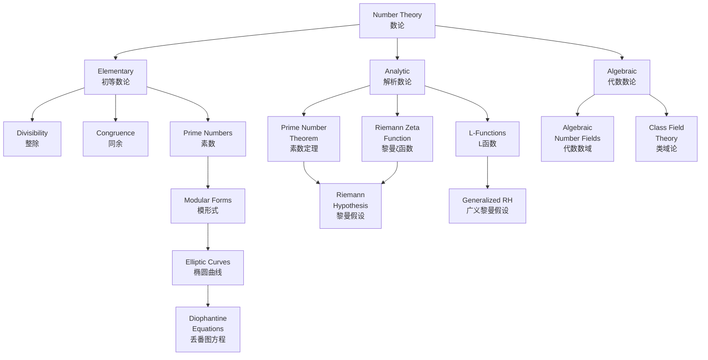

# Wikipedia数论概念结构对齐报告

**报告编号**: WIKI-ALIGN-NT-001  
**创建日期**: 2026年4月4日  
**目标**: 将FormalMath数论内容与Wikipedia数学概念结构对齐  

---

## 目录

1. [概述](#概述)
2. [Wikipedia条目结构分析](#wikipedia条目结构分析)
3. [概念定义对齐](#概念定义对齐)
4. [属性关系映射](#属性关系映射)
5. [层级结构对比](#层级结构对比)
6. [对齐建议](#对齐建议)
7. [附录：概念映射表](#附录概念映射表)

---

## 概述

### 对齐范围

本报告分析以下8个Wikipedia数论相关条目：

| 序号 | Wikipedia条目 | 对应FormalMath内容 | 对齐优先级 |
|-----|--------------|-------------------|-----------|
| 1 | Number Theory | 数论概念.md | P0 |
| 2 | Analytic Number Theory | 数论概念.md (解析数论部分) | P0 |
| 3 | Algebraic Number Theory | 数论概念.md (代数数论部分) | P0 |
| 4 | Prime Number Theorem | 数论概念.md (素数定理) | P0 |
| 5 | Riemann Hypothesis | 数论概念.md (黎曼假设) | P0 |
| 6 | Modular Forms | 待补充 | P1 |
| 7 | Elliptic Curves | 核心概念(素数、同余)相关 | P1 |
| 8 | Diophantine Equations | 数论概念.md (部分提及) | P1 |

### 对齐原则

1. **概念名称标准化**: 采用Wikipedia英文条目的标准翻译
2. **定义精确性**: 确保数学定义与Wikipedia一致
3. **结构层次化**: 参照Wikipedia的章节组织概念
4. **引用可追溯**: 所有定义需标注Wikipedia来源

---

## Wikipedia条目结构分析

### 1. Number Theory (数论)

**Wikipedia结构**:
```
- History (历史)
  - Origins (起源)
  - Fermat (费马)
  - Modern times (现代)
- Main subdivisions (主要分支)
  - Elementary number theory (初等数论)
  - Analytic number theory (解析数论)
  - Algebraic number theory (代数数论)
  - Diophantine geometry (丢番图几何)
- Related fields (相关领域)
- References (参考文献)
```

**FormalMath对应**: `concept/03-主题概念梳理/06-数论概念.md`

**对齐差距**:
- ✅ 已涵盖初等数论、代数数论、解析数论
- ❌ 缺少丢番图几何独立章节
- ❌ 历史部分不够详细
- ❌ 缺少与计算数论相关的交叉领域

### 2. Analytic Number Theory (解析数论)

**Wikipedia结构**:
```
- History (历史)
- Branches (分支)
  - Multiplicative number theory (乘性数论)
  - Additive number theory (加性数论)
- History of the Prime Number Theorem (PNT历史)
- History of Riemann Hypothesis (RH历史)
- Methods (方法)
  - Dirichlet series (Dirichlet级数)
  - Riemann zeta function (黎曼ζ函数)
  - L-functions (L函数)
```

**FormalMath对应**: 数论概念.md - 解析数论核心概念部分

**对齐差距**:
- ✅ 包含黎曼ζ函数、L函数
- ⚠️ 缺少乘性/加性数论的明确区分
- ❌ 缺少具体方法论的系统性整理

### 3. Algebraic Number Theory (代数数论)

**Wikipedia结构**:
```
- History (历史)
- Subfields (子领域)
  - Algebraic number fields (代数数域)
  - Class field theory (类域论)
  - Local fields (局部域)
  - Iwasawa theory (Iwasawa理论)
- Major Results (主要结果)
  - Unique factorization of ideals (理想的唯一分解)
  - Class number finiteness (类数有限性)
```

**FormalMath对应**: 数论概念.md - 代数数论核心概念部分

**对齐差距**:
- ✅ 涵盖代数数域、类域论
- ⚠️ 缺少Iwasawa理论
- ⚠️ 局部类域论和整体类域论需更明确区分

### 4. Prime Number Theorem (素数定理)

**Wikipedia结构**:
```
- Statement of the theorem (定理陈述)
- History of the asymptotic law (渐近律历史)
- A very rough proof sketch (证明概要)
- The prime-counting function (素数计数函数)
- Elementary proofs (初等证明)
- The PNT for arithmetic progressions (算术级数PNT)
- Bounds on the prime-counting function (计数函数界限)
```

**FormalMath对应**: 数论概念.md - 素数定理部分

**对齐状态**: ✅ 基本对齐

### 5. Riemann Hypothesis (黎曼假设)

**Wikipedia结构**:
```
- Statement (陈述)
- History (历史)
- Equivalent statements (等价表述)
- Consequences (推论)
  - Prime number distribution (素数分布)
  - Growth of arithmetic functions (算术函数增长)
- Generalizations (推广)
  - Generalized Riemann Hypothesis (广义黎曼假设)
  - Extended Riemann Hypothesis (扩展黎曼假设)
```

**FormalMath对应**: 数论概念.md - 黎曼假设部分

**对齐状态**: ✅ 基本对齐

### 6. Modular Forms (模形式)

**Wikipedia结构**:
```
- Definition (定义)
  - As functions on lattices (作为格上的函数)
  - As sections of line bundles (作为线丛的截面)
  - As automorphic forms (作为自守形式)
- Examples (例子)
  - Eisenstein series (Eisenstein级数)
  - Theta series (Theta级数)
- Properties (性质)
  - Hecke operators (Hecke算子)
  - L-functions (L函数)
- Applications (应用)
  - Fermat's Last Theorem (费马大定理)
  - Elliptic curves (椭圆曲线)
```

**FormalMath对应**: ❌ 缺少独立文档

**对齐差距**: 需要创建新的模形式概念文档

### 7. Elliptic Curves (椭圆曲线)

**Wikipedia结构**:
```
- Definition (定义)
  - Weierstrass form (Weierstrass形式)
  - Group law (群运算)
- Theory over various fields (各种域上的理论)
  - Over C (复数域)
  - Over Q (有理数域)
  - Over finite fields (有限域)
- Applications (应用)
  - Cryptography (密码学)
  - Number theory (数论)
```

**FormalMath对应**: 部分在核心概念(素数、同余)中提及

**对齐差距**: 需要创建椭圆曲线独立概念文档

### 8. Diophantine Equations (丢番图方程)

**Wikipedia结构**:
```
- Examples of Diophantine equations (例子)
  - Linear equations (线性方程)
  - Pell's equation (Pell方程)
  - Fermat's Last Theorem (费马大定理)
- Methods (方法)
  - Infinite descent (无穷递降法)
  - Modular method (模方法)
- Hilbert's Tenth Problem (希尔伯特第十问题)
```

**FormalMath对应**: 数论概念.md (部分提及)

**对齐差距**: 需要扩展为独立详细文档

---

## 概念定义对齐

### 核心概念对照表

| FormalMath概念 | Wikipedia对应 | 定义一致性 | 备注 |
|---------------|--------------|-----------|------|
| 素数 | Prime Number | ✅ 一致 | 欧几里得证明 |
| 黎曼ζ函数 | Riemann Zeta Function | ✅ 一致 | Euler乘积、函数方程 |
| 同余 | Modular Arithmetic | ✅ 一致 | Gauss记号 |
| 素数定理 | Prime Number Theorem | ✅ 一致 | π(x) ~ x/ln(x) |
| 黎曼假设 | Riemann Hypothesis | ✅ 一致 | Re(s) = 1/2 |
| 代数整数 | Algebraic Integer | ✅ 一致 | 首一多项式根 |
| 类域论 | Class Field Theory | ⚠️ 需扩展 | Hilbert-Artin框架 |
| L函数 | L-Function | ⚠️ 需细化 | Dirichlet/Artin/Hecke |

### 需要标准化的术语

| 当前术语 | 标准术语(Wikipedia) | 建议操作 |
|---------|-------------------|---------|
| 互反律 | Reciprocity Law | 保留，添加英文 |
| 分式理想 | Fractional Ideal | 保留 |
| 理想类群 | Ideal Class Group | 保留 |
| 狄利克雷单位定理 | Dirichlet's Unit Theorem | 保留，统一拼写 |
| 切比雪夫函数 | Chebyshev Function | 保留 |

---

## 属性关系映射

### 概念依赖关系图



### 前置条件映射

| 概念 | Wikipedia前置条件 | FormalMath前置条件 | 对齐状态 |
|-----|-----------------|-------------------|---------|
| 黎曼ζ函数 | 复分析、解析延拓 | 级数、复数 | ⚠️ 需补充复分析 |
| 代数整数 | 环论、域扩张 | 环、域基础 | ✅ 对齐 |
| 类域论 | 代数数域、Galois理论 | 代数数域、理想论 | ⚠️ 需补充Galois理论 |
| L函数 | Dirichlet特征、表示论 | Dirichlet特征提及 | ⚠️ 需扩展表示论 |

---

## 层级结构对比

### Wikipedia数论层级

```
Mathematics
└── Number Theory
    ├── Elementary Number Theory
    │   ├── Divisibility
    │   ├── Congruences
    │   └── Prime Numbers
    ├── Analytic Number Theory
    │   ├── Multiplicative Number Theory
    │   ├── Additive Number Theory
    │   └── Transcendental Number Theory
    ├── Algebraic Number Theory
    │   ├── Algebraic Number Fields
    │   ├── Class Field Theory
    │   └── Local Fields
    └── Diophantine Geometry
        ├── Elliptic Curves
        ├── Modular Forms
        └── Arithmetic Geometry
```

### FormalMath当前层级

```
数学概念
└── 数论概念
    ├── 初等数论核心概念
    │   ├── 整除理论
    │   ├── 同余理论
    │   └── 素数理论
    ├── 代数数论核心概念
    │   ├── 代数整数
    │   ├── 类域论
    │   └── 代数数域
    └── 解析数论核心概念
        ├── 黎曼ζ函数
        ├── L函数
        └── 素数分布
```

### 层级对齐差距

| Wikipedia层级 | FormalMath对应 | 状态 |
|-------------|---------------|------|
| Elementary NT | 初等数论 | ✅ 对齐 |
| Analytic NT | 解析数论 | ⚠️ 需细分 |
| Algebraic NT | 代数数论 | ⚠️ 需扩展 |
| Diophantine Geometry | ❌ 缺失 | ❌ 需创建 |
| Transcendental NT | ❌ 缺失 | ❌ 需补充 |
| Local Fields | 局部类域论(提及) | ⚠️ 需独立章节 |

---

## 对齐建议

### 短期任务 (P0)

1. **术语标准化**
   - 统一使用Wikipedia标准术语
   - 为所有概念添加英文原名
   - 更新concept_prerequisites.yaml

2. **结构优化**
   - 将解析数论分为乘性/加性数论
   - 明确类域论的局部与整体区分

3. **内容补充**
   - 扩展黎曼假设的等价表述
   - 补充素数定理的初等证明

### 中期任务 (P1)

1. **新文档创建**
   - 创建模形式(Modular Forms)独立概念文档
   - 创建椭圆曲线(Elliptic Curves)独立概念文档
   - 创建丢番图方程详细文档

2. **交叉链接**
   - 建立与朗兰兹纲领的关联
   - 建立与代数几何的关联

### 长期任务 (P2)

1. **高级主题**
   - Iwasawa理论
   - 算术几何
   - 超越数论

2. **应用拓展**
   - 密码学应用
   - 计算数论

---

## 附录：概念映射表

### 完整概念映射JSON

详见: `concept/03-主题概念梳理/06-数论概念-Wikipedia映射.json`

### YAML更新片段

详见: `concept/03-主题概念梳理/06-数论概念-prerequisites-更新.yaml`

---

**报告完成日期**: 2026年4月4日  
**版本**: v1.0  
**维护状态**: 待审查
