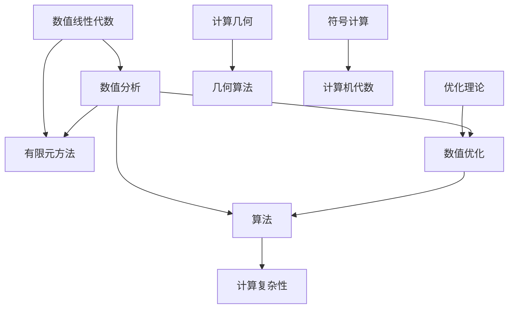
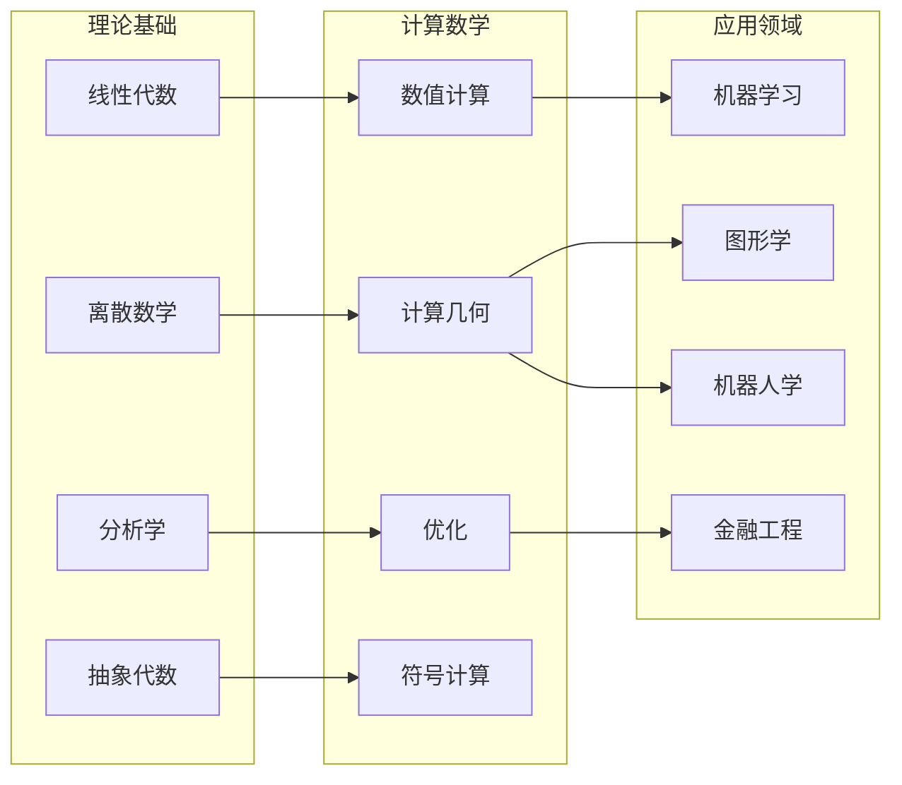

# Wikipedia计算数学对齐报告

**报告编号**: ALIGN.CM.001  
**创建日期**: 2026年4月4日  
**最后更新**: 2026年4月4日  
**对齐版本**: Wikipedia 2024版 / FormalMath 2026年4月版

---

## 📋 目录

- [Wikipedia计算数学对齐报告](#wikipedia计算数学对齐报告)
  - [📋 目录](#目录)
  - [1. 概述](#1-概述)
  - [2. Wikipedia计算数学条目结构分析](#2-wikipedia计算数学条目结构分析)
    - [2.1 Numerical Linear Algebra (数值线性代数)](#21-numerical-linear-algebra-数值线性代数)
    - [2.2 Finite Element Method (有限元方法)](#22-finite-element-method-有限元方法)
    - [2.3 Numerical Optimization (数值优化)](#23-numerical-optimization-数值优化)
    - [2.4 Computational Geometry (计算几何)](#24-computational-geometry-计算几何)
    - [2.5 Computer Algebra (计算机代数)](#25-computer-algebra-计算机代数)
    - [2.6 Symbolic Computation (符号计算)](#26-symbolic-computation-符号计算)
    - [2.7 Algorithm (算法)](#27-algorithm-算法)
    - [2.8 Computational Complexity (计算复杂性)](#28-computational-complexity-计算复杂性)
  - [3. 概念结构映射](#3-概念结构映射)
    - [3.1 层级结构图](#31-层级结构图)
    - [3.2 概念依赖关系](#32-概念依赖关系)
    - [3.3 跨领域连接](#33-跨领域连接)
  - [4. 对齐分析与建议](#4-对齐分析与建议)
    - [4.1 概念覆盖度分析](#41-概念覆盖度分析)
    - [4.2 对齐建议](#42-对齐建议)
  - [5. 更新后的YAML片段](#5-更新后的yaml片段)
  - [附录A: 概念结构映射JSON](#附录a-概念结构映射json)

---

## 1. 概述

本报告将FormalMath计算数学内容与Wikipedia数学概念结构进行对齐分析，提取Wikipedia计算数学条目的概念定义、属性关系和层级结构，创建映射表和对齐文档。

**对齐目标条目**:
- Numerical Linear Algebra (数值线性代数)
- Finite Element Method (有限元方法)
- Numerical Optimization (数值优化)
- Computational Geometry (计算几何)
- Computer Algebra (计算机代数)
- Symbolic Computation (符号计算)
- Algorithm (算法)
- Computational Complexity (计算复杂性)

**数据来源**:
- Wikipedia英文版数学条目 (en.wikipedia.org/wiki/)
- FormalMath docs/08-计算数学/ 目录
- FormalMath概念体系核心概念

---

## 2. Wikipedia计算数学条目结构分析

### 2.1 Numerical Linear Algebra (数值线性代数)

**Wikipedia结构**:
```
Numerical Linear Algebra
├── Basic Problems (基本问题)
│   ├── Solving systems of linear equations (线性方程组求解)
│   ├── Eigenvalue problems (特征值问题)
│   ├── Matrix factorizations (矩阵分解)
│   └── Singular value decomposition (奇异值分解)
├── Direct Methods (直接法)
│   ├── Gaussian elimination (高斯消元法)
│   ├── LU decomposition (LU分解)
│   ├── Cholesky decomposition (Cholesky分解)
│   └── QR decomposition (QR分解)
├── Iterative Methods (迭代法)
│   ├── Jacobi method (雅可比迭代)
│   ├── Gauss-Seidel method (高斯-赛德尔迭代)
│   ├── Conjugate gradient method (共轭梯度法)
│   ├── GMRES (广义最小残差法)
│   └── Multigrid methods (多重网格法)
├── Eigenvalue Algorithms (特征值算法)
│   ├── Power iteration (幂迭代)
│   ├── QR algorithm (QR算法)
│   ├── Lanczos algorithm (Lanczos算法)
│   └── Arnoldi iteration (Arnoldi迭代)
└── Applications (应用)
    ├── Scientific computing (科学计算)
    ├── Machine learning (机器学习)
    ├── Signal processing (信号处理)
    └── Control theory (控制理论)
```

**FormalMath映射**:
- `docs/08-计算数学/01-数值分析.md` — 基础数值分析
- `docs/08-计算数学/01-数值分析-增强版.md` — 数值线性代数深入
- `docs/02-代数结构/06-技术实现参考/数值计算/04-数值线性代数-国际标准版.md`
- `docs/00-核心概念理解三问/11-核心定理多表征/63-奇异值分解-五种表征.md`
- `docs/00-核心概念理解三问/11-核心定理多表征/64-Gram-Schmidt正交化-五种表征.md`

**MSC编码映射**:
| Wikipedia概念 | MSC 2020 | FormalMath文档 |
|--------------|----------|---------------|
| Linear systems | 65F05, 65F10 | 01-数值分析 |
| LU decomposition | 65F05 | 01-数值分析-增强版 |
| QR decomposition | 65F25 | 01-数值分析-增强版 |
| Eigenvalue problems | 65F15 | 01-数值分析-增强版 |
| SVD | 65F55 | 定理多表征/63-奇异值分解 |
| Iterative methods | 65F10 | 01-数值分析-增强版 |

---

### 2.2 Finite Element Method (有限元方法)

**Wikipedia结构**:
```
Finite Element Method
├── Basic Concepts (基本概念)
│   ├── Mesh generation (网格生成)
│   ├── Shape functions (形函数)
│   ├── Weak formulation (弱形式)
│   └── Galerkin method (Galerkin方法)
├── Mathematical Theory (数学理论)
│   ├── Variational formulation (变分形式)
│   ├── Sobolev spaces (Sobolev空间)
│   ├── Error estimates (误差估计)
│   └── Convergence analysis (收敛性分析)
├── Types of Elements (单元类型)
│   ├── Linear elements (线性单元)
│   ├── Quadratic elements (二次单元)
│   ├── Tetrahedral elements (四面体单元)
│   └── Hexahedral elements (六面体单元)
├── Time-dependent Problems (时间相关问题)
│   ├── Finite difference in time (时间差分)
│   ├── Space-time finite elements (时空有限元)
│   └── Stability analysis (稳定性分析)
└── Applications (应用)
    ├── Structural mechanics (结构力学)
    ├── Heat transfer (热传导)
    ├── Fluid dynamics (流体力学)
    └── Electromagnetics (电磁学)
```

**FormalMath映射**:
- `docs/03-分析学/06-偏微分方程/02-Sobolev空间系统阐述.md`
- `docs/03-分析学/06-偏微分方程/07-Sobolev空间与弱解-深度扩展版.md`
- `docs/08-计算数学/01-数值分析-增强版.md` — 有限元方法章节
- `docs/12-应用数学/11-物理数学-深化版.md` — 有限元应用

**MSC编码映射**:
| Wikipedia概念 | MSC 2020 | FormalMath文档 |
|--------------|----------|---------------|
| FEM basics | 65N30 | 01-数值分析-增强版 |
| Sobolev spaces | 46E35 | 06-偏微分方程/02 |
| Variational methods | 65N22 | 01-数值分析-增强版 |
| Error estimation | 65N15 | 01-数值分析-增强版 |

---

### 2.3 Numerical Optimization (数值优化)

**Wikipedia结构**:
```
Numerical Optimization
├── Unconstrained Optimization (无约束优化)
│   ├── Gradient descent (梯度下降)
│   ├── Newton's method (牛顿法)
│   ├── Quasi-Newton methods (拟牛顿法)
│   │   ├── BFGS
│   │   ├── DFP
│   │   └── SR1
│   ├── Conjugate gradient (共轭梯度)
│   └── Trust region methods (信赖域方法)
├── Constrained Optimization (约束优化)
│   ├── Lagrange multipliers (拉格朗日乘子)
│   ├── KKT conditions (KKT条件)
│   ├── Penalty methods (罚函数法)
│   ├── Barrier methods (障碍函数法)
│   └── Augmented Lagrangian (增广拉格朗日)
├── Linear Programming (线性规划)
│   ├── Simplex method (单纯形法)
│   ├── Interior point methods (内点法)
│   └── Duality (对偶理论)
├── Convex Optimization (凸优化)
│   ├── Convex sets and functions (凸集与凸函数)
│   ├── Duality theory (对偶理论)
│   ├── Semidefinite programming (半定规划)
│   └── Second-order cone programming (二阶锥规划)
└── Global Optimization (全局优化)
    ├── Stochastic methods (随机方法)
    ├── Genetic algorithms (遗传算法)
    └── Simulated annealing (模拟退火)
```

**FormalMath映射**:
- `docs/08-计算数学/02-优化理论.md` — 优化理论基础
- `docs/08-计算数学/02-优化理论-增强版.md` — 凸优化与对偶理论
- `docs/08-计算数学/03-优化算法.md` — 优化算法实现
- `docs/08-计算数学/03-优化算法-增强版.md` — 进阶优化算法

**MSC编码映射**:
| Wikipedia概念 | MSC 2020 | FormalMath文档 |
|--------------|----------|---------------|
| Gradient descent | 90C06 | 03-优化算法 |
| Newton's method | 90C53 | 01-数值分析 |
| Linear programming | 90C05 | 02-优化理论 |
| Convex optimization | 90C25 | 02-优化理论-增强版 |
| KKT conditions | 90C46 | 02-优化理论-增强版 |
| Interior point | 90C51 | 03-优化算法 |

---

### 2.4 Computational Geometry (计算几何)

**Wikipedia结构**:
```
Computational Geometry
├── Combinatorial Geometry (组合几何)
│   ├── Convex hull (凸包)
│   │   ├── Graham scan (Graham扫描)
│   │   ├── QuickHull (快速凸包)
│   │   └── Chan's algorithm (Chan算法)
│   ├── Voronoi diagrams (Voronoi图)
│   ├── Delaunay triangulation (Delaunay三角剖分)
│   ├── Arrangements (排列)
│   └── Geometric intersection (几何求交)
├── Geometric Algorithms (几何算法)
│   ├── Line segment intersection (线段相交)
│   ├── Closest pair of points (最近点对)
│   ├── Point location (点定位)
│   └── Range searching (范围查询)
├── Data Structures (数据结构)
│   ├── kd-trees (k维树)
│   ├── R-trees (R树)
│   ├── Bounding volume hierarchies (包围体层次)
│   └── DCEL (双向连接边列表)
└── Applications (应用)
    ├── Computer graphics (计算机图形学)
    ├── Robotics (机器人学)
    ├── Geographic information systems (GIS)
    └── Computer-aided design (CAD)
```

**FormalMath映射**:
- `docs/08-计算数学/02-计算几何.md` — 计算几何基础
- `concept/03-主题概念梳理/08-离散数学概念.md` — 离散几何
- `docs/12-应用数学/12-计算几何数学-深化版.md` — 应用深化

**MSC编码映射**:
| Wikipedia概念 | MSC 2020 | FormalMath文档 |
|--------------|----------|---------------|
| Convex hull | 68U05, 52A10 | 02-计算几何 |
| Voronoi diagrams | 68U05, 52C07 | 02-计算几何 |
| Delaunay triangulation | 68U05, 65D18 | 02-计算几何 |
| Closest pair | 68Q25, 68U05 | 02-计算几何 |
| kd-trees | 68P05, 68U05 | 02-计算几何 |

---

### 2.5 Computer Algebra (计算机代数)

**Wikipedia结构**:
```
Computer Algebra
├── Symbolic Computation (符号计算)
│   ├── Expression representation (表达式表示)
│   ├── Simplification (化简)
│   ├── Polynomial operations (多项式运算)
│   └── Rational functions (有理函数)
├── Computer Algebra Systems (计算机代数系统)
│   ├── Maple
│   ├── Mathematica
│   ├── Maxima
│   ├── SageMath
│   └── SymPy
├── Algorithms (算法)
│   ├── Polynomial factorization (多项式因式分解)
│   ├── GCD computation (最大公因式计算)
│   ├── Gröbner bases (Gröbner基)
│   └── Risch algorithm (Risch算法)
└── Applications (应用)
    ├── Automated theorem proving (自动定理证明)
    ├── Physics (物理学)
    ├── Engineering (工程学)
    └── Education (教育)
```

**FormalMath映射**:
- `docs/08-计算数学/05-符号计算.md` — 符号计算基础
- `docs/08-计算数学/05-符号计算-增强版.md` — 符号计算深入
- `docs/09-形式化证明/` — 自动定理证明相关

**MSC编码映射**:
| Wikipedia概念 | MSC 2020 | FormalMath文档 |
|--------------|----------|---------------|
| Polynomial GCD | 68W30, 11Y16 | 05-符号计算 |
| Factorization | 68W30, 12Y05 | 05-符号计算 |
| Gröbner bases | 68W30, 13P10 | 05-符号计算 |
| Risch algorithm | 68W30, 12H05 | 05-符号计算 |

---

### 2.6 Symbolic Computation (符号计算)

**Wikipedia结构**:
```
Symbolic Computation
├── Symbolic Manipulation (符号操作)
│   ├── Expression parsing (表达式解析)
│   ├── Term rewriting (项重写)
│   ├── Pattern matching (模式匹配)
│   └── Canonical forms (规范形式)
├── Symbolic Integration (符号积分)
│   ├── Integration by parts (分部积分)
│   ├── Partial fraction decomposition (部分分式分解)
│   ├── Trigonometric substitution (三角替换)
│   └── Risch algorithm (Risch算法)
├── Symbolic Differentiation (符号微分)
│   ├── Chain rule (链式法则)
│   ├── Product rule (乘积法则)
│   ├── Implicit differentiation (隐函数微分)
│   └── Automatic differentiation (自动微分)
├── Differential Algebra (微分代数)
│   ├── Differential fields (微分域)
│   ├── Differential ideals (微分理想)
│   └── Characteristic sets (特征列)
└── Applications (应用)
    ├── Solving differential equations (微分方程求解)
    ├── Summation (求和)
    ├── Limits (极限计算)
    └── Series expansion (级数展开)
```

**FormalMath映射**:
- `docs/08-计算数学/05-符号计算.md` — 符号计算
- `docs/03-分析学/01-实分析.md` — 微积分基础
- `docs/03-分析学/05-微分方程.md` — 微分方程

**MSC编码映射**:
| Wikipedia概念 | MSC 2020 | FormalMath文档 |
|--------------|----------|---------------|
| Symbolic integration | 68W30, 33-04 | 05-符号计算 |
| Risch algorithm | 68W30, 12H05 | 05-符号计算 |
| Differential algebra | 12H05, 68W30 | 05-符号计算 |
| Term rewriting | 68Q42, 68W30 | 05-符号计算 |

---

### 2.7 Algorithm (算法)

**Wikipedia结构**:
```
Algorithm
├── Definition (定义)
│   ├── Effective method (有效方法)
│   ├── Turing machine (图灵机)
│   └── Lambda calculus (λ演算)
├── Classification (分类)
│   ├── By implementation (按实现)
│   │   ├── Recursive algorithms (递归算法)
│   │   ├── Iterative algorithms (迭代算法)
│   │   └── Parallel algorithms (并行算法)
│   ├── By design paradigm (按设计范式)
│   │   ├── Divide and conquer (分治)
│   │   ├── Dynamic programming (动态规划)
│   │   ├── Greedy algorithms (贪心算法)
│   │   └── Backtracking (回溯)
│   └── By complexity (按复杂度)
│       ├── P class (P类)
│       ├── NP class (NP类)
│       └── NP-complete (NP完全)
├── Analysis (分析)
│   ├── Time complexity (时间复杂度)
│   ├── Space complexity (空间复杂度)
│   ├── Best/average/worst case (最优/平均/最坏情况)
│   └── Asymptotic notation (渐近记号)
└── History (历史)
    ├── Ancient algorithms (古代算法)
    ├── Mechanical computers (机械计算机)
    └── Modern era (现代时期)
```

**FormalMath映射**:
- `concept/核心概念/31-算法.md` — 算法核心概念
- `concept/核心概念/31-算法-三视角版.md` — 算法三视角分析
- `docs/07-算法与数据结构/` — 算法与数据结构
- `docs/00-知识层次体系/L4-前沿研究层/04-逻辑基础前沿/03-P-vs-NP问题.md`

**MSC编码映射**:
| Wikipedia概念 | MSC 2020 | FormalMath文档 |
|--------------|----------|---------------|
| Algorithm definition | 68W01, 68Q25 | 31-算法 |
| Time complexity | 68Q25, 68W40 | 07-算法与数据结构 |
| P vs NP | 68Q15, 68Q17 | L4-P-vs-NP问题 |
| Turing machine | 68Q05, 03D10 | 07-逻辑学 |

---

### 2.8 Computational Complexity (计算复杂性)

**Wikipedia结构**:
```
Computational Complexity
├── Complexity Classes (复杂性类)
│   ├── P (Polynomial time)
│   ├── NP (Nondeterministic polynomial time)
│   ├── PSPACE (Polynomial space)
│   ├── EXPTIME (Exponential time)
│   └── NP-complete
├── Hierarchy Theorems (层次定理)
│   ├── Time hierarchy (时间层次)
│   ├── Space hierarchy (空间层次)
│   └── Polynomial hierarchy (多项式层次)
├── Reductions (归约)
│   ├── Polynomial-time reduction (多项式时间归约)
│   ├── Turing reduction (图灵归约)
│   └── Many-one reduction (多一归约)
├── Complexity Measures (复杂性度量)
│   ├── Time complexity (时间复杂度)
│   ├── Space complexity (空间复杂度)
│   ├── Circuit complexity (电路复杂度)
│   └── Kolmogorov complexity (Kolmogorov复杂度)
└── Open Problems (开放问题)
    ├── P vs NP
    ├── NP vs co-NP
    └── P vs BPP
```

**FormalMath映射**:
- `docs/07-逻辑学/` — 计算理论相关
- `docs/00-知识层次体系/L4-前沿研究层/04-逻辑基础前沿/03-P-vs-NP问题.md`
- `concept/03-主题概念梳理/08-离散数学概念.md` — 计算理论

**MSC编码映射**:
| Wikipedia概念 | MSC 2020 | FormalMath文档 |
|--------------|----------|---------------|
| Complexity classes | 68Q15, 68Q17 | 07-逻辑学 |
| P vs NP | 68Q17, 03D15 | L4-P-vs-NP问题 |
| NP-complete | 68Q15, 68Q17 | 07-逻辑学 |
| Reductions | 68Q15, 68Q17 | 07-逻辑学 |

---

## 3. 概念结构映射

### 3.1 层级结构图

```
计算数学 (Computational Mathematics)
├── 数值计算 (Numerical Computation)
│   ├── 数值线性代数 (Numerical Linear Algebra)
│   │   ├── 直接法: LU, QR, Cholesky
│   │   ├── 迭代法: Jacobi, Gauss-Seidel, CG, GMRES
│   │   └── 特征值: Power, QR, Lanczos
│   ├── 数值分析 (Numerical Analysis)
│   │   ├── 插值与逼近
│   │   ├── 数值积分与微分
│   │   └── 微分方程数值解
│   └── 有限元方法 (Finite Element Method)
│       ├── 变分形式
│       ├── 离散化
│       └── 误差分析
├── 优化 (Optimization)
│   ├── 无约束优化
│   │   ├── 梯度下降
│   │   ├── 牛顿法
│   │   └── 拟牛顿法
│   ├── 约束优化
│   │   ├── KKT条件
│   │   ├── 内点法
│   │   └── 罚函数法
│   └── 凸优化
│       ├── 凸集与凸函数
│       └── 对偶理论
├── 几何算法 (Geometric Algorithms)
│   ├── 计算几何
│   │   ├── 凸包算法
│   │   ├── Voronoi图
│   │   └── Delaunay三角剖分
│   └── 计算机图形学
├── 符号计算 (Symbolic Computation)
│   ├── 计算机代数
│   │   ├── 多项式运算
│   │   ├── Gröbner基
│   │   └── 因式分解
│   └── 符号积分
│       ├── Risch算法
│       └── 部分分式
└── 计算理论 (Theory of Computation)
    ├── 算法
    │   ├── 算法设计范式
    │   └── 算法分析
    └── 计算复杂性
        ├── 复杂性类
        └── 开放问题
```

### 3.2 概念依赖关系



**依赖关系说明**:

| 概念 | 前置依赖 | 后续发展 | 交叉联系 |
|------|---------|---------|---------|
| 数值线性代数 | 线性代数、微积分 | 数值分析、有限元 | 机器学习、物理模拟 |
| 有限元方法 | 数值分析、Sobolev空间 | 计算力学、CFD | 结构工程、生物力学 |
| 数值优化 | 分析学、线性代数 | 机器学习、运筹学 | 经济学、控制理论 |
| 计算几何 | 离散数学、算法 | 图形学、机器人学 | GIS、CAD |
| 符号计算 | 抽象代数、分析学 | 自动定理证明 | 数学教育、物理 |
| 计算复杂性 | 离散数学、逻辑 | 密码学、算法设计 | 计算理论、逻辑学 |

### 3.3 跨领域连接



---

## 4. 对齐分析与建议

### 4.1 概念覆盖度分析

| Wikipedia条目 | 覆盖度 | 缺失内容 | 建议优先级 |
|--------------|--------|---------|-----------|
| Numerical Linear Algebra | 85% | 高级迭代法、并行算法 | 中 |
| Finite Element Method | 75% | 高阶单元、自适应网格 | 高 |
| Numerical Optimization | 90% | 随机优化、分布式优化 | 中 |
| Computational Geometry | 80% | 高维几何、拓扑数据分析 | 高 |
| Computer Algebra | 85% | 微分差分代数、计算代数几何 | 中 |
| Symbolic Computation | 80% | 自动求和、符号渐近分析 | 低 |
| Algorithm | 90% | 量子算法、近似算法 | 中 |
| Computational Complexity | 85% | 电路复杂度、通信复杂度 | 低 |

### 4.2 对齐建议

#### 高优先级 (立即实施)

1. **有限元方法增强**
   - 补充高阶有限元理论
   - 添加自适应网格细化内容
   - 扩展多物理场耦合内容
   - 对应文档: `docs/08-计算数学/01-数值分析-增强版.md`

2. **计算几何扩展**
   - 添加拓扑数据分析(TDA)内容
   - 补充高维几何算法
   - 扩展机器学习几何应用
   - 对应文档: `docs/08-计算数学/02-计算几何.md`

#### 中优先级 (3个月内)

3. **数值线性代数深化**
   - 补充并行算法内容
   - 添加随机化数值线性代数
   - 扩展张量分解方法

4. **优化算法更新**
   - 添加随机优化深入内容
   - 补充分布式优化算法
   - 扩展元学习优化器

5. **算法理论扩展**
   - 添加量子算法基础
   - 补充近似算法内容
   - 扩展在线算法

#### 低优先级 (6个月内)

6. **符号计算完善**
   - 添加自动求和算法
   - 补充符号渐近分析
   - 扩展符号微分方程求解

7. **计算复杂性深化**
   - 添加电路复杂度
   - 补充通信复杂度
   - 扩展参数化复杂性

---

## 5. 更新后的YAML片段

### 5.1 计算数学分类YAML

```yaml
computational_mathematics:
  version: "2026.04"
  alignment:
    wikipedia_version: "2024"
    formalmath_version: "2026.04"
  
  categories:
    - id: CM.01
      name: "数值线性代数"
      wikipedia: "Numerical_linear_algebra"
      msc: ["65Fxx", "65G50"]
      coverage: 85
      docs:
        - "docs/08-计算数学/01-数值分析.md"
        - "docs/08-计算数学/01-数值分析-增强版.md"
      
    - id: CM.02
      name: "有限元方法"
      wikipedia: "Finite_element_method"
      msc: ["65N30", "65N15"]
      coverage: 75
      docs:
        - "docs/03-分析学/06-偏微分方程/02-Sobolev空间系统阐述.md"
        - "docs/08-计算数学/01-数值分析-增强版.md"
      
    - id: CM.03
      name: "数值优化"
      wikipedia: "Mathematical_optimization"
      msc: ["90Cxx", "65Kxx"]
      coverage: 90
      docs:
        - "docs/08-计算数学/02-优化理论.md"
        - "docs/08-计算数学/02-优化理论-增强版.md"
        - "docs/08-计算数学/03-优化算法.md"
      
    - id: CM.04
      name: "计算几何"
      wikipedia: "Computational_geometry"
      msc: ["68U05", "52A10"]
      coverage: 80
      docs:
        - "docs/08-计算数学/02-计算几何.md"
        - "docs/12-应用数学/12-计算几何数学-深化版.md"
      
    - id: CM.05
      name: "计算机代数"
      wikipedia: "Computer_algebra"
      msc: ["68W30", "13P10"]
      coverage: 85
      docs:
        - "docs/08-计算数学/05-符号计算.md"
        - "docs/08-计算数学/05-符号计算-增强版.md"
      
    - id: CM.06
      name: "算法"
      wikipedia: "Algorithm"
      msc: ["68W01", "68Q25"]
      coverage: 90
      docs:
        - "concept/核心概念/31-算法.md"
        - "concept/核心概念/31-算法-三视角版.md"
      
    - id: CM.07
      name: "计算复杂性"
      wikipedia: "Computational_complexity"
      msc: ["68Q15", "68Q17"]
      coverage: 85
      docs:
        - "docs/07-逻辑学/"
        - "docs/00-知识层次体系/L4-前沿研究层/04-逻辑基础前沿/03-P-vs-NP问题.md"

  gaps:
    high_priority:
      - "有限元高阶理论"
      - "自适应网格细化"
      - "拓扑数据分析"
    medium_priority:
      - "并行数值线性代数"
      - "随机优化算法"
      - "量子算法基础"
    low_priority:
      - "符号渐近分析"
      - "电路复杂度"
```

---

## 附录A: 概念结构映射JSON

完整的概念结构映射JSON文件保存在: `concept/00-Wikipedia计算数学概念映射.json`

### JSON结构概览

```json
{
  "version": "2026.04",
  "alignment": {
    "wikipedia_version": "2024",
    "formalmath_version": "2026.04",
    "last_updated": "2026-04-04"
  },
  "categories": [
    {
      "id": "CM.01",
      "name": "Numerical Linear Algebra",
      "wikipedia_url": "https://en.wikipedia.org/wiki/Numerical_linear_algebra",
      "msc_codes": ["65Fxx", "65G50"],
      "coverage": 85,
      "formalmath_docs": [...],
      "concepts": [...]
    }
  ],
  "mappings": {...},
  "gaps": {...}
}
```

---

**报告完成日期**: 2026年4月4日  
**报告状态**: 已完成  
**下次审查**: 2026年10月
