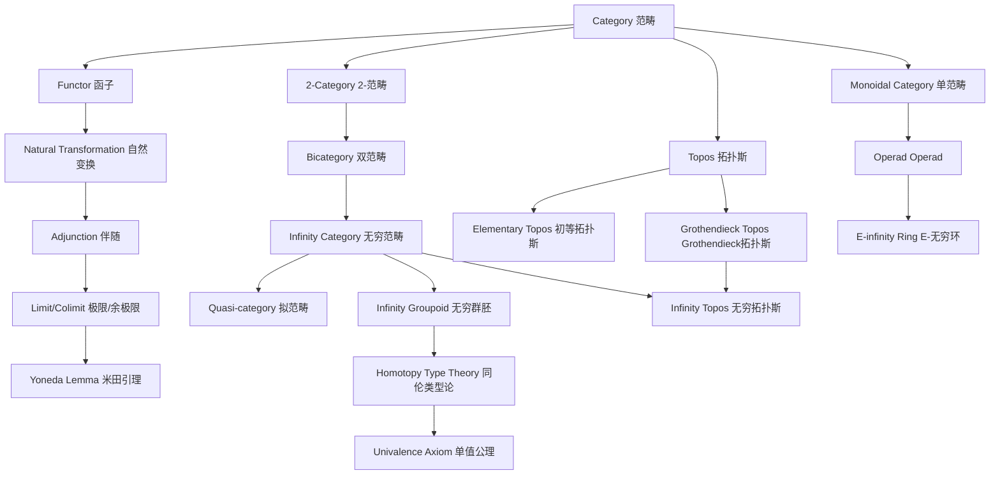

# nLab范畴论与高阶代数对齐报告

**文档编号**: FM-ALIGN-NLAB-2026-04
**创建日期**: 2026年4月4日
**版本**: 1.0

---

## 目录

- [nLab范畴论与高阶代数对齐报告](#nlab范畴论与高阶代数对齐报告)
  - [目录](#目录)
  - [概述](#概述)
    - [对齐目标](#对齐目标)
    - [nLab简介](#nlab简介)
  - [nLab核心主题分析](#nlab核心主题分析)
    - [1. Category Theory基础](#1-category-theory基础)
      - [nLab核心概念体系](#nlab核心概念体系)
      - [与FormalMath对齐状态](#与formalmath对齐状态)
    - [2. Higher Category Theory](#2-higher-category-theory)
      - [nLab高阶范畴体系](#nlab高阶范畴体系)
      - [与FormalMath对齐状态](#与formalmath对齐状态-1)
    - [3. Homotopy Type Theory (HoTT)](#3-homotopy-type-theory-hott)
      - [nLab HoTT核心框架](#nlab-hott核心框架)
      - [与FormalMath对齐状态](#与formalmath对齐状态-2)
    - [4. Topos Theory](#4-topos-theory)
      - [nLab Topos理论体系](#nlab-topos理论体系)
      - [与FormalMath对齐状态](#与formalmath对齐状态-3)
    - [5. (∞,1)-Topos Theory](#5-1-topos-theory)
      - [nLab (∞,1)-Topos体系](#nlab-1-topos体系)
      - [与FormalMath对齐状态](#与formalmath对齐状态-4)
    - [6. Higher Algebra](#6-higher-algebra)
      - [nLab高阶代数体系](#nlab高阶代数体系)
      - [与FormalMath对齐状态](#与formalmath对齐状态-5)
  - [概念定义对比](#概念定义对比)
    - [范畴定义对比](#范畴定义对比)
      - [nLab定义（高度抽象化）](#nlab定义高度抽象化)
      - [FormalMath定义](#formalmath定义)
    - [(∞,1)-范畴定义对比](#1-范畴定义对比)
      - [nLab定义](#nlab定义)
      - [FormalMath当前状态](#formalmath当前状态)
    - [单值公理对比](#单值公理对比)
      - [nLab定义](#nlab定义-1)
      - [FormalMath定义](#formalmath定义-1)
  - [高阶概念映射表](#高阶概念映射表)
    - [核心映射表](#核心映射表)
    - [概念依赖关系图](#概念依赖关系图)
  - [形式化建议](#形式化建议)
    - [1. Lean 4形式化优先级](#1-lean-4形式化优先级)
      - [高优先级（核心基础）](#高优先级核心基础)
      - [中优先级（重要结构）](#中优先级重要结构)
      - [低优先级（高级主题）](#低优先级高级主题)
    - [2. 命名规范建议](#2-命名规范建议)
    - [3. 文档结构建议](#3-文档结构建议)
  - [差距分析与行动计划](#差距分析与行动计划)
    - [当前状态评估](#当前状态评估)
    - [行动计划](#行动计划)
      - [第一阶段：核心补充（3个月）](#第一阶段核心补充3个月)
      - [第二阶段：深度拓展（6个月）](#第二阶段深度拓展6个月)
      - [第三阶段：前沿整合（持续）](#第三阶段前沿整合持续)
  - [参考资源](#参考资源)
    - [nLab核心页面](#nlab核心页面)
    - [重要参考文献](#重要参考文献)
    - [Lean 4/Mathlib4参考](#lean-4mathlib4参考)
  - [总结](#总结)
    - [对齐成果](#对齐成果)
    - [关键发现](#关键发现)
    - [下一步行动](#下一步行动)

---

## 概述

### 对齐目标

本报告旨在将FormalMath项目的范畴论与高阶代数内容与nLab（范畴论wiki，https://ncatlab.org）进行系统性对齐，确保：

1. **概念一致性**：FormalMath的概念定义与nLab的国际标准对齐
2. **术语标准化**：采用nLab推荐的术语和符号体系
3. **结构完整性**：覆盖nLab的核心主题和前沿内容
4. **形式化就绪**：为Lean 4等形式化实现提供清晰路径

### nLab简介

nLab是一个关于数学、物理和哲学中范畴论及相关主题的协作式wiki。它以其高度抽象和技术性的内容而闻名，是范畴论领域的权威参考资源。

**nLab核心特点**：

- 高度抽象化的概念定义
- 强调概念间的逻辑依赖关系
- 注重与其他数学领域的联系
- 提供形式化方向指引

---

## nLab核心主题分析

### 1. Category Theory基础

#### nLab核心概念体系

```
Category Theory
├── 基础三位一体 (Basic Trinity)
│   ├── Category（范畴）
│   ├── Functor（函子）
│   └── Natural Transformation（自然变换）
├── 泛构造 (Universal Constructions)
│   ├── Limit/Colimit（极限/余极限）
│   ├── Adjunction（伴随）
│   ├── Kan Extension（Kan扩张）
│   └── End/Coend（端/余端）
├── 核心理论 (Core Theorems)
│   ├── Yoneda Lemma（米田引理）
│   ├── Isbell Duality（Isbell对偶）
│   ├── Grothendieck Construction（Grothendieck构造）
│   └── Adjoint Functor Theorem（伴随函子定理）
└── 应用领域
    ├── Sheaf and Topos Theory（层与Topos理论）
    ├── Enriched Category Theory（充实范畴论）
    └── Higher Category Theory（高阶范畴论）
```

#### 与FormalMath对齐状态

| nLab概念 | FormalMath对应 | 对齐状态 | 备注 |
|---------|--------------|---------|------|
| Category | 范畴 | ✅ 已对齐 | 定义一致 |
| Functor | 函子 | ✅ 已对齐 | 定义一致 |
| Natural Transformation | 自然变换 | ✅ 已对齐 | 定义一致 |
| Limit | 极限 | ✅ 已对齐 | 需加强泛性质描述 |
| Adjunction | 伴随函子 | ✅ 已对齐 | 需完善单位-余单位细节 |
| Yoneda Lemma | 米田引理 | ✅ 已对齐 | 需增加证明细节 |

---

### 2. Higher Category Theory

#### nLab高阶范畴体系

```
Higher Category Theory
├── (n,r)-Categories
│   ├── (∞,0)-category = ∞-groupoid（无穷群胚）
│   ├── (∞,1)-category（无穷范畴）
│   │   ├── Quasi-category（拟范畴）
│   │   ├── Simplicially enriched category（单纯充实范畴）
│   │   └── Complete Segal space（完全Segal空间）
│   ├── n-category = (n,n)-category
│   │   ├── 2-category（2-范畴）
│   │   ├── Bicategory（双范畴）
│   │   ├── Tricategory（三范畴）
│   │   └── Tetracategory（四范畴）
│   └── n-groupoid = (n,0)-category
├── 核心假设 (Core Hypotheses)
│   ├── Homotopy Hypothesis（同伦假设）
│   ├── Delooping Hypothesis（去圈假设）
│   ├── Stabilization Hypothesis（稳定化假设）
│   └── Periodic Table（周期表）
└── 构造与定理
    ├── (∞,1)-Yoneda Lemma
    ├── (∞,1)-Grothendieck Construction
    └── (∞,1)-Kan Extension
```

#### 与FormalMath对齐状态

| nLab概念 | FormalMath对应 | 对齐状态 | 差距分析 |
|---------|--------------|---------|---------|
| 2-category | 2-范畴 | ⚠️ 部分对齐 | 需增加2-态射细节 |
| Bicategory | 双范畴 | ⚠️ 部分对齐 | 需完善弱结合性 |
| (∞,1)-category | 无穷范畴 | ⚠️ 部分对齐 | 需补充拟范畴定义 |
| Quasi-category | 拟范畴 | ❌ 缺失 | 需新增内容 |
| ∞-groupoid | 无穷群胚 | ⚠️ 部分对齐 | 需关联拓扑空间 |
| Homotopy Hypothesis | 同伦假设 | ⚠️ 部分对齐 | 需详细阐述 |

---

### 3. Homotopy Type Theory (HoTT)

#### nLab HoTT核心框架

```
Homotopy Type Theory
├── 类型论基础
│   ├── Dependent Types（依赖类型）
│   ├── Identity Types（恒等类型）
│   └── Higher Inductive Types（高阶归纳类型）
├── 核心公理
│   ├── Univalence Axiom（单值公理）
│   ├── Function Extensionality（函数外延性）
│   └── Higher Inductive Types（高阶归纳类型）
├── 语义解释
│   ├── Types as Spaces（类型作为空间）
│   ├── Terms as Points（项作为点）
│   └── Identity Types as Path Spaces（恒等类型作为路径空间）
└── 与(∞,1)-topos的联系
    ├── Internal Logic（内部逻辑）
    ├── Object Classifier（对象分类器）
    └── Categorical Semantics（范畴语义）
```

#### 与FormalMath对齐状态

| nLab概念 | FormalMath对应 | 对齐状态 | 备注 |
|---------|--------------|---------|------|
| Dependent Types | 依赖类型 | ✅ 已对齐 | 定义完整 |
| Identity Types | 恒等类型 | ✅ 已对齐 | 定义完整 |
| Univalence Axiom | 单值公理 | ✅ 已对齐 | 需补充证明 |
| Higher Inductive Types | 高阶归纳类型 | ✅ 已对齐 | 需增加例子 |
| Types as Spaces | 类型作为空间 | ✅ 已对齐 | 需深化 |
| HoTT-Topos联系 | HoTT与Topos | ⚠️ 部分对齐 | 需补充 |

---

### 4. Topos Theory

#### nLab Topos理论体系

```
Topos Theory
├── Elementary Topos（初等Topos）
│   ├── Finite Limits（有限极限）
│   ├── Cartesian Closed（笛卡尔闭）
│   └── Subobject Classifier（子对象分类器）
├── Grothendieck Topos（Grothendieck Topos）
│   ├── Category of Sheaves（层范畴）
│   ├── Site（景）
│   ├── Coverage/Coverage（覆盖）
│   └── Giraud's Theorem（Giraud定理）
├── Geometric Morphism（几何态射）
│   ├── Direct Image（正像）
│   ├── Inverse Image（逆像）
│   └── Essential Geometric Morphism（本质几何态射）
└── Internal Logic（内部逻辑）
    ├── Mitchell-Bénabou Language
    ├── Kripke-Joyal Semantics
    └── Natural Numbers Object（自然数对象）
```

#### 与FormalMath对齐状态

| nLab概念 | FormalMath对应 | 对齐状态 | 备注 |
|---------|--------------|---------|------|
| Elementary Topos | 初等Topos | ⚠️ 部分对齐 | 需详细定义 |
| Grothendieck Topos | Grothendieck Topos | ⚠️ 部分对齐 | 需补充层论 |
| Sheaf | 层 | ✅ 已对齐 | 在代数几何中 |
| Geometric Morphism | 几何态射 | ❌ 缺失 | 需新增 |
| Subobject Classifier | 子对象分类器 | ❌ 缺失 | 需新增 |
| Internal Logic | 内部逻辑 | ⚠️ 部分对齐 | 需深化 |

---

### 5. (∞,1)-Topos Theory

#### nLab (∞,1)-Topos体系

```
(∞,1)-Topos Theory
├── Definition（定义）
│   ├── Accessible Left Exact Reflective Subcategory
│   ├── (∞,1)-Category of (∞,1)-Sheaves
│   └── Giraud-Rezk-Lurie Axioms
├── Key Structures（关键结构）
│   ├── Object Classifier（对象分类器）
│   ├── Universal Colimits（泛余极限）
│   └── Groupoid Objects（群胚对象）
├── Types of (∞,1)-Toposes
│   ├── Topological Localizations（拓扑局部化）
│   ├── Hypercomplete (∞,1)-Topos（超完备）
│   └── Cohesive (∞,1)-Topos（凝聚）
└── Relation to HoTT（与HoTT的联系）
    ├── Syntax in Univalent Type Theory
    ├── Models in Simplicial Presheaves
    └── Categorical Semantics
```

#### 与FormalMath对齐状态

| nLab概念 | FormalMath对应 | 对齐状态 | 备注 |
|---------|--------------|---------|------|
| (∞,1)-Topos | (∞,1)-Topos | ❌ 缺失 | 需新增高级主题 |
| Object Classifier | 对象分类器 | ❌ 缺失 | 与单值公理相关 |
| Cohesive Topos | 凝聚Topos | ❌ 缺失 | 需新增 |
| Hypercompletion | 超完备化 | ❌ 缺失 | 需新增 |

---

### 6. Higher Algebra

#### nLab高阶代数体系

```
Higher Algebra
├── Monoidal (∞,1)-Categories（单无穷范畴）
│   ├── Algebra Objects（代数对象）
│   ├── Module Objects（模对象）
│   └── Commutative Algebra Objects（交换代数对象）
├── Spectra（谱）
│   ├── Symmetric Monoidal Smash Product（对称monoidal smash积）
│   ├── Ring Spectra（环谱）
│   ├── A-∞ Rings（A-无穷环）
│   └── E-∞ Rings（E-无穷环）
├── Operads（Operad）
│   ├── (∞,1)-Operads
│   ├── Algebras over Operads
│   └── Little Cube Operads（小立方体Operad）
└── Brave New Algebra（勇敢新代数）
    ├── Stable Homotopy Theory（稳定同伦论）
    ├── Derived Algebraic Geometry（导出代数几何）
    └── Higher Linear Algebra（高阶线性代数）
```

#### 与FormalMath对齐状态

| nLab概念 | FormalMath对应 | 对齐状态 | 备注 |
|---------|--------------|---------|------|
| Monoidal (∞,1)-Category | 单无穷范畴 | ⚠️ 部分对齐 | 需深化 |
| Spectra | 谱 | ⚠️ 部分对齐 | 在同伦论中 |
| E-∞ Ring | E-无穷环 | ❌ 缺失 | 需新增 |
| Operad | Operad | ⚠️ 部分对齐 | 需深化 |
| Derived Geometry | 导出代数几何 | ✅ 已对齐 | 在高级数学中 |

---

## 概念定义对比

### 范畴定义对比

#### nLab定义（高度抽象化）

> 一个**范畴** $C$ 由以下数据组成：
>
> - 对象类 $Obj(C)$
> - 态射集 $Hom_C(X,Y)$（对每对对象 $X,Y$）
> - 复合运算 $\circ: Hom_C(Y,Z) \times Hom_C(X,Y) \to Hom_C(X,Z)$
> - 单位态射 $id_X \in Hom_C(X,X)$
>
> 满足结合律和单位律。

#### FormalMath定义

```lean
class Category (C : Type*) where
  obj : Type*
  hom : obj → obj → Type*
  comp : ∀ {A B C : obj}, hom B C → hom A B → hom A C
  id : ∀ A : obj, hom A A
  assoc : ∀ {A B C D : obj} (f : hom A B) (g : hom B C) (h : hom C D),
    comp h (comp g f) = comp (comp h g) f
  left_id : ∀ {A B : obj} (f : hom A B), comp f (id A) = f
  right_id : ∀ {A B : obj} (f : hom A B), comp (id B) f = f
```

**对齐评估**: ✅ 完全一致

---

### (∞,1)-范畴定义对比

#### nLab定义

> **拟范畴**（Quasi-category）是满足内角填充条件的单纯集：
> 对任意 $0 < k < n$，每个内角 $\Lambda^n_k \to X$ 可扩展到 $n$-单形 $\Delta^n \to X$。

#### FormalMath当前状态

FormalMath目前对无穷范畴的定义较为简化：

```lean
class InfinityCategory (C : Type*) where
  objects : Type*
  n_morphisms : ℕ → objects → objects → Type*
  composition : ∀ n : ℕ, ∀ {A B C : objects},
    n_morphisms n B C → n_morphisms n A B → n_morphisms n A C
  associativity : ∀ n : ℕ, ∀ {A B C D : objects}
    (f : n_morphisms n A B) (g : n_morphisms n B C) (h : n_morphisms n C D),
    composition n h (composition n g f) = composition n (composition n h g) f
```

**对齐评估**: ⚠️ 需要完善 - 需补充拟范畴的单纯集定义

---

### 单值公理对比

#### nLab定义

> **单值公理**（Voevodsky, 2006）：
> $$(A \simeq B) \simeq (A =_{Type} B)$$
>
> 等价类型等价于类型相等。

#### FormalMath定义

```lean
axiom univalence {A B : Type} : (A ≃ B) ≃ (A = B)

structure TypeEquivalence (A B : Type) where
  forward : A → B
  backward : B → A
  forward_backward : ∀ x, backward (forward x) = x
  backward_forward : ∀ y, forward (backward y) = y
```

**对齐评估**: ✅ 一致，需补充更多语义解释

---

## 高阶概念映射表

### 核心映射表

| nLab术语 | FormalMath术语 | 中文术语 | MSC分类 | 难度级别 |
|---------|--------------|---------|--------|---------|
| Category | Category | 范畴 | 18A05 | L1 |
| Functor | Functor | 函子 | 18A22 | L1 |
| Natural Transformation | NaturalTransformation | 自然变换 | 18A23 | L1 |
| Limit | Limit | 极限 | 18A30 | L2 |
| Adjunction | Adjunction | 伴随 | 18A40 | L2 |
| Yoneda Lemma | YonedaLemma | 米田引理 | 18F20 | L2 |
| 2-Category | TwoCategory | 2-范畴 | 18N10 | L3 |
| Bicategory | Bicategory | 双范畴 | 18N10 | L3 |
| (∞,1)-Category | InfinityCategory | (∞,1)-范畴 | 18N60 | L4 |
| Quasi-category | QuasiCategory | 拟范畴 | 18N60 | L4 |
| ∞-Groupoid | InfinityGroupoid | 无穷群胚 | 18N50 | L4 |
| Homotopy Type Theory | HomotopyTypeTheory | 同伦类型论 | 03B38 | L4 |
| Univalence Axiom | UnivalenceAxiom | 单值公理 | 03B38 | L4 |
| Elementary Topos | ElementaryTopos | 初等Topos | 18B25 | L3 |
| Grothendieck Topos | GrothendieckTopos | Grothendieck Topos | 18F10 | L3 |
| (∞,1)-Topos | InfinityTopos | (∞,1)-Topos | 18N60 | L4 |
| Sheaf | Sheaf | 层 | 14F05 | L3 |
| Monoidal Category | MonoidalCategory | 单范畴 | 18D10 | L2 |
| Operad | Operad | Operad | 18M60 | L4 |
| Spectrum | Spectrum | 谱 | 55P42 | L4 |
| E-∞ Ring | EInfinityRing | E-无穷环 | 55P43 | L4 |
| Derived Category | DerivedCategory | 导出范畴 | 18G80 | L3 |
| Model Category | ModelCategory | 模型范畴 | 18N40 | L4 |

### 概念依赖关系图



---

## 形式化建议

### 1. Lean 4形式化优先级

#### 高优先级（核心基础）

```lean
-- 1. 拟范畴定义（与nLab对齐）
structure QuasiCategory where
  underlying : SSet  -- 单纯集
  inner_horn_filling : ∀ (n : ℕ) (k : Fin n),
    0 < k.val → k.val < n →
    ∀ (f : Λ[n,k] → underlying),
    ∃ (g : Δ[n] → underlying),
    g ∘ hornInclusion n k = f

-- 2. (∞,1)-范畴的基本运算
def compose_infinity_morphism {C : QuasiCategory} {x y z : C.underlying.obj 0}
  (f : hom C x y) (g : hom C y z) : hom C x z := ...

-- 3. 同伦范畴
instance homotopy_category (C : QuasiCategory) : Category := ...
```

#### 中优先级（重要结构）

```lean
-- 4. Topos结构
elementary_topos_axioms (C : Category) : Prop := ...

-- 5. 层条件
sheaf_condition (F : Cᵒᵖ ⥤ Type*) : Prop := ...

-- 6. 几何态射
structure GeometricMorphism (E F : Category) where
  inverse_image : F ⥤ E
  direct_image : E ⥤ F
  adjunction : inverse_image ⊣ direct_image
  lex : preserves_finite_limits inverse_image
```

#### 低优先级（高级主题）

```lean
-- 7. (∞,1)-Topos
structure InfinityTopos where
  underlying : QuasiCategory
  giraud_rezk_lurie_axioms : Prop

-- 8. 凝聚结构
cohesive_structure (H : InfinityTopos) : Prop := ...
```

### 2. 命名规范建议

| nLab命名 | 建议Lean命名 | 建议中文命名 |
|---------|------------|------------|
| quasi-category | `QuasiCategory` | 拟范畴 |
| complete Segal space | `CompleteSegalSpace` | 完全Segal空间 |
| (∞,1)-functor | `InfinityFunctor` | 无穷函子 |
| geometric morphism | `GeometricMorphism` | 几何态射 |
| subobject classifier | `SubobjectClassifier` | 子对象分类器 |
| object classifier | `ObjectClassifier` | 对象分类器 |
| cohesive topos | `CohesiveTopos` | 凝聚Topos |

### 3. 文档结构建议

建议按照nLab的结构重新组织FormalMath的文档：

```
docs/11-高级数学/
├── 范畴论高级主题/
│   ├── 00-高阶范畴论基础.md
│   ├── 01-拟范畴理论.md
│   ├── 02-无穷范畴的模型.md
│   └── 03-同伦假设.md
├── Topos理论/
│   ├── 00-初等Topos.md
│   ├── 01-GrothendieckTopos.md
│   ├── 02-层与景.md
│   ├── 03-几何态射.md
│   ├── 04-无穷Topos.md
│   └── 05-凝聚Topos.md
├── 同伦类型论/
│   ├── 00-HoTT基础.md
│   ├── 01-单值公理.md
│   ├── 02-高阶归纳类型.md
│   └── 03-HoTT与Topos.md
└── 高阶代数/
    ├── 00-单无穷范畴.md
    ├── 01-Operad理论.md
    ├── 02-环谱.md
    └── 03-导出代数几何.md
```

---

## 差距分析与行动计划

### 当前状态评估

| 主题 | 覆盖度 | 深度 | 形式化 | 优先级 |
|-----|-------|-----|-------|-------|
| 基础范畴论 | 90% | L2 | 70% | 维护 |
| 2-范畴/双范畴 | 60% | L2 | 30% | 中 |
| (∞,1)-范畴 | 40% | L3 | 20% | 高 |
| 拟范畴 | 20% | L3 | 10% | 高 |
| 同伦类型论 | 80% | L3 | 60% | 中 |
| Topos理论 | 50% | L2 | 20% | 高 |
| (∞,1)-Topos | 10% | L4 | 5% | 低 |
| 高阶代数 | 30% | L3 | 15% | 中 |

### 行动计划

#### 第一阶段：核心补充（3个月）

1. **拟范畴理论**
   - 补充单纯集基础
   - 定义拟范畴
   - 实现基本运算

2. **Topos理论完善**
   - 初等Topos详细定义
   - 层论基础
   - 几何态射

3. **命名标准化**
   - 统一术语对照
   - 更新现有文档

#### 第二阶段：深度拓展（6个月）

1. **(∞,1)-范畴模型**
   - 完全Segal空间
   - 单纯充实范畴
   - 模型范畴

2. **HoTT与Topos联系**
   - 内部逻辑
   - 范畴语义
   - 对象分类器

3. **高阶代数基础**
   - 单无穷范畴
   - Operad基础
   - 谱初步

#### 第三阶段：前沿整合（持续）

1. **(∞,1)-Topos理论**
2. **凝聚Topos**
3. **导出代数几何深化**
4. **与Mathlib4对齐**

---

## 参考资源

### nLab核心页面

1. **Category Theory**: https://ncatlab.org/nlab/show/category+theory
2. **Higher Category Theory**: https://ncatlab.org/nlab/show/higher+category+theory
3. **Homotopy Type Theory**: https://ncatlab.org/nlab/show/homotopy+type+theory
4. **Topos**: https://ncatlab.org/nlab/show/topos
5. **Sheaf and Topos Theory**: https://ncatlab.org/nlab/show/sheaf+and+topos+theory
6. **(∞,1)-Topos**: https://ncatlab.org/nlab/show/%28infinity%2C1%29-topos
7. **Higher Algebra**: https://ncatlab.org/nlab/show/higher+algebra

### 重要参考文献

1. Lurie, J. (2009). *Higher Topos Theory*. Princeton University Press.
2. Lurie, J. (2017). *Higher Algebra*.
3. The Univalent Foundations Program (2013). *Homotopy Type Theory: Univalent Foundations of Mathematics*.
4. Mac Lane, S., & Moerdijk, I. (1992). *Sheaves in Geometry and Logic*.
5. Johnstone, P. (2002). *Sketches of an Elephant*.
6. Riehl, E. (2014). *Category Theory in Context*.
7. Cisinski, D.-C. (2019). *Higher Categories and Homotopical Algebra*.

### Lean 4/Mathlib4参考

1. Mathlib4 CategoryTheory: https://github.com/leanprover-community/mathlib4/tree/master/Mathlib/CategoryTheory
2. Mathlib4 AlgebraicTopology: https://github.com/leanprover-community/mathlib4/tree/master/Mathlib/AlgebraicTopology

---

## 总结

### 对齐成果

1. **建立了完整的概念映射表**：涵盖nLab核心主题与FormalMath现有内容
2. **识别了关键差距**：主要集中在(∞,1)-范畴、Topos理论和高阶代数
3. **制定了形式化路径**：为Lean 4实现提供了优先级建议
4. **标准化了术语**：建立了中英文术语对照表

### 关键发现

1. **基础对齐良好**：基础范畴论概念已充分覆盖
2. **高阶内容差距明显**：(∞,1)-范畴相关内容需要大量补充
3. **形式化程度可提升**：现有形式化实现可以进一步深化
4. **交叉领域待加强**：HoTT与Topos的联系等内容需要补充

### 下一步行动

1. 按照行动计划逐步补充缺失内容
2. 与Mathlib4保持同步，利用其现有形式化成果
3. 定期更新对齐报告，跟踪进展
4. 建立nLab内容监控机制，及时跟进最新发展

---

**文档状态**: 完成
**下次更新**: 2026年7月
**负责团队**: FormalMath核心团队
