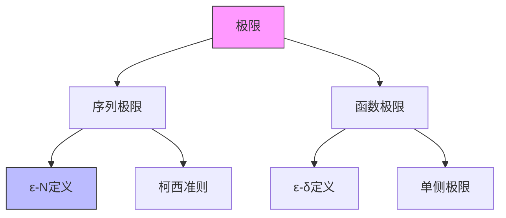

# FormalMath 多思维表征方式深化方案

**版本**: v1.0
**目标**: 每个核心概念配备3+种思维表征方式
**策略**: 深化现有表征 + 引入新型表征 + 建立交互式元素

---

## 一、现有表征方式评估

### 1.1 已有基础（良好）

| 表征方式 | 当前状态 | 质量评估 | 深化空间 |
|----------|----------|----------|----------|
| 思维导图 | ✅ 存在 | 静态图片为主 | 增加交互性 |
| 多维矩阵对比 | ✅ 存在 | 表格形式 | 增加筛选功能 |
| 决策树图 | ✅ 存在 | 静态流程图 | 增加分支详解 |
| 知识图谱 | ✅ 存在 | 节点-边图 | 增加层次过滤 |

### 1.2 待建设表征（关键缺口）

| 表征方式 | 必要性 | 技术难度 | 优先级 |
|----------|--------|----------|--------|
| Lean4代码嵌入 | ⭐⭐⭐⭐⭐ | 中 | P0 |
| 交互式可视化 | ⭐⭐⭐⭐ | 中 | P1 |
| 证明树 | ⭐⭐⭐⭐ | 低 | P1 |
| 定理依赖图 | ⭐⭐⭐ | 低 | P2 |

---

## 二、七维表征体系

### 2.1 概念图谱 (Concept Map)

**用途**: 展示概念间的层级与关联

**深化方案**:

```markdown
- 现有: 静态Mermaid图
- 升级:
  - 增加可折叠层级
  - 点击节点展开详情
  - 支持按分支过滤（只看代数/分析）
  - 颜色编码（定义-定理-例子）
```

**示例代码** (Mermaid增强):



### 2.2 多维对比矩阵 (Multi-dimensional Matrix)

**用途**: 相似概念的横向对比

**深化方案**:

```markdown
- 现有: 静态Markdown表格
- 升级:
  - 增加排序功能
  - 增加筛选功能（按难度/分支）
  - 单元格内嵌入展开详情
  - 支持导出为CSV/PDF
```

**示例**: 收敛性对比矩阵

| 收敛类型 | 定义 | 蕴含关系 | 保持性质 | 典型反例 |
|----------|------|----------|----------|----------|
| 一致收敛 | [展开] | [图示] | 连续/可积 | 无 |
| 逐点收敛 | [展开] | ⇐ | 不保证 | xⁿ on [0,1] |
| 几乎处处收敛 | [展开] | ⇐ | 不保证 | 滑动凸起 |

### 2.3 决策推理树 (Decision Tree)

**用途**: 解题路径导航

**深化方案**:

```markdown
- 现有: 静态流程图
- 升级:
  - 交互式问答引导
  - 每一步提供理论依据
  - 错误路径标注常见错误
  - 提供替代路径
```

**示例**: 判断级数收敛性决策树

```
级数 ∑aₙ
│
├─ 是否交错级数？
│  ├─ 是 → 莱布尼茨判别法
│  └─ 否 →
│
├─ 是否正项级数？
│  ├─ 是 → 比较/比值/根值判别法
│  └─ 否 →
│
└─ 一般级数 → 考察绝对收敛性
```

### 2.4 证明结构树 (Proof Tree) ⭐新增

**用途**: 展示证明的层次结构与逻辑依赖

**格式**:

```markdown
定理: 一致收敛连续函数列的极限连续
│
├─ 目标: 证明lim fₙ(x)在x₀连续
│
├─ 关键分解:
│  ├─ |f(x) - f(x₀)| ≤ |f(x) - fₙ(x)| + |fₙ(x) - fₙ(x₀)| + |fₙ(x₀) - f(x₀)|
│  │
│  ├─ 第一项 < ε/3 (一致收敛)
│  ├─ 第二项 < ε/3 (fₙ连续性)
│  └─ 第三项 < ε/3 (一致收敛)
│
└─ 结论: 由ε/3技巧得证
```

### 2.5 Lean4代码嵌入 (自然语言-形式化双语) ⭐重点

**用途**: 自然语言证明与形式化证明对照

**格式规范**:

```markdown
## 定理：中值定理

**自然语言**: 若f在[a,b]连续，在(a,b)可微，则存在c∈(a,b)使得f'(c)=(f(b)-f(a))/(b-a)

**证明思路**:
1. 构造辅助函数g(x) = f(x) - [(f(b)-f(a))/(b-a)](x-a)
2. 验证g(a) = g(b) = f(a)
3. 应用Rolle定理

**Lean4形式化**:
```lean
theorem mean_value_theorem {f : ℝ → ℝ} {a b : ℝ}
    (hab : a < b)
    (hf : ContinuousOn f (Icc a b))
    (hf' : DifferentiableOn ℝ f (Ioo a b)) :
    ∃ c ∈ Ioo a b, deriv f c = (f b - f a) / (b - a) := by
  -- 构造辅助函数
  let g := λ x => f x - ((f b - f a) / (b - a)) * (x - a)
  -- 验证g(a) = g(b)
  have h_ga : g a = f a := by simp [g]
  have h_gb : g b = f a := by
    simp [g]
    field_simp [(show b - a ≠ 0 by linarith)]
    ring
  -- 应用Rolle定理
  have h_g_continuous : ContinuousOn g (Icc a b) := ...
  have h_g differentiable : DifferentiableOn ℝ g (Ioo a b) := ...
  obtain ⟨c, hc, hgc⟩ := rolle hab h_ga (by linarith) h_g_continuous h_g_differentiable
  -- 推导结论
  use c, hc
  simp [g, deriv_sub, deriv_const_mul, deriv_id', mul_comm] at hgc
  field_simp [(show b - a ≠ 0 by linarith)] at hgc ⊢
  linarith
```

**对照说明**:

| 行号 | Lean4代码 | 对应自然语言 |
|------|-----------|--------------|
| 7 | let g := ... | 构造辅助函数 |
| 10-14 | have h_ga / h_gb | 验证端点值相等 |
| 20 | obtain ⟨c, hc, hgc⟩ := rolle ... | 应用Rolle定理 |

```

### 2.6 交互式可视化 (Interactive Visualization) ⭐创新

**用途**: 动态展示数学对象的行为

**技术方案**:
- GeoGebra嵌入（几何/微积分）
- Desmos图形（函数可视化）
- Wolfram Cloud Widgets（复杂计算）
- Manim动画（概念演示）

**示例**: 一致收敛可视化

```markdown
<iframe src="https://www.geogebra.org/classic#matrix/..." width="800" height="600">
交互区域：
- 滑块控制n（显示fₙ(x) = xⁿ）
- 显示ε-管
- 动画演示为何无法一致收敛
</iframe>
```

### 2.7 历史演进时间线 (Historical Timeline)

**用途**: 展示概念的历史发展脉络

**格式**:

```markdown
| 年份 | 数学家 | 贡献 | 文献引用 |
|------|--------|------|----------|
| 1821 | Cauchy | 首次尝试定义极限 | Cours d'Analyse |
| 1850 | Weierstrass | ε-δ语言严格化 | 柏林讲义 |
| 1872 | Dedekind | 实数构造 | Stetigkeit und irrationale Zahlen |
```

---

## 三、表征选择指南

### 3.1 按概念类型选择

| 概念类型 | 推荐表征组合 | 理由 |
|----------|--------------|------|
| 定义类 | 概念图谱 + Lean4嵌入 | 结构+严格性 |
| 定理类 | 证明树 + Lean4嵌入 | 逻辑+验证 |
| 方法类 | 决策树 + 工作示例 | 应用+示范 |
| 对比类 | 多维矩阵 + 反例 | 辨析+边界 |
| 历史类 | 时间线 + 原始文献 | 背景+溯源 |

### 3.2 按学习阶段选择

| 学习阶段 | 主要表征 | 辅助表征 |
|----------|----------|----------|
| 初学 | 概念图谱 + 交互可视化 | 工作示例 |
| 进阶 | 证明树 + 多维矩阵 | 决策树 |
| 高级 | Lean4嵌入 + 原始文献 | 定理依赖图 |

---

## 四、实施路线图

### 阶段一：标准化 (Round 35)

| 任务 | 交付物 | 验收标准 |
|------|--------|----------|
| 制定表征规范 | 《多思维表征格式规范v1.0》 | 覆盖7种表征 |
| 建立模板库 | 10套标准模板 | 可复制使用 |
| 培训文档 | 《表征方式选择指南》 | 含决策流程图 |

### 阶段二：试点应用 (Round 36-37)

| 领域 | 试点概念 | 表征覆盖 |
|------|----------|----------|
| 实分析 | 极限、连续性 | 7种全应用 |
| 抽象代数 | 群、同态 | 5种应用 |

### 阶段三：全面推广 (Round 38-40)

- 前100个核心概念全表征覆盖
- 建立表征质量审核机制
- 用户反馈收集与优化

---

## 五、质量控制

### 5.1 表征质量检查清单

- [ ] 表征与概念匹配度高
- [ ] 不同表征间信息一致
- [ ] 交互元素响应正常
- [ ] Lean4代码可编译通过
- [ ] 可视化清晰可读

### 5.2 更新维护

| 表征类型 | 更新频率 | 维护责任人 |
|----------|----------|------------|
| 概念图谱 | 每月 | 内容团队 |
| Lean4代码 | 每Mathlib4版本 | 形式化团队 |
| 交互可视化 | 按需 | 技术团队 |

---

**方案负责人**: [待指定]
**最后更新**: 2026年4月9日
