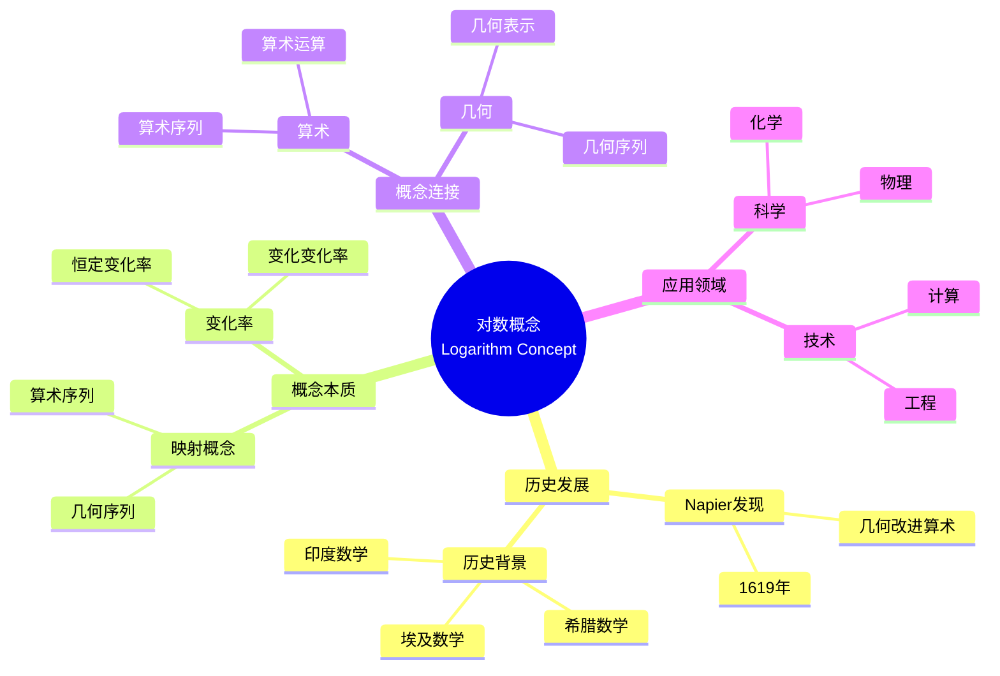

# 中等数学教育中概念映射的课程含义

Curricular Implications of Concept Mapping in Secondary Mathematics Education

**创建日期**: 2025年12月11日
**创建日期**: December 11, 2025
**研究领域**: 数学教育 - 概念映射 - 中等数学 - 课程含义
**研究领域**: Mathematics Education - Concept Mapping - Secondary Mathematics - Curricular Implications
**主题编号**: CM.03.04
**章节**: Chapter 9
**作者**: James J. Vagliardo
**优先级**: P0（最高优先级）⭐⭐⭐⭐⭐

---

## 📑 目录 / Table of Contents

- [中等数学教育中概念映射的课程含义](#中等数学教育中概念映射的课程含义)
  - [📑 目录 / Table of Contents](#-目录--table-of-contents)
  - [📋 一、概述 / Overview](#-一概述--overview)
    - [1.1 研究目标 / Research Objectives](#11-研究目标--research-objectives)
    - [1.2 核心内容 / Core Content](#12-核心内容--core-content)
  - [🔬 二、研究方法 / Research Methodology](#-二研究方法--research-methodology)
    - [2.1 研究设计 / Research Design](#21-研究设计--research-design)
    - [2.2 数据收集 / Data Collection](#22-数据收集--data-collection)
  - [📚 三、对数数学内容深度分析 / Deep Analysis of Logarithm Mathematical Content](#-三对数数学内容深度分析--deep-analysis-of-logarithm-mathematical-content)
    - [3.1 对数的数学定义与本质 / Mathematical Definition and Essence of Logarithms](#31-对数的数学定义与本质--mathematical-definition-and-essence-of-logarithms)
      - [3.1.1 对数的基本定义 / Basic Definition of Logarithms](#311-对数的基本定义--basic-definition-of-logarithms)
      - [3.1.2 对数的数学性质 / Mathematical Properties of Logarithms](#312-对数的数学性质--mathematical-properties-of-logarithms)
      - [3.1.3 对数函数的数学结构 / Mathematical Structure of Logarithmic Functions](#313-对数函数的数学结构--mathematical-structure-of-logarithmic-functions)
    - [3.2 对数的数学应用 / Mathematical Applications of Logarithms](#32-对数的数学应用--mathematical-applications-of-logarithms)
      - [3.2.1 计算应用 / Computational Applications](#321-计算应用--computational-applications)
      - [3.2.2 科学应用 / Scientific Applications](#322-科学应用--scientific-applications)
      - [3.2.3 对数尺度 / Logarithmic Scales](#323-对数尺度--logarithmic-scales)
    - [3.3 对数与其他数学概念的关联 / Relationships Between Logarithms and Other Mathematical Concepts](#33-对数与其他数学概念的关联--relationships-between-logarithms-and-other-mathematical-concepts)
      - [3.3.1 对数与指数 / Logarithms and Exponents](#331-对数与指数--logarithms-and-exponents)
      - [3.3.2 对数与微积分 / Logarithms and Calculus](#332-对数与微积分--logarithms-and-calculus)
      - [3.3.3 对数与级数 / Logarithms and Series](#333-对数与级数--logarithms-and-series)
    - [3.4 对数数学内容典型例题 / Typical Examples of Logarithm Mathematical Content](#34-对数数学内容典型例题--typical-examples-of-logarithm-mathematical-content)
      - [3.4.1 对数基本运算与性质应用 / Basic Logarithm Operations and Properties](#341-对数基本运算与性质应用--basic-logarithm-operations-and-properties)
      - [3.4.2 对数方程求解 / Solving Logarithmic Equations](#342-对数方程求解--solving-logarithmic-equations)
      - [3.4.3 对数在实际问题中的应用 / Application of Logarithms in Real-World Problems](#343-对数在实际问题中的应用--application-of-logarithms-in-real-world-problems)
    - [3.5 跨主题关联小结 / Cross-Topic Association Summary](#35-跨主题关联小结--cross-topic-association-summary)
      - [3.5.1 对数与指数函数在增长模型中的联动 / Linkage Between Logarithms and Exponential Functions in Growth Models](#351-对数与指数函数在增长模型中的联动--linkage-between-logarithms-and-exponential-functions-in-growth-models)
      - [3.5.2 对数与微积分在变化率分析中的关联 / Association Between Logarithms and Calculus in Rate of Change Analysis](#352-对数与微积分在变化率分析中的关联--association-between-logarithms-and-calculus-in-rate-of-change-analysis)
  - [📖 四、对数概念的历史发展 / Historical Development of Logarithm Concept](#-四对数概念的历史发展--historical-development-of-logarithm-concept)
    - [4.1 历史背景 / Historical Background](#41-历史背景--historical-background)
    - [4.2 Napier的对数定义 / Napier's Definition of Logarithm](#42-napier的对数定义--napiers-definition-of-logarithm)
    - [4.3 历史意义 / Historical Significance](#43-历史意义--historical-significance)
  - [💡 五、对数概念的本质 / Conceptual Essence of Logarithm](#-五对数概念的本质--conceptual-essence-of-logarithm)
    - [5.1 概念本质定义 / Conceptual Essence Definition](#51-概念本质定义--conceptual-essence-definition)
    - [5.2 概念本质的意义 / Significance of Conceptual Essence](#52-概念本质的意义--significance-of-conceptual-essence)
    - [5.3 概念映射展示 / Concept Map Display](#53-概念映射展示--concept-map-display)
  - [📊 六、概念映射应用 / Concept Mapping Application](#-六概念映射应用--concept-mapping-application)
    - [6.1 历史研究应用 / Historical Research Application](#61-历史研究应用--historical-research-application)
    - [6.2 概念分析应用 / Conceptual Analysis Application](#62-概念分析应用--conceptual-analysis-application)
    - [6.3 课程设计应用 / Curriculum Design Application](#63-课程设计应用--curriculum-design-application)
  - [📈 七、课程含义分析 / Curricular Implications Analysis](#-七课程含义分析--curricular-implications-analysis)
    - [7.1 对课程设计的含义 / Implications for Curriculum Design](#71-对课程设计的含义--implications-for-curriculum-design)
    - [7.2 对教学的含义 / Implications for Teaching](#72-对教学的含义--implications-for-teaching)
    - [7.3 对学习的含义 / Implications for Learning](#73-对学习的含义--implications-for-learning)
    - [7.4 对数主题的概念结构 / Conceptual Structure of Logarithm Topic](#74-对数主题的概念结构--conceptual-structure-of-logarithm-topic)
      - [7.4.1 历史-概念维度 / Historical-Conceptual Dimension](#741-历史-概念维度--historical-conceptual-dimension)
      - [7.4.2 数学结构维度 / Mathematical Structure Dimension](#742-数学结构维度--mathematical-structure-dimension)
      - [7.4.3 概念关联维度 / Concept Association Dimension](#743-概念关联维度--concept-association-dimension)
    - [7.5 具体教学建议 / Specific Teaching Recommendations](#75-具体教学建议--specific-teaching-recommendations)
      - [7.5.1 引入阶段的教学建议 / Teaching Recommendations for Introduction Phase](#751-引入阶段的教学建议--teaching-recommendations-for-introduction-phase)
      - [7.5.2 概念建构阶段的教学建议 / Teaching Recommendations for Concept Construction Phase](#752-概念建构阶段的教学建议--teaching-recommendations-for-concept-construction-phase)
      - [7.5.3 应用阶段的教学建议 / Teaching Recommendations for Application Phase](#753-应用阶段的教学建议--teaching-recommendations-for-application-phase)
      - [7.5.4 评估阶段的教学建议 / Teaching Recommendations for Assessment Phase](#754-评估阶段的教学建议--teaching-recommendations-for-assessment-phase)
  - [📈 八、思维表征方式 / Representation Methods](#-八思维表征方式--representation-methods)
    - [8.1 对数概念映射思维导图 / Logarithm Concept Map Mind Map](#81-对数概念映射思维导图--logarithm-concept-map-mind-map)
    - [8.2 课程设计决策树 / Curriculum Design Decision Tree](#82-课程设计决策树--curriculum-design-decision-tree)
    - [8.3 课程含义证明树 / Curricular Implications Proof Tree](#83-课程含义证明树--curricular-implications-proof-tree)
  - [📚 九、参考文献 / References](#-九参考文献--references)
    - [9.1 主要参考文献 / Main References](#91-主要参考文献--main-references)
    - [9.2 相关研究 / Related Research](#92-相关研究--related-research)

---

## 📋 一、概述 / Overview

### 1.1 研究目标 / Research Objectives

**主要目标 / Main Objectives**:

- 展示概念映射与历史研究结合作为认识论工具的价值
- Demonstrating the value of concept mapping combined with historical research as an epistemological tool
- 展示如何识别对数等数学概念的概念本质
- Demonstrating how to identify the conceptual essence of mathematical concepts such as logarithms
- 说明概念映射在课程设计中的作用
- Illustrating the role of concept mapping in curriculum design

### 1.2 核心内容 / Core Content

**主要内容 / Main Content**:

1. **历史研究** - 对数概念的历史发展
   Historical Research - Historical development of logarithm concept
2. **概念本质** - 对数概念的概念本质
   Conceptual Essence - Conceptual essence of logarithm concept
3. **课程含义** - 对课程设计的含义
   Curricular Implications - Implications for curriculum design

---

## 🔬 二、研究方法 / Research Methodology

### 2.1 研究设计 / Research Design

**研究方法 / Research Method**: 历史研究与概念分析 / Historical Research and Conceptual Analysis

**研究过程 / Research Process**:

1. **历史研究** - 研究对数概念的历史发展
   Historical Research - Research historical development of logarithm concept
2. **概念分析** - 分析对数概念的本质
   Conceptual Analysis - Analyze essence of logarithm concept
3. **概念映射** - 构建对数概念的概念映射
   Concept Mapping - Construct concept map of logarithm concept
4. **课程分析** - 分析课程含义
   Curriculum Analysis - Analyze curricular implications

### 2.2 数据收集 / Data Collection

**收集的数据类型 / Types of Data Collected**:

1. **历史文献** - 对数概念的历史文献
2. **概念映射** - 对数概念的概念映射
3. **课程分析** - 课程含义分析

---

## 📚 三、对数数学内容深度分析 / Deep Analysis of Logarithm Mathematical Content

### 3.1 对数的数学定义与本质 / Mathematical Definition and Essence of Logarithms

#### 3.1.1 对数的基本定义 / Basic Definition of Logarithms

**对数定义 / Logarithm Definition**:

- **指数定义 / Exponential Definition**:
  - 如果 $a^y = x$（其中 $a > 0, a \neq 1$），则 $y = \log_a x$
  - If $a^y = x$ (where $a > 0, a \neq 1$), then $y = \log_a x$
  - $a$ 称为底数，$x$ 称为真数，$y$ 称为对数
  - $a$ is the base, $x$ is the argument, $y$ is the logarithm

- **几何定义 / Geometric Definition** (Napier的原始定义):
  - 对数表示几何序列和算术序列之间的映射关系
  - Logarithm represents the mapping between geometric and arithmetic sequences
  - 两个点同时从起点出发，一个沿直线加速移动，一个匀速移动
  - Two points start simultaneously, one accelerates along a line, one moves at constant speed

**对数的本质 / Essence of Logarithms**:

- **算术与几何的桥梁**: 对数连接算术序列和几何序列
- **Bridge between Arithmetic and Geometry**: Logarithms connect arithmetic and geometric sequences
- **计算工具**: 将乘法转化为加法，除法转化为减法
- **Computational Tool**: Transform multiplication to addition, division to subtraction

#### 3.1.2 对数的数学性质 / Mathematical Properties of Logarithms

**基本性质 / Basic Properties**:

1. **对数的基本恒等式 / Basic Logarithmic Identities**:
   - $\log_a 1 = 0$
   - $\log_a a = 1$
   - $a^{\log_a x} = x$

2. **对数的运算法则 / Logarithmic Laws**:
   - **乘积法则**: $\log_a(xy) = \log_a x + \log_a y$
   - **商法则**: $\log_a\left(\frac{x}{y}\right) = \log_a x - \log_a y$
   - **幂法则**: $\log_a(x^n) = n \log_a x$
   - **换底公式**: $\log_a x = \frac{\log_b x}{\log_b a}$

3. **特殊对数 / Special Logarithms**:
   - **自然对数**: $\ln x = \log_e x$（底数为 $e \approx 2.718$）
   - **常用对数**: $\log x = \log_{10} x$（底数为10）

#### 3.1.3 对数函数的数学结构 / Mathematical Structure of Logarithmic Functions

**对数函数定义 / Logarithmic Function Definition**:

$$f(x) = \log_a x, \quad x > 0, \quad a > 0, \quad a \neq 1$$

**函数性质 / Function Properties**:

- **定义域**: $(0, +\infty)$
- **值域**: $(-\infty, +\infty)$
- **单调性**:
  - $a > 1$ 时递增
  - $0 < a < 1$ 时递减
- **特殊点**: $(1, 0)$ 始终在函数图像上

**对数函数与指数函数的关系 / Relationship with Exponential Functions**:

- 对数函数和指数函数互为反函数
- Logarithmic and exponential functions are inverse functions
- $y = \log_a x \Leftrightarrow x = a^y$
- 图像关于直线 $y = x$ 对称
- Graphs are symmetric about the line $y = x$

### 3.2 对数的数学应用 / Mathematical Applications of Logarithms

#### 3.2.1 计算应用 / Computational Applications

**简化计算 / Simplifying Calculations**:

- **大数乘法**: 通过对数将乘法转化为加法
  - Large number multiplication: convert multiplication to addition via logarithms
  - 例如：计算 $10^6 \times 10^9$
  - Example: calculate $10^6 \times 10^9$
  - $\log(10^6 \times 10^9) = \log 10^6 + \log 10^9 = 6 + 9 = 15$
  - 因此：$10^6 \times 10^9 = 10^{15}$

- **大数除法**: 通过对数将除法转化为减法
  - Large number division: convert division to subtraction via logarithms

- **幂运算**: 通过对数将幂运算转化为乘法
  - Power operations: convert power to multiplication via logarithms

#### 3.2.2 科学应用 / Scientific Applications

**物理应用 / Physical Applications**:

- **里氏震级**: $R = \log_{10}\left(\frac{I}{I_0}\right)$
  - Richter scale: $R = \log_{10}\left(\frac{I}{I_0}\right)$

- **pH值**: $\text{pH} = -\log_{10}[\text{H}^+]$
  - pH value: $\text{pH} = -\log_{10}[\text{H}^+]$

- **放射性衰变**: $N(t) = N_0 e^{-\lambda t}$，半衰期涉及对数
  - Radioactive decay: $N(t) = N_0 e^{-\lambda t}$, half-life involves logarithms

**生物应用 / Biological Applications**:

- **人口增长模型**: 涉及对数
- **细胞分裂**: 涉及对数增长

#### 3.2.3 对数尺度 / Logarithmic Scales

**对数尺度的数学原理 / Mathematical Principle of Logarithmic Scales**:

- 在对数尺度上，位置与对数值成正比
- On logarithmic scales, position is proportional to logarithm value
- 用于表示大范围的数据
- Used to represent data over wide ranges

**应用示例 / Application Examples**:

- **对数坐标纸**: 用于绘制指数关系
- **分贝尺度**: 声音强度的对数表示
- **星等尺度**: 星星亮度的对数表示

### 3.3 对数与其他数学概念的关联 / Relationships Between Logarithms and Other Mathematical Concepts

#### 3.3.1 对数与指数 / Logarithms and Exponents

**互逆关系 / Inverse Relationship**:

- 对数和指数是互逆运算
- Logarithms and exponents are inverse operations
- $y = \log_a x \Leftrightarrow x = a^y$

#### 3.3.2 对数与微积分 / Logarithms and Calculus

**导数关系 / Derivative Relationship**:

- $(\ln x)' = \frac{1}{x}$
- $(\log_a x)' = \frac{1}{x \ln a}$

**积分关系 / Integral Relationship**:

- $\int \frac{1}{x} dx = \ln |x| + C$

#### 3.3.3 对数与级数 / Logarithms and Series

**对数级数展开 / Logarithmic Series Expansion**:

$$\ln(1+x) = x - \frac{x^2}{2} + \frac{x^3}{3} - \frac{x^4}{4} + \cdots, \quad |x| < 1$$

### 3.4 对数数学内容典型例题 / Typical Examples of Logarithm Mathematical Content

#### 3.4.1 对数基本运算与性质应用 / Basic Logarithm Operations and Properties

**例题 / Example**:

- 计算：$\log_2 8 + \log_2 4 - \log_2 2$
- Calculate: $\log_2 8 + \log_2 4 - \log_2 2$

**解答 / Solution**:

**步骤1 / Step 1**: 识别对数性质

- Identify logarithm properties

使用对数的乘积法则和商法则：

- Use product rule and quotient rule of logarithms:

$$\log_2 8 + \log_2 4 - \log_2 2 = \log_2 (8 \times 4) - \log_2 2 = \log_2 32 - \log_2 2 = \log_2 \frac{32}{2} = \log_2 16$$

**步骤2 / Step 2**: 计算最终值

- Calculate final value

由于 $2^4 = 16$，所以：

- Since $2^4 = 16$, we have:

$$\log_2 16 = 4$$

**答案 / Answer**: $4$

**数学意义 / Mathematical Meaning**:

- **对数运算律的应用**: 这道题展示了如何运用对数的乘积法则（$\log_a (xy) = \log_a x + \log_a y$）和商法则（$\log_a \frac{x}{y} = \log_a x - \log_a y$）简化复杂的对数表达式。
- **Application of Logarithm Laws**: This problem demonstrates how to use the product rule ($\log_a (xy) = \log_a x + \log_a y$) and quotient rule ($\log_a \frac{x}{y} = \log_a x - \log_a y$) to simplify complex logarithmic expressions.

- **对数与指数的互逆关系**: 最终的计算依赖于对数的定义：$\log_2 16$ 表示"2的多少次方等于16"，这体现了对数作为指数运算的逆运算的本质。
- **Inverse Relationship Between Logarithms and Exponents**: The final calculation relies on the definition of logarithm: $\log_2 16$ represents "what power of 2 equals 16", demonstrating the essence of logarithm as the inverse operation of exponentiation.

#### 3.4.2 对数方程求解 / Solving Logarithmic Equations

**例题 / Example**:

- 解方程：$\log_3 (x+2) + \log_3 (x-1) = 2$
- Solve the equation: $\log_3 (x+2) + \log_3 (x-1) = 2$

**解答 / Solution**:

**步骤1 / Step 1**: 应用对数乘积法则

- Apply logarithm product rule

$$\log_3 (x+2) + \log_3 (x-1) = \log_3 [(x+2)(x-1)] = 2$$

**步骤2 / Step 2**: 将对数方程转化为指数方程

- Convert logarithmic equation to exponential equation

$$\log_3 [(x+2)(x-1)] = 2 \Rightarrow (x+2)(x-1) = 3^2 = 9$$

**步骤3 / Step 3**: 展开并整理

- Expand and simplify

$$(x+2)(x-1) = x^2 + x - 2 = 9$$

$$x^2 + x - 11 = 0$$

**步骤4 / Step 4**: 求解二次方程

- Solve the quadratic equation

使用求根公式：

- Using quadratic formula:

$$x = \frac{-1 \pm \sqrt{1 + 44}}{2} = \frac{-1 \pm \sqrt{45}}{2} = \frac{-1 \pm 3\sqrt{5}}{2}$$

**步骤5 / Step 5**: 验证定义域

- Verify domain

由于对数函数的定义域要求：

- Domain requirements for logarithmic functions:

- $x+2 > 0 \Rightarrow x > -2$
- $x-1 > 0 \Rightarrow x > 1$

因此 $x > 1$。

检查两个解：

- Check both solutions:

- $x_1 = \frac{-1 + 3\sqrt{5}}{2} \approx \frac{-1 + 6.708}{2} \approx 2.854 > 1$ ✓
- $x_2 = \frac{-1 - 3\sqrt{5}}{2} \approx \frac{-1 - 6.708}{2} \approx -3.854 < 1$ ✗

**答案 / Answer**: $x = \frac{-1 + 3\sqrt{5}}{2}$

**数学意义 / Mathematical Meaning**:

- **对数方程求解策略**: 这道题展示了求解对数方程的标准方法：先利用对数性质合并项，然后通过指数化将对数方程转化为代数方程，最后验证解是否满足定义域要求。
- **Logarithmic Equation Solving Strategy**: This problem demonstrates the standard method for solving logarithmic equations: first use logarithm properties to combine terms, then convert the logarithmic equation to an algebraic equation through exponentiation, and finally verify that solutions satisfy domain requirements.

- **定义域的重要性**: 对数函数的定义域限制（真数必须大于0）是求解对数方程时必须考虑的关键因素，这体现了数学中定义域概念的重要性。
- **Importance of Domain**: The domain restriction of logarithmic functions (argument must be greater than 0) is a crucial factor that must be considered when solving logarithmic equations, demonstrating the importance of the domain concept in mathematics.

#### 3.4.3 对数在实际问题中的应用 / Application of Logarithms in Real-World Problems

**例题 / Example**:

- 某种细菌的数量每小时增长25%。如果初始数量为1000个，问多少小时后细菌数量将达到10000个？
- A certain bacteria population increases by 25% per hour. If the initial population is 1000, how many hours will it take for the population to reach 10000?

**解答 / Solution**:

**步骤1 / Step 1**: 建立数学模型

- Establish mathematical model

设 $t$ 为时间（小时），$P(t)$ 为 $t$ 小时后的细菌数量。

- Let $t$ be time (hours), $P(t)$ be the population after $t$ hours.

由于每小时增长25%，增长因子为 $1.25$，因此：

- Since the population increases by 25% per hour, the growth factor is $1.25$, so:

$$P(t) = 1000 \times (1.25)^t$$

**步骤2 / Step 2**: 建立方程

- Set up equation

$$1000 \times (1.25)^t = 10000$$

$$(1.25)^t = 10$$

**步骤3 / Step 3**: 应用对数求解

- Apply logarithm to solve

两边取对数（以10为底或自然对数）：

- Take logarithm on both sides (base 10 or natural logarithm):

$$\log (1.25)^t = \log 10$$

$$t \log 1.25 = 1$$

$$t = \frac{1}{\log 1.25} \approx \frac{1}{0.0969} \approx 10.32$$

**步骤4 / Step 4**: 解释结果

- Interpret result

因此，大约需要10.32小时（约10小时19分钟）后，细菌数量将达到10000个。

- Therefore, it will take approximately 10.32 hours (about 10 hours 19 minutes) for the population to reach 10000.

**答案 / Answer**: 约10.32小时

**数学意义 / Mathematical Meaning**:

- **指数增长模型**: 这道题展示了指数增长模型 $P(t) = P_0 \times (1+r)^t$ 在实际问题中的应用，其中 $r$ 是增长率，$P_0$ 是初始值。
- **Exponential Growth Model**: This problem demonstrates the application of the exponential growth model $P(t) = P_0 \times (1+r)^t$ in real-world problems, where $r$ is the growth rate and $P_0$ is the initial value.

- **对数作为求解工具**: 当需要求解指数方程中的指数时，对数是必不可少的工具。这体现了对数作为指数运算逆运算的实用价值。
- **Logarithm as a Solving Tool**: When solving for the exponent in an exponential equation, logarithms are an essential tool. This demonstrates the practical value of logarithms as the inverse operation of exponentiation.

- **跨学科应用**: 对数在生物学、经济学、物理学等多个领域都有广泛应用，这道题展示了数学工具在解决实际问题中的重要作用。
- **Interdisciplinary Applications**: Logarithms have wide applications in biology, economics, physics, and many other fields. This problem demonstrates the important role of mathematical tools in solving practical problems.

### 3.5 跨主题关联小结 / Cross-Topic Association Summary

#### 3.5.1 对数与指数函数在增长模型中的联动 / Linkage Between Logarithms and Exponential Functions in Growth Models

**核心关联 / Core Association**:

对数和指数函数在增长模型中形成互补关系：指数函数描述增长过程，对数函数用于求解增长参数。

**指数增长模型 / Exponential Growth Model**:

$$P(t) = P_0 e^{rt}$$

其中：

- where:
  - $P(t)$ 是 $t$ 时刻的数量
  - $P(t)$ is the quantity at time $t$
  - $P_0$ 是初始数量
  - $P_0$ is the initial quantity
  - $r$ 是增长率
  - $r$ is the growth rate

**对数在求解中的应用 / Application of Logarithms in Solving**:

**应用1：求解增长率 / Application 1: Solving Growth Rate**

如果已知 $P(t)$、$P_0$ 和 $t$，使用对数求解 $r$：

- If $P(t)$, $P_0$, and $t$ are known, use logarithm to solve for $r$:

$$\ln\left(\frac{P(t)}{P_0}\right) = rt$$

$$r = \frac{1}{t}\ln\left(\frac{P(t)}{P_0}\right)$$

**应用2：求解时间 / Application 2: Solving Time**

如果已知目标值 $P(t)$，使用对数求解达到目标的时间：

- If target value $P(t)$ is known, use logarithm to solve for time to reach target:

$$t = \frac{1}{r}\ln\left(\frac{P(t)}{P_0}\right)$$

**应用3：半衰期计算 / Application 3: Half-Life Calculation**

对于衰减模型 $N(t) = N_0 e^{-\lambda t}$，半衰期：

- For decay model $N(t) = N_0 e^{-\lambda t}$, half-life:

$$T_{1/2} = \frac{\ln 2}{\lambda}$$

**数学意义 / Mathematical Meaning**:

- **互逆关系的应用**: 对数和指数函数是互逆的，这种关系在增长模型中表现为：指数函数描述"增长多少"，对数函数回答"何时达到"或"增长率是多少"。
- **Application of Inverse Relationship**: Logarithms and exponential functions are inverse, and this relationship in growth models manifests as: exponential functions describe "how much growth", while logarithmic functions answer "when to reach" or "what is the growth rate".

- **建模的完整性**: 完整的增长模型需要同时理解指数增长和对数求解，这体现了数学概念之间的互补性和系统性。
- **Completeness of Modeling**: A complete growth model requires understanding both exponential growth and logarithmic solving, demonstrating the complementary and systematic nature of mathematical concepts.

- **跨学科统一性**: 这种对数-指数联动在生物学（人口增长）、经济学（复利计算）、物理学（放射性衰变）等多个领域都有应用，体现了数学模型的通用性。
- **Interdisciplinary Unity**: This logarithm-exponential linkage has applications in biology (population growth), economics (compound interest), physics (radioactive decay), and many other fields, demonstrating the universality of mathematical models.

#### 3.5.2 对数与微积分在变化率分析中的关联 / Association Between Logarithms and Calculus in Rate of Change Analysis

**核心关联 / Core Association**:

对数的导数 $\frac{d}{dx}(\ln x) = \frac{1}{x}$ 和对数的积分 $\int \frac{1}{x} dx = \ln |x| + C$ 体现了对数在微积分中的基础地位。这种关联不仅体现在计算公式上，更深层地体现了对数作为"反比例函数的原函数"的本质。

**导数关系 / Derivative Relationship**:

- **对数函数的导数**: $(\ln x)' = \frac{1}{x}$
- **Derivative of logarithmic function**: $(\ln x)' = \frac{1}{x}$
- **一般对数函数的导数**: $(\log_a x)' = \frac{1}{x \ln a}$
- **Derivative of general logarithmic function**: $(\log_a x)' = \frac{1}{x \ln a}$

**积分关系 / Integral Relationship**:

- **基本积分**: $\int \frac{1}{x} dx = \ln |x| + C$
- **Basic integral**: $\int \frac{1}{x} dx = \ln |x| + C$
- **应用**: 许多有理函数的积分最终归结为对数函数
- **Application**: Many rational function integrals ultimately reduce to logarithmic functions

**数学结构分析 / Mathematical Structure Analysis**:

- **对数作为反比例函数的原函数**: 对数函数 $\ln x$ 是反比例函数 $\frac{1}{x}$ 的原函数，这体现了对数在积分理论中的基础地位。反比例函数是唯一一个其原函数不是幂函数的幂函数类型函数。
- **Logarithm as Antiderivative of Reciprocal Function**: The logarithmic function $\ln x$ is the antiderivative of the reciprocal function $\frac{1}{x}$, demonstrating the fundamental position of logarithms in integration theory. The reciprocal function is the only power function type whose antiderivative is not a power function.
- **对数微分的几何意义**: 对数函数的导数 $\frac{1}{x}$ 表示对数曲线在点 $x$ 处的斜率，这个斜率随 $x$ 增大而减小，体现了对数函数的"增长递减"特性。
- **Geometric Meaning of Logarithmic Differentiation**: The derivative $\frac{1}{x}$ of the logarithmic function represents the slope of the logarithmic curve at point $x$. This slope decreases as $x$ increases, demonstrating the "decreasing growth" characteristic of logarithmic functions.
- **对数积分与部分分式分解**: 许多有理函数的积分可以通过部分分式分解转化为 $\int \frac{1}{x-a} dx$ 的形式，最终得到对数函数，这体现了对数在有理函数积分中的核心作用。
- **Logarithmic Integration and Partial Fraction Decomposition**: Many rational function integrals can be transformed into the form $\int \frac{1}{x-a} dx$ through partial fraction decomposition, ultimately yielding logarithmic functions, demonstrating the core role of logarithms in rational function integration.
- **相对变化率与对数**: 如果 $y = f(x)$，则 $\frac{d}{dx}(\ln y) = \frac{y'}{y}$ 表示相对变化率（百分比变化率），这在对数微分法中用于简化复杂函数的求导。
- **Relative Rate of Change and Logarithms**: If $y = f(x)$, then $\frac{d}{dx}(\ln y) = \frac{y'}{y}$ represents the relative rate of change (percentage rate of change), which is used in logarithmic differentiation to simplify differentiation of complex functions.

**应用扩展 / Application Extensions**:

- **对数微分法**: 对于形如 $y = f(x)^{g(x)}$ 的复杂函数，可以先取对数 $\ln y = g(x) \ln f(x)$，然后求导，这体现了对数在简化复杂函数求导中的应用。
- **Logarithmic Differentiation**: For complex functions of the form $y = f(x)^{g(x)}$, we can first take the logarithm $\ln y = g(x) \ln f(x)$, then differentiate, demonstrating the application of logarithms in simplifying differentiation of complex functions.
- **积分中的对数替换**: 许多积分问题可以通过对数替换（如 $u = \ln x$）来简化，这体现了对数在积分技巧中的应用。
- **Logarithmic Substitution in Integration**: Many integration problems can be simplified through logarithmic substitution (e.g., $u = \ln x$), demonstrating the application of logarithms in integration techniques.

**数学意义 / Mathematical Meaning**:

- **微积分基本工具**: 对数函数是微积分中的重要工具，其导数形式简单，使得许多复杂函数的积分可以转化为对数形式。这种简洁性体现了数学中"简单与复杂"的辩证关系。
- **Fundamental Calculus Tool**: Logarithmic functions are important tools in calculus. Their simple derivative form allows many complex function integrals to be transformed into logarithmic forms. This simplicity demonstrates the dialectical relationship between "simple and complex" in mathematics.

- **变化率分析**: 对数函数在描述相对变化率（如增长率、衰减率）方面具有独特优势，这体现了对数在变化率分析中的重要作用。通过对数，我们可以将乘法关系转化为加法关系，将指数关系转化为线性关系，从而简化分析。
- **Rate of Change Analysis**: Logarithmic functions have unique advantages in describing relative rates of change (such as growth rates, decay rates), demonstrating the important role of logarithms in rate of change analysis. Through logarithms, we can transform multiplicative relationships into additive relationships and exponential relationships into linear relationships, thereby simplifying analysis.

- **理论深度**: 对数与微积分的关联不仅提供了计算工具，更重要的是建立了指数函数、对数函数和微积分之间的深刻联系，为理解函数的增长性质和变化规律提供了理论基础。
- **Theoretical Depth**: The association between logarithms and calculus not only provides computational tools but more importantly establishes deep connections between exponential functions, logarithmic functions, and calculus, providing a theoretical foundation for understanding growth properties and change laws of functions.

---

## 📖 四、对数概念的历史发展 / Historical Development of Logarithm Concept

### 4.1 历史背景 / Historical Background

**关键历史事件 / Key Historical Events**:

- **1619年** - John Napier发表《Mirifici Logarithmorum Canonis Constructio》
  1619 - John Napier published "Mirifici Logarithmorum Canonis Constructio"
- **动机** - 使用几何改进算术计算
  Motivation - Using geometry to improve arithmetical computations
- **突破** - 加速科学发现
  Breakthrough - Accelerated scientific discoveries

### 4.2 Napier的对数定义 / Napier's Definition of Logarithm

**定义描述 / Definition Description**:

- 考虑两个点P和Q在不同线上移动
  Consider two points P and Q moving on different lines
- 点P从A开始沿线段AB移动，速度与其到B的剩余距离成比例
  Point P starts at A and moves along segment AB at a speed proportional to its remaining distance from B
- 点Q从C开始沿射线CD移动，速度恒定，等于P的起始速度
  Point Q departs from C and moves along ray CD with a constant speed equal to the starting speed of P
- Napier称距离CQ为PB的对数
  Napier called the distance CQ the logarithm of PB

### 4.3 历史意义 / Historical Significance

**主要意义 / Main Significance**:

- 数学思想史上的重要里程碑
  Important benchmark in the history of mathematical thought
- 提供概念之间的跨链接
  Provides crosslink between concepts
- 加速科学和经济学的发展
  Accelerated interests of science and economics

---

## 💡 五、对数概念的本质 / Conceptual Essence of Logarithm

### 5.1 概念本质定义 / Conceptual Essence Definition

**对数概念本质 / Conceptual Essence of Logarithm**:

- 对数是在具有不同变化率的数字序列之间的映射
  A logarithm is a mapping between number sequences with different types of change rates
- 算术序列具有恒定的变化率
  The arithmetic sequence has a constant rate of change
- 几何序列的变化率增加或减少
  The rate of change of the geometric sequence either increases or decreases

### 5.2 概念本质的意义 / Significance of Conceptual Essence

**主要意义 / Main Significance**:

1. **计算效率** - 解释对数的计算能力和效率
   Computational Efficiency - Accounts for computational power and efficiency of logarithm
2. **概念连接** - 连接算术和几何
   Concept Connection - Connects arithmetic and geometry
3. **理论发展** - 为后续理论发展提供基础
   Theoretical Development - Provides foundation for subsequent theoretical development

### 5.3 概念映射展示 / Concept Map Display

**概念映射特点 / Concept Map Characteristics**:

- 展示对数概念的历史概念跨链接
  Shows historical conceptual crosslink of logarithm concept
- 展示新数学思想的起源
  Shows genesis of new mathematical idea
- 展示算术和几何之间的连接
  Shows connection between arithmetic and geometry

---

## 📊 六、概念映射应用 / Concept Mapping Application

### 6.1 历史研究应用 / Historical Research Application

**应用方式 / Application Methods**:

- 使用概念映射揭示对数发现
  Use concept mapping to reveal logarithm discovery
- 展示历史概念跨链接
  Show historical conceptual crosslink
- 识别概念本质
  Identify conceptual essence

### 6.2 概念分析应用 / Conceptual Analysis Application

**应用方式 / Application Methods**:

- 使用概念映射分析对数概念
  Use concept mapping to analyze logarithm concept
- 展示概念结构
  Show conceptual structure
- 识别关键概念
  Identify key concepts

### 6.3 课程设计应用 / Curriculum Design Application

**应用方式 / Application Methods**:

- 使用概念映射指导课程设计
  Use concept mapping to guide curriculum design
- 识别课程重点
  Identify curriculum focus
- 设计教学序列
  Design teaching sequences

---

## 📈 七、课程含义分析 / Curricular Implications Analysis

### 7.1 对课程设计的含义 / Implications for Curriculum Design

**主要含义 / Main Implications**:

1. **历史背景** - 课程应包含历史背景
   Historical Context - Curriculum should include historical context
2. **概念本质** - 课程应强调概念本质
   Conceptual Essence - Curriculum should emphasize conceptual essence
3. **概念连接** - 课程应展示概念连接
   Concept Connections - Curriculum should show concept connections

### 7.2 对教学的含义 / Implications for Teaching

**主要含义 / Main Implications**:

1. **概念化教学** - 教师应进行概念化教学
   Conceptual Teaching - Teachers should teach conceptually
2. **历史视角** - 教师应提供历史视角
   Historical Perspective - Teachers should provide historical perspective
3. **概念连接** - 教师应展示概念连接
   Concept Connections - Teachers should show concept connections

### 7.3 对学习的含义 / Implications for Learning

**主要含义 / Main Implications**:

1. **有意义学习** - 促进有意义学习
   Meaningful Learning - Promotes meaningful learning
2. **概念理解** - 提高概念理解
   Conceptual Understanding - Improves conceptual understanding
3. **知识整合** - 促进知识整合
   Knowledge Integration - Promotes knowledge integration

### 7.4 对数主题的概念结构 / Conceptual Structure of Logarithm Topic

基于历史研究和概念映射分析，对数主题的概念结构可以从多个维度进行组织：

#### 7.4.1 历史-概念维度 / Historical-Conceptual Dimension

**核心结构 / Core Structure**:

```
对数概念 (Logarithm Concept)
├─ 历史起源 (Historical Origin)
│  ├─ Napier的发现 (1619年)
│  ├─ 历史动机：使用几何改进算术计算
│  └─ 历史意义：加速科学和经济学发展
├─ 概念本质 (Conceptual Essence)
│  ├─ 映射概念：算术序列 ↔ 几何序列
│  ├─ 变化率：恒定变化率 ↔ 变化变化率
│  └─ 概念连接：算术与几何的连接
└─ 现代发展 (Modern Development)
   ├─ 指数函数的逆运算
   ├─ 微积分中的应用
   └─ 现代应用领域
```

**教学意义 / Pedagogical Significance**:

- **历史视角**: 通过历史发展帮助学生理解对数的本质和意义
- **Historical Perspective**: Help students understand the essence and significance of logarithms through historical development
- **概念连贯性**: 展示对数概念从历史到现代的连贯发展
- **Conceptual Coherence**: Show the coherent development of logarithm concept from history to modern times

#### 7.4.2 数学结构维度 / Mathematical Structure Dimension

**核心结构 / Core Structure**:

```
对数数学结构 (Logarithm Mathematical Structure)
├─ 定义层次 (Definition Level)
│  ├─ 基本定义：$\log_a x = y \Leftrightarrow a^y = x$
│  ├─ 几何定义：对数作为指数函数的逆
│  └─ 历史定义：Napier的对数定义（映射概念）
├─ 性质层次 (Properties Level)
│  ├─ 基本恒等式：$\log_a 1 = 0$, $\log_a a = 1$
│  ├─ 运算法则：$\log_a(xy) = \log_a x + \log_a y$
│  ├─ 运算法则：$\log_a(x/y) = \log_a x - \log_a y$
│  └─ 幂法则：$\log_a(x^n) = n \log_a x$
├─ 函数层次 (Function Level)
│  ├─ 对数函数：$f(x) = \log_a x$
│  ├─ 函数性质：定义域、值域、单调性
│  └─ 与指数函数的关系：互逆关系
└─ 应用层次 (Application Level)
   ├─ 计算应用：简化大数运算
   ├─ 科学应用：物理、化学、生物
   └─ 微积分应用：导数、积分
```

**教学意义 / Pedagogical Significance**:

- **层次清晰**: 从定义到性质到函数到应用，形成清晰的知识层次
- **Clear Hierarchy**: From definition to properties to functions to applications, forming a clear knowledge hierarchy
- **结构完整**: 涵盖对数的所有核心数学结构
- **Complete Structure**: Cover all core mathematical structures of logarithms

#### 7.4.3 概念关联维度 / Concept Association Dimension

**核心结构 / Core Structure**:

```
对数概念关联网络 (Logarithm Concept Association Network)
├─ 与指数的关联 (Association with Exponents)
│  ├─ 互逆关系：$\log_a a^x = x$, $a^{\log_a x} = x$
│  ├─ 增长模型：指数增长 ↔ 对数求解
│  └─ 函数关系：指数函数 ↔ 对数函数
├─ 与微积分的关联 (Association with Calculus)
│  ├─ 导数关系：$(\ln x)' = \frac{1}{x}$
│  ├─ 积分关系：$\int \frac{1}{x} dx = \ln |x| + C$
│  └─ 变化率分析：相对变化率
├─ 与算术的关联 (Association with Arithmetic)
│  ├─ 算术序列：恒定变化率
│  └─ 对数运算：简化算术运算
└─ 与几何的关联 (Association with Geometry)
   ├─ 几何序列：变化变化率
   └─ 几何表示：对数函数的图像
```

**教学意义 / Pedagogical Significance**:

- **知识网络**: 建立对数与其他数学概念的关联网络
- **Knowledge Network**: Establish association network between logarithms and other mathematical concepts
- **理解深度**: 通过概念关联加深对对数本质的理解
- **Understanding Depth**: Deepen understanding of logarithm essence through concept associations

### 7.5 具体教学建议 / Specific Teaching Recommendations

基于概念映射和历史研究的分析，以下是对数主题的具体教学建议：

#### 7.5.1 引入阶段的教学建议 / Teaching Recommendations for Introduction Phase

**建议1：从历史背景引入 / Recommendation 1: Introduce from Historical Background**

- **教学活动**: 讲述Napier发现对数的历史故事
- **Teaching Activity**: Tell the historical story of Napier's discovery of logarithms
- **重点内容**:
  - Napier的动机：使用几何改进算术计算
  - Napier's motivation: Using geometry to improve arithmetical computations
  - 1619年的历史背景和科学需求
  - Historical context and scientific needs in 1619
  - 对数对科学发展的影响
  - Impact of logarithms on scientific development
- **概念映射应用**: 构建"历史背景-对数发现-科学影响"的概念映射
- **Concept Map Application**: Construct concept map of "historical background-logarithm discovery-scientific impact"

**建议2：从概念本质引入 / Recommendation 2: Introduce from Conceptual Essence**

- **教学活动**: 通过算术序列和几何序列的对比引入对数概念
- **Teaching Activity**: Introduce logarithm concept through comparison of arithmetic and geometric sequences
- **重点内容**:
  - 算术序列：$a_n = a_1 + (n-1)d$（恒定变化率）
  - Arithmetic sequence: $a_n = a_1 + (n-1)d$ (constant rate of change)
  - 几何序列：$a_n = a_1 \cdot r^{n-1}$（变化变化率）
  - Geometric sequence: $a_n = a_1 \cdot r^{n-1}$ (changing rate of change)
  - 对数作为两种序列之间的映射
  - Logarithm as mapping between two types of sequences
- **概念映射应用**: 构建"算术序列-几何序列-对数映射"的概念映射
- **Concept Map Application**: Construct concept map of "arithmetic sequence-geometric sequence-logarithm mapping"

#### 7.5.2 概念建构阶段的教学建议 / Teaching Recommendations for Concept Construction Phase

**建议3：强调概念本质 / Recommendation 3: Emphasize Conceptual Essence**

- **教学活动**: 引导学生理解对数的本质是"映射"和"变化率"
- **Teaching Activity**: Guide students to understand that the essence of logarithm is "mapping" and "rate of change"
- **重点内容**:
  - 对数是在不同变化率序列之间的映射
  - Logarithm is a mapping between sequences with different rates of change
  - 恒定变化率（算术）↔ 变化变化率（几何）
  - Constant rate of change (arithmetic) ↔ Changing rate of change (geometric)
  - 这种映射关系解释了对数的计算效率
  - This mapping relationship explains the computational efficiency of logarithms
- **概念映射应用**: 完善"对数本质-映射概念-变化率"的概念映射
- **Concept Map Application**: Complete concept map of "logarithm essence-mapping concept-rate of change"

**建议4：建立概念关联 / Recommendation 4: Establish Concept Associations**

- **教学活动**: 通过概念映射显化对数与指数、微积分、算术、几何的关联
- **Teaching Activity**: Make explicit associations between logarithms and exponents, calculus, arithmetic, geometry through concept mapping
- **重点内容**:
  - **对数与指数**: 互逆关系，在增长模型中的互补作用
  - **Logarithms and Exponents**: Inverse relationship, complementary role in growth models
  - **对数与微积分**: 导数 $\frac{d}{dx}(\ln x) = \frac{1}{x}$，积分 $\int \frac{1}{x} dx = \ln |x| + C$
  - **Logarithms and Calculus**: Derivative $\frac{d}{dx}(\ln x) = \frac{1}{x}$, integral $\int \frac{1}{x} dx = \ln |x| + C$
  - **对数与算术**: 简化大数运算
  - **Logarithms and Arithmetic**: Simplify large number operations
  - **对数与几何**: 几何序列、对数函数图像
  - **Logarithms and Geometry**: Geometric sequences, logarithmic function graphs
- **概念映射应用**: 构建对数概念关联网络，显化跨链接
- **Concept Map Application**: Construct logarithm concept association network, make explicit crosslinks

#### 7.5.3 应用阶段的教学建议 / Teaching Recommendations for Application Phase

**建议5：强调实际应用 / Recommendation 5: Emphasize Practical Applications**

- **教学活动**: 通过实际问题展示对数的应用价值
- **Teaching Activity**: Demonstrate the application value of logarithms through practical problems
- **重点内容**:
  - **计算应用**: 大数乘法、除法、幂运算的简化
  - **Computational Applications**: Simplification of large number multiplication, division, power operations
  - **科学应用**: 物理（放射性衰变）、化学（pH值）、生物（人口增长）
  - **Scientific Applications**: Physics (radioactive decay), Chemistry (pH value), Biology (population growth)
  - **对数尺度**: 里氏震级、分贝、pH值等对数尺度的应用
  - **Logarithmic Scales**: Applications of logarithmic scales such as Richter scale, decibels, pH value
- **概念映射应用**: 在概念映射中添加"应用领域"分支，连接具体应用案例
- **Concept Map Application**: Add "application domains" branch to concept map, connect specific application cases

**建议6：整合历史视角 / Recommendation 6: Integrate Historical Perspective**

- **教学活动**: 在应用教学中回顾历史背景，强调对数概念的历史意义
- **Teaching Activity**: Review historical background in application teaching, emphasize historical significance of logarithm concept
- **重点内容**:
  - 对数如何加速了科学发现（如开普勒定律的计算）
  - How logarithms accelerated scientific discoveries (e.g., calculation of Kepler's laws)
  - 对数在经济学中的应用（复利计算）
  - Application of logarithms in economics (compound interest calculation)
  - 现代对数概念与Napier原始思想的联系
  - Connection between modern logarithm concept and Napier's original ideas
- **概念映射应用**: 在概念映射中建立"历史-现代"的时间维度连接
- **Concept Map Application**: Establish "history-modern" temporal dimension connections in concept map

#### 7.5.4 评估阶段的教学建议 / Teaching Recommendations for Assessment Phase

**建议7：使用概念映射评估理解 / Recommendation 7: Use Concept Maps to Assess Understanding**

- **评估方法**: 要求学生构建对数主题的概念映射
- **Assessment Method**: Ask students to construct concept maps of logarithm topic
- **评估维度**:
  - **概念完整性**: 是否包含所有核心概念（定义、性质、函数、应用）
  - **Concept Completeness**: Whether all core concepts are included (definition, properties, functions, applications)
  - **关系准确性**: 概念之间的关系是否正确（如对数与指数的互逆关系）
  - **Relationship Accuracy**: Whether relationships between concepts are correct (e.g., inverse relationship between logarithms and exponents)
  - **结构层次性**: 概念映射是否有清晰的层次结构
  - **Structural Hierarchy**: Whether concept map has clear hierarchical structure
  - **跨链接丰富性**: 是否建立了概念之间的跨链接（如历史-概念、数学-应用）
  - **Crosslink Richness**: Whether crosslinks between concepts are established (e.g., history-concept, mathematics-application)
- **概念映射应用**: 将学生的概念映射与专家图对比，识别理解差距
- **Concept Map Application**: Compare student concept maps with expert maps to identify understanding gaps

**建议8：评估概念本质理解 / Recommendation 8: Assess Understanding of Conceptual Essence**

- **评估方法**: 通过问题解决和概念解释评估学生对对数本质的理解
- **Assessment Method**: Assess students' understanding of logarithm essence through problem solving and concept explanation
- **评估问题示例**:
  - "为什么对数能够简化大数运算？"（评估对映射概念的理解）
  - "Why can logarithms simplify large number operations?" (Assess understanding of mapping concept)
  - "对数与指数函数的关系是什么？"（评估对互逆关系的理解）
  - "What is the relationship between logarithms and exponential functions?" (Assess understanding of inverse relationship)
  - "对数在微积分中为什么重要？"（评估对变化率分析的理解）
  - "Why are logarithms important in calculus?" (Assess understanding of rate of change analysis)
- **概念映射应用**: 在概念映射中标记学生对概念本质的理解程度
- **Concept Map Application**: Mark students' understanding level of conceptual essence in concept map

---

## 📈 八、思维表征方式 / Representation Methods

### 8.1 对数概念映射思维导图 / Logarithm Concept Map Mind Map



### 8.2 课程设计决策树 / Curriculum Design Decision Tree

```text
如何设计对数课程？
├─ 历史背景是什么？
│  ├─ Napier发现
│  │  └─ ✅ 包含历史背景
│  │     └─ 重点：1619年发现、动机
│  ├─ 历史发展
│  │  └─ ✅ 展示历史发展
│  │     └─ 重点：埃及、希腊、印度数学
│  └─ 历史意义
│     └─ ✅ 强调历史意义
│        └─ 重点：科学和经济学影响
├─ 概念本质是什么？
│  ├─ 映射概念
│  │  └─ ✅ 强调映射概念
│  │     └─ 重点：算术序列与几何序列映射
│  ├─ 变化率
│  │  └─ ✅ 强调变化率
│  │     └─ 重点：恒定vs变化变化率
│  └─ 概念连接
│     └─ ✅ 展示概念连接
│        └─ 重点：算术与几何连接
└─ 教学重点是什么？
   ├─ 概念理解
   │  └─ ✅ 强调概念本质
   │     └─ 重点：映射概念、变化率
   ├─ 历史视角
   │  └─ ✅ 提供历史视角
   │     └─ 重点：历史发展、历史意义
   └─ 应用能力
      └─ ✅ 强调应用
         └─ 重点：科学、技术应用
```

### 8.3 课程含义证明树 / Curricular Implications Proof Tree

```text
【目标】证明：概念映射与历史研究结合提供课程含义
【Goal】Prove: Concept mapping combined with historical research provides curricular implications

自底向上证明树 / Bottom-Up Proof Tree:

层次1（理论前提 / Theoretical Premises）
├─ 前提1：历史研究理论
│  └─ 支持：历史研究揭示概念本质
├─ 前提2：概念映射理论
│  └─ 支持：概念映射提供概念分析工具
└─ 前提3：课程设计理论
   └─ 支持：概念本质指导课程设计

层次2（机制论证 / Mechanism Argument）
├─ 机制1：历史研究机制
│  ├─ 过程：研究概念历史发展
│  ├─ 工具：历史文献、概念映射
│  └─ 结果：识别概念本质
├─ 机制2：概念分析机制
│  ├─ 过程：分析概念本质
│  ├─ 工具：概念映射提供分析框架
│  └─ 结果：理解概念结构
└─ 机制3：课程设计机制
   ├─ 过程：基于概念本质设计课程
   ├─ 工具：概念映射指导设计
   └─ 结果：设计有效课程

层次3（实证证据 / Empirical Evidence）
├─ 证据1：对数概念研究
│  ├─ 方法：历史研究与概念映射结合
│  ├─ 结果：识别对数概念本质
│  └─ 解释：有效揭示概念本质
└─ 证据2：课程含义分析证据
   ├─ 方法：分析课程含义
   ├─ 结果：提供课程设计指导
   └─ 解释：有效指导课程设计

层次4（综合结论 / Comprehensive Conclusion）
└─ 结论：概念映射与历史研究结合提供课程含义
   ├─ 理论机制明确
   ├─ 实证证据支持
   └─ 应用效果显著
```

---

## 📚 九、参考文献 / References

### 9.1 主要参考文献 / Main References

1. **Vagliardo, J. J. (2009)**. Curricular Implications of Concept Mapping in Secondary Mathematics Education. In K. Afamasaga-Fuata'i (Ed.), *Concept Mapping in Mathematics: Research into Practice* (pp. 197-214). Springer.

2. **Vygotsky, L. S. (1978)**. *Mind in Society: The Development of Higher Psychological Processes*. Harvard University Press.

3. **Davydov, V. V. (1990)**. *Types of Generalization in Instruction: Logical and Psychological Problems in the Structuring of School Curricula*. Soviet Studies in Mathematics Education.

### 9.2 相关研究 / Related Research

1. **Eves, H. (1969)**. *An Introduction to the History of Mathematics*. Holt, Rinehart and Winston.

2. **Turnbull, H. W. (1969)**. *The Great Mathematicians*. Methuen & Co.

---

**创建日期**: 2025年12月11日
**最后更新**: 2025年12月11日
**状态**: ✅ Chapter 9详细梳理文档已创建
**完成度**: 100%
