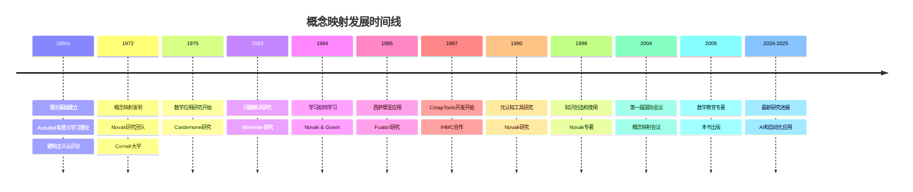

# 概念映射工具的发展与演变：走向数学教育新模式

The Development and Evolution of the Concept Mapping Tool: Leading to a New Model for Mathematics Education

**创建日期**: 2025年12月11日
**创建日期**: December 11, 2025
**研究领域**: 数学教育 - 概念映射 - 历史发展
**研究领域**: Mathematics Education - Concept Mapping - Historical Development
**主题编号**: CM.01.01
**章节**: Chapter 1
**作者**: Joseph D. Novak and Alberto J. Cañas
**优先级**: P0（最高优先级）⭐⭐⭐⭐⭐

---

## 📑 目录 / Table of Contents

- [概念映射工具的发展与演变：走向数学教育新模式](#概念映射工具的发展与演变走向数学教育新模式)
  - [📋 一、概述 / Overview](#-一概述--overview)
  - [🔬 二、概念映射的发明 / The Invention of Concept Mapping](#-二概念映射的发明--the-invention-of-concept-mapping)
  - [📚 三、概念映射在数学中的应用 / The Use of Concept Maps in Mathematics](#-三概念映射在数学中的应用--the-use-of-concept-maps-in-mathematics)
  - [💻 四、CmapTools与互联网 / CmapTools and the Internet](#-四cmaptools与互联网--cmaptools-and-the-internet)
  - [🎓 五、教育新模式 / A New Model for Education](#-五教育新模式--a-new-model-for-education)
  - [📊 六、思维表征方式 / Representation Methods](#-六思维表征方式--representation-methods)
  - [📚 七、参考文献 / References](#-七参考文献--references)

---

## 📋 一、概述 / Overview

### 1.1 章节目标 / Chapter Objectives

**主要目标 / Main Objectives**:

- 描述概念映射工具的发展历史
- Describing the development history of the concept mapping tool
- 说明概念映射在数学中的应用
- Explaining the application of concept mapping in mathematics
- 介绍CmapTools软件的发展
- Introducing the development of CmapTools software
- 提出教育新模式
- Proposing a new model for education

### 1.2 核心内容 / Core Content

**主要内容 / Main Content**:

1. **概念映射的发明** (1972) - 由Novak研究团队在Cornell大学发明
2. **理论基础** - Ausubel有意义学习理论、建构主义认识论
3. **数学应用** - 早期在数学教育中的应用研究
4. **技术发展** - CmapTools软件的开发和应用
5. **教育新模式** - 基于概念映射的新教育模式

---

## 🔬 二、概念映射的发明 / The Invention of Concept Mapping

### 2.1 历史背景 / Historical Background

**时间线 / Timeline**:

**1960年代 / 1960s**:

- **Novak研究团队** - 在Purdue大学和Cornell大学进行研究
- **研究目标** - 开发连贯的学习理论和知识理论
- **理论基础** - 寻找科学的教育研究基础

**关键发现 / Key Findings**:

- **Ausubel同化理论** (1963) - 提供了有意义学习的理论基础
- **建构主义认识论** - Kuhn (1962) 科学革命结构的影响
- **学习理论** - 解释新概念如何获得和使用

### 2.2 发明过程 / Invention Process

**研究需求 / Research Need**:

- 需要工具描述儿童概念理解的明确变化
- Need for a tool to describe explicit changes in children's conceptual understanding
- 传统纸笔测试不足
- Traditional paper-and-pencil tests inadequate
- 访谈记录难以分析认知结构变化
- Interview transcripts difficult to analyze cognitive structure changes

**发明时刻 / Invention Moment** (1972):

- **问题** - 如何看到儿童认知结构的变化？
- **解决方案** - 将访谈记录转化为层次化图片
- **结果** - 概念映射（Concept Map）的诞生

**关键特征 / Key Features**:

- 层次化安排 / Hierarchical arrangement
- 概念和命题 / Concepts and propositions
- 可视化认知结构 / Visual representation of cognitive structure

### 2.3 早期应用 / Early Applications

**12年纵向研究 / 12-Year Longitudinal Study**:

- **研究对象** - 6-8岁儿童学习基础科学概念
- **研究方法** - 音频教程课程 + 概念映射评估
- **主要发现 / Key Findings**:
  1. 概念映射是强大的知识表征和评估工具
     Concept maps are powerful knowledge representation and assessment tools
  2. 年幼儿童可以获得基础科学概念的重要理解
     Young children can acquire significant understanding of basic science concepts
  3. 技术可以用于提供有意义的教学
     Technology can be used to deliver meaningful instruction
  4. 早期有意义学习高度影响后续学习
     Early meaningful learning highly influences later learning

**图例说明 / Figure Illustrations**:

- **图1.1** - 7岁学生学习能量转换的音频教程单元
- **图1.2** - 同一儿童在2年级和12年级的概念映射对比
  - 显示10年学校教育中概念理解的巨大增长
  - Shows enormous growth in conceptual understanding over 10 years

---

## 📚 三、概念映射在数学中的应用 / The Use of Concept Maps in Mathematics

### 3.1 早期数学应用研究 / Early Mathematics Application Research

**Cardemone (1975) 研究**:

- **研究内容** - 大学数学补习课程
- **主要发现**:
  - 概念映射帮助教师设计更好的主题序列
    Concept maps help teachers design better topic sequences
  - 帮助学生看到主题之间的关系
    Help students see relationships between topics

**Minemier (1983) 研究**:

- **研究内容** - 学生为主题构建概念映射
- **主要发现**:
  - 在问题解决测试中表现更好
    Performed better on problem-solving tests
  - 增强了数学能力的信心
    Gained increased confidence in their ability to do mathematics

**Fuata'i (1985, 1998) 研究**:

- **研究内容** - 西萨摩亚Form Five学生
- **研究方法** - 概念映射 + Vee图
- **主要发现**:
  - 学生成为更自主的学习者
    Students became more autonomous learners
  - 更好地解决新颖问题
    Better at solving novel problems
  - 与不使用这些工具的学生相比
    Compared with students not using these tools

**图1.3** - 西萨摩亚学生制作的概念映射示例

### 3.2 数学应用特点 / Mathematics Application Characteristics

**应用优势 / Application Advantages**:

1. **主题关系可视化** - 清晰展示数学概念之间的关系
2. **知识组织** - 帮助组织和整合数学知识
3. **问题解决** - 提高问题解决能力
4. **学习动机** - 增强学习信心和动机

---

## 💻 四、CmapTools与互联网 / CmapTools and the Internet

### 4.1 CmapTools的发展 / Development of CmapTools

**发展时间线 / Development Timeline**:

**1987年**:

- **合作开始** - Novak和Cañas在人类与机器认知研究所（IHMC）开始合作
- **当时机构** - 西佛罗里达大学的一部分

**发展过程 / Development Process**:

- 开发软件以促进概念映射
  Development of software to facilitate concept mapping
- 演变为当前版本的CmapTools
  Evolved into current version of CmapTools
- 广泛使用于学校、大学、公司、政府和非政府机构
  Widely used in schools, universities, corporations, and governmental and non-governmental agencies

### 4.2 CmapTools功能 / CmapTools Features

**核心功能 / Core Features**:

1. **易于使用的地图编辑器 / Easy-to-Use Map Editor**
   - 简化概念映射构建过程
     Simplifies concept map construction process

2. **资源链接 / Resource Linking**
   - 链接数字资源（图像、视频、文本、网页、其他概念映射）
     Link digital resources (images, videos, text, Web pages, other concept maps)
   - 拖放操作
     Drag-and-drop operation
   - 资源图标显示
     Resource icons display

3. **互联网集成 / Internet Integration**
   - CmapServer存储
     CmapServer storage
   - 转换为网页
     Converted to Web pages
   - 通过Web浏览器浏览
     Browsed through Web browser

4. **搜索功能 / Search Feature**
   - 利用概念映射提供的上下文
     Takes advantage of context provided by concept map
   - 执行与地图相关的Web搜索
     Performs Web searches related to the map
   - 产生更相关的结果
     Produces more relevant results

5. **知识模型 / Knowledge Models**
   - 组织相关概念映射和资源
     Organize related concept maps and resources
   - 创建知识组合
     Create knowledge portfolios

**图1.4** - 使用CmapTools制作的关于数字的概念映射，显示已打开的资源

### 4.3 协作功能 / Collaboration Features

**协作能力 / Collaboration Capabilities**:

- **本地或远程协作** - 学生可以本地或远程协作构建地图
  Local or remote collaboration - Students can collaborate locally or remotely
- **同步或异步** - 支持同步和异步协作
  Synchronous or asynchronous - Supports both synchronous and asynchronous collaboration
- **记录功能** - 记录概念映射创建的历史
  Recorder feature - Records history of concept map creation
  - 显示构建步骤序列
    Shows sequence of building steps
  - 显示谁在每一步做了什么
    Indicates who did what at each step

---

## 🎓 五、教育新模式 / A New Model for Education

### 5.1 新模式概述 / New Model Overview

**提出背景 / Background**:

- 新技术能力可用
  New technological capabilities available
- 结合最新教学和学习思想
  Combined with latest thinking about teaching and learning
- 可能提出教育新模式
  Possible to propose a New Model for Education

**新模式活动 / New Model Activities**:

1. 使用"专家骨架概念映射"搭建学习脚手架
   Use of "expert skeleton concept maps" to scaffold learning
2. 使用CmapTools构建和扩展专家骨架概念映射
   Use of CmapTools to build upon and expand expert skeleton concept maps
3. 学生之间协作构建"知识模型"
   Collaboration among students to build "knowledge models"
4. 探索现实世界问题
   Explorations with real world problems
5. 书面、口头和视频报告以及开发知识模型
   Written, oral, and video reports and developing knowledge models
6. 分享和评估团队知识模型
   Sharing and assessing team knowledge models

### 5.2 专家骨架概念映射 / Expert Skeleton Concept Maps

**设计理念 / Design Philosophy**:

- **问题** - 大多数学生（和许多教师）很难从"空白页"开始构建概念映射
  Problem - Most students (and many teachers) find it difficult to begin with a "blank sheet"
- **解决方案** - 提供专家准备的概念映射（10-15个概念）
  Solution - Provide expert-prepared concept map (10-15 concepts)
- **作用** - 为学习者提供"脚手架"
  Role - Provides "scaffold" for learners

**理论基础 / Theoretical Foundation**:

- **Vygotsky (1934)** - 学徒学习者需要认知和情感鼓励
  Apprentice learners need both cognitive and affective encouragement
- **Berk & Winsler (1995)** - 脚手架理论
  Scaffolding theory
- **Novak (2002)** - 脚手架可以纠正误解
  Scaffolding can remediate misconceptions

**图1.5** - 专家骨架概念映射示例（关于数字概念）

**扩展期望 / Expansion Expectations**:

- 学生添加的概念数量与原始骨架图中的概念数量成比例
  Number of concepts expected to be added by student is proportional to original skeleton map
- 例如：2-3倍于原始概念数
  For example: 2-3 times the number of original concepts

### 5.3 添加概念和资源 / Adding Concepts and Resources

**有意义学习要求 / Meaningful Learning Requirements**:

- 学习者选择主动与学习材料互动
  Learner chooses to interact with learning materials actively
- 寻求将新知识整合到现有知识框架中
  Seeks to integrate new knowledge into existing knowledge frameworks

**CmapTools功能 / CmapTools Features**:

- **拖放功能** - 通过拖放链接补充资源
  Drag-and-drop feature - Link supplemental resources by drag-and-drop
- **资源类型** - URL、图像、视频、其他概念映射或任何其他数字资源
  Resource types - URL, image, video, another concept map or any other digital resource
- **知识模型构建** - 构建日益复杂的知识模型
  Knowledge model building - Build increasingly complex knowledge models

**协作功能 / Collaboration Features**:

- **本地或远程** - 学习者可以本地或远程协作
  Local or remote - Learners can collaborate locally or remotely
- **同步或异步** - 支持同步和异步协作
  Synchronous or asynchronous - Supports both synchronous and asynchronous collaboration
- **记录功能** - 记录概念映射创建的历史
  Recorder feature - Records history of concept map creation

**认知学习研究工具 / Cognitive Learning Research Tool**:

- **Miller, Canas, & Novak (2008)** - 使用记录工具研究概念映射学习过程
  Using Recorder tool to study concept mapping learning process
- **发现** - 在巴拿马Proyecto Conectate al Conocimiento项目中，教师的概念映射变化模式相似
  Finding - Patterns in map changes for teachers in Panama project were similar

### 5.4 学生协作 / Collaboration Among Students

**理论基础 / Theoretical Foundation**:

- **Vygotsky (1934)** - 社会交流在认知结构构建中的重要性
  Importance of social exchange in building cognitive structure
- **Johnson兄弟 (1988)** - 合作学习的优点
  Merits of "cooperative learning"

**CmapTools优势 / CmapTools Advantages**:

- 大多数合作学习研究无法利用CmapTools提供的便利
  Most cooperative learning studies could not take advantage of CmapTools facilitation
- 需要新的研究显示使用CmapTools的协作对学习的影响
  Need new research studies showing effect of collaboration on learning using CmapTools

### 5.5 现实世界问题探索 / Exploration with Real World Problems

**理论基础 / Theoretical Foundation**:

- **情境认知研究** - 将学习置于有意义、现实世界情境中的重要性
  Situated cognition research - Importance of placing learning into meaningful, real world context

**新模式中的应用 / Application in New Model**:

- 尽可能在现实世界问题框架内引入数学新思想
  Introduce new ideas in mathematics within framework of real world problem whenever possible
- 传统方法的问题 - 大多数活动没有明确问题中涉及的数学概念
  Problem with traditional methods - Most activities do not make explicit mathematics concepts involved
- 焦点主要是获得"正确"答案的程序
  Focus mostly on procedures to get "correct" answer

**研究证据 / Research Evidence**:

- **Cañas, Novak, & González (2004)** - 现实世界活动与CmapTools结合使用显示学习改进
  Real world activities tied with CmapTools show improvement in learning
- **Cañas & Novak (2006)** - 进一步研究支持
  Further research support
- **Cañas et al. (2008)** - 持续研究证据
  Ongoing research evidence

**巴拿马项目案例 / Panama Project Case**:

- **Proyecto Conectate al Conocimiento** (Tarté, 2006)
- **协作可能性** - 不仅导致知识构建共享，还导致各种社会交流
  Collaboration possibilities - Lead not only to sharing in knowledge building but also to variety of social exchanges
- **"我是谁？"概念映射** - 教师和校长构建关于学校、社区的概念映射
  "Who am I?" concept maps - Teachers and principals build concept maps about schools, communities
- **个人参与** - 对追求其他协作有强烈激励作用
  Personal engagement - Strong motivating effects for pursuing other collaborations

**图1.6** - 巴拿马教师绘制的概念映射示例，展示"我是谁？"概念映射

### 5.6 书面、口头和视频报告 / Written, Oral, and Video Reports

**早期研究 / Early Research**:

- **Ben-Amar (1990)** - 五年级儿童研究
- **发现** - 在尝试写出想法之前准备概念映射的儿童：
  - 写出更好的故事
    Wrote better stories
  - 更好地讲述故事
    Better able to tell their stories
- **结果** - 他们写了一个从故事中衍生出来的剧本，非常受欢迎，被邀请在其他小学演出！
  Result - They wrote a play derived from their stories, so well received they were invited to present it at other elementary schools!

**未来展望 / Future Prospects**:

- 使用CmapTools组织知识的全部能力太新，无法有实证研究基础
  Full range of capabilities for organizing knowledge using CmapTools too recent to have empirical research base
- 希望本书出版后，将进行许多实证研究
  Hopefully after publication of this book, many empirical studies will be done

### 5.7 分享和评估团队知识模型 / Sharing and Assessing Team Knowledge Models

**分享方式 / Sharing Methods**:

- 使用CmapTools的协作工具促进个人和团队知识模型的分享
  Facilitate sharing of individual and team knowledge models using collaboration tools of CmapTools

**评估策略 / Assessment Strategies**:

- **匿名发布** - 团队匿名发布知识模型
  Anonymous posting - Teams post knowledge models anonymously
- **学生排名** - 要求学生从最低到最高排名模型
  Student ranking - Ask students to rank models from lowest to highest
- **排名标准** - 包括排名标准
  Ranking criteria - Include criteria for rankings

**数字知识模型优势 / Digital Knowledge Model Advantages**:

- 使用CmapTools创建的数字知识模型可以发布在班级服务器上
  Digital knowledge models created with CmapTools can be posted on class server
- 提供易于访问的评估
  Provide easy access for assessment
- 学生可以非常有洞察力，通常非常诚实地评估
  Students can be very insightful, and often brutally honest, in their assessments
- 严肃的评估是教育体验
  Serious assessment is an educational experience
- 学生学习如何改进自己的知识模型
  Students learn how they can improve their own knowledge models

---

## 📊 六、思维表征方式 / Representation Methods

### 6.1 历史发展时间线 / Historical Development Timeline



### 6.2 发展历程决策树 / Development Process Decision Tree

```text
概念映射工具发展历程
├─ 理论基础阶段（1960s）
│  ├─ 学习理论需求
│  │  └─ 需要：连贯的学习理论
│  ├─ 知识理论需求
│  │  └─ 需要：科学的教育研究基础
│  └─ 发现：Ausubel同化理论
│     └─ 提供：有意义学习理论基础
├─ 工具发明阶段（1972）
│  ├─ 研究需求
│  │  └─ 需要：描述概念理解变化的工具
│  ├─ 问题解决
│  │  └─ 方案：将访谈记录转化为层次化图片
│  └─ 结果：概念映射诞生
├─ 应用扩展阶段（1975-1998）
│  ├─ 数学应用研究
│  │  ├─ Cardemone (1975)
│  │  ├─ Minemier (1983)
│  │  └─ Fuata'i (1985, 1998)
│  ├─ 学习工具应用
│  │  └─ "学习如何学习"课程
│  └─ 元认知工具研究
│     └─ Novak (1990)
└─ 技术发展阶段（1987-至今）
   ├─ CmapTools开发
   │  └─ 1987年开始合作
   ├─ 互联网集成
   │  └─ CmapServer、Web搜索
   └─ 教育新模式
      └─ 专家骨架图、协作、知识模型
```

### 6.3 有效性证明树 / Effectiveness Proof Tree

```text
【目标】证明：概念映射工具发展成功
【Goal】Prove: Concept mapping tool development is successful

自底向上证明树 / Bottom-Up Proof Tree:

层次1（理论基础 / Theoretical Foundations）
├─ 前提1：Ausubel有意义学习理论
│  └─ 支持：概念映射促进有意义学习
├─ 前提2：建构主义认识论
│  └─ 支持：概念映射支持知识建构
└─ 前提3：Vygotsky社会文化理论
   └─ 支持：概念映射支持协作学习

层次2（工具发展 / Tool Development）
├─ 发展1：概念映射发明（1972）
│  ├─ 需求：描述概念理解变化
│  ├─ 方案：层次化概念图片
│  └─ 结果：成功发明工具
├─ 发展2：CmapTools开发（1987-）
│  ├─ 需求：软件支持
│  ├─ 方案：CmapTools软件
│  └─ 结果：广泛使用
└─ 发展3：教育新模式（2004-）
   ├─ 需求：新教育模式
   ├─ 方案：专家骨架图+协作+知识模型
   └─ 结果：初步研究进行中

层次3（应用证据 / Application Evidence）
├─ 证据1：数学应用研究
│  ├─ Cardemone (1975) - 帮助课程设计
│  ├─ Minemier (1983) - 提高问题解决
│  └─ Fuata'i (1985, 1998) - 提高自主学习
├─ 证据2：学习工具应用
│  └─ "学习如何学习"课程 - 20年教学
└─ 证据3：技术应用
   └─ CmapTools - 广泛使用

层次4（综合结论 / Comprehensive Conclusion）
└─ 结论：概念映射工具发展成功
   ├─ 理论基础坚实
   ├─ 工具发展完善
   └─ 应用效果显著
```

---

## 📚 七、参考文献 / References

### 7.1 原始文献 / Primary Sources

1. **Novak, J. D., & Cañas, A. J. (2009)**. The Development and Evolution of the Concept Mapping Tool Leading to a New Model for Mathematics Education. In K. Afamasaga-Fuata'i (Ed.), *Concept Mapping in Mathematics: Research into Practice* (pp. 3-15). Springer.

2. **Ausubel, D. P. (1963)**. *The Psychology of Meaningful Verbal Learning*. Grune & Stratton.

3. **Novak, J. D., & Gowin, D. B. (1984)**. *Learning How to Learn*. Cambridge University Press.

4. **Novak, J. D. (1998)**. *Learning, Creating, and Using Knowledge: Concept Maps as Facilitative Tools in Schools and Corporations*. Lawrence Erlbaum Associates.

### 7.2 相关研究 / Related Research

1. **Cardemone, P. F. (1975)**. Concept maps: A technique of analyzing a discipline and its use in the curriculum and instruction in a portion of a college level mathematics skills course. Unpublished M.S. thesis, Cornell University.

2. **Minemier, L. (1983)**. Concept Mapping and educational tool and its use in a college level mathematics skills course. Unpublished M.S. thesis, Cornell University.

3. **Fuata'i, K. A. (1985)**. The use of Gowin's Vee and concept maps in the learning of form five mathematics in Samoa College, Western Samoa. Unpublished M.S Thesis, Cornell University.

4. **Fuata'i, K. A. (1998)**. *Learning to solve mathematics problems through concept mapping and Vee mapping*. Apia, Samoa: National University of Samoa.

5. **Ben-Amar Baranga, C. (1990)**. Meaningful learning of creative writing in fourth grade with a word processing program integrated in the whole language curriculum. Unpublished M.S. thesis, Cornell University.

### 7.3 技术发展 / Technical Development

1. **Cañas, A. J., Hill, G., & Lott, J. (2003)**. Support for constructing knowledge models in CmapTools (Technical Report No. IHMC CmapTools 2003-02). Pensacola, FL: Institute for Human and Machine Cognition.

2. **Cañas, A. J., Hill, G., Granados, A., Pérez, C., & Pérez, J. D. (2003)**. The network architecture of CmapTools (Technical Report IHMC CmapTools 2003-01). Pensacola, FL: Institute for Human and Machine Cognition.

3. **Cañas, A. J., Novak, J. D., & González, F. (Eds.) (2004)**. *Concept maps: Theory, methodology, technology. Proceedings of the first international conference on concept mapping*. Pamplona, Spain: Universidad Pública de Navarra.

4. **Novak, J. D., & Cañas, A. J. (2004)**. Building on new constructivist ideas and the CmapTools to create a new model for education. In A. J. Cañas, J. D. Novak, & F. M. Gonázales (Eds.), *Concept maps: Theory, methodology, technology. Proceedings of the first international conference on concept mapping*. Pamplona, Spain: Universidad Publica de Navarra.

---

**创建日期**: 2025年12月11日
**最后更新**: 2025年12月11日
**状态**: ✅ Part I历史发展梳理文档已创建
**完成度**: 100%
