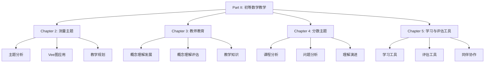

# Part II: 初等数学教学与学习 - 总览

Part II: Primary Mathematics Teaching and Learning - Overview

**创建日期**: 2025年12月11日
**创建日期**: December 11, 2025
**研究领域**: 数学教育 - 概念映射 - 初等数学
**研究领域**: Mathematics Education - Concept Mapping - Primary Mathematics
**主题编号**: CM.02.00
**优先级**: P0（最高优先级）⭐⭐⭐⭐⭐

---

## 📑 目录 / Table of Contents

- [Part II: 初等数学教学与学习 - 总览](#part-ii-初等数学教学与学习---总览)
  - [📑 目录 / Table of Contents](#-目录--table-of-contents)
  - [📋 一、概述 / Overview](#-一概述--overview)
    - [1.1 Part II 目标 / Part II Objectives](#11-part-ii-目标--part-ii-objectives)
    - [1.2 研究范围 / Research Scope](#12-研究范围--research-scope)
  - [📚 二、章节结构 / Chapter Structure](#-二章节结构--chapter-structure)
    - [2.1 章节列表 / Chapter List](#21-章节列表--chapter-list)
    - [2.2 章节关系 / Chapter Relationships](#22-章节关系--chapter-relationships)
  - [🎯 三、核心主题 / Core Themes](#-三核心主题--core-themes)
    - [3.1 主题分类 / Theme Classification](#31-主题分类--theme-classification)
  - [📊 四、研究方法 / Research Methods](#-四研究方法--research-methods)
    - [4.1 研究方法类型 / Research Method Types](#41-研究方法类型--research-method-types)
    - [4.2 数据收集方法 / Data Collection Methods](#42-数据收集方法--data-collection-methods)
  - [🔗 五、章节链接 / Chapter Links](#-五章节链接--chapter-links)
    - [5.1 详细章节文档 / Detailed Chapter Documents](#51-详细章节文档--detailed-chapter-documents)
  - [📈 六、主要发现 / Key Findings](#-六主要发现--key-findings)
    - [6.1 学习效果发现 / Learning Effectiveness Findings](#61-学习效果发现--learning-effectiveness-findings)
    - [6.2 教学应用发现 / Teaching Application Findings](#62-教学应用发现--teaching-application-findings)
    - [6.3 教师教育发现 / Teacher Education Findings](#63-教师教育发现--teacher-education-findings)

---

## 📋 一、概述 / Overview

### 1.1 Part II 目标 / Part II Objectives

**主要目标 / Main Objectives**:

- 展示概念映射在初等数学教学中的应用
- Demonstrating applications of concept mapping in primary mathematics teaching
- 研究职前教师教育中的应用
- Researching applications in preservice teacher education
- 探索概念映射作为学习和评估工具
- Exploring concept mapping as learning and assessment tools

### 1.2 研究范围 / Research Scope

**涵盖内容 / Covered Content**:

- **测量主题** - 长度、体积、表面积、容量
  Measurement strand - Length, Volume, Surface Area, Capacity
- **分数主题** - 分数概念、运算、应用
  Fractions strand - Fraction concepts, operations, applications
- **位置系统** - 位置系统概念及其教学知识
  Positional System - Positional system concepts and pedagogical knowledge
- **评估工具** - 概念映射作为创新学习和评估工具
  Assessment Tools - Concept maps as innovative learning and assessment tools

---

## 📚 二、章节结构 / Chapter Structure

### 2.1 章节列表 / Chapter List

| 章节 | 中文标题 | English Title | 作者 | 主题编号 |
|------|---------|---------------|------|----------|
| **Chapter 2** | 使用概念映射和Vee图分析"测量"主题 | Analysing the "Measurement" Strand Using Concept Maps and Vee Diagrams | Karoline Afamasaga-Fuata'i | CM.02.01 |
| **Chapter 3** | 概念映射作为发展和评估初等数学教师教育中概念理解的手段 | Concept Mapping as a Means to Develop and Assess Conceptual Understanding in Primary Mathematics Teacher Education | Jean Schmittau & James J. Vagliardo | CM.02.02 |
| **Chapter 4** | 使用概念映射和Vee图分析初等数学中的"分数"主题 | Using Concept Maps and Vee Diagrams to Analyse the "Fractions" Strand in Primary Mathematics | Karoline Afamasaga-Fuata'i | CM.02.03 |
| **Chapter 5** | 概念映射作为初等学校的创新学习和评估工具 | Concept Maps as Innovative Learning and Assessment Tools in Primary Schools | Karoline Afamasaga-Fuata'i & Greg McPhan | CM.02.04 |

### 2.2 章节关系 / Chapter Relationships

---

## 🎯 三、核心主题 / Core Themes

### 3.1 主题分类 / Theme Classification

**按数学主题分类 / By Mathematics Topics**:

1. **测量主题 / Measurement Strand**
   - 长度 / Length
   - 体积 / Volume
   - 表面积 / Surface Area
   - 容量 / Capacity

2. **分数主题 / Fractions Strand**
   - 分数概念 / Fraction concepts
   - 分数运算 / Fraction operations
   - 分数应用 / Fraction applications

3. **位置系统 / Positional System**
   - 位置系统概念 / Positional system concepts
   - 教学知识 / Pedagogical knowledge

**按应用类型分类 / By Application Type**:

1. **主题分析 / Topic Analysis**
   - 课程分析 / Curriculum analysis
   - 概念分析 / Conceptual analysis

2. **教学规划 / Teaching Planning**
   - 学习活动设计 / Learning activity design
   - 教学序列 / Teaching sequence

3. **学习工具 / Learning Tools**
   - 知识组织 / Knowledge organization
   - 复习工具 / Review tools

4. **评估工具 / Assessment Tools**
   - 概念理解评估 / Conceptual understanding assessment
   - 学习监控 / Learning monitoring

5. **教师教育 / Teacher Education**
   - 职前教师教育 / Preservice teacher education
   - 教学知识发展 / Pedagogical knowledge development

---

## 📊 四、研究方法 / Research Methods

### 4.1 研究方法类型 / Research Method Types

| 研究方法 | 章节 | 说明 |
|---------|------|------|
| **案例研究** | Chapter 2, 4, 5 | 单个或多个案例的深入分析 |
| **案例研究** | Chapter 3 | 职前教师案例研究 |
| **行动研究** | Chapter 5 | 课堂实践研究 |

### 4.2 数据收集方法 / Data Collection Methods

**主要方法 / Main Methods**:

1. **概念映射收集** - 收集学生和教师构建的概念映射
2. **Vee图收集** - 收集问题解决的Vee图
3. **反思日志** - 收集反思日志
4. **课堂观察** - 观察课堂应用
5. **访谈** - 访谈学生和教师

---

## 🔗 五、章节链接 / Chapter Links

### 5.1 详细章节文档 / Detailed Chapter Documents

| 章节 | 文档路径 | 状态 |
|------|---------|------|
| **Chapter 2** | `02-初等数学教学/01-测量主题分析.md` | 🚧 待创建 |
| **Chapter 3** | `02-初等数学教学/02-教师教育中的概念理解.md` | 🚧 待创建 |
| **Chapter 4** | `02-初等数学教学/03-分数主题分析.md` | 🚧 待创建 |
| **Chapter 5** | `02-初等数学教学/04-学习与评估工具.md` | 🚧 待创建 |

---

## 📈 六、主要发现 / Key Findings

### 6.1 学习效果发现 / Learning Effectiveness Findings

**主要发现 / Key Findings**:

1. **概念理解提高** - 概念映射有效提高概念理解
   Conceptual understanding improvement - Concept mapping effectively improves conceptual understanding
2. **知识组织改善** - 帮助学生组织和整合知识
   Knowledge organization improvement - Helps students organize and integrate knowledge
3. **问题解决能力** - 提高问题解决能力
   Problem-solving ability - Improves problem-solving ability

### 6.2 教学应用发现 / Teaching Application Findings

**主要发现 / Key Findings**:

1. **教学规划** - 概念映射帮助教师设计更好的教学序列
   Teaching planning - Concept mapping helps teachers design better teaching sequences
2. **主题分析** - 有效分析课程主题和概念结构
   Topic analysis - Effectively analyzes curriculum topics and conceptual structures
3. **评估工具** - 作为有效的评估工具
   Assessment tools - Effective as assessment tools

### 6.3 教师教育发现 / Teacher Education Findings

**主要发现 / Key Findings**:

1. **概念理解发展** - 帮助职前教师发展概念理解
   Conceptual understanding development - Helps preservice teachers develop conceptual understanding
2. **教学知识** - 揭示所需的教学知识
   Pedagogical knowledge - Reveals required pedagogical knowledge
3. **专业发展** - 支持教师专业发展
   Professional development - Supports teacher professional development

---

**创建日期**: 2025年12月11日
**最后更新**: 2025年12月11日
**状态**: ✅ Part II总览文档已创建
**完成度**: 100%
