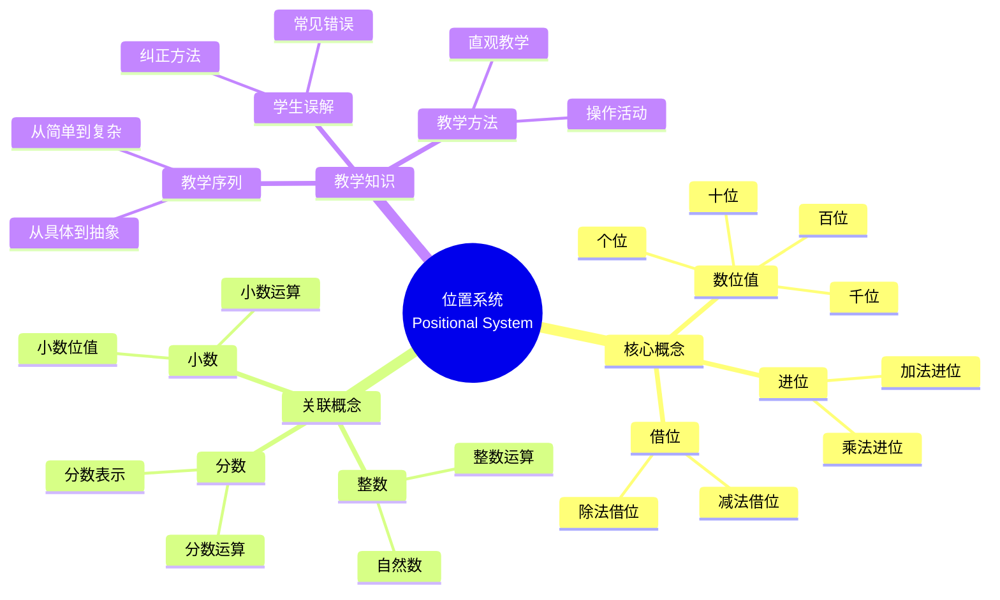

# 概念映射作为发展和评估初等数学教师教育中概念理解的手段

Concept Mapping as a Means to Develop and Assess Conceptual Understanding in Primary Mathematics Teacher Education

**创建日期**: 2025年12月11日
**创建日期**: December 11, 2025
**研究领域**: 数学教育 - 概念映射 - 初等数学 - 教师教育
**研究领域**: Mathematics Education - Concept Mapping - Primary Mathematics - Teacher Education
**主题编号**: CM.02.0
**章节**: Chapter 3
**作者**: Jean Schmittau and James J. Vagliardo
**优先级**: P0（最高优先级）⭐⭐⭐⭐⭐

---

## 📑 目录 / Table of Contents

- [概念映射作为发展和评估初等数学教师教育中概念理解的手段](#概念映射作为发展和评估初等数学教师教育中概念理解的手段)
  - [📋 一、概述 / Overview](#-一概述--overview)
  - [🎯 二、研究目标与问题 / Research Objectives and Questions](#-二研究目标与问题--research-objectives-and-questions)
  - [📚 三、位置系统概念 / The Positional System Concept](#-三位置系统概念--the-positional-system-concept)
  - [📊 四、案例研究：Maryanne的概念映射 / Case Study: Maryanne's Concept Map](#-四案例研究maryanne的概念映射--case-study-maryannes-concept-map)
  - [💡 五、教学知识分析 / Pedagogical Knowledge Analysis](#-五教学知识分析--pedagogical-knowledge-analysis)
  - [🔬 六、概念映射作为评估工具 / Concept Mapping as Assessment Tool](#-六概念映射作为评估工具--concept-mapping-as-assessment-tool)
  - [📈 七、思维表征方式 / Representation Methods](#-七思维表征方式--representation-methods)
  - [📚 八、参考文献 / References](#-八参考文献--references)

---

## 📋 一、概述 / Overview

### 1.1 章节目标 / Chapter Objectives

**主要目标 / Main Objectives**:

- 展示概念映射在揭示位置系统概念中心性方面的力量
- Demonstrating the power of concept mapping to reveal the centrality of the Positional System concept
- 展示概念映射在揭示所需教学知识方面的价值
- Demonstrating the value of concept mapping in revealing required pedagogical knowledge
- 说明概念映射作为评估工具的有效性
- Illustrating the effectiveness of concept mapping as an assessment tool

### 1.2 核心内容 / Core Content

**主要内容 / Main Content**:

1. **位置系统概念** - 在初等数学中的中心地位
   Positional System Concept - Central position in elementary mathematics
2. **案例研究** - Maryanne的概念映射分析
   Case Study - Analysis of Maryanne's concept map
3. **教学知识** - 所需的教学内容知识
   Pedagogical Knowledge - Required pedagogical content knowledge
4. **评估应用** - 概念映射作为评估工具
   Assessment Application - Concept mapping as assessment tool

---

## 🎯 二、研究目标与问题 / Research Objectives and Questions

### 2.1 研究目标 / Research Objectives

**主要目标 / Main Objectives**:

- 使用案例研究说明概念映射的力量
- Using a case study to illustrate the power of concept mapping
- 揭示位置系统概念在初等数学中的中心性
- Revealing the centrality of the Positional System concept within elementary mathematics
- 展示所需的教学内容知识
- Demonstrating the required pedagogical content knowledge

### 2.2 研究问题 / Research Questions

**焦点问题 / Focus Questions**:

1. 概念映射如何揭示位置系统概念的中心性？
   How does concept mapping reveal the centrality of the Positional System concept?
2. 概念映射如何展示所需的教学知识？
   How does concept mapping demonstrate required pedagogical knowledge?
3. 概念映射如何评估职前教师的概念理解？
   How does concept mapping assess preservice teachers' conceptual understanding?

---

## 📚 三、位置系统概念 / The Positional System Concept

### 3.1 概念定义 / Concept Definition

**位置系统 / Positional System**:

- 数字的值取决于其在数字中的位置
  The value of a digit depends on its position in the number
- 初等数学中的核心概念
  Core concept in elementary mathematics
- 连接多个数学概念的基础
  Foundation connecting multiple mathematical concepts

### 3.2 概念中心性 / Concept Centrality

**中心地位 / Central Position**:

- 位置系统是初等数学的中心概念
  Positional System is the central concept in elementary mathematics
- 连接多个数学主题
  Connects multiple mathematics topics
- 为其他概念提供基础
  Provides foundation for other concepts

**关联概念 / Related Concepts**:

- 数位值 / Place value
- 进位 / Carrying
- 借位 / Borrowing
- 小数 / Decimals
- 分数 / Fractions
- 运算 / Operations

### 3.3 教学重要性 / Teaching Importance

**教学意义 / Teaching Significance**:

- 理解位置系统是理解初等数学的关键
  Understanding positional system is key to understanding elementary mathematics
- 需要深入的教学知识
  Requires deep pedagogical knowledge
- 影响所有后续数学学习
  Affects all subsequent mathematics learning

---

## 📊 四、案例研究：Maryanne的概念映射 / Case Study: Maryanne's Concept Map

### 4.1 研究对象 / Research Subject

**Maryanne**:

- 职前教师 / Preservice teacher
- 构建位置系统概念映射
  Constructed concept map of Positional System
- 展示概念理解的发展
  Demonstrated development of conceptual understanding

### 4.2 概念映射分析 / Concept Map Analysis

**映射特点 / Map Characteristics**:

- 展示位置系统的中心地位
  Shows central position of Positional System
- 连接多个相关概念
  Connects multiple related concepts
- 揭示概念层次结构
  Reveals conceptual hierarchy

**主要发现 / Key Findings**:

1. **概念中心性** - 位置系统在概念映射中处于中心位置
   Concept Centrality - Positional System is in central position in concept map
2. **概念关联** - 清晰展示与其他概念的关联
   Concept Relationships - Clearly shows relationships with other concepts
3. **教学知识** - 揭示所需的教学知识
   Pedagogical Knowledge - Reveals required pedagogical knowledge

### 4.3 教学知识揭示 / Pedagogical Knowledge Revelation

**揭示的教学知识 / Revealed Pedagogical Knowledge**:

- 如何教授位置系统概念
  How to teach Positional System concept
- 与其他数学概念的关系
  Relationships with other mathematics concepts
- 教学序列和方法
  Teaching sequences and methods

---

## 💡 五、教学知识分析 / Pedagogical Knowledge Analysis

### 5.1 教学内容知识 / Pedagogical Content Knowledge

**所需知识类型 / Required Knowledge Types**:

1. **概念知识 / Conceptual Knowledge**
   - 位置系统概念的本质
     Nature of Positional System concept
   - 概念之间的关系
     Relationships between concepts

2. **教学知识 / Pedagogical Knowledge**
   - 如何向学生解释概念
     How to explain concepts to students
   - 适当的教学序列
     Appropriate teaching sequences

3. **学生知识 / Student Knowledge**
   - 学生的常见误解
     Common student misconceptions
   - 学习困难点
     Learning difficulties

### 5.2 概念映射的作用 / Role of Concept Mapping

**概念映射如何帮助 / How Concept Mapping Helps**:

- 揭示概念结构
  Reveals conceptual structure
- 展示教学知识
  Demonstrates pedagogical knowledge
- 评估理解深度
  Assesses depth of understanding

---

## 🔬 六、概念映射作为评估工具 / Concept Mapping as Assessment Tool

### 6.1 评估功能 / Assessment Functions

**主要功能 / Main Functions**:

1. **概念理解评估** - 评估职前教师的概念理解
   Conceptual Understanding Assessment - Assesses preservice teachers' conceptual understanding
2. **教学知识评估** - 评估所需的教学知识
   Pedagogical Knowledge Assessment - Assesses required pedagogical knowledge
3. **发展监控** - 监控理解的发展
   Development Monitoring - Monitors development of understanding

### 6.2 评估方法 / Assessment Methods

**评估策略 / Assessment Strategies**:

- 分析概念映射结构
  Analyze concept map structure
- 评估概念关联
  Evaluate concept relationships
- 识别知识 gaps
  Identify knowledge gaps

### 6.3 评估标准 / Assessment Criteria

**评估维度 / Assessment Dimensions**:

1. **概念完整性** - 是否包含所有关键概念
   Concept Completeness - Whether all key concepts are included
2. **关联准确性** - 概念之间的关联是否准确
   Relationship Accuracy - Whether relationships between concepts are accurate
3. **层次结构** - 概念层次结构是否清晰
   Hierarchical Structure - Whether conceptual hierarchy is clear
4. **教学知识** - 是否展示教学知识
   Pedagogical Knowledge - Whether pedagogical knowledge is demonstrated

---

## 📈 七、思维表征方式 / Representation Methods

### 7.1 位置系统概念映射思维导图 / Positional System Concept Map Mind Map



### 7.2 教学知识决策树 / Pedagogical Knowledge Decision Tree

```text
如何教授位置系统概念？
├─ 学生水平是什么？
│  ├─ 初学者
│  │  └─ ✅ 使用直观材料和操作活动
│  │     └─ 方法：具体物体、计数器
│  ├─ 有一定基础
│  │  └─ ✅ 使用图表和可视化
│  │     └─ 方法：数位值表、图表
│  └─ 高级学习者
│     └─ ✅ 使用抽象表示
│        └─ 方法：符号、公式
├─ 教学重点是什么？
│  ├─ 概念理解
│  │  └─ ✅ 强调位置系统概念
│  │     └─ 重点：数位值的意义
│  ├─ 技能掌握
│  │  └─ ✅ 强调运算技能
│  │     └─ 重点：进位、借位
│  └─ 应用能力
│     └─ ✅ 强调问题解决
│        └─ 重点：实际应用
└─ 评估方法是什么？
   ├─ 形成性评估
   │  └─ ✅ 使用概念映射监控理解
   │     └─ 方法：定期构建概念映射
   ├─ 总结性评估
   │  └─ ✅ 使用概念映射评估最终理解
   │     └─ 方法：综合概念映射
   └─ 诊断性评估
      └─ ✅ 使用概念映射识别误解
         └─ 方法：对比专家图
```

### 7.3 概念理解证明树 / Conceptual Understanding Proof Tree

```text
【目标】证明：概念映射有效评估位置系统概念理解
【Goal】Prove: Concept mapping effectively assesses Positional System conceptual understanding

自底向上证明树 / Bottom-Up Proof Tree:

层次1（理论前提 / Theoretical Premises）
├─ 前提1：概念映射反映认知结构
│  └─ 支持：Novak (1998) 认知结构理论
├─ 前提2：位置系统是中心概念
│  └─ 支持：初等数学理论
└─ 前提3：教学知识影响教学效果
   └─ 支持：Shulman (1986) 教学知识理论

层次2（机制论证 / Mechanism Argument）
├─ 机制1：概念结构可视化
│  ├─ 过程：将认知结构可视化
│  ├─ 工具：概念映射提供视觉表征
│  └─ 结果：揭示概念理解结构
├─ 机制2：概念关联识别
│  ├─ 过程：识别概念之间的关联
│  ├─ 工具：概念映射展示概念关系
│  └─ 结果：评估概念理解深度
└─ 机制3：教学知识展示
   ├─ 过程：展示教学知识
   ├─ 工具：概念映射揭示教学知识
   └─ 结果：评估教学准备度

层次3（实证证据 / Empirical Evidence）
├─ 证据1：Maryanne案例研究
│  ├─ 方法：分析概念映射
│  ├─ 结果：揭示位置系统中心性
│  └─ 解释：概念映射有效揭示概念理解
└─ 证据2：教学知识分析
   ├─ 方法：评估概念映射中的教学知识
   ├─ 结果：展示所需教学知识
   └─ 解释：概念映射有效评估教学知识

层次4（综合结论 / Comprehensive Conclusion）
└─ 结论：概念映射有效评估位置系统概念理解
   ├─ 理论机制明确
   ├─ 实证证据支持
   └─ 应用效果显著
```

---

## 📚 八、参考文献 / References

### 8.1 主要参考文献 / Main References

1. **Schmittau, J., & Vagliardo, J. J. (2009)**. Concept Mapping as a Means to Develop and Assess Conceptual Understanding in Primary Mathematics Teacher Education. In K. Afamasaga-Fuata'i (Ed.), *Concept Mapping in Mathematics: Research into Practice* (pp. 47-58). Springer.

2. **Shulman, L. S. (1986)**. Those Who Understand: Knowledge Growth in Teaching. *Educational Researcher*, 15(2), 4-14.

3. **Novak, J. D. (1998)**. *Learning, Creating, and Using Knowledge: Concept Maps as Facilitative Tools in Schools and Corporations*. Lawrence Erlbaum Associates.

### 8.2 相关研究 / Related Research

1. **Ball, D. L., et al. (2008)**. Content Knowledge for Teaching: What Makes It Special?. *Journal of Teacher Education*, 59(5), 389-407.

2. **Grossman, P. L. (1990)**. *The Making of a Teacher: Teacher Knowledge and Teacher Education*. Teachers College Press.

---

**创建日期**: 2025年12月11日
**最后更新**: 2025年12月11日
**状态**: ✅ Chapter 3详细梳理文档已创建
**完成度**: 100%
