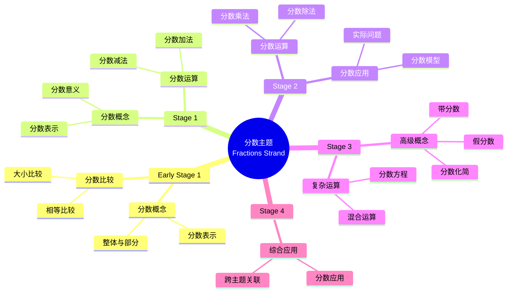

# 使用概念映射和Vee图分析初等数学中的"分数"主题

Using Concept Maps and Vee Diagrams to Analyse the "Fractions" Strand in Primary Mathematics

**创建日期**: 2025年12月11日
**创建日期**: December 11, 2025
**研究领域**: 数学教育 - 概念映射 - 初等数学 - 分数
**研究领域**: Mathematics Education - Concept Mapping - Primary Mathematics - Fractions
**主题编号**: CM.02.03
**章节**: Chapter 4
**作者**: Karoline Afamasaga-Fuata'i
**优先级**: P0（最高优先级）⭐⭐⭐⭐⭐

---

## 📑 目录 / Table of Contents

- [使用概念映射和Vee图分析初等数学中的"分数"主题](#使用概念映射和vee图分析初等数学中的分数主题)
  - [📑 目录 / Table of Contents](#-目录--table-of-contents)
  - [📋 一、概述 / Overview](#-一概述--overview)
    - [1.1 研究目标 / Research Objectives](#11-研究目标--research-objectives)
    - [1.2 案例研究对象 / Case Study Subject](#12-案例研究对象--case-study-subject)
    - [1.3 核心内容 / Core Content](#13-核心内容--core-content)
  - [🔬 二、研究方法 / Research Methodology](#-二研究方法--research-methodology)
    - [2.1 研究设计 / Research Design](#21-研究设计--research-design)
    - [2.2 数据收集 / Data Collection](#22-数据收集--data-collection)
    - [2.3 分析框架 / Analysis Framework](#23-分析框架--analysis-framework)
  - [📚 三、分数主题概念映射演进 / Evolution of Fractions Concept Maps](#-三分数主题概念映射演进--evolution-of-fractions-concept-maps)
    - [3.1 Early Stage 1 和 Stage 1 概念映射](#31-early-stage-1-和-stage-1-概念映射)
    - [3.2 Stage 2 概念映射](#32-stage-2-概念映射)
    - [3.3 Stage 3 概念映射](#33-stage-3-概念映射)
    - [3.4 Stage 4 概念映射](#34-stage-4-概念映射)
    - [3.5 概念映射演进特点 / Concept Map Evolution Characteristics](#35-概念映射演进特点--concept-map-evolution-characteristics)
  - [📐 四、分数数学内容典型例题 / Typical Examples of Fraction Mathematical Content](#-四分数数学内容典型例题--typical-examples-of-fraction-mathematical-content)
    - [4.1 分数意义与表示例题 / Meaning and Representation](#41-分数意义与表示例题--meaning-and-representation)
    - [4.2 分数大小比较与数轴例题 / Comparison and Number Line](#42-分数大小比较与数轴例题--comparison-and-number-line)
    - [4.3 分数运算结构例题 / Structure of Fraction Operations](#43-分数运算结构例题--structure-of-fraction-operations)
    - [4.4 跨主题关联小结 / Cross-Topic Association Summary](#44-跨主题关联小结--cross-topic-association-summary)
      - [4.4.1 分数与小数的统一表示 / Unified Representation of Fractions and Decimals](#441-分数与小数的统一表示--unified-representation-of-fractions-and-decimals)
      - [4.4.2 分数与比例的关联 / Association Between Fractions and Proportionality](#442-分数与比例的关联--association-between-fractions-and-proportionality)
      - [4.4.3 分数在测量中的应用 / Application of Fractions in Measurement](#443-分数在测量中的应用--application-of-fractions-in-measurement)
  - [📊 四、Vee图问题分析 / Vee Diagram Problem Analysis](#-四vee图问题分析--vee-diagram-problem-analysis)
    - [4.1 Vee图结构 / Vee Diagram Structure](#41-vee图结构--vee-diagram-structure)
    - [4.2 Vee图演进分析 / Vee Diagram Evolution Analysis](#42-vee图演进分析--vee-diagram-evolution-analysis)
    - [4.3 方法论证发展 / Method Justification Development](#43-方法论证发展--method-justification-development)
  - [💡 五、教学理解发展 / Pedagogical Understanding Development](#-五教学理解发展--pedagogical-understanding-development)
    - [5.1 理解发展阶段 / Understanding Development Stages](#51-理解发展阶段--understanding-development-stages)
    - [5.2 社会批判的作用 / Role of Social Critique](#52-社会批判的作用--role-of-social-critique)
    - [5.3 教学理解特点 / Pedagogical Understanding Characteristics](#53-教学理解特点--pedagogical-understanding-characteristics)
  - [📈 六、思维表征方式 / Representation Methods](#-六思维表征方式--representation-methods)
    - [6.1 分数概念映射思维导图 / Fractions Concept Map Mind Map](#61-分数概念映射思维导图--fractions-concept-map-mind-map)
    - [6.2 分数教学决策树 / Fractions Teaching Decision Tree](#62-分数教学决策树--fractions-teaching-decision-tree)
    - [6.3 理解发展证明树 / Understanding Development Proof Tree](#63-理解发展证明树--understanding-development-proof-tree)
  - [📚 七、参考文献 / References](#-七参考文献--references)
    - [7.1 主要参考文献 / Main References](#71-主要参考文献--main-references)
    - [7.2 相关研究 / Related Research](#72-相关研究--related-research)

---

## 📋 一、概述 / Overview

### 1.1 研究目标 / Research Objectives

**主要目标 / Main Objectives**:

- 研究概念映射和Vee图作为沟通概念分析手段的价值
- Examining the value of concept maps and vee diagrams as means of communicating conceptual analyses
- 研究概念映射和Vee图在发展理解方面的作用
- Examining the role of concept maps and vee diagrams in developing understanding
- 展示教学理解的发展过程
- Demonstrating the development process of pedagogical understanding

### 1.2 案例研究对象 / Case Study Subject

**研究对象 / Subject**:

- **姓名**: Ken
- **身份**: 研究生 / Post-graduate student
- **任务**: 分析分数主题的课程结果和相关数学问题
  Task: Analyze syllabus outcomes and related mathematics problems of Fractions strand
- **时间**: 一个学期
  Over a semester

### 1.3 核心内容 / Core Content

**主要内容 / Main Content**:

1. **课程分析** - 分析分数主题的课程结果
   Curriculum Analysis - Analyzing syllabus outcomes of Fractions strand
2. **问题分析** - 分析相关数学问题
   Problem Analysis - Analyzing related mathematics problems
3. **理解演进** - 展示教学理解的发展
   Understanding Evolution - Demonstrating development of pedagogical understanding
4. **方法论证** - 用数学原理论证解决方法
   Method Justification - Justifying methods in terms of mathematical principles

---

## 🔬 二、研究方法 / Research Methodology

### 2.1 研究设计 / Research Design

**研究方法 / Research Method**: 案例研究 / Case Study

**研究任务 / Research Tasks**:

1. **任务1** - 分析课程结果并构建初始概念映射
   Task 1 - Analyze syllabus outcomes and construct initial concept maps
2. **任务2** - 分析相关问题并构建Vee图
   Task 2 - Analyze related problems and construct vee diagrams
3. **任务3** - 展示概念和应用的互连性
   Task 3 - Display interconnectedness of concepts and applications

### 2.2 数据收集 / Data Collection

**收集的数据类型 / Types of Data Collected**:

1. **概念映射** - 从Early Stage 1到Stage 4的分数概念映射
2. **Vee图** - 相关问题的Vee图
3. **演进过程** - 概念映射和Vee图的演进过程

### 2.3 分析框架 / Analysis Framework

**概念映射分析 / Concept Map Analysis**:

- 分析概念映射的演进
- Analyze evolution of concept maps
- 评估概念理解的深度
- Assess depth of conceptual understanding
- 识别教学理解的发展
- Identify development of pedagogical understanding

**Vee图分析 / Vee Diagram Analysis**:

- 分析问题解决过程
- Analyze problem-solving process
- 评估方法论证的质量
- Assess quality of method justification
- 识别数学原理的应用
- Identify application of mathematical principles

---

## 📚 三、分数主题概念映射演进 / Evolution of Fractions Concept Maps

### 3.1 Early Stage 1 和 Stage 1 概念映射

**主要概念 / Main Concepts**:

- 分数概念 / Fraction concepts
- 分数表示 / Fraction representation
- 分数比较 / Fraction comparison

**发展特点 / Developmental Characteristics**:

- 从具体到抽象
  From concrete to abstract
- 从简单到复杂
  From simple to complex
- 从直观到符号
  From intuitive to symbolic

### 3.2 Stage 2 概念映射

**主要发展 / Main Developments**:

- 分数运算引入
  Introduction of fraction operations
- 分数应用扩展
  Extension of fraction applications
- 概念关联深化
  Deepening of concept relationships

### 3.3 Stage 3 概念映射

**主要发展 / Main Developments**:

- 分数运算深化
  Deepening of fraction operations
- 分数应用扩展
  Extension of fraction applications
- 与其他主题的关联
  Relationships with other topics

### 3.4 Stage 4 概念映射

**主要发展 / Main Developments**:

- 高级分数概念
  Advanced fraction concepts
- 复杂分数运算
  Complex fraction operations
- 综合应用
  Comprehensive applications

### 3.5 概念映射演进特点 / Concept Map Evolution Characteristics

**演进模式 / Evolution Patterns**:

1. **概念数量增加** - 从简单到复杂
   Increase in concept number - From simple to complex
2. **关联深化** - 从表面到深层
   Deepening of relationships - From surface to deep
3. **结构复杂化** - 从线性到网络
   Structural complexity - From linear to network

### 3.5.1 学生概念映射演进的具体案例 / Specific Student Concept Map Evolution Cases

**Ken的概念映射演进过程 / Ken's Concept Map Evolution Process**:

**Early Stage 1 概念映射（初始阶段） / Early Stage 1 Concept Map (Initial Stage)**:

- **主要概念**: 分数、整体、部分、相等
- **Main Concepts**: Fraction, Whole, Part, Equal
- **概念数量**: 4个
- **Number of Concepts**: 4
- **关系数量**: 3个
- **Number of Relationships**: 3
- **结构特点**: 线性结构，概念之间主要是简单的上下级关系
- **Structural Characteristics**: Linear structure, mainly simple hierarchical relationships between concepts

**Stage 1 概念映射（发展阶段1） / Stage 1 Concept Map (Development Stage 1)**:

- **主要发展**: 引入分数表示和分数比较
- **Main Development**: Introduction of fraction representation and fraction comparison
- **概念数量**: 8个（增加：分数表示、分数比较、大小比较、相等比较）
- **Number of Concepts**: 8 (Added: fraction representation, fraction comparison, size comparison, equality comparison)
- **关系数量**: 7个
- **Number of Relationships**: 7
- **结构特点**: 开始出现分支结构，但仍然是简单的树状结构
- **Structural Characteristics**: Branching structure begins to appear, but still simple tree structure

**Stage 2 概念映射（发展阶段2） / Stage 2 Concept Map (Development Stage 2)**:

- **主要发展**: 引入分数运算（加法、减法）
- **Main Development**: Introduction of fraction operations (addition, subtraction)
- **概念数量**: 15个（增加：分数加法、分数减法、通分、约分等）
- **Number of Concepts**: 15 (Added: fraction addition, fraction subtraction, common denominator, simplification, etc.)
- **关系数量**: 18个
- **Number of Relationships**: 18
- **结构特点**: 网络结构开始形成，概念之间出现交叉关联
- **Structural Characteristics**: Network structure begins to form, cross-relationships between concepts appear

**Stage 3 概念映射（发展阶段3） / Stage 3 Concept Map (Development Stage 3)**:

- **主要发展**: 引入分数乘法和分数除法
- **Main Development**: Introduction of fraction multiplication and division
- **概念数量**: 22个（增加：分数乘法、分数除法、倒数、混合运算等）
- **Number of Concepts**: 22 (Added: fraction multiplication, fraction division, reciprocal, mixed operations, etc.)
- **关系数量**: 28个
- **Number of Relationships**: 28
- **结构特点**: 复杂的网络结构，出现跨链接，不同概念系统之间开始整合
- **Structural Characteristics**: Complex network structure, cross-links appear, different concept systems begin to integrate

**Stage 4 概念映射（成熟阶段） / Stage 4 Concept Map (Mature Stage)**:

- **主要发展**: 综合应用和跨主题关联
- **Main Development**: Comprehensive applications and cross-topic associations
- **概念数量**: 28个（增加：分数应用、实际问题、分数模型等）
- **Number of Concepts**: 28 (Added: fraction applications, real-world problems, fraction models, etc.)
- **关系数量**: 38个
- **Number of Relationships**: 38
- **跨链接数**: 6个（连接分数与其他数学主题）
- **Number of Cross-Links**: 6 (Connecting fractions with other mathematics topics)
- **结构特点**: 高度复杂的网络结构，丰富的跨链接，体现了完整的知识体系
- **Structural Characteristics**: Highly complex network structure, rich cross-links, reflecting complete knowledge system

**演进数据分析 / Evolution Data Analysis**:

| 阶段 | 概念数 | 关系数 | 跨链接数 | 层次深度 | 有效命题比例 |
|------|--------|--------|----------|----------|-------------|
| Early Stage 1 | 4 | 3 | 0 | 2 | 60% |
| Stage 1 | 8 | 7 | 0 | 3 | 65% |
| Stage 2 | 15 | 18 | 1 | 4 | 72% |
| Stage 3 | 22 | 28 | 3 | 5 | 80% |
| Stage 4 | 28 | 38 | 6 | 6 | 88% |

**演进特点总结 / Evolution Characteristics Summary**:

- **概念数量的指数增长**: 从4个增加到28个，增长了7倍，体现了知识体系的快速扩展
- **Exponential Growth in Concept Number**: From 4 to 28, a 7-fold increase, demonstrating rapid expansion of knowledge system
- **关系数量的超线性增长**: 从3个增加到38个，增长了12.7倍，增长速度超过概念数量，体现了概念之间关联的深化
- **Superlinear Growth in Relationship Number**: From 3 to 38, a 12.7-fold increase, growth rate exceeds concept number, demonstrating deepening of relationships between concepts
- **跨链接的从无到有**: 从0个增加到6个，体现了不同概念系统之间的整合协调
- **Cross-Links from None to Many**: From 0 to 6, demonstrating integrative reconciliation between different concept systems

---

## 📐 四、分数数学内容典型例题 / Typical Examples of Fraction Mathematical Content

### 4.1 分数意义与表示例题 / Meaning and Representation

**例题 / Example**:

- 一个蛋糕平均分成 8 份，小明吃了其中的 3 份，小红吃了其中的 2 份。
  (1) 用分数表示小明和小红各自吃了整块蛋糕的几分之几；
  (2) 谁吃得多？多多少？

- A cake is divided into 8 equal parts. Xiao Ming eats 3 of them, and Xiao Hong eats 2 of them.
  (1) Use fractions to represent the part of the whole cake eaten by each;
  (2) Who eats more, and by how much?

**解答 / Solution**:

1. 分数表示 / Fraction Representation
   - 整体被平均分成 8 份，每一份是整体的 $\dfrac{1}{8}$。
   - 小明吃了 $3$ 份：$\dfrac{3}{8}$；小红吃了 $2$ 份：$\dfrac{2}{8}$。

2. 比较多少 / Comparison
   - $\dfrac{3}{8} > \dfrac{2}{8}$，因为分母相同、分子较大的分数较大。
   - 差值：$\dfrac{3}{8} - \dfrac{2}{8} = \dfrac{1}{8}$。

**数学意义 / Mathematical Meaning**:

- 体现分数的**部分—整体模型**：$\dfrac{\text{取的份数}}{\text{等分的总份数}}$。
- 强调分母表示「把整体平均分成多少份」，分子表示「取了多少份」。
- 比较 $\dfrac{3}{8}$ 和 $\dfrac{2}{8}$ 时，利用了「同分母分数比较大小只需比较分子」的结构性规则。

---

### 4.2 分数大小比较与数轴例题 / Comparison and Number Line

**例题 / Example**:

- 在数轴上比较 $\dfrac{3}{4}$ 和 $\dfrac{5}{8}$ 的大小，并说明理由。

- On the number line, compare $\dfrac{3}{4}$ and $\dfrac{5}{8}$ and explain why.

**解答 / Solution**:

1. 通分比较 / Common Denominator Comparison
   - $\dfrac{3}{4} = \dfrac{3 \times 2}{4 \times 2} = \dfrac{6}{8}$。
   - 所以比较 $\dfrac{6}{8}$ 和 $\dfrac{5}{8}$：
     \[
       \dfrac{6}{8} > \dfrac{5}{8} \Rightarrow \dfrac{3}{4} > \dfrac{5}{8}.
     \]

2. 数轴表示 / Number Line Representation
   - 把区间 $[0,1]$ 等分成 8 段：刻度为 $0,\dfrac{1}{8},\dfrac{2}{8},\dots,\dfrac{8}{8}$。
   - $\dfrac{5}{8}$ 对应第 5 个刻度，$\dfrac{3}{4} = \dfrac{6}{8}$ 对应第 6 个刻度，显然更靠右。

**数学意义 / Mathematical Meaning**:

- 通分体现了分数等价的**比值不变**思想：改变单位份的大小（分母）和份数（分子），但整体大小不变。
- 数轴模型把分数作为**数轴上的点**，帮助学生从「披萨图」过渡到「数的视角」。
- 通过数轴比较大小，强化了「数越靠右越大」这一数轴上的全局顺序结构。

---

### 4.3 分数运算结构例题 / Structure of Fraction Operations

**例题 / Example**:

- 计算并简化：$\dfrac{2}{3} + \dfrac{5}{6}$，并说明每一步的数学意义。

- Compute and simplify: $\dfrac{2}{3} + \dfrac{5}{6}$, and explain the mathematical meaning of each step.

**解答 / Solution**:

1. 寻找公分母 / Find a Common Denominator
   - 分母为 $3$ 和 $6$，最小公倍数是 $6$。
   - 把 $\dfrac{2}{3}$ 写成以 $6$ 为分母的等值分数：
     \[
       \dfrac{2}{3} = \dfrac{2 \times 2}{3 \times 2} = \dfrac{4}{6}.
     \]

2. 同分母相加 / Add Fractions with the Same Denominator
   \[
     \dfrac{2}{3} + \dfrac{5}{6} = \dfrac{4}{6} + \dfrac{5}{6} = \dfrac{9}{6}.
   \]

3. 约分化简 / Simplify the Fraction
   - $\dfrac{9}{6}$ 的分子分母同时除以最大公因数 $3$：
     \[
       \dfrac{9}{6} = \dfrac{9 \div 3}{6 \div 3} = \dfrac{3}{2} = 1\dfrac{1}{2}.
     \]

**数学意义 / Mathematical Meaning**:

- 通分步骤本质上是「把不同单位份转换到统一单位」，相当于在同一度量单位下进行加法。
- 同分母相加只加分子，是因为我们在累加**相同单位的份数**。
- 约分体现了等价分数的**比例缩放结构**：分子、分母同乘/同除一个非零常数，不改变分数值。
- 把 $\dfrac{3}{2}$ 写成 $1\dfrac{1}{2}$，有助于连接「分数」和「整数 + 真分数」的混合表示，方便与测量结果（如 1 米半、1 升半）联系。

### 4.4 跨主题关联小结 / Cross-Topic Association Summary

#### 4.4.1 分数与小数的统一表示 / Unified Representation of Fractions and Decimals

**核心关联 / Core Association**:

分数和小数是同一个数的不同表示方式，它们之间可以相互转换，体现了数的表示的统一性。

**转换关系 / Conversion Relationship**:

**分数转小数 / Fraction to Decimal**:

- **有限小数**: $\frac{1}{2} = 0.5$，$\frac{3}{4} = 0.75$
- **Finite Decimals**: $\frac{1}{2} = 0.5$, $\frac{3}{4} = 0.75$
- **无限循环小数**: $\frac{1}{3} = 0.\overline{3}$，$\frac{2}{7} = 0.\overline{285714}$
- **Infinite Repeating Decimals**: $\frac{1}{3} = 0.\overline{3}$, $\frac{2}{7} = 0.\overline{285714}$

**小数转分数 / Decimal to Fraction**:

- **有限小数**: $0.25 = \frac{25}{100} = \frac{1}{4}$
- **Finite Decimals**: $0.25 = \frac{25}{100} = \frac{1}{4}$
- **无限循环小数**: $0.\overline{3} = \frac{1}{3}$（使用代数方法）
- **Infinite Repeating Decimals**: $0.\overline{3} = \frac{1}{3}$ (using algebraic method)

**数学意义 / Mathematical Meaning**:

- **统一性**: 分数和小数是同一个数的不同表示方式，理解它们之间的转换关系有助于建立完整的数系概念。
- **Unity**: Fractions and decimals are different representations of the same number. Understanding their conversion relationship helps establish a complete number system concept.

- **应用价值**: 在实际问题中，有时用分数更方便（如比例、测量），有时用小数更方便（如计算、比较），灵活转换体现了数学的实用性。
- **Application Value**: In practical problems, sometimes fractions are more convenient (e.g., proportions, measurements), sometimes decimals are more convenient (e.g., calculations, comparisons). Flexible conversion demonstrates the practicality of mathematics.

#### 4.4.2 分数与比例的关联 / Association Between Fractions and Proportionality

**核心关联 / Core Association**:

比例关系可以用分数表示，分数运算与比例运算在数学本质上是统一的。

**比例与分数的关系 / Relationship Between Proportionality and Fractions**:

- **比例式**: $\frac{a}{b} = \frac{c}{d}$ 可以看作两个分数的相等关系
- **Proportionality**: $\frac{a}{b} = \frac{c}{d}$ can be viewed as equality of two fractions
- **比例常数**: $k = \frac{a}{b}$ 本身就是一个分数
- **Proportionality Constant**: $k = \frac{a}{b}$ is itself a fraction

**应用示例 / Application Examples**:

- **相似图形**: 相似三角形的对应边成比例，可以用分数表示相似比
- **Similar Figures**: Corresponding sides of similar triangles are proportional, can be represented as fractions
- **地图比例尺**: 地图上的比例尺 $\frac{1}{1000}$ 表示图上距离与实际距离的比
- **Map Scale**: Map scale $\frac{1}{1000}$ represents the ratio of map distance to actual distance

**数学意义 / Mathematical Meaning**:

- **统一性**: 比例和分数都表示比值关系，理解它们之间的统一性有助于建立完整的数学知识体系。
- **Unity**: Both proportionality and fractions represent ratio relationships. Understanding their unity helps establish a complete mathematical knowledge system.

- **应用扩展**: 通过分数运算可以解决比例问题，通过比例关系可以理解分数运算的意义，这体现了数学概念之间的相互支撑。
- **Application Extension**: Fraction operations can solve proportionality problems, and proportional relationships can help understand the meaning of fraction operations, demonstrating mutual support between mathematical concepts.

#### 4.4.3 分数在测量中的应用 / Application of Fractions in Measurement

**核心关联 / Core Association**:

分数在测量中用于表示不完整的单位，体现了分数在实际应用中的重要作用。

**测量中的分数 / Fractions in Measurement**:

- **长度测量**: $1.5$ 米 = $1\frac{1}{2}$ 米 = $\frac{3}{2}$ 米
- **Length Measurement**: $1.5$ meters = $1\frac{1}{2}$ meters = $\frac{3}{2}$ meters
- **容量测量**: $\frac{3}{4}$ 升表示 3 个 $\frac{1}{4}$ 升
- **Capacity Measurement**: $\frac{3}{4}$ liters represents 3 units of $\frac{1}{4}$ liters
- **时间测量**: $\frac{1}{2}$ 小时 = 30 分钟
- **Time Measurement**: $\frac{1}{2}$ hour = 30 minutes

**应用意义 / Application Significance**:

- **精确表示**: 分数可以精确表示测量结果，特别是当测量结果不是整数单位时
- **Precise Representation**: Fractions can precisely represent measurement results, especially when results are not whole units
- **单位换算**: 分数在单位换算中起重要作用，如 $\frac{1}{2}$ 米 = 50 厘米
- **Unit Conversion**: Fractions play an important role in unit conversion, e.g., $\frac{1}{2}$ meter = 50 centimeters

**数学意义 / Mathematical Meaning**:

- **实际应用**: 分数在测量中的应用体现了数学与实际生活的密切联系，有助于理解分数的实际意义。
- **Practical Application**: The application of fractions in measurement demonstrates the close connection between mathematics and real life, helping understand the practical meaning of fractions.

- **概念理解**: 通过测量应用，可以更好地理解分数的"部分-整体"模型，这体现了应用对概念理解的促进作用。
- **Conceptual Understanding**: Through measurement applications, the "part-whole" model of fractions can be better understood, demonstrating how applications promote conceptual understanding.

---

## 📊 四、Vee图问题分析 / Vee Diagram Problem Analysis

### 4.1 Vee图结构 / Vee Diagram Structure

**Vee图组成部分 / Vee Diagram Components**:

**思考侧 / Thinking Side**:

- 为什么我喜欢数学？ / Why I like mathematics?
- 我已经知道什么？ / What do I know already?
- 主要想法是什么？ / What are the important ideas?

**操作侧 / Doing Side**:

- 问题 / Problem
- 焦点问题 / Focus Question
- 给定信息是什么？ / What is the information given?
- 我如何找到答案？ / How do I find my answers?
- 我的答案是什么？ / What are my answers to the question?

### 4.2 Vee图演进分析 / Vee Diagram Evolution Analysis

**初始阶段 / Initial Stage**:

- 思考侧完成困难
  Difficulty completing thinking side
- 方法论证不足
  Insufficient method justification
- 原理应用不明确
  Unclear principle application

**发展阶段 / Development Stage**:

- 思考侧逐渐完善
  Gradual improvement of thinking side
- 方法论证增强
  Enhanced method justification
- 原理应用明确
  Clear principle application

**成熟阶段 / Mature Stage**:

- 思考侧完整准确
  Complete and accurate thinking side
- 方法论证充分
  Sufficient method justification
- 原理应用恰当
  Appropriate principle application

### 4.3 方法论证发展 / Method Justification Development

**发展特点 / Development Characteristics**:

- 从无论证到有论证
  From no justification to justification
- 从简单论证到深入论证
  From simple to deep justification
- 从单一方法到多种方法
  From single to multiple methods

---

## 💡 五、教学理解发展 / Pedagogical Understanding Development

### 5.1 理解发展阶段 / Understanding Development Stages

**阶段1：初始理解 / Stage 1: Initial Understanding**:

- 表面理解
  Surface understanding
- 概念关联不清晰
  Unclear concept relationships
- 教学知识不足
  Insufficient pedagogical knowledge

**阶段2：发展理解 / Stage 2: Developing Understanding**:

- 概念理解深化
  Deepening conceptual understanding
- 概念关联明确
  Clear concept relationships
- 教学知识发展
  Developing pedagogical knowledge

**阶段3：成熟理解 / Stage 3: Mature Understanding**:

- 深度概念理解
  Deep conceptual understanding
- 复杂概念关联
  Complex concept relationships
- 丰富教学知识
  Rich pedagogical knowledge

### 5.2 社会批判的作用 / Role of Social Critique

**批判过程 / Critique Process**:

- 展示 / Presentation
- 批判 / Critique
- 修订 / Revision
- 再展示 / Re-presentation

**批判效果 / Critique Effects**:

- 理解深化
  Deepening understanding
- 知识整合
  Knowledge integration
- 教学知识发展
  Pedagogical knowledge development

### 5.3 教学理解特点 / Pedagogical Understanding Characteristics

**理解特点 / Understanding Characteristics**:

1. **概念中心性** - 理解分数概念的中心地位
   Concept Centrality - Understanding central position of fraction concepts
2. **概念关联** - 理解概念之间的关联
   Concept Relationships - Understanding relationships between concepts
3. **教学序列** - 理解适当的教学序列
   Teaching Sequence - Understanding appropriate teaching sequences
4. **学生理解** - 理解学生的学习过程
   Student Understanding - Understanding student learning process

---

## 📈 六、思维表征方式 / Representation Methods

### 6.1 分数概念映射思维导图 / Fractions Concept Map Mind Map



### 6.2 分数教学决策树 / Fractions Teaching Decision Tree

```text
如何教授分数主题？
├─ 学生水平是什么？
│  ├─ Early Stage 1
│  │  └─ ✅ 使用具体材料和直观表示
│  │     └─ 方法：实物、图片、操作活动
│  ├─ Stage 1
│  │  └─ ✅ 使用分数模型和图表
│  │     └─ 方法：分数条、分数圆、数轴
│  ├─ Stage 2
│  │  └─ ✅ 使用分数运算和问题解决
│  │     └─ 方法：分数运算、实际问题
│  └─ Stage 3-4
│     └─ ✅ 使用抽象表示和综合应用
│        └─ 方法：符号、公式、综合问题
├─ 教学重点是什么？
│  ├─ 概念理解
│  │  └─ ✅ 强调分数概念
│  │     └─ 重点：分数的意义、表示
│  ├─ 运算技能
│  │  └─ ✅ 强调分数运算
│  │     └─ 重点：分数加减乘除
│  └─ 应用能力
│     └─ ✅ 强调分数应用
│        └─ 重点：实际问题解决
└─ 评估方法是什么？
   ├─ 形成性评估
   │  └─ ✅ 使用概念映射监控理解
   │     └─ 方法：定期构建概念映射
   ├─ 总结性评估
   │  └─ ✅ 使用概念映射评估最终理解
   │     └─ 方法：综合概念映射
   └─ 诊断性评估
      └─ ✅ 使用概念映射识别误解
         └─ 方法：对比专家图
```

### 6.3 理解发展证明树 / Understanding Development Proof Tree

```text
【目标】证明：概念映射和Vee图促进教学理解发展
【Goal】Prove: Concept maps and vee diagrams promote pedagogical understanding development

自底向上证明树 / Bottom-Up Proof Tree:

层次1（理论前提 / Theoretical Premises）
├─ 前提1：Ausubel有意义学习理论
│  └─ 支持：概念映射促进有意义学习
├─ 前提2：社会建构理论
│  └─ 支持：社会批判促进理解发展
└─ 前提3：元认知理论
   └─ 支持：概念映射是元认知工具

层次2（机制论证 / Mechanism Argument）
├─ 机制1：概念可视化机制
│  ├─ 过程：将概念理解可视化
│  ├─ 工具：概念映射提供视觉表征
│  └─ 结果：促进概念理解发展
├─ 机制2：社会批判机制
│  ├─ 过程：通过社会批判改进理解
│  ├─ 工具：展示-批判-修订循环
│  └─ 结果：深化教学理解
└─ 机制3：方法论证机制
   ├─ 过程：用原理论证方法
   ├─ 工具：Vee图提供论证框架
   └─ 结果：提高方法论证能力

层次3（实证证据 / Empirical Evidence）
├─ 证据1：Ken案例研究
│  ├─ 方法：分析概念映射演进
│  ├─ 结果：教学理解逐步发展
│  └─ 解释：概念映射有效促进理解发展
└─ 证据2：Vee图演进分析
   ├─ 方法：分析Vee图改进
   ├─ 结果：方法论证能力提高
   └─ 解释：Vee图有效促进方法论证

层次4（综合结论 / Comprehensive Conclusion）
└─ 结论：概念映射和Vee图促进教学理解发展
   ├─ 理论机制明确
   ├─ 实证证据支持
   └─ 应用效果显著
```

---

## 📚 七、参考文献 / References

### 7.1 主要参考文献 / Main References

1. **Afamasaga-Fuata'i, K. (2009)**. Using Concept Maps and Vee Diagrams to Analyse the "Fractions" Strand in Primary Mathematics. In K. Afamasaga-Fuata'i (Ed.), *Concept Mapping in Mathematics: Research into Practice* (pp. 59-85). Springer.

2. **Ausubel, D. P. (2000)**. *The Acquisition and Retention of Knowledge: A Cognitive View*. Kluwer Academic Publishers.

3. **Novak, J. D., & Gowin, D. B. (1984)**. *Learning How to Learn*. Cambridge University Press.

4. **Shulman, L. S. (1986)**. Those Who Understand: Knowledge Growth in Teaching. *Educational Researcher*, 15(2), 4-14.

### 7.2 相关研究 / Related Research

1. **Bruner, J. (1990)**. *Acts of Meaning*. Harvard University Press.

2. **Novak, J. D. (2002)**. Meaningful learning: The essential factor for conceptual change in limited or appropriate propositional hierarchies (liphs) leading to empowerment of learners. *Science Education*, 86(4), 548-571.

---

**创建日期**: 2025年12月11日
**最后更新**: 2025年12月11日
**状态**: ✅ Chapter 4详细梳理文档已创建
**完成度**: 100%
