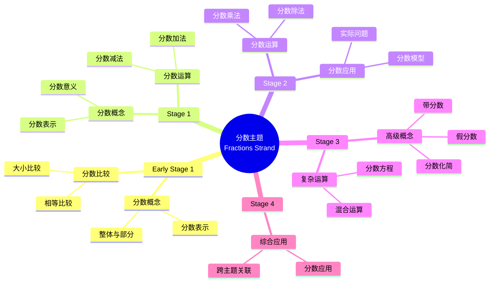

# 使用概念映射和Vee图分析初等数学中的"分数"主题

Using Concept Maps and Vee Diagrams to Analyse the "Fractions" Strand in Primary Mathematics

**创建日期**: 2025年12月11日
**创建日期**: December 11, 2025
**研究领域**: 数学教育 - 概念映射 - 初等数学 - 分数
**研究领域**: Mathematics Education - Concept Mapping - Primary Mathematics - Fractions
**主题编号**: CM.02.03
**章节**: Chapter 4
**作者**: Karoline Afamasaga-Fuata'i
**优先级**: P0（最高优先级）⭐⭐⭐⭐⭐

---

## 📑 目录 / Table of Contents

- [使用概念映射和Vee图分析初等数学中的"分数"主题](#使用概念映射和vee图分析初等数学中的分数主题)
  - [📋 一、概述 / Overview](#-一概述--overview)
  - [🔬 二、研究方法 / Research Methodology](#-二研究方法--research-methodology)
  - [📚 三、分数主题概念映射演进 / Evolution of Fractions Concept Maps](#-三分数主题概念映射演进--evolution-of-fractions-concept-maps)
  - [📊 四、Vee图问题分析 / Vee Diagram Problem Analysis](#-四vee图问题分析--vee-diagram-problem-analysis)
  - [💡 五、教学理解发展 / Pedagogical Understanding Development](#-五教学理解发展--pedagogical-understanding-development)
  - [📈 六、思维表征方式 / Representation Methods](#-六思维表征方式--representation-methods)
  - [📚 七、参考文献 / References](#-七参考文献--references)

---

## 📋 一、概述 / Overview

### 1.1 研究目标 / Research Objectives

**主要目标 / Main Objectives**:

- 研究概念映射和Vee图作为沟通概念分析手段的价值
- Examining the value of concept maps and vee diagrams as means of communicating conceptual analyses
- 研究概念映射和Vee图在发展理解方面的作用
- Examining the role of concept maps and vee diagrams in developing understanding
- 展示教学理解的发展过程
- Demonstrating the development process of pedagogical understanding

### 1.2 案例研究对象 / Case Study Subject

**研究对象 / Subject**:

- **姓名**: Ken
- **身份**: 研究生 / Post-graduate student
- **任务**: 分析分数主题的课程结果和相关数学问题
  Task: Analyze syllabus outcomes and related mathematics problems of Fractions strand
- **时间**: 一个学期
  Over a semester

### 1.3 核心内容 / Core Content

**主要内容 / Main Content**:

1. **课程分析** - 分析分数主题的课程结果
   Curriculum Analysis - Analyzing syllabus outcomes of Fractions strand
2. **问题分析** - 分析相关数学问题
   Problem Analysis - Analyzing related mathematics problems
3. **理解演进** - 展示教学理解的发展
   Understanding Evolution - Demonstrating development of pedagogical understanding
4. **方法论证** - 用数学原理论证解决方法
   Method Justification - Justifying methods in terms of mathematical principles

---

## 🔬 二、研究方法 / Research Methodology

### 2.1 研究设计 / Research Design

**研究方法 / Research Method**: 案例研究 / Case Study

**研究任务 / Research Tasks**:

1. **任务1** - 分析课程结果并构建初始概念映射
   Task 1 - Analyze syllabus outcomes and construct initial concept maps
2. **任务2** - 分析相关问题并构建Vee图
   Task 2 - Analyze related problems and construct vee diagrams
3. **任务3** - 展示概念和应用的互连性
   Task 3 - Display interconnectedness of concepts and applications

### 2.2 数据收集 / Data Collection

**收集的数据类型 / Types of Data Collected**:

1. **概念映射** - 从Early Stage 1到Stage 4的分数概念映射
2. **Vee图** - 相关问题的Vee图
3. **演进过程** - 概念映射和Vee图的演进过程

### 2.3 分析框架 / Analysis Framework

**概念映射分析 / Concept Map Analysis**:

- 分析概念映射的演进
- Analyze evolution of concept maps
- 评估概念理解的深度
- Assess depth of conceptual understanding
- 识别教学理解的发展
- Identify development of pedagogical understanding

**Vee图分析 / Vee Diagram Analysis**:

- 分析问题解决过程
- Analyze problem-solving process
- 评估方法论证的质量
- Assess quality of method justification
- 识别数学原理的应用
- Identify application of mathematical principles

---

## 📚 三、分数主题概念映射演进 / Evolution of Fractions Concept Maps

### 3.1 Early Stage 1 和 Stage 1 概念映射

**主要概念 / Main Concepts**:

- 分数概念 / Fraction concepts
- 分数表示 / Fraction representation
- 分数比较 / Fraction comparison

**发展特点 / Developmental Characteristics**:

- 从具体到抽象
  From concrete to abstract
- 从简单到复杂
  From simple to complex
- 从直观到符号
  From intuitive to symbolic

### 3.2 Stage 2 概念映射

**主要发展 / Main Developments**:

- 分数运算引入
  Introduction of fraction operations
- 分数应用扩展
  Extension of fraction applications
- 概念关联深化
  Deepening of concept relationships

### 3.3 Stage 3 概念映射

**主要发展 / Main Developments**:

- 分数运算深化
  Deepening of fraction operations
- 分数应用扩展
  Extension of fraction applications
- 与其他主题的关联
  Relationships with other topics

### 3.4 Stage 4 概念映射

**主要发展 / Main Developments**:

- 高级分数概念
  Advanced fraction concepts
- 复杂分数运算
  Complex fraction operations
- 综合应用
  Comprehensive applications

### 3.5 概念映射演进特点 / Concept Map Evolution Characteristics

**演进模式 / Evolution Patterns**:

1. **概念数量增加** - 从简单到复杂
   Increase in concept number - From simple to complex
2. **关联深化** - 从表面到深层
   Deepening of relationships - From surface to deep
3. **结构复杂化** - 从线性到网络
   Structural complexity - From linear to network

---

## 📊 四、Vee图问题分析 / Vee Diagram Problem Analysis

### 4.1 Vee图结构 / Vee Diagram Structure

**Vee图组成部分 / Vee Diagram Components**:

**思考侧 / Thinking Side**:

- 为什么我喜欢数学？ / Why I like mathematics?
- 我已经知道什么？ / What do I know already?
- 主要想法是什么？ / What are the important ideas?

**操作侧 / Doing Side**:

- 问题 / Problem
- 焦点问题 / Focus Question
- 给定信息是什么？ / What is the information given?
- 我如何找到答案？ / How do I find my answers?
- 我的答案是什么？ / What are my answers to the question?

### 4.2 Vee图演进分析 / Vee Diagram Evolution Analysis

**初始阶段 / Initial Stage**:

- 思考侧完成困难
  Difficulty completing thinking side
- 方法论证不足
  Insufficient method justification
- 原理应用不明确
  Unclear principle application

**发展阶段 / Development Stage**:

- 思考侧逐渐完善
  Gradual improvement of thinking side
- 方法论证增强
  Enhanced method justification
- 原理应用明确
  Clear principle application

**成熟阶段 / Mature Stage**:

- 思考侧完整准确
  Complete and accurate thinking side
- 方法论证充分
  Sufficient method justification
- 原理应用恰当
  Appropriate principle application

### 4.3 方法论证发展 / Method Justification Development

**发展特点 / Development Characteristics**:

- 从无论证到有论证
  From no justification to justification
- 从简单论证到深入论证
  From simple to deep justification
- 从单一方法到多种方法
  From single to multiple methods

---

## 💡 五、教学理解发展 / Pedagogical Understanding Development

### 5.1 理解发展阶段 / Understanding Development Stages

**阶段1：初始理解 / Stage 1: Initial Understanding**:

- 表面理解
  Surface understanding
- 概念关联不清晰
  Unclear concept relationships
- 教学知识不足
  Insufficient pedagogical knowledge

**阶段2：发展理解 / Stage 2: Developing Understanding**:

- 概念理解深化
  Deepening conceptual understanding
- 概念关联明确
  Clear concept relationships
- 教学知识发展
  Developing pedagogical knowledge

**阶段3：成熟理解 / Stage 3: Mature Understanding**:

- 深度概念理解
  Deep conceptual understanding
- 复杂概念关联
  Complex concept relationships
- 丰富教学知识
  Rich pedagogical knowledge

### 5.2 社会批判的作用 / Role of Social Critique

**批判过程 / Critique Process**:

- 展示 / Presentation
- 批判 / Critique
- 修订 / Revision
- 再展示 / Re-presentation

**批判效果 / Critique Effects**:

- 理解深化
  Deepening understanding
- 知识整合
  Knowledge integration
- 教学知识发展
  Pedagogical knowledge development

### 5.3 教学理解特点 / Pedagogical Understanding Characteristics

**理解特点 / Understanding Characteristics**:

1. **概念中心性** - 理解分数概念的中心地位
   Concept Centrality - Understanding central position of fraction concepts
2. **概念关联** - 理解概念之间的关联
   Concept Relationships - Understanding relationships between concepts
3. **教学序列** - 理解适当的教学序列
   Teaching Sequence - Understanding appropriate teaching sequences
4. **学生理解** - 理解学生的学习过程
   Student Understanding - Understanding student learning process

---

## 📈 六、思维表征方式 / Representation Methods

### 6.1 分数概念映射思维导图 / Fractions Concept Map Mind Map



### 6.2 分数教学决策树 / Fractions Teaching Decision Tree

```text
如何教授分数主题？
├─ 学生水平是什么？
│  ├─ Early Stage 1
│  │  └─ ✅ 使用具体材料和直观表示
│  │     └─ 方法：实物、图片、操作活动
│  ├─ Stage 1
│  │  └─ ✅ 使用分数模型和图表
│  │     └─ 方法：分数条、分数圆、数轴
│  ├─ Stage 2
│  │  └─ ✅ 使用分数运算和问题解决
│  │     └─ 方法：分数运算、实际问题
│  └─ Stage 3-4
│     └─ ✅ 使用抽象表示和综合应用
│        └─ 方法：符号、公式、综合问题
├─ 教学重点是什么？
│  ├─ 概念理解
│  │  └─ ✅ 强调分数概念
│  │     └─ 重点：分数的意义、表示
│  ├─ 运算技能
│  │  └─ ✅ 强调分数运算
│  │     └─ 重点：分数加减乘除
│  └─ 应用能力
│     └─ ✅ 强调分数应用
│        └─ 重点：实际问题解决
└─ 评估方法是什么？
   ├─ 形成性评估
   │  └─ ✅ 使用概念映射监控理解
   │     └─ 方法：定期构建概念映射
   ├─ 总结性评估
   │  └─ ✅ 使用概念映射评估最终理解
   │     └─ 方法：综合概念映射
   └─ 诊断性评估
      └─ ✅ 使用概念映射识别误解
         └─ 方法：对比专家图
```

### 6.3 理解发展证明树 / Understanding Development Proof Tree

```text
【目标】证明：概念映射和Vee图促进教学理解发展
【Goal】Prove: Concept maps and vee diagrams promote pedagogical understanding development

自底向上证明树 / Bottom-Up Proof Tree:

层次1（理论前提 / Theoretical Premises）
├─ 前提1：Ausubel有意义学习理论
│  └─ 支持：概念映射促进有意义学习
├─ 前提2：社会建构理论
│  └─ 支持：社会批判促进理解发展
└─ 前提3：元认知理论
   └─ 支持：概念映射是元认知工具

层次2（机制论证 / Mechanism Argument）
├─ 机制1：概念可视化机制
│  ├─ 过程：将概念理解可视化
│  ├─ 工具：概念映射提供视觉表征
│  └─ 结果：促进概念理解发展
├─ 机制2：社会批判机制
│  ├─ 过程：通过社会批判改进理解
│  ├─ 工具：展示-批判-修订循环
│  └─ 结果：深化教学理解
└─ 机制3：方法论证机制
   ├─ 过程：用原理论证方法
   ├─ 工具：Vee图提供论证框架
   └─ 结果：提高方法论证能力

层次3（实证证据 / Empirical Evidence）
├─ 证据1：Ken案例研究
│  ├─ 方法：分析概念映射演进
│  ├─ 结果：教学理解逐步发展
│  └─ 解释：概念映射有效促进理解发展
└─ 证据2：Vee图演进分析
   ├─ 方法：分析Vee图改进
   ├─ 结果：方法论证能力提高
   └─ 解释：Vee图有效促进方法论证

层次4（综合结论 / Comprehensive Conclusion）
└─ 结论：概念映射和Vee图促进教学理解发展
   ├─ 理论机制明确
   ├─ 实证证据支持
   └─ 应用效果显著
```

---

## 📚 七、参考文献 / References

### 7.1 主要参考文献 / Main References

1. **Afamasaga-Fuata'i, K. (2009)**. Using Concept Maps and Vee Diagrams to Analyse the "Fractions" Strand in Primary Mathematics. In K. Afamasaga-Fuata'i (Ed.), *Concept Mapping in Mathematics: Research into Practice* (pp. 59-85). Springer.

2. **Ausubel, D. P. (2000)**. *The Acquisition and Retention of Knowledge: A Cognitive View*. Kluwer Academic Publishers.

3. **Novak, J. D., & Gowin, D. B. (1984)**. *Learning How to Learn*. Cambridge University Press.

4. **Shulman, L. S. (1986)**. Those Who Understand: Knowledge Growth in Teaching. *Educational Researcher*, 15(2), 4-14.

### 7.2 相关研究 / Related Research

1. **Bruner, J. (1990)**. *Acts of Meaning*. Harvard University Press.

2. **Novak, J. D. (2002)**. Meaningful learning: The essential factor for conceptual change in limited or appropriate propositional hierarchies (liphs) leading to empowerment of learners. *Science Education*, 86(4), 548-571.

---

**创建日期**: 2025年12月11日
**最后更新**: 2025年12月11日
**状态**: ✅ Chapter 4详细梳理文档已创建
**完成度**: 100%
