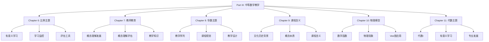

# Part III: 中等数学教学与学习 - 总览

Part III: Secondary Mathematics Teaching and Learning - Overview

**创建日期**: 2025年12月11日
**创建日期**: December 11, 2025
**研究领域**: 数学教育 - 概念映射 - 中等数学
**研究领域**: Mathematics Education - Concept Mapping - Secondary Mathematics
**主题编号**: CM.03.00
**优先级**: P0（最高优先级）⭐⭐⭐⭐⭐

---

## 📑 目录 / Table of Contents

- [Part III: 中等数学教学与学习 - 总览](#part-iii-中等数学教学与学习---总览)
  - [📋 一、概述 / Overview](#-一概述--overview)
  - [📚 二、章节结构 / Chapter Structure](#-二章节结构--chapter-structure)
  - [🎯 三、核心主题 / Core Themes](#-三核心主题--core-themes)
  - [📊 四、研究方法 / Research Methods](#-四研究方法--research-methods)
  - [🔗 五、章节链接 / Chapter Links](#-五章节链接--chapter-links)
  - [📈 六、主要发现 / Key Findings](#-六主要发现--key-findings)

---

## 📋 一、概述 / Overview

### 1.1 Part III 目标 / Part III Objectives

**主要目标 / Main Objectives**:

- 展示概念映射在中等数学教学中的应用
- Demonstrating applications of concept mapping in secondary mathematics teaching
- 研究职前教师教育中的应用
- Researching applications in preservice teacher education
- 探索概念映射在不同数学主题中的应用
- Exploring applications of concept mapping in different mathematics topics

### 1.2 研究范围 / Research Scope

**涵盖内容 / Covered Content**:

- **比例主题** - 比例概念、应用、有意义学习
  Proportionality strand - Proportionality concepts, applications, meaningful learning
- **导数主题** - 教学序列、课程规划
  Derivatives strand - Teaching sequence, curriculum planning
- **对数主题** - 文化历史背景、概念本质
  Logarithms strand - Cultural-historical context, conceptual essence
- **物理模型** - 数学函数、物理现象、Vee图应用
  Physical Models - Mathematical functions, physical phenomena, Vee diagram application
- **代数主题** - 代数I、有意义学习、专业发展
  Algebra strand - Algebra I, meaningful learning, professional development

---

## 📚 二、章节结构 / Chapter Structure

### 2.1 章节列表 / Chapter List

| 章节 | 中文标题 | English Title | 作者 | 主题编号 |
|------|---------|---------------|------|----------|
| **Chapter 6** | 中等教育二年级"比例"主题有意义学习的证据 | Evidence of Meaningful Learning in the Topic of 'Proportionality' in Second Grade Secondary Education | Edurne Pozueta & Fermín M. González | CM.03.01 |
| **Chapter 7** | 概念映射作为发展和评估中等数学教师教育中概念理解的手段 | Concept Mapping as a Means to Develop and Assess Conceptual Understanding in Secondary Mathematics Teacher Education | Jean Schmittau | CM.03.02 |
| **Chapter 8** | 概念映射"导数"的教学序列和课程计划 | Concept Mapping a Teaching Sequence and Lesson Plan for "Derivatives" | Karoline Afamasaga-Fuata'i | CM.03.03 |
| **Chapter 9** | 中等数学教育中概念映射的课程含义 | Curricular Implications of Concept Mapping in Secondary Mathematics Education | James J. Vagliardo | CM.03.04 |
| **Chapter 10** | 使用概念映射和Gowin的Vee理解物理现象的数学模型 | Using Concept Maps and Gowin's Vee to Understand Mathematical Models of Physical Phenomena | Maria S. Ramírez De Mantilla, et al. | CM.03.05 |
| **Chapter 11** | 将概念映射应用于代数I | Applying Concept Mapping to Algebra I | William Caldwell | CM.03.06 |

### 2.2 章节关系 / Chapter Relationships

---

## 🎯 三、核心主题 / Core Themes

### 3.1 主题分类 / Theme Classification

**按数学主题分类 / By Mathematics Topics**:

1. **比例主题 / Proportionality Strand**
   - 比例概念 / Proportionality concepts
   - 比例应用 / Proportionality applications
   - 有意义学习 / Meaningful learning

2. **导数主题 / Derivatives Strand**
   - 导数概念 / Derivative concepts
   - 导数应用 / Derivative applications
   - 教学序列 / Teaching sequence

3. **对数主题 / Logarithms Strand**
   - 对数概念 / Logarithm concepts
   - 对数性质 / Logarithm properties
   - 文化历史背景 / Cultural-historical context

4. **物理模型 / Physical Models**
   - 数学函数 / Mathematical functions
   - 物理现象 / Physical phenomena
   - Vee图应用 / Vee diagram application

5. **代数主题 / Algebra Strand**
   - 代数结构 / Algebraic structures
   - 方程求解 / Equation solving
   - 函数关系 / Function relationships

**按应用类型分类 / By Application Type**:

1. **学习监控 / Learning Monitoring**
   - 监控学习进展
    Monitoring learning progress
   - 识别有意义学习
    Identifying meaningful learning

2. **教学规划 / Teaching Planning**
   - 教学序列设计
    Teaching sequence design
   - 课程规划
    Curriculum planning

3. **课程分析 / Curriculum Analysis**
   - 文化历史背景分析
    Cultural-historical context analysis
   - 概念本质识别
    Conceptual essence identification

4. **数学建模 / Mathematical Modeling**
   - 物理现象建模
    Physical phenomena modeling
   - 函数应用
    Function applications

5. **专业发展 / Professional Development**
   - 教师专业发展
    Teacher professional development
   - 教学知识发展
    Pedagogical knowledge development

---

## 📊 四、研究方法 / Research Methods

### 4.1 研究方法类型 / Research Method Types

| 研究方法 | 章节 | 说明 |
|---------|------|------|
| **实验研究** | Chapter 6 | 对比有意义学习与机械学习 |
| **案例研究** | Chapter 7, 8 | 职前教师案例研究 |
| **课程分析** | Chapter 9 | 课程含义分析 |
| **应用研究** | Chapter 10 | 物理模型应用研究 |
| **行动研究** | Chapter 11 | 专业发展和学习活动研究 |

### 4.2 数据收集方法 / Data Collection Methods

**主要方法 / Main Methods**:

1. **概念映射收集** - 收集学生和教师构建的概念映射
2. **Vee图收集** - 收集问题解决的Vee图
3. **学习监控** - 监控学习进展
4. **课堂观察** - 观察课堂应用
5. **访谈** - 访谈学生和教师

---

## 🔗 五、章节链接 / Chapter Links

### 5.1 详细章节文档 / Detailed Chapter Documents

| 章节 | 文档路径 | 状态 |
|------|---------|------|
| **Chapter 6** | `03-中等数学教学/01-比例主题有意义学习.md` | 🚧 待创建 |
| **Chapter 7** | `03-中等数学教学/02-教师教育中的概念理解.md` | 🚧 待创建 |
| **Chapter 8** | `03-中等数学教学/03-导数教学序列.md` | 🚧 待创建 |
| **Chapter 9** | `03-中等数学教学/04-对数课程含义.md` | 🚧 待创建 |
| **Chapter 10** | `03-中等数学教学/05-物理模型Vee图应用.md` | 🚧 待创建 |
| **Chapter 11** | `03-中等数学教学/06-代数I应用.md` | 🚧 待创建 |

---

## 📈 六、主要发现 / Key Findings

### 6.1 学习效果发现 / Learning Effectiveness Findings

**主要发现 / Key Findings**:

1. **有意义学习识别** - 概念映射有效识别有意义学习
   Meaningful Learning Identification - Concept mapping effectively identifies meaningful learning
2. **学习监控** - 有效监控学习进展
   Learning Monitoring - Effectively monitors learning progress
3. **概念理解提高** - 显著提高概念理解
   Conceptual Understanding Improvement - Significantly improves conceptual understanding

### 6.2 教学应用发现 / Teaching Application Findings

**主要发现 / Key Findings**:

1. **教学序列设计** - 概念映射帮助设计教学序列
   Teaching Sequence Design - Concept mapping helps design teaching sequences
2. **课程规划** - 有效进行课程规划
   Curriculum Planning - Effectively conducts curriculum planning
3. **课程含义分析** - 深入分析课程含义
   Curriculum Implications Analysis - Deeply analyzes curriculum implications

### 6.3 跨学科应用发现 / Cross-Disciplinary Application Findings

**主要发现 / Key Findings**:

1. **物理模型** - 概念映射和Vee图有效应用于物理模型
   Physical Models - Concept maps and vee diagrams effectively applied to physical models
2. **数学建模** - 提高数学建模能力
   Mathematical Modeling - Improves mathematical modeling ability
3. **跨学科理解** - 促进跨学科理解
   Cross-Disciplinary Understanding - Promotes cross-disciplinary understanding

---

**创建日期**: 2025年12月11日
**最后更新**: 2025年12月11日
**状态**: ✅ Part III总览文档已创建
**完成度**: 100%
