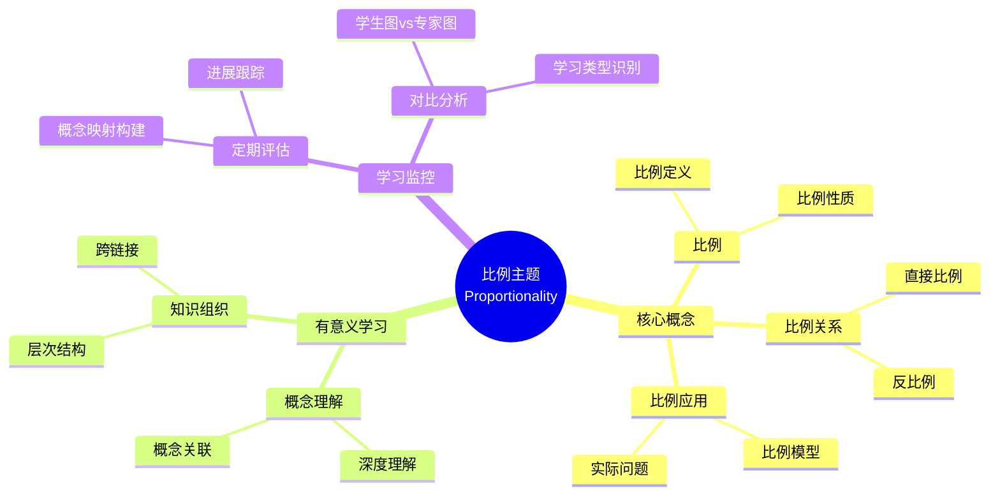

# 中等教育二年级"比例"主题有意义学习的证据

Evidence of Meaningful Learning in the Topic of 'Proportionality' in Second Grade Secondary Education

**创建日期**: 2025年12月11日
**创建日期**: December 11, 2025
**研究领域**: 数学教育 - 概念映射 - 中等数学 - 比例
**研究领域**: Mathematics Education - Concept Mapping - Secondary Mathematics - Proportionality
**主题编号**: CM.03.01
**章节**: Chapter 6
**作者**: Edurne Pozueta and Fermín M. González
**优先级**: P0（最高优先级）⭐⭐⭐⭐⭐

---

## 📑 目录 / Table of Contents

- [中等教育二年级"比例"主题有意义学习的证据](#中等教育二年级比例主题有意义学习的证据)
  - [📋 一、概述 / Overview](#-一概述--overview)
  - [🔬 二、研究方法 / Research Methodology](#-二研究方法--research-methodology)
  - [📊 三、有意义学习识别 / Meaningful Learning Identification](#-三有意义学习识别--meaningful-learning-identification)
  - [📈 四、学习监控方法 / Learning Monitoring Methods](#-四学习监控方法--learning-monitoring-methods)
  - [💡 五、评估结果分析 / Assessment Results Analysis](#-五评估结果分析--assessment-results-analysis)
  - [📈 六、思维表征方式 / Representation Methods](#-六思维表征方式--representation-methods)
  - [📚 七、参考文献 / References](#-七参考文献--references)

---

## 📋 一、概述 / Overview

### 1.1 研究目标 / Research Objectives

**主要目标 / Main Objectives**:

- 说明概念映射如何用于监控和识别中等学生有意义学习的程度
- Illustrating how concept maps can be used to monitor and identify the extent of secondary students' meaningful learning
- 对比有意义学习与机械学习
- Comparing meaningful learning with rote learning
- 识别误解
- Identifying misconceptions

### 1.2 研究问题 / Research Questions

**焦点问题 / Focus Questions**:

1. 概念映射如何识别有意义学习？
   How do concept maps identify meaningful learning?
2. 概念映射如何区分有意义学习与机械学习？
   How do concept maps distinguish meaningful learning from rote learning?
3. 概念映射如何识别误解？
   How do concept maps identify misconceptions?

### 1.3 核心内容 / Core Content

**主要内容 / Main Content**:

1. **创新教学模块** - 比例主题的创新教学模块
   Innovative Instructional Module - Innovative instructional module on Proportionality
2. **概念映射评估** - 使用概念映射评估学习
   Concept Map Assessment - Using concept maps to assess learning
3. **专家图对比** - 对比学生图与专家图
   Expert Map Comparison - Comparing student maps with expert maps
4. **学习类型识别** - 区分有意义学习、机械学习和误解
   Learning Type Identification - Distinguishing meaningful learning, rote learning, and misconceptions

---

## 🔬 二、研究方法 / Research Methodology

### 2.1 研究设计 / Research Design

**研究方法 / Research Method**: 实验研究 / Experimental Research

**研究流程 / Research Process**:

1. **教学阶段** - 使用创新教学模块教授比例主题
   Teaching Phase - Teaching Proportionality using innovative instructional module
2. **评估阶段** - 使用概念映射评估学习
   Assessment Phase - Assessing learning using concept maps
3. **对比阶段** - 对比学生图与专家图
   Comparison Phase - Comparing student maps with expert maps
4. **分析阶段** - 分析学习类型
   Analysis Phase - Analyzing learning types

### 2.2 数据收集 / Data Collection

**收集的数据类型 / Types of Data Collected**:

1. **个人构建的概念映射** - 每个学生构建的概念映射
2. **专家概念映射** - 专家构建的概念映射
3. **学习类型分类** - 有意义学习、机械学习、误解

### 2.3 分析框架 / Analysis Framework

**概念映射分析 / Concept Map Analysis**:

- 对比学生图与专家图
  Compare student maps with expert maps
- 评估概念数量
  Assess number of concepts
- 评估关系准确性
  Assess relationship accuracy
- 识别学习类型
  Identify learning types

---

## 📊 三、有意义学习识别 / Meaningful Learning Identification

### 3.1 有意义学习特征 / Meaningful Learning Characteristics

**主要特征 / Main Characteristics**:

1. **概念完整性** - 包含所有关键概念
   Concept Completeness - Includes all key concepts
2. **关系准确性** - 概念之间的关系准确
   Relationship Accuracy - Relationships between concepts are accurate
3. **层次结构** - 概念层次结构清晰
   Hierarchical Structure - Conceptual hierarchy is clear
4. **跨链接** - 存在跨概念系统的链接
   Cross-Links - Links between concept systems exist

### 3.2 机械学习特征 / Rote Learning Characteristics

**主要特征 / Main Characteristics**:

1. **概念不完整** - 缺少关键概念
   Concept Incompleteness - Missing key concepts
2. **关系不准确** - 概念之间的关系不准确
   Relationship Inaccuracy - Relationships between concepts are inaccurate
3. **结构简单** - 概念结构过于简单
   Simple Structure - Conceptual structure too simple
4. **缺少跨链接** - 缺少跨概念系统的链接
   Lack of Cross-Links - Missing links between concept systems

### 3.3 误解识别 / Misconception Identification

**误解类型 / Misconception Types**:

1. **错误概念** - 包含错误的概念
   Wrong Concepts - Contains wrong concepts
2. **错误关系** - 概念之间的关系错误
   Wrong Relationships - Relationships between concepts are wrong
3. **概念混淆** - 混淆不同概念
   Concept Confusion - Confusing different concepts

---

## 📈 四、学习监控方法 / Learning Monitoring Methods

### 4.1 监控策略 / Monitoring Strategies

**主要策略 / Main Strategies**:

1. **定期构建** - 定期让学生构建概念映射
   Regular Construction - Have students regularly construct concept maps
2. **对比分析** - 对比学生图与专家图
   Comparative Analysis - Compare student maps with expert maps
3. **进展跟踪** - 跟踪概念理解的发展
   Progress Tracking - Track development of conceptual understanding

### 4.2 评估指标 / Assessment Indicators

**评估维度 / Assessment Dimensions**:

1. **概念数量** - 概念映射中的概念数量
   Number of Concepts - Number of concepts in concept map
2. **关系数量** - 概念之间的关系数量
   Number of Relationships - Number of relationships between concepts
3. **准确性** - 概念和关系的准确性
   Accuracy - Accuracy of concepts and relationships
4. **完整性** - 概念映射的完整性
   Completeness - Completeness of concept map

### 4.3 反馈机制 / Feedback Mechanisms

**反馈方式 / Feedback Methods**:

1. **即时反馈** - 提供即时反馈
   Immediate Feedback - Provide immediate feedback
2. **详细反馈** - 提供详细的改进建议
   Detailed Feedback - Provide detailed improvement suggestions
3. **同伴反馈** - 同伴评审和反馈
   Peer Feedback - Peer review and feedback

---

## 💡 五、评估结果分析 / Assessment Results Analysis

### 5.1 学习类型分布 / Learning Type Distribution

**分布特点 / Distribution Characteristics**:

- **有意义学习者** - 能够构建完整准确的概念映射
  Meaningful Learners - Able to construct complete and accurate concept maps
- **机械学习者** - 概念映射不完整或不准确
  Rote Learners - Concept maps incomplete or inaccurate
- **有误解者** - 概念映射包含错误概念或关系
  Misconception Holders - Concept maps contain wrong concepts or relationships

### 5.2 学习效果对比 / Learning Effectiveness Comparison

**对比维度 / Comparison Dimensions**:

1. **概念理解深度** - 有意义学习者理解更深
   Depth of Conceptual Understanding - Meaningful learners understand deeper
2. **知识组织** - 有意义学习者知识组织更好
   Knowledge Organization - Meaningful learners organize knowledge better
3. **问题解决能力** - 有意义学习者问题解决能力更强
   Problem-Solving Ability - Meaningful learners solve problems better

### 5.3 教学启示 / Teaching Implications

**主要启示 / Main Implications**:

1. **识别学习类型** - 概念映射有效识别学习类型
   Identify Learning Types - Concept mapping effectively identifies learning types
2. **提供针对性支持** - 根据学习类型提供支持
   Provide Targeted Support - Provide support based on learning types
3. **改进教学** - 根据评估结果改进教学
   Improve Teaching - Improve teaching based on assessment results

---

## 📈 六、思维表征方式 / Representation Methods

### 6.1 比例概念映射思维导图 / Proportionality Concept Map Mind Map



### 6.2 学习类型识别决策树 / Learning Type Identification Decision Tree

```text
如何识别学习类型？
├─ 概念映射特征是什么？
│  ├─ 概念完整
│  │  ├─ 关系准确
│  │  │  ├─ 层次清晰
│  │  │  │  ├─ 有跨链接
│  │  │  │  │  └─ ✅ 有意义学习
│  │  │  │  └─ 无跨链接
│  │  │  │     └─ ⚠️ 部分有意义学习
│  │  │  └─ 层次不清晰
│  │  │     └─ ⚠️ 部分有意义学习
│  │  └─ 关系不准确
│  │     └─ ❌ 有误解
│  └─ 概念不完整
│     ├─ 关系准确
│     │  └─ ⚠️ 机械学习
│     └─ 关系不准确
│        └─ ❌ 有误解
├─ 与专家图对比如何？
│  ├─ 高度相似
│  │  └─ ✅ 有意义学习
│  ├─ 部分相似
│  │  └─ ⚠️ 部分有意义学习或机械学习
│  └─ 差异很大
│     └─ ❌ 有误解或机械学习
└─ 概念数量如何？
   ├─ 接近专家图
   │  └─ ✅ 可能是有意义学习
   ├─ 明显少于专家图
   │  └─ ⚠️ 可能是机械学习
   └─ 明显多于专家图
      └─ ❌ 可能包含误解
```

### 6.3 有意义学习证明树 / Meaningful Learning Proof Tree

```text
【目标】证明：概念映射有效识别有意义学习
【Goal】Prove: Concept mapping effectively identifies meaningful learning

自底向上证明树 / Bottom-Up Proof Tree:

层次1（理论前提 / Theoretical Premises）
├─ 前提1：Ausubel有意义学习理论
│  └─ 支持：有意义学习需要概念整合
├─ 前提2：认知结构理论
│  └─ 支持：概念映射反映认知结构
└─ 前提3：评估理论
   └─ 支持：概念映射是有效评估工具

层次2（机制论证 / Mechanism Argument）
├─ 机制1：概念完整性机制
│  ├─ 过程：评估概念完整性
│  ├─ 工具：概念映射显示概念
│  └─ 结果：识别概念理解程度
├─ 机制2：关系准确性机制
│  ├─ 过程：评估关系准确性
│  ├─ 工具：概念映射显示关系
│  └─ 结果：识别概念关联理解
└─ 机制3：结构复杂性机制
   ├─ 过程：评估结构复杂性
   ├─ 工具：概念映射显示结构
   └─ 结果：识别知识组织程度

层次3（实证证据 / Empirical Evidence）
├─ 证据1：对比研究证据
│  ├─ 方法：对比学生图与专家图
│  ├─ 结果：有效区分有意义学习
│  └─ 解释：概念映射有效识别
└─ 证据2：学习类型识别证据
   ├─ 方法：分析概念映射特征
   ├─ 结果：准确识别学习类型
   └─ 解释：概念映射有效评估

层次4（综合结论 / Comprehensive Conclusion）
└─ 结论：概念映射有效识别有意义学习
   ├─ 理论机制明确
   ├─ 实证证据支持
   └─ 应用效果显著
```

---

## 📚 七、参考文献 / References

### 7.1 主要参考文献 / Main References

1. **Pozueta, E., & González, F. M. (2009)**. Evidence of Meaningful Learning in the Topic of 'Proportionality' in Second Grade Secondary Education. In K. Afamasaga-Fuata'i (Ed.), *Concept Mapping in Mathematics: Research into Practice* (pp. 117-135). Springer.

2. **Ausubel, D. P. (2000)**. *The Acquisition and Retention of Knowledge: A Cognitive View*. Kluwer Academic Publishers.

3. **Novak, J. D., & Gowin, D. B. (1984)**. *Learning How to Learn*. Cambridge University Press.

### 7.2 相关研究 / Related Research

1. **Ruiz-Primo, M. A., & Shavelson, R. J. (1996)**. Problems and issues in the use of concept maps in science assessment. *Journal of Research in Science Teaching*, 33(6), 569-600.

2. **McClure, J. R., Sonak, B., & Suen, H. K. (1999)**. Concept map assessment of classroom learning: Reliability, validity, and logistical practicality. *Journal of Research in Science Teaching*, 36(4), 475-492.

---

**创建日期**: 2025年12月11日
**最后更新**: 2025年12月11日
**状态**: ✅ Chapter 6详细梳理文档已创建
**完成度**: 100%
