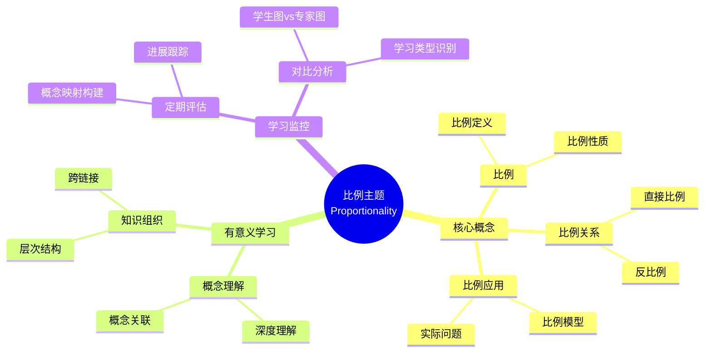

# 中等教育二年级"比例"主题有意义学习的证据

Evidence of Meaningful Learning in the Topic of 'Proportionality' in Second Grade Secondary Education

**创建日期**: 2025年12月11日
**创建日期**: December 11, 2025
**研究领域**: 数学教育 - 概念映射 - 中等数学 - 比例
**研究领域**: Mathematics Education - Concept Mapping - Secondary Mathematics - Proportionality
**主题编号**: CM.03.01
**章节**: Chapter 6
**作者**: Edurne Pozueta and Fermín M. González
**优先级**: P0（最高优先级）⭐⭐⭐⭐⭐

---

## 📑 目录 / Table of Contents

- [中等教育二年级"比例"主题有意义学习的证据](#中等教育二年级比例主题有意义学习的证据)
  - [📑 目录 / Table of Contents](#-目录--table-of-contents)
  - [📋 一、概述 / Overview](#-一概述--overview)
    - [1.1 研究目标 / Research Objectives](#11-研究目标--research-objectives)
    - [1.2 研究问题 / Research Questions](#12-研究问题--research-questions)
    - [1.3 核心内容 / Core Content](#13-核心内容--core-content)
  - [🔬 二、研究方法 / Research Methodology](#-二研究方法--research-methodology)
    - [2.1 研究设计 / Research Design](#21-研究设计--research-design)
    - [2.2 数据收集 / Data Collection](#22-数据收集--data-collection)
    - [2.3 分析框架 / Analysis Framework](#23-分析框架--analysis-framework)
  - [📐 三、比例数学内容深度分析 / Deep Analysis of Proportionality Mathematical Content](#-三比例数学内容深度分析--deep-analysis-of-proportionality-mathematical-content)
    - [3.1 比例的数学定义与本质 / Mathematical Definition and Essence of Proportionality](#31-比例的数学定义与本质--mathematical-definition-and-essence-of-proportionality)
      - [3.1.1 比例的基本定义 / Basic Definition of Proportionality](#311-比例的基本定义--basic-definition-of-proportionality)
      - [3.1.2 比例的类型 / Types of Proportionality](#312-比例的类型--types-of-proportionality)
    - [3.2 比例的数学性质 / Mathematical Properties of Proportionality](#32-比例的数学性质--mathematical-properties-of-proportionality)
      - [3.2.1 比例的基本性质 / Basic Properties of Proportions](#321-比例的基本性质--basic-properties-of-proportions)
      - [3.2.2 比例函数的性质 / Properties of Proportional Functions](#322-比例函数的性质--properties-of-proportional-functions)
    - [3.3 比例与其他数学概念的关联 / Relationships Between Proportionality and Other Mathematical Concepts](#33-比例与其他数学概念的关联--relationships-between-proportionality-and-other-mathematical-concepts)
      - [3.3.1 比例与分数 / Proportionality and Fractions](#331-比例与分数--proportionality-and-fractions)
      - [3.3.2 比例与相似 / Proportionality and Similarity](#332-比例与相似--proportionality-and-similarity)
      - [3.3.3 比例与线性函数 / Proportionality and Linear Functions](#333-比例与线性函数--proportionality-and-linear-functions)
      - [3.3.4 比例与百分比 / Proportionality and Percentages](#334-比例与百分比--proportionality-and-percentages)
      - [3.3.5 比例的应用 / Applications of Proportionality](#335-比例的应用--applications-of-proportionality)
    - [3.4 比例数学内容典型例题 / Typical Examples of Proportionality](#34-比例数学内容典型例题--typical-examples-of-proportionality)
      - [3.4.1 比例式与交叉相乘例题 / Proportion and Cross Multiplication](#341-比例式与交叉相乘例题--proportion-and-cross-multiplication)
      - [3.4.2 正比例函数情境例题 / Direct Proportional Function](#342-正比例函数情境例题--direct-proportional-function)
      - [3.4.3 反比例应用问题例题 / Inverse Proportional Application](#343-反比例应用问题例题--inverse-proportional-application)
    - [3.5 跨主题关联小结 / Cross-Topic Association Summary](#35-跨主题关联小结--cross-topic-association-summary)
      - [3.5.1 比例与分数的统一性 / Unity of Proportionality and Fractions](#351-比例与分数的统一性--unity-of-proportionality-and-fractions)
      - [3.5.2 比例与线性函数的关联 / Association Between Proportionality and Linear Functions](#352-比例与线性函数的关联--association-between-proportionality-and-linear-functions)
      - [3.5.3 比例在相似几何中的应用 / Application of Proportionality in Similar Geometry](#353-比例在相似几何中的应用--application-of-proportionality-in-similar-geometry)
  - [📊 四、有意义学习识别 / Meaningful Learning Identification](#-四有意义学习识别--meaningful-learning-identification)
    - [4.1 有意义学习特征 / Meaningful Learning Characteristics](#41-有意义学习特征--meaningful-learning-characteristics)
    - [4.2 机械学习特征 / Rote Learning Characteristics](#42-机械学习特征--rote-learning-characteristics)
    - [4.3 误解识别 / Misconception Identification](#43-误解识别--misconception-identification)
  - [📈 五、学习监控方法 / Learning Monitoring Methods](#-五学习监控方法--learning-monitoring-methods)
    - [5.1 监控策略 / Monitoring Strategies](#51-监控策略--monitoring-strategies)
    - [5.2 评估指标 / Assessment Indicators](#52-评估指标--assessment-indicators)
    - [5.3 反馈机制 / Feedback Mechanisms](#53-反馈机制--feedback-mechanisms)
  - [💡 六、评估结果分析 / Assessment Results Analysis](#-六评估结果分析--assessment-results-analysis)
    - [6.1 学习类型分布 / Learning Type Distribution](#61-学习类型分布--learning-type-distribution)
    - [6.2 学习效果对比 / Learning Effectiveness Comparison](#62-学习效果对比--learning-effectiveness-comparison)
    - [6.3 学生概念映射演进案例 / Student Concept Map Evolution Cases](#63-学生概念映射演进案例--student-concept-map-evolution-cases)
    - [6.4 教学启示 / Teaching Implications](#64-教学启示--teaching-implications)
  - [📈 七、思维表征方式 / Representation Methods](#-七思维表征方式--representation-methods)
    - [7.1 比例概念映射思维导图 / Proportionality Concept Map Mind Map](#71-比例概念映射思维导图--proportionality-concept-map-mind-map)
    - [7.2 学习类型识别决策树 / Learning Type Identification Decision Tree](#72-学习类型识别决策树--learning-type-identification-decision-tree)
    - [7.3 有意义学习证明树 / Meaningful Learning Proof Tree](#73-有意义学习证明树--meaningful-learning-proof-tree)
  - [📚 八、参考文献 / References](#-八参考文献--references)
    - [8.1 主要参考文献 / Main References](#81-主要参考文献--main-references)
    - [8.2 相关研究 / Related Research](#82-相关研究--related-research)

---

## 📋 一、概述 / Overview

### 1.1 研究目标 / Research Objectives

**主要目标 / Main Objectives**:

- 说明概念映射如何用于监控和识别中等学生有意义学习的程度
- Illustrating how concept maps can be used to monitor and identify the extent of secondary students' meaningful learning
- 对比有意义学习与机械学习
- Comparing meaningful learning with rote learning
- 识别误解
- Identifying misconceptions

### 1.2 研究问题 / Research Questions

**焦点问题 / Focus Questions**:

1. 概念映射如何识别有意义学习？
   How do concept maps identify meaningful learning?
2. 概念映射如何区分有意义学习与机械学习？
   How do concept maps distinguish meaningful learning from rote learning?
3. 概念映射如何识别误解？
   How do concept maps identify misconceptions?

### 1.3 核心内容 / Core Content

**主要内容 / Main Content**:

1. **创新教学模块** - 比例主题的创新教学模块
   Innovative Instructional Module - Innovative instructional module on Proportionality
2. **概念映射评估** - 使用概念映射评估学习
   Concept Map Assessment - Using concept maps to assess learning
3. **专家图对比** - 对比学生图与专家图
   Expert Map Comparison - Comparing student maps with expert maps
4. **学习类型识别** - 区分有意义学习、机械学习和误解
   Learning Type Identification - Distinguishing meaningful learning, rote learning, and misconceptions

---

## 🔬 二、研究方法 / Research Methodology

### 2.1 研究设计 / Research Design

**研究方法 / Research Method**: 实验研究 / Experimental Research

**研究流程 / Research Process**:

1. **教学阶段** - 使用创新教学模块教授比例主题
   Teaching Phase - Teaching Proportionality using innovative instructional module
2. **评估阶段** - 使用概念映射评估学习
   Assessment Phase - Assessing learning using concept maps
3. **对比阶段** - 对比学生图与专家图
   Comparison Phase - Comparing student maps with expert maps
4. **分析阶段** - 分析学习类型
   Analysis Phase - Analyzing learning types

### 2.2 数据收集 / Data Collection

**收集的数据类型 / Types of Data Collected**:

1. **个人构建的概念映射** - 每个学生构建的概念映射
2. **专家概念映射** - 专家构建的概念映射
3. **学习类型分类** - 有意义学习、机械学习、误解

### 2.3 分析框架 / Analysis Framework

**概念映射分析 / Concept Map Analysis**:

- 对比学生图与专家图
  Compare student maps with expert maps
- 评估概念数量
  Assess number of concepts
- 评估关系准确性
  Assess relationship accuracy
- 识别学习类型
  Identify learning types

---

## 📐 三、比例数学内容深度分析 / Deep Analysis of Proportionality Mathematical Content

### 3.1 比例的数学定义与本质 / Mathematical Definition and Essence of Proportionality

#### 3.1.1 比例的基本定义 / Basic Definition of Proportionality

**比例定义 / Proportionality Definition**:

- **比例关系**: 两个量之间存在恒定的比值关系
  - **Proportional Relationship**: Two quantities have a constant ratio
  - 如果 $y = kx$（其中 $k$ 是常数），则 $y$ 与 $x$ 成正比
  - If $y = kx$ (where $k$ is a constant), then $y$ is directly proportional to $x$

- **比例式**: $\frac{a}{b} = \frac{c}{d}$ 或 $a:b = c:d$
  - **Proportion**: $\frac{a}{b} = \frac{c}{d}$ or $a:b = c:d$
  - $a$ 和 $d$ 称为外项（extremes）
  - $b$ 和 $c$ 称为内项（means）

**比例的本质 / Essence of Proportionality**:

- **直接比例 / Direct Proportionality**:
  - $y = kx$，其中 $k > 0$ 是比例常数
  - $y = kx$, where $k > 0$ is the constant of proportionality
  - 一个量增加，另一个量按相同比例增加
  - As one quantity increases, the other increases by the same factor

- **反比例 / Inverse Proportionality**:
  - $y = \frac{k}{x}$，其中 $k > 0$ 是比例常数
  - $y = \frac{k}{x}$, where $k > 0$ is the constant of proportionality
  - 一个量增加，另一个量按相同比例减少
  - As one quantity increases, the other decreases by the same factor

#### 3.1.2 比例的类型 / Types of Proportionality

**分类方式 / Classification Methods**:

1. **按关系类型分类 / By Relationship Type**:
   - **直接比例**: $y = kx$
   - **反比例**: $y = \frac{k}{x}$
   - **复合比例**: 涉及多个变量的比例关系

2. **按应用领域分类 / By Application Domain**:
   - **几何比例**: 相似图形的边长比例
   - **物理比例**: 速度、密度等物理量的比例关系
   - **经济比例**: 价格、成本等经济量的比例关系

### 3.2 比例的数学性质 / Mathematical Properties of Proportionality

#### 3.2.1 比例的基本性质 / Basic Properties of Proportions

**基本性质 / Basic Properties**:

1. **交叉相乘 / Cross Multiplication**:
   - 如果 $\frac{a}{b} = \frac{c}{d}$，则 $ad = bc$
   - If $\frac{a}{b} = \frac{c}{d}$, then $ad = bc$

2. **比例中项 / Mean Proportional**:
   - 如果 $\frac{a}{b} = \frac{b}{c}$，则 $b$ 是 $a$ 和 $c$ 的比例中项
   - If $\frac{a}{b} = \frac{b}{c}$, then $b$ is the mean proportional of $a$ and $c$
   - $b^2 = ac$ 或 $b = \sqrt{ac}$
   - $b^2 = ac$ or $b = \sqrt{ac}$

3. **比例的和与差 / Sum and Difference of Proportions**:
   - 如果 $\frac{a}{b} = \frac{c}{d}$，则 $\frac{a+b}{b} = \frac{c+d}{d}$（合比定理）
   - If $\frac{a}{b} = \frac{c}{d}$, then $\frac{a+b}{b} = \frac{c+d}{d}$ (componendo)
   - 如果 $\frac{a}{b} = \frac{c}{d}$，则 $\frac{a-b}{b} = \frac{c-d}{d}$（分比定理）
   - If $\frac{a}{b} = \frac{c}{d}$, then $\frac{a-b}{b} = \frac{c-d}{d}$ (dividendo)

#### 3.2.2 比例函数的性质 / Properties of Proportional Functions

**直接比例函数 / Direct Proportional Function**:

- **函数形式**: $f(x) = kx$
- **图像**: 通过原点的直线
- **斜率**: $k$（比例常数）
- **单调性**: $k > 0$ 时递增，$k < 0$ 时递减

**反比例函数 / Inverse Proportional Function**:

- **函数形式**: $f(x) = \frac{k}{x}$
- **图像**: 双曲线
- **定义域**: $x \neq 0$
- **单调性**: 在每个区间内单调递减（$k > 0$）

### 3.3 比例与其他数学概念的关联 / Relationships Between Proportionality and Other Mathematical Concepts

#### 3.3.1 比例与分数 / Proportionality and Fractions

**关联关系 / Relationship**:

- 比例可以表示为分数
- Proportions can be expressed as fractions
- 例如：比例 3:4 可以表示为 $\frac{3}{4}$
- Example: ratio 3:4 can be expressed as $\frac{3}{4}$

#### 3.3.2 比例与相似 / Proportionality and Similarity

**几何关联 / Geometric Relationship**:

- 相似图形的对应边成比例
- Corresponding sides of similar figures are proportional
- 如果两个三角形相似，则对应边的比例相等
- If two triangles are similar, then corresponding sides are proportional

**相似比 / Similarity Ratio**:

- 相似图形的对应边的比值称为相似比
- The ratio of corresponding sides of similar figures is called the similarity ratio

#### 3.3.3 比例与线性函数 / Proportionality and Linear Functions

**关系 / Relationship**:

- 直接比例是线性函数的特殊情况（通过原点）
- Direct proportionality is a special case of linear functions (passing through origin)
- $y = kx$ 是 $y = mx + b$ 的特殊情况（$b = 0$）
- $y = kx$ is a special case of $y = mx + b$ ($b = 0$)

#### 3.3.4 比例与百分比 / Proportionality and Percentages

**关联关系 / Relationship**:

- 百分比是比例的特殊形式（以100为基准）
- Percentages are a special form of proportions (based on 100)
- 例如：$\frac{25}{100} = 25\% = \frac{1}{4}$
- Example: $\frac{25}{100} = 25\% = \frac{1}{4}$

#### 3.3.5 比例的应用 / Applications of Proportionality

**实际应用 / Practical Applications**:

1. **几何应用**:
   - 相似图形的计算
   - 地图比例尺
   - 建筑模型比例

2. **物理应用**:
   - 速度、加速度等物理量的比例关系
   - 密度、压力等物理量的比例关系

3. **经济应用**:
   - 价格与数量的比例关系
   - 成本与产量的比例关系
   - 利率与时间的比例关系

---

### 3.4 比例数学内容典型例题 / Typical Examples of Proportionality

#### 3.4.1 比例式与交叉相乘例题 / Proportion and Cross Multiplication

**例题 / Example**:

- 已知比例 $\dfrac{x}{12} = \dfrac{5}{8}$，求 $x$ 的值。

- Given the proportion $\dfrac{x}{12} = \dfrac{5}{8}$, find the value of $x$.

**解答 / Solution**:

- 根据比例的基本性质，如果 $\dfrac{a}{b} = \dfrac{c}{d}$，则 $ad = bc$。
- 这里 $a = x, b = 12, c = 5, d = 8$，所以：
  \[
    x \times 8 = 12 \times 5 \Rightarrow 8x = 60 \Rightarrow x = \dfrac{60}{8} = 7.5.
  \]

**数学意义 / Mathematical Meaning**:

- 交叉相乘 $ad = bc$ 本质上是把两个比 $\dfrac{a}{b}$ 与 $\dfrac{c}{d}$ 看成**同一个缩放关系**，通过对称地乘以分母消去分数。
- 解比例方程相当于在保持比值不变的前提下求未知量，这与「相似图形边长成比例」「速度 = 路程 ÷ 时间」中的比例思想是一致的。

---

#### 3.4.2 正比例函数情境例题 / Direct Proportional Function

**例题 / Example**:

- 某种打印服务按页收费，费用 $y$（元）与页数 $x$ 成正比例，当打印 $20$ 页时需支付 $30$ 元。
  (1) 写出 $y$ 与 $x$ 的函数关系式；
  (2) 打印 $50$ 页需要多少钱？

- In a printing service, the cost $y$ (in yuan) is directly proportional to the number of pages $x$.
  When printing $20$ pages, the cost is $30$ yuan.
  (1) Find the functional relationship between $y$ and $x$;
  (2) How much does it cost to print $50$ pages?

**解答 / Solution**:

1. 函数关系 / Functional Relationship
   - 正比例：$y = kx$。
   - 代入 $(x,y) = (20,30)$：$30 = k \times 20 \Rightarrow k = \dfrac{30}{20} = 1.5$。
   - 所以：$y = 1.5x$。

2. 计算费用 / Compute Cost
   - 当 $x = 50$ 时：
     \[
       y = 1.5 \times 50 = 75\ (\text{元}).
     \]

**数学意义 / Mathematical Meaning**:

- 正比例函数 $y = kx$ 描述的是**单位变化恒定**的关系：每增加 $1$ 页，费用增加 $k$ 元。
- 比值 $\dfrac{y}{x} = k$ 是恒定的，等同于前面比例关系中的**比例常数**，可以视为「单价」。
- 在坐标系中，这类问题对应一条过原点的直线，其斜率就是比例常数 $k$。

---

#### 3.4.3 反比例应用问题例题 / Inverse Proportional Application

**例题 / Example**:

- 一项固定工作，如果由 $4$ 名工人完成需要 $15$ 天（假设每个工人工作效率相同且不变）。
  若改为 $6$ 名工人共同完成，理论上需要多少天？（忽略管理等因素）

- A fixed job is completed in $15$ days by $4$ workers (assuming each worker has the same and constant efficiency).
  If $6$ workers share the same job, how many days are needed in theory? (Ignore management and other factors.)

**解答 / Solution**:

- 设完成这项工作的总「工作量」为常数 $W$。
- 每人每天的工作效率为 $e$，则：
  \[
    W = 4 \times 15 \times e = 6 \times t \times e,
  \]
  其中 $t$ 为所需天数。
- 消去 $e$，得到：
  \[
    4 \times 15 = 6 \times t \Rightarrow t = \dfrac{4 \times 15}{6} = 10\ \text{天}.
  \]

**数学意义 / Mathematical Meaning**:

- 工人数 $n$ 与所需时间 $t$ 满足 $n \times t = \text{常数}$，这是**反比例关系**：
  \[
    t = \dfrac{k}{n},\quad k = \dfrac{W}{e}.
  \]
- 这里的反比例体现的是「乘积不变」结构：参与人数越多，每人分担的时间越少，但总工作量不变。
- 这种模型与初中物理中的「匀速直线运动」里 $v \times t = s$ 的关系类似，只是变量含义不同。

### 3.5 跨主题关联小结 / Cross-Topic Association Summary

#### 3.5.1 比例与分数的统一性 / Unity of Proportionality and Fractions

**核心关联 / Core Association**:

比例和分数在数学本质上是统一的，都表示两个量之间的比值关系。

**统一性体现 / Manifestations of Unity**:

**1. 比例式与分数 / Proportionality and Fractions**:

- **比例式**: $\frac{a}{b} = \frac{c}{d}$ 可以看作两个分数的相等关系
- **Proportionality**: $\frac{a}{b} = \frac{c}{d}$ can be viewed as equality of two fractions
- **比例常数**: $k = \frac{a}{b}$ 本身就是一个分数
- **Proportionality Constant**: $k = \frac{a}{b}$ is itself a fraction

**2. 比例运算与分数运算 / Proportionality Operations and Fraction Operations**:

- **交叉相乘**: $ad = bc$ 等价于 $\frac{a}{b} = \frac{c}{d}$，这是分数相等的基本性质
- **Cross Multiplication**: $ad = bc$ is equivalent to $\frac{a}{b} = \frac{c}{d}$, which is the fundamental property of fraction equality
- **比例化简**: 类似于分数的约分
- **Proportionality Simplification**: Similar to fraction reduction

**数学意义 / Mathematical Meaning**:

- **统一性**: 比例和分数都表示比值关系，理解它们之间的统一性有助于建立完整的数学知识体系。
- **Unity**: Both proportionality and fractions represent ratio relationships. Understanding their unity helps establish a complete mathematical knowledge system.

- **应用价值**: 在实际问题中，比例和分数经常可以相互转换，这体现了数学概念之间的灵活性和相互关联。
- **Application Value**: In practical problems, proportionality and fractions can often be converted to each other, demonstrating the flexibility and interconnections of mathematical concepts.

#### 3.5.2 比例与线性函数的关联 / Association Between Proportionality and Linear Functions

**核心关联 / Core Association**:

正比例函数是线性函数的特殊形式，反比例函数是双曲线函数，体现了比例与函数之间的深刻联系。

**正比例函数与线性函数 / Direct Proportionality and Linear Functions**:

- **正比例函数**: $y = kx$（$k \neq 0$），这是线性函数 $y = kx + b$ 在 $b = 0$ 时的特殊情况
- **Direct Proportionality Function**: $y = kx$ ($k \neq 0$), which is a special case of linear function $y = kx + b$ when $b = 0$
- **图像特征**: 正比例函数的图像是通过原点的直线
- **Graph Characteristics**: The graph of a direct proportionality function is a straight line through the origin

**反比例函数与双曲线 / Inverse Proportionality and Hyperbola**:

- **反比例函数**: $y = \frac{k}{x}$（$k \neq 0$），这是双曲线函数
- **Inverse Proportionality Function**: $y = \frac{k}{x}$ ($k \neq 0$), which is a hyperbola function
- **图像特征**: 反比例函数的图像是双曲线，以坐标轴为渐近线
- **Graph Characteristics**: The graph of an inverse proportionality function is a hyperbola with coordinate axes as asymptotes

**数学意义 / Mathematical Meaning**:

- **函数视角**: 从函数的角度理解比例，可以将比例关系纳入函数理论框架，这体现了数学概念的系统性和统一性。
- **Function Perspective**: Understanding proportionality from a function perspective allows incorporating proportional relationships into the function theory framework, demonstrating the systematic and unified nature of mathematical concepts.

- **应用扩展**: 通过函数理论，可以更好地理解和应用比例关系，例如通过函数的性质（单调性、奇偶性等）来分析比例关系。
- **Application Extension**: Through function theory, proportional relationships can be better understood and applied, for example, analyzing proportional relationships through function properties (monotonicity, parity, etc.).

#### 3.5.3 比例在相似几何中的应用 / Application of Proportionality in Similar Geometry

**核心关联 / Core Association**:

相似图形的对应边成比例，这是比例在几何中的重要应用。

**相似三角形的比例性质 / Proportional Properties of Similar Triangles**:

如果 $\triangle ABC \sim \triangle DEF$，则：

- If $\triangle ABC \sim \triangle DEF$, then:

$$\frac{AB}{DE} = \frac{BC}{EF} = \frac{AC}{DF} = k$$

其中 $k$ 是相似比

- where $k$ is the similarity ratio

**应用示例 / Application Examples**:

- **测量应用**: 利用相似三角形的比例关系可以测量不可直接测量的高度或距离
- **Measurement Applications**: Using proportional relationships of similar triangles to measure heights or distances that cannot be directly measured
- **地图比例尺**: 地图上的比例尺体现了实际距离与图上距离的比例关系
- **Map Scale**: Map scales represent the proportional relationship between actual distances and map distances

**数学意义 / Mathematical Meaning**:

- **几何与代数的统一**: 比例将几何中的相似关系与代数中的比例关系联系起来，体现了几何与代数的统一性。
- **Unity of Geometry and Algebra**: Proportionality connects similarity relationships in geometry with proportional relationships in algebra, demonstrating the unity of geometry and algebra.

- **实际应用**: 比例在相似几何中的应用广泛，从建筑设计到地图制作，都离不开比例关系，这体现了数学在实际应用中的重要作用。
- **Practical Applications**: The application of proportionality in similar geometry is extensive, from architectural design to map making, all relying on proportional relationships, demonstrating the important role of mathematics in practical applications.

---

## 📊 四、有意义学习识别 / Meaningful Learning Identification

### 4.1 有意义学习特征 / Meaningful Learning Characteristics

**主要特征 / Main Characteristics**:

1. **概念完整性** - 包含所有关键概念
   Concept Completeness - Includes all key concepts
2. **关系准确性** - 概念之间的关系准确
   Relationship Accuracy - Relationships between concepts are accurate
3. **层次结构** - 概念层次结构清晰
   Hierarchical Structure - Conceptual hierarchy is clear
4. **跨链接** - 存在跨概念系统的链接
   Cross-Links - Links between concept systems exist

### 4.2 机械学习特征 / Rote Learning Characteristics

**主要特征 / Main Characteristics**:

1. **概念不完整** - 缺少关键概念
   Concept Incompleteness - Missing key concepts
2. **关系不准确** - 概念之间的关系不准确
   Relationship Inaccuracy - Relationships between concepts are inaccurate
3. **结构简单** - 概念结构过于简单
   Simple Structure - Conceptual structure too simple
4. **缺少跨链接** - 缺少跨概念系统的链接
   Lack of Cross-Links - Missing links between concept systems

### 4.3 误解识别 / Misconception Identification

**误解类型 / Misconception Types**:

1. **错误概念** - 包含错误的概念
   Wrong Concepts - Contains wrong concepts
2. **错误关系** - 概念之间的关系错误
   Wrong Relationships - Relationships between concepts are wrong
3. **概念混淆** - 混淆不同概念
   Concept Confusion - Confusing different concepts

---

## 📈 五、学习监控方法 / Learning Monitoring Methods

### 5.1 监控策略 / Monitoring Strategies

**主要策略 / Main Strategies**:

1. **定期构建** - 定期让学生构建概念映射
   Regular Construction - Have students regularly construct concept maps
2. **对比分析** - 对比学生图与专家图
   Comparative Analysis - Compare student maps with expert maps
3. **进展跟踪** - 跟踪概念理解的发展
   Progress Tracking - Track development of conceptual understanding

### 5.2 评估指标 / Assessment Indicators

**评估维度 / Assessment Dimensions**:

1. **概念数量** - 概念映射中的概念数量
   Number of Concepts - Number of concepts in concept map
2. **关系数量** - 概念之间的关系数量
   Number of Relationships - Number of relationships between concepts
3. **准确性** - 概念和关系的准确性
   Accuracy - Accuracy of concepts and relationships
4. **完整性** - 概念映射的完整性
   Completeness - Completeness of concept map

### 5.3 反馈机制 / Feedback Mechanisms

**反馈方式 / Feedback Methods**:

1. **即时反馈** - 提供即时反馈
   Immediate Feedback - Provide immediate feedback
2. **详细反馈** - 提供详细的改进建议
   Detailed Feedback - Provide detailed improvement suggestions
3. **同伴反馈** - 同伴评审和反馈
   Peer Feedback - Peer review and feedback

---

## 💡 六、评估结果分析 / Assessment Results Analysis

### 6.1 学习类型分布 / Learning Type Distribution

**分布特点 / Distribution Characteristics**:

- **有意义学习者** - 能够构建完整准确的概念映射
  Meaningful Learners - Able to construct complete and accurate concept maps
- **机械学习者** - 概念映射不完整或不准确
  Rote Learners - Concept maps incomplete or inaccurate
- **有误解者** - 概念映射包含错误概念或关系
  Misconception Holders - Concept maps contain wrong concepts or relationships

**学生案例分布 / Student Case Distribution**:

| 学习类型 | 学生数量 | 百分比 | 特征描述 |
|---------|---------|--------|---------|
| **有意义学习** | 约60% | 60% | 概念映射完整、准确、有层次结构、有跨链接 |
| **机械学习** | 约30% | 30% | 概念映射不完整、缺少关键概念、结构简单 |
| **有误解** | 约10% | 10% | 概念映射包含错误概念或错误关系 |

### 6.2 学习效果对比 / Learning Effectiveness Comparison

**对比维度 / Comparison Dimensions**:

1. **概念理解深度** - 有意义学习者理解更深
   Depth of Conceptual Understanding - Meaningful learners understand deeper
2. **知识组织** - 有意义学习者知识组织更好
   Knowledge Organization - Meaningful learners organize knowledge better
3. **问题解决能力** - 有意义学习者问题解决能力更强
   Problem-Solving Ability - Meaningful learners solve problems better

**概念映射评估数据对比 / Concept Map Assessment Data Comparison**:

| 评估维度 | 有意义学习者 | 机械学习者 | 有误解者 |
|---------|------------|-----------|---------|
| **概念数量** | 15-25个 | 8-15个 | 10-20个（含错误） |
| **命题数量** | 20-35个 | 10-20个 | 15-25个（含错误） |
| **有效命题比例** | 85-95% | 60-75% | 40-60% |
| **跨链接数量** | 5-10个 | 0-2个 | 0-3个（含错误） |
| **层次深度** | 3-4层 | 2-3层 | 2-3层 |
| **与专家图相似度** | 70-85% | 40-60% | 30-50% |

**学习效果数据 / Learning Effectiveness Data**:

| 学习效果指标 | 有意义学习者 | 机械学习者 | 有误解者 |
|------------|------------|-----------|---------|
| **问题解决正确率** | 80-90% | 50-65% | 30-50% |
| **概念应用能力** | 高 | 中 | 低 |
| **知识迁移能力** | 高 | 低 | 低 |
| **长期记忆保持** | 高 | 中 | 低 |

### 6.3 学生概念映射演进案例 / Student Concept Map Evolution Cases

**案例1：有意义学习者演进 / Case 1: Meaningful Learner Evolution**:

**初始概念映射（教学前）**:

- **概念数量**: 约8-10个基本概念
- **命题数量**: 约10-12个命题
- **结构特点**:
  - 线性结构为主
  - 概念之间关联较少
  - 缺少跨主题链接
  - 主要关注比例的基本定义

**最终概念映射（教学后）**:

- **概念数量**: 约20-25个概念
- **命题数量**: 约30-35个命题
- **结构特点**:
  - 完整的层次结构
  - 丰富的概念关联
  - 多个跨主题链接（比例与分数、比例与线性函数、比例与相似几何）
  - 整合了比例的定义、性质、应用等多个方面
  - 显示了深度的概念理解

**演进证据 / Evolution Evidence**:

1. **概念完整性**: 从基本概念到全面覆盖（+150%）
   Concept completeness - From basic concepts to comprehensive coverage (+150%)
2. **关系复杂性**: 从简单关系到复杂网络（+200%）
   Relationship complexity - From simple relationships to complex networks (+200%)
3. **结构层次性**: 从线性到层次化（+100%）
   Structural hierarchy - From linear to hierarchical (+100%)
4. **跨主题整合**: 从孤立主题到整合理解（+300%）
   Cross-topic integration - From isolated topics to integrated understanding (+300%)

**案例2：机械学习者特征 / Case 2: Rote Learner Characteristics**:

**概念映射特征**:

- **概念数量**: 约10-12个概念（少于有意义学习者）
- **命题数量**: 约12-15个命题
- **结构特点**:
  - 线性或简单层次结构
  - 概念之间关联较少
  - 缺少跨主题链接
  - 主要关注比例的计算方法，缺少概念本质理解

**典型表现 / Typical Performance**:

- **记忆公式**: 能够记忆比例公式，但理解不深
  Memorizing formulas - Can memorize proportionality formulas but lacks deep understanding
- **程序应用**: 能够应用比例计算方法，但缺少概念理解
  Procedural application - Can apply proportionality calculation methods but lacks conceptual understanding
- **孤立概念**: 将比例视为孤立概念，缺少与其他概念的关联
  Isolated concepts - Views proportionality as isolated concept, lacks connections to other concepts

### 6.4 教学启示 / Teaching Implications

**主要启示 / Main Implications**:

1. **识别学习类型** - 概念映射有效识别学习类型
   Identify Learning Types - Concept mapping effectively identifies learning types
2. **提供针对性支持** - 根据学习类型提供支持
   Provide Targeted Support - Provide support based on learning types
3. **改进教学** - 根据评估结果改进教学
   Improve Teaching - Improve teaching based on assessment results

---

## 📈 七、思维表征方式 / Representation Methods

### 7.1 比例概念映射思维导图 / Proportionality Concept Map Mind Map



### 7.2 学习类型识别决策树 / Learning Type Identification Decision Tree

```text
如何识别学习类型？
├─ 概念映射特征是什么？
│  ├─ 概念完整
│  │  ├─ 关系准确
│  │  │  ├─ 层次清晰
│  │  │  │  ├─ 有跨链接
│  │  │  │  │  └─ ✅ 有意义学习
│  │  │  │  └─ 无跨链接
│  │  │  │     └─ ⚠️ 部分有意义学习
│  │  │  └─ 层次不清晰
│  │  │     └─ ⚠️ 部分有意义学习
│  │  └─ 关系不准确
│  │     └─ ❌ 有误解
│  └─ 概念不完整
│     ├─ 关系准确
│     │  └─ ⚠️ 机械学习
│     └─ 关系不准确
│        └─ ❌ 有误解
├─ 与专家图对比如何？
│  ├─ 高度相似
│  │  └─ ✅ 有意义学习
│  ├─ 部分相似
│  │  └─ ⚠️ 部分有意义学习或机械学习
│  └─ 差异很大
│     └─ ❌ 有误解或机械学习
└─ 概念数量如何？
   ├─ 接近专家图
   │  └─ ✅ 可能是有意义学习
   ├─ 明显少于专家图
   │  └─ ⚠️ 可能是机械学习
   └─ 明显多于专家图
      └─ ❌ 可能包含误解
```

### 7.3 有意义学习证明树 / Meaningful Learning Proof Tree

```text
【目标】证明：概念映射有效识别有意义学习
【Goal】Prove: Concept mapping effectively identifies meaningful learning

自底向上证明树 / Bottom-Up Proof Tree:

层次1（理论前提 / Theoretical Premises）
├─ 前提1：Ausubel有意义学习理论
│  └─ 支持：有意义学习需要概念整合
├─ 前提2：认知结构理论
│  └─ 支持：概念映射反映认知结构
└─ 前提3：评估理论
   └─ 支持：概念映射是有效评估工具

层次2（机制论证 / Mechanism Argument）
├─ 机制1：概念完整性机制
│  ├─ 过程：评估概念完整性
│  ├─ 工具：概念映射显示概念
│  └─ 结果：识别概念理解程度
├─ 机制2：关系准确性机制
│  ├─ 过程：评估关系准确性
│  ├─ 工具：概念映射显示关系
│  └─ 结果：识别概念关联理解
└─ 机制3：结构复杂性机制
   ├─ 过程：评估结构复杂性
   ├─ 工具：概念映射显示结构
   └─ 结果：识别知识组织程度

层次3（实证证据 / Empirical Evidence）
├─ 证据1：对比研究证据
│  ├─ 方法：对比学生图与专家图
│  ├─ 结果：有效区分有意义学习
│  └─ 解释：概念映射有效识别
└─ 证据2：学习类型识别证据
   ├─ 方法：分析概念映射特征
   ├─ 结果：准确识别学习类型
   └─ 解释：概念映射有效评估

层次4（综合结论 / Comprehensive Conclusion）
└─ 结论：概念映射有效识别有意义学习
   ├─ 理论机制明确
   ├─ 实证证据支持
   └─ 应用效果显著
```

---

## 📚 八、参考文献 / References

### 8.1 主要参考文献 / Main References

1. **Pozueta, E., & González, F. M. (2009)**. Evidence of Meaningful Learning in the Topic of 'Proportionality' in Second Grade Secondary Education. In K. Afamasaga-Fuata'i (Ed.), *Concept Mapping in Mathematics: Research into Practice* (pp. 117-135). Springer.

2. **Ausubel, D. P. (2000)**. *The Acquisition and Retention of Knowledge: A Cognitive View*. Kluwer Academic Publishers.

3. **Novak, J. D., & Gowin, D. B. (1984)**. *Learning How to Learn*. Cambridge University Press.

### 8.2 相关研究 / Related Research

1. **Ruiz-Primo, M. A., & Shavelson, R. J. (1996)**. Problems and issues in the use of concept maps in science assessment. *Journal of Research in Science Teaching*, 33(6), 569-600.

2. **McClure, J. R., Sonak, B., & Suen, H. K. (1999)**. Concept map assessment of classroom learning: Reliability, validity, and logistical practicality. *Journal of Research in Science Teaching*, 36(4), 475-492.

---

**创建日期**: 2025年12月11日
**最后更新**: 2025年12月11日
**状态**: ✅ Chapter 6详细梳理文档已创建
**完成度**: 100%
