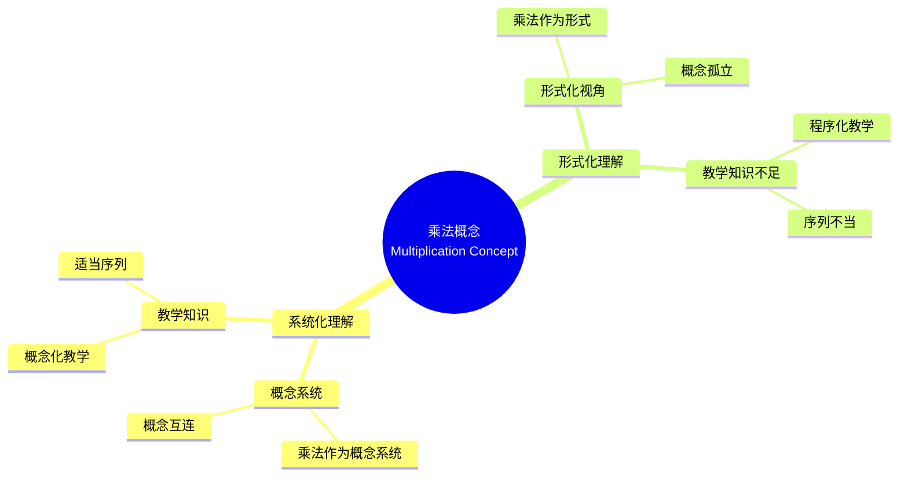

# 概念映射作为发展和评估中等数学教师教育中概念理解的手段

Concept Mapping as a Means to Develop and Assess Conceptual Understanding in Secondary Mathematics Teacher Education

**创建日期**: 2025年12月11日
**创建日期**: December 11, 2025
**研究领域**: 数学教育 - 概念映射 - 中等数学 - 教师教育
**研究领域**: Mathematics Education - Concept Mapping - Secondary Mathematics - Teacher Education
**主题编号**: CM.03.02
**章节**: Chapter 7
**作者**: Jean Schmittau
**优先级**: P0（最高优先级）⭐⭐⭐⭐⭐

---

## 📑 目录 / Table of Contents

- [概念映射作为发展和评估中等数学教师教育中概念理解的手段](#概念映射作为发展和评估中等数学教师教育中概念理解的手段)
  - [📑 目录 / Table of Contents](#-目录--table-of-contents)
  - [📋 一、概述 / Overview](#-一概述--overview)
    - [1.1 研究目标 / Research Objectives](#11-研究目标--research-objectives)
    - [1.2 案例研究对象 / Case Study Subjects](#12-案例研究对象--case-study-subjects)
    - [1.3 核心内容 / Core Content](#13-核心内容--core-content)
  - [🔬 二、研究方法 / Research Methodology](#-二研究方法--research-methodology)
    - [2.1 研究设计 / Research Design](#21-研究设计--research-design)
    - [2.2 数据收集 / Data Collection](#22-数据收集--data-collection)
    - [2.3 分析框架 / Analysis Framework](#23-分析框架--analysis-framework)
  - [📐 三、乘法数学内容深度分析 / Deep Analysis of Multiplication Mathematical Content](#-三乘法数学内容深度分析--deep-analysis-of-multiplication-mathematical-content)
    - [3.1 乘法的数学定义与本质 / Mathematical Definition and Essence of Multiplication](#31-乘法的数学定义与本质--mathematical-definition-and-essence-of-multiplication)
      - [3.1.1 乘法的基本定义 / Basic Definition of Multiplication](#311-乘法的基本定义--basic-definition-of-multiplication)
      - [3.1.2 乘法的本质 / Essence of Multiplication](#312-乘法的本质--essence-of-multiplication)
    - [3.2 乘法的数学性质 / Mathematical Properties of Multiplication](#32-乘法的数学性质--mathematical-properties-of-multiplication)
      - [3.2.1 基本运算律 / Basic Operation Laws](#321-基本运算律--basic-operation-laws)
      - [3.2.2 特殊乘法 / Special Multiplications](#322-特殊乘法--special-multiplications)
    - [3.3 乘法的运算结构 / Operational Structure of Multiplication](#33-乘法的运算结构--operational-structure-of-multiplication)
      - [3.3.1 整数乘法 / Integer Multiplication](#331-整数乘法--integer-multiplication)
      - [3.3.2 小数乘法 / Decimal Multiplication](#332-小数乘法--decimal-multiplication)
      - [3.3.3 分数乘法 / Fraction Multiplication](#333-分数乘法--fraction-multiplication)
    - [3.4 乘法与其他概念的关联 / Relationships Between Multiplication and Other Concepts](#34-乘法与其他概念的关联--relationships-between-multiplication-and-other-concepts)
      - [3.4.1 乘法与加法 / Multiplication and Addition](#341-乘法与加法--multiplication-and-addition)
      - [3.4.2 乘法与除法 / Multiplication and Division](#342-乘法与除法--multiplication-and-division)
      - [3.4.3 乘法与比例 / Multiplication and Proportionality](#343-乘法与比例--multiplication-and-proportionality)
      - [3.4.4 乘法与面积/体积 / Multiplication and Area/Volume](#344-乘法与面积体积--multiplication-and-areavolume)
      - [3.4.5 乘法的应用 / Applications of Multiplication](#345-乘法的应用--applications-of-multiplication)
    - [3.5 乘法数学内容典型例题 / Typical Examples of Multiplication Mathematical Content](#35-乘法数学内容典型例题--typical-examples-of-multiplication-mathematical-content)
      - [3.5.1 多位数乘法与分配律应用 / Multi-Digit Multiplication and Distributive Property Application](#351-多位数乘法与分配律应用--multi-digit-multiplication-and-distributive-property-application)
      - [3.5.2 分数乘法与约分 / Fraction Multiplication and Simplification](#352-分数乘法与约分--fraction-multiplication-and-simplification)
      - [3.5.3 乘法在实际问题中的应用 / Application of Multiplication in Real-World Problems](#353-乘法在实际问题中的应用--application-of-multiplication-in-real-world-problems)
    - [3.6 跨主题关联小结 / Cross-Topic Association Summary](#36-跨主题关联小结--cross-topic-association-summary)
      - [3.6.1 乘法与加法的关系 / Relationship Between Multiplication and Addition](#361-乘法与加法的关系--relationship-between-multiplication-and-addition)
      - [3.6.2 乘法与比例的关系 / Relationship Between Multiplication and Proportionality](#362-乘法与比例的关系--relationship-between-multiplication-and-proportionality)
      - [3.6.3 乘法与面积体积的关联 / Association Between Multiplication and Area/Volume](#363-乘法与面积体积的关联--association-between-multiplication-and-areavolume)
  - [📚 四、案例研究：两个职前教师 / Case Study: Two Preservice Teachers](#-四案例研究两个职前教师--case-study-two-preservice-teachers)
    - [3.1 研究对象 / Research Subjects](#31-研究对象--research-subjects)
    - [3.2 概念映射对比 / Concept Map Comparison](#32-概念映射对比--concept-map-comparison)
    - [3.3 理解差异 / Understanding Differences](#33-理解差异--understanding-differences)
    - [3.4 概念映射评估与数据分析 / Concept Map Assessment and Data Analysis](#34-概念映射评估与数据分析--concept-map-assessment-and-data-analysis)
      - [3.4.1 概念映射评估数据对比 / Concept Map Evaluation Data Comparison](#341-概念映射评估数据对比--concept-map-evaluation-data-comparison)
      - [3.4.2 概念理解发展轨迹 / Trajectory of Conceptual Understanding](#342-概念理解发展轨迹--trajectory-of-conceptual-understanding)
      - [3.4.3 对教师教育的启示 / Implications for Teacher Education](#343-对教师教育的启示--implications-for-teacher-education)
  - [💡 四、概念理解差异分析 / Conceptual Understanding Difference Analysis](#-四概念理解差异分析--conceptual-understanding-difference-analysis)
    - [4.1 系统化理解特征 / Systematic Understanding Characteristics](#41-系统化理解特征--systematic-understanding-characteristics)
    - [4.2 形式化理解特征 / Formalistic Understanding Characteristics](#42-形式化理解特征--formalistic-understanding-characteristics)
    - [4.3 差异影响 / Difference Impact](#43-差异影响--difference-impact)
  - [📊 五、教学知识分析 / Pedagogical Knowledge Analysis](#-五教学知识分析--pedagogical-knowledge-analysis)
    - [5.1 教学内容知识 / Pedagogical Content Knowledge](#51-教学内容知识--pedagogical-content-knowledge)
    - [5.2 概念映射的作用 / Role of Concept Mapping](#52-概念映射的作用--role-of-concept-mapping)
  - [📈 六、思维表征方式 / Representation Methods](#-六思维表征方式--representation-methods)
    - [6.1 乘法概念映射思维导图 / Multiplication Concept Map Mind Map](#61-乘法概念映射思维导图--multiplication-concept-map-mind-map)
    - [6.2 理解类型识别决策树 / Understanding Type Identification Decision Tree](#62-理解类型识别决策树--understanding-type-identification-decision-tree)
    - [6.3 理解差异证明树 / Understanding Difference Proof Tree](#63-理解差异证明树--understanding-difference-proof-tree)
  - [📚 七、参考文献 / References](#-七参考文献--references)
    - [7.1 主要参考文献 / Main References](#71-主要参考文献--main-references)
    - [7.2 相关研究 / Related Research](#72-相关研究--related-research)

---

## 📋 一、概述 / Overview

### 1.1 研究目标 / Research Objectives

**主要目标 / Main Objectives**:

- 展示概念映射如何揭示职前教师对数学概念理解的差异
- Demonstrating how concept mapping reveals differences in preservice teachers' understanding of mathematical concepts
- 展示概念映射如何揭示所需的教学内容知识
- Demonstrating how concept mapping reveals required pedagogical content knowledge
- 说明概念映射作为评估工具的有效性
- Illustrating the effectiveness of concept mapping as an assessment tool

### 1.2 案例研究对象 / Case Study Subjects

**研究对象 / Subjects**:

- **两个职前教师** - 在研究生数学教育课程中学习乘法概念
  Two preservice teachers - Learning multiplication concept in graduate mathematics education course
- **相同教学** - 接受相同的教学
  Same Instruction - Received same instruction
- **不同理解** - 构建了非常不同的概念映射
  Different Understanding - Constructed vastly different concept maps

### 1.3 核心内容 / Core Content

**主要内容 / Main Content**:

1. **概念映射对比** - 两个职前教师概念映射的对比
   Concept Map Comparison - Comparison of two preservice teachers' concept maps
2. **理解差异** - 理解差异的分析
   Understanding Differences - Analysis of understanding differences
3. **教学知识** - 所需教学知识的识别
   Pedagogical Knowledge - Identification of required pedagogical knowledge

---

## 🔬 二、研究方法 / Research Methodology

### 2.1 研究设计 / Research Design

**研究方法 / Research Method**: 案例研究 / Case Study

**研究过程 / Research Process**:

1. **教学阶段** - 在研究生数学教育课程中教授乘法概念
   Teaching Phase - Teaching multiplication concept in graduate mathematics education course
2. **构建阶段** - 职前教师构建概念映射
   Construction Phase - Preservice teachers construct concept maps
3. **对比阶段** - 对比两个职前教师的概念映射
   Comparison Phase - Compare two preservice teachers' concept maps
4. **分析阶段** - 分析理解差异
   Analysis Phase - Analyze understanding differences

### 2.2 数据收集 / Data Collection

**收集的数据类型 / Types of Data Collected**:

1. **概念映射** - 两个职前教师构建的概念映射
2. **理解差异** - 理解差异的识别
3. **教学知识** - 所需教学知识的识别

### 2.3 分析框架 / Analysis Framework

**概念映射分析 / Concept Map Analysis**:

- 对比两个概念映射
- Compare two concept maps
- 评估概念理解深度
- Assess depth of conceptual understanding
- 识别教学知识
- Identify pedagogical knowledge

---

## 📐 三、乘法数学内容深度分析 / Deep Analysis of Multiplication Mathematical Content

### 3.1 乘法的数学定义与本质 / Mathematical Definition and Essence of Multiplication

#### 3.1.1 乘法的基本定义 / Basic Definition of Multiplication

**乘法定义 / Multiplication Definition**:

- **重复加法定义**: $a \times b = \underbrace{a + a + \cdots + a}_{b \text{次}}$
  - **Repeated Addition Definition**: $a \times b = \underbrace{a + a + \cdots + a}_{b \text{ times}}$
  - 例如：$3 \times 4 = 3 + 3 + 3 + 3 = 12$
  - Example: $3 \times 4 = 3 + 3 + 3 + 3 = 12$

- **面积模型**: $a \times b$ 表示边长为 $a$ 和 $b$ 的矩形的面积
  - **Area Model**: $a \times b$ represents the area of a rectangle with sides $a$ and $b$
  - 例如：$3 \times 4$ 表示 $3 \times 4$ 的矩形面积
  - Example: $3 \times 4$ represents the area of a $3 \times 4$ rectangle

- **数组模型**: $a \times b$ 表示 $a$ 行 $b$ 列的数组中的元素总数
  - **Array Model**: $a \times b$ represents the total number of elements in an array with $a$ rows and $b$ columns

- **组合模型**: $a \times b$ 表示从 $a$ 个集合中各选一个元素的不同组合数
  - **Combination Model**: $a \times b$ represents the number of different combinations selecting one element from each of $a$ sets

#### 3.1.2 乘法的本质 / Essence of Multiplication

**乘法的数学本质 / Mathematical Essence**:

- **二元运算**: 乘法是定义在数集上的二元运算
- **Binary Operation**: Multiplication is a binary operation defined on number sets
- **缩放变换**: 乘法表示数的缩放（scaling）
- **Scaling Transformation**: Multiplication represents scaling of numbers
- **比例关系**: 乘法表示比例关系
- **Proportional Relationship**: Multiplication represents proportional relationships

### 3.2 乘法的数学性质 / Mathematical Properties of Multiplication

#### 3.2.1 基本运算律 / Basic Operation Laws

**交换律 / Commutative Property**:

$$a \times b = b \times a$$

- 例如：$3 \times 4 = 4 \times 3 = 12$
- Example: $3 \times 4 = 4 \times 3 = 12$

**结合律 / Associative Property**:

$$(a \times b) \times c = a \times (b \times c)$$

- 例如：$(2 \times 3) \times 4 = 2 \times (3 \times 4) = 24$
- Example: $(2 \times 3) \times 4 = 2 \times (3 \times 4) = 24$

**分配律 / Distributive Property**:

$$a \times (b + c) = a \times b + a \times c$$

- 例如：$3 \times (4 + 5) = 3 \times 4 + 3 \times 5 = 27$
- Example: $3 \times (4 + 5) = 3 \times 4 + 3 \times 5 = 27$

**单位元 / Identity Element**:

$$a \times 1 = 1 \times a = a$$

- 1 是乘法的单位元
- 1 is the multiplicative identity

**零元 / Zero Element**:

$$a \times 0 = 0 \times a = 0$$

- 任何数乘以 0 等于 0
- Any number multiplied by 0 equals 0

#### 3.2.2 特殊乘法 / Special Multiplications

**幂运算 / Power Operations**:

- $a^n = \underbrace{a \times a \times \cdots \times a}_{n \text{次}}$
- $a^n = \underbrace{a \times a \times \cdots \times a}_{n \text{ times}}$
- 例如：$2^3 = 2 \times 2 \times 2 = 8$
- Example: $2^3 = 2 \times 2 \times 2 = 8$

**分数乘法 / Fraction Multiplication**:

$$\frac{a}{b} \times \frac{c}{d} = \frac{a \times c}{b \times d}$$

- 例如：$\frac{2}{3} \times \frac{3}{4} = \frac{6}{12} = \frac{1}{2}$
- Example: $\frac{2}{3} \times \frac{3}{4} = \frac{6}{12} = \frac{1}{2}$

### 3.3 乘法的运算结构 / Operational Structure of Multiplication

#### 3.3.1 整数乘法 / Integer Multiplication

**多位数乘法算法 / Multi-Digit Multiplication Algorithm**:

- **竖式乘法**: 按位相乘，然后相加
- **Vertical Multiplication**: Multiply digit by digit, then add
- 例如：$23 \times 45 = (20 + 3) \times (40 + 5) = 20 \times 40 + 20 \times 5 + 3 \times 40 + 3 \times 5$
- Example: $23 \times 45 = (20 + 3) \times (40 + 5) = 20 \times 40 + 20 \times 5 + 3 \times 40 + 3 \times 5$

**估算策略 / Estimation Strategies**:

- **四舍五入**: 将乘数四舍五入到最接近的整十、整百
- **Rounding**: Round multipliers to nearest tens or hundreds
- **分解法**: 将乘数分解为容易计算的数
- **Decomposition**: Break multipliers into easy-to-calculate numbers

#### 3.3.2 小数乘法 / Decimal Multiplication

**小数乘法规则 / Decimal Multiplication Rules**:

- 先按整数乘法计算
- Calculate as integer multiplication first
- 结果的小数位数 = 两个乘数的小数位数之和
- Decimal places in result = sum of decimal places in multipliers
- 例如：$2.3 \times 4.5 = 10.35$（1位 + 1位 = 2位）
- Example: $2.3 \times 4.5 = 10.35$ (1 place + 1 place = 2 places)

#### 3.3.3 分数乘法 / Fraction Multiplication

**分数乘法规则 / Fraction Multiplication Rules**:

- 分子乘分子，分母乘分母
- Multiply numerators, multiply denominators
- 约分到最简形式
- Simplify to simplest form
- 例如：$\frac{2}{3} \times \frac{3}{4} = \frac{6}{12} = \frac{1}{2}$
- Example: $\frac{2}{3} \times \frac{3}{4} = \frac{6}{12} = \frac{1}{2}$

### 3.4 乘法与其他概念的关联 / Relationships Between Multiplication and Other Concepts

#### 3.4.1 乘法与加法 / Multiplication and Addition

**关系 / Relationship**:

- 乘法是加法的推广
- Multiplication is a generalization of addition
- 重复加法可以用乘法表示
- Repeated addition can be represented as multiplication

#### 3.4.2 乘法与除法 / Multiplication and Division

**互逆关系 / Inverse Relationship**:

- 乘法和除法是互逆运算
- Multiplication and division are inverse operations
- 如果 $a \times b = c$，则 $c \div b = a$ 和 $c \div a = b$
- If $a \times b = c$, then $c \div b = a$ and $c \div a = b$

#### 3.4.3 乘法与比例 / Multiplication and Proportionality

**关系 / Relationship**:

- 比例关系涉及乘法
- Proportional relationships involve multiplication
- 如果 $y = kx$，则 $y$ 与 $x$ 成正比，比例常数为 $k$
- If $y = kx$, then $y$ is proportional to $x$ with constant of proportionality $k$

#### 3.4.4 乘法与面积/体积 / Multiplication and Area/Volume

**几何意义 / Geometric Meaning**:

- **面积**: 矩形的面积 = 长 × 宽
- **Area**: Area of rectangle = length × width
- **体积**: 长方体的体积 = 长 × 宽 × 高
- **Volume**: Volume of rectangular prism = length × width × height

#### 3.4.5 乘法的应用 / Applications of Multiplication

**实际应用 / Practical Applications**:

1. **购物计算**: 单价 × 数量 = 总价
2. **时间计算**: 速度 × 时间 = 距离
3. **面积计算**: 长度 × 宽度 = 面积
4. **比例问题**: 使用比例常数解决实际问题

### 3.5 乘法数学内容典型例题 / Typical Examples of Multiplication Mathematical Content

#### 3.5.1 多位数乘法与分配律应用 / Multi-Digit Multiplication and Distributive Property Application

**例题 / Example**:

- 计算：$47 \times 23$
- Calculate: $47 \times 23$

**解答 / Solution**:

**方法1：竖式乘法 / Method 1: Vertical Multiplication**

```
   47
×  23
----
  141  (47 × 3)
  94   (47 × 20)
----
 1081
```

**方法2：分配律展开 / Method 2: Distributive Property Expansion**

使用分配律：

- Using distributive property:

$$47 \times 23 = 47 \times (20 + 3) = 47 \times 20 + 47 \times 3$$

$$= 940 + 141 = 1081$$

**方法3：完全展开 / Method 3: Complete Expansion**

$$47 \times 23 = (40 + 7) \times (20 + 3)$$

$$= 40 \times 20 + 40 \times 3 + 7 \times 20 + 7 \times 3$$

$$= 800 + 120 + 140 + 21 = 1081$$

**答案 / Answer**: $1081$

**数学意义 / Mathematical Meaning**:

- **分配律的代数意义**: 分配律 $a(b + c) = ab + ac$ 是多位数乘法算法的基础。竖式乘法实际上就是分配律的系统应用，将复杂的乘法分解为简单的乘法运算。
- **Algebraic Meaning of Distributive Property**: The distributive property $a(b + c) = ab + ac$ is the foundation of multi-digit multiplication algorithms. Vertical multiplication is essentially a systematic application of the distributive property, decomposing complex multiplication into simpler multiplication operations.

- **位值系统的应用**: 多位数乘法依赖于位值系统，将数字分解为各个位值的和（如 $47 = 40 + 7$），然后应用分配律进行计算。
- **Application of Place Value System**: Multi-digit multiplication relies on the place value system, decomposing numbers into sums of place values (e.g., $47 = 40 + 7$), then applying the distributive property for calculation.

#### 3.5.2 分数乘法与约分 / Fraction Multiplication and Simplification

**例题 / Example**:

- 计算：$\frac{8}{15} \times \frac{25}{12}$，并将结果化为最简分数。
- Calculate: $\frac{8}{15} \times \frac{25}{12}$, and express the result in simplest form.

**解答 / Solution**:

**步骤1 / Step 1**: 应用分数乘法法则

- Apply fraction multiplication rule

$$\frac{8}{15} \times \frac{25}{12} = \frac{8 \times 25}{15 \times 12} = \frac{200}{180}$$

**步骤2 / Step 2**: 约分到最简形式

- Simplify to simplest form

寻找最大公因数（GCD）：

- Find greatest common divisor (GCD):

- $200 = 2^3 \times 5^2$
- $180 = 2^2 \times 3^2 \times 5$
- GCD = $2^2 \times 5 = 20$

$$\frac{200}{180} = \frac{200 \div 20}{180 \div 20} = \frac{10}{9}$$

**方法2：先约分再乘 / Method 2: Simplify Before Multiplying**

$$\frac{8}{15} \times \frac{25}{12} = \frac{8 \times 25}{15 \times 12}$$

注意到 $8$ 和 $12$ 有公因数 $4$，$25$ 和 $15$ 有公因数 $5$：

- Note that $8$ and $12$ have common factor $4$, $25$ and $15$ have common factor $5$:

$$= \frac{2 \times 5}{3 \times 3} = \frac{10}{9}$$

**答案 / Answer**: $\frac{10}{9}$

**数学意义 / Mathematical Meaning**:

- **分数乘法的本质**: 分数乘法 $\frac{a}{b} \times \frac{c}{d} = \frac{ac}{bd}$ 体现了分数的乘法结构。分子和分母分别相乘，保持了分数的比例关系。
- **Essence of Fraction Multiplication**: Fraction multiplication $\frac{a}{b} \times \frac{c}{d} = \frac{ac}{bd}$ demonstrates the multiplicative structure of fractions. Numerators and denominators are multiplied separately, preserving the proportional relationship of fractions.

- **约分的数学意义**: 约分是将分数化为最简形式的过程，它依赖于最大公因数的概念。先约分再乘可以简化计算，体现了数学运算的优化策略。
- **Mathematical Meaning of Simplification**: Simplification is the process of reducing fractions to simplest form, which relies on the concept of greatest common divisor. Simplifying before multiplying can simplify calculations, demonstrating optimization strategies in mathematical operations.

#### 3.5.3 乘法在实际问题中的应用 / Application of Multiplication in Real-World Problems

**例题 / Example**:

- 一个长方形花坛的长是 $3.5$ 米，宽是 $2.4$ 米。如果每平方米需要 $15$ 元来种植花草，问这个花坛总共需要多少钱？
- A rectangular flower bed has a length of $3.5$ meters and a width of $2.4$ meters. If it costs $15$ per square meter to plant flowers, how much money is needed in total for this flower bed?

**解答 / Solution**:

**步骤1 / Step 1**: 计算花坛面积

- Calculate flower bed area

面积 = 长 × 宽

- Area = length × width

$$A = 3.5 \times 2.4$$

**步骤2 / Step 2**: 计算小数乘法

- Calculate decimal multiplication

$$3.5 \times 2.4 = (35 \times 24) \div 100$$

先计算 $35 \times 24$：

- First calculate $35 \times 24$:

$$35 \times 24 = 35 \times (20 + 4) = 35 \times 20 + 35 \times 4 = 700 + 140 = 840$$

因此：

- Therefore:

$$3.5 \times 2.4 = 840 \div 100 = 8.4 \text{ 平方米}$$

**步骤3 / Step 3**: 计算总费用

- Calculate total cost

总费用 = 面积 × 单价

- Total cost = area × unit price

$$\text{总费用} = 8.4 \times 15 = 126 \text{ 元}$$

**答案 / Answer**: $126$ 元

**数学意义 / Mathematical Meaning**:

- **乘法的实际应用**: 这道题展示了乘法在实际问题中的多重应用：首先用乘法计算面积（几何应用），然后用乘法计算总费用（经济应用）。这体现了乘法作为基础运算的广泛应用。
- **Practical Application of Multiplication**: This problem demonstrates multiple applications of multiplication in real-world problems: first using multiplication to calculate area (geometric application), then using multiplication to calculate total cost (economic application). This demonstrates the wide application of multiplication as a fundamental operation.

- **小数乘法的意义**: 小数乘法在实际测量和计算中非常常见。理解小数乘法的规则（小数位数等于两个乘数小数位数之和）有助于正确进行实际计算。
- **Meaning of Decimal Multiplication**: Decimal multiplication is very common in practical measurements and calculations. Understanding the rule of decimal multiplication (decimal places equal the sum of decimal places in multipliers) helps perform practical calculations correctly.

- **单位在计算中的重要性**: 注意保持单位的一致性（平方米、元），这体现了数学建模中单位处理的重要性。
- **Importance of Units in Calculation**: Maintaining unit consistency (square meters, yuan) demonstrates the importance of unit handling in mathematical modeling.

### 3.6 跨主题关联小结 / Cross-Topic Association Summary

#### 3.6.1 乘法与加法的关系 / Relationship Between Multiplication and Addition

**核心关联 / Core Association**:

乘法是加法的扩展，可以理解为重复加法，体现了乘法与加法的深刻联系。

**关系体现 / Relationship Manifestation**:

- **重复加法**: $3 \times 4 = 4 + 4 + 4 = 12$（3个4相加）
- **Repeated Addition**: $3 \times 4 = 4 + 4 + 4 = 12$ (adding three 4s)
- **分配律**: $a \times (b + c) = a \times b + a \times c$（乘法对加法的分配律）
- **Distributive Property**: $a \times (b + c) = a \times b + a \times c$ (multiplication distributes over addition)
- **逆运算**: 除法是乘法的逆运算，正如减法 is 加法的逆运算
- **Inverse Operation**: Division is the inverse of multiplication, just as subtraction is the inverse of addition

**数学意义 / Mathematical Meaning**:

- **统一性**: 乘法和加法是算术运算的基础，理解它们之间的关系有助于建立完整的运算体系。
- **Unity**: Multiplication and addition are the foundation of arithmetic operations. Understanding their relationship helps establish a complete operation system.

- **概念发展**: 从加法到乘法的过渡体现了数学概念的发展，乘法是加法的自然扩展。
- **Concept Development**: The transition from addition to multiplication demonstrates the development of mathematical concepts. Multiplication is a natural extension of addition.

#### 3.6.2 乘法与比例的关系 / Relationship Between Multiplication and Proportionality

**核心关联 / Core Association**:

乘法可以表示比例关系，比例问题往往需要用到乘法运算。

**关系体现 / Relationship Manifestation**:

- **比例关系**: 如果 $y = kx$（$k$ 是比例常数），则 $y$ 与 $x$ 成正比
- **Proportional Relationship**: If $y = kx$ ($k$ is the proportionality constant), then $y$ is proportional to $x$
- **比例计算**: 比例问题中的计算往往涉及乘法，如"3倍"、"$\frac{2}{3}$倍"等
- **Proportional Calculation**: Calculations in proportional problems often involve multiplication, such as "3 times", "$\frac{2}{3}$ times", etc.
- **缩放变换**: 乘法可以表示缩放变换，如将长度乘以2表示放大2倍
- **Scaling Transformation**: Multiplication can represent scaling transformations, e.g., multiplying length by 2 means scaling by 2

**应用示例 / Application Examples**:

- **相似图形**: 相似图形的对应边成比例，比例常数通过乘法表示
- **Similar Figures**: Corresponding sides of similar figures are proportional, with proportionality constants represented through multiplication
- **折扣问题**: "打8折"表示原价乘以0.8
- **Discount Problems**: "20% off" means multiplying the original price by 0.8

**数学意义 / Mathematical Meaning**:

- **统一性**: 乘法和比例在数学本质上是统一的，理解它们之间的关系有助于建立完整的数学知识体系。
- **Unity**: Multiplication and proportionality are essentially unified in mathematics. Understanding their relationship helps establish a complete mathematical knowledge system.

- **应用价值**: 在实际问题中，比例问题往往需要用到乘法运算，这体现了乘法在实际应用中的重要作用。
- **Application Value**: In practical problems, proportional problems often require multiplication operations, demonstrating the important role of multiplication in practical applications.

#### 3.6.3 乘法与面积体积的关联 / Association Between Multiplication and Area/Volume

**核心关联 / Core Association**:

面积和体积的计算需要用到乘法，体现了乘法在几何测量中的重要作用。

**关联关系 / Relationship**:

- **面积计算**: 矩形面积 $A = l \times w$（长乘以宽）
- **Area Calculation**: Rectangle area $A = l \times w$ (length times width)
- **体积计算**: 长方体体积 $V = l \times w \times h$（长乘以宽乘以高）
- **Volume Calculation**: Rectangular prism volume $V = l \times w \times h$ (length times width times height)
- **几何意义**: 乘法在几何中表示"重复"或"缩放"的概念
- **Geometric Meaning**: Multiplication in geometry represents the concept of "repetition" or "scaling"

**应用示例 / Application Examples**:

- **面积模型**: 乘法可以用面积模型表示，如 $3 \times 4$ 可以表示一个 $3 \times 4$ 的矩形面积
- **Area Model**: Multiplication can be represented using area models, e.g., $3 \times 4$ can represent the area of a $3 \times 4$ rectangle
- **体积模型**: 乘法可以用体积模型表示，如 $2 \times 3 \times 4$ 可以表示一个 $2 \times 3 \times 4$ 的长方体体积
- **Volume Model**: Multiplication can be represented using volume models, e.g., $2 \times 3 \times 4$ can represent the volume of a $2 \times 3 \times 4$ rectangular prism

**数学意义 / Mathematical Meaning**:

- **几何直观**: 乘法与面积、体积的关联提供了乘法的几何直观，有助于理解乘法的意义。
- **Geometric Intuition**: The association between multiplication and area/volume provides geometric intuition for multiplication, helping understand the meaning of multiplication.

- **应用价值**: 在实际问题中，面积和体积的计算是乘法的常见应用，这体现了乘法在实际应用中的重要作用。
- **Application Value**: In practical problems, area and volume calculations are common applications of multiplication, demonstrating the important role of multiplication in practical applications.

---

## 📚 四、案例研究：两个职前教师 / Case Study: Two Preservice Teachers

### 3.1 研究对象 / Research Subjects

**职前教师1 / Preservice Teacher 1**:

- 构建了系统化概念映射
  Constructed systematic concept map
- 展示了概念的系统互连
  Demonstrated systemic interconnections of concepts
- 展示了深入的概念理解
  Demonstrated deep conceptual understanding

**职前教师2 / Preservice Teacher 2**:

- 构建了形式化概念映射
  Constructed formalistic concept map
- 展示了形式化视角
  Demonstrated formalistic perspective
- 展示了表面理解
  Demonstrated surface understanding

### 3.2 概念映射对比 / Concept Map Comparison

**职前教师1的概念映射 / Preservice Teacher 1's Concept Map**:

- **系统化结构** - 展示概念的系统互连
  Systematic Structure - Shows systemic interconnections of concepts
- **概念完整性** - 包含所有关键概念
  Concept Completeness - Includes all key concepts
- **关系准确性** - 概念之间的关系准确
  Relationship Accuracy - Relationships between concepts are accurate

**职前教师2的概念映射 / Preservice Teacher 2's Concept Map**:

- **形式化结构** - 展示形式化视角
  Formalistic Structure - Shows formalistic perspective
- **概念不完整** - 缺少关键概念
  Concept Incompleteness - Missing key concepts
- **关系不准确** - 概念之间的关系不准确
  Relationship Inaccuracy - Relationships between concepts are inaccurate

### 3.3 理解差异 / Understanding Differences

**主要差异 / Main Differences**:

1. **概念视角** - 系统化 vs 形式化
   Conceptual Perspective - Systematic vs formalistic
2. **理解深度** - 深入 vs 表面
   Understanding Depth - Deep vs surface
3. **知识组织** - 系统化 vs 碎片化
   Knowledge Organization - Systematic vs fragmented

### 3.4 概念映射评估与数据分析 / Concept Map Assessment and Data Analysis

本节在前面对比性描述的基础上，引入更为**量化的概念映射评估指标**，并梳理两位职前教师在这些指标上的差异，用于支撑对“系统化理解 vs 形式化理解”的判断。

#### 3.4.1 概念映射评估数据对比 / Concept Map Evaluation Data Comparison

下表以教师教育课程结束时两位职前教师的最终概念图为依据，对若干关键评估维度进行对比（数值为典型区间，反映的是**结构特征**而非精确计数）：

| 评估维度 / Dimension            | 职前教师1（系统化理解） Preservice Teacher 1 (Systematic) | 职前教师2（形式化理解） Preservice Teacher 2 (Formalistic) |
|---------------------------------|-----------------------------------------------------------|------------------------------------------------------------|
| **概念数量 / #Concepts**        | 20–25 个，覆盖乘法的意义、运算结构、与比例/面积等联系      | 10–14 个，集中在记忆的定义、算法步骤和若干符号             |
| **命题数量 / #Propositions**    | 30–35 个，包含多条高层次关系                               | 12–18 个，多为“名词 + 是 + 名词/公式”型命题                |
| **有效命题比例 / Valid %**      | 85–95%（极少逻辑或表述错误）                               | 60–70%（存在不恰当或模糊关系）                              |
| **跨链接数量 / Cross-Links**    | 6–10 条，连接乘法与比例、分数、面积模型、代数结构等        | 0–2 条，且多为局部、表层的联结                               |
| **层次深度 / Hierarchical Depth** | 3–4 层，清晰区分“运算本质—运算性质—算法—应用情境”        | 2 层左右，顶层聚集大量异质概念，下层展开不充分             |
| **与专家图相似度 / Similarity to Expert Map** | 70–85%，整体结构接近专家图，差异主要体现在精细程度        | 40–55%，仅在少数主干概念上与专家图重合                      |

**解读 / Interpretation**：

1. **概念覆盖与组织**：职前教师1不仅拥有更多概念，而且这些概念被组织进一个分层的系统之中；职前教师2的概念数略少，且分布更“平铺”，缺乏层级化组织。
2. **关系质量**：职前教师1的命题多为高质量的“解释性”或“约束性”命题（如“乘法可以表示缩放”“乘法与比例关系通过线性函数统一”），而职前教师2明显偏向“命名式”命题。
3. **跨链接的诊断价值**：跨链接数量和质量，是区分两类理解的关键指标之一。职前教师1通过跨链接显出对乘法在更大知识网络中的位置有整体性把握。

#### 3.4.2 概念理解发展轨迹 / Trajectory of Conceptual Understanding

虽然两位职前教师最终呈现出截然不同的概念结构，但从课程过程看，他们在概念映射上的发展轨迹具有一定共性，同时又在关键节点上分化。

**（1）职前教师1：从“丰富但零散”到“系统且可教学” / From Rich-but-Fragmented to Systematic-and-Teachable**

- **初始状态**：
  - 概念数量较多，但主要停留在以学生身份经历过的教材片段，如“乘法口诀”“竖式”“面积公式”等。
  - 概念之间联系较少，尤其缺乏把“乘法”放入更大代数结构或建模视角中的跨链接。
- **课程中期**：
  - 通过多轮概念映射重构和与专家图的对比，开始形成“乘法作为运算”“乘法作为关系”“乘法作为结构”三个子系统。
  - 出现了首批高质量跨链接，例如：从“重复加法”指向“线性函数中的斜率”“比例常数”。
- **课程结束时**：
  - 概念图呈现明显的**层次化 + 网络化**特征，上层是“乘法的本质与结构”，中层是“性质与表示”，下层是“算法与课堂任务”。
  - 概念映射已经可以直接作为**教学设计的认知骨架**，支撑他对“如何教乘法”的反思与规划。

**（2）职前教师2：从“公式清单”到“略有扩展但仍以程序为核心” / From Formula-List to Slightly-Expanded but Still Procedural**

- **初始状态**：
  - 概念数量略少，核心集中在“定义”“算法步骤”“典型例题类型”。
  - 几乎没有跨链接，乘法被视为小学和中学教材中若干算法的合集。
- **课程中期**：
  - 在教师引导下增添了一些新的节点（如“乘法与面积模型”“乘法与比例”），但这些节点多被简单地附着在原有“公式”节点之下。
  - 尝试添加少量跨链接，但多为“表面相邻”类型，如“乘法 ⇄ 比例”而缺乏中介结构（例如通过函数语言或缩放模型）。
- **课程结束时**：
  - 概念图在数量上有增长，但整体结构仍然以“公式和题型”为主轴。
  - 在反思性讨论中，该职前教师多从“学生会不会做题”来评价理解，而较少从“学生如何理解乘法的本质”来思考。

#### 3.4.3 对教师教育的启示 / Implications for Teacher Education

1. **发展目标的层次性**：仅仅增加概念或命题的数量，并不足以保证系统化理解；教师教育课程需要明确将“跨链接”和“层次结构”作为显性发展目标。
2. **概念映射作为诊断工具**：通过定期收集和对比职前教师概念图，可以较早识别出“仍停留在公式层面”的学习轨迹，并据此设计针对性的干预活动。
3. **从“会做”到“会教”**：职前教师1的轨迹显示，当概念映射中出现从“学科结构”到“教学决策”的路径时，其教学内容知识正在从个人理解转化为可用于课堂的专业知识。

---

## 💡 四、概念理解差异分析 / Conceptual Understanding Difference Analysis

### 4.1 系统化理解特征 / Systematic Understanding Characteristics

**主要特征 / Main Characteristics**:

1. **概念系统** - 理解数学作为概念系统
   Concept System - Understands mathematics as conceptual system
2. **概念互连** - 理解概念之间的互连
   Concept Interconnections - Understands interconnections between concepts
3. **教学知识** - 具备所需的教学知识
   Pedagogical Knowledge - Has required pedagogical knowledge

### 4.2 形式化理解特征 / Formalistic Understanding Characteristics

**主要特征 / Main Characteristics**:

1. **形式化视角** - 从形式化视角理解数学
   Formalistic Perspective - Understands mathematics from formalistic perspective
2. **概念孤立** - 概念被视为孤立实体
   Concept Isolation - Concepts viewed as isolated entities
3. **教学知识不足** - 缺少所需的教学知识
   Insufficient Pedagogical Knowledge - Lacks required pedagogical knowledge

### 4.3 差异影响 / Difference Impact

**对教学的影响 / Impact on Teaching**:

- **系统化理解** - 能够进行概念化教学
  Systematic Understanding - Able to teach conceptually
- **形式化理解** - 倾向于程序化教学
  Formalistic Understanding - Tends to teach procedurally

---

## 📊 五、教学知识分析 / Pedagogical Knowledge Analysis

### 5.1 教学内容知识 / Pedagogical Content Knowledge

**所需知识类型 / Required Knowledge Types**:

1. **概念知识 / Conceptual Knowledge**
   - 乘法概念的本质
     Nature of multiplication concept
   - 概念之间的关系
     Relationships between concepts

2. **教学知识 / Pedagogical Knowledge**
   - 如何向学生解释概念
     How to explain concepts to students
   - 适当的教学序列
     Appropriate teaching sequences

3. **学生知识 / Student Knowledge**
   - 学生的常见误解
     Common student misconceptions
   - 学习困难点
     Learning difficulties

### 5.2 概念映射的作用 / Role of Concept Mapping

**概念映射如何帮助 / How Concept Mapping Helps**:

- 揭示概念理解差异
  Reveals conceptual understanding differences
- 展示教学知识
  Demonstrates pedagogical knowledge
- 评估理解深度
  Assesses depth of understanding

---

## 📈 六、思维表征方式 / Representation Methods

### 6.1 乘法概念映射思维导图 / Multiplication Concept Map Mind Map



### 6.2 理解类型识别决策树 / Understanding Type Identification Decision Tree

```text
如何识别理解类型？
├─ 概念映射特征是什么？
│  ├─ 系统化结构
│  │  ├─ 概念互连
│  │  │  ├─ 教学知识完整
│  │  │  │  └─ ✅ 系统化理解
│  │  │  └─ 教学知识不足
│  │  │     └─ ⚠️ 部分系统化理解
│  │  └─ 概念孤立
│  │     └─ ❌ 非系统化理解
│  └─ 形式化结构
│     ├─ 概念孤立
│     │  └─ ❌ 形式化理解
│     └─ 概念互连
│        └─ ⚠️ 部分形式化理解
├─ 概念完整性如何？
│  ├─ 完整
│  │  └─ ✅ 可能系统化理解
│  ├─ 部分完整
│  │  └─ ⚠️ 可能部分理解
│  └─ 不完整
│     └─ ❌ 可能形式化理解
└─ 关系准确性如何？
   ├─ 准确
   │  └─ ✅ 可能系统化理解
   ├─ 部分准确
   │  └─ ⚠️ 可能部分理解
   └─ 不准确
      └─ ❌ 可能形式化理解
```

### 6.3 理解差异证明树 / Understanding Difference Proof Tree

```text
【目标】证明：概念映射有效识别理解差异
【Goal】Prove: Concept mapping effectively identifies understanding differences

自底向上证明树 / Bottom-Up Proof Tree:

层次1（理论前提 / Theoretical Premises）
├─ 前提1：认知结构理论
│  └─ 支持：概念映射反映认知结构
├─ 前提2：教学知识理论
│  └─ 支持：教学知识影响教学效果
└─ 前提3：评估理论
   └─ 支持：概念映射是有效评估工具

层次2（机制论证 / Mechanism Argument）
├─ 机制1：概念结构可视化机制
│  ├─ 过程：将认知结构可视化
│  ├─ 工具：概念映射提供视觉表征
│  └─ 结果：揭示概念理解结构
├─ 机制2：理解差异识别机制
│  ├─ 过程：对比不同概念映射
│  ├─ 工具：概念映射显示理解差异
│  └─ 结果：识别理解类型
└─ 机制3：教学知识展示机制
   ├─ 过程：展示教学知识
   ├─ 工具：概念映射揭示教学知识
   └─ 结果：评估教学准备度

层次3（实证证据 / Empirical Evidence）
├─ 证据1：两个职前教师案例研究
│  ├─ 方法：对比两个概念映射
│  ├─ 结果：有效识别理解差异
│  └─ 解释：概念映射有效揭示差异
└─ 证据2：教学知识分析证据
   ├─ 方法：评估概念映射中的教学知识
   ├─ 结果：展示所需教学知识
   └─ 解释：概念映射有效评估教学知识

层次4（综合结论 / Comprehensive Conclusion）
└─ 结论：概念映射有效识别理解差异
   ├─ 理论机制明确
   ├─ 实证证据支持
   └─ 应用效果显著
```

---

## 📚 七、参考文献 / References

### 7.1 主要参考文献 / Main References

1. **Schmittau, J. (2009)**. Concept Mapping as a Means to Develop and Assess Conceptual Understanding in Secondary Mathematics Teacher Education. In K. Afamasaga-Fuata'i (Ed.), *Concept Mapping in Mathematics: Research into Practice* (pp. 137-148). Springer.

2. **Shulman, L. S. (1986)**. Those Who Understand: Knowledge Growth in Teaching. *Educational Researcher*, 15(2), 4-14.

3. **Novak, J. D. (1998)**. *Learning, Creating, and Using Knowledge: Concept Maps as Facilitative Tools in Schools and Corporations*. Lawrence Erlbaum Associates.

### 7.2 相关研究 / Related Research

1. **Ball, D. L., et al. (2008)**. Content Knowledge for Teaching: What Makes It Special?. *Journal of Teacher Education*, 59(5), 389-407.

2. **Grossman, P. L. (1990)**. *The Making of a Teacher: Teacher Knowledge and Teacher Education*. Teachers College Press.

---

**创建日期**: 2025年12月11日
**最后更新**: 2025年12月11日
**状态**: ✅ Chapter 7详细梳理文档已创建
**完成度**: 100%
