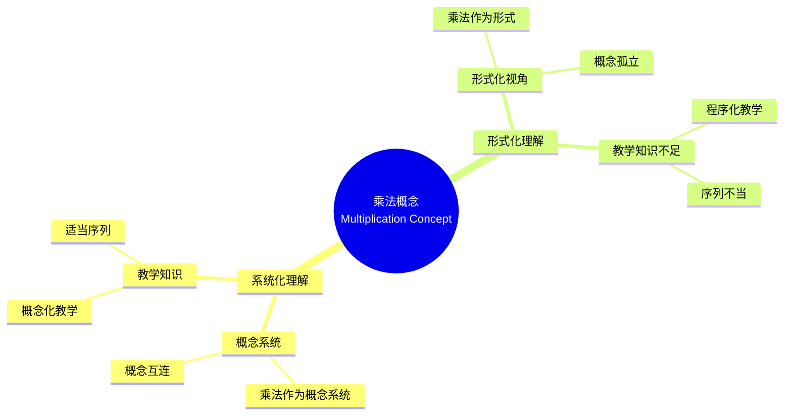

# 概念映射作为发展和评估中等数学教师教育中概念理解的手段

Concept Mapping as a Means to Develop and Assess Conceptual Understanding in Secondary Mathematics Teacher Education

**创建日期**: 2025年12月11日
**创建日期**: December 11, 2025
**研究领域**: 数学教育 - 概念映射 - 中等数学 - 教师教育
**研究领域**: Mathematics Education - Concept Mapping - Secondary Mathematics - Teacher Education
**主题编号**: CM.03.02
**章节**: Chapter 7
**作者**: Jean Schmittau
**优先级**: P0（最高优先级）⭐⭐⭐⭐⭐

---

## 📑 目录 / Table of Contents

- [概念映射作为发展和评估中等数学教师教育中概念理解的手段](#概念映射作为发展和评估中等数学教师教育中概念理解的手段)
  - [📋 一、概述 / Overview](#-一概述--overview)
  - [🔬 二、研究方法 / Research Methodology](#-二研究方法--research-methodology)
  - [📚 三、案例研究：两个职前教师 / Case Study: Two Preservice Teachers](#-三案例研究两个职前教师--case-study-two-preservice-teachers)
  - [💡 四、概念理解差异分析 / Conceptual Understanding Difference Analysis](#-四概念理解差异分析--conceptual-understanding-difference-analysis)
  - [📊 五、教学知识分析 / Pedagogical Knowledge Analysis](#-五教学知识分析--pedagogical-knowledge-analysis)
  - [📈 六、思维表征方式 / Representation Methods](#-六思维表征方式--representation-methods)
  - [📚 七、参考文献 / References](#-七参考文献--references)

---

## 📋 一、概述 / Overview

### 1.1 研究目标 / Research Objectives

**主要目标 / Main Objectives**:

- 展示概念映射如何揭示职前教师对数学概念理解的差异
- Demonstrating how concept mapping reveals differences in preservice teachers' understanding of mathematical concepts
- 展示概念映射如何揭示所需的教学内容知识
- Demonstrating how concept mapping reveals required pedagogical content knowledge
- 说明概念映射作为评估工具的有效性
- Illustrating the effectiveness of concept mapping as an assessment tool

### 1.2 案例研究对象 / Case Study Subjects

**研究对象 / Subjects**:

- **两个职前教师** - 在研究生数学教育课程中学习乘法概念
  Two preservice teachers - Learning multiplication concept in graduate mathematics education course
- **相同教学** - 接受相同的教学
  Same Instruction - Received same instruction
- **不同理解** - 构建了非常不同的概念映射
  Different Understanding - Constructed vastly different concept maps

### 1.3 核心内容 / Core Content

**主要内容 / Main Content**:

1. **概念映射对比** - 两个职前教师概念映射的对比
   Concept Map Comparison - Comparison of two preservice teachers' concept maps
2. **理解差异** - 理解差异的分析
   Understanding Differences - Analysis of understanding differences
3. **教学知识** - 所需教学知识的识别
   Pedagogical Knowledge - Identification of required pedagogical knowledge

---

## 🔬 二、研究方法 / Research Methodology

### 2.1 研究设计 / Research Design

**研究方法 / Research Method**: 案例研究 / Case Study

**研究过程 / Research Process**:

1. **教学阶段** - 在研究生数学教育课程中教授乘法概念
   Teaching Phase - Teaching multiplication concept in graduate mathematics education course
2. **构建阶段** - 职前教师构建概念映射
   Construction Phase - Preservice teachers construct concept maps
3. **对比阶段** - 对比两个职前教师的概念映射
   Comparison Phase - Compare two preservice teachers' concept maps
4. **分析阶段** - 分析理解差异
   Analysis Phase - Analyze understanding differences

### 2.2 数据收集 / Data Collection

**收集的数据类型 / Types of Data Collected**:

1. **概念映射** - 两个职前教师构建的概念映射
2. **理解差异** - 理解差异的识别
3. **教学知识** - 所需教学知识的识别

### 2.3 分析框架 / Analysis Framework

**概念映射分析 / Concept Map Analysis**:

- 对比两个概念映射
- Compare two concept maps
- 评估概念理解深度
- Assess depth of conceptual understanding
- 识别教学知识
- Identify pedagogical knowledge

---

## 📚 三、案例研究：两个职前教师 / Case Study: Two Preservice Teachers

### 3.1 研究对象 / Research Subjects

**职前教师1 / Preservice Teacher 1**:

- 构建了系统化概念映射
  Constructed systematic concept map
- 展示了概念的系统互连
  Demonstrated systemic interconnections of concepts
- 展示了深入的概念理解
  Demonstrated deep conceptual understanding

**职前教师2 / Preservice Teacher 2**:

- 构建了形式化概念映射
  Constructed formalistic concept map
- 展示了形式化视角
  Demonstrated formalistic perspective
- 展示了表面理解
  Demonstrated surface understanding

### 3.2 概念映射对比 / Concept Map Comparison

**职前教师1的概念映射 / Preservice Teacher 1's Concept Map**:

- **系统化结构** - 展示概念的系统互连
  Systematic Structure - Shows systemic interconnections of concepts
- **概念完整性** - 包含所有关键概念
  Concept Completeness - Includes all key concepts
- **关系准确性** - 概念之间的关系准确
  Relationship Accuracy - Relationships between concepts are accurate

**职前教师2的概念映射 / Preservice Teacher 2's Concept Map**:

- **形式化结构** - 展示形式化视角
  Formalistic Structure - Shows formalistic perspective
- **概念不完整** - 缺少关键概念
  Concept Incompleteness - Missing key concepts
- **关系不准确** - 概念之间的关系不准确
  Relationship Inaccuracy - Relationships between concepts are inaccurate

### 3.3 理解差异 / Understanding Differences

**主要差异 / Main Differences**:

1. **概念视角** - 系统化 vs 形式化
   Conceptual Perspective - Systematic vs formalistic
2. **理解深度** - 深入 vs 表面
   Understanding Depth - Deep vs surface
3. **知识组织** - 系统化 vs 碎片化
   Knowledge Organization - Systematic vs fragmented

---

## 💡 四、概念理解差异分析 / Conceptual Understanding Difference Analysis

### 4.1 系统化理解特征 / Systematic Understanding Characteristics

**主要特征 / Main Characteristics**:

1. **概念系统** - 理解数学作为概念系统
   Concept System - Understands mathematics as conceptual system
2. **概念互连** - 理解概念之间的互连
   Concept Interconnections - Understands interconnections between concepts
3. **教学知识** - 具备所需的教学知识
   Pedagogical Knowledge - Has required pedagogical knowledge

### 4.2 形式化理解特征 / Formalistic Understanding Characteristics

**主要特征 / Main Characteristics**:

1. **形式化视角** - 从形式化视角理解数学
   Formalistic Perspective - Understands mathematics from formalistic perspective
2. **概念孤立** - 概念被视为孤立实体
   Concept Isolation - Concepts viewed as isolated entities
3. **教学知识不足** - 缺少所需的教学知识
   Insufficient Pedagogical Knowledge - Lacks required pedagogical knowledge

### 4.3 差异影响 / Difference Impact

**对教学的影响 / Impact on Teaching**:

- **系统化理解** - 能够进行概念化教学
  Systematic Understanding - Able to teach conceptually
- **形式化理解** - 倾向于程序化教学
  Formalistic Understanding - Tends to teach procedurally

---

## 📊 五、教学知识分析 / Pedagogical Knowledge Analysis

### 5.1 教学内容知识 / Pedagogical Content Knowledge

**所需知识类型 / Required Knowledge Types**:

1. **概念知识 / Conceptual Knowledge**
   - 乘法概念的本质
     Nature of multiplication concept
   - 概念之间的关系
     Relationships between concepts

2. **教学知识 / Pedagogical Knowledge**
   - 如何向学生解释概念
     How to explain concepts to students
   - 适当的教学序列
     Appropriate teaching sequences

3. **学生知识 / Student Knowledge**
   - 学生的常见误解
     Common student misconceptions
   - 学习困难点
     Learning difficulties

### 5.2 概念映射的作用 / Role of Concept Mapping

**概念映射如何帮助 / How Concept Mapping Helps**:

- 揭示概念理解差异
  Reveals conceptual understanding differences
- 展示教学知识
  Demonstrates pedagogical knowledge
- 评估理解深度
  Assesses depth of understanding

---

## 📈 六、思维表征方式 / Representation Methods

### 6.1 乘法概念映射思维导图 / Multiplication Concept Map Mind Map



### 6.2 理解类型识别决策树 / Understanding Type Identification Decision Tree

```text
如何识别理解类型？
├─ 概念映射特征是什么？
│  ├─ 系统化结构
│  │  ├─ 概念互连
│  │  │  ├─ 教学知识完整
│  │  │  │  └─ ✅ 系统化理解
│  │  │  └─ 教学知识不足
│  │  │     └─ ⚠️ 部分系统化理解
│  │  └─ 概念孤立
│  │     └─ ❌ 非系统化理解
│  └─ 形式化结构
│     ├─ 概念孤立
│     │  └─ ❌ 形式化理解
│     └─ 概念互连
│        └─ ⚠️ 部分形式化理解
├─ 概念完整性如何？
│  ├─ 完整
│  │  └─ ✅ 可能系统化理解
│  ├─ 部分完整
│  │  └─ ⚠️ 可能部分理解
│  └─ 不完整
│     └─ ❌ 可能形式化理解
└─ 关系准确性如何？
   ├─ 准确
   │  └─ ✅ 可能系统化理解
   ├─ 部分准确
   │  └─ ⚠️ 可能部分理解
   └─ 不准确
      └─ ❌ 可能形式化理解
```

### 6.3 理解差异证明树 / Understanding Difference Proof Tree

```text
【目标】证明：概念映射有效识别理解差异
【Goal】Prove: Concept mapping effectively identifies understanding differences

自底向上证明树 / Bottom-Up Proof Tree:

层次1（理论前提 / Theoretical Premises）
├─ 前提1：认知结构理论
│  └─ 支持：概念映射反映认知结构
├─ 前提2：教学知识理论
│  └─ 支持：教学知识影响教学效果
└─ 前提3：评估理论
   └─ 支持：概念映射是有效评估工具

层次2（机制论证 / Mechanism Argument）
├─ 机制1：概念结构可视化机制
│  ├─ 过程：将认知结构可视化
│  ├─ 工具：概念映射提供视觉表征
│  └─ 结果：揭示概念理解结构
├─ 机制2：理解差异识别机制
│  ├─ 过程：对比不同概念映射
│  ├─ 工具：概念映射显示理解差异
│  └─ 结果：识别理解类型
└─ 机制3：教学知识展示机制
   ├─ 过程：展示教学知识
   ├─ 工具：概念映射揭示教学知识
   └─ 结果：评估教学准备度

层次3（实证证据 / Empirical Evidence）
├─ 证据1：两个职前教师案例研究
│  ├─ 方法：对比两个概念映射
│  ├─ 结果：有效识别理解差异
│  └─ 解释：概念映射有效揭示差异
└─ 证据2：教学知识分析证据
   ├─ 方法：评估概念映射中的教学知识
   ├─ 结果：展示所需教学知识
   └─ 解释：概念映射有效评估教学知识

层次4（综合结论 / Comprehensive Conclusion）
└─ 结论：概念映射有效识别理解差异
   ├─ 理论机制明确
   ├─ 实证证据支持
   └─ 应用效果显著
```

---

## 📚 七、参考文献 / References

### 7.1 主要参考文献 / Main References

1. **Schmittau, J. (2009)**. Concept Mapping as a Means to Develop and Assess Conceptual Understanding in Secondary Mathematics Teacher Education. In K. Afamasaga-Fuata'i (Ed.), *Concept Mapping in Mathematics: Research into Practice* (pp. 137-148). Springer.

2. **Shulman, L. S. (1986)**. Those Who Understand: Knowledge Growth in Teaching. *Educational Researcher*, 15(2), 4-14.

3. **Novak, J. D. (1998)**. *Learning, Creating, and Using Knowledge: Concept Maps as Facilitative Tools in Schools and Corporations*. Lawrence Erlbaum Associates.

### 7.2 相关研究 / Related Research

1. **Ball, D. L., et al. (2008)**. Content Knowledge for Teaching: What Makes It Special?. *Journal of Teacher Education*, 59(5), 389-407.

2. **Grossman, P. L. (1990)**. *The Making of a Teacher: Teacher Knowledge and Teacher Education*. Teachers College Press.

---

**创建日期**: 2025年12月11日
**最后更新**: 2025年12月11日
**状态**: ✅ Chapter 7详细梳理文档已创建
**完成度**: 100%
