# 概念映射作为发展和评估中等数学教师教育中概念理解的手段

Concept Mapping as a Means to Develop and Assess Conceptual Understanding in Secondary Mathematics Teacher Education

**创建日期**: 2025年12月11日
**创建日期**: December 11, 2025
**研究领域**: 数学教育 - 概念映射 - 中等数学 - 教师教育
**研究领域**: Mathematics Education - Concept Mapping - Secondary Mathematics - Teacher Education
**主题编号**: CM.03.02
**章节**: Chapter 7
**作者**: Jean Schmittau
**优先级**: P0（最高优先级）⭐⭐⭐⭐⭐

---

## 📑 目录 / Table of Contents

- [概念映射作为发展和评估中等数学教师教育中概念理解的手段](#概念映射作为发展和评估中等数学教师教育中概念理解的手段)
  - [📑 目录 / Table of Contents](#-目录--table-of-contents)
  - [📋 一、概述 / Overview](#-一概述--overview)
    - [1.1 研究目标 / Research Objectives](#11-研究目标--research-objectives)
    - [1.2 案例研究对象 / Case Study Subjects](#12-案例研究对象--case-study-subjects)
    - [1.3 核心内容 / Core Content](#13-核心内容--core-content)
  - [🔬 二、研究方法 / Research Methodology](#-二研究方法--research-methodology)
    - [2.1 研究设计 / Research Design](#21-研究设计--research-design)
    - [2.2 数据收集 / Data Collection](#22-数据收集--data-collection)
    - [2.3 分析框架 / Analysis Framework](#23-分析框架--analysis-framework)
  - [📐 三、乘法数学内容深度分析 / Deep Analysis of Multiplication Mathematical Content](#-三乘法数学内容深度分析--deep-analysis-of-multiplication-mathematical-content)
    - [3.1 乘法的数学定义与本质 / Mathematical Definition and Essence of Multiplication](#31-乘法的数学定义与本质--mathematical-definition-and-essence-of-multiplication)
      - [3.1.1 乘法的基本定义 / Basic Definition of Multiplication](#311-乘法的基本定义--basic-definition-of-multiplication)
      - [3.1.2 乘法的本质 / Essence of Multiplication](#312-乘法的本质--essence-of-multiplication)
    - [3.2 乘法的数学性质 / Mathematical Properties of Multiplication](#32-乘法的数学性质--mathematical-properties-of-multiplication)
      - [3.2.1 基本运算律 / Basic Operation Laws](#321-基本运算律--basic-operation-laws)
      - [3.2.2 特殊乘法 / Special Multiplications](#322-特殊乘法--special-multiplications)
    - [3.3 乘法的运算结构 / Operational Structure of Multiplication](#33-乘法的运算结构--operational-structure-of-multiplication)
      - [3.3.1 整数乘法 / Integer Multiplication](#331-整数乘法--integer-multiplication)
      - [3.3.2 小数乘法 / Decimal Multiplication](#332-小数乘法--decimal-multiplication)
      - [3.3.3 分数乘法 / Fraction Multiplication](#333-分数乘法--fraction-multiplication)
    - [3.4 乘法与其他概念的关联 / Relationships Between Multiplication and Other Concepts](#34-乘法与其他概念的关联--relationships-between-multiplication-and-other-concepts)
      - [3.4.1 乘法与加法 / Multiplication and Addition](#341-乘法与加法--multiplication-and-addition)
      - [3.4.2 乘法与除法 / Multiplication and Division](#342-乘法与除法--multiplication-and-division)
      - [3.4.3 乘法与比例 / Multiplication and Proportionality](#343-乘法与比例--multiplication-and-proportionality)
      - [3.4.4 乘法与面积/体积 / Multiplication and Area/Volume](#344-乘法与面积体积--multiplication-and-areavolume)
      - [3.4.5 乘法的应用 / Applications of Multiplication](#345-乘法的应用--applications-of-multiplication)
    - [3.5 乘法数学内容典型例题 / Typical Examples of Multiplication Mathematical Content](#35-乘法数学内容典型例题--typical-examples-of-multiplication-mathematical-content)
      - [3.5.1 多位数乘法与分配律应用 / Multi-Digit Multiplication and Distributive Property Application](#351-多位数乘法与分配律应用--multi-digit-multiplication-and-distributive-property-application)
      - [3.5.2 分数乘法与约分 / Fraction Multiplication and Simplification](#352-分数乘法与约分--fraction-multiplication-and-simplification)
      - [3.5.3 乘法在实际问题中的应用 / Application of Multiplication in Real-World Problems](#353-乘法在实际问题中的应用--application-of-multiplication-in-real-world-problems)
  - [📚 四、案例研究：两个职前教师 / Case Study: Two Preservice Teachers](#-四案例研究两个职前教师--case-study-two-preservice-teachers)
    - [3.1 研究对象 / Research Subjects](#31-研究对象--research-subjects)
    - [3.2 概念映射对比 / Concept Map Comparison](#32-概念映射对比--concept-map-comparison)
    - [3.3 理解差异 / Understanding Differences](#33-理解差异--understanding-differences)
  - [💡 四、概念理解差异分析 / Conceptual Understanding Difference Analysis](#-四概念理解差异分析--conceptual-understanding-difference-analysis)
    - [4.1 系统化理解特征 / Systematic Understanding Characteristics](#41-系统化理解特征--systematic-understanding-characteristics)
    - [4.2 形式化理解特征 / Formalistic Understanding Characteristics](#42-形式化理解特征--formalistic-understanding-characteristics)
    - [4.3 差异影响 / Difference Impact](#43-差异影响--difference-impact)
  - [📊 五、教学知识分析 / Pedagogical Knowledge Analysis](#-五教学知识分析--pedagogical-knowledge-analysis)
    - [5.1 教学内容知识 / Pedagogical Content Knowledge](#51-教学内容知识--pedagogical-content-knowledge)
    - [5.2 概念映射的作用 / Role of Concept Mapping](#52-概念映射的作用--role-of-concept-mapping)
  - [📈 六、思维表征方式 / Representation Methods](#-六思维表征方式--representation-methods)
    - [6.1 乘法概念映射思维导图 / Multiplication Concept Map Mind Map](#61-乘法概念映射思维导图--multiplication-concept-map-mind-map)
    - [6.2 理解类型识别决策树 / Understanding Type Identification Decision Tree](#62-理解类型识别决策树--understanding-type-identification-decision-tree)
    - [6.3 理解差异证明树 / Understanding Difference Proof Tree](#63-理解差异证明树--understanding-difference-proof-tree)
  - [📚 七、参考文献 / References](#-七参考文献--references)
    - [7.1 主要参考文献 / Main References](#71-主要参考文献--main-references)
    - [7.2 相关研究 / Related Research](#72-相关研究--related-research)

---

## 📋 一、概述 / Overview

### 1.1 研究目标 / Research Objectives

**主要目标 / Main Objectives**:

- 展示概念映射如何揭示职前教师对数学概念理解的差异
- Demonstrating how concept mapping reveals differences in preservice teachers' understanding of mathematical concepts
- 展示概念映射如何揭示所需的教学内容知识
- Demonstrating how concept mapping reveals required pedagogical content knowledge
- 说明概念映射作为评估工具的有效性
- Illustrating the effectiveness of concept mapping as an assessment tool

### 1.2 案例研究对象 / Case Study Subjects

**研究对象 / Subjects**:

- **两个职前教师** - 在研究生数学教育课程中学习乘法概念
  Two preservice teachers - Learning multiplication concept in graduate mathematics education course
- **相同教学** - 接受相同的教学
  Same Instruction - Received same instruction
- **不同理解** - 构建了非常不同的概念映射
  Different Understanding - Constructed vastly different concept maps

### 1.3 核心内容 / Core Content

**主要内容 / Main Content**:

1. **概念映射对比** - 两个职前教师概念映射的对比
   Concept Map Comparison - Comparison of two preservice teachers' concept maps
2. **理解差异** - 理解差异的分析
   Understanding Differences - Analysis of understanding differences
3. **教学知识** - 所需教学知识的识别
   Pedagogical Knowledge - Identification of required pedagogical knowledge

---

## 🔬 二、研究方法 / Research Methodology

### 2.1 研究设计 / Research Design

**研究方法 / Research Method**: 案例研究 / Case Study

**研究过程 / Research Process**:

1. **教学阶段** - 在研究生数学教育课程中教授乘法概念
   Teaching Phase - Teaching multiplication concept in graduate mathematics education course
2. **构建阶段** - 职前教师构建概念映射
   Construction Phase - Preservice teachers construct concept maps
3. **对比阶段** - 对比两个职前教师的概念映射
   Comparison Phase - Compare two preservice teachers' concept maps
4. **分析阶段** - 分析理解差异
   Analysis Phase - Analyze understanding differences

### 2.2 数据收集 / Data Collection

**收集的数据类型 / Types of Data Collected**:

1. **概念映射** - 两个职前教师构建的概念映射
2. **理解差异** - 理解差异的识别
3. **教学知识** - 所需教学知识的识别

### 2.3 分析框架 / Analysis Framework

**概念映射分析 / Concept Map Analysis**:

- 对比两个概念映射
- Compare two concept maps
- 评估概念理解深度
- Assess depth of conceptual understanding
- 识别教学知识
- Identify pedagogical knowledge

---

## 📐 三、乘法数学内容深度分析 / Deep Analysis of Multiplication Mathematical Content

### 3.1 乘法的数学定义与本质 / Mathematical Definition and Essence of Multiplication

#### 3.1.1 乘法的基本定义 / Basic Definition of Multiplication

**乘法定义 / Multiplication Definition**:

- **重复加法定义**: $a \times b = \underbrace{a + a + \cdots + a}_{b \text{次}}$
  - **Repeated Addition Definition**: $a \times b = \underbrace{a + a + \cdots + a}_{b \text{ times}}$
  - 例如：$3 \times 4 = 3 + 3 + 3 + 3 = 12$
  - Example: $3 \times 4 = 3 + 3 + 3 + 3 = 12$

- **面积模型**: $a \times b$ 表示边长为 $a$ 和 $b$ 的矩形的面积
  - **Area Model**: $a \times b$ represents the area of a rectangle with sides $a$ and $b$
  - 例如：$3 \times 4$ 表示 $3 \times 4$ 的矩形面积
  - Example: $3 \times 4$ represents the area of a $3 \times 4$ rectangle

- **数组模型**: $a \times b$ 表示 $a$ 行 $b$ 列的数组中的元素总数
  - **Array Model**: $a \times b$ represents the total number of elements in an array with $a$ rows and $b$ columns

- **组合模型**: $a \times b$ 表示从 $a$ 个集合中各选一个元素的不同组合数
  - **Combination Model**: $a \times b$ represents the number of different combinations selecting one element from each of $a$ sets

#### 3.1.2 乘法的本质 / Essence of Multiplication

**乘法的数学本质 / Mathematical Essence**:

- **二元运算**: 乘法是定义在数集上的二元运算
- **Binary Operation**: Multiplication is a binary operation defined on number sets
- **缩放变换**: 乘法表示数的缩放（scaling）
- **Scaling Transformation**: Multiplication represents scaling of numbers
- **比例关系**: 乘法表示比例关系
- **Proportional Relationship**: Multiplication represents proportional relationships

### 3.2 乘法的数学性质 / Mathematical Properties of Multiplication

#### 3.2.1 基本运算律 / Basic Operation Laws

**交换律 / Commutative Property**:

$$a \times b = b \times a$$

- 例如：$3 \times 4 = 4 \times 3 = 12$
- Example: $3 \times 4 = 4 \times 3 = 12$

**结合律 / Associative Property**:

$$(a \times b) \times c = a \times (b \times c)$$

- 例如：$(2 \times 3) \times 4 = 2 \times (3 \times 4) = 24$
- Example: $(2 \times 3) \times 4 = 2 \times (3 \times 4) = 24$

**分配律 / Distributive Property**:

$$a \times (b + c) = a \times b + a \times c$$

- 例如：$3 \times (4 + 5) = 3 \times 4 + 3 \times 5 = 27$
- Example: $3 \times (4 + 5) = 3 \times 4 + 3 \times 5 = 27$

**单位元 / Identity Element**:

$$a \times 1 = 1 \times a = a$$

- 1 是乘法的单位元
- 1 is the multiplicative identity

**零元 / Zero Element**:

$$a \times 0 = 0 \times a = 0$$

- 任何数乘以 0 等于 0
- Any number multiplied by 0 equals 0

#### 3.2.2 特殊乘法 / Special Multiplications

**幂运算 / Power Operations**:

- $a^n = \underbrace{a \times a \times \cdots \times a}_{n \text{次}}$
- $a^n = \underbrace{a \times a \times \cdots \times a}_{n \text{ times}}$
- 例如：$2^3 = 2 \times 2 \times 2 = 8$
- Example: $2^3 = 2 \times 2 \times 2 = 8$

**分数乘法 / Fraction Multiplication**:

$$\frac{a}{b} \times \frac{c}{d} = \frac{a \times c}{b \times d}$$

- 例如：$\frac{2}{3} \times \frac{3}{4} = \frac{6}{12} = \frac{1}{2}$
- Example: $\frac{2}{3} \times \frac{3}{4} = \frac{6}{12} = \frac{1}{2}$

### 3.3 乘法的运算结构 / Operational Structure of Multiplication

#### 3.3.1 整数乘法 / Integer Multiplication

**多位数乘法算法 / Multi-Digit Multiplication Algorithm**:

- **竖式乘法**: 按位相乘，然后相加
- **Vertical Multiplication**: Multiply digit by digit, then add
- 例如：$23 \times 45 = (20 + 3) \times (40 + 5) = 20 \times 40 + 20 \times 5 + 3 \times 40 + 3 \times 5$
- Example: $23 \times 45 = (20 + 3) \times (40 + 5) = 20 \times 40 + 20 \times 5 + 3 \times 40 + 3 \times 5$

**估算策略 / Estimation Strategies**:

- **四舍五入**: 将乘数四舍五入到最接近的整十、整百
- **Rounding**: Round multipliers to nearest tens or hundreds
- **分解法**: 将乘数分解为容易计算的数
- **Decomposition**: Break multipliers into easy-to-calculate numbers

#### 3.3.2 小数乘法 / Decimal Multiplication

**小数乘法规则 / Decimal Multiplication Rules**:

- 先按整数乘法计算
- Calculate as integer multiplication first
- 结果的小数位数 = 两个乘数的小数位数之和
- Decimal places in result = sum of decimal places in multipliers
- 例如：$2.3 \times 4.5 = 10.35$（1位 + 1位 = 2位）
- Example: $2.3 \times 4.5 = 10.35$ (1 place + 1 place = 2 places)

#### 3.3.3 分数乘法 / Fraction Multiplication

**分数乘法规则 / Fraction Multiplication Rules**:

- 分子乘分子，分母乘分母
- Multiply numerators, multiply denominators
- 约分到最简形式
- Simplify to simplest form
- 例如：$\frac{2}{3} \times \frac{3}{4} = \frac{6}{12} = \frac{1}{2}$
- Example: $\frac{2}{3} \times \frac{3}{4} = \frac{6}{12} = \frac{1}{2}$

### 3.4 乘法与其他概念的关联 / Relationships Between Multiplication and Other Concepts

#### 3.4.1 乘法与加法 / Multiplication and Addition

**关系 / Relationship**:

- 乘法是加法的推广
- Multiplication is a generalization of addition
- 重复加法可以用乘法表示
- Repeated addition can be represented as multiplication

#### 3.4.2 乘法与除法 / Multiplication and Division

**互逆关系 / Inverse Relationship**:

- 乘法和除法是互逆运算
- Multiplication and division are inverse operations
- 如果 $a \times b = c$，则 $c \div b = a$ 和 $c \div a = b$
- If $a \times b = c$, then $c \div b = a$ and $c \div a = b$

#### 3.4.3 乘法与比例 / Multiplication and Proportionality

**关系 / Relationship**:

- 比例关系涉及乘法
- Proportional relationships involve multiplication
- 如果 $y = kx$，则 $y$ 与 $x$ 成正比，比例常数为 $k$
- If $y = kx$, then $y$ is proportional to $x$ with constant of proportionality $k$

#### 3.4.4 乘法与面积/体积 / Multiplication and Area/Volume

**几何意义 / Geometric Meaning**:

- **面积**: 矩形的面积 = 长 × 宽
- **Area**: Area of rectangle = length × width
- **体积**: 长方体的体积 = 长 × 宽 × 高
- **Volume**: Volume of rectangular prism = length × width × height

#### 3.4.5 乘法的应用 / Applications of Multiplication

**实际应用 / Practical Applications**:

1. **购物计算**: 单价 × 数量 = 总价
2. **时间计算**: 速度 × 时间 = 距离
3. **面积计算**: 长度 × 宽度 = 面积
4. **比例问题**: 使用比例常数解决实际问题

### 3.5 乘法数学内容典型例题 / Typical Examples of Multiplication Mathematical Content

#### 3.5.1 多位数乘法与分配律应用 / Multi-Digit Multiplication and Distributive Property Application

**例题 / Example**:

- 计算：$47 \times 23$
- Calculate: $47 \times 23$

**解答 / Solution**:

**方法1：竖式乘法 / Method 1: Vertical Multiplication**

```
   47
×  23
----
  141  (47 × 3)
  94   (47 × 20)
----
 1081
```

**方法2：分配律展开 / Method 2: Distributive Property Expansion**

使用分配律：

- Using distributive property:

$$47 \times 23 = 47 \times (20 + 3) = 47 \times 20 + 47 \times 3$$

$$= 940 + 141 = 1081$$

**方法3：完全展开 / Method 3: Complete Expansion**

$$47 \times 23 = (40 + 7) \times (20 + 3)$$

$$= 40 \times 20 + 40 \times 3 + 7 \times 20 + 7 \times 3$$

$$= 800 + 120 + 140 + 21 = 1081$$

**答案 / Answer**: $1081$

**数学意义 / Mathematical Meaning**:

- **分配律的代数意义**: 分配律 $a(b + c) = ab + ac$ 是多位数乘法算法的基础。竖式乘法实际上就是分配律的系统应用，将复杂的乘法分解为简单的乘法运算。
- **Algebraic Meaning of Distributive Property**: The distributive property $a(b + c) = ab + ac$ is the foundation of multi-digit multiplication algorithms. Vertical multiplication is essentially a systematic application of the distributive property, decomposing complex multiplication into simpler multiplication operations.

- **位值系统的应用**: 多位数乘法依赖于位值系统，将数字分解为各个位值的和（如 $47 = 40 + 7$），然后应用分配律进行计算。
- **Application of Place Value System**: Multi-digit multiplication relies on the place value system, decomposing numbers into sums of place values (e.g., $47 = 40 + 7$), then applying the distributive property for calculation.

#### 3.5.2 分数乘法与约分 / Fraction Multiplication and Simplification

**例题 / Example**:

- 计算：$\frac{8}{15} \times \frac{25}{12}$，并将结果化为最简分数。
- Calculate: $\frac{8}{15} \times \frac{25}{12}$, and express the result in simplest form.

**解答 / Solution**:

**步骤1 / Step 1**: 应用分数乘法法则

- Apply fraction multiplication rule

$$\frac{8}{15} \times \frac{25}{12} = \frac{8 \times 25}{15 \times 12} = \frac{200}{180}$$

**步骤2 / Step 2**: 约分到最简形式

- Simplify to simplest form

寻找最大公因数（GCD）：

- Find greatest common divisor (GCD):

- $200 = 2^3 \times 5^2$
- $180 = 2^2 \times 3^2 \times 5$
- GCD = $2^2 \times 5 = 20$

$$\frac{200}{180} = \frac{200 \div 20}{180 \div 20} = \frac{10}{9}$$

**方法2：先约分再乘 / Method 2: Simplify Before Multiplying**

$$\frac{8}{15} \times \frac{25}{12} = \frac{8 \times 25}{15 \times 12}$$

注意到 $8$ 和 $12$ 有公因数 $4$，$25$ 和 $15$ 有公因数 $5$：

- Note that $8$ and $12$ have common factor $4$, $25$ and $15$ have common factor $5$:

$$= \frac{2 \times 5}{3 \times 3} = \frac{10}{9}$$

**答案 / Answer**: $\frac{10}{9}$

**数学意义 / Mathematical Meaning**:

- **分数乘法的本质**: 分数乘法 $\frac{a}{b} \times \frac{c}{d} = \frac{ac}{bd}$ 体现了分数的乘法结构。分子和分母分别相乘，保持了分数的比例关系。
- **Essence of Fraction Multiplication**: Fraction multiplication $\frac{a}{b} \times \frac{c}{d} = \frac{ac}{bd}$ demonstrates the multiplicative structure of fractions. Numerators and denominators are multiplied separately, preserving the proportional relationship of fractions.

- **约分的数学意义**: 约分是将分数化为最简形式的过程，它依赖于最大公因数的概念。先约分再乘可以简化计算，体现了数学运算的优化策略。
- **Mathematical Meaning of Simplification**: Simplification is the process of reducing fractions to simplest form, which relies on the concept of greatest common divisor. Simplifying before multiplying can simplify calculations, demonstrating optimization strategies in mathematical operations.

#### 3.5.3 乘法在实际问题中的应用 / Application of Multiplication in Real-World Problems

**例题 / Example**:

- 一个长方形花坛的长是 $3.5$ 米，宽是 $2.4$ 米。如果每平方米需要 $15$ 元来种植花草，问这个花坛总共需要多少钱？
- A rectangular flower bed has a length of $3.5$ meters and a width of $2.4$ meters. If it costs $15$ per square meter to plant flowers, how much money is needed in total for this flower bed?

**解答 / Solution**:

**步骤1 / Step 1**: 计算花坛面积

- Calculate flower bed area

面积 = 长 × 宽

- Area = length × width

$$A = 3.5 \times 2.4$$

**步骤2 / Step 2**: 计算小数乘法

- Calculate decimal multiplication

$$3.5 \times 2.4 = (35 \times 24) \div 100$$

先计算 $35 \times 24$：

- First calculate $35 \times 24$:

$$35 \times 24 = 35 \times (20 + 4) = 35 \times 20 + 35 \times 4 = 700 + 140 = 840$$

因此：

- Therefore:

$$3.5 \times 2.4 = 840 \div 100 = 8.4 \text{ 平方米}$$

**步骤3 / Step 3**: 计算总费用

- Calculate total cost

总费用 = 面积 × 单价

- Total cost = area × unit price

$$\text{总费用} = 8.4 \times 15 = 126 \text{ 元}$$

**答案 / Answer**: $126$ 元

**数学意义 / Mathematical Meaning**:

- **乘法的实际应用**: 这道题展示了乘法在实际问题中的多重应用：首先用乘法计算面积（几何应用），然后用乘法计算总费用（经济应用）。这体现了乘法作为基础运算的广泛应用。
- **Practical Application of Multiplication**: This problem demonstrates multiple applications of multiplication in real-world problems: first using multiplication to calculate area (geometric application), then using multiplication to calculate total cost (economic application). This demonstrates the wide application of multiplication as a fundamental operation.

- **小数乘法的意义**: 小数乘法在实际测量和计算中非常常见。理解小数乘法的规则（小数位数等于两个乘数小数位数之和）有助于正确进行实际计算。
- **Meaning of Decimal Multiplication**: Decimal multiplication is very common in practical measurements and calculations. Understanding the rule of decimal multiplication (decimal places equal the sum of decimal places in multipliers) helps perform practical calculations correctly.

- **单位在计算中的重要性**: 注意保持单位的一致性（平方米、元），这体现了数学建模中单位处理的重要性。
- **Importance of Units in Calculation**: Maintaining unit consistency (square meters, yuan) demonstrates the importance of unit handling in mathematical modeling.

---

## 📚 四、案例研究：两个职前教师 / Case Study: Two Preservice Teachers

### 3.1 研究对象 / Research Subjects

**职前教师1 / Preservice Teacher 1**:

- 构建了系统化概念映射
  Constructed systematic concept map
- 展示了概念的系统互连
  Demonstrated systemic interconnections of concepts
- 展示了深入的概念理解
  Demonstrated deep conceptual understanding

**职前教师2 / Preservice Teacher 2**:

- 构建了形式化概念映射
  Constructed formalistic concept map
- 展示了形式化视角
  Demonstrated formalistic perspective
- 展示了表面理解
  Demonstrated surface understanding

### 3.2 概念映射对比 / Concept Map Comparison

**职前教师1的概念映射 / Preservice Teacher 1's Concept Map**:

- **系统化结构** - 展示概念的系统互连
  Systematic Structure - Shows systemic interconnections of concepts
- **概念完整性** - 包含所有关键概念
  Concept Completeness - Includes all key concepts
- **关系准确性** - 概念之间的关系准确
  Relationship Accuracy - Relationships between concepts are accurate

**职前教师2的概念映射 / Preservice Teacher 2's Concept Map**:

- **形式化结构** - 展示形式化视角
  Formalistic Structure - Shows formalistic perspective
- **概念不完整** - 缺少关键概念
  Concept Incompleteness - Missing key concepts
- **关系不准确** - 概念之间的关系不准确
  Relationship Inaccuracy - Relationships between concepts are inaccurate

### 3.3 理解差异 / Understanding Differences

**主要差异 / Main Differences**:

1. **概念视角** - 系统化 vs 形式化
   Conceptual Perspective - Systematic vs formalistic
2. **理解深度** - 深入 vs 表面
   Understanding Depth - Deep vs surface
3. **知识组织** - 系统化 vs 碎片化
   Knowledge Organization - Systematic vs fragmented

---

## 💡 四、概念理解差异分析 / Conceptual Understanding Difference Analysis

### 4.1 系统化理解特征 / Systematic Understanding Characteristics

**主要特征 / Main Characteristics**:

1. **概念系统** - 理解数学作为概念系统
   Concept System - Understands mathematics as conceptual system
2. **概念互连** - 理解概念之间的互连
   Concept Interconnections - Understands interconnections between concepts
3. **教学知识** - 具备所需的教学知识
   Pedagogical Knowledge - Has required pedagogical knowledge

### 4.2 形式化理解特征 / Formalistic Understanding Characteristics

**主要特征 / Main Characteristics**:

1. **形式化视角** - 从形式化视角理解数学
   Formalistic Perspective - Understands mathematics from formalistic perspective
2. **概念孤立** - 概念被视为孤立实体
   Concept Isolation - Concepts viewed as isolated entities
3. **教学知识不足** - 缺少所需的教学知识
   Insufficient Pedagogical Knowledge - Lacks required pedagogical knowledge

### 4.3 差异影响 / Difference Impact

**对教学的影响 / Impact on Teaching**:

- **系统化理解** - 能够进行概念化教学
  Systematic Understanding - Able to teach conceptually
- **形式化理解** - 倾向于程序化教学
  Formalistic Understanding - Tends to teach procedurally

---

## 📊 五、教学知识分析 / Pedagogical Knowledge Analysis

### 5.1 教学内容知识 / Pedagogical Content Knowledge

**所需知识类型 / Required Knowledge Types**:

1. **概念知识 / Conceptual Knowledge**
   - 乘法概念的本质
     Nature of multiplication concept
   - 概念之间的关系
     Relationships between concepts

2. **教学知识 / Pedagogical Knowledge**
   - 如何向学生解释概念
     How to explain concepts to students
   - 适当的教学序列
     Appropriate teaching sequences

3. **学生知识 / Student Knowledge**
   - 学生的常见误解
     Common student misconceptions
   - 学习困难点
     Learning difficulties

### 5.2 概念映射的作用 / Role of Concept Mapping

**概念映射如何帮助 / How Concept Mapping Helps**:

- 揭示概念理解差异
  Reveals conceptual understanding differences
- 展示教学知识
  Demonstrates pedagogical knowledge
- 评估理解深度
  Assesses depth of understanding

---

## 📈 六、思维表征方式 / Representation Methods

### 6.1 乘法概念映射思维导图 / Multiplication Concept Map Mind Map



### 6.2 理解类型识别决策树 / Understanding Type Identification Decision Tree

```text
如何识别理解类型？
├─ 概念映射特征是什么？
│  ├─ 系统化结构
│  │  ├─ 概念互连
│  │  │  ├─ 教学知识完整
│  │  │  │  └─ ✅ 系统化理解
│  │  │  └─ 教学知识不足
│  │  │     └─ ⚠️ 部分系统化理解
│  │  └─ 概念孤立
│  │     └─ ❌ 非系统化理解
│  └─ 形式化结构
│     ├─ 概念孤立
│     │  └─ ❌ 形式化理解
│     └─ 概念互连
│        └─ ⚠️ 部分形式化理解
├─ 概念完整性如何？
│  ├─ 完整
│  │  └─ ✅ 可能系统化理解
│  ├─ 部分完整
│  │  └─ ⚠️ 可能部分理解
│  └─ 不完整
│     └─ ❌ 可能形式化理解
└─ 关系准确性如何？
   ├─ 准确
   │  └─ ✅ 可能系统化理解
   ├─ 部分准确
   │  └─ ⚠️ 可能部分理解
   └─ 不准确
      └─ ❌ 可能形式化理解
```

### 6.3 理解差异证明树 / Understanding Difference Proof Tree

```text
【目标】证明：概念映射有效识别理解差异
【Goal】Prove: Concept mapping effectively identifies understanding differences

自底向上证明树 / Bottom-Up Proof Tree:

层次1（理论前提 / Theoretical Premises）
├─ 前提1：认知结构理论
│  └─ 支持：概念映射反映认知结构
├─ 前提2：教学知识理论
│  └─ 支持：教学知识影响教学效果
└─ 前提3：评估理论
   └─ 支持：概念映射是有效评估工具

层次2（机制论证 / Mechanism Argument）
├─ 机制1：概念结构可视化机制
│  ├─ 过程：将认知结构可视化
│  ├─ 工具：概念映射提供视觉表征
│  └─ 结果：揭示概念理解结构
├─ 机制2：理解差异识别机制
│  ├─ 过程：对比不同概念映射
│  ├─ 工具：概念映射显示理解差异
│  └─ 结果：识别理解类型
└─ 机制3：教学知识展示机制
   ├─ 过程：展示教学知识
   ├─ 工具：概念映射揭示教学知识
   └─ 结果：评估教学准备度

层次3（实证证据 / Empirical Evidence）
├─ 证据1：两个职前教师案例研究
│  ├─ 方法：对比两个概念映射
│  ├─ 结果：有效识别理解差异
│  └─ 解释：概念映射有效揭示差异
└─ 证据2：教学知识分析证据
   ├─ 方法：评估概念映射中的教学知识
   ├─ 结果：展示所需教学知识
   └─ 解释：概念映射有效评估教学知识

层次4（综合结论 / Comprehensive Conclusion）
└─ 结论：概念映射有效识别理解差异
   ├─ 理论机制明确
   ├─ 实证证据支持
   └─ 应用效果显著
```

---

## 📚 七、参考文献 / References

### 7.1 主要参考文献 / Main References

1. **Schmittau, J. (2009)**. Concept Mapping as a Means to Develop and Assess Conceptual Understanding in Secondary Mathematics Teacher Education. In K. Afamasaga-Fuata'i (Ed.), *Concept Mapping in Mathematics: Research into Practice* (pp. 137-148). Springer.

2. **Shulman, L. S. (1986)**. Those Who Understand: Knowledge Growth in Teaching. *Educational Researcher*, 15(2), 4-14.

3. **Novak, J. D. (1998)**. *Learning, Creating, and Using Knowledge: Concept Maps as Facilitative Tools in Schools and Corporations*. Lawrence Erlbaum Associates.

### 7.2 相关研究 / Related Research

1. **Ball, D. L., et al. (2008)**. Content Knowledge for Teaching: What Makes It Special?. *Journal of Teacher Education*, 59(5), 389-407.

2. **Grossman, P. L. (1990)**. *The Making of a Teacher: Teacher Knowledge and Teacher Education*. Teachers College Press.

---

**创建日期**: 2025年12月11日
**最后更新**: 2025年12月11日
**状态**: ✅ Chapter 7详细梳理文档已创建
**完成度**: 100%
