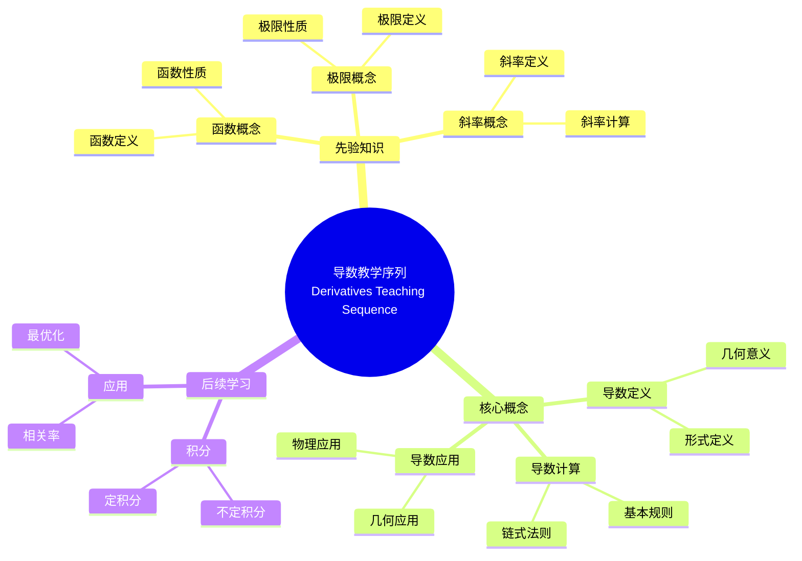

# 概念映射"导数"的教学序列和课程计划

Concept Mapping a Teaching Sequence and Lesson Plan for "Derivatives"

**创建日期**: 2025年12月11日
**创建日期**: December 11, 2025
**研究领域**: 数学教育 - 概念映射 - 中等数学 - 导数
**研究领域**: Mathematics Education - Concept Mapping - Secondary Mathematics - Derivatives
**主题编号**: CM.03.03
**章节**: Chapter 8
**作者**: Karoline Afamasaga-Fuata'i
**优先级**: P0（最高优先级）⭐⭐⭐⭐⭐

---

## 📑 目录 / Table of Contents

- [概念映射"导数"的教学序列和课程计划](#概念映射导数的教学序列和课程计划)
  - [📋 一、概述 / Overview](#-一概述--overview)
  - [🔬 二、研究方法 / Research Methodology](#-二研究方法--research-methodology)
  - [📚 三、概览概念映射 / Overview Concept Maps](#-三概览概念映射--overview-concept-maps)
  - [📐 四、教学序列概念映射 / Teaching Sequence Concept Map](#-四教学序列概念映射--teaching-sequence-concept-map)
  - [📝 五、课程计划概念映射 / Lesson Plan Concept Map](#-五课程计划概念映射--lesson-plan-concept-map)
  - [💡 六、反思与洞察 / Reflections and Insights](#-六反思与洞察--reflections-and-insights)
  - [📈 七、思维表征方式 / Representation Methods](#-七思维表征方式--representation-methods)
  - [📚 八、参考文献 / References](#-八参考文献--references)

---

## 📋 一、概述 / Overview

### 1.1 研究目标 / Research Objectives

**主要目标 / Main Objectives**:

- 展示概念映射如何提供两年数学课程的宏观视图
- Demonstrating how concept maps can provide a macro view of a two-year mathematics curriculum
- 展示如何创新开发导数的教学序列和课程计划
- Demonstrating how to innovatively develop a teaching sequence and lesson plan on Derivatives
- 展示概念映射在教学规划中的应用
- Demonstrating the application of concept mapping in teaching planning

### 1.2 案例研究对象 / Case Study Subject

**研究对象 / Subject**:

- **姓名**: Bobby（化名）
- **身份**: 中等数学职前教师
  Secondary preservice mathematics teacher
- **任务**: 开发导数的教学序列和两个连续课程
  Task: Develop teaching sequence and two consecutive lessons on Derivatives
- **课程**: 高级中等数学教育课程Assignment 1
  Senior secondary mathematics education course Assignment 1

### 1.3 核心内容 / Core Content

**主要内容 / Main Content**:

1. **概览概念映射** - 两年数学课程的概览概念映射
   Overview Concept Maps - Overview concept maps of two-year mathematics curriculum
2. **教学序列概念映射** - 导数主题的教学序列概念映射
   Teaching Sequence Concept Map - Teaching sequence concept map for Derivatives topic
3. **课程计划概念映射** - 具体课程的概念映射
   Lesson Plan Concept Map - Concept map for specific lessons
4. **反思与洞察** - Bobby的反思和洞察
   Reflections and Insights - Bobby's reflections and insights

---

## 🔬 二、研究方法 / Research Methodology

### 2.1 研究设计 / Research Design

**研究方法 / Research Method**: 案例研究 / Case Study

**研究任务 / Research Tasks**:

1. **概览映射** - 构建两年数学课程的概览概念映射
   Overview Mapping - Construct overview concept maps of two-year mathematics curriculum
2. **教学序列映射** - 构建导数主题的教学序列概念映射
   Teaching Sequence Mapping - Construct teaching sequence concept map for Derivatives topic
3. **课程计划映射** - 构建具体课程的概念映射
   Lesson Plan Mapping - Construct concept maps for specific lessons

### 2.2 数据收集 / Data Collection

**收集的数据类型 / Types of Data Collected**:

1. **概览概念映射** - 14个概览概念映射（仅显示2个）
2. **教学序列概念映射** - 导数主题的教学序列概念映射
3. **课程计划概念映射** - 两个连续课程的概念映射
4. **反思日志** - Bobby的反思日志

### 2.3 分析框架 / Analysis Framework

**概念映射分析 / Concept Map Analysis**:

- 分析概念映射结构
- Analyze concept map structure
- 评估概念层次组织
- Evaluate conceptual hierarchical organization
- 识别教学序列
- Identify teaching sequences

---

## 📚 三、概览概念映射 / Overview Concept Maps

### 3.1 Year 11 概览概念映射

**主要结构 / Main Structure**:

- **Level 1**: Year 11 Mathematics
- **Level 2**:
  - (A) Building Blocks of Functions
  - (B) Real Functions
  - (C) Examples of Functions

**Real Functions分支 / Real Functions Branch**:

- **Level 3**:
  - I. Foundations
  - II. The Slope Problem（标记*，与导数相关）
  - III. Introduction: Product, Quotient and Chain Rule

**教学序列 / Teaching Sequence**:

- 顺序A, B, C表示首选教学序列
  Order A, B, C indicates preferred teaching sequence
- 顺序I, II, III表示导数主题内的教学序列
  Order I, II, III indicates teaching sequence within Derivatives topic

### 3.2 Year 12 概览概念映射

**主要结构 / Main Structure**:

- **Level 1**: Year 12 Mathematics
- **Level 4**:
  - HSC (2 Unit) Mathematics topics/units
  - HSC (3 Unit) Mathematics Extension I topics/units

**Calculus分支 / Calculus Branch**:

- **Level 5**: II. Calculus（标记*）
- **Level 6**:
  - 1. Geometric Applications of Differentiation
  - 2. Integration

**Applications分支 / Applications Branch**:

- **Level 5**: 1. Applications of Calculus to the Physical World（标记**）
- **Level 6**:
  - (1) Related Rates
  - (2) Growth and Decay
  - (3) Rectilinear Motion
  - (4) Simple Harmonic Motion
  - (5) Motion of Projectiles

### 3.3 概览映射的作用 / Role of Overview Maps

**主要作用 / Main Functions**:

1. **宏观定位** - 将导数主题定位在两年课程中
   Macro Positioning - Position Derivatives topic within two-year curriculum
2. **概念关联** - 展示导数与其他主题的关联
   Concept Relationships - Show relationships between Derivatives and other topics
3. **教学序列** - 提供教学序列指导
   Teaching Sequence - Provide teaching sequence guidance

---

## 📐 四、教学序列概念映射 / Teaching Sequence Concept Map

### 4.1 教学序列结构 / Teaching Sequence Structure

**主要概念 / Main Concepts**:

- 导数概念 / Derivative concepts
- 斜率问题 / Slope problem
- 切线 / Tangent
- 极限 / Limit
- 微分 / Differentiation

**概念层次 / Concept Hierarchy**:

- 从最一般概念到最具体概念
  From most general to most specific concepts
- 展示概念之间的关联
  Show relationships between concepts
- 提供教学序列指导
  Provide teaching sequence guidance

### 4.2 教学序列特点 / Teaching Sequence Characteristics

**主要特点 / Main Characteristics**:

1. **概念完整性** - 包含所有关键概念
   Concept Completeness - Includes all key concepts
2. **层次清晰** - 概念层次结构清晰
   Clear Hierarchy - Conceptual hierarchy is clear
3. **关联明确** - 概念之间的关联明确
   Clear Relationships - Relationships between concepts are clear

---

## 📝 五、课程计划概念映射 / Lesson Plan Concept Map

### 5.1 课程计划结构 / Lesson Plan Structure

**主要组成部分 / Main Components**:

1. **教学目标** - 课程的教学目标
   Learning Objectives - Learning objectives of the lesson
2. **核心概念** - 课程的核心概念
   Core Concepts - Core concepts of the lesson
3. **教学序列** - 课程的教学序列
   Teaching Sequence - Teaching sequence of the lesson
4. **评估方法** - 课程的评估方法
   Assessment Methods - Assessment methods of the lesson

### 5.2 课程计划特点 / Lesson Plan Characteristics

**主要特点 / Main Characteristics**:

1. **概念聚焦** - 聚焦于核心概念
   Concept Focus - Focus on core concepts
2. **序列清晰** - 教学序列清晰
   Clear Sequence - Teaching sequence is clear
3. **评估整合** - 评估方法整合到课程中
   Assessment Integration - Assessment methods integrated into lesson

---

## 💡 六、反思与洞察 / Reflections and Insights

### 6.1 Bobby的反思 / Bobby's Reflections

**主要反思 / Main Reflections**:

1. **概念映射维度** - 识别概念映射的不同维度
   Concept Map Dimensions - Identified different dimensions of concept maps
2. **知识建构** - 理解知识建构过程
   Knowledge Construction - Understood knowledge construction process
3. **教学规划** - 理解教学规划过程
   Teaching Planning - Understood teaching planning process

### 6.2 主要洞察 / Key Insights

**主要洞察 / Key Insights**:

1. **先定义整个空间** - "我必须首先定义整个（单元）空间，然后才能尝试定义（单元）本身"
   Define Entire Space First - "I must firstly define the entire space of the (unit) before attempting to define the (unit) itself"
2. **概念映射类型** - 区分"先验知识建构映射"和"最佳描述映射"
   Concept Map Types - Distinguished between "prior-knowledge construct map" and "best description map"
3. **教学理解** - 发展对教学的理解
   Pedagogical Understanding - Developed understanding of teaching

---

## 📈 七、思维表征方式 / Representation Methods

### 7.1 导数教学序列思维导图 / Derivatives Teaching Sequence Mind Map



### 7.2 教学序列设计决策树 / Teaching Sequence Design Decision Tree

```text
如何设计导数教学序列？
├─ 学生先验知识是什么？
│  ├─ 函数概念
│  │  └─ ✅ 确保学生理解函数
│  │     └─ 重点：函数定义、性质
│  ├─ 极限概念
│  │  └─ ✅ 确保学生理解极限
│  │     └─ 重点：极限定义、计算
│  └─ 斜率概念
│     └─ ✅ 确保学生理解斜率
│        └─ 重点：斜率定义、几何意义
├─ 教学重点是什么？
│  ├─ 概念理解
│  │  └─ ✅ 强调导数概念
│  │     └─ 重点：导数定义、几何意义
│  ├─ 计算技能
│  │  └─ ✅ 强调导数计算
│  │     └─ 重点：基本规则、链式法则
│  └─ 应用能力
│     └─ ✅ 强调导数应用
│        └─ 重点：几何应用、物理应用
└─ 教学序列如何安排？
   ├─ 从具体到抽象
   │  └─ ✅ 从斜率问题开始
   │     └─ 序列：斜率 → 切线 → 导数
   ├─ 从简单到复杂
   │  └─ ✅ 从基本概念开始
   │     └─ 序列：定义 → 计算 → 应用
   └─ 从局部到整体
      └─ ✅ 从单个概念开始
         └─ 序列：导数 → 积分 → 应用
```

### 7.3 教学规划证明树 / Teaching Planning Proof Tree

```text
【目标】证明：概念映射有效支持教学序列设计
【Goal】Prove: Concept mapping effectively supports teaching sequence design

自底向上证明树 / Bottom-Up Proof Tree:

层次1（理论前提 / Theoretical Premises）
├─ 前提1：教学规划理论
│  └─ 支持：教学序列需要概念分析
├─ 前提2：概念映射理论
│  └─ 支持：概念映射提供概念分析工具
└─ 前提3：有意义学习理论
   └─ 支持：概念映射促进有意义学习

层次2（机制论证 / Mechanism Argument）
├─ 机制1：概念分析机制
│  ├─ 过程：分析课程概念结构
│  ├─ 工具：概念映射提供分析框架
│  └─ 结果：识别关键概念和关联
├─ 机制2：序列设计机制
│  ├─ 过程：基于概念结构设计序列
│  ├─ 工具：概念映射显示概念层次
│  └─ 结果：设计合理教学序列
└─ 机制3：课程规划机制
   ├─ 过程：规划具体课程
   ├─ 工具：概念映射指导课程设计
   └─ 结果：设计有效课程

层次3（实证证据 / Empirical Evidence）
├─ 证据1：Bobby案例研究
│  ├─ 方法：分析概念映射构建过程
│  ├─ 结果：成功设计教学序列和课程
│  └─ 解释：概念映射有效支持设计
└─ 证据2：概览映射证据
   ├─ 方法：分析概览概念映射
   ├─ 结果：提供宏观视图和序列指导
   └─ 解释：概览映射有效支持规划

层次4（综合结论 / Comprehensive Conclusion）
└─ 结论：概念映射有效支持教学序列设计
   ├─ 理论机制明确
   ├─ 实证证据支持
   └─ 应用效果显著
```

---

## 📚 八、参考文献 / References

### 8.1 主要参考文献 / Main References

1. **Afamasaga-Fuata'i, K. (2009)**. Concept Mapping a Teaching Sequence and Lesson Plan for "Derivatives". In K. Afamasaga-Fuata'i (Ed.), *Concept Mapping in Mathematics: Research into Practice* (pp. 149-169). Springer.

2. **Ausubel, D. P. (2000)**. *The Acquisition and Retention of Knowledge: A Cognitive View*. Kluwer Academic Publishers.

3. **Novak, J. D., & Gowin, D. B. (1984)**. *Learning How to Learn*. Cambridge University Press.

### 8.2 相关研究 / Related Research

1. **New South Wales Board of Studies (NSWBOS) (2002)**. *Mathematics 2/3 Unit - Years 11-12*. Sydney, Australia: NSWBOS.

2. **Schoenfeld, A. H. (1991)**. On mathematics as sense-making: An informal attack on the unfortunate divorce of formal and informal mathematics. In J. F. Voss, D. N. Perkins, & J. W. Segal (Eds.), *Informal reasoning and education* (pp. 311-343). Lawrence Erlbaum Associates.

---

**创建日期**: 2025年12月11日
**最后更新**: 2025年12月11日
**状态**: ✅ Chapter 8详细梳理文档已创建
**完成度**: 100%
