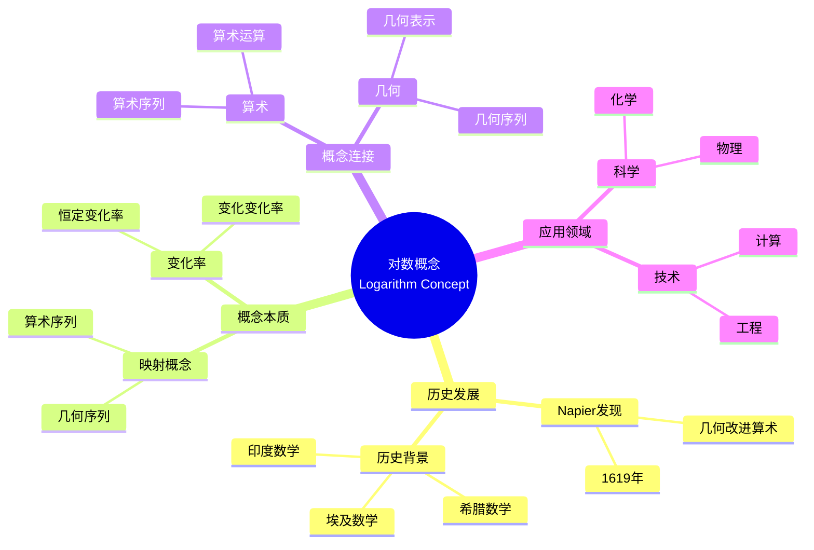

# 中等数学教育中概念映射的课程含义

Curricular Implications of Concept Mapping in Secondary Mathematics Education

**创建日期**: 2025年12月11日
**创建日期**: December 11, 2025
**研究领域**: 数学教育 - 概念映射 - 中等数学 - 课程含义
**研究领域**: Mathematics Education - Concept Mapping - Secondary Mathematics - Curricular Implications
**主题编号**: CM.03.04
**章节**: Chapter 9
**作者**: James J. Vagliardo
**优先级**: P0（最高优先级）⭐⭐⭐⭐⭐

---

## 📑 目录 / Table of Contents

- [中等数学教育中概念映射的课程含义](#中等数学教育中概念映射的课程含义)
  - [📋 一、概述 / Overview](#-一概述--overview)
  - [🔬 二、研究方法 / Research Methodology](#-二研究方法--research-methodology)
  - [📚 三、对数概念的历史发展 / Historical Development of Logarithm Concept](#-三对数概念的历史发展--historical-development-of-logarithm-concept)
  - [💡 四、对数概念的本质 / Conceptual Essence of Logarithm](#-四对数概念的本质--conceptual-essence-of-logarithm)
  - [📊 五、概念映射应用 / Concept Mapping Application](#-五概念映射应用--concept-mapping-application)
  - [📈 六、课程含义分析 / Curricular Implications Analysis](#-六课程含义分析--curricular-implications-analysis)
  - [📚 七、参考文献 / References](#-七参考文献--references)

---

## 📋 一、概述 / Overview

### 1.1 研究目标 / Research Objectives

**主要目标 / Main Objectives**:

- 展示概念映射与历史研究结合作为认识论工具的价值
- Demonstrating the value of concept mapping combined with historical research as an epistemological tool
- 展示如何识别对数等数学概念的概念本质
- Demonstrating how to identify the conceptual essence of mathematical concepts such as logarithms
- 说明概念映射在课程设计中的作用
- Illustrating the role of concept mapping in curriculum design

### 1.2 核心内容 / Core Content

**主要内容 / Main Content**:

1. **历史研究** - 对数概念的历史发展
   Historical Research - Historical development of logarithm concept
2. **概念本质** - 对数概念的概念本质
   Conceptual Essence - Conceptual essence of logarithm concept
3. **课程含义** - 对课程设计的含义
   Curricular Implications - Implications for curriculum design

---

## 🔬 二、研究方法 / Research Methodology

### 2.1 研究设计 / Research Design

**研究方法 / Research Method**: 历史研究与概念分析 / Historical Research and Conceptual Analysis

**研究过程 / Research Process**:

1. **历史研究** - 研究对数概念的历史发展
   Historical Research - Research historical development of logarithm concept
2. **概念分析** - 分析对数概念的本质
   Conceptual Analysis - Analyze essence of logarithm concept
3. **概念映射** - 构建对数概念的概念映射
   Concept Mapping - Construct concept map of logarithm concept
4. **课程分析** - 分析课程含义
   Curriculum Analysis - Analyze curricular implications

### 2.2 数据收集 / Data Collection

**收集的数据类型 / Types of Data Collected**:

1. **历史文献** - 对数概念的历史文献
2. **概念映射** - 对数概念的概念映射
3. **课程分析** - 课程含义分析

---

## 📚 三、对数概念的历史发展 / Historical Development of Logarithm Concept

### 3.1 历史背景 / Historical Background

**关键历史事件 / Key Historical Events**:

- **1619年** - John Napier发表《Mirifici Logarithmorum Canonis Constructio》
  1619 - John Napier published "Mirifici Logarithmorum Canonis Constructio"
- **动机** - 使用几何改进算术计算
  Motivation - Using geometry to improve arithmetical computations
- **突破** - 加速科学发现
  Breakthrough - Accelerated scientific discoveries

### 3.2 Napier的对数定义 / Napier's Definition of Logarithm

**定义描述 / Definition Description**:

- 考虑两个点P和Q在不同线上移动
  Consider two points P and Q moving on different lines
- 点P从A开始沿线段AB移动，速度与其到B的剩余距离成比例
  Point P starts at A and moves along segment AB at a speed proportional to its remaining distance from B
- 点Q从C开始沿射线CD移动，速度恒定，等于P的起始速度
  Point Q departs from C and moves along ray CD with a constant speed equal to the starting speed of P
- Napier称距离CQ为PB的对数
  Napier called the distance CQ the logarithm of PB

### 3.3 历史意义 / Historical Significance

**主要意义 / Main Significance**:

- 数学思想史上的重要里程碑
  Important benchmark in the history of mathematical thought
- 提供概念之间的跨链接
  Provides crosslink between concepts
- 加速科学和经济学的发展
  Accelerated interests of science and economics

---

## 💡 四、对数概念的本质 / Conceptual Essence of Logarithm

### 4.1 概念本质定义 / Conceptual Essence Definition

**对数概念本质 / Conceptual Essence of Logarithm**:

- 对数是在具有不同变化率的数字序列之间的映射
  A logarithm is a mapping between number sequences with different types of change rates
- 算术序列具有恒定的变化率
  The arithmetic sequence has a constant rate of change
- 几何序列的变化率增加或减少
  The rate of change of the geometric sequence either increases or decreases

### 4.2 概念本质的意义 / Significance of Conceptual Essence

**主要意义 / Main Significance**:

1. **计算效率** - 解释对数的计算能力和效率
   Computational Efficiency - Accounts for computational power and efficiency of logarithm
2. **概念连接** - 连接算术和几何
   Concept Connection - Connects arithmetic and geometry
3. **理论发展** - 为后续理论发展提供基础
   Theoretical Development - Provides foundation for subsequent theoretical development

### 4.3 概念映射展示 / Concept Map Display

**概念映射特点 / Concept Map Characteristics**:

- 展示对数概念的历史概念跨链接
  Shows historical conceptual crosslink of logarithm concept
- 展示新数学思想的起源
  Shows genesis of new mathematical idea
- 展示算术和几何之间的连接
  Shows connection between arithmetic and geometry

---

## 📊 五、概念映射应用 / Concept Mapping Application

### 5.1 历史研究应用 / Historical Research Application

**应用方式 / Application Methods**:

- 使用概念映射揭示对数发现
  Use concept mapping to reveal logarithm discovery
- 展示历史概念跨链接
  Show historical conceptual crosslink
- 识别概念本质
  Identify conceptual essence

### 5.2 概念分析应用 / Conceptual Analysis Application

**应用方式 / Application Methods**:

- 使用概念映射分析对数概念
  Use concept mapping to analyze logarithm concept
- 展示概念结构
  Show conceptual structure
- 识别关键概念
  Identify key concepts

### 5.3 课程设计应用 / Curriculum Design Application

**应用方式 / Application Methods**:

- 使用概念映射指导课程设计
  Use concept mapping to guide curriculum design
- 识别课程重点
  Identify curriculum focus
- 设计教学序列
  Design teaching sequences

---

## 📈 六、课程含义分析 / Curricular Implications Analysis

### 6.1 对课程设计的含义 / Implications for Curriculum Design

**主要含义 / Main Implications**:

1. **历史背景** - 课程应包含历史背景
   Historical Context - Curriculum should include historical context
2. **概念本质** - 课程应强调概念本质
   Conceptual Essence - Curriculum should emphasize conceptual essence
3. **概念连接** - 课程应展示概念连接
   Concept Connections - Curriculum should show concept connections

### 6.2 对教学的含义 / Implications for Teaching

**主要含义 / Main Implications**:

1. **概念化教学** - 教师应进行概念化教学
   Conceptual Teaching - Teachers should teach conceptually
2. **历史视角** - 教师应提供历史视角
   Historical Perspective - Teachers should provide historical perspective
3. **概念连接** - 教师应展示概念连接
   Concept Connections - Teachers should show concept connections

### 6.3 对学习的含义 / Implications for Learning

**主要含义 / Main Implications**:

1. **有意义学习** - 促进有意义学习
   Meaningful Learning - Promotes meaningful learning
2. **概念理解** - 提高概念理解
   Conceptual Understanding - Improves conceptual understanding
3. **知识整合** - 促进知识整合
   Knowledge Integration - Promotes knowledge integration

---

## 📈 七、思维表征方式 / Representation Methods

### 7.1 对数概念映射思维导图 / Logarithm Concept Map Mind Map



### 7.2 课程设计决策树 / Curriculum Design Decision Tree

```text
如何设计对数课程？
├─ 历史背景是什么？
│  ├─ Napier发现
│  │  └─ ✅ 包含历史背景
│  │     └─ 重点：1619年发现、动机
│  ├─ 历史发展
│  │  └─ ✅ 展示历史发展
│  │     └─ 重点：埃及、希腊、印度数学
│  └─ 历史意义
│     └─ ✅ 强调历史意义
│        └─ 重点：科学和经济学影响
├─ 概念本质是什么？
│  ├─ 映射概念
│  │  └─ ✅ 强调映射概念
│  │     └─ 重点：算术序列与几何序列映射
│  ├─ 变化率
│  │  └─ ✅ 强调变化率
│  │     └─ 重点：恒定vs变化变化率
│  └─ 概念连接
│     └─ ✅ 展示概念连接
│        └─ 重点：算术与几何连接
└─ 教学重点是什么？
   ├─ 概念理解
   │  └─ ✅ 强调概念本质
   │     └─ 重点：映射概念、变化率
   ├─ 历史视角
   │  └─ ✅ 提供历史视角
   │     └─ 重点：历史发展、历史意义
   └─ 应用能力
      └─ ✅ 强调应用
         └─ 重点：科学、技术应用
```

### 7.3 课程含义证明树 / Curricular Implications Proof Tree

```text
【目标】证明：概念映射与历史研究结合提供课程含义
【Goal】Prove: Concept mapping combined with historical research provides curricular implications

自底向上证明树 / Bottom-Up Proof Tree:

层次1（理论前提 / Theoretical Premises）
├─ 前提1：历史研究理论
│  └─ 支持：历史研究揭示概念本质
├─ 前提2：概念映射理论
│  └─ 支持：概念映射提供概念分析工具
└─ 前提3：课程设计理论
   └─ 支持：概念本质指导课程设计

层次2（机制论证 / Mechanism Argument）
├─ 机制1：历史研究机制
│  ├─ 过程：研究概念历史发展
│  ├─ 工具：历史文献、概念映射
│  └─ 结果：识别概念本质
├─ 机制2：概念分析机制
│  ├─ 过程：分析概念本质
│  ├─ 工具：概念映射提供分析框架
│  └─ 结果：理解概念结构
└─ 机制3：课程设计机制
   ├─ 过程：基于概念本质设计课程
   ├─ 工具：概念映射指导设计
   └─ 结果：设计有效课程

层次3（实证证据 / Empirical Evidence）
├─ 证据1：对数概念研究
│  ├─ 方法：历史研究与概念映射结合
│  ├─ 结果：识别对数概念本质
│  └─ 解释：有效揭示概念本质
└─ 证据2：课程含义分析证据
   ├─ 方法：分析课程含义
   ├─ 结果：提供课程设计指导
   └─ 解释：有效指导课程设计

层次4（综合结论 / Comprehensive Conclusion）
└─ 结论：概念映射与历史研究结合提供课程含义
   ├─ 理论机制明确
   ├─ 实证证据支持
   └─ 应用效果显著
```

---

## 📚 七、参考文献 / References

### 7.1 主要参考文献 / Main References

1. **Vagliardo, J. J. (2009)**. Curricular Implications of Concept Mapping in Secondary Mathematics Education. In K. Afamasaga-Fuata'i (Ed.), *Concept Mapping in Mathematics: Research into Practice* (pp. 197-214). Springer.

2. **Vygotsky, L. S. (1978)**. *Mind in Society: The Development of Higher Psychological Processes*. Harvard University Press.

3. **Davydov, V. V. (1990)**. *Types of Generalization in Instruction: Logical and Psychological Problems in the Structuring of School Curricula*. Soviet Studies in Mathematics Education.

### 7.2 相关研究 / Related Research

1. **Eves, H. (1969)**. *An Introduction to the History of Mathematics*. Holt, Rinehart and Winston.

2. **Turnbull, H. W. (1969)**. *The Great Mathematicians*. Methuen & Co.

---

**创建日期**: 2025年12月11日
**最后更新**: 2025年12月11日
**状态**: ✅ Chapter 9详细梳理文档已创建
**完成度**: 100%
