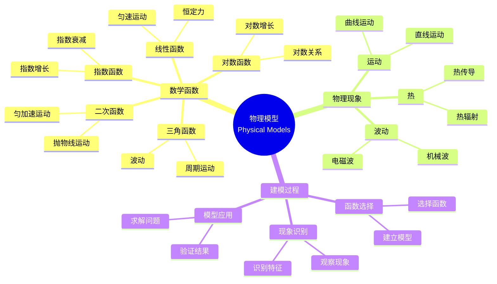

# 使用概念映射和Gowin的Vee理解物理现象的数学模型

Using Concept Maps and Gowin's Vee to Understand Mathematical Models of Physical Phenomena

**创建日期**: 2025年12月11日
**创建日期**: December 11, 2025
**研究领域**: 数学教育 - 概念映射 - 中等数学 - 物理模型
**研究领域**: Mathematics Education - Concept Mapping - Secondary Mathematics - Physical Models
**主题编号**: CM.03.05
**章节**: Chapter 10
**作者**: Maria S. Ramírez De Mantilla, et al.
**优先级**: P0（最高优先级）⭐⭐⭐⭐⭐

---

## 📑 目录 / Table of Contents

- [使用概念映射和Gowin的Vee理解物理现象的数学模型](#使用概念映射和gowin的vee理解物理现象的数学模型)
  - [📋 一、概述 / Overview](#-一概述--overview)
  - [🔬 二、研究方法 / Research Methodology](#-二研究方法--research-methodology)
  - [📚 三、概念映射应用 / Concept Map Application](#-三概念映射应用--concept-map-application)
  - [📊 四、Vee图应用 / Vee Diagram Application](#-四vee图应用--vee-diagram-application)
  - [💡 五、跨学科理解 / Cross-Disciplinary Understanding](#-五跨学科理解--cross-disciplinary-understanding)
  - [📈 六、思维表征方式 / Representation Methods](#-六思维表征方式--representation-methods)
  - [📚 七、参考文献 / References](#-七参考文献--references)

---

## 📋 一、概述 / Overview

### 1.1 研究目标 / Research Objectives

**主要目标 / Main Objectives**:

- 提供构建概念映射和Vee图的有用指南
- Providing useful guidelines for constructing concept maps and vee diagrams
- 展示如何使用概念映射和Vee图理解物理现象的数学模型
- Demonstrating how to use concept maps and vee diagrams to understand mathematical models of physical phenomena
- 说明概念映射和Vee图在跨学科学习中的作用
- Illustrating the role of concept maps and vee diagrams in cross-disciplinary learning

### 1.2 核心内容 / Core Content

**主要内容 / Main Content**:

1. **构建指南** - 构建概念映射和Vee图的指南
   Construction Guidelines - Guidelines for constructing concept maps and vee diagrams
2. **物理现象建模** - 使用概念映射和Vee图建模物理现象
   Physical Phenomena Modeling - Using concept maps and vee diagrams to model physical phenomena
3. **数学函数应用** - 数学函数在物理现象中的应用
   Mathematical Function Application - Application of mathematical functions in physical phenomena

---

## 🔬 二、研究方法 / Research Methodology

### 2.1 研究设计 / Research Design

**研究方法 / Research Method**: 应用研究 / Application Research

**研究过程 / Research Process**:

1. **指南开发** - 开发构建概念映射和Vee图的指南
   Guideline Development - Develop guidelines for constructing concept maps and vee diagrams
2. **应用示例** - 提供各种物理现象的应用示例
   Application Examples - Provide application examples of various physical phenomena
3. **策略阐述** - 阐述指导学生构建的策略
   Strategy Elaboration - Elaborate strategies to guide student constructions

### 2.2 数据收集 / Data Collection

**收集的数据类型 / Types of Data Collected**:

1. **概念映射示例** - 各种物理现象的概念映射示例
2. **Vee图示例** - 各种物理现象的Vee图示例
3. **应用策略** - 指导学生构建的策略

---

## 📚 三、概念映射应用 / Concept Map Application

### 3.1 概念映射构建指南 / Concept Map Construction Guidelines

**构建步骤 / Construction Steps**:

1. **识别概念** - 识别关键概念
   Identify Concepts - Identify key concepts
2. **组织概念** - 层次化组织概念
   Organize Concepts - Hierarchically organize concepts
3. **建立关系** - 建立概念之间的关系
   Establish Relationships - Establish relationships between concepts
4. **添加链接词** - 添加描述关系的链接词
   Add Linking Words - Add linking words describing relationships

### 3.2 物理现象概念映射示例 / Physical Phenomena Concept Map Examples

**示例类型 / Example Types**:

1. **运动现象** - 运动的概念映射
   Motion Phenomena - Concept maps of motion
2. **波动现象** - 波动的概念映射
   Wave Phenomena - Concept maps of waves
3. **热现象** - 热的概念映射
   Heat Phenomena - Concept maps of heat

### 3.3 数学函数概念映射 / Mathematical Function Concept Maps

**主要函数 / Main Functions**:

- 线性函数 / Linear functions
- 二次函数 / Quadratic functions
- 指数函数 / Exponential functions
- 对数函数 / Logarithmic functions
- 三角函数 / Trigonometric functions

---

## 📊 四、Vee图应用 / Vee Diagram Application

### 4.1 Vee图构建指南 / Vee Diagram Construction Guidelines

**构建步骤 / Construction Steps**:

1. **识别问题** - 识别要分析的物理现象
   Identify Problem - Identify physical phenomenon to analyze
2. **思考侧** - 完成思考侧（概念、原理）
   Thinking Side - Complete thinking side (concepts, principles)
3. **操作侧** - 完成操作侧（给定信息、方法、答案）
   Doing Side - Complete doing side (given information, methods, answers)

### 4.2 物理现象Vee图示例 / Physical Phenomena Vee Diagram Examples

**示例类型 / Example Types**:

1. **运动问题** - 运动问题的Vee图
   Motion Problems - Vee diagrams of motion problems
2. **波动问题** - 波动问题的Vee图
   Wave Problems - Vee diagrams of wave problems
3. **热问题** - 热问题的Vee图
   Heat Problems - Vee diagrams of heat problems

### 4.3 数学建模Vee图 / Mathematical Modeling Vee Diagrams

**建模过程 / Modeling Process**:

- 物理现象 → 数学函数 → 数学模型
  Physical Phenomenon → Mathematical Function → Mathematical Model
- 概念侧：物理原理、数学概念
  Conceptual Side: Physical principles, mathematical concepts
- 方法侧：建模方法、求解方法
  Methodological Side: Modeling methods, solution methods

---

## 💡 五、跨学科理解 / Cross-Disciplinary Understanding

### 5.1 数学-物理连接 / Mathematics-Physics Connections

**主要连接 / Main Connections**:

1. **数学函数** - 数学函数在物理现象中的应用
   Mathematical Functions - Application of mathematical functions in physical phenomena
2. **物理原理** - 物理原理的数学表示
   Physical Principles - Mathematical representation of physical principles
3. **数学模型** - 物理现象的数学模型
   Mathematical Models - Mathematical models of physical phenomena

### 5.2 概念映射的作用 / Role of Concept Mapping

**主要作用 / Main Functions**:

- 展示数学-物理连接
  Shows mathematics-physics connections
- 促进跨学科理解
  Promotes cross-disciplinary understanding
- 支持数学建模
  Supports mathematical modeling

### 5.3 Vee图的作用 / Role of Vee Diagrams

**主要作用 / Main Functions**:

- 连接理论与应用
  Connects theory and application
- 展示建模过程
  Shows modeling process
- 支持问题解决
  Supports problem solving

---

## 📈 六、思维表征方式 / Representation Methods

### 6.1 物理模型思维导图 / Physical Model Mind Map



### 6.2 建模过程决策树 / Modeling Process Decision Tree

```text
如何建模物理现象？
├─ 物理现象是什么？
│  ├─ 运动
│  │  ├─ 匀速运动
│  │  │  └─ ✅ 使用线性函数
│  │  ├─ 匀加速运动
│  │  │  └─ ✅ 使用二次函数
│  │  └─ 周期运动
│  │     └─ ✅ 使用三角函数
│  ├─ 波动
│  │  └─ ✅ 使用三角函数
│  └─ 增长/衰减
│     ├─ 指数增长
│     │  └─ ✅ 使用指数函数
│     └─ 指数衰减
│        └─ ✅ 使用指数函数
├─ 建模方法是什么？
│  ├─ 概念映射
│  │  └─ ✅ 展示概念结构
│  │     └─ 重点：数学函数、物理原理
│  ├─ Vee图
│  │  └─ ✅ 展示建模过程
│  │     └─ 重点：理论侧、方法侧
│  └─ 组合使用
│     └─ ✅ 概念映射+Vee图
│        └─ 优势：全面理解
└─ 应用目标是什么？
   ├─ 概念理解
   │  └─ ✅ 强调概念映射
   │     └─ 重点：概念结构、关系
   ├─ 问题解决
   │  └─ ✅ 强调Vee图
   │     └─ 重点：建模过程、方法
   └─ 综合应用
      └─ ✅ 组合使用
         └─ 优势：全面应用
```

### 6.3 跨学科理解证明树 / Cross-Disciplinary Understanding Proof Tree

```text
【目标】证明：概念映射和Vee图促进跨学科理解
【Goal】Prove: Concept maps and vee diagrams promote cross-disciplinary understanding

自底向上证明树 / Bottom-Up Proof Tree:

层次1（理论前提 / Theoretical Premises）
├─ 前提1：跨学科学习理论
│  └─ 支持：跨学科连接促进理解
├─ 前提2：概念映射理论
│  └─ 支持：概念映射展示概念连接
└─ 前提3：Vee图理论
   └─ 支持：Vee图连接理论与应用

层次2（机制论证 / Mechanism Argument）
├─ 机制1：概念连接机制
│  ├─ 过程：展示数学-物理连接
│  ├─ 工具：概念映射提供视觉表征
│  └─ 结果：促进跨学科理解
├─ 机制2：建模过程机制
│  ├─ 过程：展示建模过程
│  ├─ 工具：Vee图提供建模框架
│  └─ 结果：提高建模能力
└─ 机制3：问题解决机制
   ├─ 过程：连接理论与应用
   ├─ 工具：Vee图提供问题解决框架
   └─ 结果：提高问题解决能力

层次3（实证证据 / Empirical Evidence）
├─ 证据1：物理现象建模证据
│  ├─ 方法：使用概念映射和Vee图建模
│  ├─ 结果：有效理解物理现象
│  └─ 解释：概念映射和Vee图有效促进理解
└─ 证据2：跨学科应用证据
   ├─ 方法：分析跨学科应用
   ├─ 结果：提高跨学科理解
   └─ 解释：概念映射和Vee图有效促进跨学科理解

层次4（综合结论 / Comprehensive Conclusion）
└─ 结论：概念映射和Vee图促进跨学科理解
   ├─ 理论机制明确
   ├─ 实证证据支持
   └─ 应用效果显著
```

---

## 📚 七、参考文献 / References

### 7.1 主要参考文献 / Main References

1. **Ramírez De Mantilla, M. S., et al. (2009)**. Using Concept Maps and Gowin's Vee to Understand Mathematical Models of Physical Phenomena. In K. Afamasaga-Fuata'i (Ed.), *Concept Mapping in Mathematics: Research into Practice* (pp. 215-237). Springer.

2. **Gowin, D. B. (1981)**. *Educating*. Cornell University Press.

3. **Novak, J. D., & Gowin, D. B. (1984)**. *Learning How to Learn*. Cambridge University Press.

### 7.2 相关研究 / Related Research

1. **Novak, J. D. (1998)**. *Learning, Creating, and Using Knowledge: Concept Maps as Facilitative Tools in Schools and Corporations*. Lawrence Erlbaum Associates.

2. **Mintzes, J. J., Wandersee, J. H., & Novak, J. D. (Eds.) (2000)**. *Assessing Science Understanding: A Human Constructivist View*. Academic Press.

---

**创建日期**: 2025年12月11日
**最后更新**: 2025年12月11日
**状态**: ✅ Chapter 10详细梳理文档已创建
**完成度**: 100%
