# 使用概念映射和Gowin的Vee理解物理现象的数学模型

Using Concept Maps and Gowin's Vee to Understand Mathematical Models of Physical Phenomena

**创建日期**: 2025年12月11日
**创建日期**: December 11, 2025
**研究领域**: 数学教育 - 概念映射 - 中等数学 - 物理模型
**研究领域**: Mathematics Education - Concept Mapping - Secondary Mathematics - Physical Models
**主题编号**: CM.03.05
**章节**: Chapter 10
**作者**: Maria S. Ramírez De Mantilla, et al.
**优先级**: P0（最高优先级）⭐⭐⭐⭐⭐

---

## 📑 目录 / Table of Contents

- [使用概念映射和Gowin的Vee理解物理现象的数学模型](#使用概念映射和gowin的vee理解物理现象的数学模型)
  - [📑 目录 / Table of Contents](#-目录--table-of-contents)
  - [📋 一、概述 / Overview](#-一概述--overview)
    - [1.1 研究目标 / Research Objectives](#11-研究目标--research-objectives)
    - [1.2 核心内容 / Core Content](#12-核心内容--core-content)
  - [🔬 二、研究方法 / Research Methodology](#-二研究方法--research-methodology)
    - [2.1 研究设计 / Research Design](#21-研究设计--research-design)
    - [2.2 数据收集 / Data Collection](#22-数据收集--data-collection)
  - [📐 三、物理现象数学模型深度分析 / Deep Analysis of Mathematical Models of Physical Phenomena](#-三物理现象数学模型深度分析--deep-analysis-of-mathematical-models-of-physical-phenomena)
    - [3.1 数学建模的数学基础 / Mathematical Foundation of Mathematical Modeling](#31-数学建模的数学基础--mathematical-foundation-of-mathematical-modeling)
      - [3.1.1 数学模型的定义 / Definition of Mathematical Models](#311-数学模型的定义--definition-of-mathematical-models)
      - [3.1.2 建模过程的数学结构 / Mathematical Structure of Modeling Process](#312-建模过程的数学结构--mathematical-structure-of-modeling-process)
    - [3.2 常见物理现象的数学模型 / Mathematical Models of Common Physical Phenomena](#32-常见物理现象的数学模型--mathematical-models-of-common-physical-phenomena)
      - [3.2.1 运动学模型 / Kinematics Models](#321-运动学模型--kinematics-models)
      - [3.2.2 动力学模型 / Dynamics Models](#322-动力学模型--dynamics-models)
      - [3.2.3 能量模型 / Energy Models](#323-能量模型--energy-models)
    - [3.3 数学函数在物理中的应用 / Application of Mathematical Functions in Physics](#33-数学函数在物理中的应用--application-of-mathematical-functions-in-physics)
      - [3.3.1 线性函数 / Linear Functions](#331-线性函数--linear-functions)
      - [3.3.2 二次函数 / Quadratic Functions](#332-二次函数--quadratic-functions)
      - [3.3.3 指数函数 / Exponential Functions](#333-指数函数--exponential-functions)
      - [3.3.4 三角函数 / Trigonometric Functions](#334-三角函数--trigonometric-functions)
    - [3.4 建模过程的数学结构 / Mathematical Structure of Modeling Process](#34-建模过程的数学结构--mathematical-structure-of-modeling-process)
      - [3.4.1 模型建立 / Model Construction](#341-模型建立--model-construction)
      - [3.4.2 模型求解 / Model Solution](#342-模型求解--model-solution)
      - [3.4.3 模型验证 / Model Validation](#343-模型验证--model-validation)
    - [3.5 物理模型数学内容典型例题 / Typical Examples of Physical Model Mathematical Content](#35-物理模型数学内容典型例题--typical-examples-of-physical-model-mathematical-content)
      - [3.5.1 匀加速运动模型 / Uniformly Accelerated Motion Model](#351-匀加速运动模型--uniformly-accelerated-motion-model)
      - [3.5.2 简谐运动模型 / Simple Harmonic Motion Model](#352-简谐运动模型--simple-harmonic-motion-model)
      - [3.5.3 指数衰减模型 / Exponential Decay Model](#353-指数衰减模型--exponential-decay-model)
  - [📚 四、概念映射应用 / Concept Map Application](#-四概念映射应用--concept-map-application)
    - [3.1 概念映射构建指南 / Concept Map Construction Guidelines](#31-概念映射构建指南--concept-map-construction-guidelines)
    - [3.2 物理现象概念映射示例 / Physical Phenomena Concept Map Examples](#32-物理现象概念映射示例--physical-phenomena-concept-map-examples)
    - [3.3 数学函数概念映射 / Mathematical Function Concept Maps](#33-数学函数概念映射--mathematical-function-concept-maps)
  - [📊 四、Vee图应用 / Vee Diagram Application](#-四vee图应用--vee-diagram-application)
    - [4.1 Vee图构建指南 / Vee Diagram Construction Guidelines](#41-vee图构建指南--vee-diagram-construction-guidelines)
    - [4.2 物理现象Vee图示例 / Physical Phenomena Vee Diagram Examples](#42-物理现象vee图示例--physical-phenomena-vee-diagram-examples)
    - [4.3 数学建模Vee图 / Mathematical Modeling Vee Diagrams](#43-数学建模vee图--mathematical-modeling-vee-diagrams)
    - [4.4 Vee图具体应用案例与建模过程 / Specific Vee Diagram Application Cases and Modeling Process](#44-vee图具体应用案例与建模过程--specific-vee-diagram-application-cases-and-modeling-process)
      - [4.4.1 案例1：匀加速直线运动的Vee图建模 / Case 1: Vee Diagram Modeling of Uniformly Accelerated Linear Motion](#441-案例1匀加速直线运动的vee图建模--case-1-vee-diagram-modeling-of-uniformly-accelerated-linear-motion)
      - [4.4.2 案例2：简谐运动的Vee图建模 / Case 2: Vee Diagram Modeling of Simple Harmonic Motion](#442-案例2简谐运动的vee图建模--case-2-vee-diagram-modeling-of-simple-harmonic-motion)
      - [4.4.3 学生建模活动的具体描述 / Specific Description of Student Modeling Activities](#443-学生建模活动的具体描述--specific-description-of-student-modeling-activities)
  - [💡 五、跨学科理解 / Cross-Disciplinary Understanding](#-五跨学科理解--cross-disciplinary-understanding)
    - [5.1 数学-物理连接 / Mathematics-Physics Connections](#51-数学-物理连接--mathematics-physics-connections)
    - [5.2 概念映射的作用 / Role of Concept Mapping](#52-概念映射的作用--role-of-concept-mapping)
    - [5.3 Vee图的作用 / Role of Vee Diagrams](#53-vee图的作用--role-of-vee-diagrams)
    - [5.4 概念映射在建模中的应用 / Application of Concept Mapping in Modeling](#54-概念映射在建模中的应用--application-of-concept-mapping-in-modeling)
      - [5.4.1 概念映射与Vee图的互补关系 / Complementary Relationship Between Concept Maps and Vee Diagrams](#541-概念映射与vee图的互补关系--complementary-relationship-between-concept-maps-and-vee-diagrams)
      - [5.4.2 概念映射在建模各阶段的应用 / Application of Concept Maps in Various Modeling Stages](#542-概念映射在建模各阶段的应用--application-of-concept-maps-in-various-modeling-stages)
  - [📈 六、思维表征方式 / Representation Methods](#-六思维表征方式--representation-methods)
    - [6.1 物理模型思维导图 / Physical Model Mind Map](#61-物理模型思维导图--physical-model-mind-map)
    - [6.2 建模过程决策树 / Modeling Process Decision Tree](#62-建模过程决策树--modeling-process-decision-tree)
    - [6.3 跨学科理解证明树 / Cross-Disciplinary Understanding Proof Tree](#63-跨学科理解证明树--cross-disciplinary-understanding-proof-tree)
  - [📚 七、参考文献 / References](#-七参考文献--references)
    - [7.1 主要参考文献 / Main References](#71-主要参考文献--main-references)
    - [7.2 相关研究 / Related Research](#72-相关研究--related-research)

---

## 📋 一、概述 / Overview

### 1.1 研究目标 / Research Objectives

**主要目标 / Main Objectives**:

- 提供构建概念映射和Vee图的有用指南
- Providing useful guidelines for constructing concept maps and vee diagrams
- 展示如何使用概念映射和Vee图理解物理现象的数学模型
- Demonstrating how to use concept maps and vee diagrams to understand mathematical models of physical phenomena
- 说明概念映射和Vee图在跨学科学习中的作用
- Illustrating the role of concept maps and vee diagrams in cross-disciplinary learning

### 1.2 核心内容 / Core Content

**主要内容 / Main Content**:

1. **构建指南** - 构建概念映射和Vee图的指南
   Construction Guidelines - Guidelines for constructing concept maps and vee diagrams
2. **物理现象建模** - 使用概念映射和Vee图建模物理现象
   Physical Phenomena Modeling - Using concept maps and vee diagrams to model physical phenomena
3. **数学函数应用** - 数学函数在物理现象中的应用
   Mathematical Function Application - Application of mathematical functions in physical phenomena

---

## 🔬 二、研究方法 / Research Methodology

### 2.1 研究设计 / Research Design

**研究方法 / Research Method**: 应用研究 / Application Research

**研究过程 / Research Process**:

1. **指南开发** - 开发构建概念映射和Vee图的指南
   Guideline Development - Develop guidelines for constructing concept maps and vee diagrams
2. **应用示例** - 提供各种物理现象的应用示例
   Application Examples - Provide application examples of various physical phenomena
3. **策略阐述** - 阐述指导学生构建的策略
   Strategy Elaboration - Elaborate strategies to guide student constructions

### 2.2 数据收集 / Data Collection

**收集的数据类型 / Types of Data Collected**:

1. **概念映射示例** - 各种物理现象的概念映射示例
2. **Vee图示例** - 各种物理现象的Vee图示例
3. **应用策略** - 指导学生构建的策略

---

## 📐 三、物理现象数学模型深度分析 / Deep Analysis of Mathematical Models of Physical Phenomena

### 3.1 数学建模的数学基础 / Mathematical Foundation of Mathematical Modeling

#### 3.1.1 数学模型的定义 / Definition of Mathematical Models

**数学模型定义 / Mathematical Model Definition**:

- **数学模型**是用数学语言描述现实世界现象的系统
- **Mathematical Model** is a system that describes real-world phenomena using mathematical language
- 一般形式：$y = f(x_1, x_2, \ldots, x_n)$
- General form: $y = f(x_1, x_2, \ldots, x_n)$
- 其中 $y$ 是因变量，$x_i$ 是自变量，$f$ 是函数关系
- Where $y$ is the dependent variable, $x_i$ are independent variables, and $f$ is the functional relationship

#### 3.1.2 建模过程的数学结构 / Mathematical Structure of Modeling Process

**建模步骤 / Modeling Steps**:

1. **问题识别**: 确定要建模的物理现象
2. **变量识别**: 识别相关变量（自变量和因变量）
3. **关系建立**: 建立变量之间的数学关系
4. **模型求解**: 求解数学模型
5. **模型验证**: 验证模型的有效性
6. **模型应用**: 应用模型解决实际问题

### 3.2 常见物理现象的数学模型 / Mathematical Models of Common Physical Phenomena

#### 3.2.1 运动学模型 / Kinematics Models

**匀速直线运动 / Uniform Linear Motion**:

$$s = s_0 + vt$$

- $s$ = 位移（position）
- $s_0$ = 初始位置（initial position）
- $v$ = 速度（velocity）
- $t$ = 时间（time）

**匀加速直线运动 / Uniformly Accelerated Linear Motion**:

$$s = s_0 + v_0 t + \frac{1}{2}at^2$$

$$v = v_0 + at$$

- $a$ = 加速度（acceleration）
- $v_0$ = 初始速度（initial velocity）

#### 3.2.2 动力学模型 / Dynamics Models

**牛顿第二定律 / Newton's Second Law**:

$$F = ma$$

- $F$ = 力（force）
- $m$ = 质量（mass）
- $a$ = 加速度（acceleration）

**万有引力定律 / Law of Universal Gravitation**:

$$F = G\frac{m_1 m_2}{r^2}$$

- $G$ = 万有引力常数（gravitational constant）
- $m_1, m_2$ = 两个物体的质量
- $r$ = 两个物体之间的距离

#### 3.2.3 能量模型 / Energy Models

**动能 / Kinetic Energy**:

$$E_k = \frac{1}{2}mv^2$$

**势能 / Potential Energy**:

$$E_p = mgh$$

- $g$ = 重力加速度（gravitational acceleration）
- $h$ = 高度（height）

**能量守恒 / Energy Conservation**:

$$E_{\text{total}} = E_k + E_p = \text{常数}$$

### 3.3 数学函数在物理中的应用 / Application of Mathematical Functions in Physics

#### 3.3.1 线性函数 / Linear Functions

**应用 / Applications**:

- **匀速运动**: $s = vt + s_0$（线性函数）
- **胡克定律**: $F = -kx$（线性关系）
- **欧姆定律**: $V = IR$（线性关系）

#### 3.3.2 二次函数 / Quadratic Functions

**应用 / Applications**:

- **匀加速运动**: $s = \frac{1}{2}at^2 + v_0 t + s_0$（二次函数）
- **抛体运动**: 轨迹是抛物线（二次函数）

#### 3.3.3 指数函数 / Exponential Functions

**应用 / Applications**:

- **放射性衰变**: $N(t) = N_0 e^{-\lambda t}$
- **指数增长**: $P(t) = P_0 e^{rt}$
- **RC电路**: 电荷随时间指数衰减

#### 3.3.4 三角函数 / Trigonometric Functions

**应用 / Applications**:

- **简谐运动**: $x(t) = A\sin(\omega t + \phi)$
- **波动**: $y(x,t) = A\sin(kx - \omega t)$
- **交流电**: $I(t) = I_0\sin(\omega t)$

### 3.4 建模过程的数学结构 / Mathematical Structure of Modeling Process

#### 3.4.1 模型建立 / Model Construction

**数学步骤 / Mathematical Steps**:

1. **变量定义**: 定义数学变量表示物理量
2. **关系建立**: 根据物理定律建立数学关系
3. **参数确定**: 确定模型参数
4. **模型简化**: 简化模型（如忽略次要因素）

#### 3.4.2 模型求解 / Model Solution

**求解方法 / Solution Methods**:

- **解析解**: 通过数学方法直接求解
- **数值解**: 使用数值方法求解
- **图形解**: 通过图形分析求解

#### 3.4.3 模型验证 / Model Validation

**验证方法 / Validation Methods**:

- **实验验证**: 通过实验数据验证模型
- **理论验证**: 通过理论分析验证模型
- **边界条件**: 检查边界条件下的模型行为

### 3.5 物理模型数学内容典型例题 / Typical Examples of Physical Model Mathematical Content

#### 3.5.1 匀加速运动模型 / Uniformly Accelerated Motion Model

**例题 / Example**:

- 一辆汽车从静止开始，以 $2 \text{ m/s}^2$ 的加速度行驶。问：
  1) 5秒后汽车的速度是多少？
  2) 5秒内汽车行驶的距离是多少？
- A car starts from rest and accelerates at $2 \text{ m/s}^2$. Find:
  1) What is the car's velocity after 5 seconds?
  2) What distance does the car travel in 5 seconds?

**解答 / Solution**:

**已知条件 / Given**:

- 初速度 / Initial velocity: $v_0 = 0 \text{ m/s}$
- 加速度 / Acceleration: $a = 2 \text{ m/s}^2$
- 时间 / Time: $t = 5 \text{ s}$

**问题1：求速度 / Problem 1: Find Velocity**

使用匀加速运动的速度公式：

- Using the velocity formula for uniformly accelerated motion:

$$v = v_0 + at$$

代入数值：

- Substituting values:

$$v = 0 + 2 \times 5 = 10 \text{ m/s}$$

**问题2：求距离 / Problem 2: Find Distance**

使用匀加速运动的位移公式：

- Using the displacement formula for uniformly accelerated motion:

$$s = v_0 t + \frac{1}{2}at^2$$

代入数值：

- Substituting values:

$$s = 0 \times 5 + \frac{1}{2} \times 2 \times 5^2 = 0 + \frac{1}{2} \times 2 \times 25 = 25 \text{ m}$$

**答案 / Answer**:

1) 速度 / Velocity: $10 \text{ m/s}$
2) 距离 / Distance: $25 \text{ m}$

**数学意义 / Mathematical Meaning**:

- **线性函数与二次函数**: 速度公式 $v = v_0 + at$ 是时间 $t$ 的线性函数，而位移公式 $s = v_0 t + \frac{1}{2}at^2$ 是时间 $t$ 的二次函数。这体现了不同物理量随时间变化的数学结构差异。
- **Linear and Quadratic Functions**: The velocity formula $v = v_0 + at$ is a linear function of time $t$, while the displacement formula $s = v_0 t + \frac{1}{2}at^2$ is a quadratic function of time $t$. This demonstrates the differences in mathematical structure of how different physical quantities change over time.

- **初始条件的重要性**: 初始速度 $v_0 = 0$ 是建立数学模型的关键条件，体现了初始条件在微分方程和物理建模中的重要作用。
- **Importance of Initial Conditions**: The initial velocity $v_0 = 0$ is a key condition for establishing the mathematical model, demonstrating the important role of initial conditions in differential equations and physical modeling.

#### 3.5.2 简谐运动模型 / Simple Harmonic Motion Model

**例题 / Example**:

- 一个弹簧振子的位移随时间的变化规律为 $x(t) = 0.1\sin(2\pi t)$（单位：米，秒）。求：
  1) 振动的振幅、周期和频率
  2) $t = 0.25$ 秒时的位移和速度
- A spring oscillator's displacement varies with time as $x(t) = 0.1\sin(2\pi t)$ (units: meters, seconds). Find:
  1) The amplitude, period, and frequency of oscillation
  2) The displacement and velocity at $t = 0.25$ seconds

**解答 / Solution**:

**问题1：求振动参数 / Problem 1: Find Oscillation Parameters**

将给定函数与标准形式 $x(t) = A\sin(\omega t + \phi)$ 比较：

- Comparing the given function with the standard form $x(t) = A\sin(\omega t + \phi)$:

- **振幅 / Amplitude**: $A = 0.1 \text{ m}$
- **角频率 / Angular Frequency**: $\omega = 2\pi \text{ rad/s}$
- **初相位 / Initial Phase**: $\phi = 0$

**周期 / Period**:

$$T = \frac{2\pi}{\omega} = \frac{2\pi}{2\pi} = 1 \text{ s}$$

**频率 / Frequency**:

$$f = \frac{1}{T} = \frac{1}{1} = 1 \text{ Hz}$$

**问题2：求特定时刻的位移和速度 / Problem 2: Find Displacement and Velocity at Specific Time**

**位移 / Displacement**:

$$x(0.25) = 0.1\sin(2\pi \times 0.25) = 0.1\sin\left(\frac{\pi}{2}\right) = 0.1 \times 1 = 0.1 \text{ m}$$

**速度 / Velocity**:

速度是位移对时间的导数：

- Velocity is the derivative of displacement with respect to time:

$$v(t) = \frac{dx}{dt} = \frac{d}{dt}[0.1\sin(2\pi t)] = 0.1 \times 2\pi \cos(2\pi t) = 0.2\pi\cos(2\pi t)$$

$$v(0.25) = 0.2\pi\cos(2\pi \times 0.25) = 0.2\pi\cos\left(\frac{\pi}{2}\right) = 0.2\pi \times 0 = 0 \text{ m/s}$$

**答案 / Answer**:

1) 振幅 / Amplitude: $0.1 \text{ m}$，周期 / Period: $1 \text{ s}$，频率 / Frequency: $1 \text{ Hz}$
2) 位移 / Displacement: $0.1 \text{ m}$，速度 / Velocity: $0 \text{ m/s}$

**数学意义 / Mathematical Meaning**:

- **三角函数在物理中的应用**: 简谐运动用正弦或余弦函数描述，体现了周期函数的物理意义。振幅、角频率、初相位等参数都有明确的物理含义。
- **Application of Trigonometric Functions in Physics**: Simple harmonic motion is described by sine or cosine functions, demonstrating the physical meaning of periodic functions. Parameters such as amplitude, angular frequency, and initial phase all have clear physical meanings.

- **微积分在物理建模中的作用**: 通过求导得到速度，体现了微积分作为描述变化率的工具在物理建模中的核心作用。速度为零的时刻对应位移的极值点，这体现了导数与函数极值的关系。
- **Role of Calculus in Physical Modeling**: Obtaining velocity through differentiation demonstrates the core role of calculus as a tool for describing rates of change in physical modeling. The moment when velocity is zero corresponds to the extremum point of displacement, demonstrating the relationship between derivatives and function extrema.

#### 3.5.3 指数衰减模型 / Exponential Decay Model

**例题 / Example**:

- 某种放射性物质的衰变规律为 $N(t) = N_0 e^{-0.05t}$，其中 $N_0$ 是初始数量，$t$ 是时间（年）。如果初始数量为1000克，问：
  1) 10年后还剩多少克？
  2) 半衰期是多少年？
- The decay law of a certain radioactive substance is $N(t) = N_0 e^{-0.05t}$, where $N_0$ is the initial quantity and $t$ is time (years). If the initial quantity is 1000 grams, find:
  1) How many grams remain after 10 years?
  2) What is the half-life in years?

**解答 / Solution**:

**已知条件 / Given**:

- 初始数量 / Initial quantity: $N_0 = 1000 \text{ g}$
- 衰变常数 / Decay constant: $\lambda = 0.05 \text{ year}^{-1}$

**问题1：求10年后的数量 / Problem 1: Find Quantity After 10 Years**

$$N(10) = 1000 \times e^{-0.05 \times 10} = 1000 \times e^{-0.5}$$

使用计算器或近似值：

- Using calculator or approximation:

$$e^{-0.5} \approx 0.6065$$

$$N(10) \approx 1000 \times 0.6065 = 606.5 \text{ g}$$

**问题2：求半衰期 / Problem 2: Find Half-Life**

半衰期是数量减少到初始值一半所需的时间：

- Half-life is the time required for the quantity to decrease to half its initial value:

$$N(T_{1/2}) = \frac{N_0}{2} = N_0 e^{-0.05 T_{1/2}}$$

$$\frac{1}{2} = e^{-0.05 T_{1/2}}$$

两边取自然对数：

- Taking natural logarithm on both sides:

$$\ln\left(\frac{1}{2}\right) = -0.05 T_{1/2}$$

$$-\ln 2 = -0.05 T_{1/2}$$

$$T_{1/2} = \frac{\ln 2}{0.05} = \frac{0.693}{0.05} \approx 13.86 \text{ years}$$

**答案 / Answer**:

1) 10年后剩余 / Remaining after 10 years: 约 $606.5 \text{ g}$
2) 半衰期 / Half-life: 约 $13.86 \text{ 年}$

**数学意义 / Mathematical Meaning**:

- **指数函数在衰减过程中的应用**: 指数衰减模型 $N(t) = N_0 e^{-\lambda t}$ 描述了数量随时间指数减少的过程。衰减常数 $\lambda$ 决定了衰减速度，体现了指数函数的参数意义。
- **Application of Exponential Functions in Decay Processes**: The exponential decay model $N(t) = N_0 e^{-\lambda t}$ describes a process where quantity decreases exponentially over time. The decay constant $\lambda$ determines the decay rate, demonstrating the parametric meaning of exponential functions.

- **对数在求解指数方程中的作用**: 求解半衰期需要将对数应用于指数方程，这体现了对数作为指数运算逆运算的实用价值。半衰期的计算 $T_{1/2} = \frac{\ln 2}{\lambda}$ 是一个重要的物理公式。
- **Role of Logarithms in Solving Exponential Equations**: Finding the half-life requires applying logarithms to exponential equations, demonstrating the practical value of logarithms as the inverse operation of exponentiation. The half-life calculation $T_{1/2} = \frac{\ln 2}{\lambda}$ is an important physical formula.

- **跨学科数学应用**: 这个模型在物理学（放射性衰变）、化学（化学反应速率）、生物学（种群衰减）等多个领域都有应用，体现了数学模型的通用性和跨学科价值。
- **Interdisciplinary Mathematical Applications**: This model has applications in physics (radioactive decay), chemistry (chemical reaction rates), biology (population decline), and many other fields, demonstrating the universality and interdisciplinary value of mathematical models.

### 3.6 跨主题关联小结 / Cross-Topic Association Summary

#### 3.6.1 物理模型与微积分的关联 / Association Between Physical Models and Calculus

**核心关联 / Core Association**:

物理现象的数学模型（如运动、变化率、累积量）与微积分（导数、积分）有着深刻的联系。导数描述瞬时变化率，积分描述累积效应，这体现了微积分在物理建模中的核心作用。

**数学结构分析 / Mathematical Structure Analysis**:

- **导数与瞬时变化率**: 物理量对时间的导数表示瞬时变化率，如速度是位移的导数 $v = \frac{ds}{dt}$，加速度是速度的导数 $a = \frac{dv}{dt}$。这体现了导数作为"变化率"的本质。
- **Derivative and Instantaneous Rate of Change**: The derivative of a physical quantity with respect to time represents the instantaneous rate of change, e.g., velocity is the derivative of displacement $v = \frac{ds}{dt}$, acceleration is the derivative of velocity $a = \frac{dv}{dt}$. This demonstrates the essence of derivative as "rate of change".
- **积分与累积效应**: 物理量的积分表示累积效应，如位移是速度的积分 $s = \int v dt$，功是力的积分 $W = \int F ds$。这体现了积分作为"累积"的本质。
- **Integral and Cumulative Effect**: The integral of a physical quantity represents cumulative effects, e.g., displacement is the integral of velocity $s = \int v dt$, work is the integral of force $W = \int F ds$. This demonstrates the essence of integral as "accumulation".
- **微积分基本定理的物理意义**: 微积分基本定理 $\int_a^b f'(x)dx = f(b) - f(a)$ 在物理上表示：变化率的累积等于总量的变化，这体现了微积分基本定理的物理直观。
- **Physical Meaning of Fundamental Theorem of Calculus**: The fundamental theorem of calculus $\int_a^b f'(x)dx = f(b) - f(a)$ physically means: the accumulation of rate of change equals the change in total quantity, demonstrating the physical intuition of the fundamental theorem of calculus.

**应用扩展 / Application Extensions**:

- **微分方程与物理定律**: 许多物理定律可以表示为微分方程，如牛顿第二定律 $F = ma = m\frac{d^2s}{dt^2}$，这体现了微分方程在物理建模中的重要作用。
- **Differential Equations and Physical Laws**: Many physical laws can be expressed as differential equations, e.g., Newton's second law $F = ma = m\frac{d^2s}{dt^2}$, demonstrating the important role of differential equations in physical modeling.

**数学意义 / Mathematical Meaning**:

- **微积分作为物理建模工具**: 微积分不仅是数学工具，更是描述物理现象的语言。通过微积分，我们可以精确描述物理量的变化规律和累积效应。
- **Calculus as Physical Modeling Tool**: Calculus is not only a mathematical tool but also the language for describing physical phenomena. Through calculus, we can precisely describe the change laws and cumulative effects of physical quantities.

- **理论深度**: 物理模型与微积分的关联不仅提供了计算工具，更重要的是建立了数学结构与物理现象之间的对应关系，为理解自然规律提供了数学框架。
- **Theoretical Depth**: The association between physical models and calculus not only provides computational tools but more importantly establishes correspondences between mathematical structures and physical phenomena, providing a mathematical framework for understanding natural laws.

#### 3.6.2 物理模型与函数类型的关联 / Association Between Physical Models and Function Types

**核心关联 / Core Association**:

不同类型的物理现象对应不同类型的数学函数，这种对应关系体现了数学函数在物理建模中的系统性和规律性。

**函数类型与物理现象对应 / Correspondence Between Function Types and Physical Phenomena**:

- **线性函数与匀速运动**: 匀速直线运动 $s = vt$ 对应线性函数，体现了线性关系在描述匀速过程中的作用。
- **Linear Functions and Uniform Motion**: Uniform linear motion $s = vt$ corresponds to linear functions, demonstrating the role of linear relationships in describing uniform processes.
- **二次函数与匀加速运动**: 匀加速运动 $s = v_0t + \frac{1}{2}at^2$ 对应二次函数，体现了二次关系在描述加速过程中的作用。
- **Quadratic Functions and Uniformly Accelerated Motion**: Uniformly accelerated motion $s = v_0t + \frac{1}{2}at^2$ corresponds to quadratic functions, demonstrating the role of quadratic relationships in describing accelerated processes.
- **指数函数与增长/衰减过程**: 指数增长 $N(t) = N_0 e^{rt}$ 和指数衰减 $N(t) = N_0 e^{-\lambda t}$ 对应指数函数，体现了指数关系在描述增长/衰减过程中的作用。
- **Exponential Functions and Growth/Decay Processes**: Exponential growth $N(t) = N_0 e^{rt}$ and exponential decay $N(t) = N_0 e^{-\lambda t}$ correspond to exponential functions, demonstrating the role of exponential relationships in describing growth/decay processes.
- **三角函数与周期运动**: 简谐运动 $x(t) = A\sin(\omega t + \phi)$ 对应三角函数，体现了周期函数在描述周期运动中的作用。
- **Trigonometric Functions and Periodic Motion**: Simple harmonic motion $x(t) = A\sin(\omega t + \phi)$ corresponds to trigonometric functions, demonstrating the role of periodic functions in describing periodic motion.

**数学结构分析 / Mathematical Structure Analysis**:

- **函数类型的选择依据**: 物理现象的函数类型选择取决于现象的数学特征：线性关系对应恒定变化率，二次关系对应恒定加速度，指数关系对应比例变化率，周期关系对应周期性。
- **Basis for Function Type Selection**: The selection of function types for physical phenomena depends on mathematical characteristics: linear relationships correspond to constant rates of change, quadratic relationships correspond to constant acceleration, exponential relationships correspond to proportional rates of change, periodic relationships correspond to periodicity.
- **函数参数与物理量**: 函数参数对应物理量，如指数函数中的指数对应增长率或衰减率，三角函数中的角频率对应振动频率，这体现了函数参数与物理量的对应关系。
- **Function Parameters and Physical Quantities**: Function parameters correspond to physical quantities, e.g., the exponent in exponential functions corresponds to growth or decay rates, angular frequency in trigonometric functions corresponds to vibration frequency, demonstrating the correspondence between function parameters and physical quantities.

**数学意义 / Mathematical Meaning**:

- **数学模型的系统性**: 不同类型的物理现象对应不同类型的数学函数，这体现了数学模型的系统性和规律性。理解这种对应关系有助于选择合适的数学模型。
- **Systematic Nature of Mathematical Models**: Different types of physical phenomena correspond to different types of mathematical functions, demonstrating the systematic and regular nature of mathematical models. Understanding this correspondence helps select appropriate mathematical models.

- **应用价值**: 通过函数类型与物理现象的对应关系，可以快速识别物理现象的数学特征，选择合适的数学模型，这体现了数学在物理建模中的指导作用。
- **Application Value**: Through the correspondence between function types and physical phenomena, we can quickly identify mathematical characteristics of physical phenomena and select appropriate mathematical models, demonstrating the guiding role of mathematics in physical modeling.

---

## 📚 四、概念映射应用 / Concept Map Application

### 3.1 概念映射构建指南 / Concept Map Construction Guidelines

**构建步骤 / Construction Steps**:

1. **识别概念** - 识别关键概念
   Identify Concepts - Identify key concepts
2. **组织概念** - 层次化组织概念
   Organize Concepts - Hierarchically organize concepts
3. **建立关系** - 建立概念之间的关系
   Establish Relationships - Establish relationships between concepts
4. **添加链接词** - 添加描述关系的链接词
   Add Linking Words - Add linking words describing relationships

### 3.2 物理现象概念映射示例 / Physical Phenomena Concept Map Examples

**示例类型 / Example Types**:

1. **运动现象** - 运动的概念映射
   Motion Phenomena - Concept maps of motion
2. **波动现象** - 波动的概念映射
   Wave Phenomena - Concept maps of waves
3. **热现象** - 热的概念映射
   Heat Phenomena - Concept maps of heat

### 3.3 数学函数概念映射 / Mathematical Function Concept Maps

**主要函数 / Main Functions**:

- 线性函数 / Linear functions
- 二次函数 / Quadratic functions
- 指数函数 / Exponential functions
- 对数函数 / Logarithmic functions
- 三角函数 / Trigonometric functions

---

## 📊 四、Vee图应用 / Vee Diagram Application

### 4.1 Vee图构建指南 / Vee Diagram Construction Guidelines

**构建步骤 / Construction Steps**:

1. **识别问题** - 识别要分析的物理现象
   Identify Problem - Identify physical phenomenon to analyze
2. **思考侧** - 完成思考侧（概念、原理）
   Thinking Side - Complete thinking side (concepts, principles)
3. **操作侧** - 完成操作侧（给定信息、方法、答案）
   Doing Side - Complete doing side (given information, methods, answers)

### 4.2 物理现象Vee图示例 / Physical Phenomena Vee Diagram Examples

**示例类型 / Example Types**:

1. **运动问题** - 运动问题的Vee图
   Motion Problems - Vee diagrams of motion problems
2. **波动问题** - 波动问题的Vee图
   Wave Problems - Vee diagrams of wave problems
3. **热问题** - 热问题的Vee图
   Heat Problems - Vee diagrams of heat problems

### 4.3 数学建模Vee图 / Mathematical Modeling Vee Diagrams

**建模过程 / Modeling Process**:

- 物理现象 → 数学函数 → 数学模型
  Physical Phenomenon → Mathematical Function → Mathematical Model
- 概念侧：物理原理、数学概念
  Conceptual Side: Physical principles, mathematical concepts
- 方法侧：建模方法、求解方法
  Methodological Side: Modeling methods, solution methods

### 4.4 Vee图具体应用案例与建模过程 / Specific Vee Diagram Application Cases and Modeling Process

本节提供详细的Vee图应用案例，展示如何将Vee图应用于物理现象的数学建模，包括完整的建模过程和学生的具体活动。

#### 4.4.1 案例1：匀加速直线运动的Vee图建模 / Case 1: Vee Diagram Modeling of Uniformly Accelerated Linear Motion

**问题情境 / Problem Situation**:

一辆汽车从静止开始，以 $2 \text{ m/s}^2$ 的加速度行驶。求：

- 5秒后的速度
- 5秒内的位移
- 速度达到20 m/s所需的时间

**Vee图构建过程 / Vee Diagram Construction Process**:

**步骤1：识别焦点问题 / Step 1: Identify Focus Question**

焦点问题：如何描述和预测匀加速直线运动的位移和速度？

**步骤2：构建思考侧（概念侧）/ Step 2: Construct Thinking Side (Conceptual Side)**

**概念 / Concepts**:

- 位移（Displacement）
- 速度（Velocity）
- 加速度（Acceleration）
- 时间（Time）
- 初始速度（Initial Velocity）
- 初始位置（Initial Position）

**原理 / Principles**:

- 牛顿第二定律：$F = ma$
- 匀加速运动公式：
  - 速度公式：$v = v_0 + at$
  - 位移公式：$s = v_0 t + \frac{1}{2}at^2$
  - 速度-位移关系：$v^2 = v_0^2 + 2as$

**理论 / Theory**:

- 运动学理论（Kinematics Theory）
- 微积分基础：速度是位移的导数，加速度是速度的导数

**步骤3：构建操作侧（方法侧）/ Step 3: Construct Doing Side (Methodological Side)**

**给定信息 / Given Information**:

- 初始速度：$v_0 = 0 \text{ m/s}$
- 加速度：$a = 2 \text{ m/s}^2$
- 时间：$t = 5 \text{ s}$（问题1和2）
- 目标速度：$v = 20 \text{ m/s}$（问题3）

**方法 / Methods**:

- 问题1：使用速度公式 $v = v_0 + at$
- 问题2：使用位移公式 $s = v_0 t + \frac{1}{2}at^2$
- 问题3：从速度公式求解时间 $t = \frac{v - v_0}{a}$

**计算 / Calculations**:

**问题1：5秒后的速度 / Problem 1: Velocity After 5 Seconds**

$$v = v_0 + at = 0 + 2 \times 5 = 10 \text{ m/s}$$

**问题2：5秒内的位移 / Problem 2: Displacement in 5 Seconds**

$$s = v_0 t + \frac{1}{2}at^2 = 0 \times 5 + \frac{1}{2} \times 2 \times 5^2 = 25 \text{ m}$$

**问题3：速度达到20 m/s所需的时间 / Problem 3: Time to Reach 20 m/s**

$$t = \frac{v - v_0}{a} = \frac{20 - 0}{2} = 10 \text{ s}$$

**答案 / Answers**:

1. 5秒后的速度：$10 \text{ m/s}$
2. 5秒内的位移：$25 \text{ m}$
3. 速度达到20 m/s所需的时间：$10 \text{ s}$

**步骤4：知识声明 / Step 4: Knowledge Claims**

- 匀加速运动的速度随时间线性增加
- Uniformly accelerated motion velocity increases linearly with time
- 匀加速运动的位移随时间二次增加
- Uniformly accelerated motion displacement increases quadratically with time
- 加速度决定了速度变化的快慢
- Acceleration determines how fast velocity changes

**Vee图的教学价值 / Pedagogical Value of Vee Diagram**:

- **理论-实践连接**: Vee图清晰地展示了物理原理（思考侧）与具体计算（操作侧）之间的连接
- **Theory-Practice Connection**: Vee diagram clearly shows the connection between physical principles (thinking side) and specific calculations (doing side)
- **建模过程显化**: 通过Vee图，学生可以清楚地看到从问题识别到答案获得的完整建模过程
- **Modeling Process Visualization**: Through Vee diagram, students can clearly see the complete modeling process from problem identification to answer acquisition

#### 4.4.2 案例2：简谐运动的Vee图建模 / Case 2: Vee Diagram Modeling of Simple Harmonic Motion

**问题情境 / Problem Situation**:

一个弹簧振子做简谐运动，振幅为 $A = 0.1 \text{ m}$，角频率为 $\omega = 5 \text{ rad/s}$，初始相位为 $\phi = 0$。求：

- 位移方程
- 5秒后的位移
- 速度的最大值

**Vee图构建过程 / Vee Diagram Construction Process**:

**步骤1：识别焦点问题 / Step 1: Identify Focus Question**

焦点问题：如何用数学函数描述简谐运动？

**步骤2：构建思考侧（概念侧）/ Step 2: Construct Thinking Side (Conceptual Side)**

**概念 / Concepts**:

- 简谐运动（Simple Harmonic Motion）
- 振幅（Amplitude）
- 角频率（Angular Frequency）
- 相位（Phase）
- 周期（Period）
- 频率（Frequency）

**原理 / Principles**:

- 胡克定律：$F = -kx$（恢复力与位移成正比）
- 简谐运动方程：
  - 位移：$x(t) = A \cos(\omega t + \phi)$
  - 速度：$v(t) = -A\omega \sin(\omega t + \phi)$
  - 加速度：$a(t) = -A\omega^2 \cos(\omega t + \phi)$

**理论 / Theory**:

- 振动理论（Vibration Theory）
- 三角函数在周期运动中的应用
- 微积分：速度是位移的导数，加速度是速度的导数

**步骤3：构建操作侧（方法侧）/ Step 3: Construct Doing Side (Methodological Side)**

**给定信息 / Given Information**:

- 振幅：$A = 0.1 \text{ m}$
- 角频率：$\omega = 5 \text{ rad/s}$
- 初始相位：$\phi = 0$
- 时间：$t = 5 \text{ s}$（问题2）

**方法 / Methods**:

- 问题1：直接写出位移方程 $x(t) = A \cos(\omega t + \phi)$
- 问题2：将 $t = 5$ 代入位移方程
- 问题3：速度的最大值出现在 $\sin(\omega t + \phi) = \pm 1$ 时

**计算 / Calculations**:

**问题1：位移方程 / Problem 1: Displacement Equation**

$$x(t) = A \cos(\omega t + \phi) = 0.1 \cos(5t)$$

**问题2：5秒后的位移 / Problem 2: Displacement After 5 Seconds**

$$x(5) = 0.1 \cos(5 \times 5) = 0.1 \cos(25) \approx 0.1 \times 0.9912 \approx 0.099 \text{ m}$$

**问题3：速度的最大值 / Problem 3: Maximum Velocity**

$$v_{\max} = A\omega = 0.1 \times 5 = 0.5 \text{ m/s}$$

**答案 / Answers**:

1. 位移方程：$x(t) = 0.1 \cos(5t)$
2. 5秒后的位移：约 $0.099 \text{ m}$
3. 速度的最大值：$0.5 \text{ m/s}$

**步骤4：知识声明 / Step 4: Knowledge Claims**

- 简谐运动可以用三角函数（余弦或正弦）描述
- Simple harmonic motion can be described using trigonometric functions (cosine or sine)
- 简谐运动是周期运动，周期为 $T = \frac{2\pi}{\omega}$
- Simple harmonic motion is periodic with period $T = \frac{2\pi}{\omega}$
- 速度的最大值与振幅和角频率成正比
- Maximum velocity is proportional to amplitude and angular frequency

**Vee图的教学价值 / Pedagogical Value of Vee Diagram**:

- **数学-物理连接**: Vee图显化了三角函数（数学）与简谐运动（物理）之间的连接
- **Mathematics-Physics Connection**: Vee diagram makes explicit the connection between trigonometric functions (mathematics) and simple harmonic motion (physics)
- **概念理解**: 通过Vee图，学生可以理解为什么简谐运动用三角函数描述（思考侧的理论）以及如何应用（操作侧的方法）
- **Conceptual Understanding**: Through Vee diagram, students can understand why simple harmonic motion is described by trigonometric functions (theory on thinking side) and how to apply it (methods on doing side)

#### 4.4.3 学生建模活动的具体描述 / Specific Description of Student Modeling Activities

**活动设计：使用Vee图建模物理现象 / Activity Design: Using Vee Diagrams to Model Physical Phenomena**

**活动目标 / Activity Objectives**:

- 学生能够使用Vee图分析物理现象
- Students can use Vee diagrams to analyze physical phenomena
- 学生能够建立物理现象的数学模型
- Students can establish mathematical models of physical phenomena
- 学生能够理解数学函数在物理中的应用
- Students can understand the application of mathematical functions in physics

**活动步骤 / Activity Steps**:

**阶段1：问题识别与概念映射（30分钟）/ Phase 1: Problem Identification and Concept Mapping (30 minutes)**

1. **问题呈现**: 教师呈现一个物理现象（如自由落体、弹簧振动、放射性衰变）
2. **Problem Presentation**: Teacher presents a physical phenomenon (e.g., free fall, spring vibration, radioactive decay)
3. **概念识别**: 学生小组讨论，识别与现象相关的关键概念
4. **Concept Identification**: Student groups discuss and identify key concepts related to the phenomenon
5. **概念映射构建**: 学生构建概念映射，展示概念之间的关系
6. **Concept Map Construction**: Students construct concept maps showing relationships between concepts

**阶段2：Vee图构建（40分钟）/ Phase 2: Vee Diagram Construction (40 minutes)**

1. **焦点问题确定**: 学生小组确定要解决的焦点问题
2. **Focus Question Determination**: Student groups determine the focus question to solve
3. **思考侧构建**: 学生填写Vee图的思考侧（概念、原理、理论）
4. **Thinking Side Construction**: Students fill in the thinking side of Vee diagram (concepts, principles, theory)
5. **操作侧构建**: 学生填写Vee图的操作侧（给定信息、方法、计算、答案）
6. **Doing Side Construction**: Students fill in the doing side of Vee diagram (given information, methods, calculations, answers)

**阶段3：模型应用与验证（30分钟）/ Phase 3: Model Application and Validation (30 minutes)**

1. **模型应用**: 学生使用建立的模型解决具体问题
2. **Model Application**: Students use the established model to solve specific problems
3. **结果验证**: 学生验证结果的合理性（单位检查、数量级检查、物理意义检查）
4. **Result Validation**: Students verify the reasonableness of results (unit check, order of magnitude check, physical meaning check)
4. **反思总结**: 学生反思建模过程，总结经验和教训
5. **Reflection and Summary**: Students reflect on the modeling process and summarize experiences and lessons

**学生活动示例：自由落体运动建模 / Student Activity Example: Free Fall Motion Modeling**

**学生小组活动记录 / Student Group Activity Record**:

**概念映射（初始阶段）/ Concept Map (Initial Phase)**:

```
自由落体运动 (Free Fall Motion)
├─ 物理概念 (Physical Concepts)
│  ├─ 重力 (Gravity)
│  ├─ 加速度 (Acceleration)
│  ├─ 速度 (Velocity)
│  └─ 位移 (Displacement)
├─ 数学函数 (Mathematical Functions)
│  ├─ 二次函数 (Quadratic Function)
│  └─ 线性函数 (Linear Function)
└─ 物理公式 (Physical Formulas)
   ├─ v = gt
   └─ s = (1/2)gt²
```

**Vee图（完成阶段）/ Vee Diagram (Completion Phase)**:

**思考侧 / Thinking Side**:

- **概念**: 自由落体、重力加速度、位移、速度、时间
- **Concepts**: Free fall, gravitational acceleration, displacement, velocity, time
- **原理**: 重力加速度恒定（$g = 9.8 \text{ m/s}^2$），忽略空气阻力
- **Principles**: Gravitational acceleration is constant ($g = 9.8 \text{ m/s}^2$), air resistance is neglected
- **理论**: 匀加速运动理论，位移与时间的平方成正比
- **Theory**: Uniformly accelerated motion theory, displacement is proportional to square of time

**操作侧 / Doing Side**:

- **给定信息**: 物体从高度 $h = 100 \text{ m}$ 自由落下，$g = 9.8 \text{ m/s}^2$
- **Given Information**: Object falls freely from height $h = 100 \text{ m}$, $g = 9.8 \text{ m/s}^2$
- **方法**: 使用位移公式 $s = \frac{1}{2}gt^2$ 和速度公式 $v = gt$
- **Methods**: Use displacement formula $s = \frac{1}{2}gt^2$ and velocity formula $v = gt$
- **计算**:
  - 落地时间：$t = \sqrt{\frac{2h}{g}} = \sqrt{\frac{2 \times 100}{9.8}} \approx 4.52 \text{ s}$
  - 落地速度：$v = gt = 9.8 \times 4.52 \approx 44.3 \text{ m/s}$
- **Calculations**:
  - Landing time: $t = \sqrt{\frac{2h}{g}} = \sqrt{\frac{2 \times 100}{9.8}} \approx 4.52 \text{ s}$
  - Landing velocity: $v = gt = 9.8 \times 4.52 \approx 44.3 \text{ m/s}$
- **答案**: 物体约在4.52秒后落地，落地速度约为44.3 m/s
- **Answers**: Object lands after approximately 4.52 seconds with landing velocity of approximately 44.3 m/s

**知识声明 / Knowledge Claims**:

- 自由落体运动是匀加速运动的一个特例
- Free fall motion is a special case of uniformly accelerated motion
- 位移与时间的平方成正比，速度与时间成正比
- Displacement is proportional to square of time, velocity is proportional to time
- 重力加速度是恒定的，与物体质量无关
- Gravitational acceleration is constant and independent of object mass

**活动效果评估 / Activity Effectiveness Assessment**:

- **概念理解**: 通过概念映射，学生能够识别自由落体运动的关键概念及其关系
- **Conceptual Understanding**: Through concept mapping, students can identify key concepts of free fall motion and their relationships
- **建模能力**: 通过Vee图，学生能够建立自由落体运动的数学模型并应用
- **Modeling Ability**: Through Vee diagram, students can establish mathematical model of free fall motion and apply it
- **跨学科理解**: 学生能够理解数学函数（二次函数、线性函数）在物理现象中的应用
- **Cross-Disciplinary Understanding**: Students can understand the application of mathematical functions (quadratic functions, linear functions) in physical phenomena

---

## 💡 五、跨学科理解 / Cross-Disciplinary Understanding

### 5.1 数学-物理连接 / Mathematics-Physics Connections

**主要连接 / Main Connections**:

1. **数学函数** - 数学函数在物理现象中的应用
   Mathematical Functions - Application of mathematical functions in physical phenomena
2. **物理原理** - 物理原理的数学表示
   Physical Principles - Mathematical representation of physical principles
3. **数学模型** - 物理现象的数学模型
   Mathematical Models - Mathematical models of physical phenomena

### 5.2 概念映射的作用 / Role of Concept Mapping

**主要作用 / Main Functions**:

- 展示数学-物理连接
  Shows mathematics-physics connections
- 促进跨学科理解
  Promotes cross-disciplinary understanding
- 支持数学建模
  Supports mathematical modeling

### 5.3 Vee图的作用 / Role of Vee Diagrams

**主要作用 / Main Functions**:

- 连接理论与应用
  Connects theory and application
- 展示建模过程
  Shows modeling process
- 支持问题解决
  Supports problem solving

### 5.4 概念映射在建模中的应用 / Application of Concept Mapping in Modeling

概念映射和Vee图在物理现象数学建模中可以互补使用，形成完整的建模工具链。

#### 5.4.1 概念映射与Vee图的互补关系 / Complementary Relationship Between Concept Maps and Vee Diagrams

**概念映射的作用 / Role of Concept Maps**:

- **概念结构显化**: 概念映射显化物理现象和数学函数的概念结构
- **Concept Structure Visualization**: Concept maps visualize the conceptual structure of physical phenomena and mathematical functions
- **概念关联建立**: 概念映射建立数学概念与物理概念之间的关联
- **Concept Association Establishment**: Concept maps establish associations between mathematical concepts and physical concepts
- **知识网络构建**: 概念映射构建完整的知识网络，支持理解
- **Knowledge Network Construction**: Concept maps construct complete knowledge networks supporting understanding

**Vee图的作用 / Role of Vee Diagrams**:

- **建模过程指导**: Vee图指导从问题到答案的完整建模过程
- **Modeling Process Guidance**: Vee diagrams guide the complete modeling process from problem to answer
- **理论-实践连接**: Vee图连接理论（思考侧）与实践（操作侧）
- **Theory-Practice Connection**: Vee diagrams connect theory (thinking side) with practice (doing side)
- **问题解决支持**: Vee图支持具体问题的解决
- **Problem Solving Support**: Vee diagrams support solving specific problems

**互补使用策略 / Complementary Usage Strategy**:

1. **先概念映射，后Vee图**: 先用概念映射理解概念结构，再用Vee图解决具体问题
2. **Concept Map First, Then Vee Diagram**: First use concept map to understand conceptual structure, then use Vee diagram to solve specific problems
3. **概念映射用于理解，Vee图用于应用**: 概念映射用于概念理解，Vee图用于问题解决
4. **Concept Maps for Understanding, Vee Diagrams for Application**: Concept maps for conceptual understanding, Vee diagrams for problem solving
5. **循环使用**: 在建模过程中，可以循环使用概念映射和Vee图，不断深化理解
6. **Cyclical Usage**: In the modeling process, concept maps and Vee diagrams can be used cyclically to continuously deepen understanding

#### 5.4.2 概念映射在建模各阶段的应用 / Application of Concept Maps in Various Modeling Stages

**阶段1：问题理解阶段 / Stage 1: Problem Understanding Phase**

- **应用**: 构建物理现象的概念映射，识别关键概念
- **Application**: Construct concept map of physical phenomenon, identify key concepts
- **作用**: 帮助学生理解物理现象的本质和关键特征
- **Role**: Help students understand the essence and key characteristics of physical phenomena

**阶段2：模型选择阶段 / Stage 2: Model Selection Phase**

- **应用**: 在概念映射中添加数学函数节点，建立物理概念与数学函数的关联
- **Application**: Add mathematical function nodes to concept map, establish associations between physical concepts and mathematical functions
- **作用**: 帮助学生选择合适的数学函数来建模物理现象
- **Role**: Help students select appropriate mathematical functions to model physical phenomena

**阶段3：模型建立阶段 / Stage 3: Model Construction Phase**

- **应用**: 使用Vee图建立具体的数学模型，同时参考概念映射中的概念关联
- **Application**: Use Vee diagram to establish specific mathematical model while referencing concept associations in concept map
- **作用**: 确保模型建立在正确的概念理解基础上
- **Role**: Ensure model is built on correct conceptual understanding

**阶段4：模型验证阶段 / Stage 4: Model Validation Phase**

- **应用**: 使用概念映射检查模型是否涵盖了所有关键概念
- **Application**: Use concept map to check whether model covers all key concepts
- **作用**: 验证模型的完整性和正确性
- **Role**: Verify completeness and correctness of model

---

## 📈 六、思维表征方式 / Representation Methods

### 6.1 物理模型思维导图 / Physical Model Mind Map

```mermaid
mindmap
  root((物理模型<br/>Physical Models))
    数学函数
      线性函数
        匀速运动
        恒定力
      二次函数
        匀加速运动
        抛物线运动
      指数函数
        指数增长
        指数衰减
      对数函数
        对数关系
        对数增长
      三角函数
        周期运动
        波动
    物理现象
      运动
        直线运动
        曲线运动
      波动
        机械波
        电磁波
      热
        热传导
        热辐射
    建模过程
      现象识别
        观察现象
        识别特征
      函数选择
        选择函数
        建立模型
      模型应用
        求解问题
        验证结果
```



### 6.2 建模过程决策树 / Modeling Process Decision Tree

```text
如何建模物理现象？
├─ 物理现象是什么？
│  ├─ 运动
│  │  ├─ 匀速运动
│  │  │  └─ ✅ 使用线性函数
│  │  ├─ 匀加速运动
│  │  │  └─ ✅ 使用二次函数
│  │  └─ 周期运动
│  │     └─ ✅ 使用三角函数
│  ├─ 波动
│  │  └─ ✅ 使用三角函数
│  └─ 增长/衰减
│     ├─ 指数增长
│     │  └─ ✅ 使用指数函数
│     └─ 指数衰减
│        └─ ✅ 使用指数函数
├─ 建模方法是什么？
│  ├─ 概念映射
│  │  └─ ✅ 展示概念结构
│  │     └─ 重点：数学函数、物理原理
│  ├─ Vee图
│  │  └─ ✅ 展示建模过程
│  │     └─ 重点：理论侧、方法侧
│  └─ 组合使用
│     └─ ✅ 概念映射+Vee图
│        └─ 优势：全面理解
└─ 应用目标是什么？
   ├─ 概念理解
   │  └─ ✅ 强调概念映射
   │     └─ 重点：概念结构、关系
   ├─ 问题解决
   │  └─ ✅ 强调Vee图
   │     └─ 重点：建模过程、方法
   └─ 综合应用
      └─ ✅ 组合使用
         └─ 优势：全面应用
```

### 6.3 跨学科理解证明树 / Cross-Disciplinary Understanding Proof Tree

```text
【目标】证明：概念映射和Vee图促进跨学科理解
【Goal】Prove: Concept maps and vee diagrams promote cross-disciplinary understanding

自底向上证明树 / Bottom-Up Proof Tree:

层次1（理论前提 / Theoretical Premises）
├─ 前提1：跨学科学习理论
│  └─ 支持：跨学科连接促进理解
├─ 前提2：概念映射理论
│  └─ 支持：概念映射展示概念连接
└─ 前提3：Vee图理论
   └─ 支持：Vee图连接理论与应用

层次2（机制论证 / Mechanism Argument）
├─ 机制1：概念连接机制
│  ├─ 过程：展示数学-物理连接
│  ├─ 工具：概念映射提供视觉表征
│  └─ 结果：促进跨学科理解
├─ 机制2：建模过程机制
│  ├─ 过程：展示建模过程
│  ├─ 工具：Vee图提供建模框架
│  └─ 结果：提高建模能力
└─ 机制3：问题解决机制
   ├─ 过程：连接理论与应用
   ├─ 工具：Vee图提供问题解决框架
   └─ 结果：提高问题解决能力

层次3（实证证据 / Empirical Evidence）
├─ 证据1：物理现象建模证据
│  ├─ 方法：使用概念映射和Vee图建模
│  ├─ 结果：有效理解物理现象
│  └─ 解释：概念映射和Vee图有效促进理解
└─ 证据2：跨学科应用证据
   ├─ 方法：分析跨学科应用
   ├─ 结果：提高跨学科理解
   └─ 解释：概念映射和Vee图有效促进跨学科理解

层次4（综合结论 / Comprehensive Conclusion）
└─ 结论：概念映射和Vee图促进跨学科理解
   ├─ 理论机制明确
   ├─ 实证证据支持
   └─ 应用效果显著
```

---

## 📚 七、参考文献 / References

### 7.1 主要参考文献 / Main References

1. **Ramírez De Mantilla, M. S., et al. (2009)**. Using Concept Maps and Gowin's Vee to Understand Mathematical Models of Physical Phenomena. In K. Afamasaga-Fuata'i (Ed.), *Concept Mapping in Mathematics: Research into Practice* (pp. 215-237). Springer.

2. **Gowin, D. B. (1981)**. *Educating*. Cornell University Press.

3. **Novak, J. D., & Gowin, D. B. (1984)**. *Learning How to Learn*. Cambridge University Press.

### 7.2 相关研究 / Related Research

1. **Novak, J. D. (1998)**. *Learning, Creating, and Using Knowledge: Concept Maps as Facilitative Tools in Schools and Corporations*. Lawrence Erlbaum Associates.

2. **Mintzes, J. J., Wandersee, J. H., & Novak, J. D. (Eds.) (2000)**. *Assessing Science Understanding: A Human Constructivist View*. Academic Press.

---

**创建日期**: 2025年12月11日
**最后更新**: 2025年12月11日
**状态**: ✅ Chapter 10详细梳理文档已创建
**完成度**: 100%
