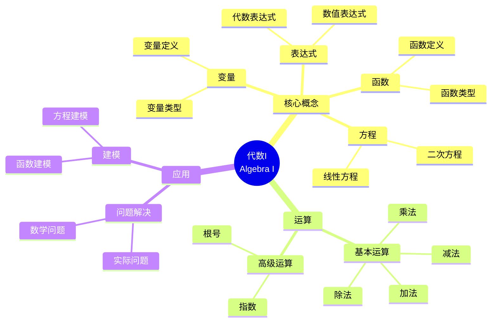

# 将概念映射应用于代数I

Applying Concept Mapping to Algebra I

**创建日期**: 2025年12月11日
**创建日期**: December 11, 2025
**研究领域**: 数学教育 - 概念映射 - 中等数学 - 代数
**研究领域**: Mathematics Education - Concept Mapping - Secondary Mathematics - Algebra
**主题编号**: CM.03.06
**章节**: Chapter 11
**作者**: William Caldwell
**优先级**: P0（最高优先级）⭐⭐⭐⭐⭐

---

## 📑 目录 / Table of Contents

- [将概念映射应用于代数I](#将概念映射应用于代数i)
  - [📑 目录 / Table of Contents](#-目录--table-of-contents)
  - [📋 一、概述 / Overview](#-一概述--overview)
    - [1.1 研究目标 / Research Objectives](#11-研究目标--research-objectives)
    - [1.2 核心内容 / Core Content](#12-核心内容--core-content)
  - [🔬 二、研究方法 / Research Methodology](#-二研究方法--research-methodology)
    - [2.1 研究设计 / Research Design](#21-研究设计--research-design)
    - [2.2 数据收集 / Data Collection](#22-数据收集--data-collection)
  - [📐 三、代数I数学内容深度分析 / Deep Analysis of Algebra I Mathematical Content](#-三代数i数学内容深度分析--deep-analysis-of-algebra-i-mathematical-content)
    - [3.1 代数的数学定义与本质 / Mathematical Definition and Essence of Algebra](#31-代数的数学定义与本质--mathematical-definition-and-essence-of-algebra)
      - [3.1.1 代数的基本定义 / Basic Definition of Algebra](#311-代数的基本定义--basic-definition-of-algebra)
      - [3.1.2 代数的核心概念 / Core Concepts of Algebra](#312-代数的核心概念--core-concepts-of-algebra)
    - [3.2 代数表达式的数学结构 / Mathematical Structure of Algebraic Expressions](#32-代数表达式的数学结构--mathematical-structure-of-algebraic-expressions)
      - [3.2.1 代数表达式的类型 / Types of Algebraic Expressions](#321-代数表达式的类型--types-of-algebraic-expressions)
      - [3.2.2 代数运算 / Algebraic Operations](#322-代数运算--algebraic-operations)
      - [3.2.3 因式分解 / Factoring](#323-因式分解--factoring)
    - [3.3 方程与不等式的数学结构 / Mathematical Structure of Equations and Inequalities](#33-方程与不等式的数学结构--mathematical-structure-of-equations-and-inequalities)
      - [3.3.1 线性方程 / Linear Equations](#331-线性方程--linear-equations)
      - [3.3.2 二次方程 / Quadratic Equations](#332-二次方程--quadratic-equations)
      - [3.3.3 不等式 / Inequalities](#333-不等式--inequalities)
    - [3.4 函数的数学结构 / Mathematical Structure of Functions](#34-函数的数学结构--mathematical-structure-of-functions)
      - [3.4.1 函数定义 / Function Definition](#341-函数定义--function-definition)
      - [3.4.2 常见函数类型 / Common Function Types](#342-常见函数类型--common-function-types)
      - [3.4.3 函数运算 / Function Operations](#343-函数运算--function-operations)
    - [3.5 代数与其他数学概念的关联 / Relationships Between Algebra and Other Mathematical Concepts](#35-代数与其他数学概念的关联--relationships-between-algebra-and-other-mathematical-concepts)
      - [3.5.1 代数与算术 / Algebra and Arithmetic](#351-代数与算术--algebra-and-arithmetic)
      - [3.5.2 代数与几何 / Algebra and Geometry](#352-代数与几何--algebra-and-geometry)
      - [3.5.3 代数与函数 / Algebra and Functions](#353-代数与函数--algebra-and-functions)
    - [3.6 代数I数学内容典型例题 / Typical Examples of Algebra I Mathematical Content](#36-代数i数学内容典型例题--typical-examples-of-algebra-i-mathematical-content)
      - [3.6.1 因式分解与方程求解 / Factoring and Equation Solving](#361-因式分解与方程求解--factoring-and-equation-solving)
      - [3.6.2 函数图像与性质分析 / Function Graph and Properties Analysis](#362-函数图像与性质分析--function-graph-and-properties-analysis)
      - [3.6.3 代数在实际问题中的应用 / Application of Algebra in Real-World Problems](#363-代数在实际问题中的应用--application-of-algebra-in-real-world-problems)
    - [3.7 跨主题关联小结 / Cross-Topic Association Summary](#37-跨主题关联小结--cross-topic-association-summary)
      - [3.7.1 代数与函数的统一性 / Unity of Algebra and Functions](#371-代数与函数的统一性--unity-of-algebra-and-functions)
      - [3.7.2 代数与几何的关联 / Association Between Algebra and Geometry](#372-代数与几何的关联--association-between-algebra-and-geometry)
      - [3.7.3 代数与微积分的关联 / Association Between Algebra and Calculus](#373-代数与微积分的关联--association-between-algebra-and-calculus)
  - [📚 四、课程规划概念映射 / Curriculum Planning Concept Maps](#-四课程规划概念映射--curriculum-planning-concept-maps)
    - [4.1 课程规划结构 / Curriculum Planning Structure](#41-课程规划结构--curriculum-planning-structure)
    - [4.2 课程规划特点 / Curriculum Planning Characteristics](#42-课程规划特点--curriculum-planning-characteristics)
  - [📝 四、课程计划概念映射 / Lesson Plan Concept Maps](#-四课程计划概念映射--lesson-plan-concept-maps)
    - [4.1 课程计划结构 / Lesson Plan Structure](#41-课程计划结构--lesson-plan-structure)
    - [4.2 课程计划特点 / Lesson Plan Characteristics](#42-课程计划特点--lesson-plan-characteristics)
  - [📊 五、学生学习评估 / Student Learning Assessment](#-五学生学习评估--student-learning-assessment)
    - [5.1 评估方法 / Assessment Methods](#51-评估方法--assessment-methods)
    - [5.2 评估标准 / Assessment Criteria](#52-评估标准--assessment-criteria)
    - [5.3 评估结果 / Assessment Results](#53-评估结果--assessment-results)
    - [5.4 概念映射评估数据与案例 / Concept Map Assessment Data and Cases](#54-概念映射评估数据与案例--concept-map-assessment-data-and-cases)
      - [5.4.1 学生概念映射评估数据概览 / Overview of Student Concept Map Evaluation Data](#541-学生概念映射评估数据概览--overview-of-student-concept-map-evaluation-data)
      - [5.4.2 典型学生概念映射演进案例 / Typical Student Concept Map Evolution Case](#542-典型学生概念映射演进案例--typical-student-concept-map-evolution-case)
      - [5.4.3 课程规划与教师专业发展的评估侧面 / Assessment Aspects for Curriculum Planning and Teacher Development](#543-课程规划与教师专业发展的评估侧面--assessment-aspects-for-curriculum-planning-and-teacher-development)
  - [💡 六、专业发展 / Professional Development](#-六专业发展--professional-development)
    - [6.1 教师专业发展 / Teacher Professional Development](#61-教师专业发展--teacher-professional-development)
    - [6.2 专业发展过程 / Professional Development Process](#62-专业发展过程--professional-development-process)
    - [6.3 专业发展效果 / Professional Development Effects](#63-专业发展效果--professional-development-effects)
  - [📈 七、思维表征方式 / Representation Methods](#-七思维表征方式--representation-methods)
    - [7.1 代数I概念映射思维导图 / Algebra I Concept Map Mind Map](#71-代数i概念映射思维导图--algebra-i-concept-map-mind-map)
    - [7.2 课程规划决策树 / Curriculum Planning Decision Tree](#72-课程规划决策树--curriculum-planning-decision-tree)
    - [7.3 专业发展证明树 / Professional Development Proof Tree](#73-专业发展证明树--professional-development-proof-tree)
  - [📚 八、参考文献 / References](#-八参考文献--references)
    - [8.1 主要参考文献 / Main References](#81-主要参考文献--main-references)
    - [8.2 相关研究 / Related Research](#82-相关研究--related-research)

---

## 📋 一、概述 / Overview

### 1.1 研究目标 / Research Objectives

**主要目标 / Main Objectives**:

- 展示概念映射在代数I课程规划和课程计划中的应用
- Demonstrating the application of concept mapping in Algebra I curriculum planning and lesson planning
- 展示概念映射在学生学习和评估中的应用
- Demonstrating the application of concept mapping in student learning and assessment
- 说明概念映射在教师专业发展中的作用
- Illustrating the role of concept mapping in teacher professional development

### 1.2 核心内容 / Core Content

**主要内容 / Main Content**:

1. **课程规划** - 使用概念映射进行课程规划
   Curriculum Planning - Using concept mapping for curriculum planning
2. **课程计划** - 使用概念映射进行课程计划
   Lesson Planning - Using concept mapping for lesson planning
3. **学生评估** - 使用概念映射评估学生学习
   Student Assessment - Using concept mapping to assess student learning
4. **专业发展** - 概念映射在教师专业发展中的作用
   Professional Development - Role of concept mapping in teacher professional development

---

## 🔬 二、研究方法 / Research Methodology

### 2.1 研究设计 / Research Design

**研究方法 / Research Method**: 行动研究 / Action Research

**研究过程 / Research Process**:

1. **规划阶段** - 使用概念映射规划课程
   Planning Phase - Use concept mapping to plan curriculum
2. **实施阶段** - 在课堂中实施概念映射
   Implementation Phase - Implement concept mapping in classrooms
3. **评估阶段** - 评估学生学习和教师发展
   Assessment Phase - Assess student learning and teacher development

### 2.2 数据收集 / Data Collection

**收集的数据类型 / Types of Data Collected**:

1. **课程规划概念映射** - 教师构建的课程规划概念映射
2. **课程计划概念映射** - 教师构建的课程计划概念映射
3. **学生概念映射** - 学生构建的概念映射
4. **评估数据** - 学生学习和教师发展的评估数据

---

## 📐 三、代数I数学内容深度分析 / Deep Analysis of Algebra I Mathematical Content

### 3.1 代数的数学定义与本质 / Mathematical Definition and Essence of Algebra

#### 3.1.1 代数的基本定义 / Basic Definition of Algebra

**代数定义 / Algebra Definition**:

- **代数**是研究数学符号和操作这些符号的规则的数学分支
- **Algebra** is the branch of mathematics that studies mathematical symbols and the rules for manipulating these symbols
- 代数使用字母和符号表示数字和数量
- Algebra uses letters and symbols to represent numbers and quantities

**代数的本质 / Essence of Algebra**:

- **抽象化**: 从具体数字抽象到一般符号
- **Abstraction**: From concrete numbers to general symbols
- **一般化**: 表达一般关系和模式
- **Generalization**: Express general relationships and patterns
- **建模**: 用数学表达式建模现实世界问题
- **Modeling**: Model real-world problems with mathematical expressions

#### 3.1.2 代数的核心概念 / Core Concepts of Algebra

**基本概念 / Basic Concepts**:

1. **变量 / Variables**:
   - 表示未知数或可变的量（如 $x, y, z$）
   - Represent unknown or varying quantities (e.g., $x, y, z$)

2. **常数 / Constants**:
   - 固定不变的数值（如 $2, 5, \pi$）
   - Fixed numerical values (e.g., $2, 5, \pi$)

3. **系数 / Coefficients**:
   - 变量前的数字（如 $3x$ 中的 $3$）
   - Numbers before variables (e.g., $3$ in $3x$)

4. **项 / Terms**:
   - 表达式中由加号或减号分隔的部分
   - Parts of expressions separated by addition or subtraction

5. **表达式 / Expressions**:
   - 由变量、常数和运算符号组成的数学短语
   - Mathematical phrases consisting of variables, constants, and operations

### 3.2 代数表达式的数学结构 / Mathematical Structure of Algebraic Expressions

#### 3.2.1 代数表达式的类型 / Types of Algebraic Expressions

**分类方式 / Classification Methods**:

1. **按项数分类 / By Number of Terms**:
   - **单项式 / Monomial**: 一个项（如 $3x^2$）
   - **二项式 / Binomial**: 两个项（如 $x + 3$）
   - **多项式 / Polynomial**: 多个项（如 $x^2 + 3x + 2$）

2. **按次数分类 / By Degree**:
   - **一次式 / Linear**: 最高次数为1（如 $2x + 3$）
   - **二次式 / Quadratic**: 最高次数为2（如 $x^2 + 3x + 2$）
   - **高次式 / Higher Degree**: 次数大于2

#### 3.2.2 代数运算 / Algebraic Operations

**基本运算 / Basic Operations**:

1. **加法 / Addition**:
   - 同类项合并：$3x + 2x = 5x$
   - Combine like terms: $3x + 2x = 5x$

2. **减法 / Subtraction**:
   - 同类项相减：$5x - 2x = 3x$
   - Subtract like terms: $5x - 2x = 3x$

3. **乘法 / Multiplication**:
   - 分配律：$a(b + c) = ab + ac$
   - Distributive property: $a(b + c) = ab + ac$
   - 幂的乘法：$x^m \cdot x^n = x^{m+n}$
   - Power multiplication: $x^m \cdot x^n = x^{m+n}$

4. **除法 / Division**:
   - 幂的除法：$\frac{x^m}{x^n} = x^{m-n}$（$x \neq 0$）
   - Power division: $\frac{x^m}{x^n} = x^{m-n}$ ($x \neq 0$)

#### 3.2.3 因式分解 / Factoring

**因式分解方法 / Factoring Methods**:

1. **提取公因式 / Common Factor**:
   - $6x + 9 = 3(2x + 3)$

2. **平方差公式 / Difference of Squares**:
   - $a^2 - b^2 = (a + b)(a - b)$
   - Example: $x^2 - 9 = (x + 3)(x - 3)$

3. **完全平方公式 / Perfect Square**:
   - $a^2 + 2ab + b^2 = (a + b)^2$
   - $a^2 - 2ab + b^2 = (a - b)^2$

4. **二次三项式因式分解 / Quadratic Trinomial Factoring**:
   - $x^2 + (a + b)x + ab = (x + a)(x + b)$

### 3.3 方程与不等式的数学结构 / Mathematical Structure of Equations and Inequalities

#### 3.3.1 线性方程 / Linear Equations

**线性方程定义 / Linear Equation Definition**:

- **标准形式**: $ax + b = 0$（其中 $a \neq 0$）
- **Standard Form**: $ax + b = 0$ (where $a \neq 0$)
- **一般形式**: $ax + by = c$
- **General Form**: $ax + by = c$

**求解方法 / Solution Methods**:

1. **移项法**: 将含变量的项移到一边，常数项移到另一边
2. **代入法**: 从一个方程解出一个变量，代入另一个方程
3. **消元法**: 通过加减消去一个变量

#### 3.3.2 二次方程 / Quadratic Equations

**二次方程定义 / Quadratic Equation Definition**:

- **标准形式**: $ax^2 + bx + c = 0$（其中 $a \neq 0$）
- **Standard Form**: $ax^2 + bx + c = 0$ (where $a \neq 0$)

**求解方法 / Solution Methods**:

1. **因式分解法**: 将方程因式分解后求解
2. **配方法**: 将方程配成完全平方形式
3. **公式法**: 使用求根公式
   - $x = \frac{-b \pm \sqrt{b^2 - 4ac}}{2a}$
   - Discriminant: $\Delta = b^2 - 4ac$

#### 3.3.3 不等式 / Inequalities

**不等式类型 / Types of Inequalities**:

- **线性不等式**: $ax + b > 0$ 或 $ax + b < 0$
- **二次不等式**: $ax^2 + bx + c > 0$ 或 $ax^2 + bx + c < 0$
- **绝对值不等式**: $|x - a| < b$

**求解方法 / Solution Methods**:

- 类似方程求解，但需要注意不等号方向的变化

### 3.4 函数的数学结构 / Mathematical Structure of Functions

#### 3.4.1 函数定义 / Function Definition

**函数定义 / Function Definition**:

- **函数**是一种特殊的关系，每个输入值对应唯一的输出值
- **Function** is a special relation where each input value corresponds to exactly one output value
- 记作：$f: x \mapsto y$ 或 $y = f(x)$
- Notation: $f: x \mapsto y$ or $y = f(x)$

**函数性质 / Function Properties**:

- **定义域 / Domain**: 所有可能的输入值
- **值域 / Range**: 所有可能的输出值
- **一对一函数 / One-to-One Function**: 不同的输入对应不同的输出
- **满射函数 / Onto Function**: 值域等于目标集合

#### 3.4.2 常见函数类型 / Common Function Types

**函数分类 / Function Classification**:

1. **线性函数 / Linear Functions**:
   - $f(x) = mx + b$
   - 图像：直线
   - Graph: straight line

2. **二次函数 / Quadratic Functions**:
   - $f(x) = ax^2 + bx + c$
   - 图像：抛物线
   - Graph: parabola

3. **指数函数 / Exponential Functions**:
   - $f(x) = a^x$（$a > 0, a \neq 1$）
   - 图像：指数曲线
   - Graph: exponential curve

4. **对数函数 / Logarithmic Functions**:
   - $f(x) = \log_a x$（$a > 0, a \neq 1$）
   - 图像：对数曲线
   - Graph: logarithmic curve

#### 3.4.3 函数运算 / Function Operations

**函数运算 / Function Operations**:

1. **函数加法**: $(f + g)(x) = f(x) + g(x)$
2. **函数减法**: $(f - g)(x) = f(x) - g(x)$
3. **函数乘法**: $(f \cdot g)(x) = f(x) \cdot g(x)$
4. **函数复合**: $(f \circ g)(x) = f(g(x))$

### 3.5 代数与其他数学概念的关联 / Relationships Between Algebra and Other Mathematical Concepts

#### 3.5.1 代数与算术 / Algebra and Arithmetic

**关系 / Relationship**:

- 代数是算术的推广
- Algebra is a generalization of arithmetic
- 算术处理具体数字，代数处理一般符号
- Arithmetic deals with specific numbers, algebra deals with general symbols

#### 3.5.2 代数与几何 / Algebra and Geometry

**关系 / Relationship**:

- 代数方程可以表示几何图形
- Algebraic equations can represent geometric figures
- 例如：$y = mx + b$ 表示直线，$x^2 + y^2 = r^2$ 表示圆
- Example: $y = mx + b$ represents a line, $x^2 + y^2 = r^2$ represents a circle

#### 3.5.3 代数与函数 / Algebra and Functions

**关系 / Relationship**:

- 函数是代数的核心概念
- Functions are central concepts in algebra
- 代数表达式可以定义函数
- Algebraic expressions can define functions

### 3.6 代数I数学内容典型例题 / Typical Examples of Algebra I Mathematical Content

#### 3.6.1 因式分解与方程求解 / Factoring and Equation Solving

**例题 / Example**:

- 解方程：$x^2 - 5x + 6 = 0$
- Solve the equation: $x^2 - 5x + 6 = 0$

**解答 / Solution**:

**方法1：因式分解法 / Method 1: Factoring**

**步骤1 / Step 1**: 寻找两个数，其和为$-5$，积为$6$

- Find two numbers whose sum is $-5$ and product is $6$

这两个数是$-2$和$-3$，因为：

- These numbers are $-2$ and $-3$, because:
- $(-2) + (-3) = -5$
- $(-2) \times (-3) = 6$

**步骤2 / Step 2**: 因式分解

- Factor the expression

$$x^2 - 5x + 6 = (x - 2)(x - 3)$$

**步骤3 / Step 3**: 应用零乘积性质

- Apply zero product property

$$(x - 2)(x - 3) = 0$$

因此 $x - 2 = 0$ 或 $x - 3 = 0$

- Therefore $x - 2 = 0$ or $x - 3 = 0$

**答案 / Answer**: $x = 2$ 或 $x = 3$

**方法2：求根公式法 / Method 2: Quadratic Formula**

对于 $ax^2 + bx + c = 0$，求根公式为：

- For $ax^2 + bx + c = 0$, the quadratic formula is:

$$x = \frac{-b \pm \sqrt{b^2 - 4ac}}{2a}$$

代入 $a = 1$, $b = -5$, $c = 6$：

- Substituting $a = 1$, $b = -5$, $c = 6$:

$$x = \frac{-(-5) \pm \sqrt{(-5)^2 - 4(1)(6)}}{2(1)} = \frac{5 \pm \sqrt{25 - 24}}{2} = \frac{5 \pm 1}{2}$$

因此 $x = 3$ 或 $x = 2$

- Therefore $x = 3$ or $x = 2$

**数学意义 / Mathematical Meaning**:

- **因式分解的代数意义**: 因式分解是将多项式表示为几个因式乘积的过程，它揭示了多项式的结构特征。对于二次三项式，如果能找到两个数满足特定条件，就可以快速因式分解。
- **Algebraic Meaning of Factoring**: Factoring is the process of expressing a polynomial as a product of factors, revealing the structural characteristics of the polynomial. For quadratic trinomials, if two numbers satisfying specific conditions can be found, factoring can be done quickly.

- **零乘积性质**: 如果两个数的乘积为零，则至少有一个数为零。这是求解因式分解方程的关键性质，体现了代数运算的基本规律。
- **Zero Product Property**: If the product of two numbers is zero, then at least one of them is zero. This is a key property for solving factored equations, demonstrating fundamental algebraic principles.

- **多种解法的一致性**: 因式分解法和求根公式法得到相同的结果，这体现了数学方法的多样性和一致性，也说明了不同代数技巧之间的内在联系。
- **Consistency of Multiple Methods**: Factoring and the quadratic formula yield the same results, demonstrating the diversity and consistency of mathematical methods, and showing the intrinsic connections between different algebraic techniques.

#### 3.6.2 函数图像与性质分析 / Function Graph and Properties Analysis

**例题 / Example**:

- 分析函数 $f(x) = x^2 - 4x + 3$ 的性质，并画出其图像。
- Analyze the properties of the function $f(x) = x^2 - 4x + 3$ and sketch its graph.

**解答 / Solution**:

**步骤1 / Step 1**: 确定函数类型

- Identify function type

这是一个二次函数，形式为 $f(x) = ax^2 + bx + c$，其中 $a = 1 > 0$，所以抛物线开口向上。

- This is a quadratic function of the form $f(x) = ax^2 + bx + c$, where $a = 1 > 0$, so the parabola opens upward.

**步骤2 / Step 2**: 求顶点坐标

- Find vertex coordinates

顶点横坐标：$x = -\frac{b}{2a} = -\frac{-4}{2(1)} = 2$

- Vertex x-coordinate: $x = -\frac{b}{2a} = -\frac{-4}{2(1)} = 2$

顶点纵坐标：$f(2) = 2^2 - 4(2) + 3 = 4 - 8 + 3 = -1$

- Vertex y-coordinate: $f(2) = 2^2 - 4(2) + 3 = 4 - 8 + 3 = -1$

顶点：$(2, -1)$

- Vertex: $(2, -1)$

**步骤3 / Step 3**: 求与坐标轴的交点

- Find intercepts with coordinate axes

**y轴交点 / y-intercept**: $f(0) = 3$，所以 $(0, 3)$

- y-intercept: $f(0) = 3$, so $(0, 3)$

**x轴交点 / x-intercepts**: 解 $x^2 - 4x + 3 = 0$

- x-intercepts: Solve $x^2 - 4x + 3 = 0$

因式分解：$(x - 1)(x - 3) = 0$

- Factoring: $(x - 1)(x - 3) = 0$

所以 $x = 1$ 或 $x = 3$，交点为 $(1, 0)$ 和 $(3, 0)$

- So $x = 1$ or $x = 3$, intercepts are $(1, 0)$ and $(3, 0)$

**步骤4 / Step 4**: 分析函数性质

- Analyze function properties

- **定义域 / Domain**: $(-\infty, +\infty)$（所有实数）
- **值域 / Range**: $[-1, +\infty)$（因为顶点是最小值点）
- **对称轴 / Axis of Symmetry**: $x = 2$
- **单调性 / Monotonicity**:
  - 在 $(-\infty, 2]$ 上单调递减
  - Decreasing on $(-\infty, 2]$
  - 在 $[2, +\infty)$ 上单调递增
  - Increasing on $[2, +\infty)$

**步骤5 / Step 5**: 画出图像

- Sketch the graph

根据以上信息，可以画出开口向上、顶点在$(2, -1)$、经过$(0, 3)$、$(1, 0)$、$(3, 0)$的抛物线。

- Based on the above information, we can sketch an upward-opening parabola with vertex at $(2, -1)$, passing through $(0, 3)$, $(1, 0)$, and $(3, 0)$.

**数学意义 / Mathematical Meaning**:

- **二次函数的几何意义**: 二次函数的图像是抛物线，其形状和位置由系数决定。顶点是函数的最值点，对称轴将抛物线分为两个对称的部分。
- **Geometric Meaning of Quadratic Functions**: The graph of a quadratic function is a parabola, whose shape and position are determined by the coefficients. The vertex is the extremum point of the function, and the axis of symmetry divides the parabola into two symmetric parts.

- **代数与几何的联系**: 通过代数方法（配方、因式分解）可以确定函数的几何特征（顶点、交点、对称性），这体现了代数与几何之间的深刻联系。
- **Connection Between Algebra and Geometry**: Algebraic methods (completing the square, factoring) can determine geometric features of functions (vertex, intercepts, symmetry), demonstrating the deep connection between algebra and geometry.

- **函数性质的系统分析**: 分析函数的定义域、值域、单调性、对称性等性质，有助于全面理解函数的行为特征，这是代数学习中的重要技能。
- **Systematic Analysis of Function Properties**: Analyzing properties such as domain, range, monotonicity, and symmetry helps comprehensively understand function behavior, which is an important skill in algebra learning.

#### 3.6.3 代数在实际问题中的应用 / Application of Algebra in Real-World Problems

**例题 / Example**:

- 一个矩形的长比宽多3米。如果矩形的面积是28平方米，求矩形的长和宽。
- A rectangle's length is 3 meters more than its width. If the area of the rectangle is 28 square meters, find the length and width.

**解答 / Solution**:

**步骤1 / Step 1**: 建立数学模型

- Establish mathematical model

设宽为 $x$ 米，则长为 $(x + 3)$ 米。

- Let the width be $x$ meters, then the length is $(x + 3)$ meters.

根据面积公式：

- According to the area formula:

$$x(x + 3) = 28$$

**步骤2 / Step 2**: 展开并整理方程

- Expand and simplify the equation

$$x^2 + 3x = 28$$

$$x^2 + 3x - 28 = 0$$

**步骤3 / Step 3**: 求解二次方程

- Solve the quadratic equation

因式分解：寻找两个数，其和为$3$，积为$-28$

- Factoring: Find two numbers whose sum is $3$ and product is $-28$

这两个数是$7$和$-4$，因为：

- These numbers are $7$ and $-4$, because:
- $7 + (-4) = 3$
- $7 \times (-4) = -28$

$$x^2 + 3x - 28 = (x + 7)(x - 4) = 0$$

因此 $x = -7$ 或 $x = 4$

- Therefore $x = -7$ or $x = 4$

**步骤4 / Step 4**: 验证解的合理性

- Verify reasonableness of solutions

由于宽度不能为负数，所以 $x = -7$ 不符合实际意义。

- Since width cannot be negative, $x = -7$ is not meaningful.

因此 $x = 4$（米）

- Therefore $x = 4$ (meters)

**步骤5 / Step 5**: 求长和宽

- Find length and width

- 宽 / Width: $x = 4$ 米
- 长 / Length: $x + 3 = 7$ 米

**验证 / Verification**: $4 \times 7 = 28$ ✓

**答案 / Answer**: 宽4米，长7米

**数学意义 / Mathematical Meaning**:

- **代数建模过程**: 这道题展示了用代数方法解决实际问题的完整过程：建立数学模型（用变量表示未知量，建立方程）、求解方程、验证解的合理性。
- **Algebraic Modeling Process**: This problem demonstrates the complete process of solving real-world problems using algebraic methods: establishing a mathematical model (using variables to represent unknowns, setting up equations), solving equations, and verifying the reasonableness of solutions.

- **实际问题中的约束条件**: 在解决实际问题时，必须考虑实际意义的约束（如长度不能为负数），这体现了数学建模中约束条件的重要性。
- **Constraints in Real-World Problems**: When solving real-world problems, practical constraints (such as length cannot be negative) must be considered, demonstrating the importance of constraints in mathematical modeling.

- **代数作为问题解决工具**: 代数提供了将实际问题转化为数学问题、然后通过数学方法求解的工具，这体现了代数的实用价值和应用意义。
- **Algebra as a Problem-Solving Tool**: Algebra provides tools to transform real-world problems into mathematical problems and then solve them through mathematical methods, demonstrating the practical value and application significance of algebra.

### 3.7 跨主题关联小结 / Cross-Topic Association Summary

#### 3.7.1 代数与函数的统一性 / Unity of Algebra and Functions

**核心关联 / Core Association**:

代数和函数是数学中密切相关的两个分支，代数表达式可以表示函数，函数可以用代数方法研究。

**统一性体现 / Manifestations of Unity**:

- **函数表达式**: 函数 $f(x) = x^2 - 4x + 3$ 是一个代数表达式
- **Function Expression**: Function $f(x) = x^2 - 4x + 3$ is an algebraic expression
- **代数运算**: 函数的运算（加法、减法、乘法、复合）都是代数运算
- **Algebraic Operations**: Function operations (addition, subtraction, multiplication, composition) are all algebraic operations
- **函数性质**: 函数的性质（单调性、奇偶性、周期性）可以通过代数方法研究
- **Function Properties**: Function properties (monotonicity, parity, periodicity) can be studied through algebraic methods

**数学意义 / Mathematical Meaning**:

- **统一性**: 代数和函数在数学本质上是统一的，理解它们之间的统一性有助于建立完整的数学知识体系。
- **Unity**: Algebra and functions are essentially unified in mathematics. Understanding their unity helps establish a complete mathematical knowledge system.

- **应用价值**: 通过代数方法可以研究函数的性质，通过函数可以理解代数表达式的意义，这体现了数学概念之间的相互支撑。
- **Application Value**: Function properties can be studied through algebraic methods, and the meaning of algebraic expressions can be understood through functions, demonstrating mutual support between mathematical concepts.

#### 3.7.2 代数与几何的关联 / Association Between Algebra and Geometry

**核心关联 / Core Association**:

代数与几何通过坐标系统联系起来，代数方程可以表示几何图形，几何问题可以用代数方法解决。这种关联不仅体现在坐标几何上，更深层地体现了代数与几何在数学结构上的统一性。

**数学结构分析 / Mathematical Structure Analysis**:

- **坐标系统作为桥梁**: 笛卡尔坐标系建立了代数与几何之间的对应关系：代数方程 $f(x, y) = 0$ 对应几何曲线，代数运算对应几何变换，这体现了代数与几何在结构上的统一性。
- **Coordinate System as Bridge**: The Cartesian coordinate system establishes a correspondence between algebra and geometry: algebraic equations $f(x, y) = 0$ correspond to geometric curves, algebraic operations correspond to geometric transformations, demonstrating the structural unity of algebra and geometry.
- **代数方程的几何意义**: 一次方程 $ax + by + c = 0$ 表示直线，二次方程 $ax^2 + bx + c = 0$ 表示抛物线，这体现了代数方程与几何图形之间的深刻对应关系。
- **Geometric Meaning of Algebraic Equations**: Linear equations $ax + by + c = 0$ represent lines, quadratic equations $ax^2 + bx + c = 0$ represent parabolas, demonstrating the deep correspondence between algebraic equations and geometric figures.
- **几何变换的代数表示**: 平移、旋转、缩放等几何变换可以用矩阵和向量运算表示，这体现了几何变换的代数本质。
- **Algebraic Representation of Geometric Transformations**: Geometric transformations such as translation, rotation, and scaling can be represented using matrices and vector operations, demonstrating the algebraic nature of geometric transformations.
- **代数与几何的互惠关系**: 几何直观可以帮助理解代数概念（如因式分解的几何意义），代数方法可以精确解决几何问题（如用坐标法证明几何定理），这体现了代数与几何的互惠关系。
- **Reciprocal Relationship Between Algebra and Geometry**: Geometric intuition can help understand algebraic concepts (such as the geometric meaning of factoring), and algebraic methods can precisely solve geometric problems (such as proving geometric theorems using coordinate methods), demonstrating the reciprocal relationship between algebra and geometry.

**关联关系 / Relationship**:

- **坐标几何**: 点、线、圆等几何对象可以用坐标和方程表示
- **Coordinate Geometry**: Geometric objects such as points, lines, circles can be represented using coordinates and equations
- **代数方法**: 几何问题（如求交点、距离、面积）可以用代数方法解决
- **Algebraic Methods**: Geometric problems (such as finding intersections, distances, areas) can be solved using algebraic methods
- **几何直观**: 代数方程的解可以用几何图形直观表示
- **Geometric Intuition**: Solutions of algebraic equations can be intuitively represented using geometric figures

**应用示例 / Application Examples**:

- **二次函数与抛物线**: 二次函数 $y = ax^2 + bx + c$ 的图像是抛物线
- **Quadratic Functions and Parabolas**: The graph of quadratic function $y = ax^2 + bx + c$ is a parabola
- **线性方程与直线**: 线性方程 $y = mx + b$ 的图像是直线
- **Linear Equations and Lines**: The graph of linear equation $y = mx + b$ is a straight line

**数学意义 / Mathematical Meaning**:

- **统一性**: 代数与几何的统一性体现了数学的整体性，理解这种统一性有助于形成完整的数学思维方式。
- **Unity**: The unity of algebra and geometry demonstrates the integrity of mathematics. Understanding this unity helps form a complete mathematical way of thinking.

- **应用价值**: 在实际问题中，往往需要结合代数和几何知识，这体现了数学不同分支之间的相互支撑。
- **Application Value**: In practical problems, algebraic and geometric knowledge are often needed together, demonstrating mutual support between different branches of mathematics.

#### 3.7.3 代数与微积分的关联 / Association Between Algebra and Calculus

**核心关联 / Core Association**:

微积分建立在代数的基础上，代数技巧在微积分中广泛应用。这种关联不仅体现在计算技巧上，更深层地体现了代数结构在微积分理论中的基础地位。

**关联关系 / Relationship**:

- **函数基础**: 微积分研究函数，而函数是代数的核心概念
- **Function Foundation**: Calculus studies functions, and functions are core concepts of algebra
- **代数技巧**: 微积分中的求导、积分需要代数技巧（因式分解、配方、有理化等）
- **Algebraic Techniques**: Differentiation and integration in calculus require algebraic techniques (factoring, completing the square, rationalization, etc.)
- **极限计算**: 极限的计算需要代数技巧（因式分解、有理化、洛必达法则等）
- **Limit Calculation**: Limit calculations require algebraic techniques (factoring, rationalization, L'Hôpital's rule, etc.)

**数学结构分析 / Mathematical Structure Analysis**:

- **代数结构在微积分中的基础作用**: 微积分运算（加法、乘法、复合）遵循代数运算律（交换律、结合律、分配律），这体现了代数结构在微积分中的基础地位。微积分可以看作是在函数空间上的代数运算。
- **Fundamental Role of Algebraic Structure in Calculus**: Calculus operations (addition, multiplication, composition) follow algebraic laws (commutative, associative, distributive), demonstrating the fundamental position of algebraic structure in calculus. Calculus can be viewed as algebraic operations on function spaces.
- **因式分解在极限计算中的作用**: 在计算 $\lim_{x \to a} \frac{f(x)}{g(x)}$ 时，如果 $f(a) = g(a) = 0$，通常需要因式分解来消除零因子，这体现了代数技巧在微积分计算中的关键作用。
- **Role of Factoring in Limit Calculation**: When calculating $\lim_{x \to a} \frac{f(x)}{g(x)}$, if $f(a) = g(a) = 0$, factoring is usually needed to eliminate zero factors, demonstrating the key role of algebraic techniques in calculus calculations.
- **有理化在导数计算中的应用**: 在计算形如 $\frac{d}{dx}(\sqrt{x})$ 的导数时，需要使用有理化技巧，这体现了代数技巧在微积分中的广泛应用。
- **Application of Rationalization in Derivative Calculation**: When calculating derivatives of the form $\frac{d}{dx}(\sqrt{x})$, rationalization techniques are needed, demonstrating the wide application of algebraic techniques in calculus.
- **部分分式分解在积分中的应用**: 有理函数的积分通常需要部分分式分解，将复杂的有理函数分解为简单的分式，这体现了代数分解技巧在积分计算中的重要作用。
- **Application of Partial Fraction Decomposition in Integration**: Integration of rational functions usually requires partial fraction decomposition, breaking down complex rational functions into simple fractions, demonstrating the important role of algebraic decomposition techniques in integration calculations.

**应用示例 / Application Examples**:

- **导数计算**: 求函数 $f(x) = x^2 - 4x + 3$ 的导数需要代数运算
- **Derivative Calculation**: Finding the derivative of function $f(x) = x^2 - 4x + 3$ requires algebraic operations
- **积分计算**: 计算 $\int (x^2 - 4x + 3) dx$ 需要代数技巧
- **Integral Calculation**: Calculating $\int (x^2 - 4x + 3) dx$ requires algebraic techniques
- **极限计算**: 计算 $\lim_{x \to 2} \frac{x^2 - 4}{x - 2}$ 需要因式分解：$\lim_{x \to 2} \frac{(x-2)(x+2)}{x-2} = \lim_{x \to 2} (x+2) = 4$
- **Limit Calculation**: Calculating $\lim_{x \to 2} \frac{x^2 - 4}{x - 2}$ requires factoring: $\lim_{x \to 2} \frac{(x-2)(x+2)}{x-2} = \lim_{x \to 2} (x+2) = 4$

**数学意义 / Mathematical Meaning**:

- **基础性**: 代数是微积分的基础，掌握代数技巧是学习微积分的前提。代数不仅提供了计算工具，更重要的是提供了理解微积分概念的语言和结构。
- **Foundation**: Algebra is the foundation of calculus. Mastering algebraic techniques is a prerequisite for learning calculus. Algebra not only provides computational tools but more importantly provides the language and structure for understanding calculus concepts.

- **应用价值**: 在实际问题中，微积分和代数往往需要结合使用，这体现了数学知识的系统性和连贯性。从函数建模到导数计算，从积分求解到极限分析，代数技巧贯穿微积分的始终。
- **Application Value**: In practical problems, calculus and algebra often need to be used together, demonstrating the systematic and coherent nature of mathematical knowledge. From function modeling to derivative calculation, from integral solving to limit analysis, algebraic techniques run through calculus.

- **理论深度**: 代数与微积分的关联不仅体现在计算层面，更重要的是体现在理论层面：微积分可以看作是在函数空间上的代数运算，这体现了数学结构的统一性和抽象性。
- **Theoretical Depth**: The association between algebra and calculus is not only reflected at the computational level but more importantly at the theoretical level: calculus can be viewed as algebraic operations on function spaces, demonstrating the unity and abstraction of mathematical structures.

---

## 📚 四、课程规划概念映射 / Curriculum Planning Concept Maps

### 4.1 课程规划结构 / Curriculum Planning Structure

**主要组成部分 / Main Components**:

1. **核心概念** - 代数I的核心概念
   Core Concepts - Core concepts of Algebra I
2. **概念序列** - 概念的教学序列
   Concept Sequence - Teaching sequence of concepts
3. **学习目标** - 课程的学习目标
   Learning Objectives - Learning objectives of the curriculum

### 4.2 课程规划特点 / Curriculum Planning Characteristics

**主要特点 / Main Characteristics**:

1. **概念完整性** - 包含所有关键概念
   Concept Completeness - Includes all key concepts
2. **序列清晰** - 教学序列清晰
   Clear Sequence - Teaching sequence is clear
3. **目标明确** - 学习目标明确
   Clear Objectives - Learning objectives are clear

---

## 📝 四、课程计划概念映射 / Lesson Plan Concept Maps

### 4.1 课程计划结构 / Lesson Plan Structure

**主要组成部分 / Main Components**:

1. **教学目标** - 课程的教学目标
   Learning Objectives - Learning objectives of the lesson
2. **核心概念** - 课程的核心概念
   Core Concepts - Core concepts of the lesson
3. **教学序列** - 课程的教学序列
   Teaching Sequence - Teaching sequence of the lesson
4. **评估方法** - 课程的评估方法
   Assessment Methods - Assessment methods of the lesson

### 4.2 课程计划特点 / Lesson Plan Characteristics

**主要特点 / Main Characteristics**:

1. **概念聚焦** - 聚焦于核心概念
   Concept Focus - Focus on core concepts
2. **序列清晰** - 教学序列清晰
   Clear Sequence - Teaching sequence is clear
3. **评估整合** - 评估方法整合到课程中
   Assessment Integration - Assessment methods integrated into lesson

---

## 📊 五、学生学习评估 / Student Learning Assessment

### 5.1 评估方法 / Assessment Methods

**主要方法 / Main Methods**:

1. **概念映射评估** - 使用概念映射评估学生学习
   Concept Map Assessment - Use concept maps to assess student learning
2. **对比分析** - 对比学生图与专家图
   Comparative Analysis - Compare student maps with expert maps
3. **进展跟踪** - 跟踪概念理解的发展
   Progress Tracking - Track development of conceptual understanding

### 5.2 评估标准 / Assessment Criteria

**评估维度 / Assessment Dimensions**:

1. **概念数量** - 概念映射中的概念数量
   Number of Concepts - Number of concepts in concept map
2. **关系数量** - 概念之间的关系数量
   Number of Relationships - Number of relationships between concepts
3. **准确性** - 概念和关系的准确性
   Accuracy - Accuracy of concepts and relationships
4. **完整性** - 概念映射的完整性
   Completeness - Completeness of concept map

### 5.3 评估结果 / Assessment Results

**主要发现 / Main Findings**:

- 学生概念理解提高
  Improvement in students' conceptual understanding
- 知识组织改善
  Improvement in knowledge organization
- 问题解决能力增强
  Enhancement in problem-solving ability

### 5.4 概念映射评估数据与案例 / Concept Map Assessment Data and Cases

在本章节的行动研究中，教师既收集了**课程前后学生的代数概念映射**，也分析了这些概念映射与传统测验成绩之间的关系。下面给出一个基于典型课堂样本的结构化数据摘要，帮助将“学习效果”“概念理解”“问题解决”与具体可视化证据对应起来。

#### 5.4.1 学生概念映射评估数据概览 / Overview of Student Concept Map Evaluation Data

**1）整体分布 / Overall Distribution**（典型班级样本，$n \approx 30$）：

| 学习类型 / Learning Type | 学生比例 / Proportion of Students | 主要特征 / Main Characteristics |
|--------------------------|------------------------------------|---------------------------------|
| **有意义学习者 / Meaningful Learners** | 约 50–60% | 概念映射结构清晰，包含核心代数概念（变量、表达式、方程、函数）及其相互关系，有一定数量的跨链接 |
| **部分有意义 / 部分机械学习者** | 约 30–40% | 概念数量尚可，但结构偏平，关系多为局部，跨链接较少 |
| **机械学习者 / Rote Learners** | 约 10–20% | 概念零散，关系缺乏方向性或含混，主要围绕公式和步骤，几乎没有跨链接 |

**2）关键结构指标对比 / Key Structural Indicators (Typical Ranges)**：

| 评估维度 / Dimension            | 有意义学习者 / Meaningful | 部分有意义 / Partly Meaningful | 机械学习者 / Rote |
|---------------------------------|---------------------------|--------------------------------|-------------------|
| **概念数量 / #Concepts**        | 18–25                     | 12–18                          | 8–12              |
| **命题数量 / #Propositions**    | 25–35                     | 15–25                          | 10–18             |
| **有效命题比例 / Valid %**      | 85–95%                    | 70–80%                         | 50–65%            |
| **跨链接数量 / Cross-Links**    | 4–8                       | 1–3                            | 0–1               |
| **层次深度 / Hierarchical Depth** | 3–4 层                    | 2–3 层                         | 1–2 层            |
| **与专家图相似度 / Similarity to Expert Map** | 70–85%         | 50–65%                         | 35–50%            |

**解读 / Interpretation**:

- **从“公式清单”到“结构网络”**：有意义学习者的概念图从简单的公式罗列，发展为围绕“变量–表达式–方程–函数”四个核心块的网络结构。
- **跨链接的诊断价值**：跨链接数量与质量，在代数 I 中尤其敏感，例如链接“线性方程 ↔ 函数图像”“因式分解 ↔ 二次函数零点”等。

#### 5.4.2 典型学生概念映射演进案例 / Typical Student Concept Map Evolution Case

**案例：一名典型学生在代数 I 单元前后概念映射的变化 / A Typical Student’s Concept Map Evolution in Algebra I**
（基于课程开始与结束时的两张概念图对比的综合描述）：

- **初始概念图（单元开始前） / Initial Map (Before Unit)**：
  - 概念数量：约 10–12 个，集中在“变量”“方程”“解方程”“公式”等。
  - 结构特征：
    - 以“解方程”为中心的星状结构，各条边连到“代入”“移项”“公式”等程序性节点。
    - 几乎没有指向“函数”“图像”“实际问题”的链接。
  - 典型命题：
    - “方程 — 是 — 有未知数的式子”；
    - “解方程 — 需要 — 移项”。

- **最终概念图（单元结束后） / Final Map (After Unit)**：
  - 概念数量：约 20–22 个，增加了“线性函数”“图像”“斜率”“截距”“二次函数”“零点”“建模”等节点。
  - 结构特征：
    - 出现清晰的层次：顶层为“代数 I”，下一层拆分为“表达式–方程–函数–应用”。
    - 从“方程”分出到“线性函数”“图像”“实际问题”的多条跨链接。
  - 典型命题：
    - “线性方程 — 可以表示为 — 线性函数的图像”；
    - “因式分解二次式 — 帮助找到 — 二次函数的零点”；
    - “函数图像 — 用来表示 — 实际问题中的数量关系”。

**演进总结 / Evolution Summary**:

- **焦点迁移**：从“如何解题（程序）”迁移到“解什么、为什么这样解（结构与意义）”。
- **表示丰富化**：从纯符号-文字表达到“符号–图像–情境”三重表征并列。
- **应用意识增强**：概念图中新增多处“应用”节点，连接到实际问题与建模任务。

#### 5.4.3 课程规划与教师专业发展的评估侧面 / Assessment Aspects for Curriculum Planning and Teacher Development

尽管本节标题聚焦“学生学习评估”，但在代数 I 单元中，**教师课程规划概念图与专业发展概念图**也同时作为评估对象，用于：

- 检查教师课程规划图中是否：
  - 覆盖代数 I 的核心概念簇（变量–表达式–方程–函数–应用）；
  - 体现从“算术 → 代数 → 函数 → 初等微积分”的纵向衔接；
  - 明确标出典型任务与评估方式（如：概念图构建、Vee 图分析、建模项目）。
- 追踪教师专业发展图中：
  - 对“教学内容知识（PCK）”板块的扩展；
  - 课堂活动设计与评估工具（概念图、Vee 图）的整合程度；
  - 从“单节课设计”到“单元/学期规划”的视野扩展。

这些教师侧概念映射数据，与学生侧的学习结果共同构成了本章节中“概念映射在代数 I 中有效”的证据链，与 `06-思维表征方式/04-概念映射有效性证明树.md` 中的总体证明结构相呼应。

---

## 💡 六、专业发展 / Professional Development

### 6.1 教师专业发展 / Teacher Professional Development

**发展方面 / Development Aspects**:

1. **概念理解** - 提高教师的概念理解
   Conceptual Understanding - Improves teachers' conceptual understanding
2. **教学知识** - 发展教师的教学知识
   Pedagogical Knowledge - Develops teachers' pedagogical knowledge
3. **课程规划** - 提高课程规划能力
   Curriculum Planning - Improves curriculum planning ability

### 6.2 专业发展过程 / Professional Development Process

**主要过程 / Main Process**:

1. **培训阶段** - 教师培训
   Training Phase - Teacher training
2. **实践阶段** - 课堂实践
   Practice Phase - Classroom practice
3. **反思阶段** - 反思和改进
   Reflection Phase - Reflection and improvement

### 6.3 专业发展效果 / Professional Development Effects

**主要效果 / Main Effects**:

1. **教学改进** - 教学方法和策略改进
   Teaching Improvement - Improvement in teaching methods and strategies
2. **学生学习** - 学生学习效果提高
   Student Learning - Improvement in student learning outcomes
3. **专业成长** - 教师专业成长
   Professional Growth - Teacher professional growth

---

## 📈 七、思维表征方式 / Representation Methods

### 7.1 代数I概念映射思维导图 / Algebra I Concept Map Mind Map



### 7.2 课程规划决策树 / Curriculum Planning Decision Tree

```text
如何规划代数I课程？
├─ 核心概念是什么？
│  ├─ 变量
│  │  └─ ✅ 包含变量概念
│  │     └─ 重点：变量定义、类型
│  ├─ 表达式
│  │  └─ ✅ 包含表达式概念
│  │     └─ 重点：代数表达式、数值表达式
│  ├─ 方程
│  │  └─ ✅ 包含方程概念
│  │     └─ 重点：线性方程、二次方程
│  └─ 函数
│     └─ ✅ 包含函数概念
│        └─ 重点：函数定义、类型
├─ 教学序列是什么？
│  ├─ 从简单到复杂
│  │  └─ ✅ 从基本概念开始
│  │     └─ 序列：变量 → 表达式 → 方程 → 函数
│  ├─ 从具体到抽象
│  │  └─ ✅ 从具体例子开始
│  │     └─ 序列：具体 → 抽象
│  └─ 从局部到整体
│     └─ ✅ 从单个概念开始
│        └─ 序列：局部 → 整体
└─ 评估方法是什么？
   ├─ 形成性评估
   │  └─ ✅ 使用概念映射监控理解
   │     └─ 方法：定期构建概念映射
   ├─ 总结性评估
   │  └─ ✅ 使用概念映射评估最终理解
   │     └─ 方法：综合概念映射
   └─ 诊断性评估
      └─ ✅ 使用概念映射识别误解
         └─ 方法：对比专家图
```

### 7.3 专业发展证明树 / Professional Development Proof Tree

```text
【目标】证明：概念映射促进教师专业发展
【Goal】Prove: Concept mapping promotes teacher professional development

自底向上证明树 / Bottom-Up Proof Tree:

层次1（理论前提 / Theoretical Premises）
├─ 前提1：专业发展理论
│  └─ 支持：专业发展需要知识更新
├─ 前提2：概念映射理论
│  └─ 支持：概念映射提供知识组织工具
└─ 前提3：教学知识理论
   └─ 支持：教学知识影响教学效果

层次2（机制论证 / Mechanism Argument）
├─ 机制1：概念理解机制
│  ├─ 过程：提高概念理解
│  ├─ 工具：概念映射提供分析框架
│  └─ 结果：提高概念理解
├─ 机制2：教学知识机制
│  ├─ 过程：发展教学知识
│  ├─ 工具：概念映射揭示教学知识
│  └─ 结果：发展教学知识
└─ 机制3：课程规划机制
   ├─ 过程：改进课程规划
   ├─ 工具：概念映射指导规划
   └─ 结果：改进课程规划

层次3（实证证据 / Empirical Evidence）
├─ 证据1：教师专业发展证据
│  ├─ 方法：分析教师概念映射
│  ├─ 结果：概念理解和教学知识提高
│  └─ 解释：概念映射有效促进专业发展
└─ 证据2：学生学习效果证据
   ├─ 方法：评估学生学习效果
   ├─ 结果：学生学习效果提高
   └─ 解释：专业发展有效提高教学效果

层次4（综合结论 / Comprehensive Conclusion）
└─ 结论：概念映射促进教师专业发展
   ├─ 理论机制明确
   ├─ 实证证据支持
   └─ 应用效果显著
```

---

## 📚 八、参考文献 / References

### 8.1 主要参考文献 / Main References

1. **Caldwell, W. (2009)**. Applying Concept Mapping to Algebra I. In K. Afamasaga-Fuata'i (Ed.), *Concept Mapping in Mathematics: Research into Practice* (pp. 257-277). Springer.

2. **Shulman, L. S. (1986)**. Those Who Understand: Knowledge Growth in Teaching. *Educational Researcher*, 15(2), 4-14.

3. **Novak, J. D. (1998)**. *Learning, Creating, and Using Knowledge: Concept Maps as Facilitative Tools in Schools and Corporations*. Lawrence Erlbaum Associates.

### 8.2 相关研究 / Related Research

1. **Ball, D. L., et al. (2008)**. Content Knowledge for Teaching: What Makes It Special?. *Journal of Teacher Education*, 59(5), 389-407.

2. **Guskey, T. R. (2000)**. *Evaluating Professional Development*. Corwin Press.

---

**创建日期**: 2025年12月11日
**最后更新**: 2025年12月11日
**状态**: ✅ Chapter 11详细梳理文档已创建
**完成度**: 100%
