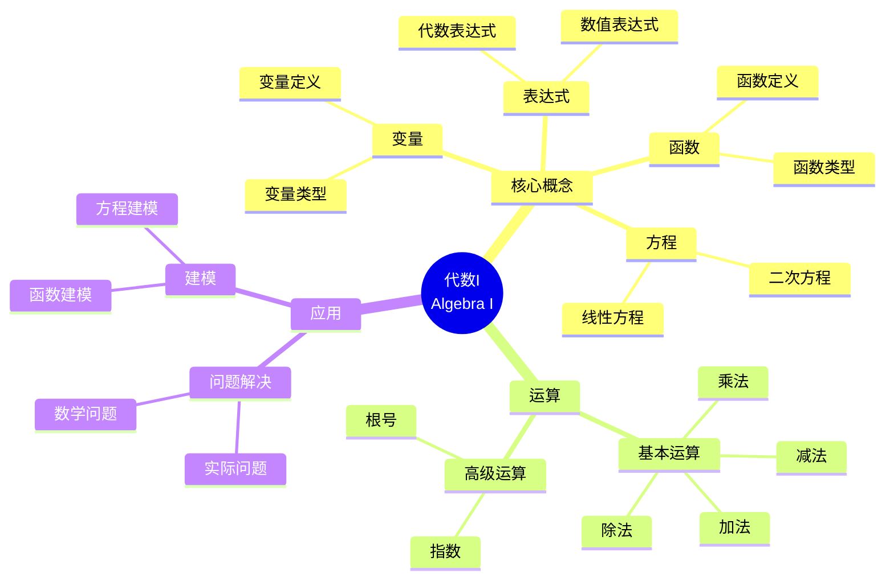

# 将概念映射应用于代数I

Applying Concept Mapping to Algebra I

**创建日期**: 2025年12月11日
**创建日期**: December 11, 2025
**研究领域**: 数学教育 - 概念映射 - 中等数学 - 代数
**研究领域**: Mathematics Education - Concept Mapping - Secondary Mathematics - Algebra
**主题编号**: CM.03.06
**章节**: Chapter 11
**作者**: William Caldwell
**优先级**: P0（最高优先级）⭐⭐⭐⭐⭐

---

## 📑 目录 / Table of Contents

- [将概念映射应用于代数I](#将概念映射应用于代数i)
  - [📋 一、概述 / Overview](#-一概述--overview)
  - [🔬 二、研究方法 / Research Methodology](#-二研究方法--research-methodology)
  - [📚 三、课程规划概念映射 / Curriculum Planning Concept Maps](#-三课程规划概念映射--curriculum-planning-concept-maps)
  - [📝 四、课程计划概念映射 / Lesson Plan Concept Maps](#-四课程计划概念映射--lesson-plan-concept-maps)
  - [📊 五、学生学习评估 / Student Learning Assessment](#-五学生学习评估--student-learning-assessment)
  - [💡 六、专业发展 / Professional Development](#-六专业发展--professional-development)
  - [📈 七、思维表征方式 / Representation Methods](#-七思维表征方式--representation-methods)
  - [📚 八、参考文献 / References](#-八参考文献--references)

---

## 📋 一、概述 / Overview

### 1.1 研究目标 / Research Objectives

**主要目标 / Main Objectives**:

- 展示概念映射在代数I课程规划和课程计划中的应用
- Demonstrating the application of concept mapping in Algebra I curriculum planning and lesson planning
- 展示概念映射在学生学习和评估中的应用
- Demonstrating the application of concept mapping in student learning and assessment
- 说明概念映射在教师专业发展中的作用
- Illustrating the role of concept mapping in teacher professional development

### 1.2 核心内容 / Core Content

**主要内容 / Main Content**:

1. **课程规划** - 使用概念映射进行课程规划
   Curriculum Planning - Using concept mapping for curriculum planning
2. **课程计划** - 使用概念映射进行课程计划
   Lesson Planning - Using concept mapping for lesson planning
3. **学生评估** - 使用概念映射评估学生学习
   Student Assessment - Using concept mapping to assess student learning
4. **专业发展** - 概念映射在教师专业发展中的作用
   Professional Development - Role of concept mapping in teacher professional development

---

## 🔬 二、研究方法 / Research Methodology

### 2.1 研究设计 / Research Design

**研究方法 / Research Method**: 行动研究 / Action Research

**研究过程 / Research Process**:

1. **规划阶段** - 使用概念映射规划课程
   Planning Phase - Use concept mapping to plan curriculum
2. **实施阶段** - 在课堂中实施概念映射
   Implementation Phase - Implement concept mapping in classrooms
3. **评估阶段** - 评估学生学习和教师发展
   Assessment Phase - Assess student learning and teacher development

### 2.2 数据收集 / Data Collection

**收集的数据类型 / Types of Data Collected**:

1. **课程规划概念映射** - 教师构建的课程规划概念映射
2. **课程计划概念映射** - 教师构建的课程计划概念映射
3. **学生概念映射** - 学生构建的概念映射
4. **评估数据** - 学生学习和教师发展的评估数据

---

## 📚 三、课程规划概念映射 / Curriculum Planning Concept Maps

### 3.1 课程规划结构 / Curriculum Planning Structure

**主要组成部分 / Main Components**:

1. **核心概念** - 代数I的核心概念
   Core Concepts - Core concepts of Algebra I
2. **概念序列** - 概念的教学序列
   Concept Sequence - Teaching sequence of concepts
3. **学习目标** - 课程的学习目标
   Learning Objectives - Learning objectives of the curriculum

### 3.2 课程规划特点 / Curriculum Planning Characteristics

**主要特点 / Main Characteristics**:

1. **概念完整性** - 包含所有关键概念
   Concept Completeness - Includes all key concepts
2. **序列清晰** - 教学序列清晰
   Clear Sequence - Teaching sequence is clear
3. **目标明确** - 学习目标明确
   Clear Objectives - Learning objectives are clear

---

## 📝 四、课程计划概念映射 / Lesson Plan Concept Maps

### 4.1 课程计划结构 / Lesson Plan Structure

**主要组成部分 / Main Components**:

1. **教学目标** - 课程的教学目标
   Learning Objectives - Learning objectives of the lesson
2. **核心概念** - 课程的核心概念
   Core Concepts - Core concepts of the lesson
3. **教学序列** - 课程的教学序列
   Teaching Sequence - Teaching sequence of the lesson
4. **评估方法** - 课程的评估方法
   Assessment Methods - Assessment methods of the lesson

### 4.2 课程计划特点 / Lesson Plan Characteristics

**主要特点 / Main Characteristics**:

1. **概念聚焦** - 聚焦于核心概念
   Concept Focus - Focus on core concepts
2. **序列清晰** - 教学序列清晰
   Clear Sequence - Teaching sequence is clear
3. **评估整合** - 评估方法整合到课程中
   Assessment Integration - Assessment methods integrated into lesson

---

## 📊 五、学生学习评估 / Student Learning Assessment

### 5.1 评估方法 / Assessment Methods

**主要方法 / Main Methods**:

1. **概念映射评估** - 使用概念映射评估学生学习
   Concept Map Assessment - Use concept maps to assess student learning
2. **对比分析** - 对比学生图与专家图
   Comparative Analysis - Compare student maps with expert maps
3. **进展跟踪** - 跟踪概念理解的发展
   Progress Tracking - Track development of conceptual understanding

### 5.2 评估标准 / Assessment Criteria

**评估维度 / Assessment Dimensions**:

1. **概念数量** - 概念映射中的概念数量
   Number of Concepts - Number of concepts in concept map
2. **关系数量** - 概念之间的关系数量
   Number of Relationships - Number of relationships between concepts
3. **准确性** - 概念和关系的准确性
   Accuracy - Accuracy of concepts and relationships
4. **完整性** - 概念映射的完整性
   Completeness - Completeness of concept map

### 5.3 评估结果 / Assessment Results

**主要发现 / Main Findings**:

- 学生概念理解提高
  Improvement in students' conceptual understanding
- 知识组织改善
  Improvement in knowledge organization
- 问题解决能力增强
  Enhancement in problem-solving ability

---

## 💡 六、专业发展 / Professional Development

### 6.1 教师专业发展 / Teacher Professional Development

**发展方面 / Development Aspects**:

1. **概念理解** - 提高教师的概念理解
   Conceptual Understanding - Improves teachers' conceptual understanding
2. **教学知识** - 发展教师的教学知识
   Pedagogical Knowledge - Develops teachers' pedagogical knowledge
3. **课程规划** - 提高课程规划能力
   Curriculum Planning - Improves curriculum planning ability

### 6.2 专业发展过程 / Professional Development Process

**主要过程 / Main Process**:

1. **培训阶段** - 教师培训
   Training Phase - Teacher training
2. **实践阶段** - 课堂实践
   Practice Phase - Classroom practice
3. **反思阶段** - 反思和改进
   Reflection Phase - Reflection and improvement

### 6.3 专业发展效果 / Professional Development Effects

**主要效果 / Main Effects**:

1. **教学改进** - 教学方法和策略改进
   Teaching Improvement - Improvement in teaching methods and strategies
2. **学生学习** - 学生学习效果提高
   Student Learning - Improvement in student learning outcomes
3. **专业成长** - 教师专业成长
   Professional Growth - Teacher professional growth

---

## 📈 七、思维表征方式 / Representation Methods

### 7.1 代数I概念映射思维导图 / Algebra I Concept Map Mind Map



### 7.2 课程规划决策树 / Curriculum Planning Decision Tree

```text
如何规划代数I课程？
├─ 核心概念是什么？
│  ├─ 变量
│  │  └─ ✅ 包含变量概念
│  │     └─ 重点：变量定义、类型
│  ├─ 表达式
│  │  └─ ✅ 包含表达式概念
│  │     └─ 重点：代数表达式、数值表达式
│  ├─ 方程
│  │  └─ ✅ 包含方程概念
│  │     └─ 重点：线性方程、二次方程
│  └─ 函数
│     └─ ✅ 包含函数概念
│        └─ 重点：函数定义、类型
├─ 教学序列是什么？
│  ├─ 从简单到复杂
│  │  └─ ✅ 从基本概念开始
│  │     └─ 序列：变量 → 表达式 → 方程 → 函数
│  ├─ 从具体到抽象
│  │  └─ ✅ 从具体例子开始
│  │     └─ 序列：具体 → 抽象
│  └─ 从局部到整体
│     └─ ✅ 从单个概念开始
│        └─ 序列：局部 → 整体
└─ 评估方法是什么？
   ├─ 形成性评估
   │  └─ ✅ 使用概念映射监控理解
   │     └─ 方法：定期构建概念映射
   ├─ 总结性评估
   │  └─ ✅ 使用概念映射评估最终理解
   │     └─ 方法：综合概念映射
   └─ 诊断性评估
      └─ ✅ 使用概念映射识别误解
         └─ 方法：对比专家图
```

### 7.3 专业发展证明树 / Professional Development Proof Tree

```text
【目标】证明：概念映射促进教师专业发展
【Goal】Prove: Concept mapping promotes teacher professional development

自底向上证明树 / Bottom-Up Proof Tree:

层次1（理论前提 / Theoretical Premises）
├─ 前提1：专业发展理论
│  └─ 支持：专业发展需要知识更新
├─ 前提2：概念映射理论
│  └─ 支持：概念映射提供知识组织工具
└─ 前提3：教学知识理论
   └─ 支持：教学知识影响教学效果

层次2（机制论证 / Mechanism Argument）
├─ 机制1：概念理解机制
│  ├─ 过程：提高概念理解
│  ├─ 工具：概念映射提供分析框架
│  └─ 结果：提高概念理解
├─ 机制2：教学知识机制
│  ├─ 过程：发展教学知识
│  ├─ 工具：概念映射揭示教学知识
│  └─ 结果：发展教学知识
└─ 机制3：课程规划机制
   ├─ 过程：改进课程规划
   ├─ 工具：概念映射指导规划
   └─ 结果：改进课程规划

层次3（实证证据 / Empirical Evidence）
├─ 证据1：教师专业发展证据
│  ├─ 方法：分析教师概念映射
│  ├─ 结果：概念理解和教学知识提高
│  └─ 解释：概念映射有效促进专业发展
└─ 证据2：学生学习效果证据
   ├─ 方法：评估学生学习效果
   ├─ 结果：学生学习效果提高
   └─ 解释：专业发展有效提高教学效果

层次4（综合结论 / Comprehensive Conclusion）
└─ 结论：概念映射促进教师专业发展
   ├─ 理论机制明确
   ├─ 实证证据支持
   └─ 应用效果显著
```

---

## 📚 八、参考文献 / References

### 8.1 主要参考文献 / Main References

1. **Caldwell, W. (2009)**. Applying Concept Mapping to Algebra I. In K. Afamasaga-Fuata'i (Ed.), *Concept Mapping in Mathematics: Research into Practice* (pp. 257-277). Springer.

2. **Shulman, L. S. (1986)**. Those Who Understand: Knowledge Growth in Teaching. *Educational Researcher*, 15(2), 4-14.

3. **Novak, J. D. (1998)**. *Learning, Creating, and Using Knowledge: Concept Maps as Facilitative Tools in Schools and Corporations*. Lawrence Erlbaum Associates.

### 8.2 相关研究 / Related Research

1. **Ball, D. L., et al. (2008)**. Content Knowledge for Teaching: What Makes It Special?. *Journal of Teacher Education*, 59(5), 389-407.

2. **Guskey, T. R. (2000)**. *Evaluating Professional Development*. Corwin Press.

---

**创建日期**: 2025年12月11日
**最后更新**: 2025年12月11日
**状态**: ✅ Chapter 11详细梳理文档已创建
**完成度**: 100%
