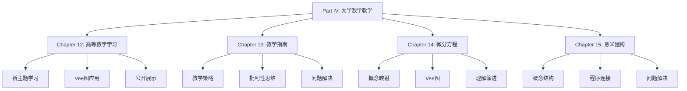

# Part IV: 大学数学教学与学习 - 总览

Part IV: University Mathematics Teaching and Learning - Overview

**创建日期**: 2025年12月11日
**创建日期**: December 11, 2025
**研究领域**: 数学教育 - 概念映射 - 大学数学
**研究领域**: Mathematics Education - Concept Mapping - University Mathematics
**主题编号**: CM.04.00
**优先级**: P0（最高优先级）⭐⭐⭐⭐⭐

---

## 📑 目录 / Table of Contents

- [Part IV: 大学数学教学与学习 - 总览](#part-iv-大学数学教学与学习---总览)
  - [📑 目录 / Table of Contents](#-目录--table-of-contents)
  - [📋 一、概述 / Overview](#-一概述--overview)
    - [1.1 Part IV 目标 / Part IV Objectives](#11-part-iv-目标--part-iv-objectives)
    - [1.2 研究范围 / Research Scope](#12-研究范围--research-scope)
  - [📚 二、章节结构 / Chapter Structure](#-二章节结构--chapter-structure)
    - [2.1 章节列表 / Chapter List](#21-章节列表--chapter-list)
    - [2.2 章节关系 / Chapter Relationships](#22-章节关系--chapter-relationships)
  - [🎯 三、核心主题 / Core Themes](#-三核心主题--core-themes)
    - [3.1 主题分类 / Theme Classification](#31-主题分类--theme-classification)
  - [📊 四、研究方法 / Research Methods](#-四研究方法--research-methods)
    - [4.1 研究方法类型 / Research Method Types](#41-研究方法类型--research-method-types)
    - [4.2 数据收集方法 / Data Collection Methods](#42-数据收集方法--data-collection-methods)
  - [🔗 五、章节链接 / Chapter Links](#-五章节链接--chapter-links)
    - [5.1 详细章节文档 / Detailed Chapter Documents](#51-详细章节文档--detailed-chapter-documents)
  - [📈 六、主要发现 / Key Findings](#-六主要发现--key-findings)
    - [6.1 学习效果发现 / Learning Effectiveness Findings](#61-学习效果发现--learning-effectiveness-findings)
    - [6.2 教学应用发现 / Teaching Application Findings](#62-教学应用发现--teaching-application-findings)
    - [6.3 理解演进发现 / Understanding Evolution Findings](#63-理解演进发现--understanding-evolution-findings)

---

## 📋 一、概述 / Overview

### 1.1 Part IV 目标 / Part IV Objectives

**主要目标 / Main Objectives**:

- 展示概念映射在大学数学教学中的应用
- Demonstrating applications of concept mapping in university mathematics teaching
- 研究高等数学学习中的应用
- Researching applications in advanced mathematics learning
- 探索概念映射在意义建构中的作用
- Exploring the role of concept mapping in meaning making

### 1.2 研究范围 / Research Scope

**涵盖内容 / Covered Content**:

- **高等数学学习** - 新主题学习、Vee图应用、公开展示
  Advanced Mathematics Learning - New topic learning, Vee diagram application, public scrutiny
- **微分方程** - 概念映射、Vee图、理解演进
  Differential Equations - Concept mapping, Vee diagrams, understanding evolution
- **意义建构** - 概念结构、程序连接、问题解决
  Meaning Making - Conceptual structure, procedure connections, problem solving
- **工程数学** - 教学策略、批判性思维、问题解决应用
  Engineering Mathematics - Teaching strategy, critical thinking, problem solving application

---

## 📚 二、章节结构 / Chapter Structure

### 2.1 章节列表 / Chapter List

| 章节 | 中文标题 | English Title | 作者 | 主题编号 |
|------|---------|---------------|------|----------|
| **Chapter 12** | 使用概念映射和Vee图增强大学数学学习 | Enhancing Undergraduate Mathematics Learning Using Concept Maps and Vee Diagrams | Karoline Afamasaga-Fuata'i | CM.04.01 |
| **Chapter 13** | 概念映射：数学教学过程的重要指南 | Concept Mapping: An Important Guide for the Mathematics Teaching Process | Rafael Pérez Flores | CM.04.02 |
| **Chapter 14** | 概念映射和Vee图"微分方程" | Concept Mapping and Vee Diagramming "Differential Equations" | Karoline Afamasaga-Fuata'i | CM.04.03 |
| **Chapter 15** | 使用概念映射在大学数学中调解意义 | Using Concept Maps to Mediate Meaning in Undergraduate Mathematics | Karoline Afamasaga-Fuata'i | CM.04.04 |

### 2.2 章节关系 / Chapter Relationships

---

## 🎯 三、核心主题 / Core Themes

### 3.1 主题分类 / Theme Classification

**按数学主题分类 / By Mathematics Topics**:

1. **高等数学学习 / Advanced Mathematics Learning**
   - 新主题学习 / New topic learning
   - 概念理解 / Conceptual understanding
   - 知识整合 / Knowledge integration

2. **微分方程 / Differential Equations**
   - 微分方程概念 / Differential equation concepts
   - 求解方法 / Solution methods
   - 应用领域 / Application areas

3. **意义建构 / Meaning Making**
   - 概念结构 / Conceptual structure
   - 程序连接 / Procedure connections
   - 问题解决 / Problem solving

4. **工程数学 / Engineering Mathematics**
   - 数学应用 / Mathematical applications
   - 问题解决 / Problem solving
   - 批判性思维 / Critical thinking

**按应用类型分类 / By Application Type**:

1. **学习工具 / Learning Tools**
   - 新主题学习
    New topic learning
   - 知识组织
    Knowledge organization
   - 意义建构
    Meaning making

2. **教学工具 / Teaching Tools**
   - 教学策略
    Teaching strategies
   - 课程设计
    Curriculum design
   - 教学指南
    Teaching guidance

3. **评估工具 / Assessment Tools**
   - 概念理解评估
    Conceptual understanding assessment
   - 学习进展监控
    Learning progress monitoring

---

## 📊 四、研究方法 / Research Methods

### 4.1 研究方法类型 / Research Method Types

| 研究方法 | 章节 | 说明 |
|---------|------|------|
| **案例研究** | Chapter 12, 14, 15 | 学生案例研究 |
| **行动研究** | Chapter 13 | 教学实践研究 |

### 4.2 数据收集方法 / Data Collection Methods

**主要方法 / Main Methods**:

1. **概念映射收集** - 收集学生构建的概念映射
2. **Vee图收集** - 收集问题解决的Vee图
3. **理解演进跟踪** - 跟踪理解的发展
4. **课堂观察** - 观察课堂应用
5. **访谈** - 访谈学生

---

## 🔗 五、章节链接 / Chapter Links

### 5.1 详细章节文档 / Detailed Chapter Documents

| 章节 | 文档路径 | 状态 |
|------|---------|------|
| **Chapter 12** | `04-大学数学教学/01-高等数学学习.md` | ✅ 已完成（含跨主题关联） |
| **Chapter 13** | `04-大学数学教学/02-教学指南.md` | ✅ 已完成（含跨主题关联） |
| **Chapter 14** | `04-大学数学教学/03-微分方程概念映射.md` | ✅ 已完成（含跨主题关联） |
| **Chapter 15** | `04-大学数学教学/04-意义建构.md` | ✅ 已完成（含跨主题关联） |

---

## 📈 六、主要发现 / Key Findings

### 6.1 学习效果发现 / Learning Effectiveness Findings

**主要发现 / Key Findings**:

1. **新主题学习** - 概念映射有效支持新主题学习
   New Topic Learning - Concept mapping effectively supports new topic learning
2. **意义建构** - 促进意义建构过程
   Meaning Making - Promotes meaning making process
3. **概念理解** - 显著提高概念理解
   Conceptual Understanding - Significantly improves conceptual understanding

### 6.2 教学应用发现 / Teaching Application Findings

**主要发现 / Key Findings**:

1. **教学策略** - 概念映射提供有效教学策略
   Teaching Strategies - Concept mapping provides effective teaching strategies
2. **批判性思维** - 促进批判性思维发展
   Critical Thinking - Promotes critical thinking development
3. **问题解决** - 提高问题解决能力
   Problem Solving - Improves problem-solving ability

### 6.3 理解演进发现 / Understanding Evolution Findings

**主要发现 / Key Findings**:

1. **理解发展** - 概念映射展示理解的发展
   Understanding Development - Concept mapping shows development of understanding
2. **社会批判** - 社会批判促进理解发展
   Social Critique - Social critique promotes understanding development
3. **知识整合** - 促进知识整合过程
   Knowledge Integration - Promotes knowledge integration process

---

**创建日期**: 2025年12月11日
**最后更新**: 2025年12月11日
**状态**: ✅ Part IV总览文档已创建，所有章节文档已完成
**完成度**: 100%

**文档增强说明**:

- ✅ 所有章节文档已创建完成
- ✅ Chapter 12包含数学内容深度分析和跨主题关联（与概念映射工具、意义建构、教学指南的关联分析）
- ✅ Chapter 13包含教学指南与概念理解、学习效果、教学策略的关联分析
- ✅ Chapter 14包含微分方程与线性代数的深度关联分析
- ✅ Chapter 15包含意义建构与概念映射理论、数学证明理解的关联分析
