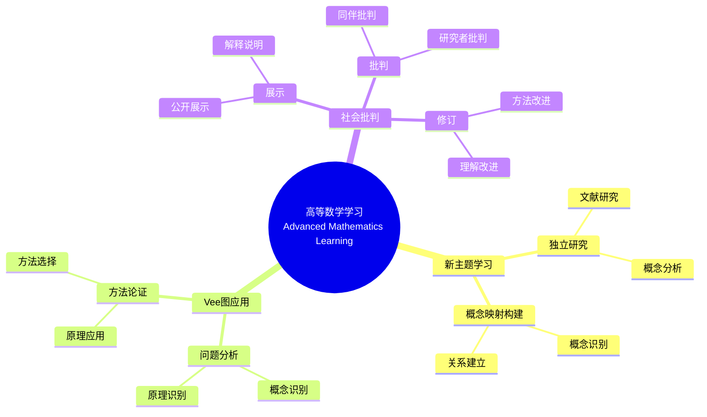

# 使用概念映射和Vee图增强大学数学学习

Enhancing Undergraduate Mathematics Learning Using Concept Maps and Vee Diagrams

**创建日期**: 2025年12月11日
**创建日期**: December 11, 2025
**研究领域**: 数学教育 - 概念映射 - 大学数学 - 高等数学学习
**研究领域**: Mathematics Education - Concept Mapping - University Mathematics - Advanced Mathematics Learning
**主题编号**: CM.04.01
**章节**: Chapter 12
**作者**: Karoline Afamasaga-Fuata'i
**优先级**: P0（最高优先级）⭐⭐⭐⭐⭐

---

## 📑 目录 / Table of Contents

- [使用概念映射和Vee图增强大学数学学习](#使用概念映射和vee图增强大学数学学习)
  - [📋 一、概述 / Overview](#-一概述--overview)
  - [🔬 二、研究方法 / Research Methodology](#-二研究方法--research-methodology)
  - [📚 三、概念映射数据分析 / Concept Map Data Analysis](#-三概念映射数据分析--concept-map-data-analysis)
  - [📊 四、Vee图数据分析 / Vee Diagram Data Analysis](#-四vee图数据分析--vee-diagram-data-analysis)
  - [💡 五、学习效果分析 / Learning Effectiveness Analysis](#-五学习效果分析--learning-effectiveness-analysis)
  - [📈 六、思维表征方式 / Representation Methods](#-六思维表征方式--representation-methods)
  - [📚 七、参考文献 / References](#-七参考文献--references)

---

## 📋 一、概述 / Overview

### 1.1 研究目标 / Research Objectives

**主要目标 / Main Objectives**:

- 研究使用概念映射和Vee图对新高等数学主题学习的影响
- Investigating the impact of using concept maps and vee diagrams on learning new advanced mathematics topics
- 展示概念映射在学习新主题中的作用
- Demonstrating the role of concept maps in learning new topics
- 展示Vee图在问题解决中的作用
- Demonstrating the role of vee diagrams in problem solving

### 1.2 研究问题 / Research Questions

**焦点问题 / Focus Questions**:

1. 概念映射和Vee图活动如何影响学生的数学学习？
   In what ways did the activities of concept mapping and Vee diagramming influence students' mathematics learning?
2. 概念映射在了解数学结构和性质方面发挥什么作用？
   What roles did concept maps play in learning about the structure and nature of mathematics learning?
3. Vee图在促进问题解决过程和生成多种方法方面发挥什么作用？
   What roles did Vee diagrams play in facilitating the problem solving process and generation of multiple methods?

### 1.3 研究对象 / Research Subjects

**研究对象 / Subjects**:

- **6个学生** - 萨摩亚大学数学学生
  6 students - Samoan university mathematics students
- **新主题** - 选择新数学主题进行研究
  New Topics - Selected new mathematics topics for research
- **时间**: 一个学期（14周）
  Time: One semester (14 weeks)

---

## 🔬 二、研究方法 / Research Methodology

### 2.1 研究设计 / Research Design

**研究方法 / Research Method**: 探索性教学实验 / Exploratory Teaching Experiment

**研究过程 / Research Process**:

1. **熟悉阶段** - 介绍概念映射和Vee图
   Familiarization Phase - Introduce concept maps and vee diagrams
2. **研究阶段** - 学生独立研究新主题
   Research Phase - Students independently research new topics
3. **构建阶段** - 构建概念映射和Vee图
   Construction Phase - Construct concept maps and vee diagrams
4. **展示阶段** - 在研讨会中展示
   Presentation Phase - Present in seminars
5. **批判阶段** - 接受社会批判
   Critique Phase - Receive social critique
6. **修订阶段** - 根据批判修订
   Revision Phase - Revise based on critique

### 2.2 数据收集 / Data Collection

**收集的数据类型 / Types of Data Collected**:

1. **概念映射** - 4个版本的概念映射
2. **Vee图** - 4个问题的Vee图（每个至少2个版本）
3. **最终报告** - 学生的最终报告

### 2.3 分析框架 / Analysis Framework

**概念映射分析 / Concept Map Analysis**:

- 结构复杂性
- Structural complexity
- 内容性质
- Nature of contents
- 有效命题
- Valid propositions

**Vee图分析 / Vee Diagram Analysis**:

- 整体标准
- Overall criteria
- 特定标准
- Specific criteria
- 概念与方法对应
- Correspondence between concepts and methods

---

## 📚 三、概念映射数据分析 / Concept Map Data Analysis

### 3.1 结构标准 / Structural Criteria

**主要标准 / Main Criteria**:

1. **跨链接** - 概念层次之间的整合跨链接
   Cross-Links - Integrative cross-links between concept hierarchies
2. **渐进分化** - 多个分支节点的渐进分化
   Progressive Differentiation - Progressive differentiation evidenced by multiple branching nodes
3. **层次水平** - 每个子分支的平均层次水平
   Hierarchical Levels - Average number of hierarchical levels per sub-branch

### 3.2 内容标准 / Contents Criteria

**主要标准 / Main Criteria**:

1. **概念标签** - 合适的标签和说明性例子
   Concept Labels - Suitable labels and illustrative examples
2. **不适当条目** - 程序步骤、冗余条目、链接词类型
   Inappropriate Entries - Procedural steps, redundant entries, linking-word-type
3. **定义短语** - 定义短语无效节点
   Definitional Phrases - Definitional-phrase invalid nodes

### 3.3 命题标准 / Propositions Criteria

**主要标准 / Main Criteria**:

1. **有效命题** - 由有效三元组形成的命题
   Valid Propositions - Propositions formed by valid triads
2. **无效命题** - 缺少链接词或节点不适当的命题
   Invalid Propositions - Propositions with missing linking words or inappropriate nodes

### 3.4 数据分析结果 / Data Analysis Results

**主要发现 / Main Findings**:

- 学生概念映射的结构复杂性增加
  Increase in structural complexity of students' concept maps
- 有效命题数量增加
  Increase in number of valid propositions
- 概念理解深度提高
  Improvement in depth of conceptual understanding

---

## 📊 四、Vee图数据分析 / Vee Diagram Data Analysis

### 4.1 整体标准 / Overall Criteria

**主要标准 / Main Criteria**:

1. **适当性** - Vee条目的适当性和相关性
   Appropriateness - Appropriateness and relevance of Vee entries
2. **对应性** - 概念信息与方法信息的相互对应
   Correspondence - Mutual correspondence between conceptual and methodological information

### 4.2 特定标准 / Specific Criteria

**主要标准 / Main Criteria**:

1. **原理支持** - 列出的原理是否支持给定的解决方案？
   Principle Support - Do the listed principles support the given solution?
2. **原理相关性** - 列出的原理是否与显示的解决方案最相关？
   Principle Relevance - Are the listed principles the most relevant for the displayed solution?
3. **知识声明支持** - 知识声明是否由列出的原理和转换支持？
   Knowledge Claim Support - Is the knowledge claim supported by the listed principles and transformations?

### 4.3 数据分析结果 / Data Analysis Results

**主要发现 / Main Findings**:

- 方法论证能力提高
  Improvement in method justification ability
- 原理应用明确
  Clear principle application
- 问题解决能力增强
  Enhanced problem-solving ability

---

## 💡 五、学习效果分析 / Learning Effectiveness Analysis

### 5.1 概念理解发展 / Conceptual Understanding Development

**主要发展 / Main Developments**:

1. **概念数量** - 概念数量增加
   Number of Concepts - Increase in number of concepts
2. **关系质量** - 关系质量提高
   Relationship Quality - Improvement in relationship quality
3. **结构复杂性** - 结构复杂性增加
   Structural Complexity - Increase in structural complexity

### 5.2 问题解决能力发展 / Problem-Solving Ability Development

**主要发展 / Main Developments**:

1. **方法多样性** - 方法多样性增加
   Method Diversity - Increase in method diversity
2. **方法论证** - 方法论证能力提高
   Method Justification - Improvement in method justification ability
3. **原理应用** - 原理应用明确
   Principle Application - Clear principle application

### 5.3 学习效果综合评估 / Comprehensive Learning Effectiveness Assessment

**主要效果 / Main Effects**:

1. **有意义学习** - 促进有意义学习
   Meaningful Learning - Promotes meaningful learning
2. **概念理解** - 提高概念理解
   Conceptual Understanding - Improves conceptual understanding
3. **问题解决** - 提高问题解决能力
   Problem Solving - Improves problem-solving ability

---

## 📈 六、思维表征方式 / Representation Methods

### 6.1 高等数学学习思维导图 / Advanced Mathematics Learning Mind Map



### 6.2 学习效果证明树 / Learning Effectiveness Proof Tree

```text
【目标】证明：概念映射和Vee图增强大学数学学习
【Goal】Prove: Concept maps and vee diagrams enhance university mathematics learning

自底向上证明树 / Bottom-Up Proof Tree:

层次1（理论前提 / Theoretical Premises）
├─ 前提1：Ausubel有意义学习理论
│  └─ 支持：概念映射促进有意义学习
├─ 前提2：社会建构理论
│  └─ 支持：社会批判促进理解发展
└─ 前提3：元认知理论
   └─ 支持：概念映射是元认知工具

层次2（机制论证 / Mechanism Argument）
├─ 机制1：概念可视化机制
│  ├─ 过程：将理解可视化
│  ├─ 工具：概念映射提供视觉表征
│  └─ 结果：促进理解发展
├─ 机制2：方法论证机制
│  ├─ 过程：用原理论证方法
│  ├─ 工具：Vee图提供论证框架
│  └─ 结果：提高方法论证能力
└─ 机制3：社会批判机制
   ├─ 过程：通过社会批判改进理解
   ├─ 工具：展示-批判-修订循环
   └─ 结果：深化理解

层次3（实证证据 / Empirical Evidence）
├─ 证据1：6个学生案例研究
│  ├─ 方法：分析概念映射演进
│  ├─ 结果：理解逐步发展
│  └─ 解释：概念映射有效促进理解发展
└─ 证据2：Vee图演进分析
   ├─ 方法：分析Vee图改进
   ├─ 结果：方法论证能力提高
   └─ 解释：Vee图有效促进方法论证

层次4（综合结论 / Comprehensive Conclusion）
└─ 结论：概念映射和Vee图增强大学数学学习
   ├─ 理论机制明确
   ├─ 实证证据支持
   └─ 应用效果显著
```

---

## 📚 七、参考文献 / References

### 7.1 主要参考文献 / Main References

1. **Afamasaga-Fuata'i, K. (2009)**. Enhancing Undergraduate Mathematics Learning Using Concept Maps and Vee Diagrams. In K. Afamasaga-Fuata'i (Ed.), *Concept Mapping in Mathematics: Research into Practice* (pp. 217-238). Springer.

2. **Ausubel, D. P. (2000)**. *The Acquisition and Retention of Knowledge: A Cognitive View*. Kluwer Academic Publishers.

3. **Novak, J. D., & Gowin, D. B. (1984)**. *Learning How to Learn*. Cambridge University Press.

### 7.2 相关研究 / Related Research

1. **Steffe, L. P., & D'Ambrosio, B. S. (1996)**. Using teaching experiments to understand students' mathematics. In D. F. Treagust, R. Duit, & B. J. Fraser (Eds.), *Improving teaching and learning in science and mathematics* (pp. 65-76). Teachers College Press.

2. **Schoenfeld, A. H. (1991)**. On mathematics as sense-making: An informal attack on the unfortunate divorce of formal and informal mathematics. In J. F. Voss, D. N. Perkins, & J. W. Segal (Eds.), *Informal reasoning and education* (pp. 311-343). Lawrence Erlbaum Associates.

---

**创建日期**: 2025年12月11日
**最后更新**: 2025年12月11日
**状态**: ✅ Chapter 12详细梳理文档已创建
**完成度**: 100%
