# 使用概念映射和Vee图增强大学数学学习

Enhancing Undergraduate Mathematics Learning Using Concept Maps and Vee Diagrams

**创建日期**: 2025年12月11日
**创建日期**: December 11, 2025
**研究领域**: 数学教育 - 概念映射 - 大学数学 - 高等数学学习
**研究领域**: Mathematics Education - Concept Mapping - University Mathematics - Advanced Mathematics Learning
**主题编号**: CM.04.01
**章节**: Chapter 12
**作者**: Karoline Afamasaga-Fuata'i
**优先级**: P0（最高优先级）⭐⭐⭐⭐⭐

---

## 📑 目录 / Table of Contents

- [使用概念映射和Vee图增强大学数学学习](#使用概念映射和vee图增强大学数学学习)
  - [📑 目录 / Table of Contents](#-目录--table-of-contents)
  - [📋 一、概述 / Overview](#-一概述--overview)
    - [1.1 研究目标 / Research Objectives](#11-研究目标--research-objectives)
    - [1.2 研究问题 / Research Questions](#12-研究问题--research-questions)
    - [1.3 研究对象 / Research Subjects](#13-研究对象--research-subjects)
  - [🔬 二、研究方法 / Research Methodology](#-二研究方法--research-methodology)
    - [2.1 研究设计 / Research Design](#21-研究设计--research-design)
    - [2.2 数据收集 / Data Collection](#22-数据收集--data-collection)
    - [2.3 分析框架 / Analysis Framework](#23-分析框架--analysis-framework)
  - [📐 三、高等数学核心内容深度分析 / Deep Analysis of Advanced Mathematics Core Content](#-三高等数学核心内容深度分析--deep-analysis-of-advanced-mathematics-core-content)
    - [3.1 高等数学的数学结构 / Mathematical Structure of Advanced Mathematics](#31-高等数学的数学结构--mathematical-structure-of-advanced-mathematics)
      - [3.1.1 高等数学的定义与范围 / Definition and Scope of Advanced Mathematics](#311-高等数学的定义与范围--definition-and-scope-of-advanced-mathematics)
      - [3.1.2 高等数学的主要分支 / Main Branches of Advanced Mathematics](#312-高等数学的主要分支--main-branches-of-advanced-mathematics)
    - [3.2 微积分的核心概念 / Core Concepts of Calculus](#32-微积分的核心概念--core-concepts-of-calculus)
      - [3.2.1 极限 / Limits](#321-极限--limits)
      - [3.2.2 导数 / Derivatives](#322-导数--derivatives)
      - [3.2.3 积分 / Integrals](#323-积分--integrals)
    - [3.3 线性代数的核心概念 / Core Concepts of Linear Algebra](#33-线性代数的核心概念--core-concepts-of-linear-algebra)
      - [3.3.1 向量空间 / Vector Spaces](#331-向量空间--vector-spaces)
      - [3.3.2 线性变换 / Linear Transformations](#332-线性变换--linear-transformations)
      - [3.3.3 特征值与特征向量 / Eigenvalues and Eigenvectors](#333-特征值与特征向量--eigenvalues-and-eigenvectors)
    - [3.4 高等数学概念之间的关联 / Relationships Between Advanced Mathematics Concepts](#34-高等数学概念之间的关联--relationships-between-advanced-mathematics-concepts)
      - [3.4.1 微积分与线性代数 / Calculus and Linear Algebra](#341-微积分与线性代数--calculus-and-linear-algebra)
      - [3.4.2 微积分与微分方程 / Calculus and Differential Equations](#342-微积分与微分方程--calculus-and-differential-equations)
      - [3.4.3 线性代数与微分方程 / Linear Algebra and Differential Equations](#343-线性代数与微分方程--linear-algebra-and-differential-equations)
    - [3.5 高等数学学习典型例题 / Typical Examples of Advanced Mathematics Learning](#35-高等数学学习典型例题--typical-examples-of-advanced-mathematics-learning)
      - [3.5.1 微积分概念的综合应用 / Comprehensive Application of Calculus Concepts](#351-微积分概念的综合应用--comprehensive-application-of-calculus-concepts)
      - [3.5.2 线性代数概念的应用 / Application of Linear Algebra Concepts](#352-线性代数概念的应用--application-of-linear-algebra-concepts)
      - [3.5.3 跨学科概念的综合应用 / Comprehensive Application of Interdisciplinary Concepts](#353-跨学科概念的综合应用--comprehensive-application-of-interdisciplinary-concepts)
  - [📚 四、概念映射数据分析 / Concept Map Data Analysis](#-四概念映射数据分析--concept-map-data-analysis)
    - [3.1 结构标准 / Structural Criteria](#31-结构标准--structural-criteria)
    - [3.2 内容标准 / Contents Criteria](#32-内容标准--contents-criteria)
    - [3.3 命题标准 / Propositions Criteria](#33-命题标准--propositions-criteria)
    - [3.4 数据分析结果 / Data Analysis Results](#34-数据分析结果--data-analysis-results)
  - [📊 四、Vee图数据分析 / Vee Diagram Data Analysis](#-四vee图数据分析--vee-diagram-data-analysis)
    - [4.1 整体标准 / Overall Criteria](#41-整体标准--overall-criteria)
    - [4.2 特定标准 / Specific Criteria](#42-特定标准--specific-criteria)
    - [4.3 数据分析结果 / Data Analysis Results](#43-数据分析结果--data-analysis-results)
  - [💡 五、学习效果分析 / Learning Effectiveness Analysis](#-五学习效果分析--learning-effectiveness-analysis)
    - [5.1 概念理解发展 / Conceptual Understanding Development](#51-概念理解发展--conceptual-understanding-development)
    - [5.2 问题解决能力发展 / Problem-Solving Ability Development](#52-问题解决能力发展--problem-solving-ability-development)
    - [5.3 学习效果综合评估 / Comprehensive Learning Effectiveness Assessment](#53-学习效果综合评估--comprehensive-learning-effectiveness-assessment)
  - [📈 六、思维表征方式 / Representation Methods](#-六思维表征方式--representation-methods)
    - [6.1 高等数学学习思维导图 / Advanced Mathematics Learning Mind Map](#61-高等数学学习思维导图--advanced-mathematics-learning-mind-map)
    - [6.2 学习效果证明树 / Learning Effectiveness Proof Tree](#62-学习效果证明树--learning-effectiveness-proof-tree)
  - [📚 七、参考文献 / References](#-七参考文献--references)
    - [7.1 主要参考文献 / Main References](#71-主要参考文献--main-references)
    - [7.2 相关研究 / Related Research](#72-相关研究--related-research)

---

## 📋 一、概述 / Overview

### 1.1 研究目标 / Research Objectives

**主要目标 / Main Objectives**:

- 研究使用概念映射和Vee图对新高等数学主题学习的影响
- Investigating the impact of using concept maps and vee diagrams on learning new advanced mathematics topics
- 展示概念映射在学习新主题中的作用
- Demonstrating the role of concept maps in learning new topics
- 展示Vee图在问题解决中的作用
- Demonstrating the role of vee diagrams in problem solving

### 1.2 研究问题 / Research Questions

**焦点问题 / Focus Questions**:

1. 概念映射和Vee图活动如何影响学生的数学学习？
   In what ways did the activities of concept mapping and Vee diagramming influence students' mathematics learning?
2. 概念映射在了解数学结构和性质方面发挥什么作用？
   What roles did concept maps play in learning about the structure and nature of mathematics learning?
3. Vee图在促进问题解决过程和生成多种方法方面发挥什么作用？
   What roles did Vee diagrams play in facilitating the problem solving process and generation of multiple methods?

### 1.3 研究对象 / Research Subjects

**研究对象 / Subjects**:

- **6个学生** - 萨摩亚大学数学学生
  6 students - Samoan university mathematics students
- **新主题** - 选择新数学主题进行研究
  New Topics - Selected new mathematics topics for research
- **时间**: 一个学期（14周）
  Time: One semester (14 weeks)

---

## 🔬 二、研究方法 / Research Methodology

### 2.1 研究设计 / Research Design

**研究方法 / Research Method**: 探索性教学实验 / Exploratory Teaching Experiment

**研究过程 / Research Process**:

1. **熟悉阶段** - 介绍概念映射和Vee图
   Familiarization Phase - Introduce concept maps and vee diagrams
2. **研究阶段** - 学生独立研究新主题
   Research Phase - Students independently research new topics
3. **构建阶段** - 构建概念映射和Vee图
   Construction Phase - Construct concept maps and vee diagrams
4. **展示阶段** - 在研讨会中展示
   Presentation Phase - Present in seminars
5. **批判阶段** - 接受社会批判
   Critique Phase - Receive social critique
6. **修订阶段** - 根据批判修订
   Revision Phase - Revise based on critique

### 2.2 数据收集 / Data Collection

**收集的数据类型 / Types of Data Collected**:

1. **概念映射** - 4个版本的概念映射
2. **Vee图** - 4个问题的Vee图（每个至少2个版本）
3. **最终报告** - 学生的最终报告

### 2.3 分析框架 / Analysis Framework

**概念映射分析 / Concept Map Analysis**:

- 结构复杂性
- Structural complexity
- 内容性质
- Nature of contents
- 有效命题
- Valid propositions

**Vee图分析 / Vee Diagram Analysis**:

- 整体标准
- Overall criteria
- 特定标准
- Specific criteria
- 概念与方法对应
- Correspondence between concepts and methods

---

## 📐 三、高等数学核心内容深度分析 / Deep Analysis of Advanced Mathematics Core Content

### 3.1 高等数学的数学结构 / Mathematical Structure of Advanced Mathematics

#### 3.1.1 高等数学的定义与范围 / Definition and Scope of Advanced Mathematics

**高等数学定义 / Advanced Mathematics Definition**:

- **高等数学**是建立在初等数学基础上的更深入、更抽象的数学分支
- **Advanced Mathematics** is deeper and more abstract mathematical branches built on elementary mathematics
- 主要包括微积分、线性代数、微分方程、复变函数等
- Mainly includes calculus, linear algebra, differential equations, complex analysis, etc.

**高等数学的特点 / Characteristics of Advanced Mathematics**:

- **抽象性**: 高度抽象的概念和理论
- **Abstraction**: Highly abstract concepts and theories
- **严谨性**: 严格的逻辑推理和证明
- **Rigor**: Strict logical reasoning and proofs
- **应用性**: 广泛的实际应用
- **Applicability**: Wide practical applications

#### 3.1.2 高等数学的主要分支 / Main Branches of Advanced Mathematics

**主要分支 / Main Branches**:

1. **微积分 / Calculus**:
   - 研究函数的导数和积分
   - Studies derivatives and integrals of functions
   - 包括单变量和多变量微积分
   - Includes single-variable and multivariable calculus

2. **线性代数 / Linear Algebra**:
   - 研究向量空间、线性变换、矩阵
   - Studies vector spaces, linear transformations, matrices

3. **微分方程 / Differential Equations**:
   - 研究包含导数的方程
   - Studies equations involving derivatives

4. **复变函数 / Complex Analysis**:
   - 研究复变量的函数
   - Studies functions of complex variables

5. **实分析 / Real Analysis**:
   - 研究实数的性质和实函数的理论
   - Studies properties of real numbers and theory of real functions

### 3.2 微积分的核心概念 / Core Concepts of Calculus

#### 3.2.1 极限 / Limits

**极限定义 / Limit Definition**:

- **极限**描述函数在某点附近的行为
- **Limit** describes the behavior of a function near a point
- $\lim_{x \to a} f(x) = L$ 表示当 $x$ 接近 $a$ 时，$f(x)$ 接近 $L$
- $\lim_{x \to a} f(x) = L$ means as $x$ approaches $a$, $f(x)$ approaches $L$

**极限的性质 / Properties of Limits**:

- **唯一性**: 如果极限存在，则唯一
- **Uniqueness**: If limit exists, it is unique
- **运算法则**: 极限的加法、乘法、除法法则
- **Operation Rules**: Addition, multiplication, division rules for limits

#### 3.2.2 导数 / Derivatives

**导数定义 / Derivative Definition**:

- **导数**是函数在某点的瞬时变化率
- **Derivative** is the instantaneous rate of change of a function at a point
- $f'(x) = \lim_{h \to 0} \frac{f(x+h) - f(x)}{h}$
- $f'(x) = \lim_{h \to 0} \frac{f(x+h) - f(x)}{h}$

**导数的应用 / Applications of Derivatives**:

- **几何意义**: 切线的斜率
- **Geometric Meaning**: Slope of tangent line
- **物理意义**: 速度、加速度
- **Physical Meaning**: Velocity, acceleration
- **优化问题**: 求极值
- **Optimization Problems**: Finding extrema

#### 3.2.3 积分 / Integrals

**积分定义 / Integral Definition**:

- **定积分**: $\int_a^b f(x)dx$ 表示函数在区间 $[a,b]$ 上的面积
- **Definite Integral**: $\int_a^b f(x)dx$ represents the area under the function on interval $[a,b]$
- **不定积分**: $\int f(x)dx$ 表示原函数
- **Indefinite Integral**: $\int f(x)dx$ represents the antiderivative

**微积分基本定理 / Fundamental Theorem of Calculus**:

- $\frac{d}{dx}\int_a^x f(t)dt = f(x)$
- $\int_a^b f'(x)dx = f(b) - f(a)$

### 3.3 线性代数的核心概念 / Core Concepts of Linear Algebra

#### 3.3.1 向量空间 / Vector Spaces

**向量空间定义 / Vector Space Definition**:

- **向量空间**是具有加法和数乘运算的集合
- **Vector Space** is a set with addition and scalar multiplication operations
- 满足8条公理（结合律、交换律、分配律等）
- Satisfies 8 axioms (associativity, commutativity, distributivity, etc.)

**向量空间的性质 / Properties of Vector Spaces**:

- **基 / Basis**: 线性无关的生成集
- **Dimension**: 基中向量的个数
- **子空间 / Subspace**: 向量空间的子集，本身也是向量空间

#### 3.3.2 线性变换 / Linear Transformations

**线性变换定义 / Linear Transformation Definition**:

- **线性变换**是保持向量加法和数乘的映射
- **Linear Transformation** is a mapping that preserves vector addition and scalar multiplication
- $T(av + bw) = aT(v) + bT(w)$
- $T(av + bw) = aT(v) + bT(w)$

**矩阵表示 / Matrix Representation**:

- 每个线性变换都可以用矩阵表示
- Every linear transformation can be represented by a matrix
- $T(v) = Av$，其中 $A$ 是变换矩阵
- $T(v) = Av$, where $A$ is the transformation matrix

#### 3.3.3 特征值与特征向量 / Eigenvalues and Eigenvectors

**定义 / Definition**:

- **特征值**和**特征向量**满足 $Av = \lambda v$
- **Eigenvalue** $\lambda$ and **eigenvector** $v$ satisfy $Av = \lambda v$
- 特征值表示变换的缩放因子
- Eigenvalues represent scaling factors of transformations

### 3.4 高等数学概念之间的关联 / Relationships Between Advanced Mathematics Concepts

#### 3.4.1 微积分与线性代数 / Calculus and Linear Algebra

**关联关系 / Relationship**:

- **多变量微积分**使用线性代数的工具
- **Multivariable Calculus** uses tools from linear algebra
- 梯度、散度、旋度等概念涉及向量和矩阵
- Concepts like gradient, divergence, curl involve vectors and matrices

#### 3.4.2 微积分与微分方程 / Calculus and Differential Equations

**关联关系 / Relationship**:

- 微分方程是微积分的应用
- Differential equations are applications of calculus
- 求解微分方程需要积分技巧
- Solving differential equations requires integration techniques

#### 3.4.3 线性代数与微分方程 / Linear Algebra and Differential Equations

**关联关系 / Relationship**:

- 线性微分方程系统可以用矩阵方法求解
- Systems of linear differential equations can be solved using matrix methods
- 特征值在求解常系数线性微分方程中起关键作用
- Eigenvalues play key roles in solving constant-coefficient linear differential equations

### 3.5 高等数学学习典型例题 / Typical Examples of Advanced Mathematics Learning

#### 3.5.1 微积分概念的综合应用 / Comprehensive Application of Calculus Concepts

**例题 / Example**:

- 求函数 $f(x) = x^3 - 3x^2 + 2$ 在区间 $[-1, 3]$ 上的最大值和最小值。
- Find the maximum and minimum values of the function $f(x) = x^3 - 3x^2 + 2$ on the interval $[-1, 3]$.

**解答 / Solution**:

**步骤1：求导数 / Step 1: Find Derivative**

$$f'(x) = 3x^2 - 6x = 3x(x - 2)$$

**步骤2：求临界点 / Step 2: Find Critical Points**

令 $f'(x) = 0$：

- Set $f'(x) = 0$:

$$3x(x - 2) = 0$$

因此 $x = 0$ 或 $x = 2$

- Therefore $x = 0$ or $x = 2$

**步骤3：求函数值 / Step 3: Find Function Values**

- 端点值 / Endpoint values:
  - $f(-1) = (-1)^3 - 3(-1)^2 + 2 = -1 - 3 + 2 = -2$
  - $f(3) = 3^3 - 3(3)^2 + 2 = 27 - 27 + 2 = 2$

- 临界点值 / Critical point values:
  - $f(0) = 0^3 - 3(0)^2 + 2 = 2$
  - $f(2) = 2^3 - 3(2)^2 + 2 = 8 - 12 + 2 = -2$

**步骤4：比较确定最值 / Step 4: Compare to Determine Extrema**

最大值：$\max\{-2, 2, 2, -2\} = 2$，在 $x = 0$ 和 $x = 3$ 处取得

- Maximum: $\max\{-2, 2, 2, -2\} = 2$, achieved at $x = 0$ and $x = 3$

最小值：$\min\{-2, 2, 2, -2\} = -2$，在 $x = -1$ 和 $x = 2$ 处取得

- Minimum: $\min\{-2, 2, 2, -2\} = -2$, achieved at $x = -1$ and $x = 2$

**答案 / Answer**: 最大值为 $2$，最小值为 $-2$

**数学意义 / Mathematical Meaning**:

- **微积分基本定理的应用**: 这道题综合运用了导数的概念（求导）、导数的几何意义（临界点）、闭区间上连续函数的最值定理，体现了微积分概念的系统性应用。
- **Application of Fundamental Calculus Theorems**: This problem comprehensively applies derivative concepts (differentiation), geometric meaning of derivatives (critical points), and the extreme value theorem for continuous functions on closed intervals, demonstrating systematic application of calculus concepts.

- **概念整合**: 极值问题需要整合导数的定义、导数的几何意义、函数的连续性等多个微积分概念，体现了高等数学学习中概念整合的重要性。
- **Concept Integration**: Extremum problems require integrating multiple calculus concepts such as definition of derivatives, geometric meaning of derivatives, and continuity of functions, demonstrating the importance of concept integration in advanced mathematics learning.

#### 3.5.2 线性代数概念的应用 / Application of Linear Algebra Concepts

**例题 / Example**:

- 求矩阵 $A = \begin{pmatrix} 2 & 1 \\ 1 & 2 \end{pmatrix}$ 的特征值和特征向量。
- Find the eigenvalues and eigenvectors of the matrix $A = \begin{pmatrix} 2 & 1 \\ 1 & 2 \end{pmatrix}$.

**解答 / Solution**:

**步骤1：求特征方程 / Step 1: Find Characteristic Equation**

特征多项式：

- Characteristic polynomial:

$$\det(A - \lambda I) = \det\begin{pmatrix} 2-\lambda & 1 \\ 1 & 2-\lambda \end{pmatrix} = (2-\lambda)^2 - 1 = \lambda^2 - 4\lambda + 3$$

**步骤2：求特征值 / Step 2: Find Eigenvalues**

令特征多项式等于零：

- Set characteristic polynomial equal to zero:

$$\lambda^2 - 4\lambda + 3 = 0$$

$$(\lambda - 1)(\lambda - 3) = 0$$

因此特征值为 $\lambda_1 = 1$，$\lambda_2 = 3$

- Therefore eigenvalues are $\lambda_1 = 1$, $\lambda_2 = 3$

**步骤3：求特征向量 / Step 3: Find Eigenvectors**

**对于 $\lambda_1 = 1$**:

- **For $\lambda_1 = 1$**:

解方程组 $(A - I)v = 0$：

- Solve system $(A - I)v = 0$:

$$
\begin{pmatrix} 1 & 1 \\ 1 & 1 \end{pmatrix}\begin{pmatrix} x \\ y \end{pmatrix} = \begin{pmatrix} 0 \\ 0 \end{pmatrix}
$$

得到 $x + y = 0$，即 $y = -x$

- We get $x + y = 0$, i.e., $y = -x$

取 $x = 1$，则 $y = -1$，特征向量为 $v_1 = \begin{pmatrix} 1 \\ -1 \end{pmatrix}$

- Taking $x = 1$, then $y = -1$, eigenvector is $v_1 = \begin{pmatrix} 1 \\ -1 \end{pmatrix}$

**对于 $\lambda_2 = 3$**:

- **For $\lambda_2 = 3$**:

解方程组 $(A - 3I)v = 0$：

- Solve system $(A - 3I)v = 0$:

$$
\begin{pmatrix} -1 & 1 \\ 1 & -1 \end{pmatrix}\begin{pmatrix} x \\ y \end{pmatrix} = \begin{pmatrix} 0 \\ 0 \end{pmatrix}
$$

得到 $-x + y = 0$，即 $y = x$

- We get $-x + y = 0$, i.e., $y = x$

取 $x = 1$，则 $y = 1$，特征向量为 $v_2 = \begin{pmatrix} 1 \\ 1 \end{pmatrix}$

- Taking $x = 1$, then $y = 1$, eigenvector is $v_2 = \begin{pmatrix} 1 \\ 1 \end{pmatrix}$

**答案 / Answer**:

- 特征值 / Eigenvalues: $\lambda_1 = 1$，$\lambda_2 = 3$
- 特征向量 / Eigenvectors: $v_1 = \begin{pmatrix} 1 \\ -1 \end{pmatrix}$，$v_2 = \begin{pmatrix} 1 \\ 1 \end{pmatrix}$

**数学意义 / Mathematical Meaning**:

- **线性变换的本质**: 特征值和特征向量揭示了线性变换的本质特征。特征值表示变换的缩放因子，特征向量表示变换的方向不变性，这体现了线性代数中结构性的数学思想。
- **Essence of Linear Transformations**: Eigenvalues and eigenvectors reveal the essential characteristics of linear transformations. Eigenvalues represent scaling factors of transformations, eigenvectors represent directional invariance, demonstrating the structural mathematical thinking in linear algebra.

- **矩阵对角化**: 特征值和特征向量是矩阵对角化的基础，对角化可以将复杂的矩阵运算转化为简单的标量运算，体现了线性代数中简化复杂问题的思想。
- **Matrix Diagonalization**: Eigenvalues and eigenvectors are the foundation of matrix diagonalization. Diagonalization can transform complex matrix operations into simple scalar operations, demonstrating the idea of simplifying complex problems in linear algebra.

#### 3.5.3 跨学科概念的综合应用 / Comprehensive Application of Interdisciplinary Concepts

**例题 / Example**:

- 求解微分方程系统：
  $$\begin{cases} \frac{dx}{dt} = 2x + y \\ \frac{dy}{dt} = x + 2y \end{cases}$$
  初始条件：$x(0) = 1$，$y(0) = 0$
- Solve the system of differential equations:
  $$\begin{cases} \frac{dx}{dt} = 2x + y \\ \frac{dy}{dt} = x + 2y \end{cases}$$
  Initial conditions: $x(0) = 1$, $y(0) = 0$

**解答 / Solution**:

**步骤1：写成矩阵形式 / Step 1: Write in Matrix Form**

$$
\frac{d}{dt}\begin{pmatrix} x \\ y \end{pmatrix} = \begin{pmatrix} 2 & 1 \\ 1 & 2 \end{pmatrix}\begin{pmatrix} x \\ y \end{pmatrix}
$$

即 $\frac{d\mathbf{v}}{dt} = A\mathbf{v}$，其中 $A = \begin{pmatrix} 2 & 1 \\ 1 & 2 \end{pmatrix}$

- That is $\frac{d\mathbf{v}}{dt} = A\mathbf{v}$, where $A = \begin{pmatrix} 2 & 1 \\ 1 & 2 \end{pmatrix}$

**步骤2：求矩阵的特征值和特征向量 / Step 2: Find Eigenvalues and Eigenvectors**

这与上一题相同，我们已经求得：

- This is the same as the previous problem, we already found:

- $\lambda_1 = 1$，$v_1 = \begin{pmatrix} 1 \\ -1 \end{pmatrix}$
- $\lambda_2 = 3$，$v_2 = \begin{pmatrix} 1 \\ 1 \end{pmatrix}$

**步骤3：写出通解 / Step 3: Write General Solution**

$$
\begin{pmatrix} x(t) \\ y(t) \end{pmatrix} = C_1 e^{\lambda_1 t}v_1 + C_2 e^{\lambda_2 t}v_2 = C_1 e^{t}\begin{pmatrix} 1 \\ -1 \end{pmatrix} + C_2 e^{3t}\begin{pmatrix} 1 \\ 1 \end{pmatrix}
$$

即：

- That is:

$$x(t) = C_1 e^{t} + C_2 e^{3t}$$
$$y(t) = -C_1 e^{t} + C_2 e^{3t}$$

**步骤4：应用初始条件 / Step 4: Apply Initial Conditions**

当 $t = 0$ 时：

- When $t = 0$:

$$x(0) = C_1 + C_2 = 1$$
$$y(0) = -C_1 + C_2 = 0$$

解得：$C_1 = \frac{1}{2}$，$C_2 = \frac{1}{2}$

- Solving: $C_1 = \frac{1}{2}$, $C_2 = \frac{1}{2}$

**答案 / Answer**:

$$x(t) = \frac{1}{2}e^{t} + \frac{1}{2}e^{3t}$$
$$y(t) = -\frac{1}{2}e^{t} + \frac{1}{2}e^{3t}$$

**数学意义 / Mathematical Meaning**:

- **跨学科概念整合**: 这道题展示了如何将线性代数的特征值方法应用于微分方程的求解，体现了微积分、线性代数和微分方程之间的深刻联系。
- **Interdisciplinary Concept Integration**: This problem demonstrates how to apply linear algebra's eigenvalue method to solving differential equations, demonstrating the deep connections between calculus, linear algebra, and differential equations.

- **矩阵方法在微分方程中的应用**: 线性微分方程系统可以通过矩阵的特征值分解来求解，这体现了高等数学中不同分支之间的统一性和相互渗透性。
- **Application of Matrix Methods in Differential Equations**: Systems of linear differential equations can be solved through eigenvalue decomposition of matrices, demonstrating the unity and interpenetration of different branches in advanced mathematics.

- **高等数学的系统性**: 高等数学的各个分支（微积分、线性代数、微分方程）不是孤立的，而是相互关联、相互支撑的有机整体。掌握这种系统性的思维方式是高等数学学习的重要目标。
- **Systematic Nature of Advanced Mathematics**: Different branches of advanced mathematics (calculus, linear algebra, differential equations) are not isolated but an organic whole that is interconnected and mutually supportive. Mastering this systematic way of thinking is an important goal of advanced mathematics learning.

---

## 📚 四、概念映射数据分析 / Concept Map Data Analysis

### 3.1 结构标准 / Structural Criteria

**主要标准 / Main Criteria**:

1. **跨链接** - 概念层次之间的整合跨链接
   Cross-Links - Integrative cross-links between concept hierarchies
2. **渐进分化** - 多个分支节点的渐进分化
   Progressive Differentiation - Progressive differentiation evidenced by multiple branching nodes
3. **层次水平** - 每个子分支的平均层次水平
   Hierarchical Levels - Average number of hierarchical levels per sub-branch

### 3.2 内容标准 / Contents Criteria

**主要标准 / Main Criteria**:

1. **概念标签** - 合适的标签和说明性例子
   Concept Labels - Suitable labels and illustrative examples
2. **不适当条目** - 程序步骤、冗余条目、链接词类型
   Inappropriate Entries - Procedural steps, redundant entries, linking-word-type
3. **定义短语** - 定义短语无效节点
   Definitional Phrases - Definitional-phrase invalid nodes

### 3.3 命题标准 / Propositions Criteria

**主要标准 / Main Criteria**:

1. **有效命题** - 由有效三元组形成的命题
   Valid Propositions - Propositions formed by valid triads
2. **无效命题** - 缺少链接词或节点不适当的命题
   Invalid Propositions - Propositions with missing linking words or inappropriate nodes

### 3.4 数据分析结果 / Data Analysis Results

**主要发现 / Main Findings**:

- 学生概念映射的结构复杂性增加
  Increase in structural complexity of students' concept maps
- 有效命题数量增加
  Increase in number of valid propositions
- 概念理解深度提高
  Improvement in depth of conceptual understanding

---

## 📊 四、Vee图数据分析 / Vee Diagram Data Analysis

### 4.1 整体标准 / Overall Criteria

**主要标准 / Main Criteria**:

1. **适当性** - Vee条目的适当性和相关性
   Appropriateness - Appropriateness and relevance of Vee entries
2. **对应性** - 概念信息与方法信息的相互对应
   Correspondence - Mutual correspondence between conceptual and methodological information

### 4.2 特定标准 / Specific Criteria

**主要标准 / Main Criteria**:

1. **原理支持** - 列出的原理是否支持给定的解决方案？
   Principle Support - Do the listed principles support the given solution?
2. **原理相关性** - 列出的原理是否与显示的解决方案最相关？
   Principle Relevance - Are the listed principles the most relevant for the displayed solution?
3. **知识声明支持** - 知识声明是否由列出的原理和转换支持？
   Knowledge Claim Support - Is the knowledge claim supported by the listed principles and transformations?

### 4.3 数据分析结果 / Data Analysis Results

**主要发现 / Main Findings**:

- 方法论证能力提高
  Improvement in method justification ability
- 原理应用明确
  Clear principle application
- 问题解决能力增强
  Enhanced problem-solving ability

---

## 💡 五、学习效果分析 / Learning Effectiveness Analysis

### 5.1 概念理解发展 / Conceptual Understanding Development

**主要发展 / Main Developments**:

1. **概念数量** - 概念数量增加
   Number of Concepts - Increase in number of concepts
2. **关系质量** - 关系质量提高
   Relationship Quality - Improvement in relationship quality
3. **结构复杂性** - 结构复杂性增加
   Structural Complexity - Increase in structural complexity

### 5.2 问题解决能力发展 / Problem-Solving Ability Development

**主要发展 / Main Developments**:

1. **方法多样性** - 方法多样性增加
   Method Diversity - Increase in method diversity
2. **方法论证** - 方法论证能力提高
   Method Justification - Improvement in method justification ability
3. **原理应用** - 原理应用明确
   Principle Application - Clear principle application

### 5.3 学习效果综合评估 / Comprehensive Learning Effectiveness Assessment

**主要效果 / Main Effects**:

1. **有意义学习** - 促进有意义学习
   Meaningful Learning - Promotes meaningful learning
2. **概念理解** - 提高概念理解
   Conceptual Understanding - Improves conceptual understanding
3. **问题解决** - 提高问题解决能力
   Problem Solving - Improves problem-solving ability

---

## 📈 六、思维表征方式 / Representation Methods

### 6.1 高等数学学习思维导图 / Advanced Mathematics Learning Mind Map

```mermaid
mindmap
  root((高等数学学习<br/>Advanced Mathematics Learning))
    新主题学习
      独立研究
        文献研究
        概念分析
      概念映射构建
        概念识别
        关系建立
    Vee图应用
      问题分析
        概念识别
        原理识别
      方法论证
        原理应用
        方法选择
    社会批判
      展示
        公开展示
        解释说明
      批判
        同伴批判
        研究者批判
      修订
        理解改进
        方法改进
```



### 6.2 学习效果证明树 / Learning Effectiveness Proof Tree

```text
【目标】证明：概念映射和Vee图增强大学数学学习
【Goal】Prove: Concept maps and vee diagrams enhance university mathematics learning

自底向上证明树 / Bottom-Up Proof Tree:

层次1（理论前提 / Theoretical Premises）
├─ 前提1：Ausubel有意义学习理论
│  └─ 支持：概念映射促进有意义学习
├─ 前提2：社会建构理论
│  └─ 支持：社会批判促进理解发展
└─ 前提3：元认知理论
   └─ 支持：概念映射是元认知工具

层次2（机制论证 / Mechanism Argument）
├─ 机制1：概念可视化机制
│  ├─ 过程：将理解可视化
│  ├─ 工具：概念映射提供视觉表征
│  └─ 结果：促进理解发展
├─ 机制2：方法论证机制
│  ├─ 过程：用原理论证方法
│  ├─ 工具：Vee图提供论证框架
│  └─ 结果：提高方法论证能力
└─ 机制3：社会批判机制
   ├─ 过程：通过社会批判改进理解
   ├─ 工具：展示-批判-修订循环
   └─ 结果：深化理解

层次3（实证证据 / Empirical Evidence）
├─ 证据1：6个学生案例研究
│  ├─ 方法：分析概念映射演进
│  ├─ 结果：理解逐步发展
│  └─ 解释：概念映射有效促进理解发展
└─ 证据2：Vee图演进分析
   ├─ 方法：分析Vee图改进
   ├─ 结果：方法论证能力提高
   └─ 解释：Vee图有效促进方法论证

层次4（综合结论 / Comprehensive Conclusion）
└─ 结论：概念映射和Vee图增强大学数学学习
   ├─ 理论机制明确
   ├─ 实证证据支持
   └─ 应用效果显著
```

---

## 📚 七、参考文献 / References

### 7.1 主要参考文献 / Main References

1. **Afamasaga-Fuata'i, K. (2009)**. Enhancing Undergraduate Mathematics Learning Using Concept Maps and Vee Diagrams. In K. Afamasaga-Fuata'i (Ed.), *Concept Mapping in Mathematics: Research into Practice* (pp. 217-238). Springer.

2. **Ausubel, D. P. (2000)**. *The Acquisition and Retention of Knowledge: A Cognitive View*. Kluwer Academic Publishers.

3. **Novak, J. D., & Gowin, D. B. (1984)**. *Learning How to Learn*. Cambridge University Press.

### 7.2 相关研究 / Related Research

1. **Steffe, L. P., & D'Ambrosio, B. S. (1996)**. Using teaching experiments to understand students' mathematics. In D. F. Treagust, R. Duit, & B. J. Fraser (Eds.), *Improving teaching and learning in science and mathematics* (pp. 65-76). Teachers College Press.

2. **Schoenfeld, A. H. (1991)**. On mathematics as sense-making: An informal attack on the unfortunate divorce of formal and informal mathematics. In J. F. Voss, D. N. Perkins, & J. W. Segal (Eds.), *Informal reasoning and education* (pp. 311-343). Lawrence Erlbaum Associates.

---

**创建日期**: 2025年12月11日
**最后更新**: 2025年12月11日
**状态**: ✅ Chapter 12详细梳理文档已创建
**完成度**: 100%
