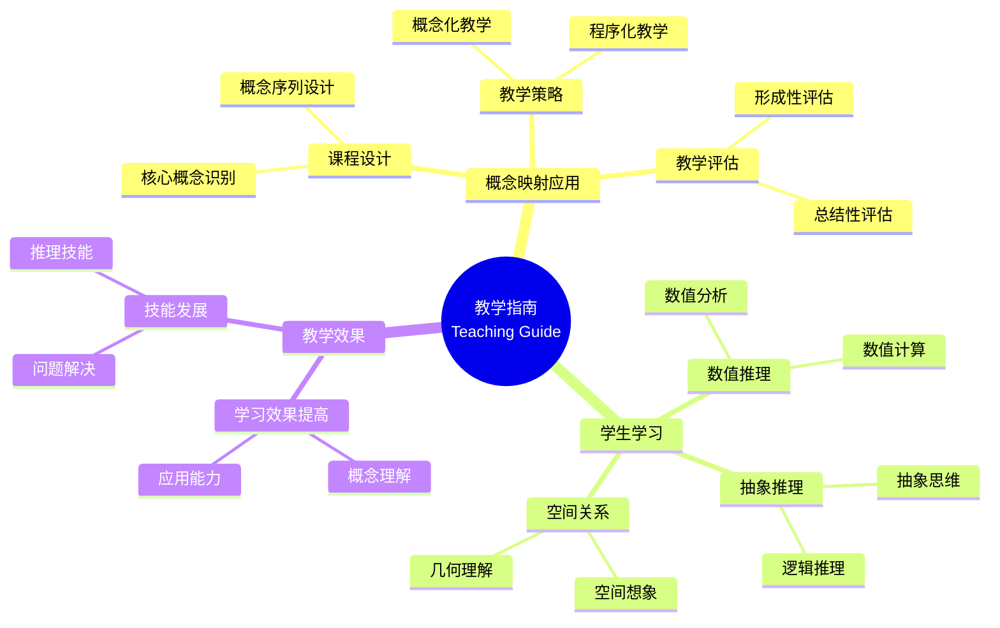

# 概念映射：数学教学过程的重要指南

Concept Mapping: An Important Guide for the Mathematics Teaching Process

**创建日期**: 2025年12月11日
**创建日期**: December 11, 2025
**研究领域**: 数学教育 - 概念映射 - 大学数学 - 教学指南
**研究领域**: Mathematics Education - Concept Mapping - University Mathematics - Teaching Guide
**主题编号**: CM.04.02
**章节**: Chapter 13
**作者**: Rafael Pérez Flores
**优先级**: P0（最高优先级）⭐⭐⭐⭐⭐

---

## 📑 目录 / Table of Contents

- [概念映射：数学教学过程的重要指南](#概念映射数学教学过程的重要指南)
  - [📑 目录 / Table of Contents](#-目录--table-of-contents)
  - [📋 一、概述 / Overview](#-一概述--overview)
    - [1.1 研究目标 / Research Objectives](#11-研究目标--research-objectives)
    - [1.2 核心内容 / Core Content](#12-核心内容--core-content)
  - [🔬 二、研究方法 / Research Methodology](#-二研究方法--research-methodology)
    - [2.1 研究设计 / Research Design](#21-研究设计--research-design)
    - [2.2 数据收集 / Data Collection](#22-数据收集--data-collection)
  - [📚 三、概念映射在教学中的应用 / Concept Mapping Application in Teaching](#-三概念映射在教学中的应用--concept-mapping-application-in-teaching)
    - [3.1 教学指南应用 / Teaching Guide Application](#31-教学指南应用--teaching-guide-application)
    - [3.2 教学策略应用 / Teaching Strategy Application](#32-教学策略应用--teaching-strategy-application)
    - [3.3 课程设计应用 / Curriculum Design Application](#33-课程设计应用--curriculum-design-application)
  - [💡 四、学生学习效果 / Student Learning Outcomes](#-四学生学习效果--student-learning-outcomes)
    - [4.1 学习效果评估 / Learning Outcomes Assessment](#41-学习效果评估--learning-outcomes-assessment)
    - [4.2 学习效果结果 / Learning Outcomes Results](#42-学习效果结果--learning-outcomes-results)
    - [4.3 学习效果分析 / Learning Outcomes Analysis](#43-学习效果分析--learning-outcomes-analysis)
  - [📊 五、教学策略分析 / Teaching Strategy Analysis](#-五教学策略分析--teaching-strategy-analysis)
    - [5.1 教学策略类型 / Teaching Strategy Types](#51-教学策略类型--teaching-strategy-types)
    - [5.2 概念映射的作用 / Role of Concept Mapping](#52-概念映射的作用--role-of-concept-mapping)
    - [5.3 教学策略效果 / Teaching Strategy Effectiveness](#53-教学策略效果--teaching-strategy-effectiveness)
  - [📈 六、思维表征方式 / Representation Methods](#-六思维表征方式--representation-methods)
    - [6.1 教学指南思维导图 / Teaching Guide Mind Map](#61-教学指南思维导图--teaching-guide-mind-map)
    - [6.2 教学策略决策树 / Teaching Strategy Decision Tree](#62-教学策略决策树--teaching-strategy-decision-tree)
    - [6.3 教学效果证明树 / Teaching Effectiveness Proof Tree](#63-教学效果证明树--teaching-effectiveness-proof-tree)
  - [📚 七、参考文献 / References](#-七参考文献--references)
    - [7.1 主要参考文献 / Main References](#71-主要参考文献--main-references)
    - [7.2 相关研究 / Related Research](#72-相关研究--related-research)

---

## 📋 一、概述 / Overview

### 1.1 研究目标 / Research Objectives

**主要目标 / Main Objectives**:

- 展示概念映射作为教学指南的使用
- Demonstrating the use of concept mapping as a teaching guide
- 展示概念映射对学生学习的影响
- Demonstrating the impact of concept mapping on student learning
- 说明概念映射在教学过程中的作用
- Illustrating the role of concept mapping in the teaching process

### 1.2 核心内容 / Core Content

**主要内容 / Main Content**:

1. **教学指南** - 概念映射作为教学指南
   Teaching Guide - Concept mapping as teaching guide
2. **学生学习** - 概念映射对学生学习的影响
   Student Learning - Impact of concept mapping on student learning
3. **教学策略** - 概念映射在教学策略中的应用
   Teaching Strategies - Application of concept mapping in teaching strategies

---

## 🔬 二、研究方法 / Research Methodology

### 2.1 研究设计 / Research Design

**研究方法 / Research Method**: 行动研究 / Action Research

**研究过程 / Research Process**:

1. **教学阶段** - 使用概念映射指导教学
   Teaching Phase - Use concept mapping to guide teaching
2. **学习阶段** - 学生使用概念映射学习
   Learning Phase - Students use concept mapping to learn
3. **评估阶段** - 评估学生学习效果
   Assessment Phase - Assess student learning outcomes

### 2.2 数据收集 / Data Collection

**收集的数据类型 / Types of Data Collected**:

1. **教师概念映射** - 教师构建的概念映射
2. **学生概念映射** - 学生构建的概念映射
3. **学习效果数据** - 学生学习效果数据

---

## 📚 三、概念映射在教学中的应用 / Concept Mapping Application in Teaching

### 3.1 教学指南应用 / Teaching Guide Application

**应用方式 / Application Methods**:

- 使用概念映射指导教学
- Use concept mapping to guide teaching
- 提供教学结构
- Provide teaching structure
- 识别教学重点
- Identify teaching focus

### 3.2 教学策略应用 / Teaching Strategy Application

**应用方式 / Application Methods**:

- 使用概念映射设计教学策略
- Use concept mapping to design teaching strategies
- 组织教学内容
- Organize teaching content
- 规划教学序列
- Plan teaching sequences

### 3.3 课程设计应用 / Curriculum Design Application

**应用方式 / Application Methods**:

- 使用概念映射设计课程
- Use concept mapping to design curriculum
- 识别核心概念
- Identify core concepts
- 建立概念关联
- Establish concept relationships

---

## 💡 四、学生学习效果 / Student Learning Outcomes

### 4.1 学习效果评估 / Learning Outcomes Assessment

**评估维度 / Assessment Dimensions**:

1. **数值推理** - 数值推理技能
   Numerical Reasoning - Numerical reasoning skills
2. **抽象推理** - 抽象推理技能
   Abstract Reasoning - Abstract reasoning skills
3. **空间关系** - 空间关系技能
   Spatial Relationships - Spatial relationship skills

### 4.2 学习效果结果 / Learning Outcomes Results

**主要发现 / Main Findings**:

- 数值推理技能提高
  Improvement in numerical reasoning skills
- 抽象推理技能提高
  Improvement in abstract reasoning skills
- 空间关系技能提高
  Improvement in spatial relationship skills

### 4.3 学习效果分析 / Learning Outcomes Analysis

**主要分析 / Main Analysis**:

1. **技能发展** - 各种推理技能的发展
   Skill Development - Development of various reasoning skills
2. **理解提高** - 概念理解的提高
   Understanding Improvement - Improvement in conceptual understanding
3. **应用能力** - 应用能力的提高
   Application Ability - Improvement in application ability

---

## 📊 五、教学策略分析 / Teaching Strategy Analysis

### 5.1 教学策略类型 / Teaching Strategy Types

**主要类型 / Main Types**:

1. **概念化教学** - 强调概念理解
   Conceptual Teaching - Emphasizes conceptual understanding
2. **程序化教学** - 强调程序技能
   Procedural Teaching - Emphasizes procedural skills
3. **综合教学** - 结合概念和程序
   Integrated Teaching - Combines concepts and procedures

### 5.2 概念映射的作用 / Role of Concept Mapping

**主要作用 / Main Functions**:

- 支持概念化教学
  Supports conceptual teaching
- 促进概念理解
  Promotes conceptual understanding
- 提高教学效果
  Improves teaching effectiveness

### 5.3 教学策略效果 / Teaching Strategy Effectiveness

**主要效果 / Main Effects**:

1. **学习效果** - 提高学习效果
   Learning Effectiveness - Improves learning effectiveness
2. **理解深度** - 提高理解深度
   Understanding Depth - Improves understanding depth
3. **应用能力** - 提高应用能力
   Application Ability - Improves application ability

---

## 📈 六、思维表征方式 / Representation Methods

### 6.1 教学指南思维导图 / Teaching Guide Mind Map



### 6.2 教学策略决策树 / Teaching Strategy Decision Tree

```text
如何选择教学策略？
├─ 教学目标是什么？
│  ├─ 概念理解
│  │  └─ ✅ 概念化教学
│  │     └─ 重点：概念映射、概念关联
│  ├─ 程序技能
│  │  └─ ✅ 程序化教学
│  │     └─ 重点：程序步骤、技能训练
│  └─ 综合能力
│     └─ ✅ 综合教学
│        └─ 重点：概念+程序
├─ 学生水平是什么？
│  ├─ 初学者
│  │  └─ ✅ 概念化教学+基础程序
│  │     └─ 重点：概念理解、基础技能
│  ├─ 中级学习者
│  │  └─ ✅ 综合教学
│  │     └─ 重点：概念理解、程序技能
│  └─ 高级学习者
│     └─ ✅ 程序化教学+高级概念
│        └─ 重点：高级技能、概念应用
└─ 评估方法是什么？
   ├─ 形成性评估
   │  └─ ✅ 使用概念映射监控
   │     └─ 方法：定期构建概念映射
   ├─ 总结性评估
   │  └─ ✅ 使用概念映射评估
   │     └─ 方法：综合概念映射
   └─ 诊断性评估
      └─ ✅ 使用概念映射诊断
         └─ 方法：对比专家图
```

### 6.3 教学效果证明树 / Teaching Effectiveness Proof Tree

```text
【目标】证明：概念映射作为教学指南有效
【Goal】Prove: Concept mapping as teaching guide is effective

自底向上证明树 / Bottom-Up Proof Tree:

层次1（理论前提 / Theoretical Premises）
├─ 前提1：教学理论
│  └─ 支持：教学需要结构指导
├─ 前提2：概念映射理论
│  └─ 支持：概念映射提供结构指导
└─ 前提3：学习理论
   └─ 支持：概念映射促进学习

层次2（机制论证 / Mechanism Argument）
├─ 机制1：教学指导机制
│  ├─ 过程：指导教学过程
│  ├─ 工具：概念映射提供教学结构
│  └─ 结果：提高教学效果
├─ 机制2：学习促进机制
│  ├─ 过程：促进学生学习
│  ├─ 工具：概念映射提供学习框架
│  └─ 结果：提高学习效果
└─ 机制3：技能发展机制
   ├─ 过程：发展推理技能
   ├─ 工具：概念映射支持技能发展
   └─ 结果：提高推理技能

层次3（实证证据 / Empirical Evidence）
├─ 证据1：教学应用证据
│  ├─ 方法：使用概念映射指导教学
│  ├─ 结果：教学效果提高
│  └─ 解释：概念映射有效指导教学
└─ 证据2：学习效果证据
   ├─ 方法：评估学生学习效果
   ├─ 结果：学习效果提高
   └─ 解释：概念映射有效促进学习

层次4（综合结论 / Comprehensive Conclusion）
└─ 结论：概念映射作为教学指南有效
   ├─ 理论机制明确
   ├─ 实证证据支持
   └─ 应用效果显著
```

---

## 📚 七、参考文献 / References

### 7.1 主要参考文献 / Main References

1. **Pérez Flores, R. (2009)**. Concept Mapping: An Important Guide for the Mathematics Teaching Process. In K. Afamasaga-Fuata'i (Ed.), *Concept Mapping in Mathematics: Research into Practice* (pp. 239-255). Springer.

2. **Novak, J. D. (1998)**. *Learning, Creating, and Using Knowledge: Concept Maps as Facilitative Tools in Schools and Corporations*. Lawrence Erlbaum Associates.

3. **Ausubel, D. P. (2000)**. *The Acquisition and Retention of Knowledge: A Cognitive View*. Kluwer Academic Publishers.

### 7.2 相关研究 / Related Research

1. **Schoenfeld, A. H. (1991)**. On mathematics as sense-making: An informal attack on the unfortunate divorce of formal and informal mathematics. In J. F. Voss, D. N. Perkins, & J. W. Segal (Eds.), *Informal reasoning and education* (pp. 311-343). Lawrence Erlbaum Associates.

2. **Richards, J. (1991)**. Mathematical discussions. In E. von Glasersfeld (Ed.), *Radical constructivism in mathematics education* (pp. 13-51). Kluwer Academic Publishers.

---

**创建日期**: 2025年12月11日
**最后更新**: 2025年12月11日
**状态**: ✅ Chapter 13详细梳理文档已创建
**完成度**: 100%
