```mermaid
mindmap
  root((教学指南<br/>Teaching Guide))
    概念映射应用
      课程设计
        核心概念识别
        概念序列设计
      教学策略
        概念化教学
        程序化教学
      教学评估
        形成性评估
        总结性评估
    学生学习
      数值推理
        数值计算
        数值分析
      抽象推理
        抽象思维
        逻辑推理
      空间关系
        空间想象
        几何理解
    教学效果
      学习效果提高
        概念理解
        应用能力
      技能发展
        推理技能
        问题解决
```

# 概念映射：数学教学过程的重要指南

Concept Mapping: An Important Guide for the Mathematics Teaching Process

**创建日期**: 2025年12月11日
**创建日期**: December 11, 2025
**研究领域**: 数学教育 - 概念映射 - 大学数学 - 教学指南
**研究领域**: Mathematics Education - Concept Mapping - University Mathematics - Teaching Guide
**主题编号**: CM.04.02
**章节**: Chapter 13
**作者**: Rafael Pérez Flores
**优先级**: P0（最高优先级）⭐⭐⭐⭐⭐

---

## 📑 目录 / Table of Contents

- [概念映射：数学教学过程的重要指南](#概念映射数学教学过程的重要指南)
  - [📑 目录 / Table of Contents](#-目录--table-of-contents)
  - [📋 一、概述 / Overview](#-一概述--overview)
    - [1.1 研究目标 / Research Objectives](#11-研究目标--research-objectives)
    - [1.2 核心内容 / Core Content](#12-核心内容--core-content)
  - [🔬 二、研究方法 / Research Methodology](#-二研究方法--research-methodology)
    - [2.1 研究设计 / Research Design](#21-研究设计--research-design)
    - [2.2 数据收集 / Data Collection](#22-数据收集--data-collection)
  - [📚 三、概念映射在教学中的应用 / Concept Mapping Application in Teaching](#-三概念映射在教学中的应用--concept-mapping-application-in-teaching)
    - [3.1 教学指南应用 / Teaching Guide Application](#31-教学指南应用--teaching-guide-application)
    - [3.2 教学策略应用 / Teaching Strategy Application](#32-教学策略应用--teaching-strategy-application)
    - [3.3 课程设计应用 / Curriculum Design Application](#33-课程设计应用--curriculum-design-application)
  - [💡 四、学生学习效果 / Student Learning Outcomes](#-四学生学习效果--student-learning-outcomes)
    - [4.1 学习效果评估 / Learning Outcomes Assessment](#41-学习效果评估--learning-outcomes-assessment)
    - [4.2 学习效果结果 / Learning Outcomes Results](#42-学习效果结果--learning-outcomes-results)
    - [4.3 学习效果分析 / Learning Outcomes Analysis](#43-学习效果分析--learning-outcomes-analysis)
  - [📊 五、教学策略分析 / Teaching Strategy Analysis](#-五教学策略分析--teaching-strategy-analysis)
    - [5.1 教学策略类型 / Teaching Strategy Types](#51-教学策略类型--teaching-strategy-types)
    - [5.2 概念映射的作用 / Role of Concept Mapping](#52-概念映射的作用--role-of-concept-mapping)
    - [5.3 教学策略效果 / Teaching Strategy Effectiveness](#53-教学策略效果--teaching-strategy-effectiveness)
  - [🔗 六、跨主题关联小结 / Cross-Topic Association Summary](#-六跨主题关联小结--cross-topic-association-summary)
    - [6.1 教学指南与概念理解的关联 / Association Between Teaching Guide and Conceptual Understanding](#61-教学指南与概念理解的关联--association-between-teaching-guide-and-conceptual-understanding)
    - [6.2 教学指南与学习效果的关联 / Association Between Teaching Guide and Learning Outcomes](#62-教学指南与学习效果的关联--association-between-teaching-guide-and-learning-outcomes)
    - [6.3 教学指南与教学策略的关联 / Association Between Teaching Guide and Teaching Strategies](#63-教学指南与教学策略的关联--association-between-teaching-guide-and-teaching-strategies)
  - [📈 六、思维表征方式 / Representation Methods](#-六思维表征方式--representation-methods)
    - [7.1 教学指南思维导图 / Teaching Guide Mind Map](#71-教学指南思维导图--teaching-guide-mind-map)
    - [7.2 教学策略决策树 / Teaching Strategy Decision Tree](#72-教学策略决策树--teaching-strategy-decision-tree)
    - [7.3 教学效果证明树 / Teaching Effectiveness Proof Tree](#73-教学效果证明树--teaching-effectiveness-proof-tree)
  - [📚 八、参考文献 / References](#-八参考文献--references)
    - [8.1 主要参考文献 / Main References](#81-主要参考文献--main-references)
    - [8.2 相关研究 / Related Research](#82-相关研究--related-research)

---

## 📋 一、概述 / Overview

### 1.1 研究目标 / Research Objectives

**主要目标 / Main Objectives**:

- 展示概念映射作为教学指南的使用
- Demonstrating the use of concept mapping as a teaching guide
- 展示概念映射对学生学习的影响
- Demonstrating the impact of concept mapping on student learning
- 说明概念映射在教学过程中的作用
- Illustrating the role of concept mapping in the teaching process

### 1.2 核心内容 / Core Content

**主要内容 / Main Content**:

1. **教学指南** - 概念映射作为教学指南
   Teaching Guide - Concept mapping as teaching guide
2. **学生学习** - 概念映射对学生学习的影响
   Student Learning - Impact of concept mapping on student learning
3. **教学策略** - 概念映射在教学策略中的应用
   Teaching Strategies - Application of concept mapping in teaching strategies

---

## 🔬 二、研究方法 / Research Methodology

### 2.1 研究设计 / Research Design

**研究方法 / Research Method**: 行动研究 / Action Research

**研究过程 / Research Process**:

1. **教学阶段** - 使用概念映射指导教学
   Teaching Phase - Use concept mapping to guide teaching
2. **学习阶段** - 学生使用概念映射学习
   Learning Phase - Students use concept mapping to learn
3. **评估阶段** - 评估学生学习效果
   Assessment Phase - Assess student learning outcomes

### 2.2 数据收集 / Data Collection

**收集的数据类型 / Types of Data Collected**:

1. **教师概念映射** - 教师构建的概念映射
2. **学生概念映射** - 学生构建的概念映射
3. **学习效果数据** - 学生学习效果数据

---

## 📚 三、概念映射在教学中的应用 / Concept Mapping Application in Teaching

### 3.1 教学指南应用 / Teaching Guide Application

**应用方式 / Application Methods**:

- 使用概念映射指导教学
- Use concept mapping to guide teaching
- 提供教学结构
- Provide teaching structure
- 识别教学重点
- Identify teaching focus

### 3.2 教学策略应用 / Teaching Strategy Application

**应用方式 / Application Methods**:

- 使用概念映射设计教学策略
- Use concept mapping to design teaching strategies
- 组织教学内容
- Organize teaching content
- 规划教学序列
- Plan teaching sequences

### 3.3 课程设计应用 / Curriculum Design Application

**应用方式 / Application Methods**:

- 使用概念映射设计课程
- Use concept mapping to design curriculum
- 识别核心概念
- Identify core concepts
- 建立概念关联
- Establish concept relationships

---

## 💡 四、学生学习效果 / Student Learning Outcomes

### 4.1 学习效果评估 / Learning Outcomes Assessment

**评估维度 / Assessment Dimensions**:

1. **数值推理** - 数值推理技能
   Numerical Reasoning - Numerical reasoning skills
2. **抽象推理** - 抽象推理技能
   Abstract Reasoning - Abstract reasoning skills
3. **空间关系** - 空间关系技能
   Spatial Relationships - Spatial relationship skills

### 4.2 学习效果结果 / Learning Outcomes Results

**主要发现 / Main Findings**:

- 数值推理技能提高
  Improvement in numerical reasoning skills
- 抽象推理技能提高
  Improvement in abstract reasoning skills
- 空间关系技能提高
  Improvement in spatial relationship skills

### 4.3 学习效果分析 / Learning Outcomes Analysis

**主要分析 / Main Analysis**:

1. **技能发展** - 各种推理技能的发展
   Skill Development - Development of various reasoning skills
2. **理解提高** - 概念理解的提高
   Understanding Improvement - Improvement in conceptual understanding
3. **应用能力** - 应用能力的提高
   Application Ability - Improvement in application ability

---

## 📊 五、教学策略分析 / Teaching Strategy Analysis

### 5.1 教学策略类型 / Teaching Strategy Types

**主要类型 / Main Types**:

1. **概念化教学** - 强调概念理解
   Conceptual Teaching - Emphasizes conceptual understanding
2. **程序化教学** - 强调程序技能
   Procedural Teaching - Emphasizes procedural skills
3. **综合教学** - 结合概念和程序
   Integrated Teaching - Combines concepts and procedures

### 5.2 概念映射的作用 / Role of Concept Mapping

**主要作用 / Main Functions**:

- 支持概念化教学
  Supports conceptual teaching
- 促进概念理解
  Promotes conceptual understanding
- 提高教学效果
  Improves teaching effectiveness

### 5.3 教学策略效果 / Teaching Strategy Effectiveness

**主要效果 / Main Effects**:

1. **学习效果** - 提高学习效果
   Learning Effectiveness - Improves learning effectiveness
2. **理解深度** - 提高理解深度
   Understanding Depth - Improves understanding depth
3. **应用能力** - 提高应用能力
   Application Ability - Improves application ability

---

## 🔗 六、跨主题关联小结 / Cross-Topic Association Summary

本节深入分析教学指南与其他数学教育主题之间的关联，展示概念映射作为教学指南在数学知识体系中的位置和作用。

### 6.1 教学指南与概念理解的关联 / Association Between Teaching Guide and Conceptual Understanding

**核心关联 / Core Association**:

概念映射作为教学指南，通过提供结构化的知识框架，帮助教师识别核心概念和概念之间的关系，从而促进学生的概念理解。教学指南的有效性体现在其能够显化数学概念的内在结构。

**教学指南的概念结构显化 / Conceptual Structure Visualization in Teaching Guide**:

- **概念层次结构的显化**: 教学指南通过概念映射显化数学概念的层次结构，从一般到具体，从抽象到具体。例如，在微积分教学中，从"函数"到"连续函数"到"可导函数"的层次结构可以通过概念映射清晰地展示。
- **Hierarchical Structure Visualization**: Teaching guides visualize the hierarchical structure of mathematical concepts through concept maps, from general to specific, from abstract to concrete. For example, in calculus teaching, the hierarchical structure from "function" to "continuous function" to "differentiable function" can be clearly shown through concept maps.
- **概念关系的逻辑显化**: 教学指南通过链接词显化概念之间的逻辑关系（如"是...的特例"、"推广为"、"等价于"等），使教师能够清晰地理解概念之间的逻辑联系，从而更好地设计教学序列。
- **Logical Relationship Visualization**: Teaching guides make logical relationships between concepts explicit through linking words (such as "is a special case of", "generalizes to", "is equivalent to", etc.), enabling teachers to clearly understand logical connections between concepts and thus better design teaching sequences.

**数学结构分析 / Mathematical Structure Analysis**:

- **教学序列的数学建模**: 教学指南可以建模为有向无环图（DAG），其中节点表示数学概念，边表示概念之间的依赖关系。教学序列应该遵循拓扑排序，确保先教的概念是后教概念的前置条件。设概念集合为 $C = \{c_1, c_2, \ldots, c_n\}$，依赖关系为 $R = \{(c_i, c_j) | c_i \text{ 是 } c_j \text{ 的前置概念}\}$，则教学序列应该是 $R$ 的拓扑排序。
- **Mathematical Modeling of Teaching Sequence**: Teaching guides can be modeled as directed acyclic graphs (DAGs), where nodes represent mathematical concepts and edges represent dependency relationships between concepts. Teaching sequences should follow topological ordering, ensuring that concepts taught first are prerequisites for concepts taught later. Let the concept set be $C = \{c_1, c_2, \ldots, c_n\}$, and the dependency relationship be $R = \{(c_i, c_j) | c_i \text{ is a prerequisite of } c_j\}$, then the teaching sequence should be a topological ordering of $R$.
- **概念重要性的量化分析**: 在概念映射中，概念的重要性可以通过图论指标来量化，如：
  - **度中心性（Degree Centrality）**: 连接数多的概念更重要
  - **介数中心性（Betweenness Centrality）**: 位于多条路径上的概念更重要
  - **接近中心性（Closeness Centrality）**: 与其他概念距离近的概念更重要
  这些指标可以帮助教师识别核心概念，优先设计这些概念的教学。
- **Quantitative Analysis of Concept Importance**: In concept maps, the importance of concepts can be quantified through graph theory indicators, such as:
  - **Degree Centrality**: Concepts with more connections are more important
  - **Betweenness Centrality**: Concepts on multiple paths are more important
  - **Closeness Centrality**: Concepts close to other concepts are more important
  These indicators can help teachers identify core concepts and prioritize teaching these concepts.

**应用扩展 / Application Extensions**:

- **自适应教学序列生成**: 基于概念映射的依赖关系，可以开发算法自动生成最优教学序列，考虑学生的先验知识和学习目标。
- **Adaptive Teaching Sequence Generation**: Based on dependency relationships in concept maps, algorithms can be developed to automatically generate optimal teaching sequences, considering students' prior knowledge and learning objectives.
- **概念理解诊断**: 通过比较学生的概念映射和专家概念映射，可以诊断学生对概念的理解程度，识别理解薄弱的概念。
- **Conceptual Understanding Diagnosis**: By comparing students' concept maps with expert concept maps, students' understanding of concepts can be diagnosed, identifying concepts with weak understanding.

**数学意义 / Mathematical Meaning**:

- 教学指南在数学上可以建模为**知识依赖图的最优路径问题**，目标是找到一条路径，使得学生能够按照正确的顺序学习概念，最大化学习效果。这为教学指南提供了数学理论基础。
- Teaching guides can be mathematically modeled as **optimal path problems in knowledge dependency graphs**, with the goal of finding a path that allows students to learn concepts in the correct order, maximizing learning effectiveness. This provides a mathematical theoretical foundation for teaching guides.

### 6.2 教学指南与学习效果的关联 / Association Between Teaching Guide and Learning Outcomes

**核心关联 / Core Association**:

教学指南通过提供结构化的知识框架，帮助学生建立完整的知识体系，从而提高学习效果。学习效果的提高体现在数值推理、抽象推理、空间关系等各个维度的技能发展。

**学习效果的量化评估 / Quantitative Assessment of Learning Outcomes**:

- **概念理解的图论度量**: 学生构建的概念映射可以通过图论指标来量化评估，如：
  - **概念覆盖率**: $C_{\text{coverage}} = \frac{|C_{\text{student}} \cap C_{\text{expert}}|}{|C_{\text{expert}}|}$，表示学生掌握的概念比例
  - **关系准确性**: $R_{\text{accuracy}} = \frac{|R_{\text{student}} \cap R_{\text{expert}}|}{|R_{\text{expert}}|}$，表示学生理解的关系比例
  - **结构相似性**: 可以使用图编辑距离、图同构等指标来衡量学生概念映射与专家概念映射的相似性
- **Graph-Theoretic Measures of Conceptual Understanding**: Concept maps constructed by students can be quantitatively assessed through graph theory indicators, such as:
  - **Concept Coverage**: $C_{\text{coverage}} = \frac{|C_{\text{student}} \cap C_{\text{expert}}|}{|C_{\text{expert}}|}$, representing the proportion of concepts mastered by students
  - **Relationship Accuracy**: $R_{\text{accuracy}} = \frac{|R_{\text{student}} \cap R_{\text{expert}}|}{|R_{\text{expert}}|}$, representing the proportion of relationships understood by students
  - **Structural Similarity**: Graph edit distance, graph isomorphism, and other indicators can be used to measure the similarity between students' concept maps and expert concept maps

**数学结构分析 / Mathematical Structure Analysis**:

- **学习曲线的数学建模**: 学生的学习效果可以建模为学习曲线，其中概念理解程度随时间变化。设 $U(t)$ 表示在时间 $t$ 的概念理解程度，则学习曲线可以表示为：
  \[
  U(t) = U_{\max} \left(1 - e^{-\lambda t}\right)
  \]
  其中 $U_{\max}$ 是最大理解程度，$\lambda$ 是学习速率。教学指南通过提供结构化的知识框架，可以提高学习速率 $\lambda$。
- **Mathematical Modeling of Learning Curves**: Students' learning effectiveness can be modeled as learning curves, where conceptual understanding changes over time. Let $U(t)$ represent the degree of conceptual understanding at time $t$, then the learning curve can be expressed as:
  \[
  U(t) = U_{\max} \left(1 - e^{-\lambda t}\right)
  \]
  where $U_{\max}$ is the maximum understanding degree and $\lambda$ is the learning rate. Teaching guides can increase the learning rate $\lambda$ by providing structured knowledge frameworks.
- **技能发展的多维分析**: 学习效果包括多个维度（数值推理、抽象推理、空间关系），可以建模为多维向量空间。设学习效果向量为 $\mathbf{E} = (E_1, E_2, E_3)$，其中 $E_1$ 是数值推理，$E_2$ 是抽象推理，$E_3$ 是空间关系。教学指南的效果可以通过向量范数来衡量：
  \[
  \|\mathbf{E}\| = \sqrt{E_1^2 + E_2^2 + E_3^2}
  \]
- **Multidimensional Analysis of Skill Development**: Learning outcomes include multiple dimensions (numerical reasoning, abstract reasoning, spatial relationships), which can be modeled as multidimensional vector spaces. Let the learning outcome vector be $\mathbf{E} = (E_1, E_2, E_3)$, where $E_1$ is numerical reasoning, $E_2$ is abstract reasoning, and $E_3$ is spatial relationships. The effectiveness of teaching guides can be measured by vector norms:
  \[
  \|\mathbf{E}\| = \sqrt{E_1^2 + E_2^2 + E_3^2}
  \]

**应用扩展 / Application Extensions**:

- **个性化学习路径优化**: 基于学生的学习效果数据，可以优化教学指南，为不同学生提供个性化的学习路径。
- **Personalized Learning Path Optimization**: Based on students' learning outcome data, teaching guides can be optimized to provide personalized learning paths for different students.
- **学习效果预测**: 通过分析学生的概念映射和学习效果数据，可以建立预测模型，预测学生的学习效果。
- **Learning Outcome Prediction**: By analyzing students' concept maps and learning outcome data, prediction models can be established to predict students' learning outcomes.

**数学意义 / Mathematical Meaning**:

- 教学指南与学习效果的关联在数学上可以建模为**优化问题**，目标是找到最优的教学指南，使得学习效果最大化。这为教学指南的设计提供了数学理论基础。
- The association between teaching guides and learning outcomes can be mathematically modeled as an **optimization problem**, with the goal of finding the optimal teaching guide that maximizes learning outcomes. This provides a mathematical theoretical foundation for teaching guide design.

### 6.3 教学指南与教学策略的关联 / Association Between Teaching Guide and Teaching Strategies

**核心关联 / Core Association**:

教学指南为教学策略的选择提供依据，不同类型的教学策略（概念化教学、程序化教学、综合教学）需要不同的概念映射结构。教学指南的有效性体现在其能够支持多种教学策略的有效实施。

**教学策略的数学分类 / Mathematical Classification of Teaching Strategies**:

- **概念化教学的图结构特征**: 概念化教学强调概念理解，其概念映射应该具有以下特征：
  - **高连通性**: 概念之间的连接多，体现概念之间的丰富关系
  - **多层次性**: 概念层次清晰，从抽象到具体
  - **跨链接多**: 不同分支之间的跨链接多，体现概念之间的整合
  这些特征可以通过图论指标来量化，如平均度、层次深度、跨链接比例等。
- **Graph Structure Characteristics of Conceptual Teaching**: Conceptual teaching emphasizes conceptual understanding, and its concept maps should have the following characteristics:
  - **High Connectivity**: Many connections between concepts, reflecting rich relationships between concepts
  - **Multi-Level Hierarchy**: Clear concept hierarchy, from abstract to concrete
  - **Many Cross-Links**: Many cross-links between different branches, reflecting integration between concepts
  These characteristics can be quantified through graph theory indicators, such as average degree, hierarchical depth, cross-link ratio, etc.
- **程序化教学的序列结构**: 程序化教学强调程序技能，其概念映射应该具有序列结构，概念按照执行顺序排列。这可以建模为有向路径图，其中路径表示程序的执行顺序。
- **Sequential Structure of Procedural Teaching**: Procedural teaching emphasizes procedural skills, and its concept maps should have a sequential structure, with concepts arranged in execution order. This can be modeled as a directed path graph, where paths represent the execution order of procedures.

**数学结构分析 / Mathematical Structure Analysis**:

- **教学策略选择的决策模型**: 教学策略的选择可以建模为决策问题，考虑以下因素：
  - **教学目标**: $G \in \{\text{概念理解}, \text{程序技能}, \text{综合能力}\}$
  - **学生水平**: $L \in \{\text{初学者}, \text{中级}, \text{高级}\}$
  - **概念特征**: $F = (f_1, f_2, \ldots, f_n)$，其中 $f_i$ 是概念的第 $i$ 个特征
  最优教学策略可以通过优化函数来选择：
  \[
  S^* = \arg\max_{S} U(S, G, L, F)
  \]
  其中 $U$ 是效用函数，$S$ 是教学策略。
- **Decision Model for Teaching Strategy Selection**: Teaching strategy selection can be modeled as a decision problem, considering the following factors:
  - **Teaching Objectives**: $G \in \{\text{conceptual understanding}, \text{procedural skills}, \text{comprehensive ability}\}$
  - **Student Level**: $L \in \{\text{beginner}, \text{intermediate}, \text{advanced}\}$
  - **Concept Features**: $F = (f_1, f_2, \ldots, f_n)$, where $f_i$ is the $i$-th feature of the concept
  The optimal teaching strategy can be selected through an optimization function:
  \[
  S^* = \arg\max_{S} U(S, G, L, F)
  \]
  where $U$ is a utility function and $S$ is a teaching strategy.

**应用扩展 / Application Extensions**:

- **自适应教学策略推荐**: 基于学生的概念映射和学习数据，可以推荐最适合的教学策略。
- **Adaptive Teaching Strategy Recommendation**: Based on students' concept maps and learning data, the most suitable teaching strategies can be recommended.
- **教学策略效果评估**: 通过比较不同教学策略下的学习效果，可以评估教学策略的有效性。
- **Teaching Strategy Effectiveness Assessment**: By comparing learning outcomes under different teaching strategies, the effectiveness of teaching strategies can be assessed.

**数学意义 / Mathematical Meaning**:

- 教学指南与教学策略的关联在数学上可以建模为**多目标优化问题**，目标是找到最优的教学指南和教学策略组合，使得多个教学目标（概念理解、程序技能、综合能力）都达到最优。这为教学策略的选择提供了数学理论基础。
- The association between teaching guides and teaching strategies can be mathematically modeled as a **multi-objective optimization problem**, with the goal of finding the optimal combination of teaching guides and teaching strategies that optimizes multiple teaching objectives (conceptual understanding, procedural skills, comprehensive ability). This provides a mathematical theoretical foundation for teaching strategy selection.

---

## 📈 六、思维表征方式 / Representation Methods

### 7.1 教学指南思维导图 / Teaching Guide Mind Map



### 7.2 教学策略决策树 / Teaching Strategy Decision Tree

```text
如何选择教学策略？
├─ 教学目标是什么？
│  ├─ 概念理解
│  │  └─ ✅ 概念化教学
│  │     └─ 重点：概念映射、概念关联
│  ├─ 程序技能
│  │  └─ ✅ 程序化教学
│  │     └─ 重点：程序步骤、技能训练
│  └─ 综合能力
│     └─ ✅ 综合教学
│        └─ 重点：概念+程序
├─ 学生水平是什么？
│  ├─ 初学者
│  │  └─ ✅ 概念化教学+基础程序
│  │     └─ 重点：概念理解、基础技能
│  ├─ 中级学习者
│  │  └─ ✅ 综合教学
│  │     └─ 重点：概念理解、程序技能
│  └─ 高级学习者
│     └─ ✅ 程序化教学+高级概念
│        └─ 重点：高级技能、概念应用
└─ 评估方法是什么？
   ├─ 形成性评估
   │  └─ ✅ 使用概念映射监控
   │     └─ 方法：定期构建概念映射
   ├─ 总结性评估
   │  └─ ✅ 使用概念映射评估
   │     └─ 方法：综合概念映射
   └─ 诊断性评估
      └─ ✅ 使用概念映射诊断
         └─ 方法：对比专家图
```

### 7.3 教学效果证明树 / Teaching Effectiveness Proof Tree

```text
【目标】证明：概念映射作为教学指南有效
【Goal】Prove: Concept mapping as teaching guide is effective

自底向上证明树 / Bottom-Up Proof Tree:

层次1（理论前提 / Theoretical Premises）
├─ 前提1：教学理论
│  └─ 支持：教学需要结构指导
├─ 前提2：概念映射理论
│  └─ 支持：概念映射提供结构指导
└─ 前提3：学习理论
   └─ 支持：概念映射促进学习

层次2（机制论证 / Mechanism Argument）
├─ 机制1：教学指导机制
│  ├─ 过程：指导教学过程
│  ├─ 工具：概念映射提供教学结构
│  └─ 结果：提高教学效果
├─ 机制2：学习促进机制
│  ├─ 过程：促进学生学习
│  ├─ 工具：概念映射提供学习框架
│  └─ 结果：提高学习效果
└─ 机制3：技能发展机制
   ├─ 过程：发展推理技能
   ├─ 工具：概念映射支持技能发展
   └─ 结果：提高推理技能

层次3（实证证据 / Empirical Evidence）
├─ 证据1：教学应用证据
│  ├─ 方法：使用概念映射指导教学
│  ├─ 结果：教学效果提高
│  └─ 解释：概念映射有效指导教学
└─ 证据2：学习效果证据
   ├─ 方法：评估学生学习效果
   ├─ 结果：学习效果提高
   └─ 解释：概念映射有效促进学习

层次4（综合结论 / Comprehensive Conclusion）
└─ 结论：概念映射作为教学指南有效
   ├─ 理论机制明确
   ├─ 实证证据支持
   └─ 应用效果显著
```

---

## 📚 八、参考文献 / References

### 8.1 主要参考文献 / Main References

1. **Pérez Flores, R. (2009)**. Concept Mapping: An Important Guide for the Mathematics Teaching Process. In K. Afamasaga-Fuata'i (Ed.), *Concept Mapping in Mathematics: Research into Practice* (pp. 239-255). Springer.

2. **Novak, J. D. (1998)**. *Learning, Creating, and Using Knowledge: Concept Maps as Facilitative Tools in Schools and Corporations*. Lawrence Erlbaum Associates.

3. **Ausubel, D. P. (2000)**. *The Acquisition and Retention of Knowledge: A Cognitive View*. Kluwer Academic Publishers.

### 8.2 相关研究 / Related Research

1. **Schoenfeld, A. H. (1991)**. On mathematics as sense-making: An informal attack on the unfortunate divorce of formal and informal mathematics. In J. F. Voss, D. N. Perkins, & J. W. Segal (Eds.), *Informal reasoning and education* (pp. 311-343). Lawrence Erlbaum Associates.

2. **Richards, J. (1991)**. Mathematical discussions. In E. von Glasersfeld (Ed.), *Radical constructivism in mathematics education* (pp. 13-51). Kluwer Academic Publishers.

---

**创建日期**: 2025年12月11日
**最后更新**: 2025年12月11日
**状态**: ✅ Chapter 13详细梳理文档已创建并增强
**完成度**: 100%

**增强内容**:

- ✅ 添加了跨主题关联小结（教学指南与概念理解、学习效果、教学策略的关联分析）
- ✅ 补充了数学结构分析（有向无环图模型、图论中心性指标、学习曲线模型、多维向量空间模型、决策模型、多目标优化模型）
- ✅ 补充了应用扩展和数学意义分析
