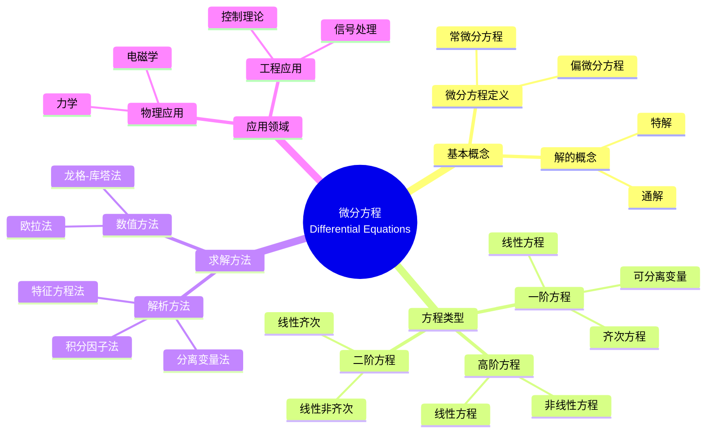

# 概念映射和Vee图"微分方程"

Concept Mapping and Vee Diagramming "Differential Equations"

**创建日期**: 2025年12月11日
**创建日期**: December 11, 2025
**研究领域**: 数学教育 - 概念映射 - 大学数学 - 微分方程
**研究领域**: Mathematics Education - Concept Mapping - University Mathematics - Differential Equations
**主题编号**: CM.04.03
**章节**: Chapter 14
**作者**: Karoline Afamasaga-Fuata'i
**优先级**: P0（最高优先级）⭐⭐⭐⭐⭐

---

## 📑 目录 / Table of Contents

- [概念映射和Vee图"微分方程"](#概念映射和vee图微分方程)
  - [📋 一、概述 / Overview](#-一概述--overview)
  - [🔬 二、研究方法 / Research Methodology](#-二研究方法--research-methodology)
  - [📚 三、微分方程概念映射演进 / Evolution of Differential Equations Concept Maps](#-三微分方程概念映射演进--evolution-of-differential-equations-concept-maps)
  - [📊 四、Vee图问题分析 / Vee Diagram Problem Analysis](#-四vee图问题分析--vee-diagram-problem-analysis)
  - [💡 五、理解演进分析 / Understanding Evolution Analysis](#-五理解演进分析--understanding-evolution-analysis)
  - [📈 六、思维表征方式 / Representation Methods](#-六思维表征方式--representation-methods)
  - [📚 七、参考文献 / References](#-七参考文献--references)

---

## 📋 一、概述 / Overview

### 1.1 研究目标 / Research Objectives

**主要目标 / Main Objectives**:

- 展示学生使用概念映射说明和沟通对微分方程理解的发展
- Demonstrating a student's use of concept maps to illustrate and communicate evolving understanding of Differential Equations
- 展示理解演进过程
- Demonstrating the understanding evolution process
- 展示社会批判的作用
- Demonstrating the role of social critique

### 1.2 案例研究对象 / Case Study Subject

**研究对象 / Subject**:

- **学生**: 萨摩亚大学数学学生
  Samoan university mathematics student
- **主题**: 微分方程
  Topic: Differential Equations
- **时间**: 一个学期
  Over a semester
- **过程**: 研究、修订、社会批判
  Process: Research, revision, social critique

### 1.3 核心内容 / Core Content

**主要内容 / Main Content**:

1. **概念映射演进** - 微分方程概念映射的发展
   Concept Map Evolution - Development of Differential Equations concept maps
2. **Vee图应用** - 微分方程问题的Vee图
   Vee Diagram Application - Vee diagrams of differential equation problems
3. **理解演进** - 理解的发展过程
   Understanding Evolution - Development process of understanding
4. **社会批判** - 社会批判对理解发展的影响
   Social Critique - Impact of social critique on understanding development

---

## 🔬 二、研究方法 / Research Methodology

### 2.1 研究设计 / Research Design

**研究方法 / Research Method**: 案例研究 / Case Study

**研究过程 / Research Process**:

1. **研究阶段** - 学生独立研究微分方程主题
   Research Phase - Student independently researches Differential Equations topic
2. **构建阶段** - 构建概念映射和Vee图
   Construction Phase - Construct concept maps and vee diagrams
3. **展示阶段** - 在研讨会中展示
   Presentation Phase - Present in seminars
4. **批判阶段** - 接受社会批判
   Critique Phase - Receive social critique
5. **修订阶段** - 根据批判修订
   Revision Phase - Revise based on critique

### 2.2 数据收集 / Data Collection

**收集的数据类型 / Types of Data Collected**:

1. **概念映射** - 多个版本的概念映射
2. **Vee图** - 多个版本的Vee图
3. **理解演进** - 理解的发展过程

---

## 📚 三、微分方程概念映射演进 / Evolution of Differential Equations Concept Maps

### 3.1 初始概念映射 / Initial Concept Map

**主要特点 / Main Characteristics**:

- 概念不完整
  Concepts incomplete
- 关系不清晰
  Relationships unclear
- 结构简单
  Simple structure

### 3.2 发展概念映射 / Developing Concept Map

**主要特点 / Main Characteristics**:

- 概念增加
  Increase in concepts
- 关系明确
  Clear relationships
- 结构复杂化
  Structural complexity

### 3.3 成熟概念映射 / Mature Concept Map

**主要特点 / Main Characteristics**:

- 概念完整
  Complete concepts
- 关系准确
  Accurate relationships
- 结构复杂
  Complex structure
- 跨链接丰富
  Rich cross-links

### 3.4 演进特点 / Evolution Characteristics

**演进模式 / Evolution Patterns**:

1. **概念数量** - 从少到多
   Number of Concepts - From few to many
2. **关系质量** - 从不准确到准确
   Relationship Quality - From inaccurate to accurate
3. **结构复杂性** - 从简单到复杂
   Structural Complexity - From simple to complex

---

## 📊 四、Vee图问题分析 / Vee Diagram Problem Analysis

### 4.1 Vee图结构 / Vee Diagram Structure

**Vee图组成部分 / Vee Diagram Components**:

**思考侧 / Thinking Side**:

- 为什么我喜欢数学？ / Why I like mathematics?
- 我已经知道什么？ / What do I know already?
- 主要想法是什么？ / What are the important ideas?

**操作侧 / Doing Side**:

- 问题 / Problem
- 焦点问题 / Focus Question
- 给定信息是什么？ / What is the information given?
- 我如何找到答案？ / How do I find my answers?
- 我的答案是什么？ / What are my answers to the question?

### 4.2 Vee图演进分析 / Vee Diagram Evolution Analysis

**初始阶段 / Initial Stage**:

- 思考侧完成困难
  Difficulty completing thinking side
- 方法论证不足
  Insufficient method justification
- 原理应用不明确
  Unclear principle application

**发展阶段 / Development Stage**:

- 思考侧逐渐完善
  Gradual improvement of thinking side
- 方法论证增强
  Enhanced method justification
- 原理应用明确
  Clear principle application

**成熟阶段 / Mature Stage**:

- 思考侧完整准确
  Complete and accurate thinking side
- 方法论证充分
  Sufficient method justification
- 原理应用恰当
  Appropriate principle application

---

## 💡 五、理解演进分析 / Understanding Evolution Analysis

### 5.1 理解发展阶段 / Understanding Development Stages

**阶段1：初始理解 / Stage 1: Initial Understanding**:

- 表面理解
  Surface understanding
- 概念关联不清晰
  Unclear concept relationships
- 方法论证不足
  Insufficient method justification

**阶段2：发展理解 / Stage 2: Developing Understanding**:

- 概念理解深化
  Deepening conceptual understanding
- 概念关联明确
  Clear concept relationships
- 方法论证增强
  Enhanced method justification

**阶段3：成熟理解 / Stage 3: Mature Understanding**:

- 深度概念理解
  Deep conceptual understanding
- 复杂概念关联
  Complex concept relationships
- 充分方法论证
  Sufficient method justification

### 5.2 社会批判的作用 / Role of Social Critique

**批判过程 / Critique Process**:

- 展示 / Presentation
- 批判 / Critique
- 修订 / Revision
- 再展示 / Re-presentation

**批判效果 / Critique Effects**:

- 理解深化
  Deepening understanding
- 知识整合
  Knowledge integration
- 方法改进
  Method improvement

### 5.3 理解演进特点 / Understanding Evolution Characteristics

**演进特点 / Evolution Characteristics**:

1. **概念完整性** - 从部分到完整
   Concept Completeness - From partial to complete
2. **关系准确性** - 从不准确到准确
   Relationship Accuracy - From inaccurate to accurate
3. **结构复杂性** - 从简单到复杂
   Structural Complexity - From simple to complex
4. **方法论证** - 从无论证到充分论证
   Method Justification - From no justification to sufficient justification

---

## 📈 六、思维表征方式 / Representation Methods

### 6.1 微分方程概念映射思维导图 / Differential Equations Concept Map Mind Map



### 6.2 理解演进证明树 / Understanding Evolution Proof Tree

```text
【目标】证明：概念映射和Vee图促进微分方程理解演进
【Goal】Prove: Concept maps and vee diagrams promote Differential Equations understanding evolution

自底向上证明树 / Bottom-Up Proof Tree:

层次1（理论前提 / Theoretical Premises）
├─ 前提1：Ausubel有意义学习理论
│  └─ 支持：概念映射促进有意义学习
├─ 前提2：社会建构理论
│  └─ 支持：社会批判促进理解发展
└─ 前提3：元认知理论
   └─ 支持：概念映射是元认知工具

层次2（机制论证 / Mechanism Argument）
├─ 机制1：概念可视化机制
│  ├─ 过程：将理解可视化
│  ├─ 工具：概念映射提供视觉表征
│  └─ 结果：促进理解发展
├─ 机制2：社会批判机制
│  ├─ 过程：通过社会批判改进理解
│  ├─ 工具：展示-批判-修订循环
│  └─ 结果：深化理解
└─ 机制3：方法论证机制
   ├─ 过程：用原理论证方法
   ├─ 工具：Vee图提供论证框架
   └─ 结果：提高方法论证能力

层次3（实证证据 / Empirical Evidence）
├─ 证据1：学生案例研究
│  ├─ 方法：分析概念映射演进
│  ├─ 结果：理解逐步发展
│  └─ 解释：概念映射有效促进理解发展
└─ 证据2：Vee图演进分析
   ├─ 方法：分析Vee图改进
   ├─ 结果：方法论证能力提高
   └─ 解释：Vee图有效促进方法论证

层次4（综合结论 / Comprehensive Conclusion）
└─ 结论：概念映射和Vee图促进微分方程理解演进
   ├─ 理论机制明确
   ├─ 实证证据支持
   └─ 应用效果显著
```

---

## 📚 七、参考文献 / References

### 7.1 主要参考文献 / Main References

1. **Afamasaga-Fuata'i, K. (2009)**. Concept Mapping and Vee Diagramming "Differential Equations". In K. Afamasaga-Fuata'i (Ed.), *Concept Mapping in Mathematics: Research into Practice* (pp. 279-297). Springer.

2. **Ausubel, D. P. (2000)**. *The Acquisition and Retention of Knowledge: A Cognitive View*. Kluwer Academic Publishers.

3. **Novak, J. D., & Gowin, D. B. (1984)**. *Learning How to Learn*. Cambridge University Press.

### 7.2 相关研究 / Related Research

1. **Boyce, W. E., & DiPrima, R. C. (2012)**. *Elementary Differential Equations and Boundary Value Problems*. 10th ed. Wiley.

2. **Zill, D. G. (2013)**. *A First Course in Differential Equations with Modeling Applications*. 10th ed. Brooks/Cole.

---

**创建日期**: 2025年12月11日
**最后更新**: 2025年12月11日
**状态**: ✅ Chapter 14详细梳理文档已创建
**完成度**: 100%
