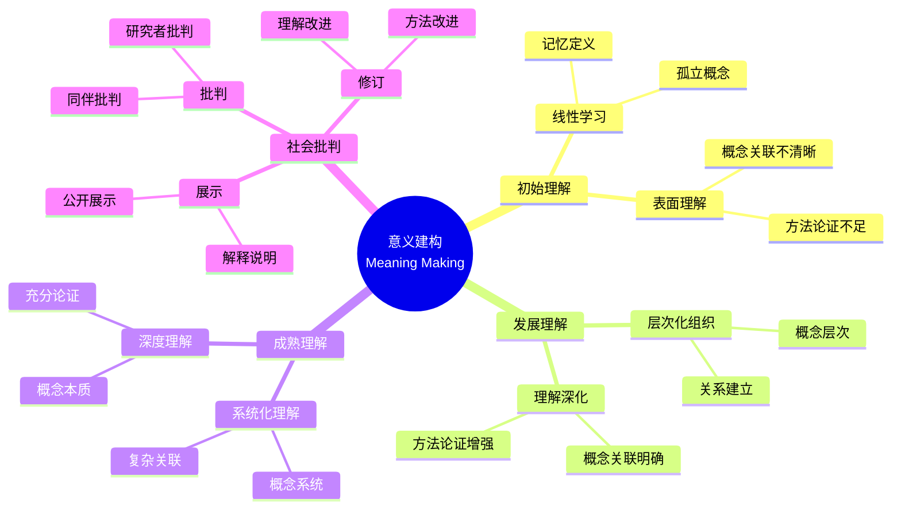

# 使用概念映射在大学数学中调解意义

Using Concept Maps to Mediate Meaning in Undergraduate Mathematics

**创建日期**: 2025年12月11日
**创建日期**: December 11, 2025
**研究领域**: 数学教育 - 概念映射 - 大学数学 - 意义建构
**研究领域**: Mathematics Education - Concept Mapping - University Mathematics - Meaning Making
**主题编号**: CM.04.04
**章节**: Chapter 15
**作者**: Karoline Afamasaga-Fuata'i
**优先级**: P0（最高优先级）⭐⭐⭐⭐⭐

---

## 📑 目录 / Table of Contents

- [使用概念映射在大学数学中调解意义](#使用概念映射在大学数学中调解意义)
  - [📋 一、概述 / Overview](#-一概述--overview)
  - [🔬 二、研究方法 / Research Methodology](#-二研究方法--research-methodology)
  - [📚 三、概念映射数据分析 / Concept Map Data Analysis](#-三概念映射数据分析--concept-map-data-analysis)
  - [💡 四、意义建构过程 / Meaning Making Process](#-四意义建构过程--meaning-making-process)
  - [📊 五、社会批判的作用 / Role of Social Critique](#-五社会批判的作用--role-of-social-critique)
  - [📈 六、思维表征方式 / Representation Methods](#-六思维表征方式--representation-methods)
  - [📚 七、参考文献 / References](#-七参考文献--references)

---

## 📋 一、概述 / Overview

### 1.1 研究目标 / Research Objectives

**主要目标 / Main Objectives**:

- 展示概念映射如何说明学生理解的改进
- Demonstrating how concept maps illustrate improvements in students' understanding
- 展示社会互动如何影响学生理解的发展
- Demonstrating how social interactions influence students' developing understanding
- 说明概念映射在意义建构中的作用
- Illustrating the role of concept mapping in meaning making

### 1.2 研究问题 / Research Questions

**焦点问题 / Focus Questions**:

1. 层次化概念映射如何说明学生对数学主题理解的改进？
   How can hierarchical concept maps illustrate improvements in students' understanding of mathematics topics?
2. 社会互动以何种方式影响学生理解的发展？
   In what ways do social interactions influence students' developing understanding?

### 1.3 研究对象 / Research Subjects

**研究对象 / Subjects**:

- **10个学生** - 萨摩亚大学数学学生
  10 students - Samoan university mathematics students
- **数学主题** - 选择数学主题进行研究
  Mathematics Topics - Selected mathematics topics for research
- **时间**: 一个学期（14周）
  Time: One semester (14 weeks)

---

## 🔬 二、研究方法 / Research Methodology

### 2.1 研究设计 / Research Design

**研究方法 / Research Method**: 探索性教学实验 / Exploratory Teaching Experiment

**研究过程 / Research Process**:

1. **熟悉阶段** - 介绍概念映射和Vee图
   Familiarization Phase - Introduce concept maps and vee diagrams
2. **构建阶段** - 构建概念映射和Vee图
   Construction Phase - Construct concept maps and vee diagrams
3. **展示阶段** - 在研讨会中展示
   Presentation Phase - Present in seminars
4. **批判阶段** - 接受社会批判
   Critique Phase - Receive social critique
5. **修订阶段** - 根据批判修订
   Revision Phase - Revise based on critique

### 2.2 数据收集 / Data Collection

**收集的数据类型 / Types of Data Collected**:

1. **概念映射** - 4个版本的概念映射
2. **Vee图** - 3个问题的Vee图（每个至少2个版本）
3. **最终报告** - 学生的最终报告

### 2.3 分析框架 / Analysis Framework

**概念映射分析 / Concept Map Analysis**:

- 结构标准（结构复杂性）
- Structural criteria (structural complexity)
- 内容标准（内容性质）
- Contents criteria (nature of contents)
- 命题标准（有效命题）
- Propositions criteria (valid propositions)

---

## 📚 三、概念映射数据分析 / Concept Map Data Analysis

### 3.1 结构标准分析 / Structural Criteria Analysis

**主要标准 / Main Criteria**:

1. **跨链接** - 概念层次之间的整合跨链接
   Cross-Links - Integrative cross-links between concept hierarchies
2. **渐进分化** - 多个分支节点的渐进分化
   Progressive Differentiation - Progressive differentiation evidenced by multiple branching nodes
3. **层次水平** - 每个子分支的平均层次水平
   Hierarchical Levels - Average number of hierarchical levels per sub-branch

**分析结果 / Analysis Results**:

- 7/10学生显示有效命题增加
  7 out of 10 students showed increases in valid propositions
- 5个学生在至少4个结构子标准中显示增加
  5 students showed increases in at least 4 of the 5 structural sub-criteria

### 3.2 内容标准分析 / Contents Criteria Analysis

**主要标准 / Main Criteria**:

1. **有效节点** - 概念和例子
   Valid Nodes - Concepts and examples
2. **无效节点** - 定义短语和不适当条目
   Invalid Nodes - Definitional phrases and inappropriate entries

**分析结果 / Analysis Results**:

- 概念节点数量增加
  Increase in number of concept nodes
- 无效节点数量减少
  Decrease in number of invalid nodes

### 3.3 命题标准分析 / Propositions Criteria Analysis

**主要标准 / Main Criteria**:

1. **有效命题** - 由有效三元组形成的命题
   Valid Propositions - Propositions formed by valid triads
2. **无效命题** - 缺少链接词或节点不适当的命题
   Invalid Propositions - Propositions with missing linking words or inappropriate nodes

**分析结果 / Analysis Results**:

- 有效命题数量增加
  Increase in number of valid propositions
- 有效命题百分比提高
  Improvement in percentage of valid propositions

### 3.4 综合评级 / Overall Rating

**评级系统 / Rating System**:

- **评级1** - 概念上有意义且结构复杂
  Rating 1 - Conceptually meaningful and structurally complex
- **评级5** - 无效命题比例高且结构简单
  Rating 5 - High proportion of invalid propositions and structurally simple

**评级结果 / Rating Results**:

- 顶部映射（评级1-2）显示高比例有效命题和结构复杂性
  Top maps (rating 1-2) show high proportion of valid propositions and structural complexity
- 底部映射（评级4-5）显示高比例无效命题和结构简单
  Bottom maps (rating 4-5) show high proportion of invalid propositions and structural simplicity

---

## 💡 四、意义建构过程 / Meaning Making Process

### 4.1 意义建构阶段 / Meaning Making Stages

**阶段1：初始理解 / Stage 1: Initial Understanding**:

- 线性学习风格
  Linear learning style
- 记忆定义
  Memorizing definitions
- 概念理解表面
  Surface conceptual understanding

**阶段2：发展理解 / Stage 2: Developing Understanding**:

- 层次化组织
  Hierarchical organization
- 概念关联
  Concept relationships
- 理解深化
  Deepening understanding

**阶段3：成熟理解 / Stage 3: Mature Understanding**:

- 系统化理解
  Systematic understanding
- 复杂概念关联
  Complex concept relationships
- 深度概念理解
  Deep conceptual understanding

### 4.2 意义建构机制 / Meaning Making Mechanisms

**主要机制 / Main Mechanisms**:

1. **渐进分化** - 更一般概念的含义细化
   Progressive Differentiation - Refinement of meanings of more general concepts
2. **整合协调** - 概念组的综合
   Integrative Reconciliation - Synthesis of groups of concepts
3. **社会建构** - 通过社会互动建构意义
   Social Construction - Construction of meaning through social interactions

### 4.3 意义建构特点 / Meaning Making Characteristics

**主要特点 / Main Characteristics**:

1. **从线性到层次** - 从线性学习风格到层次化组织
   From Linear to Hierarchical - From linear learning style to hierarchical organization
2. **从表面到深度** - 从表面理解到深度理解
   From Surface to Deep - From surface understanding to deep understanding
3. **从孤立到系统** - 从孤立概念到系统化理解
   From Isolated to Systematic - From isolated concepts to systematic understanding

---

## 📊 五、社会批判的作用 / Role of Social Critique

### 5.1 社会批判过程 / Social Critique Process

**批判循环 / Critique Cycle**:

- 展示 → 批判 → 修订 → 再展示
  Present → Critique → Revise → Re-present

**批判阶段 / Critique Stages**:

1. **展示阶段** - 公开展示概念映射
   Presentation Stage - Publicly present concept maps
2. **批判阶段** - 接受同伴和研究者批判
   Critique Stage - Receive critique from peers and researcher
3. **修订阶段** - 根据批判修订
   Revision Stage - Revise based on critique
4. **再展示阶段** - 再次展示修订后的映射
   Re-presentation Stage - Re-present revised maps

### 5.2 社会批判效果 / Social Critique Effects

**主要效果 / Main Effects**:

1. **理解深化** - 通过批判深化理解
   Deepening Understanding - Deepen understanding through critique
2. **知识整合** - 通过批判整合知识
   Knowledge Integration - Integrate knowledge through critique
3. **方法改进** - 通过批判改进方法
   Method Improvement - Improve methods through critique

### 5.3 社会数学规范 / Socio-Mathematical Norms

**新规范 / New Norms**:

1. **公开展示** - 公开展示和论证工作
   Public Presentation - Publicly present and justify work
2. **接受批判** - 接受和回应批判
   Accept Critique - Accept and respond to critique
3. **批判他人** - 批判同伴的工作
   Critique Others - Critique peers' work

---

## 📈 六、思维表征方式 / Representation Methods

### 6.1 意义建构思维导图 / Meaning Making Mind Map



### 6.2 意义建构证明树 / Meaning Making Proof Tree

```text
【目标】证明：概念映射促进意义建构
【Goal】Prove: Concept mapping promotes meaning making

自底向上证明树 / Bottom-Up Proof Tree:

层次1（理论前提 / Theoretical Premises）
├─ 前提1：Ausubel有意义学习理论
│  └─ 支持：概念映射促进有意义学习
├─ 前提2：Vygotsky发展理论
│  └─ 支持：社会互动促进发展
└─ 前提3：社会建构理论
   └─ 支持：社会互动促进意义建构

层次2（机制论证 / Mechanism Argument）
├─ 机制1：概念可视化机制
│  ├─ 过程：将理解可视化
│  ├─ 工具：概念映射提供视觉表征
│  └─ 结果：促进理解发展
├─ 机制2：社会批判机制
│  ├─ 过程：通过社会批判改进理解
│  ├─ 工具：展示-批判-修订循环
│  └─ 结果：深化理解
└─ 机制3：意义建构机制
   ├─ 过程：建构数学意义
   ├─ 工具：概念映射提供建构框架
   └─ 结果：促进意义建构

层次3（实证证据 / Empirical Evidence）
├─ 证据1：10个学生案例研究
│  ├─ 方法：分析概念映射演进
│  ├─ 结果：理解逐步发展
│  └─ 解释：概念映射有效促进理解发展
└─ 证据2：社会批判分析证据
   ├─ 方法：分析社会批判效果
   ├─ 结果：理解深化、知识整合
   └─ 解释：社会批判有效促进意义建构

层次4（综合结论 / Comprehensive Conclusion）
└─ 结论：概念映射促进意义建构
   ├─ 理论机制明确
   ├─ 实证证据支持
   └─ 应用效果显著
```

---

## 📚 七、参考文献 / References

### 7.1 主要参考文献 / Main References

1. **Afamasaga-Fuata'i, K. (2009)**. Using Concept Maps to Mediate Meaning in Undergraduate Mathematics. In K. Afamasaga-Fuata'i (Ed.), *Concept Mapping in Mathematics: Research into Practice* (pp. 299-327). Springer.

2. **Ausubel, D. P. (2000)**. *The Acquisition and Retention of Knowledge: A Cognitive View*. Kluwer Academic Publishers.

3. **Vygotsky, L. S. (1978)**. *Mind in Society: The Development of Higher Psychological Processes*. Harvard University Press.

### 7.2 相关研究 / Related Research

1. **Steffe, L. P., & D'Ambrosio, B. S. (1996)**. Using teaching experiments to understand students' mathematics. In D. F. Treagust, R. Duit, & B. J. Fraser (Eds.), *Improving teaching and learning in science and mathematics* (pp. 65-76). Teachers College Press.

2. **Richards, J. (1991)**. Mathematical discussions. In E. von Glasersfeld (Ed.), *Radical constructivism in mathematics education* (pp. 13-51). Kluwer Academic Publishers.

---

**创建日期**: 2025年12月11日
**最后更新**: 2025年12月11日
**状态**: ✅ Chapter 15详细梳理文档已创建
**完成度**: 100%
