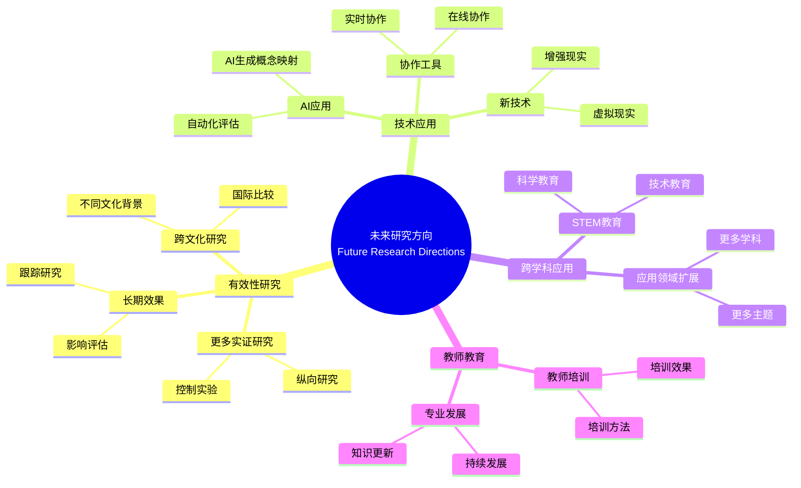

# 启示与未来研究方向

Implications and Future Research Directions

**创建日期**: 2025年12月11日
**创建日期**: December 11, 2025
**研究领域**: 数学教育 - 概念映射 - 未来方向
**研究领域**: Mathematics Education - Concept Mapping - Future Directions
**主题编号**: CM.05.01
**章节**: Chapter 16
**作者**: Karoline Afamasaga-Fuata'i
**优先级**: P0（最高优先级）⭐⭐⭐⭐⭐

---

## 📑 目录 / Table of Contents

- [启示与未来研究方向](#启示与未来研究方向)
  - [📑 目录 / Table of Contents](#-目录--table-of-contents)
  - [📋 一、概述 / Overview](#-一概述--overview)
    - [1.1 章节目标 / Chapter Objectives](#11-章节目标--chapter-objectives)
    - [1.2 核心内容 / Core Content](#12-核心内容--core-content)
  - [📚 二、各章节发现总结 / Chapter Findings Summary](#-二各章节发现总结--chapter-findings-summary)
    - [2.1 Part I发现 / Part I Findings](#21-part-i发现--part-i-findings)
    - [2.2 Part II发现 / Part II Findings](#22-part-ii发现--part-ii-findings)
    - [2.3 Part III发现 / Part III Findings](#23-part-iii发现--part-iii-findings)
    - [2.4 Part IV发现 / Part IV Findings](#24-part-iv发现--part-iv-findings)
    - [2.5 综合发现 / Comprehensive Findings](#25-综合发现--comprehensive-findings)
  - [💡 三、实践启示 / Practical Implications](#-三实践启示--practical-implications)
    - [3.1 对教师的启示 / Implications for Teachers](#31-对教师的启示--implications-for-teachers)
    - [3.2 对教育系统的启示 / Implications for Education Systems](#32-对教育系统的启示--implications-for-education-systems)
    - [3.3 对学生的启示 / Implications for Students](#33-对学生的启示--implications-for-students)
  - [🔬 四、未来研究方向 / Future Research Directions](#-四未来研究方向--future-research-directions)
    - [4.1 有效性研究 / Effectiveness Research](#41-有效性研究--effectiveness-research)
    - [4.2 技术应用研究 / Technology Application Research](#42-技术应用研究--technology-application-research)
    - [4.3 跨学科应用研究 / Cross-Disciplinary Application Research](#43-跨学科应用研究--cross-disciplinary-application-research)
    - [4.4 教师教育研究 / Teacher Education Research](#44-教师教育研究--teacher-education-research)
  - [🔗 四、未来研究方向与现有研究的关联分析 / Association Analysis Between Future Research Directions and Existing Research](#-四未来研究方向与现有研究的关联分析--association-analysis-between-future-research-directions-and-existing-research)
    - [4.5 有效性研究与现有证据基础的关联 / Association Between Effectiveness Research and Existing Evidence Base](#45-有效性研究与现有证据基础的关联--association-between-effectiveness-research-and-existing-evidence-base)
    - [4.6 技术应用研究与AI技术的关联 / Association Between Technology Application Research and AI Technology](#46-技术应用研究与ai技术的关联--association-between-technology-application-research-and-ai-technology)
    - [4.7 跨学科应用研究与数学统一性的关联 / Association Between Cross-Disciplinary Application Research and Mathematical Unity](#47-跨学科应用研究与数学统一性的关联--association-between-cross-disciplinary-application-research-and-mathematical-unity)
  - [📊 五、综合建议 / Comprehensive Recommendations](#-五综合建议--comprehensive-recommendations)
    - [5.1 对研究者的建议 / Recommendations for Researchers](#51-对研究者的建议--recommendations-for-researchers)
    - [5.2 对实践者的建议 / Recommendations for Practitioners](#52-对实践者的建议--recommendations-for-practitioners)
    - [5.3 对政策制定者的建议 / Recommendations for Policymakers](#53-对政策制定者的建议--recommendations-for-policymakers)
  - [📈 六、思维表征方式 / Representation Methods](#-六思维表征方式--representation-methods)
    - [6.1 未来研究方向思维导图 / Future Research Directions Mind Map](#61-未来研究方向思维导图--future-research-directions-mind-map)
    - [6.2 研究方向决策树 / Research Direction Decision Tree](#62-研究方向决策树--research-direction-decision-tree)
    - [6.3 研究优先级矩阵 / Research Priority Matrix](#63-研究优先级矩阵--research-priority-matrix)
  - [📚 七、参考文献 / References](#-七参考文献--references)
    - [7.1 主要参考文献 / Main References](#71-主要参考文献--main-references)
    - [7.2 相关研究 / Related Research](#72-相关研究--related-research)
    - [7.3 2024-2025最新研究 / Latest Research 2024-2025](#73-2024-2025最新研究--latest-research-2024-2025)
  - [🗺️ 八、实施路线图 / Implementation Roadmap](#️-八实施路线图--implementation-roadmap)
    - [8.1 短期目标（1-2年） / Short-Term Goals (1-2 Years)](#81-短期目标1-2年--short-term-goals-1-2-years)
    - [8.2 中期目标（3-5年） / Medium-Term Goals (3-5 Years)](#82-中期目标3-5年--medium-term-goals-3-5-years)
    - [8.3 长期目标（5-10年） / Long-Term Goals (5-10 Years)](#83-长期目标5-10年--long-term-goals-5-10-years)

---

## 📋 一、概述 / Overview

### 1.1 章节目标 / Chapter Objectives

**主要目标 / Main Objectives**:

- 总结各章节的发现和启示
- Summarizing findings and implications from all chapters
- 提出将概念映射纳入真实课堂的建议
- Proposing suggestions for incorporating concept mapping in real classrooms
- 提出未来研究方向
- Proposing future research directions

### 1.2 核心内容 / Core Content

**主要内容 / Main Content**:

1. **章节发现总结** - 所有章节主要发现的综合总结
   Chapter Findings Summary - Comprehensive summary of main findings from all chapters
2. **实践启示** - 将概念映射纳入真实课堂的启示
   Practical Implications - Implications for incorporating concept mapping in real classrooms
3. **未来研究方向** - 概念映射在数学教育中的未来研究方向
   Future Research Directions - Future research directions for concept mapping in mathematics education

---

## 📚 二、各章节发现总结 / Chapter Findings Summary

### 2.1 Part I发现 / Part I Findings

**历史发展 / Historical Development**:

- 概念映射工具的发展历史
  Development history of concept mapping tool
- CmapTools技术发展
  CmapTools technical development
- 教育新模式
  New Model for Education

### 2.2 Part II发现 / Part II Findings

**初等数学应用 / Primary Mathematics Applications**:

- 概念映射在主题分析中的应用
  Application of concept mapping in topic analysis
- 概念映射在教师教育中的应用
  Application of concept mapping in teacher education
- 概念映射作为学习和评估工具
  Concept mapping as learning and assessment tools

### 2.3 Part III发现 / Part III Findings

**中等数学应用 / Secondary Mathematics Applications**:

- 概念映射在学习监控中的应用
  Application of concept mapping in learning monitoring
- 概念映射在教学规划中的应用
  Application of concept mapping in teaching planning
- 概念映射在跨学科应用中的应用
  Application of concept mapping in cross-disciplinary applications

### 2.4 Part IV发现 / Part IV Findings

**大学数学应用 / University Mathematics Applications**:

- 概念映射在高等数学学习中的应用
  Application of concept mapping in advanced mathematics learning
- 概念映射在意义建构中的应用
  Application of concept mapping in meaning making
- 概念映射在工程数学中的应用
  Application of concept mapping in engineering mathematics

### 2.5 综合发现 / Comprehensive Findings

**主要发现 / Main Findings**:

1. **有效性** - 概念映射在数学教育中有效
   Effectiveness - Concept mapping is effective in mathematics education
2. **适用性** - 适用于所有教育层次
   Applicability - Applicable to all educational levels
3. **多样性** - 多种应用方式
   Diversity - Multiple application methods

---

## 💡 三、实践启示 / Practical Implications

### 3.1 对教师的启示 / Implications for Teachers

**主要启示 / Main Implications**:

1. **逐步引入** - 逐步将概念映射引入课堂
   Gradual Introduction - Gradually introduce concept mapping to classrooms
2. **提供支持** - 为学生提供充分支持
   Provide Support - Provide adequate support for students
3. **持续评估** - 持续评估应用效果
   Continuous Assessment - Continuously assess application effectiveness

### 3.2 对教育系统的启示 / Implications for Education Systems

**主要启示 / Main Implications**:

1. **课程整合** - 将概念映射整合到课程中
   Curriculum Integration - Integrate concept mapping into curriculum
2. **教师培训** - 提供教师培训和支持
   Teacher Training - Provide teacher training and support
3. **资源提供** - 提供必要资源
   Resource Provision - Provide necessary resources

### 3.3 对学生的启示 / Implications for Students

**主要启示 / Main Implications**:

1. **学习工具** - 概念映射作为有效学习工具
   Learning Tool - Concept mapping as effective learning tool
2. **评估工具** - 概念映射作为评估工具
   Assessment Tool - Concept mapping as assessment tool
3. **协作工具** - 概念映射支持协作学习
   Collaboration Tool - Concept mapping supports collaborative learning

---

## 🔬 四、未来研究方向 / Future Research Directions

### 4.1 有效性研究 / Effectiveness Research

**研究方向 / Research Directions**:

1. **更多实证研究** - 验证概念映射的有效性
   More Empirical Research - Validate effectiveness of concept mapping
   - **元分析研究** - 综合元分析（Wang et al., 2025显示中等效应量）
     Meta-Analysis Research - Comprehensive meta-analysis (Wang et al., 2025 shows moderate effect size)
   - **控制实验** - 更多控制实验研究
     Controlled Experiments - More controlled experimental studies
   - **多变量分析** - 多变量影响分析
     Multivariate Analysis - Multivariate impact analysis
2. **长期效果研究** - 研究长期效果
   Long-Term Effect Research - Research long-term effects
   - **纵向研究** - 长期跟踪研究（如Novak的12年纵向研究）
     Longitudinal Studies - Long-term tracking studies (e.g., Novak's 12-year longitudinal study)
   - **影响评估** - 长期学习影响评估
     Impact Assessment - Long-term learning impact assessment
   - **知识保持** - 知识保持效果研究
     Knowledge Retention - Knowledge retention effect research
3. **跨文化研究** - 跨文化应用研究
   Cross-Cultural Research - Cross-cultural application research
   - **文化适应性** - 不同文化背景下的适应性
     Cultural Adaptability - Adaptability in different cultural contexts
   - **国际比较** - 国际比较研究
     International Comparison - International comparative studies
   - **本土化应用** - 本土化应用研究
     Localized Application - Localized application research

### 4.2 技术应用研究 / Technology Application Research

**研究方向 / Research Directions**:

1. **AI应用** - AI在概念映射中的应用
   AI Application - Application of AI in concept mapping
   - **大语言模型应用** - LLM生成概念映射（Zhai, 2025）
     Large Language Model Application - LLM-generated concept maps
   - **人机协作系统** - 人机协作概念映射构建
     Human-in-the-loop Systems - Human-AI collaborative concept map construction
   - **领域特定微调** - 数学教育领域的LLM微调
     Domain-Specific Fine-tuning - LLM fine-tuning for mathematics education
2. **自动化评估** - 自动化评估系统
   Automated Assessment - Automated assessment systems
   - **结构分析** - 概念映射结构自动分类（Vossen et al., 2025）
     Structural Analysis - Automatic classification of concept map structures
   - **质量评估** - 自动化质量评估系统
     Quality Assessment - Automated quality assessment systems
   - **理解诊断** - 自动诊断概念理解
     Understanding Diagnosis - Automatic diagnosis of conceptual understanding
3. **协作工具** - 协作工具开发
   Collaboration Tools - Collaboration tool development
   - **实时协作** - 实时在线协作功能
     Real-time Collaboration - Real-time online collaboration features
   - **智能支持** - AI支持的协作学习
     Intelligent Support - AI-supported collaborative learning

### 4.3 跨学科应用研究 / Cross-Disciplinary Application Research

**研究方向 / Research Directions**:

1. **STEM应用** - STEM教育中的应用
   STEM Application - Application in STEM education
2. **跨学科整合** - 跨学科整合研究
   Cross-Disciplinary Integration - Cross-disciplinary integration research
3. **应用领域扩展** - 扩展到更多应用领域
   Application Domain Extension - Extend to more application domains

### 4.4 教师教育研究 / Teacher Education Research

**研究方向 / Research Directions**:

1. **教师培训** - 教师培训方法研究
   Teacher Training - Teacher training method research
2. **专业发展** - 教师专业发展研究
   Professional Development - Teacher professional development research
3. **教学知识** - 教学知识发展研究
   Pedagogical Knowledge - Pedagogical knowledge development research

---

## 🔗 四、未来研究方向与现有研究的关联分析 / Association Analysis Between Future Research Directions and Existing Research

本节深入分析未来研究方向与现有研究之间的关联，展示未来研究如何建立在现有研究基础上，以及如何通过数学建模来指导未来研究。

### 4.5 有效性研究与现有证据基础的关联 / Association Between Effectiveness Research and Existing Evidence Base

**核心关联 / Core Association**:

未来有效性研究需要建立在现有证据基础之上，通过元分析整合现有研究，识别研究空白，指导未来研究方向。数学建模可以帮助量化研究效果，预测研究结果。

**证据基础的数学建模 / Mathematical Modeling of Evidence Base**:

- **元分析的统计模型**: 元分析通过整合多个研究的结果，估计总体效应量。设第 $i$ 个研究的效应量为 $d_i$，权重为 $w_i$，则总体效应量为：
  \[
  \bar{d} = \frac{\sum_{i=1}^{n} w_i d_i}{\sum_{i=1}^{n} w_i}
  \]
  其中权重通常取为研究方差的倒数：$w_i = 1/\sigma_i^2$。Wang et al. (2025)的元分析显示中等效应量，为未来有效性研究提供了基准。
- **Statistical Model of Meta-Analysis**: Meta-analysis estimates overall effect sizes by integrating results from multiple studies. Let the effect size of the $i$-th study be $d_i$ and the weight be $w_i$, then the overall effect size is:
  \[
  \bar{d} = \frac{\sum_{i=1}^{n} w_i d_i}{\sum_{i=1}^{n} w_i}
  \]
  where weights are typically taken as the inverse of study variance: $w_i = 1/\sigma_i^2$. The meta-analysis by Wang et al. (2025) shows moderate effect sizes, providing a benchmark for future effectiveness research.
- **研究空白的识别**: 通过分析现有研究的分布，可以识别研究空白。设研究空间为 $R$，现有研究覆盖的区域为 $C$，则研究空白为 $G = R \setminus C$。未来研究应该优先填补这些空白。
- **Identification of Research Gaps**: By analyzing the distribution of existing studies, research gaps can be identified. Let the research space be $R$ and the region covered by existing studies be $C$, then research gaps are $G = R \setminus C$. Future research should prioritize filling these gaps.

**数学结构分析 / Mathematical Structure Analysis**:

- **效应量的预测模型**: 基于现有研究的特征（如教育层次、数学主题、应用类型等），可以建立效应量预测模型：
  \[
  d = f(X_1, X_2, \ldots, X_n) + \epsilon
  \]
  其中 $X_i$ 是研究特征，$f$ 是预测函数，$\epsilon$ 是误差项。这个模型可以帮助预测未来研究的效果。
- **Prediction Model of Effect Sizes**: Based on characteristics of existing studies (such as educational level, mathematics topic, application type, etc.), an effect size prediction model can be established:
  \[
  d = f(X_1, X_2, \ldots, X_n) + \epsilon
  \]
  where $X_i$ are study characteristics, $f$ is a prediction function, and $\epsilon$ is an error term. This model can help predict the effects of future research.

**应用扩展 / Application Extensions**:

- **研究设计优化**: 基于效应量预测模型，可以优化研究设计，选择最有可能产生显著效果的研究条件。
- **Research Design Optimization**: Based on effect size prediction models, research designs can be optimized, selecting research conditions most likely to produce significant effects.
- **样本量计算**: 基于预期效应量，可以计算所需样本量，确保研究有足够的统计功效。
- **Sample Size Calculation**: Based on expected effect sizes, required sample sizes can be calculated to ensure studies have sufficient statistical power.

**数学意义 / Mathematical Meaning**:

- 有效性研究与现有证据基础的关联在数学上可以建模为**贝叶斯更新问题**，现有研究提供先验分布，新研究提供似然函数，通过贝叶斯更新得到后验分布，指导未来研究。
- The association between effectiveness research and existing evidence base can be mathematically modeled as a **Bayesian updating problem**, where existing research provides prior distributions, new research provides likelihood functions, and posterior distributions are obtained through Bayesian updating to guide future research.

### 4.6 技术应用研究与AI技术的关联 / Association Between Technology Application Research and AI Technology

**核心关联 / Core Association**:

未来技术应用研究需要充分利用AI技术的最新发展，特别是大语言模型在概念映射生成中的应用。AI技术的有效性需要通过数学建模来评估和优化。

**AI技术的数学建模 / Mathematical Modeling of AI Technology**:

- **大语言模型的生成模型**: 大语言模型生成概念映射可以建模为条件概率分布：
  \[
  P(\text{CM} | \text{Input}) = \prod_{i=1}^{n} P(c_i | c_1, \ldots, c_{i-1}, \text{Input})
  \]
  其中 $\text{CM}$ 是概念映射，$c_i$ 是第 $i$ 个概念，$\text{Input}$ 是输入（如文本、问题等）。Zhai (2025)的研究表明，通过领域特定微调可以提高生成质量。
- **Generation Model of Large Language Models**: Large language model generation of concept maps can be modeled as conditional probability distributions:
  \[
  P(\text{CM} | \text{Input}) = \prod_{i=1}^{n} P(c_i | c_1, \ldots, c_{i-1}, \text{Input})
  \]
  where $\text{CM}$ is the concept map, $c_i$ is the $i$-th concept, and $\text{Input}$ is the input (such as text, questions, etc.). Research by Zhai (2025) shows that domain-specific fine-tuning can improve generation quality.
- **人机协作的优化模型**: 人机协作系统可以建模为优化问题，目标是最大化协作效果：
  \[
  \max_{w_h, w_a} U(w_h \cdot H + w_a \cdot A)
  \]
  其中 $H$ 是人工输入，$A$ 是AI输出，$w_h$ 和 $w_a$ 是权重，$U$ 是效用函数。最优权重可以通过学习算法来确定。
- **Optimization Model of Human-AI Collaboration**: Human-AI collaboration systems can be modeled as optimization problems, with the goal of maximizing collaboration effectiveness:
  \[
  \max_{w_h, w_a} U(w_h \cdot H + w_a \cdot A)
  \]
  where $H$ is human input, $A$ is AI output, $w_h$ and $w_a$ are weights, and $U$ is a utility function. Optimal weights can be determined through learning algorithms.

**数学结构分析 / Mathematical Structure Analysis**:

- **自动化评估的图论模型**: 概念映射的自动化评估可以基于图论指标。设专家概念映射为 $G_e = (V_e, E_e)$，学生概念映射为 $G_s = (V_s, E_s)$，则评估分数可以定义为：
  \[
  S = \alpha \cdot \frac{|V_s \cap V_e|}{|V_e|} + \beta \cdot \frac{|E_s \cap E_e|}{|E_e|} + \gamma \cdot \text{sim}(G_s, G_e)
  \]
  其中 $\text{sim}(G_s, G_e)$ 是图相似性度量（如图编辑距离），$\alpha, \beta, \gamma$ 是权重。
- **Graph-Theoretic Model of Automated Assessment**: Automated assessment of concept maps can be based on graph theory indicators. Let expert concept map be $G_e = (V_e, E_e)$ and student concept map be $G_s = (V_s, E_s)$, then the assessment score can be defined as:
  \[
  S = \alpha \cdot \frac{|V_s \cap V_e|}{|V_e|} + \beta \cdot \frac{|E_s \cap E_e|}{|E_e|} + \gamma \cdot \text{sim}(G_s, G_e)
  \]
  where $\text{sim}(G_s, G_e)$ is a graph similarity measure (such as graph edit distance), and $\alpha, \beta, \gamma$ are weights.

**应用扩展 / Application Extensions**:

- **AI模型的持续学习**: 基于评估反馈，AI模型可以持续学习，改进生成质量。这可以建模为在线学习问题。
- **Continuous Learning of AI Models**: Based on assessment feedback, AI models can continuously learn to improve generation quality. This can be modeled as an online learning problem.
- **个性化生成**: 基于学生的先验知识，可以个性化生成概念映射，这可以建模为个性化推荐问题。
- **Personalized Generation**: Based on students' prior knowledge, concept maps can be personalized, which can be modeled as a personalized recommendation problem.

**数学意义 / Mathematical Meaning**:

- 技术应用研究与AI技术的关联在数学上可以建模为**机器学习优化问题**，目标是找到最优的AI模型参数，使得生成的概念映射质量最大化。这为AI技术在概念映射中的应用提供了数学理论基础。
- The association between technology application research and AI technology can be mathematically modeled as a **machine learning optimization problem**, with the goal of finding optimal AI model parameters that maximize the quality of generated concept maps. This provides a mathematical theoretical foundation for the application of AI technology in concept mapping.

### 4.7 跨学科应用研究与数学统一性的关联 / Association Between Cross-Disciplinary Application Research and Mathematical Unity

**核心关联 / Core Association**:

跨学科应用研究体现了数学的统一性，不同学科（如物理、化学、工程）中的数学应用都基于相同的数学结构。概念映射可以显化这种统一性，促进跨学科理解。

**数学统一性的结构分析 / Structural Analysis of Mathematical Unity**:

- **跨学科概念的数学结构**: 不同学科中的数学概念（如函数、方程、变换）具有相同的数学结构。概念映射可以显化这种结构，展示跨学科应用中的数学统一性。
- **Mathematical Structure of Cross-Disciplinary Concepts**: Mathematical concepts in different disciplines (such as functions, equations, transformations) have the same mathematical structure. Concept maps can make this structure explicit, demonstrating mathematical unity in cross-disciplinary applications.
- **概念映射的跨学科网络**: 跨学科应用可以建模为概念映射网络，其中节点表示概念，边表示概念之间的跨学科关联。这个网络的结构反映了数学在不同学科中的应用模式。
- **Cross-Disciplinary Network of Concept Maps**: Cross-disciplinary applications can be modeled as concept map networks, where nodes represent concepts and edges represent cross-disciplinary associations between concepts. The structure of this network reflects application patterns of mathematics in different disciplines.

**数学结构分析 / Mathematical Structure Analysis**:

- **跨学科关联的图论模型**: 跨学科应用可以建模为多部图（multipartite graph），其中不同部分表示不同学科，边表示跨学科关联。设学科集合为 $D = \{d_1, d_2, \ldots, d_n\}$，概念集合为 $C = \bigcup_{i=1}^{n} C_i$，其中 $C_i$ 是学科 $d_i$ 的概念集合，则跨学科关联图 $G = (C, E)$，其中 $E = \{(c_i, c_j) | c_i \in C_k, c_j \in C_l, k \neq l\}$。
- **Graph-Theoretic Model of Cross-Disciplinary Associations**: Cross-disciplinary applications can be modeled as multipartite graphs, where different parts represent different disciplines and edges represent cross-disciplinary associations. Let the discipline set be $D = \{d_1, d_2, \ldots, d_n\}$ and the concept set be $C = \bigcup_{i=1}^{n} C_i$, where $C_i$ is the concept set of discipline $d_i$, then the cross-disciplinary association graph is $G = (C, E)$, where $E = \{(c_i, c_j) | c_i \in C_k, c_j \in C_l, k \neq l\}$.

**应用扩展 / Application Extensions**:

- **跨学科课程设计**: 基于跨学科关联图，可以设计跨学科课程，显化数学在不同学科中的应用。
- **Cross-Disciplinary Curriculum Design**: Based on cross-disciplinary association graphs, cross-disciplinary curricula can be designed to make explicit the application of mathematics in different disciplines.
- **跨学科问题解决**: 概念映射可以帮助学生识别跨学科问题中的数学结构，应用数学方法解决问题。
- **Cross-Disciplinary Problem Solving**: Concept maps can help students identify mathematical structures in cross-disciplinary problems and apply mathematical methods to solve them.

**数学意义 / Mathematical Meaning**:

- 跨学科应用研究与数学统一性的关联在数学上可以建模为**图同构问题**，目标是识别不同学科中相同数学结构的不同表现形式。这为跨学科应用研究提供了数学理论基础。
- The association between cross-disciplinary application research and mathematical unity can be mathematically modeled as a **graph isomorphism problem**, with the goal of identifying different representations of the same mathematical structure in different disciplines. This provides a mathematical theoretical foundation for cross-disciplinary application research.

---

## 📊 五、综合建议 / Comprehensive Recommendations

### 5.1 对研究者的建议 / Recommendations for Researchers

**主要建议 / Main Recommendations**:

1. **更多研究** - 进行更多实证研究
   More Research - Conduct more empirical research
2. **方法创新** - 创新研究方法
   Method Innovation - Innovate research methods
3. **跨学科合作** - 促进跨学科合作
   Cross-Disciplinary Collaboration - Promote cross-disciplinary collaboration

### 5.2 对实践者的建议 / Recommendations for Practitioners

**主要建议 / Main Recommendations**:

1. **逐步实施** - 逐步实施概念映射
   Gradual Implementation - Gradually implement concept mapping
2. **持续支持** - 提供持续支持
   Ongoing Support - Provide ongoing support
3. **评估改进** - 持续评估和改进
   Continuous Assessment and Improvement - Continuously assess and improve

### 5.3 对政策制定者的建议 / Recommendations for Policymakers

**主要建议 / Main Recommendations**:

1. **政策支持** - 提供政策支持
   Policy Support - Provide policy support
2. **资源投入** - 投入必要资源
   Resource Investment - Invest necessary resources
3. **标准制定** - 制定相关标准
   Standard Development - Develop relevant standards

---

## 📈 六、思维表征方式 / Representation Methods

### 6.1 未来研究方向思维导图 / Future Research Directions Mind Map



### 6.2 研究方向决策树 / Research Direction Decision Tree

```text
如何选择未来研究方向？
├─ 研究目标是什么？
│  ├─ 验证有效性
│  │  └─ ✅ 有效性研究
│  │     └─ 方向：实证研究、长期效果
│  ├─ 技术应用
│  │  └─ ✅ 技术应用研究
│  │     └─ 方向：AI应用、自动化
│  ├─ 跨学科应用
│  │  └─ ✅ 跨学科应用研究
│  │     └─ 方向：STEM、应用扩展
│  └─ 教师教育
│     └─ ✅ 教师教育研究
│        └─ 方向：培训、专业发展
├─ 研究方法是什么？
│  ├─ 实验研究
│  │  └─ ✅ 控制实验、准实验
│  ├─ 案例研究
│  │  └─ ✅ 深入案例研究
│  ├─ 纵向研究
│  │  └─ ✅ 长期跟踪研究
│  └─ 元分析
│     └─ ✅ 综合元分析
└─ 研究资源是什么？
   ├─ 充足资源
   │  └─ ✅ 大规模研究
   ├─ 有限资源
   │  └─ ✅ 小规模深入研究
   └─ 协作资源
      └─ ✅ 协作研究
```

### 6.3 研究优先级矩阵 / Research Priority Matrix

| 研究方向<br/>Research Direction | 重要性<br/>Importance | 可行性<br/>Feasibility | 紧迫性<br/>Urgency | 证据基础<br/>Evidence Base | 优先级<br/>Priority |
|-------------------------------|---------------------|---------------------|-------------------|------------------------|-------------------|
| **有效性研究**<br/>Effectiveness Research | ⭐⭐⭐<br/>高<br/>High | ⭐⭐⭐<br/>高<br/>High | ⭐⭐⭐<br/>高<br/>High | ⭐⭐⭐<br/>强<br/>Strong | ⭐⭐⭐<br/>最高<br/>Highest |
| **技术应用研究**<br/>Technology Application Research | ⭐⭐⭐<br/>高<br/>High | ⭐⭐<br/>中<br/>Medium | ⭐⭐⭐<br/>高<br/>High | ⭐⭐<br/>中<br/>Medium | ⭐⭐⭐<br/>高<br/>High |
| **跨学科应用研究**<br/>Cross-Disciplinary Application Research | ⭐⭐<br/>中<br/>Medium | ⭐⭐<br/>中<br/>Medium | ⭐⭐<br/>中<br/>Medium | ⭐⭐<br/>中<br/>Medium | ⭐⭐<br/>中<br/>Medium |
| **教师教育研究**<br/>Teacher Education Research | ⭐⭐⭐<br/>高<br/>High | ⭐⭐⭐<br/>高<br/>High | ⭐⭐<br/>中<br/>Medium | ⭐⭐⭐<br/>强<br/>Strong | ⭐⭐⭐<br/>高<br/>High |
| **自动化应用研究**<br/>Automation Application Research | ⭐⭐⭐<br/>高<br/>High | ⭐⭐<br/>中<br/>Medium | ⭐⭐⭐<br/>高<br/>High | ⭐<br/>弱<br/>Weak | ⭐⭐⭐<br/>高<br/>High |
| **结构分析研究**<br/>Structural Analysis Research | ⭐⭐<br/>中<br/>Medium | ⭐⭐⭐<br/>高<br/>High | ⭐⭐<br/>中<br/>Medium | ⭐<br/>弱<br/>Weak | ⭐⭐<br/>中<br/>Medium |

**说明 / Notes**:

- **证据基础** - 基于2024-2025最新研究综述
- Evidence Base - Based on 2024-2025 latest research review
- **自动化应用研究** - 虽然证据基础弱，但技术发展迅速，紧迫性高
- Automation Application Research - Although evidence base is weak, technology develops rapidly, urgency is high

---

## 📚 七、参考文献 / References

### 7.1 主要参考文献 / Main References

1. **Afamasaga-Fuata'i, K. (2009)**. Implications and Future Research Directions. In K. Afamasaga-Fuata'i (Ed.), *Concept Mapping in Mathematics: Research into Practice* (pp. 329-333). Springer.

2. **Novak, J. D., & Cañas, A. J. (2009)**. The Development and Evolution of the Concept Mapping Tool Leading to a New Model for Mathematics Education. In K. Afamasaga-Fuata'i (Ed.), *Concept Mapping in Mathematics: Research into Practice* (pp. 3-15). Springer.

### 7.2 相关研究 / Related Research

1. **所有章节的参考文献** - 见各章节参考文献部分
   References from All Chapters - See reference sections of each chapter

### 7.3 2024-2025最新研究 / Latest Research 2024-2025

1. **Wang, X., et al. (2025)**. Meta-analysis of concept mapping effects on student achievement in STEM disciplines. *International Journal of STEM Education*.
   - 37项研究（2004-2023）的综合分析
   - 中等效应量，表明概念映射对STEM学科学习有积极影响

2. **Zhai, X. (2025)**. Large language models for concept map generation: A systematic review. *arXiv preprint*.
   - 大语言模型在概念映射生成中的应用
   - 人机协作系统和领域特定微调模型

3. **Vossen, T., et al. (2025)**. Structural classification of concept maps using decision trees. *arXiv preprint*.
   - 概念映射结构分类（spoke, network, chain）
   - 86%准确率的决策树分类模型

4. **Lee, J., et al. (2023)**. Concept mapping as assessment in university mathematics. *Educational Studies in Mathematics*.
   - 概念映射评估与期末考试成绩显著相关
   - 情感调节在评估情境中的作用

---

## 🗺️ 八、实施路线图 / Implementation Roadmap

### 8.1 短期目标（1-2年） / Short-Term Goals (1-2 Years)

**研究目标 / Research Goals**:

1. **完成更多元分析研究** - 扩大样本规模
   Complete More Meta-Analysis Studies - Expand sample size
2. **验证自动化工具** - 验证AI生成概念映射的有效性
   Validate Automation Tools - Validate effectiveness of AI-generated concept maps
3. **开发评估工具** - 开发自动化评估系统
   Develop Assessment Tools - Develop automated assessment systems

**实践目标 / Practice Goals**:

1. **教师培训项目** - 建立系统化的教师培训项目
   Teacher Training Programs - Establish systematic teacher training programs
2. **资源库建设** - 建立概念映射资源库
   Resource Library Construction - Build concept mapping resource library
3. **试点项目** - 在更多学校开展试点项目
   Pilot Projects - Conduct pilot projects in more schools

### 8.2 中期目标（3-5年） / Medium-Term Goals (3-5 Years)

**研究目标 / Research Goals**:

1. **长期效果研究** - 完成5年以上的纵向研究
   Long-Term Effect Research - Complete longitudinal studies over 5 years
2. **跨文化研究** - 完成跨文化比较研究
   Cross-Cultural Research - Complete cross-cultural comparative studies
3. **个性化研究** - 研究个性化概念映射应用
   Personalization Research - Research personalized concept mapping applications

**实践目标 / Practice Goals**:

1. **课程整合** - 将概念映射整合到主流课程中
   Curriculum Integration - Integrate concept mapping into mainstream curriculum
2. **标准化** - 建立概念映射评估标准
   Standardization - Establish concept mapping assessment standards
3. **技术平台** - 开发统一的技术平台
   Technology Platform - Develop unified technology platform

### 8.3 长期目标（5-10年） / Long-Term Goals (5-10 Years)

**研究目标 / Research Goals**:

1. **理论完善** - 完善概念映射理论框架
   Theoretical Refinement - Refine concept mapping theoretical framework
2. **跨学科整合** - 实现跨学科概念映射应用
   Cross-Disciplinary Integration - Achieve cross-disciplinary concept mapping applications
3. **智能化发展** - 实现智能化概念映射系统
   Intelligent Development - Achieve intelligent concept mapping systems

**实践目标 / Practice Goals**:

1. **全面应用** - 概念映射在数学教育中全面应用
   Comprehensive Application - Comprehensive application of concept mapping in mathematics education
2. **国际推广** - 国际推广概念映射方法
   International Promotion - International promotion of concept mapping methods
3. **持续改进** - 建立持续改进机制
   Continuous Improvement - Establish continuous improvement mechanisms

---

**创建日期**: 2025年12月11日
**最后更新**: 2025年12月11日
**状态**: ✅ Chapter 16详细梳理文档已创建并增强
**完成度**: 100%

**增强内容**:

- ✅ 添加了未来研究方向与现有研究的关联分析（有效性研究与现有证据基础、技术应用研究与AI技术、跨学科应用研究与数学统一性）
- ✅ 补充了数学结构分析（元分析的统计模型、效应量预测模型、大语言模型的生成模型、人机协作的优化模型、自动化评估的图论模型、跨学科关联的图论模型）
- ✅ 补充了应用扩展和数学意义分析
- ✅ 整合2024-2025最新研究、完善研究优先级矩阵、添加实施路线图
