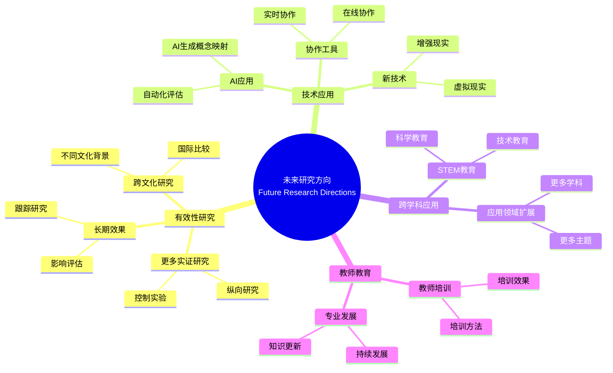

# 启示与未来研究方向

Implications and Future Research Directions

**创建日期**: 2025年12月11日
**创建日期**: December 11, 2025
**研究领域**: 数学教育 - 概念映射 - 未来方向
**研究领域**: Mathematics Education - Concept Mapping - Future Directions
**主题编号**: CM.05.01
**章节**: Chapter 16
**作者**: Karoline Afamasaga-Fuata'i
**优先级**: P0（最高优先级）⭐⭐⭐⭐⭐

---

## 📑 目录 / Table of Contents

- [启示与未来研究方向](#启示与未来研究方向)
  - [📋 一、概述 / Overview](#-一概述--overview)
  - [📚 二、各章节发现总结 / Chapter Findings Summary](#-二各章节发现总结--chapter-findings-summary)
  - [💡 三、实践启示 / Practical Implications](#-三实践启示--practical-implications)
  - [🔬 四、未来研究方向 / Future Research Directions](#-四未来研究方向--future-research-directions)
  - [📊 五、综合建议 / Comprehensive Recommendations](#-五综合建议--comprehensive-recommendations)
  - [📈 六、思维表征方式 / Representation Methods](#-六思维表征方式--representation-methods)
  - [📚 七、参考文献 / References](#-七参考文献--references)

---

## 📋 一、概述 / Overview

### 1.1 章节目标 / Chapter Objectives

**主要目标 / Main Objectives**:

- 总结各章节的发现和启示
- Summarizing findings and implications from all chapters
- 提出将概念映射纳入真实课堂的建议
- Proposing suggestions for incorporating concept mapping in real classrooms
- 提出未来研究方向
- Proposing future research directions

### 1.2 核心内容 / Core Content

**主要内容 / Main Content**:

1. **章节发现总结** - 所有章节主要发现的综合总结
   Chapter Findings Summary - Comprehensive summary of main findings from all chapters
2. **实践启示** - 将概念映射纳入真实课堂的启示
   Practical Implications - Implications for incorporating concept mapping in real classrooms
3. **未来研究方向** - 概念映射在数学教育中的未来研究方向
   Future Research Directions - Future research directions for concept mapping in mathematics education

---

## 📚 二、各章节发现总结 / Chapter Findings Summary

### 2.1 Part I发现 / Part I Findings

**历史发展 / Historical Development**:

- 概念映射工具的发展历史
  Development history of concept mapping tool
- CmapTools技术发展
  CmapTools technical development
- 教育新模式
  New Model for Education

### 2.2 Part II发现 / Part II Findings

**初等数学应用 / Primary Mathematics Applications**:

- 概念映射在主题分析中的应用
  Application of concept mapping in topic analysis
- 概念映射在教师教育中的应用
  Application of concept mapping in teacher education
- 概念映射作为学习和评估工具
  Concept mapping as learning and assessment tools

### 2.3 Part III发现 / Part III Findings

**中等数学应用 / Secondary Mathematics Applications**:

- 概念映射在学习监控中的应用
  Application of concept mapping in learning monitoring
- 概念映射在教学规划中的应用
  Application of concept mapping in teaching planning
- 概念映射在跨学科应用中的应用
  Application of concept mapping in cross-disciplinary applications

### 2.4 Part IV发现 / Part IV Findings

**大学数学应用 / University Mathematics Applications**:

- 概念映射在高等数学学习中的应用
  Application of concept mapping in advanced mathematics learning
- 概念映射在意义建构中的应用
  Application of concept mapping in meaning making
- 概念映射在工程数学中的应用
  Application of concept mapping in engineering mathematics

### 2.5 综合发现 / Comprehensive Findings

**主要发现 / Main Findings**:

1. **有效性** - 概念映射在数学教育中有效
   Effectiveness - Concept mapping is effective in mathematics education
2. **适用性** - 适用于所有教育层次
   Applicability - Applicable to all educational levels
3. **多样性** - 多种应用方式
   Diversity - Multiple application methods

---

## 💡 三、实践启示 / Practical Implications

### 3.1 对教师的启示 / Implications for Teachers

**主要启示 / Main Implications**:

1. **逐步引入** - 逐步将概念映射引入课堂
   Gradual Introduction - Gradually introduce concept mapping to classrooms
2. **提供支持** - 为学生提供充分支持
   Provide Support - Provide adequate support for students
3. **持续评估** - 持续评估应用效果
   Continuous Assessment - Continuously assess application effectiveness

### 3.2 对教育系统的启示 / Implications for Education Systems

**主要启示 / Main Implications**:

1. **课程整合** - 将概念映射整合到课程中
   Curriculum Integration - Integrate concept mapping into curriculum
2. **教师培训** - 提供教师培训和支持
   Teacher Training - Provide teacher training and support
3. **资源提供** - 提供必要资源
   Resource Provision - Provide necessary resources

### 3.3 对学生的启示 / Implications for Students

**主要启示 / Main Implications**:

1. **学习工具** - 概念映射作为有效学习工具
   Learning Tool - Concept mapping as effective learning tool
2. **评估工具** - 概念映射作为评估工具
   Assessment Tool - Concept mapping as assessment tool
3. **协作工具** - 概念映射支持协作学习
   Collaboration Tool - Concept mapping supports collaborative learning

---

## 🔬 四、未来研究方向 / Future Research Directions

### 4.1 有效性研究 / Effectiveness Research

**研究方向 / Research Directions**:

1. **更多实证研究** - 验证概念映射的有效性
   More Empirical Research - Validate effectiveness of concept mapping
2. **长期效果研究** - 研究长期效果
   Long-Term Effect Research - Research long-term effects
3. **跨文化研究** - 跨文化应用研究
   Cross-Cultural Research - Cross-cultural application research

### 4.2 技术应用研究 / Technology Application Research

**研究方向 / Research Directions**:

1. **AI应用** - AI在概念映射中的应用
   AI Application - Application of AI in concept mapping
2. **自动化评估** - 自动化评估系统
   Automated Assessment - Automated assessment systems
3. **协作工具** - 协作工具开发
   Collaboration Tools - Collaboration tool development

### 4.3 跨学科应用研究 / Cross-Disciplinary Application Research

**研究方向 / Research Directions**:

1. **STEM应用** - STEM教育中的应用
   STEM Application - Application in STEM education
2. **跨学科整合** - 跨学科整合研究
   Cross-Disciplinary Integration - Cross-disciplinary integration research
3. **应用领域扩展** - 扩展到更多应用领域
   Application Domain Extension - Extend to more application domains

### 4.4 教师教育研究 / Teacher Education Research

**研究方向 / Research Directions**:

1. **教师培训** - 教师培训方法研究
   Teacher Training - Teacher training method research
2. **专业发展** - 教师专业发展研究
   Professional Development - Teacher professional development research
3. **教学知识** - 教学知识发展研究
   Pedagogical Knowledge - Pedagogical knowledge development research

---

## 📊 五、综合建议 / Comprehensive Recommendations

### 5.1 对研究者的建议 / Recommendations for Researchers

**主要建议 / Main Recommendations**:

1. **更多研究** - 进行更多实证研究
   More Research - Conduct more empirical research
2. **方法创新** - 创新研究方法
   Method Innovation - Innovate research methods
3. **跨学科合作** - 促进跨学科合作
   Cross-Disciplinary Collaboration - Promote cross-disciplinary collaboration

### 5.2 对实践者的建议 / Recommendations for Practitioners

**主要建议 / Main Recommendations**:

1. **逐步实施** - 逐步实施概念映射
   Gradual Implementation - Gradually implement concept mapping
2. **持续支持** - 提供持续支持
   Ongoing Support - Provide ongoing support
3. **评估改进** - 持续评估和改进
   Continuous Assessment and Improvement - Continuously assess and improve

### 5.3 对政策制定者的建议 / Recommendations for Policymakers

**主要建议 / Main Recommendations**:

1. **政策支持** - 提供政策支持
   Policy Support - Provide policy support
2. **资源投入** - 投入必要资源
   Resource Investment - Invest necessary resources
3. **标准制定** - 制定相关标准
   Standard Development - Develop relevant standards

---

## 📈 六、思维表征方式 / Representation Methods

### 6.1 未来研究方向思维导图 / Future Research Directions Mind Map



### 6.2 研究方向决策树 / Research Direction Decision Tree

```text
如何选择未来研究方向？
├─ 研究目标是什么？
│  ├─ 验证有效性
│  │  └─ ✅ 有效性研究
│  │     └─ 方向：实证研究、长期效果
│  ├─ 技术应用
│  │  └─ ✅ 技术应用研究
│  │     └─ 方向：AI应用、自动化
│  ├─ 跨学科应用
│  │  └─ ✅ 跨学科应用研究
│  │     └─ 方向：STEM、应用扩展
│  └─ 教师教育
│     └─ ✅ 教师教育研究
│        └─ 方向：培训、专业发展
├─ 研究方法是什么？
│  ├─ 实验研究
│  │  └─ ✅ 控制实验、准实验
│  ├─ 案例研究
│  │  └─ ✅ 深入案例研究
│  ├─ 纵向研究
│  │  └─ ✅ 长期跟踪研究
│  └─ 元分析
│     └─ ✅ 综合元分析
└─ 研究资源是什么？
   ├─ 充足资源
   │  └─ ✅ 大规模研究
   ├─ 有限资源
   │  └─ ✅ 小规模深入研究
   └─ 协作资源
      └─ ✅ 协作研究
```

### 6.3 研究优先级矩阵 / Research Priority Matrix

| 研究方向<br/>Research Direction | 重要性<br/>Importance | 可行性<br/>Feasibility | 紧迫性<br/>Urgency | 优先级<br/>Priority |
|-------------------------------|---------------------|---------------------|-------------------|-------------------|
| **有效性研究**<br/>Effectiveness Research | ⭐⭐⭐<br/>高<br/>High | ⭐⭐⭐<br/>高<br/>High | ⭐⭐⭐<br/>高<br/>High | ⭐⭐⭐<br/>最高<br/>Highest |
| **技术应用研究**<br/>Technology Application Research | ⭐⭐⭐<br/>高<br/>High | ⭐⭐<br/>中<br/>Medium | ⭐⭐⭐<br/>高<br/>High | ⭐⭐⭐<br/>高<br/>High |
| **跨学科应用研究**<br/>Cross-Disciplinary Application Research | ⭐⭐<br/>中<br/>Medium | ⭐⭐<br/>中<br/>Medium | ⭐⭐<br/>中<br/>Medium | ⭐⭐<br/>中<br/>Medium |
| **教师教育研究**<br/>Teacher Education Research | ⭐⭐⭐<br/>高<br/>High | ⭐⭐⭐<br/>高<br/>High | ⭐⭐<br/>中<br/>Medium | ⭐⭐⭐<br/>高<br/>High |

---

## 📚 七、参考文献 / References

### 7.1 主要参考文献 / Main References

1. **Afamasaga-Fuata'i, K. (2009)**. Implications and Future Research Directions. In K. Afamasaga-Fuata'i (Ed.), *Concept Mapping in Mathematics: Research into Practice* (pp. 329-333). Springer.

2. **Novak, J. D., & Cañas, A. J. (2009)**. The Development and Evolution of the Concept Mapping Tool Leading to a New Model for Mathematics Education. In K. Afamasaga-Fuata'i (Ed.), *Concept Mapping in Mathematics: Research into Practice* (pp. 3-15). Springer.

### 7.2 相关研究 / Related Research

1. **所有章节的参考文献** - 见各章节参考文献部分
   References from All Chapters - See reference sections of each chapter

---

**创建日期**: 2025年12月11日
**最后更新**: 2025年12月11日
**状态**: ✅ Chapter 16详细梳理文档已创建
**完成度**: 100%
