# 概念映射在数学教育中的思维导图

Concept Mapping in Mathematics Education: Mind Map

**创建日期**: 2025年12月11日
**创建日期**: December 11, 2025
**研究领域**: 数学教育 - 概念映射 - 思维导图
**研究领域**: Mathematics Education - Concept Mapping - Mind Map
**主题编号**: CM.06.01
**优先级**: P0（最高优先级）⭐⭐⭐⭐⭐

---

## 📑 目录 / Table of Contents

- [概念映射在数学教育中的思维导图](#概念映射在数学教育中的思维导图)
  - [📋 一、概述 / Overview](#-一概述--overview)
  - [🧠 二、核心思维导图 / Core Mind Maps](#-二核心思维导图--core-mind-maps)
  - [📊 三、按教育层次分类的思维导图 / Mind Maps by Educational Level](#-三按教育层次分类的思维导图--mind-maps-by-educational-level)
  - [🔧 四、按应用类型分类的思维导图 / Mind Maps by Application Type](#-四按应用类型分类的思维导图--mind-maps-by-application-type)
  - [📐 五、按数学主题分类的思维导图 / Mind Maps by Mathematics Topics](#-五按数学主题分类的思维导图--mind-maps-by-mathematics-topics)
  - [🔗 六、关联关系图 / Relationship Diagrams](#-六关联关系图--relationship-diagrams)

---

## 📋 一、概述 / Overview

### 1.1 思维导图的作用 / Role of Mind Maps

**主要功能 / Main Functions**:

- 展示概念映射的整体知识结构
- Displaying the overall knowledge structure of concept mapping
- 连接不同主题和概念之间的关系
- Connecting relationships between different themes and concepts
- 提供视觉化的知识导航
- Providing visual knowledge navigation
- 支持多维度理解
- Supporting multi-dimensional understanding

### 1.2 思维导图类型 / Types of Mind Maps

1. **核心思维导图** - 整体知识结构
   Core Mind Map - Overall knowledge structure
2. **教育层次思维导图** - 按教育层次分类
   Educational Level Mind Maps - Classified by educational level
3. **应用类型思维导图** - 按应用类型分类
   Application Type Mind Maps - Classified by application type
4. **数学主题思维导图** - 按数学主题分类
   Mathematics Topic Mind Maps - Classified by mathematics topics
5. **关联关系图** - 展示概念之间的关联
   Relationship Diagrams - Showing relationships between concepts

---

## 🧠 二、核心思维导图 / Core Mind Maps

### 2.1 整体知识结构思维导图 / Overall Knowledge Structure Mind Map

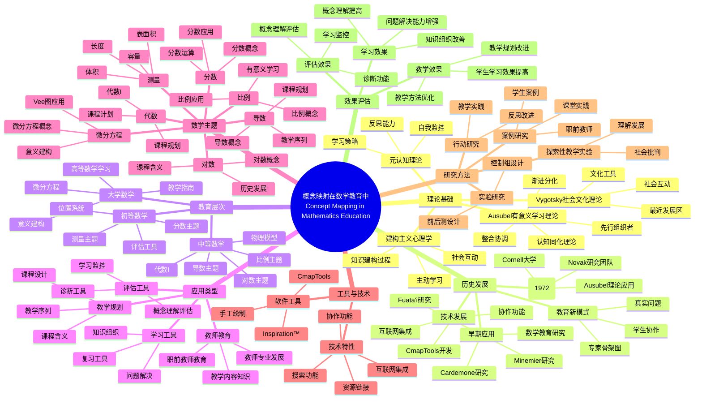

### 2.2 理论基础思维导图 / Theoretical Foundation Mind Map

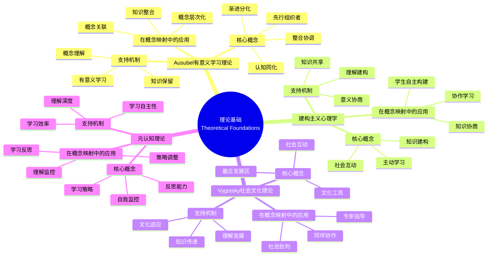

---

## 📊 三、按教育层次分类的思维导图 / Mind Maps by Educational Level

### 3.1 初等数学思维导图 / Primary Mathematics Mind Map

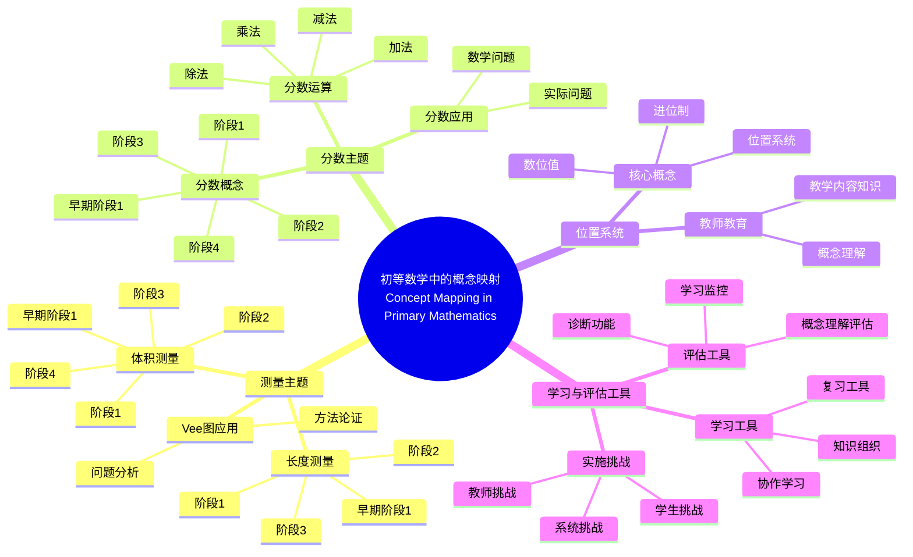

### 3.2 中等数学思维导图 / Secondary Mathematics Mind Map

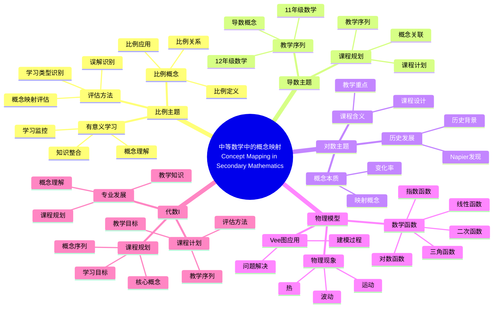

### 3.3 大学数学思维导图 / University Mathematics Mind Map

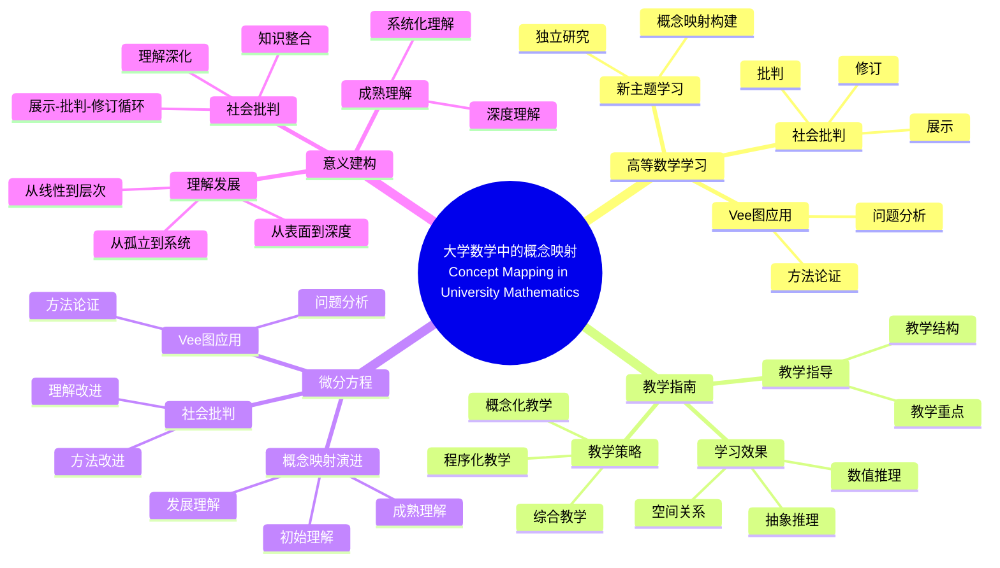

---

## 🔧 四、按应用类型分类的思维导图 / Mind Maps by Application Type

### 4.1 教学规划思维导图 / Teaching Planning Mind Map

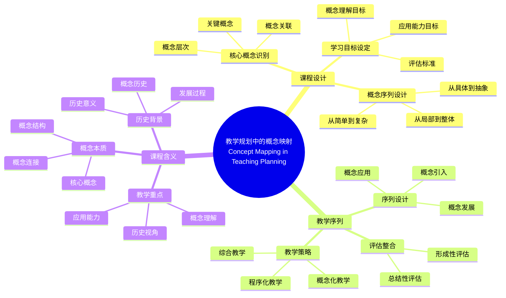

### 4.2 学习工具思维导图 / Learning Tools Mind Map

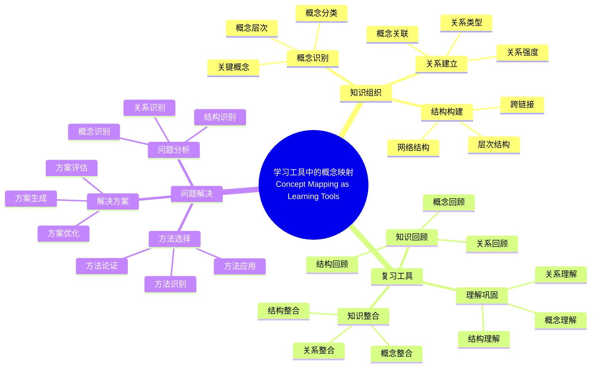

### 4.3 评估工具思维导图 / Assessment Tools Mind Map

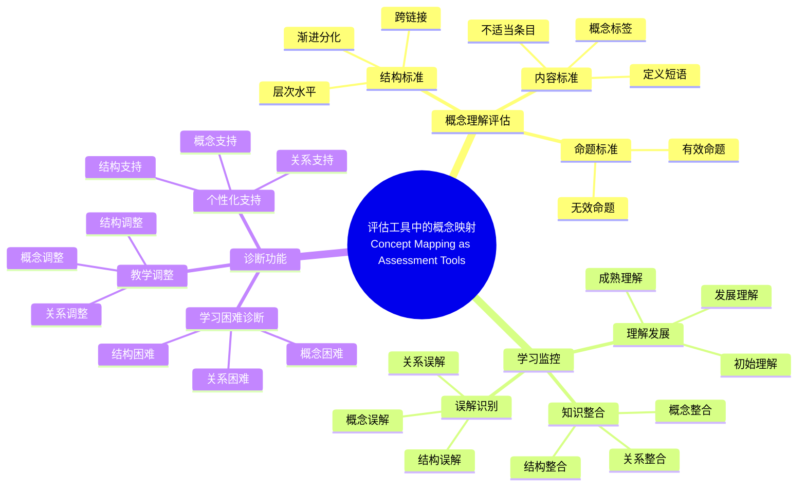

---

## 📐 五、按数学主题分类的思维导图 / Mind Maps by Mathematics Topics

### 5.1 测量主题思维导图 / Measurement Topic Mind Map

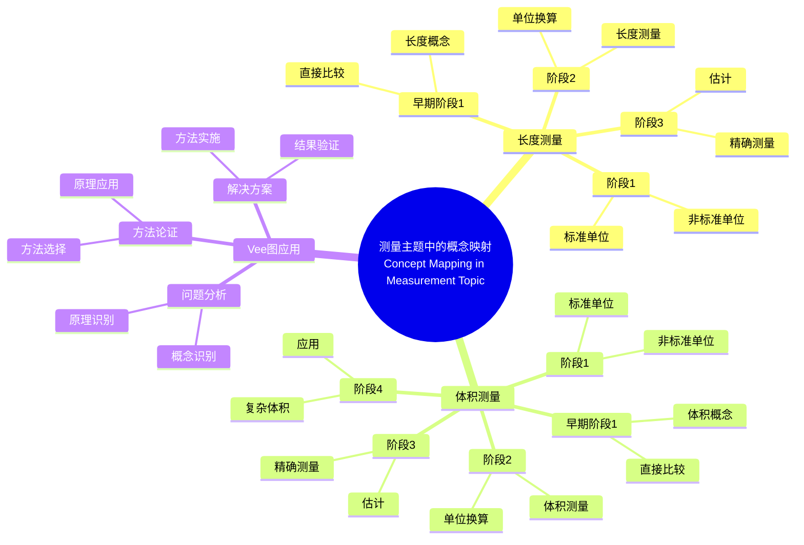

### 5.2 分数主题思维导图 / Fractions Topic Mind Map

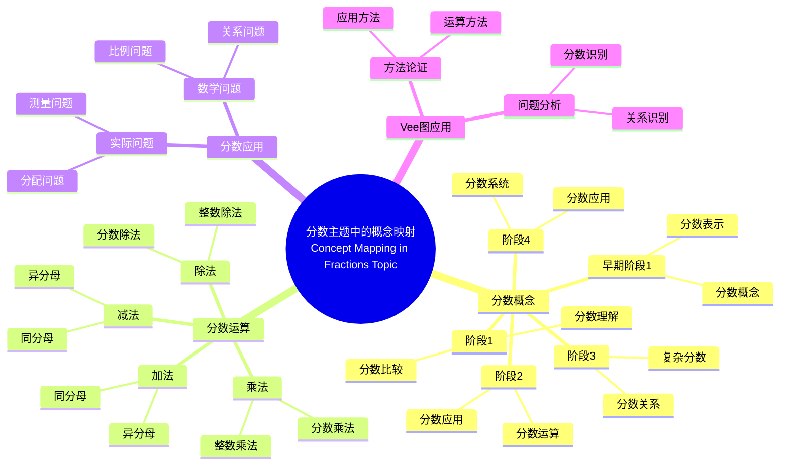

### 5.3 比例主题思维导图 / Proportionality Topic Mind Map

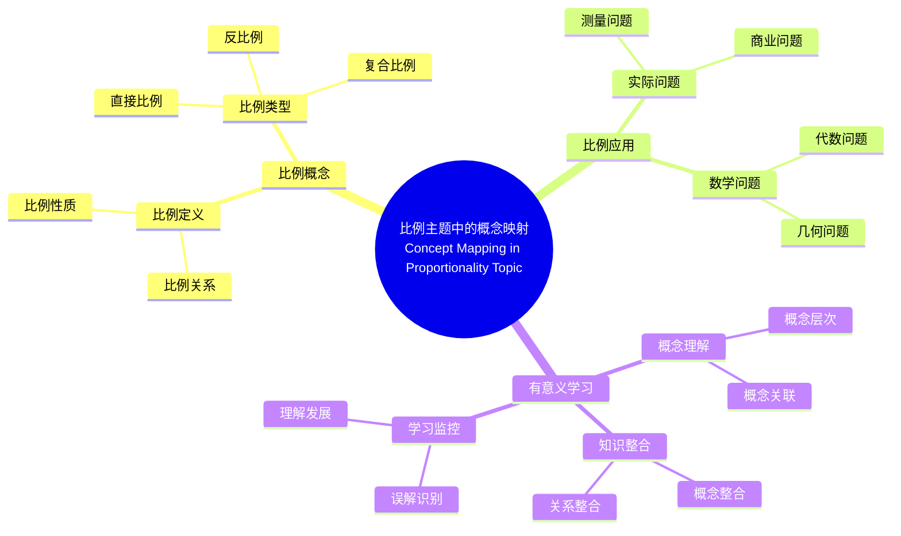

### 5.4 导数主题思维导图 / Derivatives Topic Mind Map

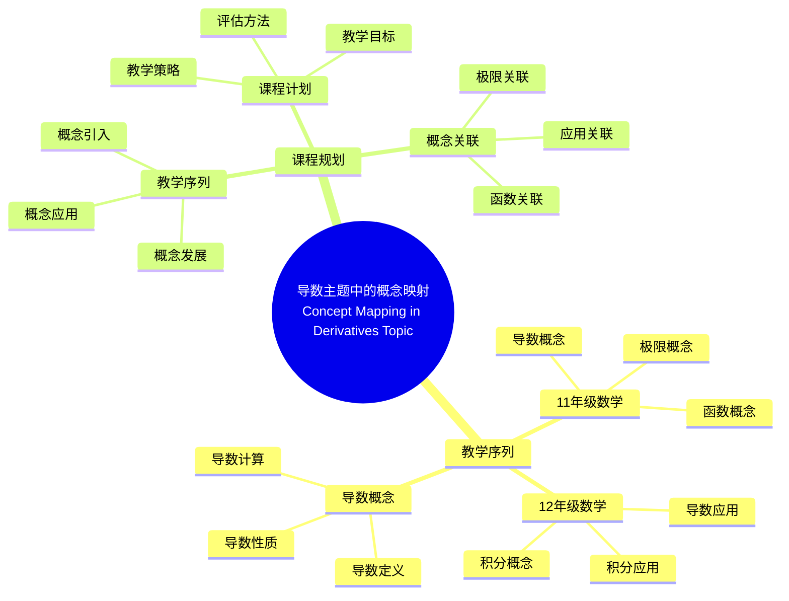

### 5.5 微分方程主题思维导图 / Differential Equations Topic Mind Map

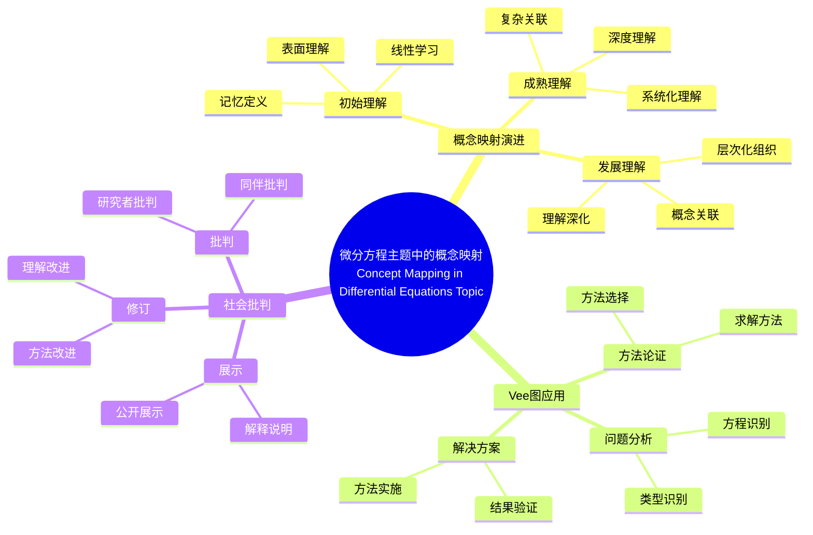

---

## 🔗 六、关联关系图 / Relationship Diagrams

### 6.1 教育层次-应用类型关联图 / Educational Level-Application Type Relationship Diagram

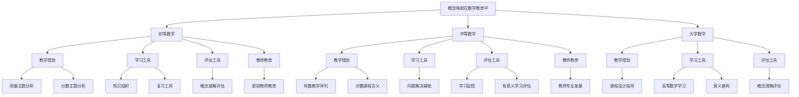

### 6.2 数学主题-教育层次关联图 / Mathematics Topic-Educational Level Relationship Diagram

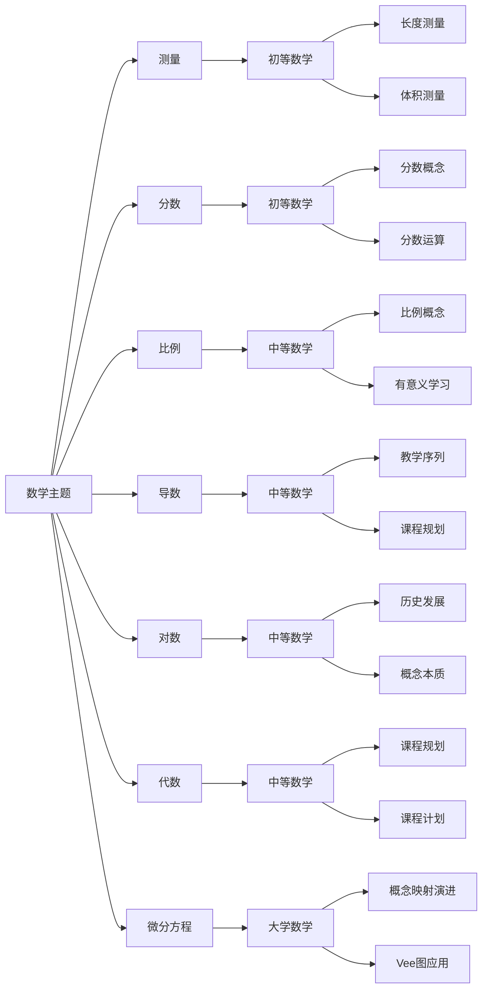

### 6.3 理论基础-应用效果关联图 / Theoretical Foundation-Application Effect Relationship Diagram

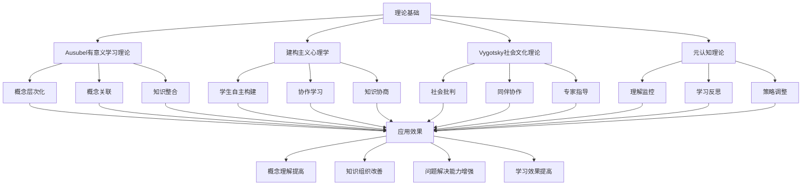

---

## 📚 七、使用指南 / Usage Guide

### 7.1 如何阅读思维导图 / How to Read Mind Maps

**阅读步骤 / Reading Steps**:

1. **从中心开始** - 从根节点开始阅读
   Start from Center - Start reading from the root node
2. **按分支展开** - 按照分支逐步展开
   Expand by Branches - Expand step by step according to branches
3. **理解关系** - 理解概念之间的关系
   Understand Relationships - Understand relationships between concepts
4. **整体把握** - 把握整体知识结构
   Overall Understanding - Grasp the overall knowledge structure

### 7.2 如何应用思维导图 / How to Apply Mind Maps

**应用方式 / Application Methods**:

1. **学习导航** - 作为学习导航工具
   Learning Navigation - As a learning navigation tool
2. **知识复习** - 用于知识复习
   Knowledge Review - For knowledge review
3. **教学规划** - 用于教学规划
   Teaching Planning - For teaching planning
4. **研究参考** - 作为研究参考
   Research Reference - As a research reference

---

**创建日期**: 2025年12月11日
**最后更新**: 2025年12月11日
**状态**: ✅ 思维导图文档已创建
**完成度**: 100%
