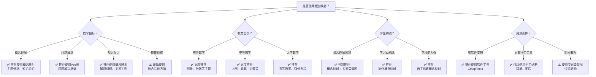
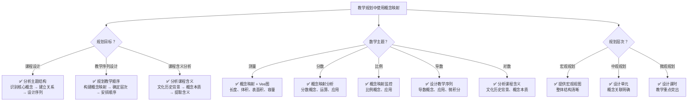
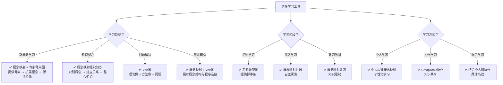
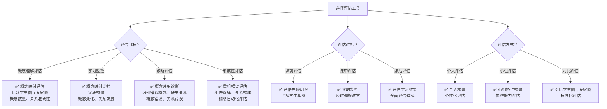
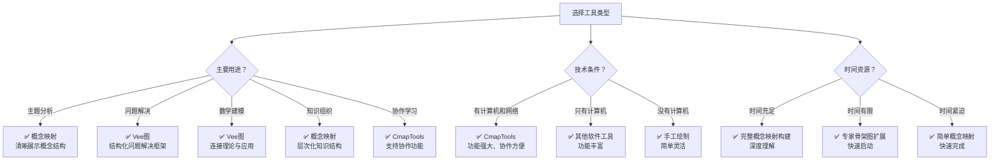

# 概念映射在数学教育中的应用决策树

Concept Mapping in Mathematics Education: Decision Tree

**创建日期**: 2025年12月11日
**创建日期**: December 11, 2025
**研究领域**: 数学教育 - 概念映射 - 决策分析
**研究领域**: Mathematics Education - Concept Mapping - Decision Analysis
**主题编号**: CM.06.03
**优先级**: P0（最高优先级）⭐⭐⭐⭐⭐

---

## 📑 目录 / Table of Contents

- [概念映射在数学教育中的应用决策树](#概念映射在数学教育中的应用决策树)
  - [📋 一、概述 / Overview](#-一概述--overview)
  - [🌳 二、总体应用决策树 / Overall Application Decision Tree](#-二总体应用决策树--overall-application-decision-tree)
  - [🎯 三、教学规划决策树 / Teaching Planning Decision Tree](#-三教学规划决策树--teaching-planning-decision-tree)
  - [📚 四、学习工具选择决策树 / Learning Tool Selection Decision Tree](#-四学习工具选择决策树--learning-tool-selection-decision-tree)
  - [📊 五、评估工具选择决策树 / Assessment Tool Selection Decision Tree](#-五评估工具选择决策树--assessment-tool-selection-decision-tree)
  - [🔧 六、工具类型选择决策树 / Tool Type Selection Decision Tree](#-六工具类型选择决策树--tool-type-selection-decision-tree)

---

## 📋 一、概述 / Overview

### 1.1 决策树的作用 / Role of Decision Trees

**主要功能 / Main Functions**:

- 指导概念映射的应用决策
- Guiding application decisions for concept mapping
- 帮助教师选择合适的应用策略
- Helping teachers choose appropriate application strategies
- 提供系统化的决策流程
- Providing systematic decision-making processes

### 1.2 决策树类型 / Types of Decision Trees

1. **总体应用决策树** - 决定是否使用概念映射
2. **教学规划决策树** - 教学规划中的应用决策
3. **学习工具选择决策树** - 学习工具选择决策
4. **评估工具选择决策树** - 评估工具选择决策
5. **工具类型选择决策树** - 具体工具类型选择

---

## 🌳 二、总体应用决策树 / Overall Application Decision Tree

### 2.1 文本决策树 / Text Decision Tree

```text
是否在数学教育中使用概念映射？
├─ 教学目标是什么？
│  ├─ 概念理解
│  │  └─ ✅ 推荐使用概念映射
│  │     └─ 选择：主题分析、知识组织
│  ├─ 问题解决
│  │  └─ ✅ 推荐使用Vee图
│  │     └─ 选择：问题解决框架
│  ├─ 知识复习
│  │  └─ ✅ 推荐使用概念映射
│  │     └─ 选择：知识组织、复习工具
│  └─ 技能训练
│     └─ ⚠️ 谨慎使用
│        └─ 建议：结合其他方法
├─ 教育层次是什么？
│  ├─ 初等数学
│  │  └─ ✅ 高度推荐
│  │     └─ 适用：测量、分数等主题
│  ├─ 中等数学
│  │  └─ ✅ 高度推荐
│  │     └─ 适用：比例、导数、对数等
│  └─ 大学数学
│     └─ ✅ 推荐
│        └─ 适用：高等数学、微分方程
├─ 学生特点是什么？
│  ├─ 概念理解困难
│  │  └─ ✅ 强烈推荐
│  │     └─ 选择：概念映射 + 专家骨架图
│  ├─ 学习动机低
│  │  └─ ✅ 推荐
│  │     └─ 选择：协作概念映射
│  └─ 学习能力强
│     └─ ✅ 推荐
│        └─ 选择：自主构建概念映射
└─ 资源条件是什么？
   ├─ 有软件支持（CmapTools）
   │  └─ ✅ 推荐使用软件工具
   │     └─ 优势：协作、资源链接
   ├─ 只有手工工具
   │  └─ ✅ 可以使用手工绘制
   │     └─ 优势：简单、灵活
   └─ 时间有限
      └─ ⚠️ 使用专家骨架图
         └─ 优势：快速启动
```

### 2.2 Mermaid决策树 / Mermaid Decision Tree



---

## 🎯 三、教学规划决策树 / Teaching Planning Decision Tree

### 3.1 文本决策树 / Text Decision Tree

```text
教学规划中如何使用概念映射？
├─ 规划目标是什么？
│  ├─ 课程设计
│  │  └─ ✅ 使用概念映射分析主题结构
│  │     ├─ 步骤1：识别核心概念
│  │     ├─ 步骤2：建立概念关系
│  │     └─ 步骤3：设计教学序列
│  ├─ 教学序列设计
│  │  └─ ✅ 使用概念映射规划教学顺序
│  │     ├─ 步骤1：构建主题概念映射
│  │     ├─ 步骤2：确定概念层次
│  │     └─ 步骤3：安排教学顺序
│  └─ 课程含义分析
│     └─ ✅ 使用概念映射分析课程含义
│        ├─ 步骤1：文化历史背景分析
│        ├─ 步骤2：概念本质识别
│        └─ 步骤3：课程含义提取
├─ 数学主题是什么？
│  ├─ 测量
│  │  └─ ✅ 使用概念映射 + Vee图
│  │     └─ 分析：长度、体积、表面积、容量
│  ├─ 分数
│  │  └─ ✅ 使用概念映射分析
│  │     └─ 分析：分数概念、运算、应用
│  ├─ 比例
│  │  └─ ✅ 使用概念映射监控学习
│  │     └─ 分析：比例概念、应用
│  ├─ 导数
│  │  └─ ✅ 使用概念映射设计教学序列
│  │     └─ 分析：导数概念、应用、微积分
│  └─ 对数
│     └─ ✅ 使用概念映射分析课程含义
│        └─ 分析：文化历史背景、概念本质
└─ 规划层次是什么？
   ├─ 宏观规划（整个课程）
   │  └─ ✅ 使用概念映射提供宏观视图
   │     └─ 优势：整体结构清晰
   ├─ 中观规划（单元设计）
   │  └─ ✅ 使用概念映射设计单元
   │     └─ 优势：概念关联明确
   └─ 微观规划（课时设计）
      └─ ✅ 使用概念映射设计课时
         └─ 优势：教学重点突出
```

### 3.2 Mermaid决策树 / Mermaid Decision Tree



---

## 📚 四、学习工具选择决策树 / Learning Tool Selection Decision Tree

### 4.1 文本决策树 / Text Decision Tree

```text
选择什么学习工具？
├─ 学习目标是什么？
│  ├─ 新概念学习
│  │  └─ ✅ 使用概念映射 + 专家骨架图
│  │     ├─ 步骤1：提供专家骨架图
│  │     ├─ 步骤2：学生扩展概念
│  │     └─ 步骤3：添加资源链接
│  ├─ 知识整合
│  │  └─ ✅ 使用概念映射组织知识
│  │     ├─ 步骤1：识别已有概念
│  │     ├─ 步骤2：建立概念关系
│  │     └─ 步骤3：整合新知识
│  ├─ 问题解决
│  │  └─ ✅ 使用Vee图
│  │     ├─ 理论侧：概念、原理
│  │     ├─ 方法侧：方法、步骤
│  │     └─ 问题：实际问题
│  └─ 意义建构
│     └─ ✅ 使用概念映射 + Vee图
│        └─ 展示概念结构与程序连接
├─ 学习阶段是什么？
│  ├─ 初始学习
│  │  └─ ✅ 使用专家骨架图
│  │     └─ 优势：提供脚手架
│  ├─ 深入学习
│  │  └─ ✅ 使用概念映射扩展
│  │     └─ 优势：自主探索
│  └─ 复习巩固
│     └─ ✅ 使用概念映射复习
│        └─ 优势：知识组织
└─ 学习方式是什么？
   ├─ 个人学习
   │  └─ ✅ 使用概念映射个人构建
   │     └─ 优势：个性化学习
   ├─ 协作学习
   │  └─ ✅ 使用CmapTools协作
   │     └─ 优势：知识共享
   └─ 混合学习
      └─ ✅ 结合个人和协作
         └─ 优势：灵活高效
```

### 4.2 Mermaid决策树 / Mermaid Decision Tree



---

## 📊 五、评估工具选择决策树 / Assessment Tool Selection Decision Tree

### 5.1 文本决策树 / Text Decision Tree

```text
选择什么评估工具？
├─ 评估目标是什么？
│  ├─ 概念理解评估
│  │  └─ ✅ 使用概念映射评估
│  │     ├─ 方法：比较学生图与专家图
│  │     ├─ 指标：概念数量、关系准确性
│  │     └─ 优势：揭示概念理解深度
│  ├─ 学习监控
│  │  └─ ✅ 使用概念映射监控
│  │     ├─ 方法：定期构建概念映射
│  │     ├─ 指标：概念变化、关系发展
│  │     └─ 优势：跟踪学习进展
│  ├─ 诊断评估
│  │  └─ ✅ 使用概念映射诊断
│  │     ├─ 方法：识别错误概念、缺失关系
│  │     ├─ 指标：概念错误、关系错误
│  │     └─ 优势：发现学习困难
│  └─ 形成性评估
│     └─ ✅ 使用概念映射形成性评估
│        ├─ 方法：重组框架（Recomposition）
│        ├─ 指标：组件选择、关系构建
│        └─ 优势：精确自动化评估
├─ 评估时机是什么？
│  ├─ 课前评估
│  │  └─ ✅ 使用概念映射评估先验知识
│  │     └─ 优势：了解学生基础
│  ├─ 课中评估
│  │  └─ ✅ 使用概念映射实时监控
│  │     └─ 优势：及时调整教学
│  └─ 课后评估
│     └─ ✅ 使用概念映射评估学习效果
│        └─ 优势：全面评估理解
└─ 评估方式是什么？
   ├─ 个人评估
   │  └─ ✅ 个人构建概念映射
   │     └─ 优势：个性化评估
   ├─ 小组评估
   │  └─ ✅ 小组协作构建概念映射
   │     └─ 优势：协作能力评估
   └─ 对比评估
      └─ ✅ 对比学生图与专家图
         └─ 优势：标准化评估
```

### 5.2 Mermaid决策树 / Mermaid Decision Tree



---

## 🔧 六、工具类型选择决策树 / Tool Type Selection Decision Tree

### 6.1 文本决策树 / Text Decision Tree

```text
选择什么工具类型？
├─ 主要用途是什么？
│  ├─ 主题分析
│  │  └─ ✅ 选择：概念映射
│  │     └─ 原因：清晰展示概念结构
│  ├─ 问题解决
│  │  └─ ✅ 选择：Vee图
│  │     └─ 原因：结构化问题解决框架
│  ├─ 数学建模
│  │  └─ ✅ 选择：Vee图
│  │     └─ 原因：连接理论与应用
│  ├─ 知识组织
│  │  └─ ✅ 选择：概念映射
│  │     └─ 原因：层次化知识结构
│  └─ 协作学习
│     └─ ✅ 选择：CmapTools
│        └─ 原因：支持协作功能
├─ 技术条件是什么？
│  ├─ 有计算机和网络
│  │  └─ ✅ 选择：CmapTools
│  │     └─ 优势：功能强大、协作方便
│  ├─ 只有计算机
│  │  └─ ✅ 选择：其他软件工具
│  │     └─ 优势：功能丰富
│  └─ 没有计算机
│     └─ ✅ 选择：手工绘制
│        └─ 优势：简单灵活
└─ 时间资源是什么？
   ├─ 时间充足
   │  └─ ✅ 选择：完整概念映射构建
   │     └─ 优势：深度理解
   ├─ 时间有限
   │  └─ ✅ 选择：专家骨架图扩展
   │     └─ 优势：快速启动
   └─ 时间紧迫
      └─ ✅ 选择：简单概念映射
         └─ 优势：快速完成
```

### 6.2 Mermaid决策树 / Mermaid Decision Tree



---

## 📋 七、决策树使用指南 / Decision Tree Usage Guide

### 7.1 使用步骤 / Usage Steps

1. **识别决策情境** - 明确需要决策的具体情境
   Identify Decision Context - Clarify specific decision context

2. **选择决策树** - 根据情境选择相应的决策树
   Select Decision Tree - Choose appropriate decision tree based on context

3. **逐步决策** - 按照决策树逐步做出决策
   Step-by-Step Decision - Make decisions step by step following the tree

4. **验证决策** - 验证决策的合理性和可行性
   Verify Decision - Verify reasonableness and feasibility of decision

### 7.2 注意事项 / Notes

- 决策树提供指导，但需要结合具体情况灵活应用
- Decision trees provide guidance but need flexible application based on specific situations
- 多个决策树可以组合使用
- Multiple decision trees can be combined
- 定期评估决策效果，调整策略
- Regularly evaluate decision effectiveness and adjust strategies

---

**创建日期**: 2025年12月11日
**最后更新**: 2025年12月11日
**状态**: ✅ 应用决策树文档已创建
**完成度**: 100%
