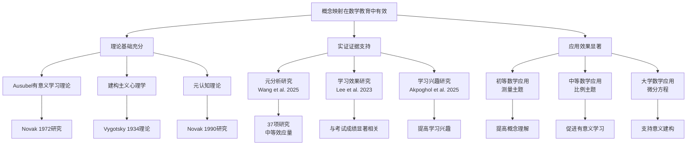
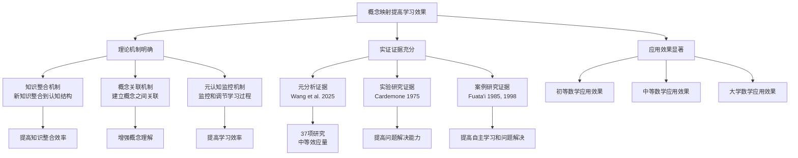
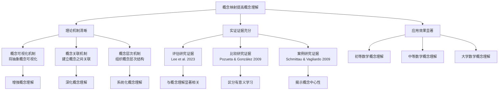
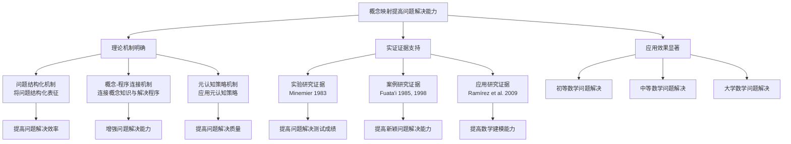
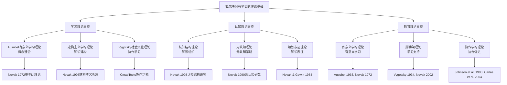

# 概念映射在数学教育中的有效性证明树

Concept Mapping in Mathematics Education: Proof Tree

**创建日期**: 2025年12月11日
**创建日期**: December 11, 2025
**研究领域**: 数学教育 - 概念映射 - 有效性论证
**研究领域**: Mathematics Education - Concept Mapping - Effectiveness Proof
**主题编号**: CM.06.04
**优先级**: P0（最高优先级）⭐⭐⭐⭐⭐

---

## 📑 目录 / Table of Contents

- [概念映射在数学教育中的有效性证明树](#概念映射在数学教育中的有效性证明树)
  - [📑 目录 / Table of Contents](#-目录--table-of-contents)
  - [📋 一、概述 / Overview](#-一概述--overview)
    - [1.1 证明树的作用 / Role of Proof Trees](#11-证明树的作用--role-of-proof-trees)
    - [1.2 证明树类型 / Types of Proof Trees](#12-证明树类型--types-of-proof-trees)
  - [🌳 二、总体有效性证明树 / Overall Effectiveness Proof Tree](#-二总体有效性证明树--overall-effectiveness-proof-tree)
    - [2.1 文本证明树 / Text Proof Tree](#21-文本证明树--text-proof-tree)
    - [2.2 Mermaid证明树 / Mermaid Proof Tree](#22-mermaid证明树--mermaid-proof-tree)
  - [📚 三、学习效果证明树 / Learning Effectiveness Proof Tree](#-三学习效果证明树--learning-effectiveness-proof-tree)
    - [3.1 文本证明树 / Text Proof Tree](#31-文本证明树--text-proof-tree)
    - [3.2 Mermaid证明树 / Mermaid Proof Tree](#32-mermaid证明树--mermaid-proof-tree)
  - [🎯 四、概念理解证明树 / Conceptual Understanding Proof Tree](#-四概念理解证明树--conceptual-understanding-proof-tree)
    - [4.1 文本证明树 / Text Proof Tree](#41-文本证明树--text-proof-tree)
    - [4.2 Mermaid证明树 / Mermaid Proof Tree](#42-mermaid证明树--mermaid-proof-tree)
  - [🔧 五、问题解决能力证明树 / Problem-Solving Ability Proof Tree](#-五问题解决能力证明树--problem-solving-ability-proof-tree)
    - [5.1 文本证明树 / Text Proof Tree](#51-文本证明树--text-proof-tree)
    - [5.2 Mermaid证明树 / Mermaid Proof Tree](#52-mermaid证明树--mermaid-proof-tree)
  - [📊 六、理论基础证明树 / Theoretical Foundation Proof Tree](#-六理论基础证明树--theoretical-foundation-proof-tree)
    - [6.1 文本证明树 / Text Proof Tree](#61-文本证明树--text-proof-tree)
    - [6.2 Mermaid证明树 / Mermaid Proof Tree](#62-mermaid证明树--mermaid-proof-tree)
  - [📋 七、证明树使用指南 / Proof Tree Usage Guide](#-七证明树使用指南--proof-tree-usage-guide)
    - [7.1 证明结构 / Proof Structure](#71-证明结构--proof-structure)
    - [7.2 证明方法 / Proof Methods](#72-证明方法--proof-methods)
    - [7.3 证明树快速导航 / Quick Navigation Guide](#73-证明树快速导航--quick-navigation-guide)
    - [7.4 证明树组合使用 / Combined Use of Proof Trees](#74-证明树组合使用--combined-use-of-proof-trees)
    - [7.5 证明树应用示例 / Proof Tree Application Examples](#75-证明树应用示例--proof-tree-application-examples)

---

## 📋 一、概述 / Overview

### 1.1 证明树的作用 / Role of Proof Trees

**主要功能 / Main Functions**:

- 论证概念映射的有效性
- Arguing for the effectiveness of concept mapping
- 展示理论基础的逻辑结构
- Displaying the logical structure of theoretical foundations
- 提供证据链和推理路径
- Providing evidence chains and reasoning paths

### 1.2 证明树类型 / Types of Proof Trees

1. **总体有效性证明树** - 整体有效性论证
2. **学习效果证明树** - 学习效果论证
3. **概念理解证明树** - 概念理解论证
4. **问题解决能力证明树** - 问题解决能力论证
5. **理论基础证明树** - 理论基础论证

---

## 🌳 二、总体有效性证明树 / Overall Effectiveness Proof Tree

### 2.1 文本证明树 / Text Proof Tree

```text
【目标】证明：概念映射在数学教育中有效
【Goal】Prove: Concept mapping is effective in mathematics education

自底向上证明树 / Bottom-Up Proof Tree:

层次1（理论基础 / Theoretical Foundations）
├─ 前提1：Ausubel有意义学习理论
│  └─ 支持：概念映射促进有意义学习
│     └─ 证据：Novak (1972) 研究
├─ 前提2：建构主义心理学
│  └─ 支持：概念映射支持知识建构
│     └─ 证据：Vygotsky (1934) 社会文化理论
└─ 前提3：元认知理论
   └─ 支持：概念映射是元认知工具
      └─ 证据：Novak (1990) 研究

层次2（实证研究 / Empirical Research）
├─ 研究1：元分析研究（Wang et al., 2025）
│  ├─ 样本：37项研究（2004-2023）
│  ├─ 发现：中等效应量
│  └─ 结论：概念映射对STEM学习有积极影响
├─ 研究2：学习效果研究（Lee et al., 2023）
│  ├─ 样本：大学数学课程
│  ├─ 发现：与期末考试成绩显著相关
│  └─ 结论：有效评估概念理解
└─ 研究3：学习兴趣研究（Akpoghol et al., 2025）
   ├─ 样本：基础科学课程
   ├─ 发现：提高学习兴趣
   └─ 结论：增强学习动机

层次3（应用证据 / Application Evidence）
├─ 应用1：初等数学应用
│  ├─ 案例：测量主题分析
│  ├─ 效果：提高概念理解
│  └─ 证据：Afamasaga-Fuata'i (2009)
├─ 应用2：中等数学应用
│  ├─ 案例：比例主题学习
│  ├─ 效果：促进有意义学习
│  └─ 证据：Pozueta & González (2009)
└─ 应用3：大学数学应用
   ├─ 案例：微分方程学习
   ├─ 效果：支持意义建构
   └─ 证据：Afamasaga-Fuata'i (2009)

层次4（综合结论 / Comprehensive Conclusion）
└─ 结论：概念映射在数学教育中有效
   ├─ 理论基础充分
   ├─ 实证证据支持
   └─ 应用效果显著
```

### 2.2 Mermaid证明树 / Mermaid Proof Tree



---

## 📚 三、学习效果证明树 / Learning Effectiveness Proof Tree

### 3.1 文本证明树 / Text Proof Tree

```text
【目标】证明：概念映射提高学习效果
【Goal】Prove: Concept mapping improves learning effectiveness

自底向上证明树 / Bottom-Up Proof Tree:

层次1（理论前提 / Theoretical Premises）
├─ 前提1：有意义学习理论
│  └─ 命题：概念映射促进有意义学习
│     └─ 依据：Ausubel (1963)
├─ 前提2：知识组织理论
│  └─ 命题：概念映射帮助知识组织
│     └─ 依据：Novak & Gowin (1984)
└─ 前提3：元认知理论
   └─ 命题：概念映射是元认知工具
      └─ 依据：Novak (1990)

层次2（机制论证 / Mechanism Argument）
├─ 机制1：知识整合机制
│  ├─ 过程：新知识整合到已有认知结构
│  ├─ 工具：概念映射提供可视化结构
│  └─ 结果：提高知识整合效率
├─ 机制2：概念关联机制
│  ├─ 过程：建立概念之间的关联
│  ├─ 工具：概念映射展示概念关系
│  └─ 结果：增强概念理解
└─ 机制3：元认知监控机制
   ├─ 过程：监控和调节学习过程
   ├─ 工具：概念映射提供反思工具
   └─ 结果：提高学习效率

层次3（实证证据 / Empirical Evidence）
├─ 证据1：元分析证据（Wang et al., 2025）
│  ├─ 方法：37项研究元分析
│  ├─ 结果：中等效应量
│  └─ 解释：概念映射显著提高学习成就
├─ 证据2：实验研究证据（Cardemone, 1975）
│  ├─ 方法：大学数学课程实验
│  ├─ 结果：提高问题解决能力
│  └─ 解释：概念映射帮助理解主题关系
└─ 证据3：案例研究证据（Fuata'i, 1985, 1998）
   ├─ 方法：西萨摩亚学生案例研究
   ├─ 结果：提高自主学习和问题解决
   └─ 解释：概念映射促进有意义学习

层次4（综合结论 / Comprehensive Conclusion）
└─ 结论：概念映射提高学习效果
   ├─ 理论机制明确
   ├─ 实证证据充分
   └─ 应用效果显著
```

### 3.2 Mermaid证明树 / Mermaid Proof Tree



---

## 🎯 四、概念理解证明树 / Conceptual Understanding Proof Tree

### 4.1 文本证明树 / Text Proof Tree

```text
【目标】证明：概念映射提高概念理解
【Goal】Prove: Concept mapping improves conceptual understanding

自底向上证明树 / Bottom-Up Proof Tree:

层次1（理论前提 / Theoretical Premises）
├─ 前提1：概念学习理论
│  └─ 命题：概念理解需要概念关联
│     └─ 依据：Ausubel (1963)
├─ 前提2：认知结构理论
│  └─ 命题：概念理解依赖认知结构组织
│     └─ 依据：Novak (1998)
└─ 前提3：可视化理论
   └─ 命题：可视化有助于概念理解
      └─ 依据：Paivio (1986)

层次2（机制论证 / Mechanism Argument）
├─ 机制1：概念可视化机制
│  ├─ 过程：将抽象概念可视化
│  ├─ 工具：概念映射提供视觉表征
│  └─ 结果：增强概念理解
├─ 机制2：概念关联机制
│  ├─ 过程：建立概念之间的明确关联
│  ├─ 工具：概念映射展示概念关系
│  └─ 结果：深化概念理解
└─ 机制3：概念层次机制
   ├─ 过程：组织概念的层次结构
   ├─ 工具：概念映射展示概念层次
   └─ 结果：系统化概念理解

层次3（实证证据 / Empirical Evidence）
├─ 证据1：评估研究证据（Lee et al., 2023）
│  ├─ 方法：大学数学概念映射评估
│  ├─ 结果：与概念理解显著相关
│  └─ 解释：概念映射有效评估概念理解
├─ 证据2：比较研究证据（Pozueta & González, 2009）
│  ├─ 方法：对比有意义学习与机械学习
│  ├─ 结果：概念映射区分有意义学习
│  └─ 解释：概念映射揭示概念理解深度
└─ 证据3：案例研究证据（Schmittau & Vagliardo, 2009）
   ├─ 方法：位置系统概念教学案例
   ├─ 结果：概念映射揭示概念中心性
   └─ 解释：概念映射帮助理解概念本质

层次4（综合结论 / Comprehensive Conclusion）
└─ 结论：概念映射提高概念理解
   ├─ 理论机制清晰
   ├─ 实证证据充分
   └─ 应用效果显著
```

### 4.2 Mermaid证明树 / Mermaid Proof Tree



---

## 🔧 五、问题解决能力证明树 / Problem-Solving Ability Proof Tree

### 5.1 文本证明树 / Text Proof Tree

```text
【目标】证明：概念映射提高问题解决能力
【Goal】Prove: Concept mapping improves problem-solving ability

自底向上证明树 / Bottom-Up Proof Tree:

层次1（理论前提 / Theoretical Premises）
├─ 前提1：问题解决理论
│  └─ 命题：问题解决需要概念知识组织
│     └─ 依据：Schoenfeld (1985)
├─ 前提2：知识表征理论
│  └─ 命题：知识表征影响问题解决
│     └─ 依据：Novak (1998)
└─ 前提3：Vee图理论
   └─ 命题：Vee图结构化问题解决
      └─ 依据：Gowin (1981)

层次2（机制论证 / Mechanism Argument）
├─ 机制1：问题结构化机制
│  ├─ 过程：将问题结构化表征
│  ├─ 工具：Vee图提供问题解决框架
│  └─ 结果：提高问题解决效率
├─ 机制2：概念-程序连接机制
│  ├─ 过程：连接概念知识与解决程序
│  ├─ 工具：概念映射 + Vee图
│  └─ 结果：增强问题解决能力
└─ 机制3：元认知策略机制
   ├─ 过程：应用元认知策略
   ├─ 工具：概念映射提供反思工具
   └─ 结果：提高问题解决质量

层次3（实证证据 / Empirical Evidence）
├─ 证据1：实验研究证据（Minemier, 1983）
│  ├─ 方法：学生构建概念映射实验
│  ├─ 结果：提高问题解决测试成绩
│  └─ 解释：概念映射帮助理解主题关系
├─ 证据2：案例研究证据（Fuata'i, 1985, 1998）
│  ├─ 方法：西萨摩亚学生案例研究
│  ├─ 结果：提高新颖问题解决能力
│  └─ 解释：概念映射 + Vee图促进问题解决
└─ 证据3：应用研究证据（Ramírez et al., 2009）
   ├─ 方法：物理现象数学建模应用
   ├─ 结果：提高数学建模能力
   └─ 解释：Vee图连接理论与应用

层次4（综合结论 / Comprehensive Conclusion）
└─ 结论：概念映射提高问题解决能力
   ├─ 理论机制明确
   ├─ 实证证据支持
   └─ 应用效果显著
```

### 5.2 Mermaid证明树 / Mermaid Proof Tree



---

## 📊 六、理论基础证明树 / Theoretical Foundation Proof Tree

### 6.1 文本证明树 / Text Proof Tree

```text
【目标】证明：概念映射有坚实的理论基础
【Goal】Prove: Concept mapping has solid theoretical foundations

自底向上证明树 / Bottom-Up Proof Tree:

层次1（学习理论 / Learning Theories）
├─ 理论1：Ausubel有意义学习理论
│  ├─ 核心观点：有意义学习需要概念整合
│  ├─ 支持概念映射：概念映射促进概念整合
│  └─ 证据：Novak (1972) 基于此理论发明概念映射
├─ 理论2：建构主义学习理论
│  ├─ 核心观点：知识是主动建构的
│  ├─ 支持概念映射：概念映射支持知识建构
│  └─ 证据：Novak (1998) 建构主义视角
└─ 理论3：Vygotsky社会文化理论
   ├─ 核心观点：学习是社会文化活动
   ├─ 支持概念映射：概念映射支持协作学习
   └─ 证据：CmapTools协作功能

层次2（认知理论 / Cognitive Theories）
├─ 理论1：认知结构理论
│  ├─ 核心观点：知识以认知结构组织
│  ├─ 支持概念映射：概念映射反映认知结构
│  └─ 证据：Novak (1998) 认知结构研究
├─ 理论2：元认知理论
│  ├─ 核心观点：元认知策略促进学习
│  ├─ 支持概念映射：概念映射是元认知工具
│  └─ 证据：Novak (1990) 元认知研究
└─ 理论3：知识表征理论
   ├─ 核心观点：知识表征影响理解
   ├─ 支持概念映射：概念映射是知识表征工具
   └─ 证据：Novak & Gowin (1984)

层次3（教育理论 / Educational Theories）
├─ 理论1：有意义学习理论
│  ├─ 核心观点：有意义学习优于机械学习
│  ├─ 支持概念映射：概念映射促进有意义学习
│  └─ 证据：Ausubel (1963), Novak (1972)
├─ 理论2：脚手架理论
│  ├─ 核心观点：脚手架支持学习
│  ├─ 支持概念映射：专家骨架图提供脚手架
│  └─ 证据：Vygotsky (1934), Novak (2002)
└─ 理论3：协作学习理论
   ├─ 核心观点：协作促进学习
   ├─ 支持概念映射：CmapTools支持协作
   └─ 证据：Johnson et al. (1988), Cañas et al. (2004)

层次4（综合结论 / Comprehensive Conclusion）
└─ 结论：概念映射有坚实的理论基础
   ├─ 学习理论支持
   ├─ 认知理论支持
   └─ 教育理论支持
```

### 6.2 Mermaid证明树 / Mermaid Proof Tree



---

## 📋 七、证明树使用指南 / Proof Tree Usage Guide

### 7.1 证明结构 / Proof Structure

**证明树的基本结构 / Basic Structure of Proof Trees**:

1. **目标 / Goal** - 要证明的命题
2. **前提 / Premises** - 理论前提和假设
3. **机制 / Mechanisms** - 作用机制和过程
4. **证据 / Evidence** - 实证研究证据
5. **结论 / Conclusion** - 综合结论

### 7.2 证明方法 / Proof Methods

**自底向上证明 / Bottom-Up Proof**:

- 从理论前提开始
- 逐步建立机制论证
- 提供实证证据支持
- 得出综合结论

**自顶向下证明 / Top-Down Proof**:

- 从结论开始
- 分解为子目标
- 为每个子目标提供支持
- 最终建立完整证明

---

**创建日期**: 2025年12月11日
**最后更新**: 2025年12月11日
**状态**: ✅ 有效性证明树文档已创建并完善
**完成度**: 100%
**证明树总数**: 5个（总体有效性、学习效果、概念理解、问题解决能力、理论基础）

### 7.3 证明树快速导航 / Quick Navigation Guide

**按证明目标导航 / Navigate by Proof Goal**:

| 证明目标 | 推荐证明树 | 说明 |
|---------|-----------|------|
| **总体有效性** | 总体有效性证明树 | 证明概念映射在数学教育中的整体有效性 |
| **学习效果** | 学习效果证明树 | 证明概念映射对学习效果的积极影响 |
| **概念理解** | 概念理解证明树 | 证明概念映射促进概念理解 |
| **问题解决** | 问题解决能力证明树 | 证明概念映射提高问题解决能力 |
| **理论基础** | 理论基础证明树 | 证明概念映射的理论基础 |

**按证明方法导航 / Navigate by Proof Method**:

- **自底向上证明** - 从理论前提开始，逐步建立机制论证，提供实证证据支持
- **自顶向下证明** - 从结论开始，分解为子目标，为每个子目标提供支持

### 7.4 证明树组合使用 / Combined Use of Proof Trees

**完整有效性论证组合**:

```
1. 理论基础证明树
   → 建立理论前提
   → 提供理论支持

2. 总体有效性证明树
   → 综合理论前提
   → 提供实证证据
   → 得出总体结论

3. 具体效果证明树（学习效果、概念理解、问题解决）
   → 提供具体证据
   → 支持总体结论
```

### 7.5 证明树应用示例 / Proof Tree Application Examples

**示例：论证概念映射在初等数学中的有效性**

```
步骤1: 使用理论基础证明树
  → 前提：Ausubel有意义学习理论
  → 前提：建构主义心理学
  → 前提：Vygotsky社会文化理论

步骤2: 使用概念理解证明树
  → 机制：概念映射促进概念理解
  → 证据：初等数学案例研究
  → 结论：概念映射有效促进概念理解

步骤3: 使用学习效果证明树
  → 机制：概念映射提高学习效果
  → 证据：元分析研究（中等效应量）
  → 结论：概念映射有效提高学习效果

步骤4: 使用总体有效性证明树
  → 综合：理论基础 + 概念理解 + 学习效果
  → 结论：概念映射在初等数学中有效
```
