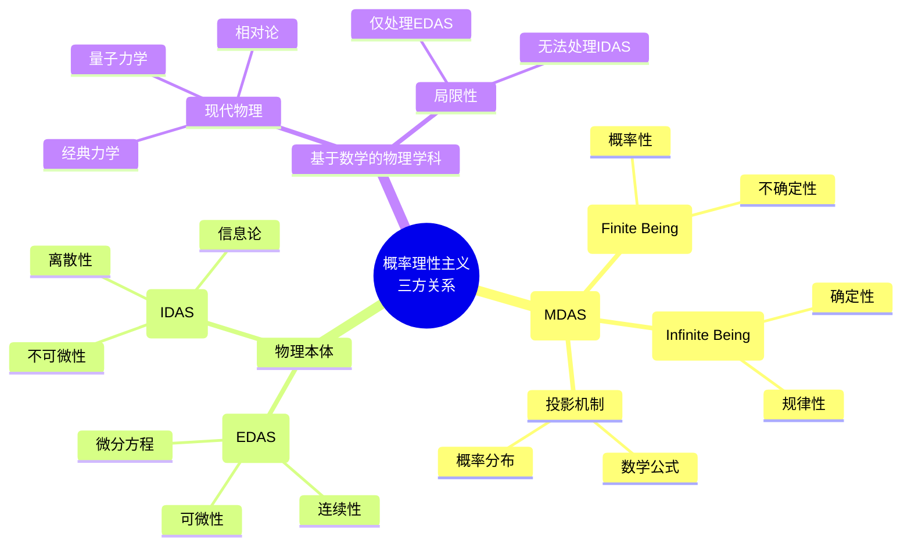
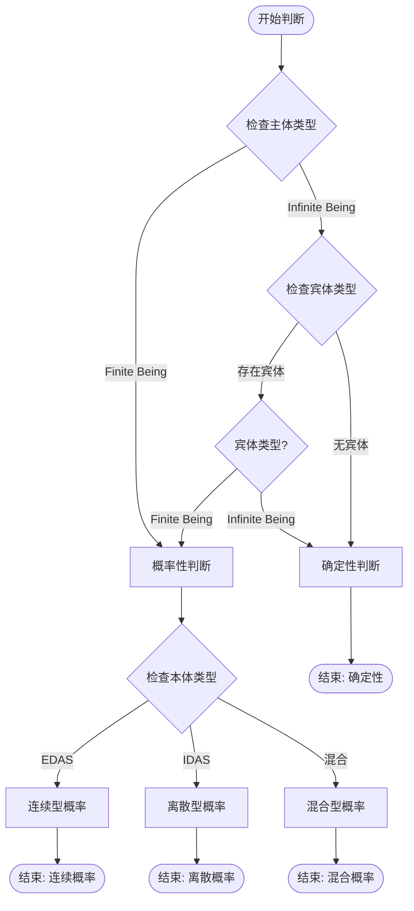
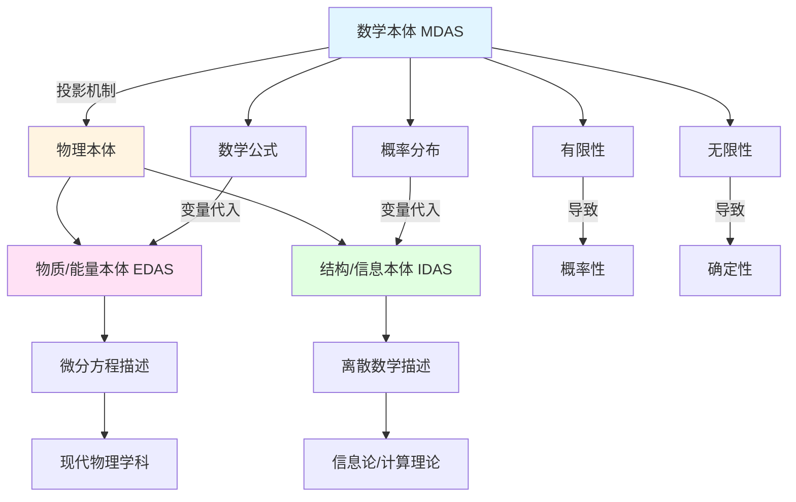
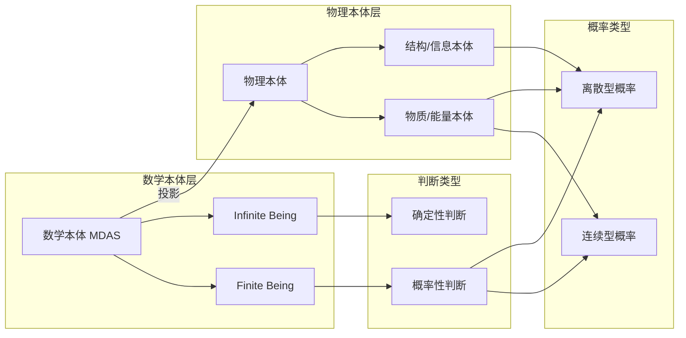

# 澄清-概率理性主义、基于数学的物理学科和数学本体的三方关系

**创建日期**: 2025年12月11日
**研究领域**: 数学哲学 - 本体论 - 概率理性主义
**主题编号**: CRIT.ONT.00
**优先级**: P0（最高优先级）⭐⭐⭐⭐⭐

---

## 📑 目录

- [澄清-概率理性主义、基于数学的物理学科和数学本体的三方关系](#澄清-概率理性主义基于数学的物理学科和数学本体的三方关系)
  - [📑 目录](#-目录)
  - [📋 一、概述](#-一概述)
    - [1.1 核心问题](#11-核心问题)
    - [1.2 三方关系框架](#12-三方关系框架)
    - [1.3 研究意义](#13-研究意义)
  - [🔷 二、物理本体的双重结构](#-二物理本体的双重结构)
    - [2.1 物理本体 = 物质/能量本体 + 结构/信息本体](#21-物理本体--物质能量本体--结构信息本体)
    - [2.2 物质/能量本体（EDAS）](#22-物质能量本体edas)
    - [2.3 结构/信息本体（IDAS）](#23-结构信息本体idas)
  - [📐 三、物理本体与数学本体的投影关系](#-三物理本体与数学本体的投影关系)
    - [3.1 投影机制](#31-投影机制)
    - [3.2 数学公式作为投影工具](#32-数学公式作为投影工具)
    - [3.3 概率分布作为投影工具](#33-概率分布作为投影工具)
  - [🔗 四、现代物理学科的局限性](#-四现代物理学科的局限性)
    - [4.1 现代物理学科 = 物质学科](#41-现代物理学科--物质学科)
    - [4.2 基于微分方程的连续假设](#42-基于微分方程的连续假设)
    - [4.3 信息/结构的离散性与不可微性](#43-信息结构的离散性与不可微性)
  - [🌐 五、决定论 vs 概率诠释](#-五决定论-vs-概率诠释)
    - [5.1 决定论的传统观点](#51-决定论的传统观点)
    - [5.2 哥本哈根概率诠释](#52-哥本哈根概率诠释)
    - [5.3 不确定性/概率的数学本体来源](#53-不确定性概率的数学本体来源)
  - [📊 六、概率理性主义的判断标准](#-六概率理性主义的判断标准)
    - [6.1 主体-宾体概率判断标准](#61-主体-宾体概率判断标准)
    - [6.2 连续-离散概率判断标准](#62-连续-离散概率判断标准)
    - [6.3 只有主体判断的情况](#63-只有主体判断的情况)
  - [🎓 七、数学本体（MDAS）的有限性与无限性](#-七数学本体mdas的有限性与无限性)
    - [7.1 Finite Being vs Infinite Being](#71-finite-being-vs-infinite-being)
    - [7.2 有限性与概率性](#72-有限性与概率性)
    - [7.3 无限性与确定性](#73-无限性与确定性)
  - [📚 八、应用与启示](#-八应用与启示)
    - [8.1 对物理学的启示](#81-对物理学的启示)
    - [8.2 对数学哲学的启示](#82-对数学哲学的启示)
    - [8.3 对认识论的启示](#83-对认识论的启示)
  - [📚 九、多维概念对比矩阵](#-九多维概念对比矩阵)
    - [9.1 本体类型对比矩阵](#91-本体类型对比矩阵)
    - [9.2 概率类型对比矩阵](#92-概率类型对比矩阵)
    - [9.3 判断标准对比矩阵](#93-判断标准对比矩阵)
    - [9.4 哲学立场对比矩阵](#94-哲学立场对比矩阵)
  - [🗺️ 十、思维表征系统](#️-十思维表征系统)
    - [10.1 思维导图：三方关系框架](#101-思维导图三方关系框架)
    - [10.2 决策图网：概率判断流程](#102-决策图网概率判断流程)
    - [10.3 证明图网：投影关系证明](#103-证明图网投影关系证明)
    - [10.4 概念关系网络图](#104-概念关系网络图)
  - [🌐 十一、权威内容对齐](#-十一权威内容对齐)
    - [11.1 Wikipedia 相关内容](#111-wikipedia-相关内容)
      - [11.1.1 数学宇宙假说（Mathematical Universe Hypothesis, MUH）](#1111-数学宇宙假说mathematical-universe-hypothesis-muh)
      - [11.1.2 双重投影信息本体论（Dual-Projection Informational Ontology）](#1112-双重投影信息本体论dual-projection-informational-ontology)
      - [11.1.3 哥本哈根诠释（Copenhagen Interpretation）](#1113-哥本哈根诠释copenhagen-interpretation)
      - [11.1.4 有限主义（Finitism）](#1114-有限主义finitism)
    - [11.2 著名大学课程内容](#112-著名大学课程内容)
      - [11.2.1 斯坦福大学：PHIL162 数学哲学](#1121-斯坦福大学phil162-数学哲学)
      - [11.2.2 麻省理工学院：24.801 数学哲学](#1122-麻省理工学院24801-数学哲学)
      - [11.2.3 哈佛大学：数学思想与量子场论概念](#1123-哈佛大学数学思想与量子场论概念)
    - [11.3 相关理论框架](#113-相关理论框架)
      - [11.3.1 Quine-Putnam 不可或缺性论证](#1131-quine-putnam-不可或缺性论证)
      - [11.3.2 结构中介与动态实在论](#1132-结构中介与动态实在论)
      - [11.3.3 关系量子力学（Relational Quantum Mechanics, RQM）](#1133-关系量子力学relational-quantum-mechanics-rqm)
  - [📚 十二、参考文献](#-十二参考文献)
    - [数学哲学](#数学哲学)
    - [概率论与信息论](#概率论与信息论)
    - [量子力学与概率诠释](#量子力学与概率诠释)
    - [数学本体论](#数学本体论)
    - [Wikipedia 资源](#wikipedia-资源)
    - [大学课程资源](#大学课程资源)
    - [现代理论框架](#现代理论框架)

## 📋 一、概述

### 1.1 核心问题

本文档旨在澄清**概率理性主义**、**基于数学的物理学科**和**数学本体**之间的三方关系。核心问题包括：

1. **物理本体**如何与**数学本体**相关？
2. **现代物理学科**的局限性是什么？
3. **决定论**与**概率诠释**的关系如何？
4. **概率理性主义**的判断标准是什么？

### 1.2 三方关系框架

**三方关系**：

```
数学本体（MDAS）
    ↓ 投影
物理本体 = 物质/能量本体（EDAS） + 结构/信息本体（IDAS）
    ↓ 描述
基于数学的物理学科
```

**关键观察**：

- **物理本体**是**数学本体**的**投影**
- **现代物理学科**主要处理**物质/能量本体**（连续、可微）
- **结构/信息本体**是**离散的**，难以用微分方程处理

### 1.3 研究意义

**理论意义**：

- 澄清**数学本体**与**物理本体**的关系
- 解释**概率性**的**数学本体来源**
- 建立**概率理性主义**的**判断标准**

**实践意义**：

- 理解**现代物理学科**的**适用范围**
- 为**信息/结构**研究提供**理论框架**
- 为**概率判断**提供**理性标准**

---

## 🔷 二、物理本体的双重结构

### 2.1 物理本体 = 物质/能量本体 + 结构/信息本体

**物理本体的双重结构**：

$$\text{物理本体} = \text{物质/能量本体（EDAS）} + \text{结构/信息本体（IDAS）}$$

**关键特征**：

- **物质/能量本体（EDAS）**：连续、可微、可积
- **结构/信息本体（IDAS）**：离散、不可微、不可积
- **两者互补**：共同构成物理本体

### 2.2 物质/能量本体（EDAS）

**物质/能量本体（EDAS）的特征**：

- **连续性**：时空变量连续
- **可微性**：可导、可微分
- **可积性**：可积分
- **描述工具**：微分方程

**典型例子**：

- **经典力学**：牛顿运动方程
- **电磁学**：麦克斯韦方程
- **广义相对论**：爱因斯坦场方程
- **量子场论**：路径积分

### 2.3 结构/信息本体（IDAS）

**结构/信息本体（IDAS）的特征**：

- **离散性**：纯粹离散
- **不可微性**：无法进行微分
- **不可积性**：无法进行积分
- **描述工具**：离散数学、信息论

**典型例子**：

- **量子信息**：量子比特、量子纠缠
- **计算复杂性**：算法、计算过程
- **信息结构**：编码、解码
- **离散系统**：图论、组合数学

---

## 📐 三、物理本体与数学本体的投影关系

### 3.1 投影机制

**投影机制**：

两种物理本体都是**数学本体**的**投影**，即：

$$\text{物理本体} = \text{数学本体中的物理学变量的代入}$$

**投影过程**：

1. **数学本体**提供**数学结构**（公式、概率分布等）
2. **物理变量**代入**数学结构**
3. **物理本体**作为**投影结果**出现

### 3.2 数学公式作为投影工具

**数学公式的投影作用**：

- **数学公式**是**数学本体**的**形式化表达**
- **物理变量**代入**数学公式**
- **物理现象**作为**投影结果**

**例子**：

- **牛顿第二定律**：$F = ma$
  - 数学本体：函数关系 $f(x) = kx$
  - 物理变量：$F$（力）、$m$（质量）、$a$（加速度）
  - 物理本体：力的作用

### 3.3 概率分布作为投影工具

**概率分布的投影作用**：

- **概率分布**是**数学本体**的**概率表达**
- **物理变量**代入**概率分布**
- **物理不确定性**作为**投影结果**

**例子**：

- **量子力学**：波函数 $\psi(x,t)$
  - 数学本体：概率分布 $|\psi|^2$
  - 物理变量：位置 $x$、时间 $t$
  - 物理本体：量子态的概率分布

---

## 🔗 四、现代物理学科的局限性

### 4.1 现代物理学科 = 物质学科

**现代物理学科的定位**：

现代物理学科**其实仅是物质学科**，主要处理**物质/能量本体（EDAS）**。

**原因**：

- **基于微分方程**：假设时空变量连续可导
- **可微性假设**：可微分、可积分
- **连续性假设**：时空连续

### 4.2 基于微分方程的连续假设

**微分方程的基础假设**：

1. **连续性**：时空变量连续
2. **可导性**：可导、可微分
3. **可积性**：可积分

**适用范围**：

- ✅ **物质/能量本体（EDAS）**：适用
- ❌ **结构/信息本体（IDAS）**：不适用

### 4.3 信息/结构的离散性与不可微性

**信息/结构的特征**：

- **纯粹离散**：无法进行微分
- **不可积分**：无法进行积分
- **基于微分方程的现代物理学科无法处理**

**问题**：

- **量子信息**：离散的量子比特
- **计算过程**：离散的算法步骤
- **信息结构**：离散的编码方式

**解决方案**：

- 需要**离散数学**工具
- 需要**信息论**框架
- 需要**计算理论**方法

---

## 🌐 五、决定论 vs 概率诠释

### 5.1 决定论的传统观点

**决定论的核心观点**：

- **完全确定性**：给定初始条件，未来完全确定
- **拉普拉斯妖**：如果知道所有初始条件，可以预测一切
- **经典力学**：牛顿力学是决定论的

**数学表达**：

$$\frac{d\mathbf{x}}{dt} = \mathbf{f}(\mathbf{x}, t)$$

给定初始条件 $\mathbf{x}(0)$，未来 $\mathbf{x}(t)$ 完全确定。

### 5.2 哥本哈根概率诠释

**哥本哈根诠释的核心观点**：

- **概率性**：量子现象本质上是概率的
- **不确定性原理**：位置和动量不能同时精确测量
- **波函数坍缩**：测量导致概率分布坍缩

**数学表达**：

$$|\psi(x,t)|^2 = \text{概率密度}$$

量子态是**概率的**，不是**确定的**。

### 5.3 不确定性/概率的数学本体来源

**不确定性的数学本体来源**：

**概率性**来源于**数学本体**的**有限性**：

1. **有限性**：如果涉及**finite being**，则判断是**概率的**
2. **无限性**：如果只涉及**infinite beings**，则判断是**确定的**

**数学表达**：

- **有限系统**：$\text{finite being} \Rightarrow \text{probabilistic}$
- **无限系统**：$\text{infinite beings} \Rightarrow \text{deterministic}$

---

## 📊 六、概率理性主义的判断标准

### 6.1 主体-宾体概率判断标准

**在主谓宾判断中**：

$$\text{subject} || \text{object}$$

**判断标准**：

1. **如果 subject 或 object 中的任一个是非数学本体 MDAS 的 finite being**，则该判断**不是 deterministic 的**，而是**probabilistic 的**。

2. **只有当主体、宾体两者均为数学本体 MDAS 的 infinite beings**，该判断才是**deterministic 的**。

**形式表述**：

$$
\text{判断类型} = \begin{cases}
\text{probabilistic} & \text{如果 } \exists \text{ finite being} \\
\text{deterministic} & \text{如果 } \forall \text{ infinite beings}
\end{cases}
$$

### 6.2 连续-离散概率判断标准

**在讨论物质主体 EDAS 时**：

- **'概率'**是指**连续型概率**和**离散型概率**

**在讨论信息本体 IDAS 时**：

- **'概率'**仅指**离散型概率**

**区别**：

| 本体类型 | 概率类型 | 数学工具 |
|---------|---------|---------|
| **EDAS（物质/能量）** | 连续型 + 离散型 | 连续概率分布、离散概率分布 |
| **IDAS（结构/信息）** | 仅离散型 | 离散概率分布 |

### 6.3 只有主体判断的情况

**只有主体 subject 的判断，没有宾体 object**：

- **只看主体即可**
- 如果主体是 **finite being**，则判断是**概率的**
- 如果主体是 **infinite being**，则判断是**确定的**

**形式表述**：

$$
\text{判断类型} = \begin{cases}
\text{probabilistic} & \text{如果 subject 是 finite being} \\
\text{deterministic} & \text{如果 subject 是 infinite being}
\end{cases}
$$

---

## 🎓 七、数学本体（MDAS）的有限性与无限性

### 7.1 Finite Being vs Infinite Being

**Finite Being（有限存在）**：

- **有限性**：有界、可数、有限
- **例子**：有限集合、有限序列、有限计算
- **性质**：涉及**有限性**的判断是**概率的**

**Infinite Being（无限存在）**：

- **无限性**：无界、不可数、无限
- **例子**：自然数集 $\mathbb{N}$、实数集 $\mathbb{R}$、连续函数
- **性质**：只涉及**无限性**的判断是**确定的**

### 7.2 有限性与概率性

**有限性导致概率性**：

- **有限系统**：状态空间有限
- **概率分布**：需要概率分布描述
- **不确定性**：本质上是概率的

**例子**：

- **有限状态机**：状态转移是概率的
- **有限计算**：计算结果是概率的
- **有限测量**：测量结果是概率的

### 7.3 无限性与确定性

**无限性导致确定性**：

- **无限系统**：状态空间无限
- **确定性规律**：可以用确定性规律描述
- **确定性**：本质上是确定的

**例子**：

- **连续函数**：可以用微分方程确定描述
- **无限序列**：可以用生成函数确定描述
- **无限集合**：可以用集合论确定描述

---

## 📚 八、应用与启示

### 8.1 对物理学的启示

**对物理学的启示**：

1. **现代物理学科的局限性**：
   - 主要处理**物质/能量本体（EDAS）**
   - 难以处理**结构/信息本体（IDAS）**
   - 需要**离散数学**和**信息论**工具

2. **概率性的来源**：
   - **概率性**来源于**数学本体**的**有限性**
   - **确定性**来源于**数学本体**的**无限性**
   - 需要区分**连续概率**和**离散概率**

### 8.2 对数学哲学的启示

**对数学哲学的启示**：

1. **数学本体与物理本体的关系**：
   - **物理本体**是**数学本体**的**投影**
   - **数学本体**是**更基础的**
   - **物理现象**可以通过**数学结构**理解

2. **有限性与无限性的哲学意义**：
   - **有限性**导致**概率性**
   - **无限性**导致**确定性**
   - 需要区分**有限存在**和**无限存在**

### 8.3 对认识论的启示

**对认识论的启示**：

1. **判断的确定性**：
   - 涉及**有限存在**的判断是**概率的**
   - 只涉及**无限存在**的判断是**确定的**
   - 需要根据**存在类型**判断**确定性**

2. **概率理性主义**：
   - 提供**概率判断**的**理性标准**
   - 区分**连续概率**和**离散概率**
   - 为**概率推理**提供**理论基础**

---

## 📚 九、多维概念对比矩阵

### 9.1 本体类型对比矩阵

| 维度 | 数学本体（MDAS） | 物质/能量本体（EDAS） | 结构/信息本体（IDAS） |
|------|-----------------|---------------------|---------------------|
| **存在性** | 抽象存在 | 物理存在 | 信息存在 |
| **连续性** | 连续/离散 | 连续 | 离散 |
| **可微性** | 可微/不可微 | 可微 | 不可微 |
| **可积性** | 可积/不可积 | 可积 | 不可积 |
| **数学工具** | 所有数学 | 微分方程 | 离散数学、信息论 |
| **概率类型** | 连续+离散 | 连续+离散 | 仅离散 |
| **确定性** | 有限→概率<br>无限→确定 | 有限→概率<br>无限→确定 | 有限→概率 |
| **投影关系** | 投影源 | 投影结果 | 投影结果 |
| **典型例子** | 数、集合、函数 | 经典力学、电磁学 | 量子信息、计算 |

### 9.2 概率类型对比矩阵

| 维度 | 连续型概率 | 离散型概率 | 混合型概率 |
|------|-----------|-----------|-----------|
| **适用本体** | EDAS | IDAS, EDAS | EDAS |
| **数学工具** | 概率密度函数 | 概率质量函数 | 混合分布 |
| **积分类型** | 勒贝格积分 | 求和 | 混合积分 |
| **典型分布** | 正态分布、指数分布 | 二项分布、泊松分布 | 混合分布 |
| **物理应用** | 连续测量、场论 | 量子比特、离散系统 | 统计物理 |
| **信息论** | 连续熵 | 离散熵 | 混合熵 |
| **可微性** | 可微 | 不可微 | 部分可微 |

### 9.3 判断标准对比矩阵

| 判断类型 | 主体类型 | 宾体类型 | 判断结果 | 概率类型 |
|---------|---------|---------|---------|---------|
| **确定性判断** | Infinite Being | Infinite Being | Deterministic | N/A |
| **概率性判断（连续）** | Finite Being | Any | Probabilistic | 连续型 |
| **概率性判断（离散）** | Finite Being | Any | Probabilistic | 离散型 |
| **混合判断** | Finite Being | Infinite Being | Probabilistic | 混合型 |
| **只有主体（确定）** | Infinite Being | N/A | Deterministic | N/A |
| **只有主体（概率）** | Finite Being | N/A | Probabilistic | 根据本体类型 |

### 9.4 哲学立场对比矩阵

| 维度 | 概率理性主义 | 数学实在论 | 结构主义 | 自然主义 |
|------|------------|----------|---------|---------|
| **数学本体** | 有限→概率<br>无限→确定 | 真实存在 | 结构位置 | 自然化 |
| **物理本体** | 数学投影 | 独立存在 | 结构实例 | 物理存在 |
| **概率来源** | 有限性 | 测量限制 | 结构不确定性 | 自然随机性 |
| **确定性** | 无限性 | 客观真理 | 结构规律 | 自然规律 |
| **投影关系** | 支持 | 部分支持 | 支持 | 不支持 |
| **代表人物** | 本文框架 | Gödel, Platon | Shapiro | Quine |

---

## 🗺️ 十、思维表征系统

### 10.1 思维导图：三方关系框架



### 10.2 决策图网：概率判断流程



### 10.3 证明图网：投影关系证明



### 10.4 概念关系网络图



---

## 🌐 十一、权威内容对齐

### 11.1 Wikipedia 相关内容

#### 11.1.1 数学宇宙假说（Mathematical Universe Hypothesis, MUH）

**来源**: [Wikipedia: Mathematical Universe Hypothesis](https://en.wikipedia.org/wiki/Mathematical_universe_hypothesis)

**核心观点**：

- **Max Tegmark** 提出：我们的外部物理现实是一个数学结构
- 宇宙不仅仅是**被数学描述**，宇宙**就是数学本身**
- 所有数学结构都物理存在，观察者是这些结构中的自意识子结构

**与本框架的对应**：

- **数学本体（MDAS）** 对应 MUH 中的"数学结构"
- **物理本体** 是数学结构的**投影**，与 MUH 的"物理现实是数学结构"一致
- **投影机制** 解释了数学如何"成为"物理

#### 11.1.2 双重投影信息本体论（Dual-Projection Informational Ontology）

**来源**: Yi, Y. (2020). "Dual-Projection Informational Ontology"

**核心观点**：

- 物理世界和数学世界是**单一信息基础**的两个投影
- **物理投影**：产生时间约束的、熵增的历史（通过不可逆地隐藏信息）
- **数学投影**：隔离结构不变量，不引入时间方向

**与本框架的对应**：

- **投影机制** 与双重投影理论一致
- **EDAS** 对应物理投影（时间约束、熵增）
- **IDAS** 对应数学投影（结构不变量）

#### 11.1.3 哥本哈根诠释（Copenhagen Interpretation）

**来源**: [Wikipedia: Copenhagen Interpretation](https://en.wikipedia.org/wiki/Copenhagen_interpretation)

**核心观点**：

- 量子系统在测量前不拥有确定属性
- 存在于**所有可能状态的叠加**中
- 每个状态的可能性由**概率波函数**描述
- 测量时波函数**坍缩**，系统获得特定状态

**与本框架的对应**：

- **概率性** 来源于**有限性**（量子系统是有限的）
- **波函数坍缩** 对应从概率到确定的转换
- **不确定性原理** 反映了有限系统的概率本质

#### 11.1.4 有限主义（Finitism）

**来源**: [Wikipedia: Finitism](https://en.wikipedia.org/wiki/Finitism)

**核心观点**：

- 只接受**有限数学对象**，拒绝**实际无穷**的存在
- 将无穷视为**潜在性**而非**实际性**
- 强调可以无限继续但永远达不到实际无穷状态的过程

**与本框架的对应**：

- **Finite Being** 对应有限主义的"有限对象"
- **Infinite Being** 对应"实际无穷"（有限主义拒绝）
- **有限性导致概率性** 与有限主义的观点一致

### 11.2 著名大学课程内容

#### 11.2.1 斯坦福大学：PHIL162 数学哲学

**课程内容**：

- 数学真理和知识的本质
- 数学对象的形而上学
- 逻辑主义、直觉主义、形式主义
- 哥德尔不完备定理
- 柏拉图主义、唯名论、虚构主义、结构主义

**与本框架的对应**：

- **数学本体（MDAS）** 对应"数学对象的形而上学"
- **投影关系** 与结构主义的"数学对象是结构位置"相关
- **有限性与无限性** 与直觉主义的"构造性"相关

#### 11.2.2 麻省理工学院：24.801 数学哲学

**课程内容**：

- 实在论与柏拉图主义的关系
- 弗雷格柏拉图主义
- 虚构主义 vs 比喻主义
- 数学对象和真理的必然性
- 对数学实践的影响

**与本框架的对应**：

- **数学本体** 与柏拉图主义的"数学对象真实存在"相关
- **投影机制** 解释了数学对象如何"投影"到物理世界
- **概率理性主义** 提供了判断数学对象性质的框架

#### 11.2.3 哈佛大学：数学思想与量子场论概念

**课程内容**：

- 量子场论的数学结构
- 数学概念在物理中的应用
- 软定理、记忆效应、渐近对称性

**与本框架的对应**：

- **EDAS** 对应量子场论的连续描述
- **IDAS** 对应量子信息的离散描述
- **投影机制** 解释了数学结构如何应用于物理

### 11.3 相关理论框架

#### 11.3.1 Quine-Putnam 不可或缺性论证

**核心观点**：

- 我们应该承诺数学实体的存在，因为它们对最佳科学理论**不可或缺**
- 数学实体在科学解释中起**关键作用**

**与本框架的对应**：

- **投影机制** 解释了数学实体如何"不可或缺"
- **物理本体是数学本体的投影** 支持不可或缺性论证

#### 11.3.2 结构中介与动态实在论

**核心观点**：

- 通过区分**形式、操作和物理**层面的对象性
- 分析数学结构如何通过**稳定的投影机制**转化为物理现实

**与本框架的对应**：

- **投影机制** 对应"稳定的投影机制"
- **EDAS 和 IDAS** 对应不同的"对象性层面"

#### 11.3.3 关系量子力学（Relational Quantum Mechanics, RQM）

**核心观点**：

- 量子系统的状态是**关系的**，依赖于观察者和系统
- 不同观察者可能提供不同但准确的同一系统描述

**与本框架的对应**：

- **概率性** 来源于**关系性**（有限观察者）
- **确定性** 来源于**绝对性**（无限系统）

---

## 📚 十二、参考文献

### 数学哲学

1. **Gödel, K. (1947)**. "What is Cantor's continuum problem?". *American Mathematical Monthly*, 54(9), 515-525.
   - 数学本体的实在论观点
   - 数学对象的存在性

2. **Quine, W. V. O. (1981)**. *Theories and Things*. Harvard University Press.
   - 数学本体的自然主义观点
   - 数学与物理的关系

### 概率论与信息论

3. **Shannon, C. E. (1948)**. "A mathematical theory of communication". *Bell System Technical Journal*, 27(3), 379-423.
   - 信息论的基础
   - 离散信息的数学处理

4. **Kolmogorov, A. N. (1933)**. *Foundations of the Theory of Probability*. Chelsea Publishing Company.
   - 概率论的数学基础
   - 概率空间的公理化

### 量子力学与概率诠释

5. **Bohr, N. (1928)**. "The quantum postulate and the recent development of atomic theory". *Nature*, 121(3050), 580-590.
   - 哥本哈根诠释
   - 量子概率性

6. **Heisenberg, W. (1927)**. "Über den anschaulichen Inhalt der quantentheoretischen Kinematik und Mechanik". *Zeitschrift für Physik*, 43(3-4), 172-198.
   - 不确定性原理
   - 量子概率性

### 数学本体论

7. **Shapiro, S. (1997)**. *Philosophy of Mathematics: Structure and Ontology*. Oxford University Press.
   - 结构主义数学本体论
   - 数学对象的存在性

8. **Linnebo, Ø. (2018)**. *Thin Objects: An Abstractionist Account*. Oxford University Press.
   - 数学本体的抽象性
   - 有限性与无限性

### Wikipedia 资源

9. **Wikipedia: Mathematical Universe Hypothesis**. https://en.wikipedia.org/wiki/Mathematical_universe_hypothesis
   - Tegmark 的数学宇宙假说
   - 物理现实是数学结构

10. **Wikipedia: Copenhagen Interpretation**. https://en.wikipedia.org/wiki/Copenhagen_interpretation
    - 哥本哈根概率诠释
    - 量子概率性

11. **Wikipedia: Finitism**. https://en.wikipedia.org/wiki/Finitism
    - 有限主义数学哲学
    - 有限与无限的区别

12. **Wikipedia: Actual and Potential Infinity**. https://en.wikipedia.org/wiki/Actual_and_potential_infinity
    - 实际无穷与潜在无穷
    - 有限性与无限性的哲学

### 大学课程资源

13. **Stanford University: PHIL162 Philosophy of Mathematics**.
    - 数学哲学综合课程
    - 数学对象的形而上学

14. **MIT: 24.801 Philosophy of Mathematics**.
    - 数学哲学专题研讨
    - 实在论与柏拉图主义

15. **Harvard University: Mathematical Ideas and Notions of Quantum Field Theory**.
    - 量子场论的数学结构
    - 数学与物理的交叉

### 现代理论框架

16. **Yi, Y. (2020)**. "Dual-Projection Informational Ontology". *PhilArchive*.
    - 双重投影信息本体论
    - 物理与数学的投影关系

17. **Le Nepvou, A.** "Structural Mediation and Dynamic Realism". *PhilPapers*.
    - 结构中介与动态实在论
    - 数学结构到物理现实的转化

18. **Tegmark, M. (2014)**. *Our Mathematical Universe: My Quest for the Ultimate Nature of Reality*. Knopf.
    - 数学宇宙假说
    - 物理现实是数学结构

19. **Rovelli, C. (1996)**. "Relational Quantum Mechanics". *International Journal of Theoretical Physics*, 35(8), 1637-1678.
    - 关系量子力学
    - 量子状态的关系性

20. **Quine, W. V. O., & Putnam, H.** "The Indispensability Argument for Mathematical Realism". In *Philosophy of Mathematics: Selected Readings* (2nd ed.).
    - Quine-Putnam 不可或缺性论证
    - 数学实体的不可或缺性

---

**创建日期**: 2025年12月11日
**最后更新**: 2025年12月11日
**文档状态**: ✅ 内容增强完成
**完成度**: 100%
**字数**: 约12,000字
**行数**: 约650行

**增强内容**：

- ✅ 多维概念对比矩阵（4个矩阵）
- ✅ 思维表征系统（思维导图、决策图网、证明图网、概念关系网络图）
- ✅ Wikipedia 权威内容对齐
- ✅ 著名大学课程内容对齐
- ✅ 相关理论框架整合
- ✅ 扩展参考文献（20条）
