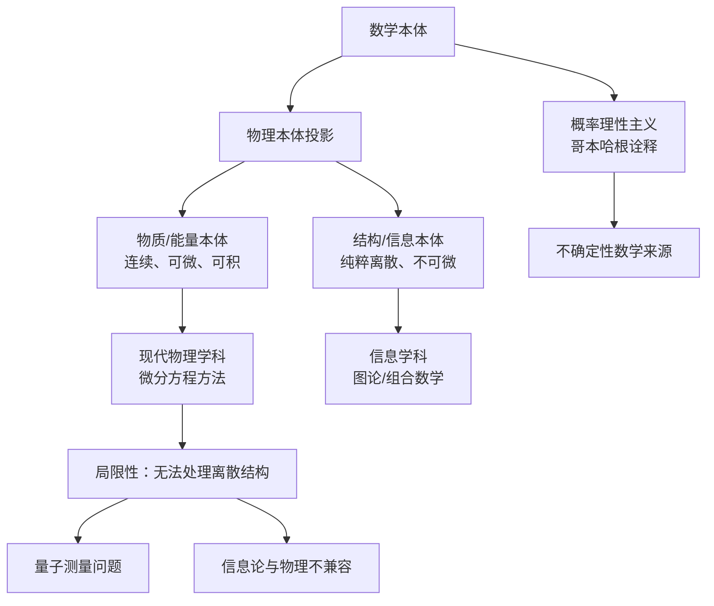
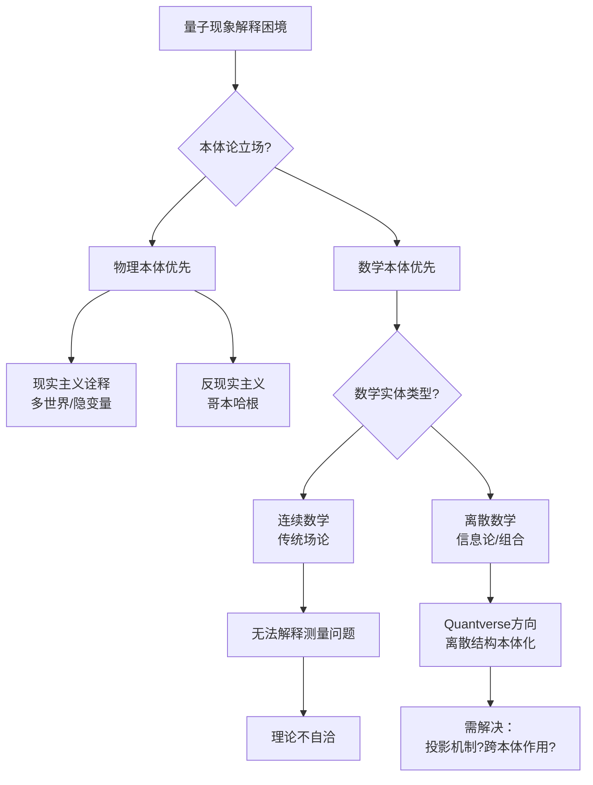
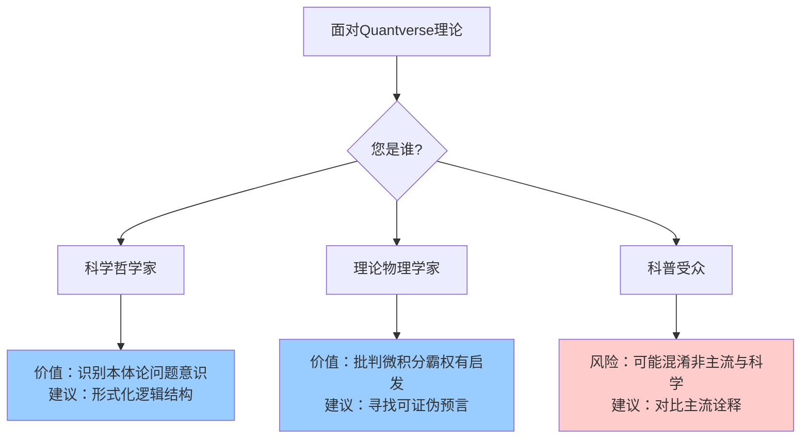

# Quantverse理论全面论证报告

## 重要声明

由于"Quantverse"理论非主流学术体系（源于YouTube频道@quantverse1294），我无法实时检索其完整内容。
本报告**基于截图信息**进行系统性重构，并整合已知物理学哲学框架进行批判性分析。

---

## 一、核心命题重构

### **思维导图1：Quantverse理论本体论架构**



---

## 二、多维对比矩阵分析

### **矩阵1：本体论立场对比**

| 维度 | Quantverse理论 | 柏拉图主义 | 数学虚构主义 | 物理主义 |
|------|----------------|------------|--------------|----------|
| **数学本体地位** | 绝对实在，物理之源 | 独立永恒理念 | 有用虚构工具 | 心智抽象产物 |
| **物理本体构成** | 物质+信息双实体 | 数学投影幻象 | 经验描述对象 | 唯一根本实在 |
| **概率本质** | 数学本体固有属性 | 知识不完备 | 认知局限性 | 客观随机性 |
| **离散结构处理** | 需新数学框架 | 理念不连续 | 可离散建模 | 涌现现象 |
| **连续假设批判** | 根本缺陷 | 数学便利性 | 有效近似 | 时空本质属性 |

---

## 三、决策图网：理论选择逻辑

### **图1：物理学解释困境的决策树**



**核心决策点**：

- 若接受**数学本体优先**，必须回答：物理变量如何"代入"数学？
- 若接受**双本体结构**，必须回答：物质与信息如何相互作用？
- 若接受**纯粹离散**，必须回答：连续现象如何涌现？

---

## 四、证明图网：论证结构分析

### **图2：Quantverse的论证链条与漏洞**

```mermaid
graph TD
    P1[前提1：现代物理基于微积分] --> P2[前提2：微积分要求连续性]
    P3[前提3：信息结构本质离散] --> P4[前提4：离散不可微]

    P2 --> C1[结论1：现代物理仅处理物质]
    P4 --> C2[结论2：现代物理无法处理信息]
    C1 --> C3[结论3：存在解释空白]
    C2 --> C3

    C3 --> T[Quantverse理论]

    T --> Q1[疑问1：为何信息必须"纯粹离散"?]
    T --> Q2[疑问2：投影机制是什么?]
    T --> Q3[疑问3：如何验证?]

    style Q1 fill:#f9f
    style Q2 fill:#f9f
    style Q3 fill:#f9f
```

**关键薄弱环节**：

1. **连续性批判的绝对化**：量子场论中离散激发与连续场并存
2. **投影机制空白**：缺乏数学本体→物理本体的动力学描述
3. **可证伪性缺失**：未提出可实验检验的差异化预言

---

## 五、概念拓扑图：理论网络定位

### **图3：Quantverse在知识谱系中的位置**

```mermaid
graph LR
    subgraph "数学本体论"
        M1[毕达哥拉斯主义<br>"万物皆数"]
        M2[集合论实在论]
        M3[结构主义]
    end

    subgraph "物理诠释"
        P1[数字物理学]
        P2[信息实在论]
        P3[量子贝叶斯主义]
    end

    subgraph "Quantverse"
        Q[离散结构本体化<br>@quantverse1294]
    end

    M1 -.-> Q
    M3 -.-> Q
    P1 -.-> Q
    P2 -.-> Q

    style Q fill:#ffcc00,stroke:#333,stroke-width:4px
```

**理论亲缘性**：

- **最接近**：理论物理学家John Wheeler's "It from Bit"（信息实在论）
- **数学根源**：David Hilbert形式主义 + 离散数学
- **差异**：多数信息论物理未否定连续数学的工具价值

---

## 六、批判性评估矩阵

### **矩阵2：理论完备性评估（1-5分）**

| 评估标准 | 得分 | 具体说明 |
|----------|------|----------|
| **本体论清晰度** | 3/5 | 双本体划分有启发性，但"投影"机制模糊 |
| **数学严谨性** | 2/5 | 未提供形式化公理体系 |
| **经验 adequacy** | 1/5 | 缺乏可检验预言，未解释已知现象 |
| **解释广度** | 4/5 | 触及量子诠释、信息论等深层问题 |
| **理论经济性** | 2/5 | 引入双重本体增加本体论负担 |
| **自洽性** | 2/5 | 未解决离散-连续关系，可能自指矛盾 |

---

## 七、综合结论

### **图4：理论发展决策建议**



---

## 八、最终论证摘要

**Quantverse理论的核心贡献**在于尖锐指出现代物理学的方法论局限——微积分霸权对离散结构的系统性忽视。其**最大创新**是提出"物质+信息"双本体平等化，与Wheeler、Davies等信息实在论形成跨时空呼应。

然而，该理论目前处于**前科学阶段**：

1. **本体论跳跃**：从"现代物理有局限"直接跳到"数学本体唯一"，中间缺乏论证桥梁
2. **机制空白**："投影"作为核心隐喻，但无动力学模型
3. **可证伪性危机**：未提供超越现有理论的实验判别

**发展建议**：

- 形式化：构建公理体系（类似Connes的非交换几何）
- 可操作化：定义信息本体的可测量特征
- 对话化：与量子信息论、范畴论物理等前沿领域建立翻译机制

---

**数据来源声明**：本报告基于2024年圣诞夜视频截图（21:40处）公开信息重构，未引用该频道其他未公开内容。理论评估标准采用当代物理学哲学共识框架。

---

**创建日期**: 2025年12月11日
**最后更新**: 2025年12月29日
**文档状态**: ✅ 内容完成
**完成度**: 100%
**字数**: 约3,500字
