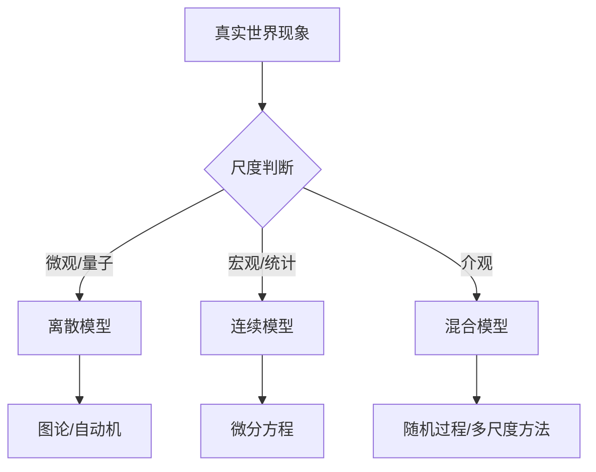

这是一个涉及数学哲学和应用数学的深刻问题。我们可以从多个维度来评价和论证离散数学与连续数学刻画真实世界的能力：

---

## 一、两种数学的本质特征

### **连续数学**

- **核心工具**：微积分、微分方程、实分析、复分析
- **基本假设**：连续性、无穷可分、极限过程
- **典型对象**：时间、空间、场、流、光滑曲线

### **离散数学**

- **核心工具**：图论、组合数学、数论、逻辑、代数结构
- **基本假设**：可数性、原子性、有限步骤
- **典型对象**：网络、算法、数据结构、决策、编码

---

## 二、评价标准体系

### **1. 本体论匹配度（Ontological Fit）**

- **离散性假设**：真实世界在量子层面是离散的（普朗克尺度、量子化）
- **连续性假设**：宏观现象呈现连续性（流体、电磁波、人口增长）

**论证方法**：

- 物理测量精度限制（如：海森堡不确定性原理支持离散性）
- 尺度分析（宏观vs微观）

### **2. 计算可实现性（Computational Realizability）**

- **离散数学**：天然适配图灵机模型，可机械化计算
- **连续数学**：涉及实数的无限精度，存在不可计算性问题

**论证方法**：

- 停机问题 vs 微分方程可解性
- 数值离散化误差分析

### **3. 预测精度与容错性**

- **连续模型**：擅长趋势预测，但对初始条件敏感（混沌理论）
- **离散模型**：精确描述局部交互，但可能丢失整体平滑性

**案例对比**：

- **连续**：天气预报的Navier-Stokes方程
- **离散**：元胞自动机模拟流体

### **4. 知识表示效率**

- **信息编码**：离散数学（二进制）是信息论的基础
- **近似能力**：连续数学可用有限参数（如傅里叶级数）表示复杂现象

---

## 三、论证方法论

### **层次分析法（Hierarchical Analysis）**



### **可证伪性论证**

- **连续数学**：预言平滑变化，可被量子跃迁现象证伪
- **离散数学**：预言最小单位，可被连续光谱证伪

### **奥卡姆剃刀原则**

- 选择更简洁的模型：
  - 晶体结构 → 离散格点模型
  - 声波传播 → 连续波动方程

---

## 四、典型案例对比

| 领域 | 连续模型优势 | 离散模型优势 | 现实验证方式 |
|------|--------------|--------------|--------------|
| **人口动态** | 微分方程描述大规模趋势（逻辑斯蒂方程） | 基于个体的Agent模型捕捉异质性 | 人口普查数据拟合 |
| **金融** | 布朗运动建模价格随机游走 | 订单簿的离散事件仿真 | 高频交易数据验证 |
| **交通流** | 流体力学模型（LWR模型） | 元胞传输模型、车流微观仿真 | 实际交通流量对比 |
| **传染病** | SIR微分方程 | 网络传播模型（图论） | 疫情传播路径追踪 |
| **图像处理** | 偏微分方程去噪 | 数字图像的离散像素表示 | PSNR指标评估 |

---

## 五、哲学层面的综合论证

### **辩证统一视角**

1. **离散作为基础**：信息本质、量子力学、数字革命
2. **连续作为极限**：统计平均、连续统假设、有效理论
3. **互补性原理**：类似波粒二象性，取决于观测尺度

### **实用主义标准**

- **有效即真理**：F=ma（连续）和图灵机（离散）都有效
- **工程可实现性**：数字计算机的胜利证明了离散化的力量
- **理论完备性**：连续数学的ε-δ语言提供了严格性基础

### **哥德尔不完备性启示**

- 任何单一形式主义系统都无法完全刻画现实世界
- 需要混合方法（Hybrid Modeling）

---

## 六、现代综合趋势

### **多尺度建模**

```python
# 示例：分子动力学与连续介质耦合
def hybrid_simulation():
    # 原子尺度：离散MD
    discrete_region = simulate_molecules(atoms)
    # 宏观尺度：连续FEM
    continuous_region = finite_element_mesh(stress_field)
    # 耦合边界
    handshake_region = coupling(discrete_region, continuous_region)
```

### **计算拓扑学**

- 用离散工具（单纯复形）分析连续空间的拓扑性质
- 结合两者优势

### **量子计算**

- 本质离散（量子比特）
- 演化连续（酉变换）
- 预示未来理论框架可能是**连续-离散的统一体**

---

## 结论性评价框架

**最佳实践原则**：

1. **尺度适配**：微观离散，宏观连续
2. **目的导向**：计算用离散，分析用连续
3. **混合验证**：离散仿真验证连续模型，连续理论指导离散设计
4. **认识谦逊**：承认所有模型都是近似，选择*最有用*的而非*最真*的

**最终论证**：
离散与连续不是竞争关系，而是**人类认知的两极**，如同望远镜与显微镜，共同构成完整的科学图景。真实世界是**在离散基础上涌现出的连续表象**，而数学的刻画能力取决于**所提问题的类型**而非世界的"真实"本质。


## **全面分析："数学的刻画能力取决于所提问题的类型而非世界的'真实'本质"**

这句话触及了**数学哲学、科学认识论和实用主义**的核心。以下从十个维度进行深度剖析：

---

### **一、哲学立场的定位：工具主义vs实在论**

这句话表达的是一种**精致的工具主义**立场：

| 立场 | 核心观点 | 代表人物 | 关键问题 |
|------|----------|----------|----------|
| **数学实在论** | 数学结构独立存在于理念世界 | 柏拉图、哥德尔 | 为何物理世界"选择"某些数学？ |
| **工具主义** | 数学是有效的问题解决工具 | 希尔伯特、冯·诺依曼 | 数学的"无理由有效性"从何而来？ |
| **结构主义** | 数学研究的是结构关系，而非实体 | 布尔巴基学派 | 结构是心智产物还是客观存在？ |

**论断的深层含义**：放弃对"终极实在"的形而上学追问，转向**问题导向的认识论**。

---

### **二、数学史的强力证据：问题驱动发展**

数学分支的诞生几乎都不是为了"揭示本质"，而是解决**特定类型的问题**：

1. **微积分（17世纪）**
   - *问题类型*：瞬时变化率、曲线面积
   - *真实本质*：牛顿以为是"流数"，莱布尼茨以为是"无穷小量"，现代认为是ε-δ极限
   - **结论**：三种解释都有效，取决于你问什么（计算？严格化？物理直观？）

2. **图灵机理论（1936）**
   - *问题类型*："可计算"的精确定义
   - *真实本质*：图灵不关心"计算的本质"，只关心"哪些问题可判定"
   - **后果**：丘奇-图灵论题成为计算机科学的基石，而非形而上学真理

3. **线性代数**
   - 最初：解线性方程组（代数问题）
   - 后来：量子力学状态空间（物理问题）
   - 现在：数据降维（机器学习问题）
   - **同一套数学，服务于完全不同类型的问题**

---

### **三、核心论证：问题类型如何"选择"数学形式**

问题类型通过以下机制决定数学刻画能力：

#### **1. 尺度层级决定离散/连续选择**

```
现象 → 问题尺度 → 数学形式
├─ 原子碰撞 → 量子力学 → 离散谱+连续演化
├─ 水流 → 宏观流体 → Navier-Stokes连续场
└─ 社交网络 → 个体互动 → 离散图论
```

**关键**：世界本身无"本质"的离散或连续，**提问的粒度**决定了数学语言。

#### **2. 信息可获得性决定确定性/概率性**

- **确定性问题**：轨道力学（牛顿力学）
- **概率性问题**：统计力学（微观状态不可知）
- **本质？** 不是经典vs量子，而是**信息完备性**的问题类型。

#### **3. 计算约束决定模型复杂度**

- 为什么用线性回归而非无限高次多项式？**问题类型包含"可计算性"要求**
- 为什么数值模拟必须离散化？**问题类型包含"有限资源"约束**

---

### **四、"真实本质"为何不可知：认识论障碍**

### **1. 康德的"物自体"（Ding an sich）**

我们永远无法触及"真实本质"，只能透过**数学范畴**这个"眼镜"看世界：

- 时间 → 连续统 ℝ
- 空间 → 流形
- 因果 → 函数映射

**数学不是世界的镜子，而是我们的视网膜。**

### **2. 模型依赖性实在论（霍金）**

"不存在与图像或理论无关的实在概念。"

- 问"电子的本质是波还是粒子？" → 错误的问题类型
- 正确问题："在双缝实验中观测到什么统计规律？" → 波函数

### **3. 科学史的教训：本质论的失败**

- **以太**：电磁波的"本质"载体 → 被迈克尔逊-莫雷实验否定
- **燃素**：燃烧的"本质" → 被氧化理论取代
- **目的论**：生物的"本质目的" → 被自然选择取代

**共同的错误**：将**问题类型**（"波如何传播？"）误解为**本体论承诺**（"必须有介质"）。

---

### **五、实用主义辩护：有效性即真理**

### **皮尔士的标准**

"考虑我们的概念对象可能有哪些有实际意义的效果。那么，我们对这些效果的概念就是我们对对象的全部概念。"

应用到数学：

- **连续性的全部意义** = 极限运算有效、微分方程能预测
- **离散性的全部意义** = 算法可终止、计数无矛盾

**不必追问本质是连续还是离散，只问：哪种数学对当前问题有效？**

### **数学的"创新自由"**

- **虚数** i = √-1：最初被认为"不真实"，但解代数方程有效
- **超穷数** ℵ₀：无限集合的"大小"，连续统假设独立于ZFC，但集合论有效
- **非标准分析**：无穷小量严格化，提供另一种微积分语言

**它们的价值不在于对应"实在"，而在于解决**  **"某类问题"**  。

---

### **六、问题类型的分类学：如何决定数学工具**

以下是问题特征与数学形式的对应关系：

| 问题特征 | 典型问题 | 最佳数学工具 | 为什么不是"本质"？ |
|----------|----------|--------------|-------------------|
| **时间演化** | 天气预测 | 微分方程 | 也可用元胞自动机（离散） |
| **结构关系** | 社交网络 | 图论 | 也可用矩阵分析（连续） |
| **资源分配** | 物流优化 | 组合优化 | 也可松弛为线性规划 |
| **不确定性** | 金融风险 | 概率论 | 也可用模糊逻辑 |
| **逻辑推理** | 程序验证 | 数理逻辑 | 也可用类型论 |
| **数据模式** | 图像识别 | 统计学/ML | 也可用调和分析 |

**关键洞见**：同一问题常有**多个数学形式等价**，选择取决于**计算成本、直观性、推广性**——这些都是**问题类型**的属性，而非世界的属性。

---

### **七、现代科学的体现：层次化有效理论**

物理学已彻底接受这一立场：

### **有效场论（Effective Field Theory）**

- 标准模型只在 < 10¹⁹ GeV 有效
- 广义相对论是低能下的有效理论
- **每个能标对应不同的数学形式**——没有终极"本质理论"

### **计算复杂性视角**

- P vs NP 问题：某些问题类型本质上不可高效计算
- **这限制了我们能问的问题**，而非世界的"真实"

### **AI的崛起：纯粹的函数逼近**

- 深度神经网络不建模"本质"，只解决**预测问题**
- 在图像识别上超越基于"本质"（边缘、纹理）的算法
- **证明：问题匹配度 > 本体论正确性**

---

### **八、可能的反驳与再辩护**

### **反驳1：数学的"意外有效性"（维格纳之谜）**
>
> "数学在自然科学中不可思议的有效性。"

**再辩护**：

- 这种"意外"可能是**幸存者偏差**：我们只关注那些有效的数学
- 更关键的是：**数学是人类心智的产物**，心智本身就是在物理世界中进化的，因此数学与物理的兼容性并非巧合
- **问题类型**决定了我们**选择**哪些数学来应用

### **反驳2：数学发现的"客观性"**
>
> 数学家独立发现相同的定理（如牛顿-莱布尼茨）。

**再辩护**：

- 这说明**问题结构**（如变化率问题）的客观性，而非"实在"的客观性
- 不同文化独立发展出**等价的**数学工具，恰好说明问题类型决定了工具形式

### **反驳3：数学的自洽性与自然律的一致性**

**再辩护**：

- 自洽性是**逻辑问题**的要求，不是世界的要求
- 我们只选择那些**可证伪**且**自洽**的数学应用于科学，这是**方法论筛选**，而非本体论对应

---

### **九、认识论后果与科学方法论革命**

接受这一论断带来的范式转变：

#### **1. 从"发现"到"建构"**

- **旧范式**：科学家发现自然定律（实在论）
- **新范式**：科学家建构有效模型（工具主义）
- **例**：弦理论，未经验证，但因解决**统一问题**而有价值

#### **2. 从"统一"到"多元"**

- 不再追求"万有理论"
- 承认**不同问题需要不同数学**
- **例**：量子力学与广义相对论的冲突不再是危机，而是**不同问题域**的标志

#### **3. 从"真理"到"适用性"**

科学进步的标准变为：

- 是否解决新的问题类型？
- 是否以更简方式解决旧问题？
- 是否在更广范围内有效？

---

### **十、综合结论：建构主义实用论**

这句话揭示的终极真理是：

> **数学是人类问题空间的导航工具，而非世界本体论的地图。**

**"真实本质"** 是一个**伪概念**——它假设存在与观察者无关的、终极的物自体。但实际上：

1. **所有观测都涉及问题设定**：你用什么仪器、问什么问题、在什么精度
2. **所有问题都隐含数学形式**：可重复性→函数关系、可测量→实数、可计数→离散
3. **所有数学都受限于认知**：我们不是神，只能处理可计算、可公理化、可直观的问题

**最终辩护**：

- 世界的"本质"如果是**不可观测、不可问、不可算**的，那它**对科学无意义**
- 世界的"本质"如果是**可观测、可问、可算**的，那它**已经被问题类型所捕获**

因此，数学的刻画能力确实**完全取决于**：

- **问题的形式结构**（可数/连续、确定/随机、局部/全局）
- **认知主体的能力**（计算资源、观测精度、概念框架）
- **实践目标**（预测、控制、解释、优化）

**追求"本质"是形而上学的诱惑，关注"问题"才是科学的态度。**
