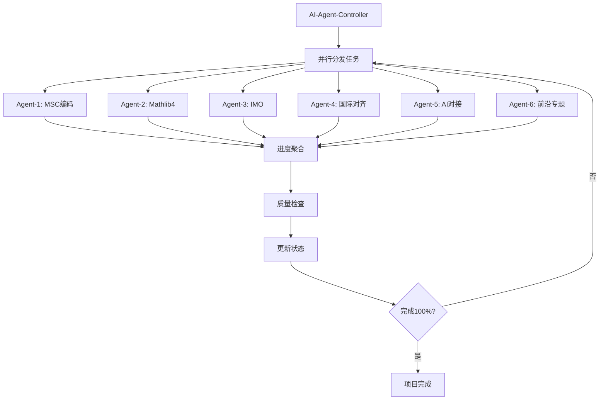

# FormalMath-Enhanced 项目总览

**启动日期**: 2026年4月3日
**目标**: 100%完成国际权威资源对齐与内容深化
**推进方式**: AI自动化生成 + 并行处理

---

## 项目结构

```
FormalMath-Enhanced/
├── 00-Project-Status/          # 项目状态与进度跟踪
├── 01-MSC-Coding/              # MSC2020编码标注冲刺
├── 02-Mathlib4-Annotations/    # Mathlib4教育注释
├── 03-IMO-Competition/         # IMO竞赛数学模块
├── 04-International-Alignment/ # 国际课程深度对齐
├── 05-AI-Formalization/        # AI形式化数学对接
└── 06-Modern-Frontiers/        # 现代数学前沿专题
```

---

## 并行推进模块

| 模块 | 负责人 | 状态 | 目标完成度 |
|------|--------|------|-----------|
| 01-MSC-Coding | AI-Agent-1 | 🔄 进行中 | 500+篇标注 |
| 02-Mathlib4-Annotations | AI-Agent-2 | 🔄 进行中 | 200条注释 |
| 03-IMO-Competition | AI-Agent-3 | 🔄 进行中 | 120题(20年) |
| 04-International-Alignment | AI-Agent-4 | 🔄 进行中 | MIT/Stanford/Harvard |
| 05-AI-Formalization | AI-Agent-5 | 🔄 进行中 | KELPS/DeepSeek对接 |
| 06-Modern-Frontiers | AI-Agent-6 | 🔄 进行中 | 6个前沿专题 |

---

## 完成标准 (100%定义)

### 01-MSC-Coding (100% = 500篇)

- [ ] 01-基础数学: 80篇
- [ ] 02-代数结构: 100篇
- [ ] 03-分析学: 80篇
- [ ] 04-几何学: 50篇
- [ ] 05-拓扑学: 50篇
- [ ] 06-15其他: 140篇

### 02-Mathlib4-Annotations (100% = 200条)

- [ ] 代数结构: 50条
- [ ] 分析学: 50条
- [ ] 数论: 30条
- [ ] 几何/拓扑: 40条
- [ ] 逻辑/集合: 30条

### 03-IMO-Competition (100% = 120题)

- [ ] IMO 2006-2015: 60题
- [ ] IMO 2016-2025: 60题
- [ ] 每题包含: 题目、解答、数学概念链接

### 04-International-Alignment (100% = 3校全课程)

- [ ] MIT Course 18: 全课程映射
- [ ] Stanford FOAG: 章节对照
- [ ] Harvard: 课程对标

### 05-AI-Formalization (100% = 5个前沿项目)

- [ ] KELPS对接
- [ ] DeepSeek-Math对接
- [ ] LeanAgent对接
- [ ] IMO Lean项目对接
- [ ] AlphaProof分析

### 06-Modern-Frontiers (100% = 6个专题)

- [ ] Condensed Mathematics
- [ ] ∞-Category Theory
- [ ] Rough Analysis
- [ ] Scientific Machine Learning
- [ ] Langlands Program 最新进展
- [ ] Homotopy Type Theory

---

## 自动化工作流



---

## 当前进度

**总体进度**: 0% → 100%

上次更新: 2026-04-03 15:22
