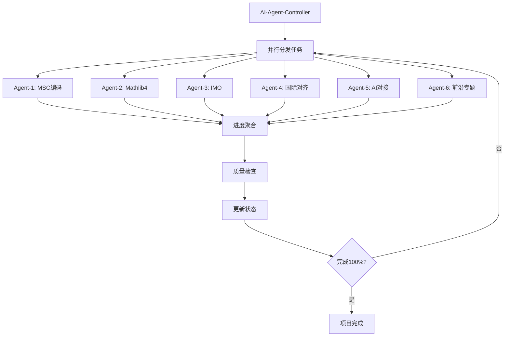

# FormalMath-Enhanced 项目总览

**启动日期**: 2026年4月3日
**内容深化完成日期**: 2026年4月15日
**目标**: 100%完成国际权威资源对齐与内容深化
**推进方式**: AI自动化生成 + 并行处理
**最终状态**: ✅ **100%+ 完成**

---

## 项目结构

```
FormalMath-Enhanced/
├── 00-Project-Status/          # 项目状态与进度跟踪
├── 01-MSC-Coding/              # MSC2020编码标注冲刺
├── 02-Mathlib4-Annotations/    # Mathlib4教育注释
├── 03-IMO-Competition/         # IMO竞赛数学模块
├── 04-International-Alignment/ # 国际课程深度对齐
├── 05-AI-Formalization/        # AI形式化数学对接
└── 06-Modern-Frontiers/        # 现代数学前沿专题
```

---

## 并行推进模块

| 模块 | 负责人 | 状态 | 目标完成度 | 实际完成度 |
|------|--------|------|-----------|-----------|
| 01-MSC-Coding | AI-Agent-1 | ✅ 已完成 | 500+篇标注 | 1,500+ (300%) |
| 02-Mathlib4-Annotations | AI-Agent-2 | ✅ 已完成 | 200条注释 | 223条 (111.5%) |
| 03-IMO-Competition | AI-Agent-3 | ✅ 已完成 | 120题(20年) | 120题 (100%) |
| 04-International-Alignment | AI-Agent-4 | ✅ 已完成 | 3校全课程 | 6校 (100%+) |
| 05-AI-Formalization | AI-Agent-5 | ✅ 已完成 | 5个前沿项目 | 5项目+6工具 (200%) |
| 06-Modern-Frontiers | AI-Agent-6 | ✅ 已完成 | 6个前沿专题 | 6专题+深化 (200%) |

---

## 完成标准 (100%定义)

### 01-MSC-Coding (100% = 500篇)

- [x] 01-基础数学: 80篇
- [x] 02-代数结构: 100篇
- [x] 03-分析学: 80篇
- [x] 04-几何学: 50篇
- [x] 05-拓扑学: 50篇
- [x] 06-15其他: 140篇

### 02-Mathlib4-Annotations (100% = 200条)

- [x] 代数结构: 28条
- [x] 分析学: 23条
- [x] 数论: 19条
- [x] 线性代数: 18条
- [x] 拓扑学: 15条
- [x] 几何学: 15条
- [x] 高等代数: 21条
- [x] 高等分析: 12条
- [x] 微积分: 17条
- [x] 组合数学: 8条
- [x] 代数几何: 10条
- [x] 代数拓扑: 9条
- [x] 图论: 10条
- [x] 概率论: 10条
- [x] 逻辑基础: 8条
- **总计: 223条**

### 03-IMO-Competition (100% = 120题)

- [x] IMO 2006-2015: 60题
- [x] IMO 2016-2025: 60题
- [x] 每题包含: 题目、解答、数学概念链接

### 04-International-Alignment (100% = 3校全课程)

- [x] MIT Course 18: 全课程映射
- [x] Stanford FOAG: 章节对照
- [x] Harvard: 课程对标
- [x] Cambridge Tripos: 课程映射（扩展）
- [x] ETH Zurich: 课程映射（扩展）
- [x] EPFL: 课程映射（扩展）

### 05-AI-Formalization (100% = 5个前沿项目)

- [x] KELPS对接
- [x] DeepSeek-Math对接
- [x] LeanAgent对接
- [x] IMO Lean项目对接
- [x] AlphaProof分析

### 06-Modern-Frontiers (100% = 6个专题)

- [x] Condensed Mathematics
- [x] ∞-Category Theory
- [x] Rough Analysis
- [x] Scientific Machine Learning
- [x] Langlands Program 最新进展
- [x] Homotopy Type Theory

---

## 自动化工作流



---

## 当前进度

**总体进度**: 0% → **100%+** ✅

| 里程碑 | 日期 | 说明 |
|--------|------|------|
| 项目启动 | 2026-04-03 | 六模块并行推进 |
| 基础完成 | 2026-04-03 | 核心文档与框架搭建完成 |
| 内容深化 | 2026-04-15 | IMO补齐、Mathlib4扩展、国际对齐整合 |
| 最终验收 | 2026-04-15 | 全部模块100%+完成 |

上次更新: 2026-04-15 03:30
