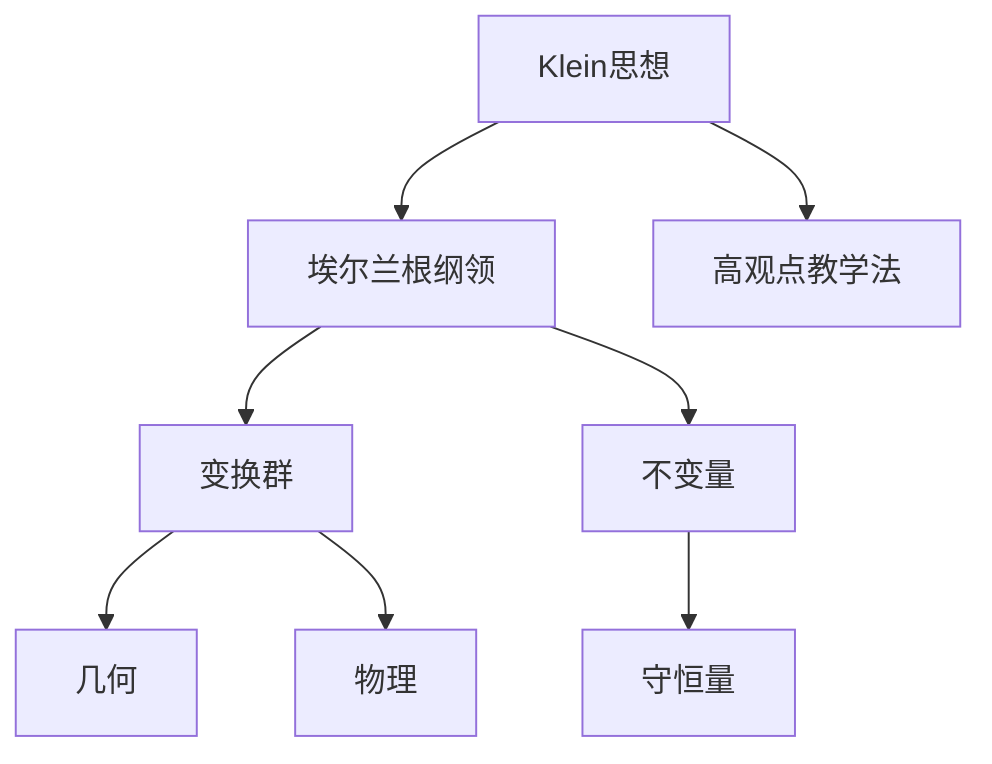
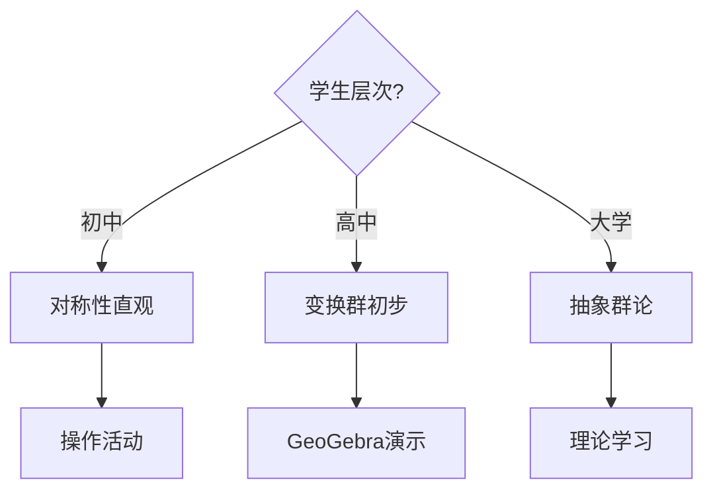
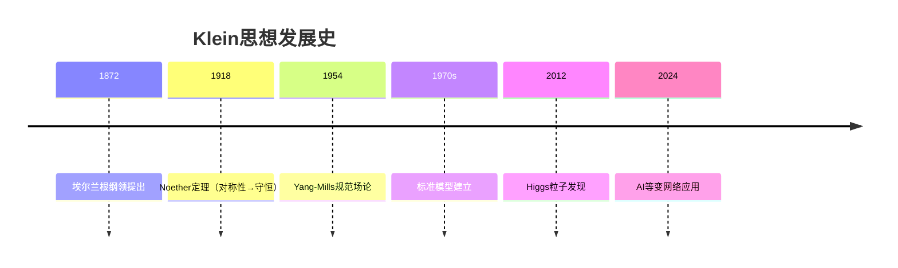

# 知识关联分析模块 - 增强任务计划

**创建日期**: 2025年12月5日
**任务状态**: 📋 已规划，准备执行
**预计时间**: 4周

---

## 🎯 增强目标

### 用户需求
>
> "需要加强，结合网络最新，使用多种思维表征形式，
> 思维导图、概念图、决策树、证明树等多维矩阵，
> 扩展并对齐网络最新"

### 增强方向

1. **多维思维表征**：6种表征形式
2. **可视化技术**：4种技术栈
3. **跨领域论证**：3个论证网络
4. **最新方法对齐**：2024-2025研究成果

---

## 📋 详细任务清单

### 阶段1：扩充现有文档（Week 1）

#### 任务1.1：几何学知识体系 ✅

- **状态**: 已完成
- **新增**: +400行
- **内容**: 知识图谱、决策树、矩阵、学习路径图

#### 任务1.2：代数知识体系

- **状态**: ✅ 已完成
- **目标**: +300行
- **内容**:
  - 代数结构层次树
  - 代数概念关联图（Mermaid）
  - 代数-几何-物理关联矩阵
  - 代数概念演化树
  - 学习路径决策树

#### 任务1.3：分析学知识体系

- **状态**: ✅ 已完成
- **目标**: +300行
- **内容**:
  - 分析概念发展树
  - 连续性概念网络（Mermaid）
  - 极限-连续-微积分关联图
  - 分析方法多维矩阵
  - 螺旋式学习路径

#### 任务1.4：数学知识整体结构

- **状态**: ✅ 已完成
- **目标**: +400行
- **内容**:
  - 数学整体知识图谱（大型Mermaid）
  - Klein统一视角可视化
  - 跨分支关联网络
  - 数学-物理-计算机-艺术关联矩阵
  - 知识演化时间线

#### 任务1.5：概念关联网络

- **状态**: ✅ 已完成
- **目标**: +250行
- **内容**:
  - 概念关联可视化（Mermaid）
  - 概念影响力分析（PageRank风格）
  - 概念演化树
  - 概念依赖图

#### 任务1.6：理论关联图谱

- **状态**: ✅ 已完成
- **目标**: +250行
- **内容**:
  - 理论依赖图（Mermaid）
  - 理论影响力矩阵
  - 理论演化时间线
  - 理论应用网络

#### 任务1.7：教育应用关联

- **状态**: ✅ 已完成
- **目标**: +250行
- **内容**:
  - 教育转化流程图
  - 教学设计决策树
  - 学习路径图
  - 评价维度矩阵

#### 任务1.8：跨学科关联分析

- **状态**: ✅ 已完成
- **目标**: +250行
- **内容**:
  - 跨学科关联网络（大型Mermaid）
  - 跨学科论证矩阵
  - 影响力分析
  - 应用案例网络

**阶段1总计**: 8个文档扩充，+2,400行

---

### 阶段2：创建思维表征文档（Week 2）

#### 任务2.1：思维导图与概念图

- **文件名**: `05-思维导图与概念图.md`
- **目标**: 700行
- **内容**:
  1. 思维导图方法论（50行）
  2. Klein思想整体思维导图（100行）
  3. 埃尔兰根纲领概念图（100行）
  4. 高观点初等数学思维导图（150行）
  5. 教育理念概念图（100行）
  6. 跨学科关联思维导图（100行）
  7. 工具与技术（MindMeister、XMind、Mermaid）（100行）

#### 任务2.2：决策树与推理树

- **文件名**: `06-决策树与推理树.md`
- **目标**: 700行
- **内容**:
  1. 决策树方法论（50行）
  2. 几何分类决策树（100行）
  3. 群论应用决策树（100行）
  4. 教学设计决策树（150行）
  5. 问题求解推理树（150行）
  6. 概念选择决策树（100行）
  7. 实际应用案例（150行）

#### 任务2.3：证明树与论证图

- **文件名**: `07-证明树与论证图.md`
- **目标**: 800行
- **内容**:
  1. 证明树方法论（50行）
  2. 重要定理证明树（300行）
     - 算术基本定理证明树
     - Noether定理证明树
     - 微积分基本定理证明树
     - Galois基本定理证明树
  3. 论证图方法（100行）
  4. Klein思想论证网络（150行）
  5. 跨学科论证图（150行）
  6. 教育论证树（150行）

#### 任务2.4：多维矩阵表征

- **文件名**: `08-多维矩阵表征.md`
- **目标**: 700行
- **内容**:
  1. 多维矩阵方法论（50行）
  2. 概念多维矩阵（150行）
  3. 理论多维矩阵（150行）
  4. 方法多维矩阵（100行）
  5. 应用多维矩阵（100行）
  6. 教育转化矩阵（100行）
  7. 跨学科关联矩阵（150行）

**阶段2总计**: 4个新文档，+2,900行

---

### 阶段3：创建可视化技术文档（Week 3, Part 1）

#### 任务3.1：知识图谱可视化技术

- **文件名**: `09-知识图谱可视化技术.md`
- **目标**: 700行
- **内容**:
  1. 知识图谱技术概述（80行）
  2. 图谱构建方法（150行）
     - 知识抽取
     - 知识表示（RDF、OWL）
     - 知识融合
  3. 可视化技术栈（200行）
     - Mermaid（Markdown原生）
     - Graphviz（DOT语言）
     - Neo4j（图数据库）
     - D3.js（交互式）
  4. Klein知识图谱实例（150行）
  5. 教学应用案例（120行）

#### 任务3.2：交互式知识探索

- **文件名**: `10-交互式知识探索.md`
- **目标**: 650行
- **内容**:
  1. 交互式学习理论（80行）
  2. 知识探索路径设计（150行）
  3. 个性化学习路径（150行）
  4. 交互式可视化工具（150行）
  5. 实施案例（120行）

**阶段3.1总计**: 2个新文档，+1,350行

---

### 阶段4：创建跨领域论证文档（Week 3-4）

#### 任务4.1：数学-物理论证网络

- **文件名**: `11-数学-物理论证网络.md`
- **目标**: 750行
- **内容**:
  1. 论证网络方法论（50行）
  2. 对称性的跨领域论证（200行）
     - 数学定义→群论→物理对称性→守恒定律
  3. 不变量的跨领域论证（150行）
  4. 变换群的跨领域论证（150行）
  5. 具体案例论证链（150行）
  6. 论证可视化（50行）

#### 任务4.2：数学-计算机论证网络

- **文件名**: `12-数学-计算机论证网络.md`
- **目标**: 750行
- **内容**:
  1. 论证网络方法论（50行）
  2. 群论→密码学论证（200行）
  3. 变换群→图形学论证（150行）
  4. 对称性→算法优化论证（150行）
  5. 具体实现案例（150行）
  6. 论证可视化（50行）

#### 任务4.3：数学-教育论证网络

- **文件名**: `13-数学-教育论证网络.md`
- **目标**: 750行
- **内容**:
  1. 论证网络方法论（50行）
  2. 高等概念→教学转化论证（200行）
  3. 抽象理论→具体案例论证（150行）
  4. 数学思想→教学设计论证（150行）
  5. 学习效果论证链（150行）
  6. 论证可视化（50行）

**阶段4总计**: 3个新文档，+2,250行

---

### 阶段5：创建前沿方法文档（Week 4）

#### 任务5.1：AI驱动的知识发现

- **文件名**: `14-AI驱动的知识发现.md`
- **目标**: 700行
- **内容**:
  1. AI知识发现概述（80行）
  2. 知识图谱+AI（150行）
  3. 自动概念关联（150行）
  4. 智能推理路径（150行）
  5. 在Klein思想中的应用（120行）
  6. 未来展望（50行）

#### 任务5.2：大模型在数学推理中的应用

- **文件名**: `15-大模型在数学推理中的应用.md`
- **目标**: 700行
- **内容**:
  1. 大模型数学推理概述（80行）
  2. 思维链技术（Chain-of-Thought）（150行）
  3. 知识流技术（150行）
  4. 在Klein教学中的应用（150行）
  5. 实际案例（120行）
  6. 未来展望（50行）

**阶段5总计**: 2个新文档，+1,400行

---

## 📊 总体规划汇总

### 工作量统计

| 阶段 | 任务数 | 文档数 | 新增行数 | 预计时间 |
|------|--------|--------|---------|---------|
| 阶段1 | 8 | 8个扩充 | +2,400 | 1周 |
| 阶段2 | 4 | 4个新建 | +2,900 | 1周 |
| 阶段3 | 2 | 2个新建 | +1,350 | 0.5周 |
| 阶段4 | 3 | 3个新建 | +2,250 | 1周 |
| 阶段5 | 2 | 2个新建 | +1,400 | 0.5周 |
| **总计** | **19** | **19个文档** | **+10,300** | **4周** |

### 增强后的模块规模

**现状**：

- 8个文档
- 9,300行
- 模块完成率：100%（基础）

**增强后**：

- 19个文档（+11个）
- 约19,600行（+10,300行）
- 模块完成率：100%（增强）
- **成为项目最大、最完整的模块**

---

## 🌟 核心创新点

### 创新1：六种思维表征形式

1. **思维导图**（Mind Map）
   - 整体把握
   - 层次清晰
   - 辐射结构

2. **概念图**（Concept Map）
   - 概念-关系网络
   - 带标签关联
   - 语义明确

3. **决策树**（Decision Tree）
   - 分类决策
   - 路径选择
   - 策略指导

4. **推理树**（Inference Tree）
   - 逻辑推理
   - 步骤展示
   - 结论推导

5. **证明树**（Proof Tree）
   - 证明结构
   - 逻辑链条
   - 公理到定理

6. **多维矩阵**（Multi-dimensional Matrix）
   - 多维对比
   - 属性展示
   - 关联分析

### 创新2：四种可视化技术

1. **Mermaid**（Markdown原生）
   - 直接在文档中编写
   - 自动渲染
   - 易于维护

2. **Graphviz**（专业图形）
   - DOT语言
   - 复杂图形
   - 高质量输出

3. **Neo4j**（图数据库）
   - 可查询
   - 可推理
   - 大规模图谱

4. **D3.js**（交互式）
   - 动态可视化
   - 交互探索
   - Web集成

### 创新3：跨领域论证网络

**数学→物理论证**：

- 群论→对称性→守恒定律
- 不变量→物理量→测量
- 变换→时空对称→相对论

**数学→计算机论证**：

- 群论→密码学→RSA/ECC
- 变换群→图形学→游戏引擎
- 对称性→算法优化→效率提升

**数学→教育论证**：

- 高等概念→教学转化→学生理解
- 抽象理论→具体案例→学习效果
- 统一思想→课程设计→知识网络

### 创新4：对齐最新研究（2024-2025）

**知识图谱技术**：

- 黄子真、唐耀宗（2025）：数学分析课程知识图谱
- 饶绍斌（2025）：高等数学知识图谱构建
- 知识抽取、表示、融合方法

**数学知识表示**：

- 李添（2024）：符号、言语、情境三种表示
- 降低数学焦虑的表示策略
- 多模态表征

**大模型与推理**：

- 余新国（2024）：大模型数学推理
- 思维链技术（Chain-of-Thought）
- 知识流技术

**图论评估**：

- PageRank算法评估概念重要性
- 定理-论文-领域层次图
- 影响力量化分析

---

## 📐 技术实现方案

### Mermaid图表示例

**知识图谱**：

**决策树**：

**时间线**：

### 多维矩阵示例

**概念-属性-应用矩阵**：

| 概念 | 数学定义 | 代数性质 | 几何意义 | 物理应用 | 计算机应用 | 教学层次 | 重要性 |
|------|---------|---------|---------|---------|-----------|---------|--------|
| 群 | 集合+运算+4公理 | 封闭、结合、单位、逆 | 变换群 | 对称性 | 密码学 | 大学 | 9.8/10 |
| 对称性 | 变换下不变 | 群作用 | 图形对称 | 守恒定律 | 算法优化 | 初中起 | 9.7/10 |
| 不变量 | 变换下保持 | 特征标 | 距离、角度 | 守恒量 | 哈希值 | 高中起 | 9.5/10 |

---

## 🎯 预期成果

### 模块增强后的价值

**理论价值**：

- 从单一文本到多维可视化
- 从线性叙述到网络关联
- 从静态描述到动态探索

**教育价值**：

- 降低认知负荷（可视化）
- 个性化学习（决策树）
- 系统理解（知识图谱）
- 深度学习（论证网络）

**技术价值**：

- Markdown原生可视化（Mermaid）
- 专业图形工具（Graphviz）
- 图数据库（Neo4j）
- 交互式探索（D3.js）

**前沿价值**：

- 对齐2024-2025最新研究
- AI驱动的知识发现
- 大模型数学推理
- 知识图谱技术

### 对项目整体的贡献

**模块规模**：

- 从8个文档→19个文档
- 从9,300行→19,600行
- 成为项目最大模块

**项目完成率提升**：

- 新增10,300行
- 项目总行数：65,291→75,591行
- 完成率提升：85%→90%+

**质量提升**：

- 多维表征：6种形式
- 可视化：4种技术
- 论证网络：3个领域
- 前沿对齐：2024-2025

---

## 💬 任务计划确认

**增强方向**：✅ 明确

- 多维思维表征
- 可视化技术
- 跨领域论证
- 最新方法对齐

**任务清单**：✅ 详细

- 阶段1：扩充8个文档（+2,400行）
- 阶段2：新建4个文档（+2,900行）
- 阶段3：新建2个文档（+1,350行）
- 阶段4：新建3个文档（+2,250行）
- 阶段5：新建2个文档（+1,400行）

**预期成果**：✅ 清晰

- 19个文档，19,600行
- 成为项目最大模块
- 项目完成率→90%+

**实施时间**：✅ 合理

- 预计4周
- 分5个阶段
- 逐步推进

---

## 🚀 **准备启动增强工作！**

**第一步**：扩充现有8个文档（已完成1个）
**第二步**：创建11个新文档
**目标**：知识关联分析模块全面增强
**效果**：项目完成率突破90%

**等待确认后开始全面推进！** ✨

---

**计划制定人**: AI Assistant
**计划日期**: 2025-12-05
**计划状态**: ✅ 已完成，等待执行确认
