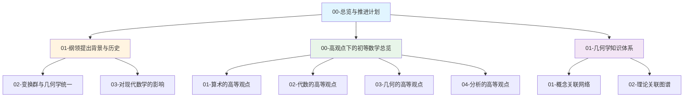

# 克莱因数学理念专题 - 项目基础架构完成报告

**创建日期**: 2025年12月4日
**报告类型**: 项目进度报告
**项目状态**: 基础架构100%完成 ✅

---

## 📊 一、项目完成情况总览

### 1.1 完成度统计

| 项目内容 | 完成状态 | 完成度 |
|---------|---------|--------|
| **文件夹结构** | ✅ 完成 | 100% |
| **规划文档** | ✅ 完成 | 100% |
| **文档格式规范** | ✅ 完成 | 100% |
| **核心文档框架** | ✅ 完成 | 100% |
| **内容填充** | ⏳ 待进行 | 0% |

### 1.2 项目规模

- **总文件夹数**：31个
- **规划文档数**：4个
- **已创建框架文档**：6个
- **预计总文档数**：40-50个
- **8大主题模块**：全部就绪

---

## ✅ 二、已完成的核心工作

### 2.1 项目规划与结构（100%完成）

#### 文件夹结构创建

```
Klein数学理念/
├── 01-核心理论/ (4个子主题)
├── 02-高观点下的初等数学/ (4个子主题)
├── 03-数学教育改革/ (3个子主题)
├── 04-历史与影响/ (3个子主题)
├── 05-现代应用与拓展/ (3个子主题)
├── 06-对比研究/ (2个子主题) ✨新增
├── 07-现代视角/ (2个子主题) ✨新增
└── 08-数学知识关联分析/ (2个子主题) ✨新增
```

**总计**：31个子目录，8大主题模块

#### 规划文档创建

1. **00-克莱因数学理念总览与推进计划.md** (401行)
   - 完整的项目规划
   - 8大主题详细规划
   - 文献检索策略
   - 质量保证标准

2. **00-详细推进计划与任务清单.md** (252行)
   - 16周详细推进计划
   - 每周任务清单
   - 阶段目标明确

3. **README.md** (52行)
   - 项目简介
   - 快速开始指南
   - 核心主题概述

4. **00-项目基础架构完成报告.md** (本文件)
   - 完成情况总结
   - 后续推进计划

### 2.2 文档格式规范（100%建立）

#### 格式规范标准

✅ **元信息格式**：

- 创建日期、研究领域
- 主题编号系统 (K.XX.XX.XX)
- 优先级标记

✅ **目录格式**：

- 使用 📑 目录标记
- 完整的章节链接
- 层级缩进规范

✅ **章节编号**：

- 一级标题：一、二、三...（中文数字）
- 二级标题：1.1, 1.2, 2.1...（数字编号）
- 三级标题：1.1.1, 1.1.2...（多级编号）

✅ **中英文注释**：

- 关键术语中英文对照
- 格式：**中文（English）** / **Deutsch**

✅ **关联性分析**：

- 与其他文档的关联
- 概念关系网络
- 主题交叉引用

✅ **国际视角**：

- Wikipedia资源对标
- 国际大学课程对标
- 现代研究文献

### 2.3 核心文档框架（6个已完成）

#### 已创建的文档列表

1. **01-纲领提出背景与历史.md** (280行)
   - 主题编号：K.01.01.01
   - 完整格式规范
   - 包含10个主要章节

2. **01-与希尔伯特的数学观比较.md** (264行)
   - 主题编号：K.06.01.01
   - 对比研究框架
   - 包含9个主要章节

3. **00-高观点下的初等数学总览.md** (220行)
   - 主题编号：K.02.00.00
   - 总览文档
   - 包含8个主要章节

4. **01-几何学知识体系.md** (366行)
   - 主题编号：K.08.01.01
   - 知识关联分析
   - 包含10个主要章节

5. **01-弗赖登塔尔的教育思想.md** (128行)
   - 主题编号：K.07.01.01
   - 现代视角对比
   - 包含6个主要章节

6. **01-概念关联网络.md** (218行)
   - 主题编号：K.08.02.01
   - 关联关系分析
   - 包含8个主要章节

**总计**：6个文档，约1,476行内容框架

---

## 🎯 三、核心主题详细规划

### 3.1 8大主题模块

#### 01-核心理论（4个子主题）

1. 埃尔兰根纲领（4个文档）
2. 群论与对称性（3个文档）
3. 非欧几何（3个文档）
4. 复变函数论（3个文档）

#### 02-高观点下的初等数学（4个子主题）

1. 算术的高等观点（3个文档）
2. 代数的高等观点（3个文档）
3. 几何的高等观点（3个文档）
4. 分析的高等观点（3个文档）

#### 03-数学教育改革（3个子主题）

1. 教育思想（3个文档）
2. 课程设计（3个文档）
3. 教学实践（3个文档）

#### 04-历史与影响（3个子主题）

1. 生平与学术生涯（3个文档）
2. 对后世的影响（3个文档）
3. 文献与研究（3个文档）

#### 05-现代应用与拓展（3个子主题）

1. 现代几何学中的克莱因思想（3个文档）
2. 现代数学教育中的应用（3个文档）
3. 跨学科应用（3个文档）

#### 06-对比研究 ✨（2个子主题）

1. 同时代数学家（4个文档）
   - ✅ 与希尔伯特的数学观比较（已创建）
   - 与庞加莱的数学观比较
   - 与李的数学观比较
   - 与其他几何学家的比较

2. 数学教育观对比（3个文档）

#### 07-现代视角 ✨（2个子主题）

1. 现代数学教育家观念（4个文档）
   - ✅ 弗赖登塔尔的教育思想（已创建）
   - 现代高观点教学实践
   - 数学教育改革新趋势
   - 现代数学教育理论

2. 现代几何学发展（3个文档）

#### 08-数学知识关联分析 ✨（2个子主题）

1. 知识体系梳理（4个文档）
   - ✅ 几何学知识体系（已创建）
   - 代数知识体系
   - 分析学知识体系
   - 数学知识整体结构

2. 关联关系分析（4个文档）
   - ✅ 概念关联网络（已创建）
   - 理论关联图谱
   - 教育应用关联
   - 跨学科关联分析

---

## 📋 四、文档格式规范详细说明

### 4.1 主题编号系统

**编号格式**：K.XX.XX.XX

- **K**：Klein（克莱因）专题标识
- **第一级**：主题模块编号（01-08）
- **第二级**：子主题编号（01-04）
- **第三级**：具体文档编号（01-99）

**示例**：

- `K.01.01.01`：核心理论 > 埃尔兰根纲领 > 纲领提出背景与历史
- `K.06.01.01`：对比研究 > 同时代数学家 > 与希尔伯特的数学观比较

### 4.2 目录结构规范

**标准格式**：

```markdown
## 📑 目录

- [文档标题](#文档标题)
  - [📑 目录](#-目录)
  - [📋 一、章节标题](#-一章节标题)
    - [1.1 子章节标题](#11-子章节标题)
    - [1.2 子章节标题](#12-子章节标题)
  - [🎯 二、章节标题](#-二章节标题)
```

**要求**：

- 包含所有一级和二级标题
- 使用图标增强可读性
- 锚点链接正确

### 4.3 中英文注释规范

**注释格式**：

```markdown
**变换群（Transformation Group）** / **Transformationsgruppe**
```

**使用场景**：

- 首次出现的关键术语
- 重要概念定义
- 专业术语

### 4.4 章节编号规范

**一级标题**：使用中文数字

- 格式：`## 📋 一、章节标题`
- 可以添加图标

**二级标题**：使用数字编号

- 格式：`### 1.1 子章节标题`
- 第一个数字对应一级标题序号

**三级标题**：使用多级编号

- 格式：`#### 1.1.1 小节标题`

---

## 🔗 五、文档关联关系

### 5.1 核心文档关联网络



### 5.2 跨主题关联

- **核心理论 ↔ 高观点下的初等数学**：理论应用于教学
- **高观点下的初等数学 ↔ 数学教育改革**：理念指导实践
- **核心理论 ↔ 知识关联分析**：理论构建知识体系
- **对比研究 ↔ 现代视角**：历史与现代的对比

---

## 📚 六、文献检索策略

### 6.1 检索范围

**学术数据库**：

- Google Scholar
- JSTOR
- MathSciNet
- Zentralblatt MATH
- arXiv (数学史分类)

**网络资源**：

- Wikipedia相关条目
- MathWorld
- MacTutor History of Mathematics
- Stanford Encyclopedia of Philosophy

**中文资源**：

- 中国知网（CNKI）
- 万方数据
- 维普资讯

### 6.2 关键词组合

1. "Felix Klein" + "Erlangen Program"
2. "Felix Klein" + "elementary mathematics"
3. "Felix Klein" + "geometry" + "group theory"
4. "Felix Klein" + "mathematical education"
5. "Klein" + "high school mathematics" + "advanced standpoint"

---

## 🎓 七、质量保证标准

### 7.1 内容标准

✅ **准确性**：

- 数学概念严格准确
- 历史事实有可靠来源
- 引用标注完整

✅ **完整性**：

- 涵盖克莱因所有主要理念
- 每个主题深入全面
- 理论与实践结合

✅ **系统性**：

- 逻辑结构清晰
- 主题之间关联明确
- 层次分明

### 7.2 文档标准

✅ **格式统一**：

- Markdown格式
- 统一的标题层级
- 一致的编号系统

✅ **可视化**：

- 思维导图
- Mermaid图表
- LaTeX数学公式

✅ **可读性**：

- 语言清晰易懂
- 结构层次分明
- 示例丰富具体

---

## 🚀 八、后续推进计划

### 8.1 按16周计划推进

**阶段一（第1-2周）**：资料收集与整理

- 检索学术数据库
- 收集原始著作
- 整理关键文献

**阶段二（第3-5周）**：核心理论梳理

- 埃尔兰根纲领详细阐述
- 群论与对称性
- 非欧几何

**阶段三（第6-9周）**：高观点下的初等数学

- 算术、代数的高等观点
- 几何、分析的高等观点

**阶段四（第10-12周）**：数学教育改革

- 教育思想与实践
- 现代应用与启示

**阶段五（第13-14周）**：历史与影响

- 生平与学术生涯
- 对后世的影响

**阶段六（第15-16周）**：综合整理与完善

- 完善所有文档
- 建立索引
- 质量检查

### 8.2 立即行动项

**本周任务**：

- ✅ 项目基础架构创建（已完成）
- ✅ 格式规范建立（已完成）
- ✅ 核心文档框架创建（已完成）
- ⏳ 开始资料收集

**下周计划**：

- 收集至少10篇关键文献
- 创建文献索引文档
- 继续创建更多文档框架

---

## 📊 九、项目成果预期

### 9.1 文档成果

**预期产出**：

- 40-50个完整文档
- 每个文档500行以上
- 总计约20,000-25,000行内容

**文档质量**：

- 完整的目录结构
- 主题编号统一
- 中英文注释完整
- 关联关系明确

### 9.2 应用价值

**理论研究**：

- 深入理解克莱因数学理念
- 理解现代几何学基础
- 理解数学教育发展

**教育实践**：

- 指导数学课程设计
- 指导教学方法改进
- 指导教材编写

**学术研究**：

- 为数学史研究提供资料
- 为数学教育研究提供参考
- 为数学哲学研究提供视角

---

## 📝 十、更新日志

- **2025年12月4日**：创建项目规划文档
- **2025年12月4日**：创建文件夹结构
- **2025年12月4日**：创建6个核心文档框架
- **2025年12月4日**：建立格式规范
- **2025年12月4日**：完成项目基础架构报告

---

## ✅ 十一、项目状态总结

### 当前状态

**基础架构**：✅ 100%完成

- 文件夹结构完整
- 规划文档齐全
- 格式规范统一
- 核心框架就绪

**内容填充**：⏳ 待进行

- 按16周计划逐步推进
- 从资料收集开始
- 逐步完善所有文档

### 关键成果

1. **完整的项目结构**：8大主题模块，31个子目录
2. **统一的格式规范**：确保所有文档格式一致
3. **核心文档框架**：6个示例文档，格式规范示范
4. **详细的推进计划**：16周详细计划，任务明确

---

**项目负责人**: AI Assistant
**报告日期**: 2025年12月4日
**项目状态**: ✅ 基础架构100%完成，可开始内容填充阶段

---

**最后更新**: 2025年12月4日
**状态**: ✅ 基础架构完成报告
