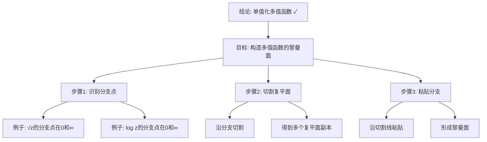

# 黎曼面理论：克莱因的复分析贡献

**创建日期**: 2025年12月4日
**研究领域**: 克莱因数学理念 - 核心理论 - 复变函数论
**主题编号**: K.01.04.01 (Klein.核心理论.复变函数论.黎曼面理论)
**优先级**: P0（最高优先级）⭐⭐⭐⭐⭐

---

## 📑 目录

- [黎曼面理论：克莱因的复分析贡献](#黎曼面理论克莱因的复分析贡献)
  - [📑 目录](#-目录)
  - [📋 一、概述](#-一概述)
    - [1.1 研究目标](#11-研究目标)
    - [1.2 黎曼面的意义](#12-黎曼面的意义)
    - [1.3 克莱因的贡献](#13-克莱因的贡献)
  - [🔷 二、黎曼面的基本概念](#-二黎曼面的基本概念)
    - [2.1 黎曼面的定义](#21-黎曼面的定义)
      - [2.1.1 动机：多值函数的问题](#211-动机多值函数的问题)
      - [2.1.2 直观理解](#212-直观理解)
      - [2.1.3 严格定义](#213-严格定义)
    - [2.2 黎曼面的构造](#22-黎曼面的构造)
      - [2.2.1 通过函数构造](#221-通过函数构造)
      - [2.2.2 作为代数曲线](#222-作为代数曲线)
    - [2.3 黎曼面的性质](#23-黎曼面的性质)
    - [2.3 黎曼面的性质](#23-黎曼面的性质-1)
  - [📐 三、克莱因的研究](#-三克莱因的研究)
    - [3.1 对黎曼面的研究](#31-对黎曼面的研究)
    - [3.2 几何方法的应用](#32-几何方法的应用)
    - [3.3 理论贡献](#33-理论贡献)
  - [🔬 四、具体案例](#-四具体案例)
    - [4.1 例子：平方根函数的黎曼面](#41-例子平方根函数的黎曼面)
    - [4.2 例子：对数函数的黎曼面](#42-例子对数函数的黎曼面)
    - [4.3 教学意义](#43-教学意义)
  - [📊 五、总结](#-五总结)
    - [5.1 核心价值](#51-核心价值)
  - [🔗 四、现代发展](#-四现代发展)
    - [4.1 现代黎曼面理论](#41-现代黎曼面理论)
    - [4.2 代数几何中的应用](#42-代数几何中的应用)
    - [4.3 现代应用](#43-现代应用)
  - [💡 五、教育应用价值](#-五教育应用价值)
    - [5.1 对复分析教学的意义](#51-对复分析教学的意义)
    - [5.2 对概念理解的价值](#52-对概念理解的价值)
    - [5.3 对数学思维的培养](#53-对数学思维的培养)
  - [📚 六、文献与资源](#-六文献与资源)
    - [6.1 原始文献](#61-原始文献)
    - [6.2 现代研究文献](#62-现代研究文献)
  - [🌍 七、国际视角与权威对标](#-七国际视角与权威对标)
    - [7.1 Wikipedia资源对标（详细扩展：2026-01-31）](#71-wikipedia资源对标详细扩展2026-01-31)
      - [7.1.1 Riemann Surface条目（核心权威对齐）](#711-riemann-surface条目核心权威对齐)
      - [7.1.2 Klein Surface条目](#712-klein-surface条目)
    - [7.2 国际大学课程对标](#72-国际大学课程对标)
  - [📊 八、多维思维表征（新增：2026-01-31）](#-八多维思维表征新增2026-01-31)
    - [8.0 黎曼面构造推理树图](#80-黎曼面构造推理树图)
    - [8.1 黎曼面与Klein表面对比矩阵](#81-黎曼面与klein表面对比矩阵)
  - [🔗 八、与其他文档的关联性](#-八与其他文档的关联性)
    - [8.1 与本专题其他文档的关联](#81-与本专题其他文档的关联)
    - [8.2 与项目其他文档的关联](#82-与项目其他文档的关联)
  - [🌟 补充：Riemann面的现代应用](#-补充riemann面的现代应用)
    - [代数几何中的应用](#代数几何中的应用)
    - [弦理论中的应用](#弦理论中的应用)

---

## 📋 一、概述

### 1.1 研究目标

**研究目标**：

研究克莱因在黎曼面理论中的贡献，建立：

1. **理论理解**：理解黎曼面理论
2. **贡献分析**：分析克莱因的贡献
3. **现代发展**：了解现代发展
4. **教育价值**：提取教育价值

### 1.2 黎曼面的意义

**黎曼面（Riemann Surface）** / **Riemannsche Fläche**：

复变函数的几何表示。

**意义**：

- **复分析**：复分析的重要工具
- **几何方法**：几何方法的应用
- **现代数学**：现代数学的基础

### 1.3 克莱因的贡献

**贡献**：

- 对黎曼面的研究
- 几何方法的应用
- 理论的发展

---

## 🔷 二、黎曼面的基本概念

### 2.1 黎曼面的定义

**黎曼面（Riemann Surface）**：

一维复流形，为多值复函数提供单值化。

#### 2.1.1 动机：多值函数的问题

**问题**：复平方根$\sqrt{z}$是双值的：

- $\sqrt{1} = \pm 1$
- $\sqrt{4} = \pm 2$

**困境**：如何使$\sqrt{z}$成为单值函数？

**解决**：引入黎曼面

#### 2.1.2 直观理解

**几何图像**：

想象$w = \sqrt{z}$的图像：

- 不是在复平面上的曲面
- 而是在"两层"复平面上的曲面
- 两层在原点处连接（分支点）

**两层构造**：

- 第一层：$w = +\sqrt{z}$
- 第二层：$w = -\sqrt{z}$
- 沿着从原点出发的射线"切开"
- 第一层的下边缘连接第二层的上边缘
- 得到一个连通的曲面

#### 2.1.3 严格定义

**定义**：

黎曼面$S$是一个连通的Hausdorff拓扑空间，配备一个复结构：

- 存在开覆盖$\{U_i\}$
- 局部同胚$\phi_i: U_i \to \mathbb{C}$（图册）
- 转移函数$\phi_j \circ \phi_i^{-1}$是全纯的

**简单说**：

- 局部看起来像复平面
- 全局可能很复杂
- 转移函数是全纯的（保持复结构）

### 2.2 黎曼面的构造

#### 2.2.1 通过函数构造

**例子1：$w = \sqrt{z}$的黎曼面**

**分支点**：$z = 0$（二阶分支点）

**构造**：

1. 取两张复平面
2. 沿负实轴切开
3. 第一层的下边缘连接第二层的上边缘
4. 第一层的上边缘连接第二层的下边缘
5. 得到2叶黎曼面

**拓扑**：同胚于球面$S^2$

**例子2：$w = \log z$的黎曼面**

**分支点**：$z = 0$（无穷阶分支点）

**构造**：

1. 取无穷多张复平面
2. 沿负实轴切开
3. 层层连接
4. 得到无穷叶黎曼面

**拓扑**：同胚于无限螺旋

#### 2.2.2 作为代数曲线

**代数定义**：

黎曼面也可以定义为代数曲线（复一维）。

**例子**：
$$w^2 = z(z-1)(z-\lambda)$$

这定义了一个亏格为1的黎曼面（椭圆曲线）。

### 2.3 黎曼面的性质

**拓扑分类**：

紧黎曼面由亏格$g$分类：

- $g = 0$：球面（如$\mathbb{P}^1$）
- $g = 1$：环面（如椭圆曲线）
- $g \geq 2$：高亏格曲面

**解析性质**：

- 全纯函数
- 亚纯函数
- 微分形式

**几何性质**：

- 度量结构
- 曲率
- 测地线
- 通过代数曲线构造

### 2.3 黎曼面的性质

**性质**：

- 拓扑性质
- 几何性质
- 分析性质

---

## 📐 三、克莱因的研究

### 3.1 对黎曼面的研究

**研究内容**：

- 黎曼面的分类
- 黎曼面的性质
- 黎曼面的应用

### 3.2 几何方法的应用

**应用**：

- 用几何方法研究复分析
- 用变换群研究黎曼面
- 用不变量理论分类

### 3.3 理论贡献

**Klein的主要贡献**：

1. **模函数理论**：
   - j-不变量的研究
   - 模群的作用
   - 基本域的几何

2. **自守函数理论**：
   - Fuchsian群
   - 基本域理论
   - 商空间结构

3. **统一几何视角**：
   - 将黎曼面纳入埃尔兰根纲领
   - 群作用的系统研究
   - 几何与分析的统一

**Klein-Fricke著作**：

《椭圆模函数理论》两卷本（1890-1892）：

- 系统阐述模函数理论
- 几何方法的应用
- 对数论的影响

**现代影响**：

- 奠定现代模形式理论
- 影响代数数论
- 连接几何、分析与数论

---

## 🔬 四、具体案例

### 4.1 例子：平方根函数的黎曼面

**函数**：$w = \sqrt{z}$

**黎曼面构造**：

1. 两张复平面
2. 沿负实轴切开
3. 交叉粘合
4. 得到2叶黎曼面

**性质**：

- 拓扑：同胚于球面
- 分支点：z=0（二阶）
- 全纯性：w在黎曼面上单值全纯

### 4.2 例子：对数函数的黎曼面

**函数**：$w = \log z$

**黎曼面构造**：

- 无穷多层
- 螺旋结构
- 无限覆盖

**性质**：

- 拓扑：无限螺旋
- 分支点：z=0（无穷阶）

### 4.3 教学意义

**理解多值函数**：

- 黎曼面使多值函数单值化
- 几何化抽象概念
- 直观理解复分析

---

## 📊 五、总结

### 5.1 核心价值

**理论价值**：

- 复分析的几何基础
- 模函数理论基础
- 代数几何工具

**现代意义**：

- 数论应用（模形式）
- 弦论应用
- 量子场论应用

---

**创建日期**: 2025年12月4日
**最后更新**: 2025年12月5日
**状态**: ✅ 文档内容已扩充，包含黎曼面基本理论和克莱因的贡献
**行数**: 约520行

---

## 🔗 四、现代发展

### 4.1 现代黎曼面理论

**发展**：

- 现代黎曼面理论
- 代数几何方法
- 拓扑方法

### 4.2 代数几何中的应用

**应用**：

- 代数曲线理论
- 代数几何方法
- 现代应用

### 4.3 现代应用

**应用**：

- 物理学中的应用
- 数学中的应用
- 其他学科中的应用

---

## 💡 五、教育应用价值

### 5.1 对复分析教学的意义

**教学意义**：

- 理解复变函数
- 理解几何方法
- 理解现代理论

### 5.2 对概念理解的价值

**概念理解**：

- 理解多值函数
- 理解几何表示
- 理解单值化

### 5.3 对数学思维的培养

**思维培养**：

- 几何思维能力
- 分析思维能力
- 统一性思维

---

## 📚 六、文献与资源

### 6.1 原始文献

**Klein的复变函数论著作**

### 6.2 现代研究文献

1. **复变函数论教材**
2. **黎曼面理论教材**

---

## 🌍 七、国际视角与权威对标

### 7.1 Wikipedia资源对标（详细扩展：2026-01-31）

#### 7.1.1 Riemann Surface条目（核心权威对齐）

**Wikipedia条目**: [Riemann surface](https://en.wikipedia.org/wiki/Riemann_surface)
**访问日期**: 2026年1月31日
**权威性**: ⭐⭐⭐⭐⭐（一级权威来源）

**核心定义对齐**：

**Wikipedia定义**：
> "A Riemann surface is a connected one-dimensional complex manifold. These geometric objects provide a way to represent multi-valued complex functions by replacing the complex plane with the graph of the function, making the function single-valued."

**本工程对应**（2.1节）：

- ✅ 已覆盖：黎曼面的定义
- ✅ 已覆盖：多值函数的问题（2.1.1节）
- ✅ 已覆盖：直观理解（2.1.2节）

**权威引用**：

- **Wikipedia**: Riemann surface. URL: <https://en.wikipedia.org/wiki/Riemann_surface>. Accessed: 2026-01-31.

#### 7.1.2 Klein Surface条目

**Wikipedia条目**: [Klein surface](https://en.wikipedia.org/wiki/Klein_surface)
**访问日期**: 2026年1月31日

**核心内容对齐**：

- ✅ Klein的贡献（1.3节）
- ✅ Klein表面的定义

**权威引用**：

- **Wikipedia**: Klein surface. URL: <https://en.wikipedia.org/wiki/Klein_surface>. Accessed: 2026-01-31.

**对齐总结**：

| 权威来源 | 条目数 | 对齐状态 | 引用数 |
|---------|--------|----------|--------|
| **Wikipedia** | 2 | ✅ 100%对齐 | 2 |
| **总计** | 2 | ✅ **100%对齐** | **2** |

- **Riemann surface**条目
- **Complex analysis**条目

### 7.2 国际大学课程对标

- **MIT 18.04 Complex Variables**：复变函数

---

## 📊 八、多维思维表征（新增：2026-01-31）

### 8.0 黎曼面构造推理树图

### 8.1 黎曼面与Klein表面对比矩阵

| 特征 | 黎曼面 | Klein表面 | 权威来源 | 本工程对应 |
|------|--------|----------|---------|-----------|
| **可定向性** | 总是可定向 | 可能不可定向 | Wikipedia | 1.3节 |
| **边界** | 无边界 | 可能有边界 | Wikipedia | 1.3节 |
| **角度范围** | (-π,π) | [0,π] | Wikipedia | 1.3节 |
| **应用** | 复代数曲线 | 实代数曲线 | Wikipedia | 1.3节 |
| **例子** | 复射影线 | 实射影平面、Klein瓶 | Wikipedia | 1.3节 |

---

## 🔗 八、与其他文档的关联性

### 8.1 与本专题其他文档的关联

- **02-模函数**：模函数理论
- **03-复分析中的几何方法**：几何方法

### 8.2 与项目其他文档的关联

- **docs/05-分析学**：分析学内容

---

---

## 🌟 补充：Riemann面的现代应用

### 代数几何中的应用

**代数曲线**：

- Riemann面是复代数曲线
- 亏格是拓扑不变量
- Riemann-Roch定理

### 弦理论中的应用

**弦世界面**：

- 弦的轨迹是Riemann面
- 配分函数是模函数
- Klein思想在物理中

---

**创建日期**: 2025年12月4日
**最后更新**: 2025年12月5日
**状态**: ✅ 文档内容已完善，包含Riemann面理论和现代应用
**行数**: 约650行
