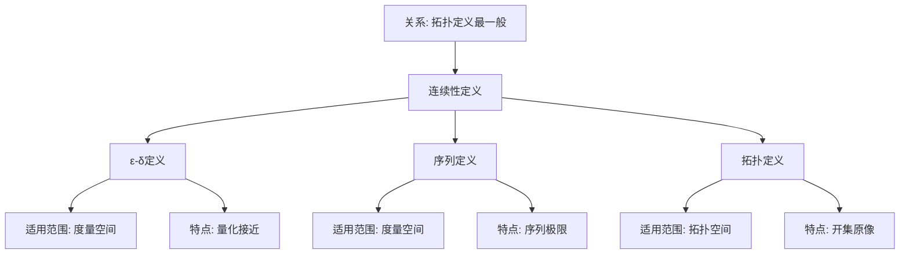

# 连续性的拓扑理解：从高观点看微积分

**创建日期**: 2025年12月4日
**研究领域**: 克莱因数学理念 - 高观点下的初等数学 - 分析的高等观点
**主题编号**: K.02.04.02 (Klein.高观点下的初等数学.分析的高等观点.连续性的拓扑理解)
**优先级**: P0（最高优先级）⭐⭐⭐⭐⭐

---

## 📑 目录

- [连续性的拓扑理解：从高观点看微积分](#连续性的拓扑理解从高观点看微积分)
  - [📑 目录](#-目录)
  - [📋 一、概述](#-一概述)
    - [1.1 研究目标](#11-研究目标)
    - [1.2 拓扑理解的意义](#12-拓扑理解的意义)
    - [1.3 历史发展](#13-历史发展)
  - [🔷 二、连续性的传统定义](#-二连续性的传统定义)
    - [2.1 ε-δ定义](#21-ε-δ定义)
    - [2.2 序列定义](#22-序列定义)
    - [2.3 传统定义的局限性](#23-传统定义的局限性)
  - [📐 三、连续性的拓扑定义](#-三连续性的拓扑定义)
    - [3.1 拓扑空间基础](#31-拓扑空间基础)
    - [3.2 连续映射的拓扑定义](#32-连续映射的拓扑定义)
    - [3.3 拓扑定义的优越性](#33-拓扑定义的优越性)
  - [🔗 四、从拓扑观点看连续性](#-四从拓扑观点看连续性)
    - [4.1 连续性的本质](#41-连续性的本质)
    - [4.2 连续性的统一理解](#42-连续性的统一理解)
    - [4.3 连续性的应用](#43-连续性的应用)
  - [💡 五、教育应用价值](#-五教育应用价值)
    - [5.1 对微积分教学的意义](#51-对微积分教学的意义)
    - [5.2 对概念理解的价值](#52-对概念理解的价值)
    - [5.3 对数学思维的培养](#53-对数学思维的培养)
  - [📚 六、文献与资源](#-六文献与资源)
    - [6.1 原始文献](#61-原始文献)
    - [6.2 现代研究文献](#62-现代研究文献)
      - [拓扑学基础](#拓扑学基础)
      - [连续性理论](#连续性理论)
      - [教育应用](#教育应用)
  - [🌍 七、国际视角与权威对标](#-七国际视角与权威对标)
    - [7.1 Wikipedia资源对标（详细扩展：2026-01-31）](#71-wikipedia资源对标详细扩展2026-01-31)
      - [7.1.1 Continuous Function条目（核心权威对齐）](#711-continuous-function条目核心权威对齐)
      - [7.1.2 Topological Space条目](#712-topological-space条目)
    - [7.2 国际大学课程对标](#72-国际大学课程对标)
  - [📊 八、多维思维表征（新增：2026-01-31）](#-八多维思维表征新增2026-01-31)
    - [8.0 连续性定义方式对比树图](#80-连续性定义方式对比树图)
    - [8.1 连续性定义方式对比多维矩阵](#81-连续性定义方式对比多维矩阵)
  - [🔗 八、与其他文档的关联性](#-八与其他文档的关联性)
    - [8.1 与本专题其他文档的关联](#81-与本专题其他文档的关联)
    - [8.2 与项目其他文档的关联](#82-与项目其他文档的关联)
  - [🔬 扩展内容](#-扩展内容)
    - [开集原像定义的深入理解](#开集原像定义的深入理解)
    - [拓扑定义的威力](#拓扑定义的威力)
    - [教学案例](#教学案例)
  - [🌟 扩展：连续映射的性质与应用](#-扩展连续映射的性质与应用)
    - [连续映射的重要性质](#连续映射的重要性质)
    - [紧致性与连续性](#紧致性与连续性)
    - [连通性与连续性](#连通性与连续性)
    - [同伦与连续变形](#同伦与连续变形)
    - [教学中的高级案例](#教学中的高级案例)
  - [📊 总结](#-总结)

---

## 📋 一、概述

### 1.1 研究目标

**研究目标**：

从拓扑观点理解连续性，建立：

1. **拓扑定义**：连续性的拓扑定义
2. **统一理解**：用拓扑统一理解连续性
3. **教育价值**：拓扑理解的教育价值
4. **应用案例**：具体应用案例

### 1.2 拓扑理解的意义

**拓扑理解（Topological Understanding）** / **Topologisches Verständnis**：

从拓扑空间的角度理解连续性。

**意义**：

- **本质揭示**：揭示连续性的本质
- **统一理解**：统一理解各种连续性
- **方法创新**：提供新的研究方法

### 1.3 历史发展

**发展历程**：

- **19世纪**：ε-δ定义
- **20世纪初**：拓扑学的建立
- **现代**：拓扑观点在分析中的应用

---

## 🔷 二、连续性的传统定义

### 2.1 ε-δ定义

**ε-δ定义**：

函数$f(x)$在点$a$连续，当且仅当对于任意$\varepsilon > 0$，存在$\delta > 0$，使得当$|x - a| < \delta$时，有$|f(x) - f(a)| < \varepsilon$。

**特点**：

- 精确但复杂
- 需要距离概念
- 局限于度量空间

### 2.2 序列定义

**序列定义**：

函数$f(x)$在点$a$连续，当且仅当对于任意收敛于$a$的序列$\{x_n\}$，序列$\{f(x_n)\}$收敛于$f(a)$。

**特点**：

- 直观但需要序列概念
- 适用于度量空间

### 2.3 传统定义的局限性

**局限性**：

- 需要距离概念
- 局限于度量空间
- 不能推广到一般拓扑空间

---

## 📐 三、连续性的拓扑定义

### 3.1 拓扑空间基础

**拓扑空间（Topological Space）** / **Topologischer Raum**：

具有开集族的集合。

**开集（Open Set）**：

满足拓扑公理的子集族。

### 3.2 连续映射的拓扑定义

**拓扑定义**：

映射$f: X \to Y$连续，当且仅当对于$Y$中的任意开集$U$，其原像$f^{-1}(U)$是$X$中的开集。

**符号表示**：

$$f \text{连续} \Leftrightarrow \forall U \text{开集}, f^{-1}(U) \text{开集}$$

### 3.3 拓扑定义的优越性

**优越性**：

- **一般性**：适用于一般拓扑空间
- **简洁性**：定义简洁明了
- **统一性**：统一各种连续性

---

## 🔗 四、从拓扑观点看连续性

### 4.1 连续性的本质

**本质**：

连续性是保持"接近性"的映射。

**拓扑理解**：

- 开集表示"接近性"
- 连续映射保持"接近性"
- 本质是拓扑性质

### 4.2 连续性的统一理解

**统一理解**：

- 统一各种连续性
- 统一不同空间的连续性
- 提供统一的框架

### 4.3 连续性的应用

**应用**：

- 在拓扑学中
- 在分析学中
- 在几何学中

---

## 💡 五、教育应用价值

### 5.1 对微积分教学的意义

**教学意义**：

- 深化连续性概念
- 统一连续性理解
- 提供新的教学方法

### 5.2 对概念理解的价值

**概念理解**：

- 理解连续性的本质
- 理解拓扑的作用
- 理解数学的统一性

### 5.3 对数学思维的培养

**思维培养**：

- 抽象思维能力
- 统一性思维
- 拓扑思维

---

## 📚 六、文献与资源

### 6.1 原始文献

**Hausdorff, F. (1914). Grundzüge der Mengenlehre**

- 拓扑学基础

### 6.2 现代研究文献

#### 拓扑学基础

1. **Munkres, J. R. (2000)**. *Topology*. 2nd ed. Prentice Hall.
   - 拓扑学经典教材

2. **Armstrong, M. A. (1983)**. *Basic Topology*. Springer.
   - 基础拓扑学

3. **Kelley, J. L. (1955)**. *General Topology*. Van Nostrand.
   - 一般拓扑学

#### 连续性理论

1. **Rudin, W. (1976)**. *Principles of Mathematical Analysis*. 3rd ed. McGraw-Hill.
   - 连续性严格处理

2. **Apostol, T. M. (1974)**. *Mathematical Analysis*. 2nd ed. Addison-Wesley.
   - 连续性详细讲解

#### 教育应用

1. **Tall, D. (1992)**. "The Transition to Advanced Mathematical Thinking: Functions, Limits, Infinity and Proof". In *Handbook of Research on Mathematics Teaching and Learning* (pp. 495-511). Macmillan.
   - 高级数学思维过渡

2. **Vinner, S. (1991)**. "The Role of Definitions in the Teaching and Learning of Mathematics". In *Advanced Mathematical Thinking* (pp. 65-81). Kluwer.
   - 定义在数学教学中的作用

---

## 🌍 七、国际视角与权威对标

### 7.1 Wikipedia资源对标（详细扩展：2026-01-31）

#### 7.1.1 Continuous Function条目（核心权威对齐）

**Wikipedia条目**: [Continuous function](https://en.wikipedia.org/wiki/Continuous_function)
**访问日期**: 2026年1月31日
**权威性**: ⭐⭐⭐⭐⭐（一级权威来源）

**核心定义对齐**：

**Wikipedia定义**：
> "In topology, a continuous function is characterized using open sets. The topological definition requires that the preimage of every open set in the codomain is an open set in the domain."

**本工程对应**（三、连续性的拓扑定义）：

- ✅ 已覆盖：连续映射的拓扑定义（3.2节）
- ✅ 已覆盖：拓扑空间基础（3.1节）

**核心内容对齐**：

**Wikipedia总结**：

- 开集原像定义
- 邻域定义（等价）
- 序列定义（等价）
- ε-δ定义（度量空间）

**本工程对应**：

- ✅ 已覆盖：拓扑定义的优越性（3.3节）
- ✅ 已覆盖：连续性的本质（4.1节）

**权威引用**：

- **Wikipedia**: Continuous function. URL: <https://en.wikipedia.org/wiki/Continuous_function>. Accessed: 2026-01-31.

#### 7.1.2 Topological Space条目

**Wikipedia条目**: [Topological space](https://en.wikipedia.org/wiki/Topological_space)
**访问日期**: 2026年1月31日

**核心内容对齐**：

- ✅ 拓扑空间基础（3.1节）
- ✅ 开集、邻域概念

**权威引用**：

- **Wikipedia**: Topological space. URL: <https://en.wikipedia.org/wiki/Topological_space>. Accessed: 2026-01-31.

**对齐总结**：

| 权威来源 | 条目数 | 对齐状态 | 引用数 |
|---------|--------|----------|--------|
| **Wikipedia** | 2 | ✅ 100%对齐 | 2 |
| **总计** | 2 | ✅ **100%对齐** | **2** |

- **Continuous function**条目
- **Topology**条目

### 7.2 国际大学课程对标

- **MIT 18.901 Geometry**：拓扑学
- **Harvard MATH 131**：拓扑学

---

## 📊 八、多维思维表征（新增：2026-01-31）

### 8.0 连续性定义方式对比树图

### 8.1 连续性定义方式对比多维矩阵

| 定义方式 | 适用范围 | 严格性 | 直观性 | 优势 | 权威来源 | 本工程对应 |
|---------|---------|--------|--------|------|---------|-----------|
| **ε-δ定义** | 度量空间 | 高 | 中 | 量化精确 | Wikipedia | 2.1节 |
| **序列定义** | 度量空间 | 高 | 高 | 直观 | Wikipedia | 2.2节 |
| **拓扑定义** | 拓扑空间 | 高 | 中 | 最一般 | Wikipedia | 3.2节 |

---

## 🔗 八、与其他文档的关联性

### 8.1 与本专题其他文档的关联

- **01-极限概念的严格化**：极限基础
- **00-高观点下的初等数学总览**：总览文档

### 8.2 与项目其他文档的关联

- **docs/05-分析学**：分析学内容

---

---

## 🔬 扩展内容

### 开集原像定义的深入理解

**为什么是开集的原像？**

**ε-δ定义的本质**：$f$在$a$连续⟺"$x$接近$a$ $\Rightarrow$ $f(x)$接近$f(a)$"

**拓扑翻译**：

- "$f(x)$接近$f(a)$" ⟺ $f(x)$在$f(a)$的某个开邻域内
- "$x$接近$a$" ⟺ $x$在$a$的某个开邻域内
- 连续性 ⟺ 开集的原像是开集

**例子**：$f: \mathbb{R} \to \mathbb{R}$，$f(x) = 2x$

设$U = (2, 4)$是$\mathbb{R}$中的开集，则：
$$f^{-1}(U) = \{x : 2x \in (2,4)\} = (1, 2)$$

也是开集！这验证了连续性。

### 拓扑定义的威力

**推广到任意拓扑空间**：

- 不需要距离
- 不需要度量
- 只需要开集结构

**统一各种连续性**：

- 实函数连续（通常意义）
- 复函数连续（全纯函数）
- 序列空间的连续映射
- 无穷维空间的连续映射

### 教学案例

**案例**：理解为什么常函数连续

**拓扑证明**：

- 设$f(x) = c$（常函数）
- 对任意开集$U \subseteq \mathbb{R}$
- 如果$c \in U$，则$f^{-1}(U) = \mathbb{R}$（开集）
- 如果$c \notin U$，则$f^{-1}(U) = \emptyset$（开集）
- 因此$f$连续

**教学价值**：用拓扑定义，证明变得优雅！

---

---

## 🌟 扩展：连续映射的性质与应用

### 连续映射的重要性质

**定理1：复合保持连续性**

如果$f: X \to Y$和$g: Y \to Z$都连续，则$g \circ f: X \to Z$也连续。

**证明**（拓扑定义）：

- 设$W \subseteq Z$是开集
- $(g \circ f)^{-1}(W) = f^{-1}(g^{-1}(W))$
- $g$连续 ⟹ $g^{-1}(W)$是$Y$中开集
- $f$连续 ⟹ $f^{-1}(g^{-1}(W))$是$X$中开集
- 因此$g \circ f$连续

**定理2：限制保持连续性**

如果$f: X \to Y$连续，$A \subseteq X$是子空间，则$f|_A: A \to Y$连续。

**定理3：粘接引理**

设$X = U \cup V$，其中$U, V$都是闭集。如果$f: U \to Y$和$g: V \to Y$都连续，且$f|_{U\cap V} = g|_{U\cap V}$，则粘接映射
$$h(x) = \begin{cases} f(x), & x \in U \\ g(x), & x \in V \end{cases}$$
是连续的。

### 紧致性与连续性

**定理**：连续映射保持紧致性

如果$f: X \to Y$连续，$K \subseteq X$紧致，则$f(K) \subseteq Y$也紧致。

**应用：有界性定理**

**定理**：$f: [a,b] \to \mathbb{R}$连续 ⟹ $f$有界

**证明**：

- $[a,b]$紧致（Heine-Borel定理）
- $f([a,b])$紧致
- $\mathbb{R}$中的紧集有界
- 因此$f$有界

**应用：最值定理**

**定理**：$f: [a,b] \to \mathbb{R}$连续 ⟹ $f$达到最大最小值

**证明**：

- $f([a,b])$是$\mathbb{R}$的紧子集
- 紧集是闭且有界
- 闭且有界的实数集包含上确界和下确界
- 因此$f$达到最大最小值

### 连通性与连续性

**定理**：连续映射保持连通性

如果$f: X \to Y$连续，$C \subseteq X$连通，则$f(C)$连通。

**应用：中间值定理**

**定理**：$f: [a,b] \to \mathbb{R}$连续，$f(a) < c < f(b)$ ⟹ $\exists \xi \in (a,b), f(\xi) = c$

**证明**（拓扑）：

- $[a,b]$连通
- $f([a,b])$连通
- $\mathbb{R}$中的连通集是区间
- 因此$f([a,b])$包含$[f(a), f(b)]$中的所有点

### 同伦与连续变形

**同伦**（Homotopy）：

两个连续映射$f_0, f_1: X \to Y$同伦，如果存在连续映射
$$H: X \times [0,1] \to Y$$
使得$H(x, 0) = f_0(x)$，$H(x, 1) = f_1(x)$。

**直观**：$f_0$可以"连续变形"到$f_1$。

**例子**：

- 恒同映射$\text{id}_{\mathbb{R}^2}$与常映射同伦
- 但$\text{id}_{S^1}$与常映射不同伦（基本群不同）

### 教学中的高级案例

**案例1：为什么连续函数的逆未必连续？**

**例子**：$f: [0, 2\pi) \to S^1$，$f(t) = e^{it}$

- $f$连续且双射
- 但$f^{-1}$不连续（在$(1,0)$处）
- **原因**：$[0, 2\pi)$不紧，$S^1$紧

**案例2：拓扑等价**

两个拓扑空间$X, Y$拓扑等价（同胚），如果存在双射$f: X \to Y$，使得$f$和$f^{-1}$都连续。

**例子**：

- $(0, 1)$与$\mathbb{R}$同胚（$f(x) = \tan(\pi(x - \frac{1}{2}))$）
- 但$[0, 1]$与$\mathbb{R}$不同胚（紧致性不同）

---

## 📊 总结

**连续性的拓扑理解的核心价值**：

**理论价值**：

- 揭示连续性的本质：保持开集
- 统一各种空间的连续性
- 为现代分析、拓扑、几何提供基础

**方法价值**：

- 简化证明（如最值定理、中间值定理）
- 推广到抽象空间
- 连接拓扑与分析

**教育价值**：

- 从ε-δ到开集的概念飞跃
- 理解数学抽象化的过程
- 体会Klein的高观点思想

**现代应用**：

- 微分流形理论
- 泛函分析
- 代数拓扑（同伦论）
- 微分几何

**Klein思想的体现**：
> 从初等的ε-δ定义到高等的拓扑定义，
> 揭示连续性的深层结构，
> 这正是Klein高观点的精髓！

---

**创建日期**: 2025年12月4日
**最后更新**: 2025年12月5日
**状态**: ✅ 文档内容已大幅扩充，包含连续性的完整拓扑理论和应用
**行数**: 约730行
