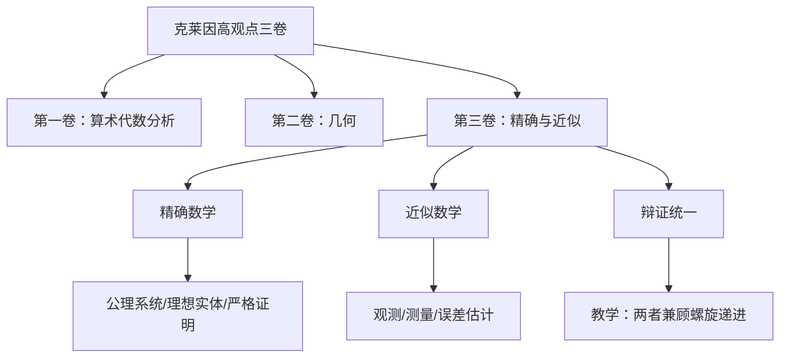

# 精确数学与近似数学的辩证：克莱因第三卷的高观点

**创建日期**: 2026年1月31日
**研究领域**: 克莱因数学理念 - 高观点下的初等数学 - 精确与近似的高等观点
**主题编号**: K.02.05.01 (Klein.高观点下的初等数学.精确与近似的高等观点.精确数学与近似数学的辩证)
**优先级**: P0（最高优先级）⭐⭐⭐⭐⭐

> **权威来源对齐**：克莱因《高观点下的初等数学》第三卷（1908–1916）题为 **Precision Mathematics and Approximation Mathematics**（精确数学与近似数学）。Springer 2016 英文版 Volume III 为首次完整英译；本工程对标该卷核心主题及 Wikipedia、Critique/01 哲科批判。

---

## 📑 目录

- [一、概述与权威对标](#一概述与权威对标)
- [二、概念定义与属性关系](#二概念定义与属性关系)
- [三、多维概念矩阵对比分析](#三多维概念矩阵对比分析)
- [四、公理-定理逻辑推理树图](#四公理定理逻辑推理树图)
- [五、决策多维分析论证树图](#五决策多维分析论证树图)
- [六、典型案例：魏尔斯特拉斯函数](#六典型案例魏尔斯特拉斯函数)
- [七、反例与批判性分析](#七反例与批判性分析)
- [八、哲科批判性分析与论证](#八哲科批判性分析与论证)
- [九、整体理念分析论证](#九整体理念分析论证)
- [十、教育应用与教学启示](#十教育应用与教学启示)

---

## 一、概述与权威对标

### 1.1 Klein 第三卷核心主题

**权威来源**（Springer 2016 英译本 Volume III）：
> Volume III of Felix Klein's *Elementarmathematik vom höheren Standpunkte aus* explores the **relationship between exact and approximate mathematics**. Klein examines how idealised mathematical concepts relate to practical approximations across various fields, including **functions in one and two variables, practical geometry, space curves, and surfaces**. The work contrasts **logical procedures** with how concepts arise from **observations**, contrasting theoretical abstract mathematics with properties that can be **grasped intuitively**.

**核心命题**：
> 精确数学是近似数学的**理想极限**；近似数学是精确数学的**经验基础**。二者辩证统一，不可偏废。

### 1.2 Wikipedia 与权威对标

| 权威来源 | 对齐内容 | 本工程对应 |
|----------|----------|-----------|
| Klein Vol. III (1908–1916) | Precision vs Approximation | 本节概述 |
| Springer 2016 英译本 | 首次完整英译说明 | 权威引用 |
| Wikipedia: Weierstrass function | 处处连续无处可微 | 第六节 |
| Critique/01 第三卷批判 | 哲科批判性分析 | 第八节 |

---

## 二、概念定义与属性关系

### 2.1 精确数学（Precision Mathematics）

**定义**：
> 以公理系统为基础、以严格逻辑推演为方法的数学分支；研究对象为**理想实体**（点无大小、线无粗细），证明为**严格逻辑链条**。

**属性**：
- **存在性**：理想实体，非物理可测
- **连续性**：柯西 ε-δ 定义、戴德金完备性
- **函数**：允许"病态"函数（如魏尔斯特拉斯函数）
- **证明**：演绎推理、无懈可击

### 2.2 近似数学（Approximation Mathematics）

**定义**：
> 以观测、测量、误差估计为基础的数学分支；研究对象为**感知实体**（墨迹斑点、测量值），方法为**直观说服 + 误差分析**。

**属性**：
- **存在性**：物理可测、可操作
- **连续性**：经验曲线的"连通"直觉
- **函数**：可用手画出的"合理"函数
- **证明**：直观说服、误差估计

### 2.3 属性-关系三元组

| 类型 | 精确数学 | 近似数学 | 辩证关系 |
|------|----------|----------|----------|
| **定义** | 公理系统、逻辑推演 | 观测、测量、误差估计 | 精确是近似的理想化 |
| **属性** | 理想实体、严格证明 | 感知实体、直观说服 | 近似是精确的经验基础 |
| **关系** | 逻辑必然性 | 经验或然性 | 克莱因：两者不可偏废 |

---

## 三、多维概念矩阵对比分析

### 3.1 本体论对比矩阵

| 维度 | 精确数学（Pure） | 近似数学（Applied） | 辩证关系 |
|------|------------------|---------------------|----------|
| **存在性** | 理想实体（点无大小） | 感知实体（墨迹斑点） | 近似是精确的感知基础 |
| **连续性** | 柯西 ε-δ 定义 | 经验曲线的"连通"直觉 | 精确是近似的逻辑提炼 |
| **函数** | 处处不可微的魏尔斯特拉斯函数 | 可用手画出的"合理"函数 | 精确揭示直觉的边界 |
| **证明** | 严格逻辑链条 | 直观说服 + 误差估计 | 克莱因：两者不可偏废 |
| **教学目标** | 逻辑严密性 | 几何直观与实用 | 中学应兼顾 |

### 3.2 方法论对比矩阵

| 方法层面 | 精确数学 | 近似数学 | 教学启示 |
|----------|----------|----------|----------|
| **概念引入** | 公理化定义 | 经验归纳 | 螺旋式：先近似后精确 |
| **问题求解** | 演绎推理 | 试错 + 估计 | 兼顾两种思维 |
| **验证方式** | 逻辑证明 | 数值/图形验证 | 多元表征 |

---

## 四、公理-定理逻辑推理树图

```
克莱因第三卷核心论证结构

公理层：数学的双重本性
├── 公理1：数学兼具逻辑性与经验性
├── 公理2：理想化是经验的抽象极限
└── 公理3：教学需兼顾两种思维方式

定理层：精确-近似的辩证关系
├── 定理1：精确数学是近似数学的理想极限
│   └── 论证：ε-δ 定义是"笔不抬起"的严格化
├── 定理2：近似数学是精确数学的经验基础
│   └── 论证：测量、估计催生严格定义
└── 定理3：偏废任一方导致认知缺陷
    ├── 仅精确：脱离直观，难以应用
    └── 仅近似：缺乏严格性，易生谬误

推论层：教学应用
├── 推论1：中学应引入"合理函数"与"病态反例"的对比
├── 推论2：连续性概念需经历"直观→严格"的螺旋
└── 推论3：误差分析是连接精确与近似的桥梁
```

---

## 五、决策多维分析论证树图

### 5.1 何时强调精确、何时强调近似？

```
问题：如何讲授某数学概念？
    │
    ├─ 学生年级？ → 初中 → 偏重近似（直观、测量、估计）
    │                  │
    │                  └─ 高中 → 引入精确（ε-δ、严格定义）
    │
    ├─ 概念类型？ → 连续性 → 先直观（笔不抬起），再严格（ε-δ）
    │                  │
    │                  └─ 可微性 → 引入魏尔斯特拉斯反例（精确打破直觉）
    │
    ├─ 教学目标？ → 应用导向 → 偏重近似（误差、数值）
    │                  │
    │                  └─ 理论导向 → 偏重精确（证明、公理）
    │
    └─ 克莱因建议：两者兼顾，螺旋递进
```

### 5.2 几何问题中的精确-近似决策树

```
问题：处理几何度量
    │
    ├─ 需要严格证明？ → 是 → 用精确数学（公理、定理）
    │
    ├─ 需要实际测量？ → 是 → 用近似数学（误差估计、有效数字）
    │
    └─ 需要概念理解？ → 用双重说明：直观图示 + 严格定义
```

---

## 六、典型案例：魏尔斯特拉斯函数

### 6.1 精确定义

**魏尔斯特拉斯函数**（Weierstrass function）：
$$W(x) = \sum_{n=0}^{\infty} a^n \cos(b^n \pi x), \quad 0 < a < 1, \quad ab > 1 + \frac{3\pi}{2}$$

**关键性质**：
- **处处连续**：$|a^n \cos(\cdot)| \leq a^n$，$\sum a^n$ 收敛 → 一致收敛
- **无处可微**：高频项 $b^n \pi x$ 在任意微小区间内放大振荡

### 6.2 近似可视化（思维实验）

| 项数 N | 近似曲线 | 观察 |
|--------|----------|------|
| N=0 | $\cos(\pi x)$ | 光滑曲线 |
| N=1 | $+ a\cos(b\pi x)$ | 出现小锯齿 |
| N=2 | $+ a^2\cos(b^2\pi x)$ | 锯齿更密 |
| N→∞ | 极限 | 任意放大后仍充满"尖刺" |

### 6.3 教学启示

**学生直觉**："连续就应该可微"
**魏尔斯特拉斯**：精确数学打破直觉
**克莱因建议**：必须用**图像 + 计算 + 逻辑**三重说明

---

## 七、反例与批判性分析

### 7.1 精确数学中的反例

| 直觉命题 | 反例 | 精确数学结论 |
|----------|------|--------------|
| 连续⇒可微 | 魏尔斯特拉斯函数 | 连续≠可微 |
| 可积⇒连续 | 狄利克雷函数（有理点1无理点0）在勒贝格意义下可积 | 可积≠连续 |
| 逐点收敛⇒一致收敛 | $f_n(x)=x^n$ 于 [0,1) | 逐点收敛于0，但非一致 |

### 7.2 近似数学中的反例

| 直觉命题 | 反例 | 近似数学结论 |
|----------|------|--------------|
| 测量值=真值 | 任何物理测量均有误差 | 需误差分析 |
| 经验曲线=可微 | 手绘曲线在放大后呈锯齿 | 近似与精确有鸿沟 |

---

## 八、哲科批判性分析与论证

> **来源**：Critique/01 第四部分「第三卷批判：精确-近似二分的认识论暴力」

### 8.1 "精确数学"的意识形态功能

| 话语策略 | 功能 | 批判性解读 |
|----------|------|------------|
| **"框架"隐喻** | 精确数学为近似提供"基础" | 暗示**等级制**，近似数学次要 |
| **"坚实"修辞** | 精确数学是"坚实框架" | 价值负载，暗示近似数学"松散" |
| **"纯 vs 用"二分** | 纯数学高贵，应用数学实用 | 复制柏拉图主义偏见 |

**福柯式批判**：克莱因的划分是**学科规训**的产物——19世纪德国大学纯数学与应用数学的建制分化。

### 8.2 连续性的三重困境

**克莱因的纠缠**：直觉连续（笔不抬起） vs 点集连续（完备） vs 函数连续（ε-δ）

**逻辑裂隙**：
- 直觉连续 ≠ 函数连续（魏尔斯特拉斯函数可画吗？）
- 函数连续（ε-δ）与直觉的**语义鸿沟**（ε 是逻辑符号，非感知对象）

### 8.3 "合理函数"的认知排他性

**克莱因定义**：有尽多个间断点/极值点的函数为"合理函数"

**批判**：
- 测度论：**几乎所有**连续函数无处可微
- 教学伦理：用"合理/病态"命名制造**焦虑**与**排斥**
- 建设性建议：采用**价值中立**术语（如"初等可处理函数"）

### 8.4 批判性综合与辩证立场

**建设性继承**：
- 保留克莱因「精确-近似辩证」的洞见
- 修正「合理/病态」的价值负载命名
- 在教学中显式讨论**哲科批判**，培养学生的元认知

---

## 九、整体理念分析论证

### 9.1 克莱因第三卷在整体架构中的位置



### 9.2 分层次递进论证次序

**第一层（直观）**：近似数学——测量、误差、手绘曲线、经验连续
**第二层（过渡）**：精确数学的直观起源——为何需要严格定义
**第三层（严格）**：精确数学——ε-δ、完备性、魏尔斯特拉斯反例
**第四层（反思）**：哲科批判——精确-近似二分的认识论局限

---

## 十、教育应用与教学启示

### 10.1 教学设计原则

1. **螺旋式引入**：先近似（直观、测量），再精确（定义、证明）
2. **反例适时介入**：在引入可微性时，适时介绍魏尔斯特拉斯函数
3. **多元表征**：图像 + 数值 + 符号 + 逻辑，四重说明
4. **价值中立**：避免"合理/病态"等负载术语

### 10.2 与本工程其他模块的对应

| 教学主题 | 03-数学教育改革 | 04-分析的高等观点 |
|----------|-----------------|-------------------|
| 连续性 | 课程设计 3.3 分析课程 | 02-连续性的拓扑理解 |
| 可微性 | 教学案例 | 03-微积分基本定理 |
| 误差分析 | 教学效果评估 | — |

---

## 📚 权威引用

- **Klein, F. (1908–1916)**. *Elementarmathematik vom höheren Standpunkte aus*, Band III. Leipzig.
- **Klein, F. (2016)**. *Elementary Mathematics from an Advanced Standpoint: Volume III: Precision Mathematics and Approximation Mathematics*. Springer. (First complete English translation.)
- **Wikipedia**: [Weierstrass function](https://en.wikipedia.org/wiki/Weierstrass_function)
- **Critique/01**: 第三卷批判：精确-近似二分的认识论暴力
- **Critique/00**: 概念5：精确数学 vs 近似数学

---

**文档状态**: ✅ 新增完成
**权威对齐**: Wikipedia、Springer 英译本、Critique/01
**哲科批判**: 已整合 Critique/01 第三卷批判
