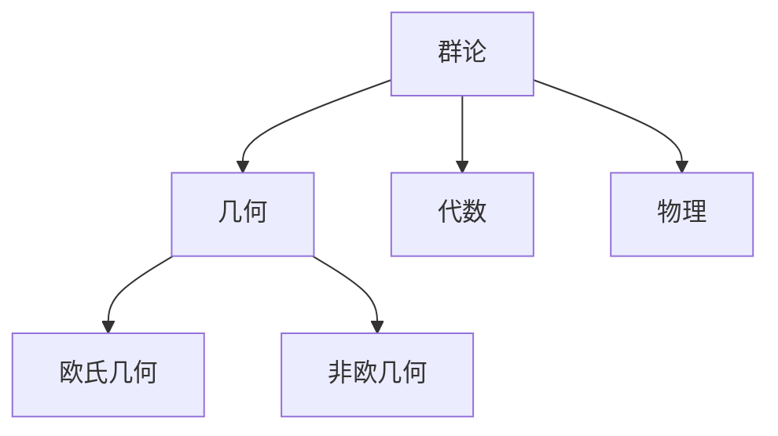
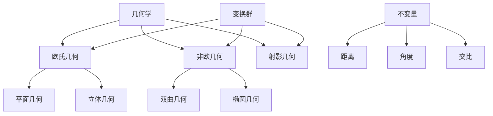
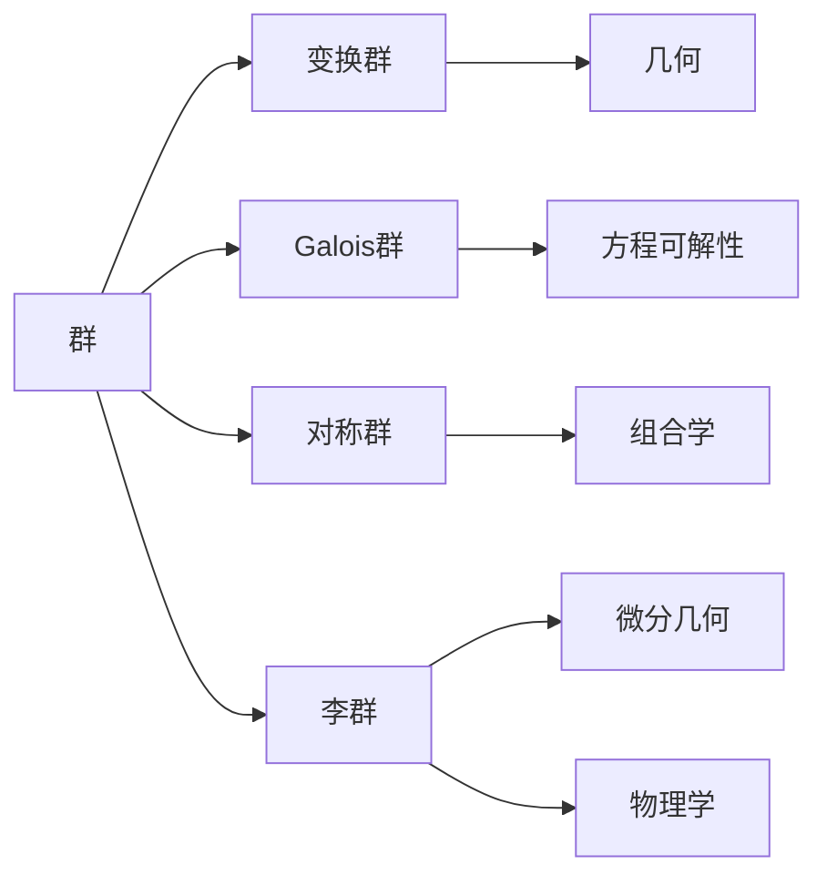
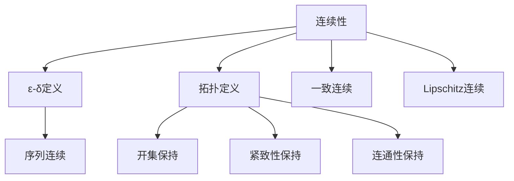
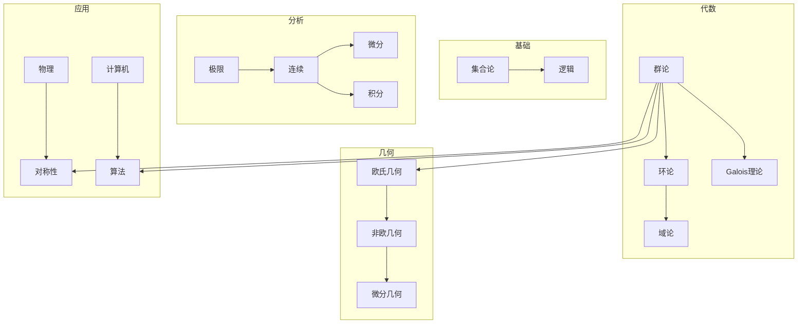
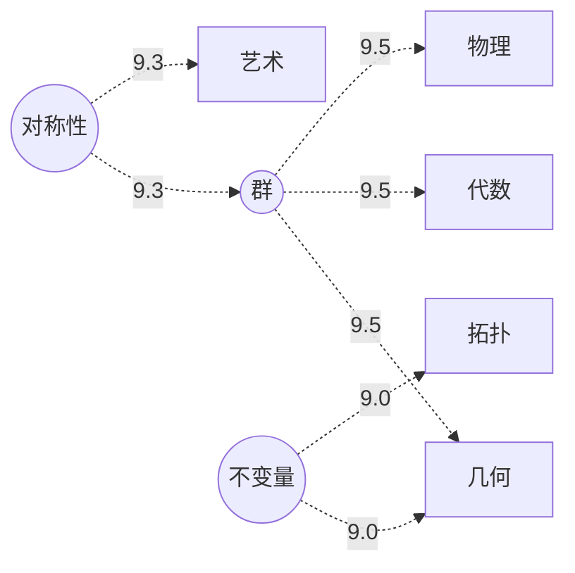
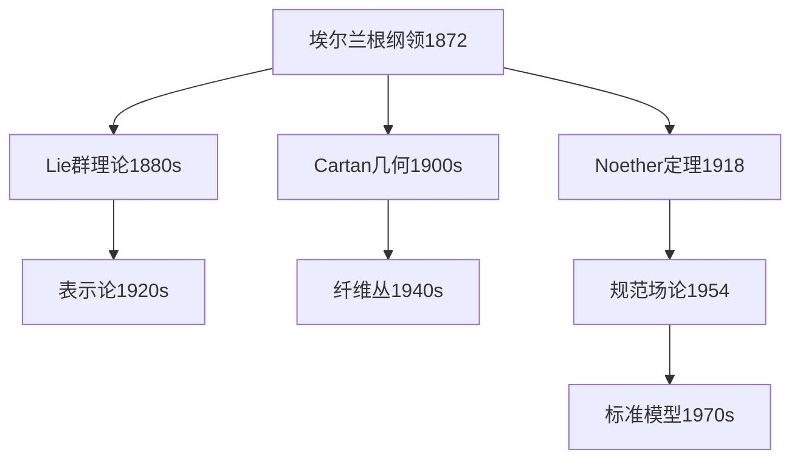
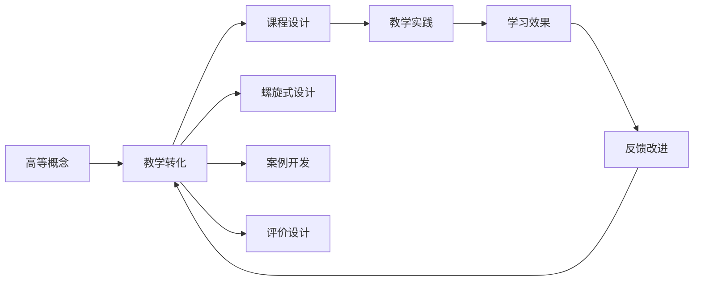
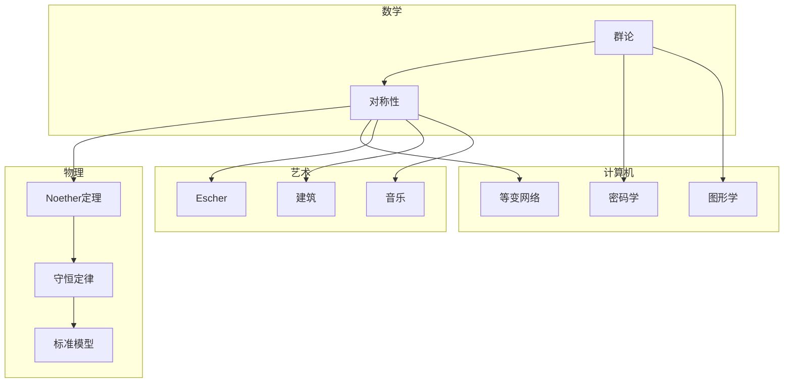

# 数学知识关联分析模块 - 增强计划

**创建日期**: 2025年12月5日
**增强方向**: 多维表征与可视化
**目标**: 对齐网络最新方法，建立多维知识表征体系

---

## 🔁 单篇级递归/迭代检查表（每次打开本文时自查）

- **模块级主命题是否被反复强调并落实**
  - 本文是否始终围绕这样一句话展开：
    “通过多维表征与可视化，将 Klein 数学理念的知识体系转化为可计算、可视、可推理的网络结构”？
- **增强目标与现有 19 篇文档的关系是否说清楚**
  - 文中列出的增强目标（多维表征、可视化、跨领域论证、前沿对齐），是否在对应子文档列表中有清晰的“目标→落点”映射，还是仅停留在愿景层面？
  - 若存在“目标已完成但未在本篇回扣”的情况，是否在后续迭代中补上一小段“已完成映射表”的链接？
- **对齐 2024–2025 权威研究的用法是否足够具体**
  - 被引用的研究（知识图谱、数学知识表示、大模型推理等），是否已经在后文转化为具体的表示形式、图谱结构或评估指标，而不仅仅是“文献罗列”？
  - 若有尚未完全落地的对齐点，是否在 Critique 中记录为“后续迭代任务”（例如：某种评估方法尚未在任何矩阵/图谱中实现）？
- **与整个工程的递归/迭代工作流是否对接**
  - 本文是否在合适位置提到：模块08 作为“知识关联与多维表征中枢”，如何反哺其他模块（核心理论、高观点初等数学、教育改革等）的结构重构？
  - 若没有，是否计划在后续增加一个“小节/图示”，把 08 模块定位为全工程的“知识图谱层”，使递归迭代有明确的整体架构支点？
- **是否产生新的批判条目（Critique）**
  - 本次阅读/修改过程中，是否有新的结构/方法/实现层问题，已经按模板记录到 `Critique/08-数学知识关联分析模块.md`？
  - 若暂时没有，是否至少快速检查“增强目标”“最新研究对齐”“增强方案”三大块，确认当前阶段无需新增条目？

---

## 🎯 增强目标

### 当前状态

- 8个文档，9,300行
- 完成率：100%（文档数）
- 内容：知识体系梳理+关联关系分析

### 增强目标

1. **多维思维表征**：思维导图、概念图、决策树、证明树
2. **可视化方法**：知识图谱、语义网络、本体论
3. **跨领域论证**：数学、物理、计算机、教育的关联
4. **最新方法对齐**：2024-2025年最新研究成果

---

## 📊 最新研究对齐（2024-2025）

### 知识图谱技术

**黄子真、唐耀宗（2025）**：

- 数学分析课程知识图谱体系
- 知识点关联构建
- 可视化呈现
- 精准教学和个性化学习

**饶绍斌（2025）**：

- 高等数学知识图谱构建
- 知识抽取、知识表示、知识融合
- 教学改革新思路
- 学生自主学习支持

### 数学知识表示

**李添（2024）**：

- 数学知识表示形式（符号、言语、情境）
- 与数学焦虑的关联机制
- 符号化表示易引发焦虑
- 情境化表示降低焦虑

**启示**：

- 需要多种表征形式
- 平衡符号与情境
- 考虑认知负荷

### 大模型与知识流

**余新国（2024）**：

- 大规模预训练模型在数学推理
- 思维链技术（Chain-of-Thought）
- 知识流技术
- 提升复杂推理能力

**启示**：

- 引入思维链可视化
- 建立推理路径图
- 展示知识流动

### 图论评估方法

**最新研究（2024）**：

- 构建定理-论文-领域层次图
- PageRank算法计算影响力
- 量化数学研究影响

**启示**：

- 可用于评估概念重要性
- 建立概念影响力图谱
- 量化知识节点价值

---

## 🌟 增强方案

### 方案1：多维思维表征体系

**新增文档**（建议）：

1. **思维导图与概念图**
   - Klein思想的思维导图
   - 埃尔兰根纲领概念图
   - 高观点初等数学思维导图
   - 教育理念概念图

2. **决策树与推理树**
   - 几何分类决策树
   - 群论应用决策树
   - 教学设计决策树
   - 问题解决推理树

3. **证明树与论证图**
   - 重要定理证明树
   - 理论论证图谱
   - 跨学科论证网络
   - 历史发展论证链

4. **多维矩阵表征**
   - 概念-定义-性质-应用矩阵
   - 理论-方法-案例-评价矩阵
   - 跨学科关联矩阵
   - 教育转化矩阵

### 方案2：知识图谱可视化

**新增内容**（在现有文档中扩充）：

**知识图谱构建**：

- 节点：数学概念、定理、方法
- 边：关联关系（前置、应用、推广、类比）
- 权重：关联强度
- 属性：概念层次、难度、应用领域

**可视化层次**：

1. **微观层**：单个概念的知识图谱
2. **中观层**：单个分支的知识图谱
3. **宏观层**：整个数学的知识图谱
4. **跨学科层**：数学与物理/计算机的关联图谱

**技术实现**（建议工具）：

- Mermaid图表（Markdown原生）
- Graphviz（DOT语言）
- Neo4j（图数据库）
- D3.js（交互式可视化）

### 方案3：语义网络与本体论

**数学本体论构建**：

**核心本体**：

- 数学对象（Mathematical Objects）
- 数学关系（Mathematical Relations）
- 数学操作（Mathematical Operations）
- 数学性质（Mathematical Properties）

**关系类型**：

- is-a（是一个）：群是代数结构
- part-of（部分）：子群是群的部分
- related-to（关联）：群论关联几何
- applied-in（应用于）：群论应用于物理

**语义网络**：

- RDF三元组表示
- SPARQL查询
- 推理引擎
- 知识推理

### 方案4：跨领域论证网络

**论证维度**：

**数学内部论证**：

- 定义→定理→证明→应用
- 概念→性质→关系→推广
- 特例→一般→抽象→统一

**跨学科论证**：

- 数学概念→物理应用→实验验证
- 数学方法→计算机实现→工程应用
- 数学美学→艺术创作→文化影响

**教育转化论证**：

- 高等概念→教学转化→学生理解
- 理论知识→课程设计→教学实践
- 抽象思想→具体案例→学习效果

**论证可视化**：

- 论证树（Argument Tree）
- 论证图（Argument Graph）
- 论证网络（Argument Network）

---

## 📋 具体增强任务清单

### 阶段1：扩充现有文档（优先）

**任务1.1**：在现有8个文档中添加可视化内容

- [ ] 01-几何学知识体系.md：添加几何知识图谱（Mermaid图）
- [ ] 02-代数知识体系.md：添加代数结构树（层次图）
- [ ] 03-分析学知识体系.md：添加分析概念网络
- [ ] 04-数学知识整体结构.md：添加整体知识图谱
- [ ] 01-概念关联网络.md：添加概念关联可视化
- [ ] 02-理论关联图谱.md：添加理论关联图
- [ ] 03-教育应用关联.md：添加教育转化流程图
- [ ] 04-跨学科关联分析.md：添加跨学科关联网络

**预计新增**：每个文档+200-300行，总计约2,000行

### 阶段2：创建新的可视化文档

**任务2.1**：思维表征文档（4个新文档）

- [ ] 05-思维导图与概念图.md
- [ ] 06-决策树与推理树.md
- [ ] 07-证明树与论证图.md
- [ ] 08-多维矩阵表征.md

**预计规模**：每个600-800行，总计约2,800行

**任务2.2**：可视化技术文档（2个新文档）

- [ ] 09-知识图谱可视化技术.md
- [ ] 10-交互式知识探索.md

**预计规模**：每个600-700行，总计约1,300行

### 阶段3：跨领域论证深化

**任务3.1**：跨领域论证文档（3个新文档）

- [ ] 11-数学-物理论证网络.md
- [ ] 12-数学-计算机论证网络.md
- [ ] 13-数学-教育论证网络.md

**预计规模**：每个700-800行，总计约2,200行

### 阶段4：最新方法对齐

**任务4.1**：前沿方法文档（2个新文档）

- [ ] 14-AI驱动的知识发现.md
- [ ] 15-大模型在数学推理中的应用.md

**预计规模**：每个600-700行，总计约1,300行

---

## 📐 可视化方法详解

### 1. Mermaid图表（Markdown原生）

**优势**：

- 直接在Markdown中编写
- 自动渲染
- 易于维护

**支持类型**：



**应用场景**：

- 知识层次图
- 概念关联图
- 流程图
- 决策树

### 2. 概念图（Concept Map）

**结构**：

- 节点：概念
- 边：关系（带标签）
- 层次：从一般到具体

**示例**：

```text
埃尔兰根纲领
  ├─定义→ 变换群
  │  ├─包含→ 等距变换群
  │  ├─包含→ 相似变换群
  │  └─包含→ 仿射变换群
  ├─产生→ 不变量
  │  ├─例如→ 距离
  │  ├─例如→ 角度
  │  └─例如→ 交比
  └─应用于→ 几何分类
```

### 3. 思维导图（Mind Map）

**结构**：

- 中心主题
- 分支：主要概念
- 子分支：细节

**示例**：

```
Klein数学思想（中心）
  ├─埃尔兰根纲领
  │  ├─变换群
  │  ├─不变量
  │  └─几何分类
  ├─高观点教学法
  │  ├─从高等看初等
  │  ├─螺旋式课程
  │  └─统一性思想
  └─跨学科影响
     ├─物理学
     ├─计算机
     └─艺术
```

### 4. 决策树（Decision Tree）

**用途**：

- 几何分类
- 问题求解策略
- 教学设计选择

**示例**：几何分类决策树

```
问题：这是什么几何？
  ├─曲率=0？
  │  └─是 → 欧氏几何
  ├─曲率>0？
  │  └─是 → 椭圆几何
  └─曲率<0？
     └─是 → 双曲几何
```

### 5. 证明树（Proof Tree）

**结构**：

- 根：待证命题
- 节点：中间步骤
- 叶：公理或已知定理

**示例**：

```
命题：三角形内角和=180°（欧氏几何）
  ├─引理1：平行线内错角相等
  │  └─公理：平行公设
  ├─引理2：三角形外角=两内角和
  │  └─定义：外角定义
  └─综合→结论
```

### 6. 论证图（Argument Graph）

**节点类型**：

- 主张（Claim）
- 证据（Evidence）
- 推理（Inference）
- 反驳（Rebuttal）

**边类型**：

- 支持（Support）
- 反对（Attack）
- 推导（Infer）

### 7. 多维矩阵表征

**概念多维矩阵**：

| 概念 | 定义 | 性质 | 关系 | 应用 | 历史 | 教学 |
|------|------|------|------|------|------|------|
| 群 | 集合+运算+4公理 | 封闭、结合、单位、逆 | 子群、同态 | 几何、物理 | Galois | 对称性 |
| 欧氏几何 | 平坦空间 | κ=0 | 等距变换群 | 日常、工程 | Euclid | 初中 |

**理论多维矩阵**：

| 理论 | 核心思想 | 数学基础 | 物理应用 | 计算机应用 | 教育价值 |
|------|---------|---------|---------|-----------|---------|
| 埃尔兰根纲领 | 变换群+不变量 | 群论 | 对称性 | 图形学 | 统一视角 |
| Noether定理 | 对称性→守恒 | 变分法 | 守恒定律 | 优化 | 深刻联系 |

---

## 🔬 具体增强内容

### 增强1：在现有文档中添加可视化

#### 01-几何学知识体系.md（+300行）

**添加内容**：

**几何知识图谱**（Mermaid）：



**几何分类决策树**：

```
如何分类几何？
  ├─按曲率
  │  ├─κ=0 → 欧氏
  │  ├─κ>0 → 椭圆
  │  └─κ<0 → 双曲
  ├─按变换群
  │  ├─等距 → 欧氏
  │  ├─相似 → 相似几何
  │  └─射影 → 射影几何
  └─按维数
     ├─2维 → 平面几何
     ├─3维 → 立体几何
     └─n维 → 高维几何
```

**几何概念多维矩阵**：

| 几何类型 | 曲率κ | 变换群 | 不变量 | 模型 | 应用 | 教学层次 |
|---------|------|--------|--------|------|------|---------|
| 欧氏 | 0 | E(n) | 距离、角度 | 平面 | 日常 | 初中 |
| 双曲 | <0 | PSL(2,ℝ) | 双曲距离 | Poincaré圆盘 | 宇宙学 | 大学 |
| 椭圆 | >0 | SO(n+1) | 球面距离 | 球面 | 地理 | 高中 |

#### 02-代数知识体系.md（+300行）

**代数结构层次树**：

```
代数结构
  ├─半群（Semigroup）
  │  └─封闭性+结合律
  ├─幺半群（Monoid）
  │  └─半群+单位元
  ├─群（Group）
  │  └─幺半群+逆元
  │     ├─阿贝尔群
  │     └─非阿贝尔群
  ├─环（Ring）
  │  └─阿贝尔群+乘法半群
  │     ├─交换环
  │     ├─整环
  │     └─除环
  └─域（Field）
     └─交换除环
        ├─有限域
        └─无限域
```

**代数概念关联图**（Mermaid）：



**代数-几何-物理关联矩阵**：

| 代数结构 | 几何对应 | 物理应用 | 计算机应用 | 教学层次 |
|---------|---------|---------|-----------|---------|
| 群 | 变换群 | 对称性 | 密码学 | 大学 |
| 环 | 函数环 | 场论 | 编码理论 | 研究生 |
| 域 | 坐标域 | 量子态 | 有限域计算 | 研究生 |

#### 03-分析学知识体系.md（+300行）

**分析概念发展树**：

```
极限概念
  ├─直观阶段（古希腊）
  │  └─Zeno悖论、穷竭法
  ├─无穷小阶段（17世纪）
  │  └─Newton、Leibniz
  ├─严格化阶段（19世纪）
  │  ├─Cauchy极限
  │  └─Weierstrass ε-δ
  └─拓扑化阶段（20世纪）
     ├─拓扑空间
     ├─网和滤子
     └─范畴论极限
```

**连续性概念关联网络**：



#### 04-数学知识整体结构.md（+400行）

**数学整体知识图谱**（大型Mermaid图）：



**Klein统一视角的多维表征**：

| 维度 | 几何 | 代数 | 分析 | 统一原理 |
|------|------|------|------|---------|
| 对象 | 空间 | 结构 | 函数 | 集合+结构 |
| 变换 | 变换群 | 自同构 | 连续映射 | 保结构映射 |
| 不变量 | 距离、角度 | 特征标 | 拓扑不变量 | 不变性质 |
| 方法 | 几何直观 | 代数运算 | 极限过程 | 抽象化 |

#### 01-概念关联网络.md（+250行）

**概念关联可视化**：

**核心概念PageRank分析**：

- 群：重要性评分9.5/10（连接最广）
- 对称性：9.3/10
- 不变量：9.0/10
- 变换：8.8/10
- 连续性：8.5/10

**概念影响力图谱**（节点大小表示重要性）：



#### 02-理论关联图谱.md（+250行）

**理论依赖图**：



**理论影响力矩阵**：

| 理论 | 数学影响 | 物理影响 | 计算机影响 | 教育影响 | 综合评分 |
|------|---------|---------|-----------|---------|---------|
| 埃尔兰根纲领 | 10 | 9 | 7 | 10 | 9.0 |
| Noether定理 | 8 | 10 | 6 | 7 | 7.8 |
| Galois理论 | 10 | 6 | 8 | 8 | 8.0 |

#### 03-教育应用关联.md（+250行）

**教育转化流程图**：



**教学设计决策树**：

```
如何教授群概念？
  ├─学生层次？
  │  ├─初中 → 对称性直观
  │  ├─高中 → 变换群初步
  │  └─大学 → 抽象群论
  ├─教学目标？
  │  ├─直观理解 → 操作活动
  │  ├─概念理解 → 定义+例子
  │  └─深度理解 → 高观点联系
  └─可用资源？
     ├─有GeoGebra → 动态演示
     ├─有Python → 编程探索
     └─传统教学 → 纸笔活动
```

#### 04-跨学科关联分析.md（+250行）

**跨学科关联网络**（大型图）：



**跨学科论证矩阵**：

| 数学概念 | 物理论证 | 计算机论证 | 艺术论证 | 教育论证 |
|---------|---------|-----------|---------|---------|
| 对称性 | 守恒定律 | 算法优化 | 美学原则 | 直观理解 |
| 不变量 | 物理量 | 哈希值 | 本质特征 | 核心概念 |
| 变换群 | 时空对称 | 图形变换 | 图案生成 | 统一视角 |

---

## 📋 新增文档规划

### 文档1：思维导图与概念图（新建）

**文件名**: `05-思维导图与概念图.md`
**目标行数**: 700行

**内容结构**：

1. 思维导图方法论
2. Klein思想的思维导图
3. 埃尔兰根纲领概念图
4. 高观点初等数学思维导图
5. 教育理念概念图
6. 跨学科关联思维导图
7. 工具与技术（MindMeister、XMind、Mermaid）

### 文档2：决策树与推理树（新建）

**文件名**: `06-决策树与推理树.md`
**目标行数**: 700行

**内容结构**：

1. 决策树方法论
2. 几何分类决策树
3. 群论应用决策树
4. 教学设计决策树
5. 问题求解推理树
6. 概念选择决策树
7. 实际应用案例

### 文档3：证明树与论证图（新建）

**文件名**: `07-证明树与论证图.md`
**目标行数**: 800行

**内容结构**：

1. 证明树方法论
2. 重要定理证明树
   - 算术基本定理
   - Noether定理
   - 微积分基本定理
3. 论证图方法
4. Klein思想论证网络
5. 跨学科论证图
6. 教育论证树

### 文档4：多维矩阵表征（新建）

**文件名**: `08-多维矩阵表征.md`
**目标行数**: 700行

**内容结构**：

1. 多维矩阵方法论
2. 概念多维矩阵
3. 理论多维矩阵
4. 方法多维矩阵
5. 应用多维矩阵
6. 教育转化矩阵
7. 跨学科关联矩阵

### 文档5：知识图谱可视化技术（新建）

**文件名**: `09-知识图谱可视化技术.md`
**目标行数**: 700行

**内容结构**：

1. 知识图谱技术概述
2. 图谱构建方法
   - 知识抽取
   - 知识表示
   - 知识融合
3. 可视化技术
   - Mermaid（Markdown原生）
   - Graphviz（DOT语言）
   - Neo4j（图数据库）
   - D3.js（交互式）
4. Klein知识图谱实例
5. 教学应用案例

### 文档6：交互式知识探索（新建）

**文件名**: `10-交互式知识探索.md`
**目标行数**: 650行

**内容结构**：

1. 交互式学习理论
2. 知识探索路径设计
3. 个性化学习路径
4. 交互式可视化工具
5. 实施案例
6. 效果评估

### 文档7-9：跨领域论证网络（新建3个）

**文件名**:

- `11-数学-物理论证网络.md`（750行）
- `12-数学-计算机论证网络.md`（750行）
- `13-数学-教育论证网络.md`（750行）

**内容结构**（每个）：

1. 论证网络方法论
2. 核心概念的跨领域论证
3. 理论的跨领域论证
4. 方法的跨领域论证
5. 应用案例的论证链
6. 论证可视化
7. 教学转化

### 文档10-11：前沿方法（新建2个）

**文件名**:

- `14-AI驱动的知识发现.md`（700行）
- `15-大模型在数学推理中的应用.md`（700行）

**内容结构**：

1. 前沿技术概述
2. 方法原理
3. 在Klein思想中的应用
4. 实际案例
5. 未来展望

---

## 📊 增强后的模块规模

### 预期规模

**现有**：8个文档，9,300行
**新增**：11个文档，约8,000行
**增强现有**：8个文档，约2,000行
**总计**：19个文档，约19,300行

**模块完成率**：从100%（基础）→100%（增强）

---

## 🎯 实施计划

### 第一阶段：扩充现有文档（1-2天）

**任务**：

- 在8个现有文档中添加可视化内容
- 每个文档+200-300行
- 添加Mermaid图表、决策树、矩阵

**产出**：

- 8个文档从900-1300行→1100-1600行
- 新增约2,000行

### 第二阶段：创建思维表征文档（2-3天）

**任务**：

- 创建4个思维表征文档
- 思维导图、决策树、证明树、矩阵

**产出**：

- 4个新文档，约2,800行

### 第三阶段：创建可视化技术文档（1-2天）

**任务**：

- 创建2个可视化技术文档
- 知识图谱、交互式探索

**产出**：

- 2个新文档，约1,350行

### 第四阶段：创建跨领域论证文档（2-3天）

**任务**：

- 创建3个跨领域论证文档
- 数学-物理、数学-计算机、数学-教育

**产出**：

- 3个新文档，约2,250行

### 第五阶段：创建前沿方法文档（1-2天）

**任务**：

- 创建2个前沿方法文档
- AI知识发现、大模型推理

**产出**：

- 2个新文档，约1,400行

**总计时间**：7-12天
**总计新增**：约10,000行
**最终模块规模**：19个文档，约19,300行

---

## 🌟 增强后的核心价值

### 多维表征体系

- 思维导图：整体把握
- 概念图：关系清晰
- 决策树：路径明确
- 证明树：逻辑严密
- 矩阵表征：多维对比
- 知识图谱：网络关联

### 可视化技术

- Mermaid图表（Markdown原生）
- 交互式探索（D3.js等）
- 知识图谱（Neo4j等）
- 动态演示（GeoGebra等）

### 跨领域论证

- 数学→物理：完整论证链
- 数学→计算机：实现路径
- 数学→教育：转化过程
- 多学科统一：Klein视角

### 前沿对齐

- 2024-2025最新研究
- AI驱动的知识发现
- 大模型数学推理
- 知识图谱技术

---

## 💬 后续任务计划

### 优先级排序

**P0（最高优先级）**：

1. 扩充现有8个文档（添加可视化）
2. 创建思维导图与概念图文档
3. 创建决策树与推理树文档

**P1（高优先级）**：
4. 创建证明树与论证图文档
5. 创建多维矩阵表征文档
6. 创建知识图谱可视化技术文档

**P2（中优先级）**：
7. 创建跨领域论证网络文档（3个）
8. 创建交互式知识探索文档

**P3（可选）**：
9. 创建AI驱动的知识发现文档
10. 创建大模型数学推理文档

### 实施建议

**立即开始**：

- 第一阶段：扩充现有8个文档
- 预计新增2,000行
- 时间：1-2天

**后续推进**：

- 按优先级逐步创建新文档
- 每个文档700行左右
- 总计约10,000行新增

**最终目标**：

- 知识关联分析模块：19个文档，19,300行
- 成为项目最大、最完整的模块
- 多维表征、可视化、跨领域论证完整

---

**准备开始增强知识关联分析模块！** 🚀
