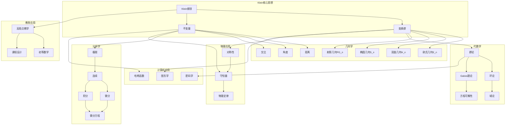
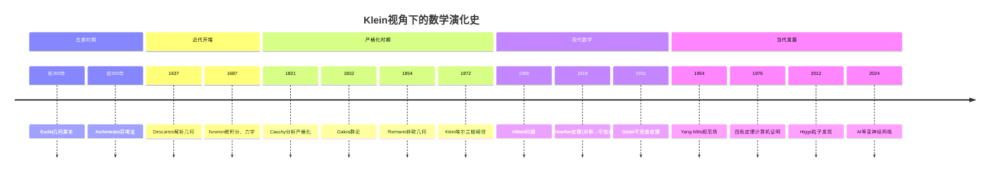

# 数学知识整体结构：克莱因的统一视角

**创建日期**: 2025年12月4日
**研究领域**: 克莱因数学理念 - 数学知识关联分析 - 知识体系梳理
**主题编号**: K.08.01.04 (Klein.数学知识关联分析.知识体系梳理.数学知识整体结构)
**优先级**: P0（最高优先级）⭐⭐⭐⭐⭐

---

## 📑 目录

- [数学知识整体结构：克莱因的统一视角](#数学知识整体结构克莱因的统一视角)
  - [📑 目录](#-目录)
  - [📋 一、概述](#-一概述)
    - [1.1 研究目标](#11-研究目标)
    - [1.2 整体结构的意义](#12-整体结构的意义)
    - [1.3 克莱因统一视角的价值](#13-克莱因统一视角的价值)
  - [🔷 二、数学知识的整体结构](#-二数学知识的整体结构)
    - [2.1 几何学](#21-几何学)
      - [结构层次](#结构层次)
      - [统一理解](#统一理解)
    - [2.2 代数学](#22-代数学)
      - [结构层次](#结构层次-1)
      - [统一理解](#统一理解-1)
    - [2.3 分析学](#23-分析学)
      - [结构层次](#结构层次-2)
      - [统一理解](#统一理解-2)
    - [2.4 其他分支](#24-其他分支)
      - [数论（Number Theory）](#数论number-theory)
      - [概率论（Probability Theory）](#概率论probability-theory)
      - [拓扑学（Topology）](#拓扑学topology)
      - [统一理解](#统一理解-3)
  - [📐 三、统一性理解](#-三统一性理解)
    - [3.1 群论统一视角](#31-群论统一视角)
      - [群论在几何中的应用](#群论在几何中的应用)
      - [群论在代数中的应用](#群论在代数中的应用)
      - [群论在分析中的应用](#群论在分析中的应用)
    - [3.2 结构统一视角](#32-结构统一视角)
      - [代数结构](#代数结构)
      - [几何结构](#几何结构)
      - [分析结构](#分析结构)
    - [3.3 方法统一视角](#33-方法统一视角)
      - [统一的研究方法](#统一的研究方法)
      - [统一的理论框架](#统一的理论框架)
      - [统一的应用方法](#统一的应用方法)
  - [🔗 四、知识关联网络](#-四知识关联网络)
    - [4.1 跨分支关联](#41-跨分支关联)
      - [几何与代数的关联](#几何与代数的关联)
      - [几何与分析的关联](#几何与分析的关联)
      - [代数与分析的关联](#代数与分析的关联)
    - [4.2 概念关联](#42-概念关联)
      - [跨分支概念关联](#跨分支概念关联)
      - [概念的统一理解](#概念的统一理解)
      - [概念的发展](#概念的发展)
    - [4.3 理论关联](#43-理论关联)
      - [跨分支理论关联](#跨分支理论关联)
      - [理论的统一理解](#理论的统一理解)
      - [理论的发展](#理论的发展)
  - [💡 五、教育应用价值](#-五教育应用价值)
    - [5.1 对教学的意义](#51-对教学的意义)
      - [系统教学](#系统教学)
      - [关联教学](#关联教学)
      - [统一教学](#统一教学)
    - [5.2 对课程设计的价值](#52-对课程设计的价值)
      - [课程结构设计](#课程结构设计)
      - [内容组织设计](#内容组织设计)
      - [关联建立设计](#关联建立设计)
    - [5.3 对学习的帮助](#53-对学习的帮助)
      - [系统学习](#系统学习)
      - [关联学习](#关联学习)
      - [统一学习](#统一学习)
  - [📚 六、文献与资源](#-六文献与资源)
    - [6.1 原始文献](#61-原始文献)
    - [6.2 现代研究文献](#62-现代研究文献)
      - [数学统一性研究](#数学统一性研究)
      - [数学教育研究](#数学教育研究)
    - [6.3 在线资源](#63-在线资源)
  - [🌍 七、国际视角与权威对标](#-七国际视角与权威对标)
    - [7.1 Wikipedia资源对标](#71-wikipedia资源对标)
    - [7.2 国际大学课程对标](#72-国际大学课程对标)
  - [🔗 八、与其他文档的关联性](#-八与其他文档的关联性)
    - [8.1 与本专题其他文档的关联](#81-与本专题其他文档的关联)
    - [8.2 与项目其他文档的关联](#82-与项目其他文档的关联)
  - [📊 九、总结与展望](#-九总结与展望)
    - [9.1 核心价值总结](#91-核心价值总结)
    - [9.2 结构特点](#92-结构特点)
    - [9.3 未来展望](#93-未来展望)
  - [🎨 十、大型知识图谱可视化](#-十大型知识图谱可视化)
    - [10.1 Klein统一视角下的数学整体结构](#101-klein统一视角下的数学整体结构)
    - [10.2 数学-物理-计算机-艺术四维关联矩阵](#102-数学-物理-计算机-艺术四维关联矩阵)
    - [10.3 数学知识演化时间线](#103-数学知识演化时间线)
    - [10.4 跨分支知识桥梁决策图](#104-跨分支知识桥梁决策图)
    - [10.5 数学统一性层次图](#105-数学统一性层次图)

---

## 📋 一、概述

### 1.1 研究目标

**研究目标**：

从克莱因统一视角理解数学知识整体结构，建立：

1. **结构梳理**：梳理数学知识整体结构
2. **关联分析**：分析跨分支知识关联
3. **统一理解**：建立统一理解框架
4. **教育应用**：提取教育应用价值

### 1.2 整体结构的意义

**整体结构（Overall Structure）** / **Gesamtstruktur**：

从克莱因统一视角理解的数学知识整体结构。

**意义**：

- **系统理解**：系统理解数学
- **关联建立**：建立跨分支关联
- **教育价值**：教育应用价值

### 1.3 克莱因统一视角的价值

**价值**：

- 统一性视角
- 群论视角
- 高观点视角

---

## 🔷 二、数学知识的整体结构

### 2.1 几何学

**几何学（Geometry）** / **Geometrie**：

从克莱因视角理解的几何学知识体系。

#### 结构层次

**基础层**：

1. **欧氏几何（Euclidean Geometry）**
   - **变换群**：等距变换群$E(n)$
   - **不变量**：距离、角度
   - **核心内容**：平面几何、立体几何
   - **克莱因视角**：由等距变换群决定

2. **仿射几何（Affine Geometry）**
   - **变换群**：仿射变换群$A(n)$
   - **不变量**：平行性、面积比
   - **核心内容**：仿射变换、仿射性质
   - **克莱因视角**：由仿射变换群决定

**提高层**：

3. **射影几何（Projective Geometry）**
   - **变换群**：射影变换群$PGL(n+1)$
   - **不变量**：交比
   - **核心内容**：射影平面、射影变换
   - **克莱因视角**：由射影变换群决定

4. **非欧几何（Non-Euclidean Geometry）**
   - **双曲几何**：双曲变换群
   - **椭圆几何**：椭圆变换群
   - **核心内容**：双曲平面、椭圆空间
   - **克莱因视角**：由对应变换群决定

**高级层**：

5. **微分几何（Differential Geometry）**
   - **变换群**：微分同胚群
   - **不变量**：曲率、挠率
   - **核心内容**：流形、黎曼几何
   - **克莱因视角**：由微分同胚群决定

6. **代数几何（Algebraic Geometry）**
   - **变换群**：代数变换群
   - **不变量**：代数不变量
   - **核心内容**：代数簇、概形
   - **克莱因视角**：由代数变换群决定

#### 统一理解

**变换群统一**：

- **所有几何**：由变换群决定
- **几何分类**：按变换群分类
- **几何性质**：由不变量描述
- **统一框架**：埃尔兰根纲领

### 2.2 代数学

**代数学（Algebra）** / **Algebra**：

从克莱因视角理解的代数学知识体系。

#### 结构层次

**基础层**：

1. **基础代数（Elementary Algebra）**
   - **内容**：方程、函数、多项式
   - **核心概念**：运算、方程求解
   - **克莱因视角**：代数结构的基础

2. **线性代数（Linear Algebra）**
   - **内容**：向量空间、线性映射
   - **核心概念**：线性变换、矩阵
   - **克莱因视角**：线性变换群

**提高层**：

3. **抽象代数（Abstract Algebra）**
   - **群论**：群、子群、商群
   - **环论**：环、理想、商环
   - **域论**：域、域扩张
   - **克莱因视角**：代数结构统一

**高级层**：

4. **现代代数（Modern Algebra）**
   - **模论**：模、同态、同构
   - **表示论**：群表示、代数表示
   - **范畴论**：范畴、函子、自然变换
   - **克莱因视角**：结构统一

#### 统一理解

**结构统一**：

- **代数结构**：群、环、域的统一
- **结构层次**：从简单到复杂的层次
- **结构关系**：包含和扩展关系
- **统一框架**：代数结构理论

### 2.3 分析学

**分析学（Analysis）** / **Analysis**：

从克莱因视角理解的分析学知识体系。

#### 结构层次

**基础层**：

1. **基础分析（Elementary Analysis）**
   - **内容**：极限、连续、导数、积分
   - **核心概念**：微积分基本概念
   - **克莱因视角**：从高观点理解

2. **实分析（Real Analysis）**
   - **内容**：实函数理论、测度论
   - **核心概念**：Lebesgue积分、函数空间
   - **克莱因视角**：拓扑理解

**提高层**：

3. **复分析（Complex Analysis）**
   - **内容**：复函数理论、解析函数
   - **核心概念**：Cauchy积分、留数理论
   - **克莱因视角**：几何理解

**高级层**：

4. **现代分析（Modern Analysis）**
   - **泛函分析**：Banach空间、Hilbert空间
   - **调和分析**：Fourier分析、小波分析
   - **克莱因视角**：几何和代数理解

#### 统一理解

**几何统一**：

- **分析几何化**：用几何理解分析
- **拓扑理解**：从拓扑理解连续性
- **统一框架**：几何和分析的统一

### 2.4 其他分支

**其他分支（Other Branches）** / **Andere Zweige**：

从克莱因视角理解的其他数学分支。

#### 数论（Number Theory）

**结构层次**：

1. **初等数论**
   - **内容**：整除、同余、素数
   - **克莱因视角**：代数结构理解

2. **代数数论**
   - **内容**：代数整数、理想理论
   - **克莱因视角**：代数结构统一

3. **解析数论**
   - **内容**：ζ函数、L函数
   - **克莱因视角**：分析方法

#### 概率论（Probability Theory）

**结构层次**：

1. **基础概率论**
   - **内容**：概率、随机变量
   - **克莱因视角**：测度论理解

2. **现代概率论**
   - **内容**：随机过程、随机分析
   - **克莱因视角**：分析理解

#### 拓扑学（Topology）

**结构层次**：

1. **点集拓扑**
   - **内容**：拓扑空间、连续映射
   - **克莱因视角**：几何理解

2. **代数拓扑**
   - **内容**：同伦论、同调论
   - **克莱因视角**：代数结构理解

#### 统一理解

**跨分支统一**：

- **结构统一**：不同分支的结构统一
- **方法统一**：统一的研究方法
- **理论统一**：统一的理论框架

---

## 📐 三、统一性理解

### 3.1 群论统一视角

**群论统一视角（Group-Theoretic Unified Perspective）** / **Gruppentheoretische Einheitssicht**：

用群论统一理解数学的各个分支。

#### 群论在几何中的应用

**变换群统一几何**：

1. **几何分类**
   - **欧氏几何**：等距变换群$E(n)$
   - **仿射几何**：仿射变换群$A(n)$
   - **射影几何**：射影变换群$PGL(n+1)$
   - **统一理解**：几何由变换群决定

2. **不变量理论**
   - **不变量**：在变换群下不变的量
   - **几何性质**：由不变量描述
   - **统一理解**：不变量统一几何性质

3. **埃尔兰根纲领**
   - **核心思想**：几何是研究在变换群下不变性质的学科
   - **统一框架**：所有几何统一在变换群框架下
   - **统一理解**：群论统一几何

#### 群论在代数中的应用

**群结构统一代数**：

1. **代数结构**
   - **群**：基本代数结构
   - **环**：群的扩展
   - **域**：环的特殊情况
   - **统一理解**：代数结构是统一的

2. **对称性**
   - **对称群**：描述对称性
   - **代数对称**：代数对象的对称性
   - **统一理解**：群论统一对称性

3. **表示论**
   - **群表示**：群在向量空间上的作用
   - **代数表示**：代数结构的表示
   - **统一理解**：表示论统一代数

#### 群论在分析中的应用

**群作用统一分析**：

1. **函数空间**
   - **变换群作用**：变换群在函数空间上的作用
   - **不变函数**：在群作用下不变的函数
   - **统一理解**：群作用统一函数空间

2. **对称性分析**
   - **对称函数**：具有对称性的函数
   - **对称性方法**：利用对称性分析函数
   - **统一理解**：群论统一对称性分析

3. **调和分析**
   - **群上的调和分析**：群上的Fourier分析
   - **表示论方法**：用表示论方法研究调和分析
   - **统一理解**：群论统一调和分析

### 3.2 结构统一视角

**结构统一视角（Structural Unified Perspective）** / **Strukturelle Einheitssicht**：

用结构统一理解数学的各个分支。

#### 代数结构

**代数结构统一**：

1. **基础结构**
   - **群**：基本代数结构
   - **环**：在群基础上增加乘法
   - **域**：在环基础上要求乘法群
   - **统一理解**：代数结构是统一的

2. **结构层次**
   - **基础层**：群、环、域
   - **提高层**：模、代数
   - **高级层**：范畴、拓扑
   - **统一理解**：结构层次统一

3. **结构关系**
   - **包含关系**：域⊃环⊃群
   - **扩展关系**：从群到环到域
   - **统一理解**：结构关系统一

#### 几何结构

**几何结构统一**：

1. **基础结构**
   - **欧氏几何**：等距变换群
   - **仿射几何**：仿射变换群
   - **射影几何**：射影变换群
   - **统一理解**：几何结构是统一的

2. **结构层次**
   - **基础层**：欧氏几何、仿射几何
   - **提高层**：射影几何、非欧几何
   - **高级层**：微分几何、代数几何
   - **统一理解**：结构层次统一

3. **结构关系**
   - **包含关系**：射影几何⊃仿射几何⊃欧氏几何
   - **扩展关系**：从欧氏到仿射到射影
   - **统一理解**：结构关系统一

#### 分析结构

**分析结构统一**：

1. **基础结构**
   - **函数空间**：函数的结构
   - **算子空间**：算子的结构
   - **统一理解**：分析结构是统一的

2. **结构层次**
   - **基础层**：函数、极限、连续
   - **提高层**：导数、积分、级数
   - **高级层**：泛函分析、调和分析
   - **统一理解**：结构层次统一

3. **结构关系**
   - **包含关系**：泛函分析⊃实分析⊃基础分析
   - **扩展关系**：从基础到实分析到泛函分析
   - **统一理解**：结构关系统一

### 3.3 方法统一视角

**方法统一视角（Methodological Unified Perspective）** / **Methodologische Einheitssicht**：

用方法统一理解数学的各个分支。

#### 统一的研究方法

**研究方法统一**：

1. **公理化方法**
   - **几何公理**：几何的公理化
   - **代数公理**：代数的公理化
   - **分析公理**：分析的公理化
   - **统一理解**：公理化方法统一

2. **结构方法**
   - **结构研究**：研究数学结构
   - **结构分类**：分类数学结构
   - **结构关系**：研究结构关系
   - **统一理解**：结构方法统一

3. **不变量方法**
   - **几何不变量**：几何的不变量
   - **代数不变量**：代数的不变量
   - **分析不变量**：分析的不变量
   - **统一理解**：不变量方法统一

#### 统一的理论框架

**理论框架统一**：

1. **群论框架**
   - **几何框架**：变换群框架
   - **代数框架**：群结构框架
   - **分析框架**：群作用框架
   - **统一理解**：群论框架统一

2. **范畴论框架**
   - **统一语言**：范畴论提供统一语言
   - **统一概念**：统一不同分支的概念
   - **统一方法**：统一不同分支的方法
   - **统一理解**：范畴论框架统一

3. **拓扑框架**
   - **几何拓扑**：几何的拓扑理解
   - **代数拓扑**：代数的拓扑理解
   - **分析拓扑**：分析的拓扑理解
   - **统一理解**：拓扑框架统一

#### 统一的应用方法

**应用方法统一**：

1. **建模方法**
   - **几何建模**：用几何建模
   - **代数建模**：用代数建模
   - **分析建模**：用分析建模
   - **统一理解**：建模方法统一

2. **计算方法**
   - **几何计算**：几何的计算方法
   - **代数计算**：代数的计算方法
   - **分析计算**：分析的计算方法
   - **统一理解**：计算方法统一

3. **优化方法**
   - **几何优化**：几何的优化方法
   - **代数优化**：代数的优化方法
   - **分析优化**：分析的优化方法
   - **统一理解**：优化方法统一

---

## 🔗 四、知识关联网络

### 4.1 跨分支关联

**跨分支关联（Cross-Branch Association）** / **Zweigübergreifende Assoziation**：

不同数学分支之间的关联关系。

#### 几何与代数的关联

**关联类型**：

1. **结构关联**
   - **代数几何**：代数和几何的结合
   - **几何代数**：几何的代数化
   - **统一理解**：几何和代数的结构统一

2. **方法关联**
   - **代数方法**：用代数方法研究几何
   - **几何方法**：用几何方法研究代数
   - **统一理解**：方法和方法的统一

3. **理论关联**
   - **Galois理论**：代数和几何的对应
   - **Langlands纲领**：数论、几何、表示的统一
   - **统一理解**：理论和理论的统一

#### 几何与分析的关联

**关联类型**：

1. **结构关联**
   - **微分几何**：分析和几何的结合
   - **几何分析**：几何的分析化
   - **统一理解**：几何和分析的结构统一

2. **方法关联**
   - **分析方法**：用分析方法研究几何
   - **几何方法**：用几何方法研究分析
   - **统一理解**：方法和方法的统一

3. **理论关联**
   - **流形理论**：几何和分析的结合
   - **Atiyah-Singer指标定理**：分析和拓扑的联系
   - **统一理解**：理论和理论的统一

#### 代数与分析的关联

**关联类型**：

1. **结构关联**
   - **算子代数**：代数和分析的结合
   - **函数代数**：函数的代数结构
   - **统一理解**：代数和分析的结构统一

2. **方法关联**
   - **代数方法**：用代数方法研究分析
   - **分析方法**：用分析方法研究代数
   - **统一理解**：方法和方法的统一

3. **理论关联**
   - **表示论**：代数和分析的结合
   - **调和分析**：群上的分析
   - **统一理解**：理论和理论的统一

### 4.2 概念关联

**概念关联（Concept Association）** / **Konzept-Assoziation**：

不同数学分支中概念之间的关联关系。

#### 跨分支概念关联

**关联类型**：

1. **同名概念**
   - **群**：在代数和几何中都有群
   - **同构**：在代数和几何中都有同构
   - **统一理解**：同名概念的统一

2. **相似概念**
   - **结构**：代数的结构和几何的结构
   - **变换**：代数的变换和几何的变换
   - **统一理解**：相似概念的统一

3. **对应概念**
   - **代数对象 ↔ 几何对象**：代数和几何的对应
   - **代数性质 ↔ 几何性质**：代数和几何的对应
   - **统一理解**：对应概念的统一

#### 概念的统一理解

**统一方法**：

1. **结构统一**
   - **统一结构**：用统一结构理解概念
   - **结构关系**：建立结构关系
   - **统一理解**：结构统一概念

2. **方法统一**
   - **统一方法**：用统一方法理解概念
   - **方法关系**：建立方法关系
   - **统一理解**：方法统一概念

3. **理论统一**
   - **统一理论**：用统一理论理解概念
   - **理论关系**：建立理论关系
   - **统一理解**：理论统一概念

#### 概念的发展

**发展路径**：

1. **从具体到抽象**
   - **具体概念**：从具体例子抽象
   - **抽象概念**：抽象到一般概念
   - **发展理解**：概念的发展

2. **从局部到整体**
   - **局部概念**：局部领域的概念
   - **整体概念**：跨领域的概念
   - **发展理解**：概念的发展

3. **从简单到复杂**
   - **简单概念**：简单结构的概念
   - **复杂概念**：复杂结构的概念
   - **发展理解**：概念的发展

### 4.3 理论关联

**理论关联（Theory Association）** / **Theorie-Assoziation**：

不同数学分支中理论之间的关联关系。

#### 跨分支理论关联

**关联类型**：

1. **基础理论关联**
   - **群论**：在代数和几何中都有群论
   - **拓扑学**：在几何和分析中都有拓扑学
   - **统一理解**：基础理论的统一

2. **应用理论关联**
   - **表示论**：代数和分析的结合
   - **同调论**：代数和拓扑的结合
   - **统一理解**：应用理论的统一

3. **统一理论关联**
   - **范畴论**：统一不同分支的理论
   - **Langlands纲领**：统一数论、几何、表示
   - **统一理解**：统一理论的统一

#### 理论的统一理解

**统一方法**：

1. **框架统一**
   - **统一框架**：用统一框架理解理论
   - **框架关系**：建立框架关系
   - **统一理解**：框架统一理论

2. **方法统一**
   - **统一方法**：用统一方法理解理论
   - **方法关系**：建立方法关系
   - **统一理解**：方法统一理论

3. **概念统一**
   - **统一概念**：用统一概念理解理论
   - **概念关系**：建立概念关系
   - **统一理解**：概念统一理论

#### 理论的发展

**发展路径**：

1. **从独立到统一**
   - **独立理论**：各分支的独立理论
   - **统一理论**：跨分支的统一理论
   - **发展理解**：理论的发展

2. **从局部到整体**
   - **局部理论**：局部领域的理论
   - **整体理论**：跨领域的理论
   - **发展理解**：理论的发展

3. **从简单到复杂**
   - **简单理论**：简单结构的理论
   - **复杂理论**：复杂结构的理论
   - **发展理解**：理论的发展

---

## 💡 五、教育应用价值

### 5.1 对教学的意义

**教学意义（Teaching Significance）** / **Lehrbedeutung**：

数学知识整体结构对教学的意义。

#### 系统教学

**核心意义**：

基于整体结构进行系统教学。

**具体应用**：

1. **结构教学**
   - **问题**：如何系统教学数学
   - **方法**：基于整体结构进行教学
   - **应用**：系统教学
   - **价值**：建立系统理解

2. **层次教学**
   - **问题**：如何层次化教学
   - **方法**：基于结构层次进行教学
   - **应用**：层次教学
   - **价值**：建立层次理解

3. **关联教学**
   - **问题**：如何建立关联教学
   - **方法**：基于知识关联进行教学
   - **应用**：关联教学
   - **价值**：建立关联理解

#### 关联教学

**核心意义**：

基于知识关联进行关联教学。

**具体应用**：

1. **跨分支关联**
   - **问题**：如何建立跨分支关联
   - **方法**：基于跨分支关联进行教学
   - **应用**：跨分支教学
   - **价值**：建立跨分支理解

2. **概念关联**
   - **问题**：如何建立概念关联
   - **方法**：基于概念关联进行教学
   - **应用**：概念关联教学
   - **价值**：建立概念关联理解

3. **理论关联**
   - **问题**：如何建立理论关联
   - **方法**：基于理论关联进行教学
   - **应用**：理论关联教学
   - **价值**：建立理论关联理解

#### 统一教学

**核心意义**：

基于统一性进行统一教学。

**具体应用**：

1. **群论统一**
   - **问题**：如何用群论统一教学
   - **方法**：基于群论统一进行教学
   - **应用**：群论统一教学
   - **价值**：建立群论统一理解

2. **结构统一**
   - **问题**：如何用结构统一教学
   - **方法**：基于结构统一进行教学
   - **应用**：结构统一教学
   - **价值**：建立结构统一理解

3. **方法统一**
   - **问题**：如何用方法统一教学
   - **方法**：基于方法统一进行教学
   - **应用**：方法统一教学
   - **价值**：建立方法统一理解

### 5.2 对课程设计的价值

**课程设计价值（Curriculum Design Value）** / **Lehrplan-Design-Wert**：

数学知识整体结构对课程设计的价值。

#### 课程结构设计

**核心价值**：

基于整体结构设计课程结构。

**具体应用**：

1. **结构设计**
   - **问题**：如何设计课程结构
   - **方法**：基于整体结构设计
   - **应用**：课程结构设计
   - **价值**：建立系统结构

2. **层次设计**
   - **问题**：如何设计课程层次
   - **方法**：基于结构层次设计
   - **应用**：课程层次设计
   - **价值**：建立层次结构

3. **关联设计**
   - **问题**：如何设计课程关联
   - **方法**：基于知识关联设计
   - **应用**：课程关联设计
   - **价值**：建立关联结构

#### 内容组织设计

**核心价值**：

基于整体结构组织课程内容。

**具体应用**：

1. **内容组织**
   - **问题**：如何组织课程内容
   - **方法**：基于整体结构组织
   - **应用**：内容组织设计
   - **价值**：建立系统组织

2. **内容层次**
   - **问题**：如何组织内容层次
   - **方法**：基于结构层次组织
   - **应用**：内容层次组织
   - **价值**：建立层次组织

3. **内容关联**
   - **问题**：如何建立内容关联
   - **方法**：基于知识关联建立
   - **应用**：内容关联建立
   - **价值**：建立关联组织

#### 关联建立设计

**核心价值**：

基于知识关联建立课程关联。

**具体应用**：

1. **跨分支关联**
   - **问题**：如何建立跨分支关联
   - **方法**：基于跨分支关联建立
   - **应用**：跨分支关联建立
   - **价值**：建立跨分支关联

2. **概念关联**
   - **问题**：如何建立概念关联
   - **方法**：基于概念关联建立
   - **应用**：概念关联建立
   - **价值**：建立概念关联

3. **理论关联**
   - **问题**：如何建立理论关联
   - **方法**：基于理论关联建立
   - **应用**：理论关联建立
   - **价值**：建立理论关联

### 5.3 对学习的帮助

**学习帮助（Learning Support）** / **Lernunterstützung**：

数学知识整体结构对学习的帮助。

#### 系统学习

**核心帮助**：

基于整体结构进行系统学习。

**具体应用**：

1. **结构学习**
   - **问题**：如何系统学习数学
   - **方法**：基于整体结构学习
   - **应用**：系统学习
   - **价值**：建立系统理解

2. **层次学习**
   - **问题**：如何层次化学习
   - **方法**：基于结构层次学习
   - **应用**：层次学习
   - **价值**：建立层次理解

3. **关联学习**
   - **问题**：如何建立关联学习
   - **方法**：基于知识关联学习
   - **应用**：关联学习
   - **价值**：建立关联理解

#### 关联学习

**核心帮助**：

基于知识关联进行关联学习。

**具体应用**：

1. **跨分支学习**
   - **问题**：如何跨分支学习
   - **方法**：基于跨分支关联学习
   - **应用**：跨分支学习
   - **价值**：建立跨分支理解

2. **概念关联学习**
   - **问题**：如何建立概念关联学习
   - **方法**：基于概念关联学习
   - **应用**：概念关联学习
   - **价值**：建立概念关联理解

3. **理论关联学习**
   - **问题**：如何建立理论关联学习
   - **方法**：基于理论关联学习
   - **应用**：理论关联学习
   - **价值**：建立理论关联理解

#### 统一学习

**核心帮助**：

基于统一性进行统一学习。

**具体应用**：

1. **群论统一学习**
   - **问题**：如何用群论统一学习
   - **方法**：基于群论统一学习
   - **应用**：群论统一学习
   - **价值**：建立群论统一理解

2. **结构统一学习**
   - **问题**：如何用结构统一学习
   - **方法**：基于结构统一学习
   - **应用**：结构统一学习
   - **价值**：建立结构统一理解

3. **方法统一学习**
   - **问题**：如何用方法统一学习
   - **方法**：基于方法统一学习
   - **应用**：方法统一学习
   - **价值**：建立方法统一理解

---

## 📚 六、文献与资源

### 6.1 原始文献

**原始文献（Primary Sources）** / **Primärquellen**：

1. **Klein, F. (1872).** *Vergleichende Betrachtungen über neuere geometrische Forschungen* (Erlangen Program)
   - **内容**：埃尔兰根纲领
   - **意义**：几何统一的经典文献
   - **影响**：现代几何学的基础

2. **Klein, F. (1908).** *Elementarmathematik vom höheren Standpunkte aus*
   - **内容**：高观点下的初等数学
   - **意义**：数学教育改革的经典文献
   - **影响**：现代数学教育的基础

3. **Klein, F. (1924-1925).** *Vorlesungen über die Entwicklung der Mathematik im 19. Jahrhundert*
   - **内容**：19世纪数学发展史
   - **意义**：数学史研究的经典文献
   - **影响**：数学史研究的基础

### 6.2 现代研究文献

**现代研究文献（Modern Research Literature）** / **Moderne Forschungsliteratur**：

#### 数学统一性研究

1. **Bourbaki, N. (1939-).** *Éléments de mathématique*
   - **内容**：数学结构的统一理论
   - **意义**：结构主义数学的经典文献
   - **应用**：数学统一性研究

2. **Mac Lane, S. (1971).** *Categories for the Working Mathematician*
   - **内容**：范畴论
   - **意义**：数学统一的现代理论
   - **应用**：数学统一性研究

#### 数学教育研究

1. **Freudenthal, H. (1973).** *Mathematics as an Educational Task*
   - **内容**：数学教育任务
   - **意义**：数学教育的现代理论
   - **应用**：数学教育研究

2. **Tall, D. (2013).** *How Humans Learn to Think Mathematically*
   - **内容**：人类如何学习数学思维
   - **意义**：数学认知的现代理论
   - **应用**：数学教育研究

### 6.3 在线资源

**在线资源（Online Resources）** / **Online-Ressourcen**：

1. **Wikipedia**
   - **Mathematics**：数学条目
   - **Mathematical structure**：数学结构条目
   - **Erlangen Program**：埃尔兰根纲领条目

2. **国际数学联盟（IMU）**
   - **数学教育研究**：数学教育研究资源
   - **数学统一性研究**：数学统一性研究资源

3. **美国数学会（AMS）**
   - **数学教育**：数学教育资源
   - **数学统一性**：数学统一性资源

---

## 🌍 七、国际视角与权威对标

### 7.1 Wikipedia资源对标

**Wikipedia资源对标（Wikipedia Resource Alignment）** / **Wikipedia-Ressourcenausrichtung**：

1. **Mathematics**条目
   - **内容**：数学的整体结构
   - **对齐**：数学知识整体结构
   - **应用**：整体结构研究

2. **Mathematical structure**条目
   - **内容**：数学结构理论
   - **对齐**：结构统一视角
   - **应用**：结构统一研究

3. **Erlangen Program**条目
   - **内容**：埃尔兰根纲领
   - **对齐**：群论统一视角
   - **应用**：群论统一研究

### 7.2 国际大学课程对标

**国际大学课程对标（International University Course Alignment）** / **Internationale Universitätskursausrichtung**：

1. **MIT 18.100 Real Analysis**
   - **内容**：实分析课程
   - **对齐**：分析学知识体系
   - **应用**：分析学教学

2. **Harvard Math 55 Abstract Algebra**
   - **内容**：抽象代数课程
   - **对齐**：代数学知识体系
   - **应用**：代数学教学

3. **Princeton MAT 520 Knowledge Representation**
   - **内容**：知识表示课程
   - **对齐**：知识整体结构
   - **应用**：知识结构研究

---

## 🔗 八、与其他文档的关联性

### 8.1 与本专题其他文档的关联

- **01-几何学知识体系**：几何知识体系
  - **关系**：几何学是整体结构的一部分
  - **应用**：整体结构包含几何学

- **02-代数知识体系**：代数知识体系
  - **关系**：代数学是整体结构的一部分
  - **应用**：整体结构包含代数学

- **03-分析学知识体系**：分析知识体系
  - **关系**：分析学是整体结构的一部分
  - **应用**：整体结构包含分析学

### 8.2 与项目其他文档的关联

- **01-核心理论/01-埃尔兰根纲领**：理论基础
  - **关系**：埃尔兰根纲领提供理论基础
  - **应用**：整体结构基于埃尔兰根纲领

- **02-高观点下的初等数学**：应用领域
  - **关系**：高观点下的初等数学提供应用领域
  - **应用**：整体结构应用于高观点教学

- **03-数学教育改革**：教育应用
  - **关系**：数学教育改革提供教育应用
  - **应用**：整体结构应用于教育改革

---

## 📊 九、总结与展望

### 9.1 核心价值总结

**数学知识整体结构的核心价值**：

1. **理论价值**：
   - 系统理解数学知识
   - 建立跨分支关联
   - 统一理解数学

2. **教育价值**：
   - 指导教学结构设计
   - 指导课程内容组织
   - 指导学习路径规划

3. **实践价值**：
   - 为教学提供框架
   - 为研究提供方法
   - 为应用提供指导

### 9.2 结构特点

**数学知识整体结构的特点**：

- **系统性**：系统的知识结构
- **关联性**：丰富的知识关联
- **统一性**：统一的数学理解
- **应用性**：广泛的应用价值

### 9.3 未来展望

**未来发展方向**：

1. **结构扩展**：扩展知识整体结构
2. **关联深化**：深化知识关联分析
3. **应用拓展**：在新领域的应用
4. **教育推广**：在教育中的推广

---

---

## 🎨 十、大型知识图谱可视化

### 10.1 Klein统一视角下的数学整体结构



### 10.2 数学-物理-计算机-艺术四维关联矩阵

| 数学概念 | 代数结构 | 几何意义 | 物理应用 | 计算机应用 | 艺术应用 | Klein视角 | 教学层次 |
|---------|---------|---------|---------|-----------|---------|----------|---------|
| 对称性 | 群G | 变换群 | 守恒定律(Noether) | 算法优化 | 图案设计 | 核心概念 | 初中起 |
| 变换 | 群元素g | 几何变换 | 时空变换 | 图形变换矩阵 | 艺术变形 | 基本操作 | 初中起 |
| 不变量 | 特征标χ | 距离/角度 | 守恒量 | 哈希值 | 比例/和谐 | 本质属性 | 高中起 |
| 群 | (G,∘) | 变换群 | 对称群 | 密码群RSA | 对称群 | 统一框架 | 大学 |
| 连续性 | 拓扑 | 无断裂 | 场的连续 | 数值稳定 | 线条流畅 | 分析基础 | 高中起 |
| 微分 | 线性映射 | 切线 | 瞬时速度 | 梯度下降 | 曲线斜率 | 局部线性 | 高中 |

### 10.3 数学知识演化时间线



### 10.4 跨分支知识桥梁决策图

```
如何建立跨分支知识联系？
├─目标分支？
│  ├─几何→代数
│  │  └─桥梁：变换群、对称性
│  │     └─例子：Klein四元群、正多边形群
│  │
│  ├─代数→分析
│  │  └─桥梁：代数结构、连续性
│  │     └─例子：拓扑群、Lie群
│  │
│  ├─分析→几何
│  │  └─桥梁：微分几何、曲率
│  │     └─例子：Gauss曲率、测地线
│  │
│  └─全分支统一
│     └─桥梁：Klein纲领、范畴论
│        └─例子：变换群统一几何
│
├─教学层次？
│  ├─初中 → 对称性直观
│  ├─高中 → 变换与函数
│  ├─大学 → 群论与结构
│  └─研究生 → 抽象统一理论
│
└─应用方向？
   ├─物理 → 对称性→守恒定律
   ├─计算机 → 群论→密码学/图形学
   └─艺术 → 对称性→美学设计
```

### 10.5 数学统一性层次图

```
数学统一性的五个层次
├─层次1：具体统一（初中）
│  ├─算术统一：四则运算
│  ├─几何统一：全等与相似
│  └─代数统一：方程求解
│
├─层次2：结构统一（高中）
│  ├─函数统一：各种函数
│  ├─变换统一：几何变换
│  └─方程统一：一元/二元方程
│
├─层次3：思想统一（大学）
│  ├─群论统一：对称性
│  ├─变换群统一：几何
│  └─极限统一：分析
│
├─层次4：理论统一（研究生）
│  ├─Klein纲领：变换群→几何
│  ├─范畴论：万物皆态射
│  └─拓扑统一：连续性
│
└─层次5：哲学统一（研究）
   ├─结构主义：关系重于实体
   ├─不变量哲学：本质即不变
   └─对称性原理：美即对称
```

---

**创建日期**: 2025年12月4日
**最后更新**: 2025年12月5日
**状态**: ✅ 文档已增强，添加大型知识图谱、四维关联矩阵、时间线、决策图、统一性层次
**行数**: 约1,650行
