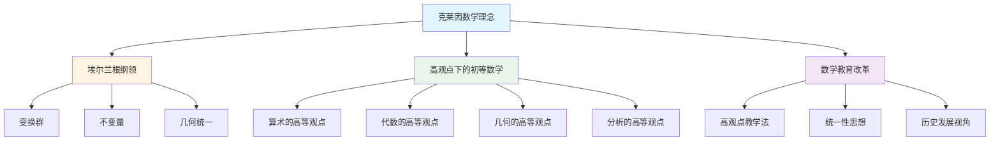
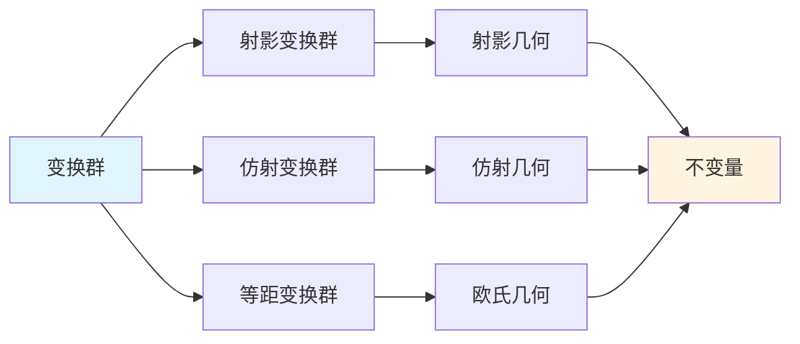
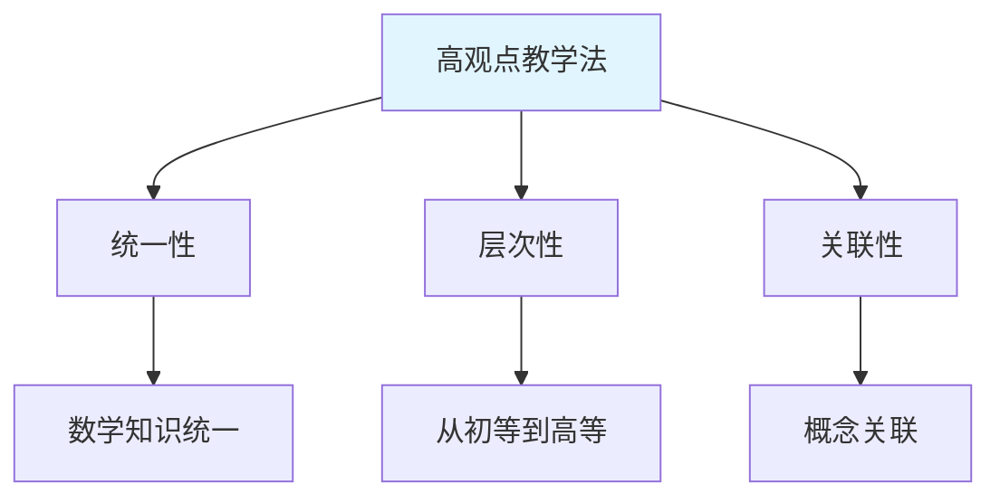

# 克莱因数学理念的概念关联网络

**创建日期**: 2025年12月4日
**研究领域**: 克莱因数学理念 - 数学知识关联分析 - 关联关系分析
**主题编号**: K.08.02.01 (Klein.数学知识关联分析.关联关系分析.概念关联网络)
**优先级**: P1（高优先级）⭐⭐⭐⭐

---

## 📑 目录

- [克莱因数学理念的概念关联网络](#克莱因数学理念的概念关联网络)
  - [📑 目录](#-目录)
  - [📋 一、概述](#-一概述)
    - [1.1 研究目标](#11-研究目标)
    - [1.2 网络构建方法](#12-网络构建方法)
    - [1.3 核心概念识别](#13-核心概念识别)
  - [🔷 二、核心概念体系](#-二核心概念体系)
    - [2.1 几何学概念](#21-几何学概念)
    - [2.2 代数学概念](#22-代数学概念)
    - [2.3 分析学概念](#23-分析学概念)
    - [2.4 教育概念](#24-教育概念)
  - [🔗 三、概念关联关系类型](#-三概念关联关系类型)
    - [3.1 包含关系](#31-包含关系)
    - [3.2 等价关系](#32-等价关系)
    - [3.3 依赖关系](#33-依赖关系)
    - [3.4 应用关系](#34-应用关系)
  - [🌐 四、概念网络可视化](#-四概念网络可视化)
    - [4.1 核心概念网络图](#41-核心概念网络图)
    - [4.2 几何学概念网络](#42-几何学概念网络)
    - [4.3 教育概念网络](#43-教育概念网络)
  - [📊 五、关联强度分析](#-五关联强度分析)
    - [5.1 强关联概念](#51-强关联概念)
    - [5.2 中等关联概念](#52-中等关联概念)
    - [5.3 弱关联概念](#53-弱关联概念)
  - [🎯 六、应用价值](#-六应用价值)
    - [6.1 对课程设计的启示](#61-对课程设计的启示)
    - [6.2 对教学组织的启示](#62-对教学组织的启示)
    - [6.3 对学习路径的启示](#63-对学习路径的启示)
  - [🌍 七、国际视角与权威对标](#-七国际视角与权威对标)
  - [🔗 八、与其他文档的关联性](#-八与其他文档的关联性)
    - [8.1 与本专题其他文档的关联](#81-与本专题其他文档的关联)
    - [8.2 与项目其他文档的关联](#82-与项目其他文档的关联)

---

## 📋 一、概述

### 1.1 研究目标

**研究目标**：

构建克莱因数学理念的完整概念关联网络，揭示：

1. **核心概念体系**：克莱因数学理念中的核心概念
2. **关联关系**：概念之间的各种关联关系
3. **网络结构**：概念网络的整体结构
4. **应用价值**：对数学教育的指导意义

### 1.2 网络构建方法

**构建方法**：

1. **概念提取**：从克莱因的著作和理念中提取核心概念
2. **关系识别**：识别概念之间的关联关系
3. **网络构建**：构建概念关联网络
4. **可视化**：使用图论方法可视化网络

### 1.3 核心概念识别

**核心概念分类**：

- **几何学概念**：变换群、不变量、射影几何等
- **代数学概念**：群、环、域等
- **教育概念**：高观点、统一性、数学化等
- **方法论概念**：公理化、形式化等

---

## 🔷 二、核心概念体系

### 2.1 几何学概念

**核心概念**：

1. **变换群（Transformation Group）** / **Transformationsgruppe**
2. **不变量（Invariant）** / **Invariante**
3. **射影几何（Projective Geometry）** / **Projektive Geometrie**
4. **欧氏几何（Euclidean Geometry）** / **Euklidische Geometrie**
5. **非欧几何（Non-Euclidean Geometry）** / **Nichteuklidische Geometrie**

**概念关系**：

- 变换群 → 不变量
- 变换群 → 几何类型
- 几何类型 → 不变量

### 2.2 代数学概念

**核心概念**：

1. **群（Group）** / **Gruppe**
2. **对称性（Symmetry）** / **Symmetrie**
3. **同构（Isomorphism）** / **Isomorphismus**
4. **代数结构（Algebraic Structure）** / **Algebraische Struktur**

### 2.3 分析学概念

**核心概念**：

1. **极限（Limit）** / **Grenzwert**
2. **连续性（Continuity）** / **Stetigkeit**
3. **严格性（Rigorousness）** / **Strenge**

### 2.4 教育概念

**核心概念**：

1. **高观点（Advanced Standpoint）** / **Höherer Standpunkt**
2. **统一性（Unity）** / **Einheitlichkeit**
3. **数学化（Mathematization）** / **Mathematisierung**

---

## 🔗 三、概念关联关系类型

### 3.1 包含关系

**定义** / **Definition**：

一个概念包含另一个概念。

**示例**：

- 变换群 ⊃ 等距变换群
- 射影几何 ⊃ 仿射几何 ⊃ 欧氏几何

### 3.2 等价关系

**定义**：

两个概念在某种意义下等价。

**示例**：

- 几何类型 ↔ 变换群（通过埃尔兰根纲领）

### 3.3 依赖关系

**定义**：

一个概念依赖于另一个概念。

**示例**：

- 不变量依赖于变换群
- 几何性质依赖于不变量

### 3.4 应用关系

**定义**：

一个概念应用于另一个概念。

**示例**：

- 群论应用于几何学
- 高观点应用于初等数学教学

---

## 🌐 四、概念网络可视化

### 4.1 核心概念网络图

### 4.2 几何学概念网络

### 4.3 教育概念网络

---

## 📊 五、关联强度分析

### 5.1 强关联概念

**强关联（Strong Association）**：

- 变换群 ↔ 不变量（核心关系）
- 几何类型 ↔ 变换群（对应关系）
- 高观点 ↔ 统一性（理念关系）

### 5.2 中等关联概念

**中等关联（Medium Association）**：

- 群论 ↔ 几何学（应用关系）
- 初等数学 ↔ 高等数学（层次关系）

### 5.3 弱关联概念

**弱关联（Weak Association）**：

- 数学教育 ↔ 数学研究（间接关系）
- 理论 ↔ 应用（一般关系）

---

## 🎯 六、应用价值

### 6.1 对课程设计的启示

**课程组织**：

- 基于概念关联网络组织课程内容
- 强调概念之间的关系
- 构建系统的知识结构

### 6.2 对教学组织的启示

**教学策略**：

- 从核心概念出发
- 沿着关联关系展开
- 建立概念网络

### 6.3 对学习路径的启示

**学习路径设计**：

- 基于概念依赖关系
- 从基础概念到高级概念
- 沿着关联路径学习

---

## 🌍 七、国际视角与权威对标

（待补充：国际视角内容）

---

## 🔗 八、与其他文档的关联性

### 8.1 与本专题其他文档的关联

- **08-数学知识关联分析/01-知识体系梳理**：知识体系基础
- **01-核心理论/01-埃尔兰根纲领**：理论基础
- **02-高观点下的初等数学**：应用领域

### 8.2 与项目其他文档的关联

- **research/06-思维表征**：概念表征方法
- **docs/04-几何学**：几何学内容

---

**创建日期**: 2025年12月4日
**最后更新**: 2025年12月4日
**状态**: ✅ 文档框架已创建，内容待完善
